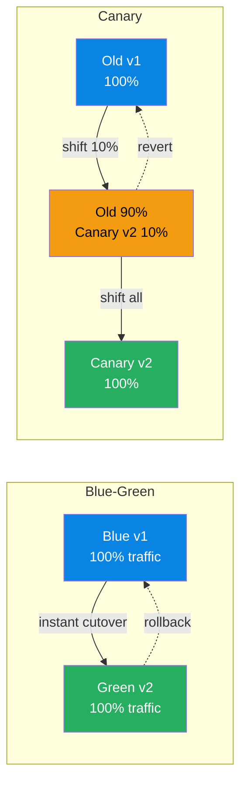

# Deployment & Release Patterns

> **Domain**: Deployment strategies, progressive delivery, feature flags, and release management patterns.
> **Parent**: [Reference Dictionary](index.md)

---

## Contents

| Term | Anchor |
|:---|:---|
| Blue-Green | [`#blue-green`](#blue-green) |
| Canary Deployment | [`#canary-deployment`](#canary-deployment) |
| Blue-Green vs Canary Deployment | [`#blue-green-vs-canary-deployment`](#blue-green-vs-canary-deployment) |
| Progressive Delivery | [`#progressive-delivery`](#progressive-delivery) |
| Feature Flag | [`#feature-flag`](#feature-flag) |
| A/B Testing | [`#ab-testing`](#ab-testing) |
| Active-Active | [`#active-active`](#active-active) |
| Shadow Testing | [`#shadow-testing`](#shadow-testing) |

---

## Blue-Green

Two **identical environments** — Blue (current) and Green (new version). Traffic is switched from Blue to Green for zero-downtime deployments. Rollback is instant: switch back to Blue.

**Also see**: [Canary Deployment](#canary-deployment)

---

## Canary Deployment

Route a **small percentage of traffic** to the new version before full rollout. If error rates spike, the canary is killed and traffic reverts. Safer than Blue-Green for high-risk changes.

**Also see**: [Blue-Green](#blue-green)

---

## Blue-Green vs Canary Deployment

Both strategies separate **deployment** (installing the new version) from **release** (exposing it to users). The difference is how traffic moves:

| Aspect | Blue-Green | Canary Deployment |
|:---|:---|:---|
| Traffic shift | Instant 0% → 100% | Gradual 0% → small % → 100% |
| Rollback speed | Immediate (switch back) | Fast (drain canary) |
| Blast radius | All users if the new version fails | Only canary users |
| Best for | Low-risk changes, predictable rollbacks | High-risk changes, sensitive services |

They are often combined: a Blue-Green pair gives you an isolated environment to canary into before committing all traffic.

**Diagram description**: Two deployment patterns shown side by side. Blue-Green (left) switches all traffic instantly from Blue v1 (blue) to Green v2 (green) with a dashed rollback arrow. Canary (right) gradually shifts traffic from Old v1 (blue) to a mix of Old 90% + Canary v2 10% (yellow), then to Canary v2 100% (green), with a dashed revert arrow to the old version.

---

## Progressive Delivery

An umbrella term for **gradually exposing new code to users** using techniques such as canary releases, feature flags, blue-green deployments, A/B testing and load-balanced rollouts. It decouples deployment from release.

### Key Characteristics
- **Controlled blast radius**: new code reaches a small subset first
- **Measurable gating**: promote or rollback based on error rates, latency and business metrics
- **User segmentation**: target by region, device, customer tier or random percentage

### When to Use
- High-risk changes in large-scale services
- Products where business metrics must validate a change before full rollout

### When NOT to Use
- For trivial changes where the overhead of gating exceeds the risk
- Without automated rollback and clear success criteria

**Also see**: [Canary Deployment](#canary-deployment), [Blue-Green](#blue-green), [Feature Flag](#feature-flag), [A/B Testing](#ab-testing)

---

## Feature Flag

A software development technique that wraps functionality in a **runtime-controllable toggle**, allowing teams to enable, disable or gradually roll out features without deploying new code.

### Key Characteristics
- **Decouples deploy from release**: code can ship dark and be enabled later
- **Targeted rollout**: per user, per segment, per region or percentage-based
- **Kill switch**: problematic features can be turned off instantly

### When to Use
- Long-running features that must be merged incrementally
- High-risk changes requiring instant rollback
- A/B tests and phased rollouts

### When NOT to Use
- As a substitute for branch-based development discipline (flag debt accumulates)
- When the flag adds runtime complexity without clear value

**Also see**: [Progressive Delivery](#progressive-delivery), [A/B Testing](#ab-testing)

---

## A/B Testing

A controlled experiment where **two or more variants of a product experience are served to different user groups** to measure the impact on a business or user-experience metric.

### Key Characteristics
- **Randomized assignment**: users are bucketed to reduce selection bias
- **Hypothesis and metric**: every test has a primary success metric and stopping criteria
- **Statistical rigor**: requires sufficient sample size and significance testing

### When to Use
- Validating product changes, algorithms or UI designs with real user behavior
- Decisions where multiple options are defensible and data should break the tie

### When NOT to Use
- For changes with clear correctness or safety requirements (prefer canary metrics instead)
- When sample sizes are too small to reach statistical significance

**Also see**: [Feature Flag](#feature-flag), [Progressive Delivery](#progressive-delivery)

---

## Active-Active

A high-availability deployment pattern where **multiple data centers or regions actively serve traffic and accept writes simultaneously**, rather than one being on standby.

### Key Characteristics
- **Traffic served from multiple regions**: lower latency and better fault tolerance
- **Data synchronization**: replicas exchange writes, requiring conflict resolution
- **Complexity trade-off**: adds consistency challenges in exchange for resilience

### When to Use
- Globally distributed users requiring low-latency writes
- Mission-critical systems where a single region failure must be transparent

### When NOT to Use
- When strong consistency is more important than availability during partitions
- Without a clear conflict-resolution strategy (e.g., CRDTs, last-write-wins, custom merge)

**Also see**: [CRDT](data-concurrency.md#crdt-conflict-free-replicated-data-type), [CAP Theorem](data-architecture.md#cap-theorem)

---

## Shadow Testing

A validation technique where production traffic is **duplicated and sent to a new version or service without affecting real users**. Responses are compared between the old and new systems to detect regressions.

### Key Characteristics
- **Non-impactful**: users see only the production response; the shadow result is discarded
- **High-fidelity workload**: tests against real traffic patterns, not synthetic loads
- **Comparison metrics**: latency, errors, response payloads and resource usage

### When to Use
- Refactoring or re-platforming systems where behavioral equivalence must be proven
- Load-testing new versions with production-scale traffic

### When NOT to Use
- When the operation has side effects (e.g., payments, writes) that cannot be isolated
- Without a safe way to capture, compare and discard shadow responses

**Also see**: [Canary Deployment](#canary-deployment), [Progressive Delivery](#progressive-delivery)
