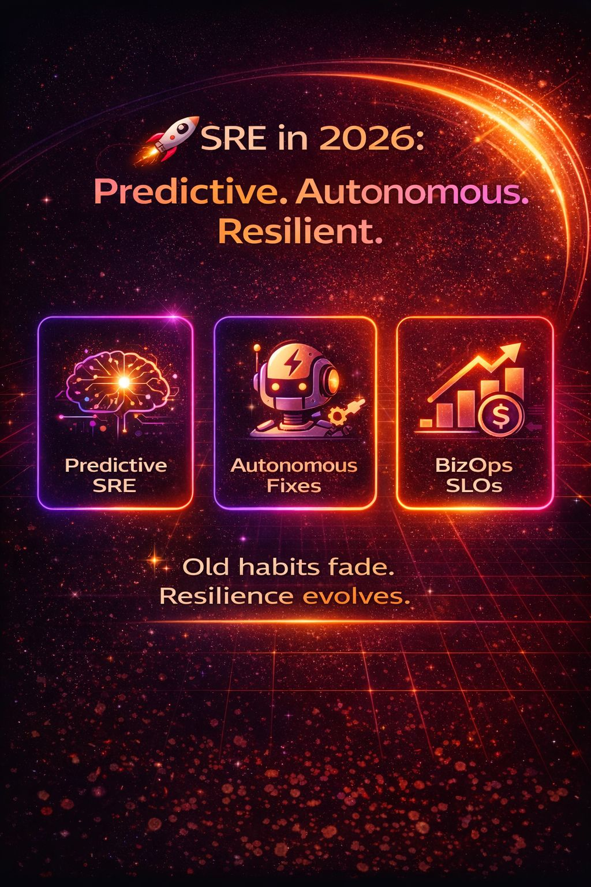

# Predictive SRE: From Reactive to Proactive Reliability

How high-performing SRE teams are shifting from **reactive → predictive**.

## 1. Alert Flood → Predictive SRE

- **Past:** Alert on everything → burnout.
- **Now:** AI forecasts anomalies (retry storms, queue buildup) **20–30 min before impact**.

## 2. Manual Toil → Autonomous Actions

- **Past:** Scripts reduce toil.
- **Now:** AI agents trigger rollback, scale-out, isolation → **40–70% less toil**.

## 3. Manual Correlation → AI-First Telemetry

- **Past:** Logs + metrics + traces = manual stitching.
- **Now:** AI unifies telemetry → *"why slow?"* answered in **seconds**, not hours.

## 4. Technical Metrics → Business SLOs

- **Past:** "API latency < 200ms."
- **Now:** "Checkout success ≥ 99.95%." Reliability = **revenue protection**.

## 2026 Formula

> **Resilience = Prediction + Autonomy + Business Context**

Still reacting to alerts? Or letting AI prevent the fire before it starts?
