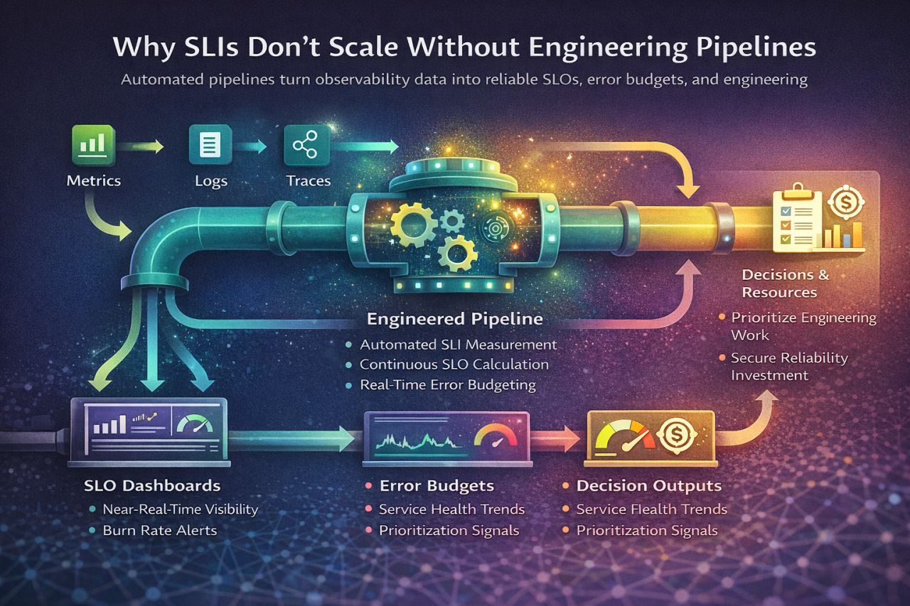

# Why SLIs Don't Scale Without Engineering Pipelines

Most teams define SLIs correctly.
The problem is **how they measure them**.

Dashboards, ad-hoc queries, and manual reporting work at small scale — but they break as soon as reliability needs to be measured consistently across services, tenants, or regions.

## SLIs Become Unreliable When

- Different teams calculate them differently
- Dashboards drift out of sync
- Monthly reports require manual effort
- Data breaks during incidents — exactly when it matters most

## Calculating Impact Is Not Always Straightforward

When an incident affects multiple applications or user journeys, impact counts easily become inconsistent.
Downstream service failures add even more complexity, often distorting SLO calculations if not properly attributed.

SLIs fail not because the definitions are wrong, but because **the implementation isn't engineered**.

## Real SRE Maturity Requires SLI Pipelines

- **Automated data collection** from metrics, logs, and traces
- **Normalization and validation** across services
- **Continuous SLO & error-budget computation**
- **Consistent outputs** for dashboards, alerts, and reports

## Impact Counts Drive Prioritization

Without engineered pipelines, **impact counts can't be calculated correctly** — which directly affects how we prioritize permanent engineering fixes.
If the impact is unclear or inconsistent, the backlog becomes driven by opinions instead of data.

## Monthly Reporting Alone Is Not Enough

By the time a monthly report is produced, the damage is already done.
**Near-real-time SLO dashboards give SRE teams visibility, credibility, and the ability to influence resourcing for long-term service quality.**

When reliability must be measured per business function — or per tenant, or per region in global platforms — manual SLIs collapse completely. Pipelines are the only scalable solution.

## When SLIs Become Objective, Comparable, and Usable

- Incident impact becomes clear
- Error-budget burn becomes visible
- Prioritization becomes data-driven
- Monthly reports become automatic

SLIs don't create reliability.
**Engineering pipelines do.**

