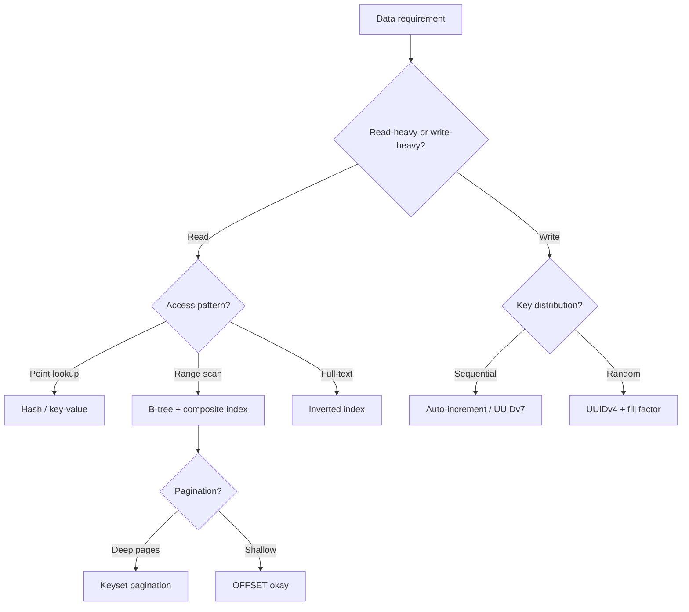

# 1. Databases & Query Performance

> **Parent**: [System Design Interview Reference](README.md)  
> **Source**: [20 Design Interview Questions](../../articles/medium/20-design-interview-questions.md) — Questions #1–4

---

## P1: Random UUID Indexing

| | |
|:---|:---|
| **Problem** | `INSERT` performance degrades as table grows; high disk I/O; index fragmentation |
| **Root cause** | UUIDv4 values are cryptographically random — every insert lands at a random B-tree leaf page, causing page splits across the entire index |

**Strategy**:

| Approach | How | When to use |
|:---|:---|:---|
| **UUIDv7 / ULID** | First 48 bits = Unix timestamp → roughly sequential inserts | Default choice for distributed systems |
| **Sequential IDs** | `BIGSERIAL` / `AUTO_INCREMENT` | Single-DB, no distribution needed |
| **Cluster on business key** | Keep UUID PK but cluster on `(tenant_id, created_at)` | Multi-tenant, query by tenant |
| **Fill factor tuning** | `FILLFACTOR=80` — leave 20% free per page | Mitigation when you can't change the key type |

**Tradeoff**: UUIDv7 leaks creation time (privacy concern for user-facing IDs). ULID is case-insensitive, UUIDv7 is standard (RFC 9562).

> **Azure**: [Azure SQL indexing](../../architecture-azure/data/databases/) | **General**: §3.3 Data Architecture

---

## P2: Keyset Pagination

| | |
|:---|:---|
| **Problem** | `SELECT ... LIMIT 20 OFFSET 1000000` scans 1,000,020 rows to return 20 — time grows linearly with offset |
| **Root cause** | Database must scan and discard all skipped rows |

**Strategy**:

```sql
-- ❌ O(n): scans everything
SELECT * FROM users ORDER BY id LIMIT 20 OFFSET 1000000;

-- ✅ O(1): seeks to cursor position
SELECT * FROM users WHERE id > 1042 ORDER BY id LIMIT 21;
```

Fetch `LIMIT page_size + 1` to detect whether a next page exists — no `COUNT(*)` needed.

| Aspect | OFFSET/LIMIT | Keyset |
|:---|:---|:---|
| Performance | $O(n)$ degrades with depth | $O(1)$ constant |
| Jump to page N | Easy | Not possible |
| Requires unique sort column | No | Yes (+ tiebreaker) |
| Tolerates inserts mid-pagination | Yes | Can shift cursor |

**Implementation checklist**:
1. Identify a unique, indexed, sortable column (or composite: `(created_at, id)`)
2. Add `WHERE column > :last_seen_value`
3. Fetch `page_size + 1` to detect `has_next`
4. Return cursor to client

> **Azure**: Cosmos DB continuation tokens natively implement this pattern | **General**: §2.2 Query Optimization

---

## P3: Composite Index vs. Separate Indexes

| | |
|:---|:---|
| **Problem** | Query filters by column `A` and sorts by column `B` — database scans slowly despite having separate indexes on `A` and `B` |
| **Root cause** | Database uses only one index per table scan; separate indexes can't satisfy both filter and sort |

**Strategy — the Leftmost Prefix Rule**:

Index on `(A, B)` can serve:

| Query | Uses index? |
|:---|:---:|
| `WHERE A = ? AND B = ?` | ✅ Full |
| `WHERE A = ?` | ✅ Partial (leftmost prefix) |
| `WHERE A = ? ORDER BY B` | ✅ Filter + sort — no filesort |
| `WHERE A = ? AND B > ?` | ✅ Range scan within A |
| `WHERE B = ?` | ❌ Skips leftmost column |

**Column order heuristic**:
- Equality filters first, range filters last
- Most selective column first (reduces scan range fastest)
- If you query `(user_id, status)` AND `(user_id)` alone → `(user_id, status)` covers both

> **Azure**: [Azure SQL indexes](../../architecture-azure/data/databases/) | **General**: §2.2 Query Optimization

---

## P4: N+1 Query Problem

| | |
|:---|:---|
| **Problem** | 1 query for a list, then N queries for each item's associations → 101 queries for a 100-item page |
| **Root cause** | ORM lazy loading is the default; each access to an unloaded association triggers a separate query |

**Strategy**:

| Approach | Mechanism | Example |
|:---|:---|:---|
| **Eager loading** | ORM directive to JOIN in the same query | `Post.includes(:author)` (Rails), `select_related('author')` (Django) |
| **Batch loading** | Collect foreign keys → `WHERE id IN (...)` | Manual control when ORM abstraction hurts |
| **DataLoader pattern** | Per-request cache that deduplicates + batches within a tick | GraphQL (Facebook's DataLoader) |

**Detection in production**:
- Rails `bullet` gem, Django `nplusone`, Laravel debugbar (dev)
- Datadog / New Relic query-spike alerts (prod)
- Database slow-query log: repeated identical queries with different IDs in one trace

> **Azure**: App Insights query dependency tracking surfaces N+1 as repeated DB calls | **General**: §2.3 ORM Patterns

---

## Decision Flowchart: Data Layer Design


