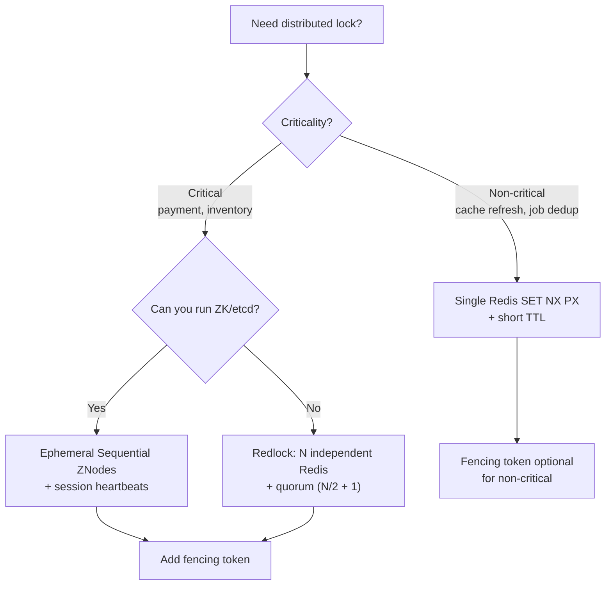

# 2. Concurrency & Transactions

> **Parent**: [System Design Interview Reference](index.md)  
> **Source**: [20 Design Interview Questions](../articles/medium/20-design-interview-questions.md) — Questions #5–8

---

## tx-01: Double-Booking

> **Source**: [20 Design Interview Questions](../articles/medium/20-design-interview-questions.md) — Q#5


| | |
|:---|:---|
| **Problem** | Two users book the same seat/room/resource |
| **Root cause** | Check-then-act is not atomic across multiple application servers |

**Strategy**:

| Approach | Mechanism | When to use |
|:---|:---|:---|
| **`SELECT ... FOR UPDATE`** | Row-level lock within a transaction | High contention, correctness-critical (ticketing) |
| **Optimistic locking** | Version column: `UPDATE ... WHERE version = ?` — retry on zero rows affected | Low contention (profile edits) |
| **Unique constraint** | `UNIQUE(seat_id, event_id)` — let the DB reject duplicates | Simple resources, no business logic needed |
| **Serializable isolation** | `BEGIN TRANSACTION ISOLATION LEVEL SERIALIZABLE` — retry on serialization failure | When multiple tables must stay consistent |

> **Azure**: Service Bus duplicate detection + Cosmos DB optimistic concurrency (ETags) | **General**: [Saga Pattern](../architecture-general/03-integration-communication-architecture/messaging-patterns/saga-pattern.md)

---

## tx-02: Isolation Levels

> **Source**: [20 Design Interview Questions](../articles/medium/20-design-interview-questions.md) — Q#6


| | |
|:---|:---|
| **Problem** | Concurrent transactions produce incorrect results (lost updates, non-repeatable reads, phantom reads) |
| **Root cause** | Default isolation (Read Committed in PostgreSQL) allows certain anomalies |

**Strategy**:

| Isolation Level | Prevents Dirty Read | Prevents Non-Repeatable Read | Prevents Phantom Read | PostgreSQL default? |
|:---|:---:|:---:|:---:|:---:|
| Read Uncommitted | ❌ | ❌ | ❌ | — |
| **Read Committed** | ✅ | ❌ | ❌ | **Yes** |
| Repeatable Read | ✅ | ✅ | ✅ (in PG*) | — |
| Serializable | ✅ | ✅ | ✅ | Use `SET TRANSACTION ISOLATION LEVEL SERIALIZABLE` |

> *PostgreSQL's Repeatable Read uses SI (Snapshot Isolation) which also prevents phantoms — but this is PG-specific. Not portable.

**Heuristic**: Start at Read Committed. Escalate to Serializable when:
- Money is involved (double-spend risk)
- Multiple rows/tables must stay consistent
- You cannot redesign the access pattern to avoid the anomaly

> **Azure**: Azure SQL supports all four isolation levels; Cosmos DB uses snapshot isolation by default  
> **Also see**: [`sqld-07`: Staff Engineer's 5 Questions](19-sql-system-design-takeaways.md#sqld-07-staff-engineers-5-questions) — consistency requirements, and [`sqld-02`: SQL vs NoSQL](19-sql-system-design-takeaways.md#sqld-02-sql-vs-nosql-decision-framework) — ACID as decision factor

---

## tx-03: Distributed Locks

> **Source**: [20 Design Interview Questions](../articles/medium/20-design-interview-questions.md) — Q#7


| | |
|:---|:---|
| **Problem** | Multiple workers need exclusive access to a shared resource across servers |
| **Root cause** | In-process mutexes don't cross server boundaries; single Redis lock is a SPOF |

**Strategy**:



| Aspect | Single Redis | Redlock | ZooKeeper / etcd |
|:---|:---|:---|:---|
| Safety | Low (SPOF) | Medium (Kleppmann critique) | High (Raft consensus) |
| Performance | ~1ms | ~1-2ms (multiple instances) | ~5-10ms |
| Complexity | Minimal | Moderate | High (cluster ops) |
| Best for | Non-critical | High-throughput, short-lived | Correctness-critical |

**The fencing token pattern** — always mention this:

```
Client A acquires lock → token 17
Client A GC paused → lock expires
Client B acquires lock → token 18
Client A resumes → writes with token 17 → RESOURCE REJECTS (18 > 17)
```

> **Azure**: Blob Storage leases (1min default), Cosmos DB ETags | **Taxonomy**: §7.1 Reliability Architecture — Resilience Patterns

---

## tx-04: Idempotency

> **Source**: [20 Design Interview Questions](../articles/medium/20-design-interview-questions.md) — Q#8


| | |
|:---|:---|
| **Problem** | Client sends payment twice → charged twice |
| **Root cause** | Network failure between server processing and client receiving response — client retries, server replays |

**Strategy**:

```
Client → POST /payments
         Header: Idempotency-Key: a1b2c3d4-e5f6-...
         
Server → Check idempotency store for key "a1b2c3d4"
         ├─ FOUND → Return cached response (201 + same body)
         └─ NOT FOUND → Process payment
                        → Store (key → response) in same transaction
                        → Return 201
```

| Storage option | Mechanism | Best for |
|:---|:---|:---|
| **Database row** | `INSERT` idempotency key + response atomically with business write | Strongest consistency |
| **Redis** | `SET key response NX EX 86400` (24h TTL) | Faster, but risk of eviction under memory pressure |
| **API Gateway** | Built-in idempotency (Stripe-style) | Offload from application |

> **Azure**: Service Bus duplicate detection (configurable window) | **General**: [Idempotency Store Pattern](../architecture-general/03-integration-communication-architecture/messaging-patterns/idempotency-store-pattern.md)

---

## tx-05: Locks for Coordination, Database for Correctness

> **Source**: [The Double-Booking Trap in Distributed Systems](../articles/medium/The%20Double-Booking%20Trap%20in%20Distributed%20Systems%20Why%20Locks%20Alone%20Fail%20to%20Guarantee%20Correctness.md)
> **Also see**: [Distributed Lock](../reference-dictionary/data-concurrency.md#distributed-lock), [Fencing Token](../reference-dictionary/data-concurrency.md#fencing-token)

| | |
|:---|:---|
| **Problem** | Two users both book the same resource even though a distributed lock was held |
| **Root cause** | Lease-based locks expire before the database write commits; GC pauses, network jitter, clock skew, and retry storms can all exceed the lease window |

**Strategy**: Design the system to be correct without any lock, then add locks only as a performance optimization. Enforce the invariant at the database layer using constraints, atomic conditional updates, or serializable isolation.

**Tradeoff**: Locks improve latency and reduce contention, but they are best-effort coordination, not a correctness guarantee. Relying on longer timeouts reduces throughput and increases tail latency without fixing the root cause.

> **Azure**: Blob Storage leases (1 min default), Cosmos DB optimistic concurrency with ETags | **Taxonomy**: §7.1 Reliability Architecture — Resilience Patterns

---

## tx-06: Database Invariants Over Lock Timeouts

> **Source**: [The Double-Booking Trap in Distributed Systems](../articles/medium/The%20Double-Booking%20Trap%20in%20Distributed%20Systems%20Why%20Locks%20Alone%20Fail%20to%20Guarantee%20Correctness.md)
> **Also see**: [Double-Booking Problem](../reference-dictionary/data-concurrency.md#double-booking-problem), [Exclusion Constraint](../reference-dictionary/data-concurrency.md#exclusion-constraint), [Atomic Conditional Update](../reference-dictionary/data-concurrency.md#atomic-conditional-update)

| | |
|:---|:---|
| **Problem** | Check-then-act allows two concurrent transactions to see "available" and both insert a booking |
| **Root cause** | The database does not enforce the invariant "only one booking per room/date range" and the availability check is not atomic with the write |

**Strategy**: Make the database the final arbiter of truth.

| Technique | Mechanism | Best for |
|:---|:---|:---|
| **Unique constraint** | `UNIQUE(room_id, date)` | Exact single-date matches |
| **Exclusion constraint** | `EXCLUDE USING gist (room_id WITH =, daterange(...) WITH &&)` | Date-range overlap prevention |
| **Atomic conditional update** | `UPDATE inventory SET available=false WHERE room_id=101 AND available=true` | Single-row inventory flags |
| **Row-level locking** | `SELECT ... FOR UPDATE` | High-contention critical sections |
| **Serializable isolation** | `SET TRANSACTION ISOLATION LEVEL SERIALIZABLE` + retry | Multi-row/table invariants |

**Tradeoff**: Stronger guarantees increase contention, latency, and retry rates. Start with cheap constraints, escalate to locking or serializable isolation only when needed.

> **Azure**: Azure SQL supports unique/exclusion constraints and all isolation levels; Cosmos DB supports unique keys and optimistic concurrency | **Taxonomy**: §4.0 Data Architecture Fundamentals

---

## tx-07: Post-Commit Confirmation and Events

> **Source**: [The Double-Booking Trap in Distributed Systems](../articles/medium/The%20Double-Booking%20Trap%20in%20Distributed%20Systems%20Why%20Locks%20Alone%20Fail%20to%20Guarantee%20Correctness.md)
> **Also see**: [Outbox Pattern](../reference-dictionary/cqrs-event-driven.md#outbox-pattern), [Dual-Write Problem](../reference-dictionary/cqrs-event-driven.md#dual-write-problem), [Change Data Capture](../reference-dictionary/data-concurrency.md#change-data-capture), [Idempotency-Key](../reference-dictionary/api-design.md#idempotency-key)

| | |
|:---|:---|
| **Problem** | A user receives a booking confirmation or a downstream event is emitted for a transaction that ultimately rolls back |
| **Root cause** | Confirmations and events are sent before the database transaction commits, creating a window where the system state and external communication disagree |

**Strategy**: Emit events and confirmations only after the transaction commits. Use the [transactional outbox pattern](../architecture-general/03-integration-communication-architecture/messaging-patterns/outbox-pattern.md), [Change Data Capture (CDC)](../reference-dictionary/data-concurrency.md#change-data-capture), or post-commit hooks. Pair with idempotency keys so retries do not create duplicates.

**Tradeoff**: Post-commit dispatch adds a persistence and coordination step, but it prevents false positives and makes retries safe.

> **Azure**: Azure Service Bus duplicate detection, Azure SQL Change Tracking / CDC, Azure Event Hubs capture | **Taxonomy**: §4.3 Streaming & Real-Time Architecture — Change Data Capture (CDC)
