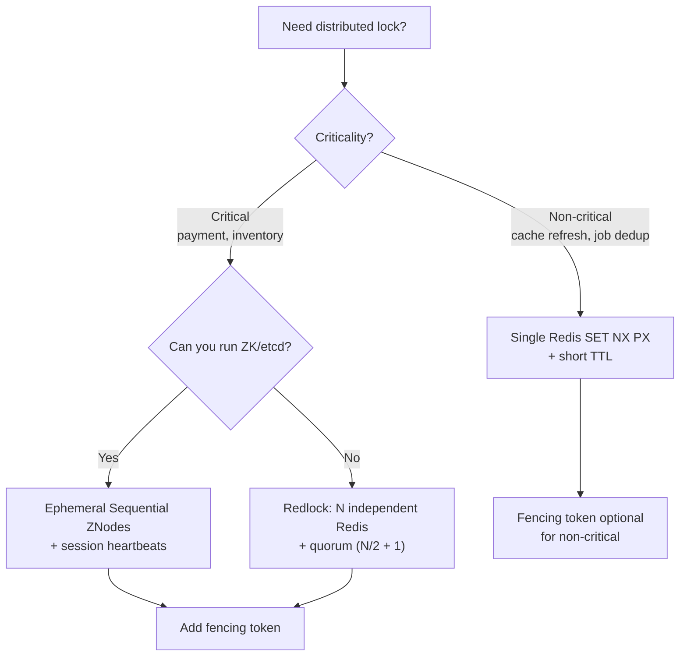

# 2. Concurrency & Transactions

> **Parent**: [System Design Interview Reference](README.md)  
> **Source**: [20 Design Interview Questions](../../articles/medium/20-design-interview-questions.md) — Questions #5–8

---

## P5: Double-Booking

| | |
|:---|:---|
| **Problem** | Two users book the same seat/room/resource |
| **Root cause** | Check-then-act is not atomic across multiple application servers |

**Strategy**:

| Approach | Mechanism | When to use |
|:---|:---|:---|
| **`SELECT ... FOR UPDATE`** | Row-level lock within a transaction | High contention, correctness-critical (ticketing) |
| **Optimistic locking** | Version column: `UPDATE ... WHERE version = ?` — retry on zero rows affected | Low contention (profile edits) |
| **Unique constraint** | `UNIQUE(seat_id, event_id)` — let the DB reject duplicates | Simple resources, no business logic needed |
| **Serializable isolation** | `BEGIN TRANSACTION ISOLATION LEVEL SERIALIZABLE` — retry on serialization failure | When multiple tables must stay consistent |

> **Azure**: Service Bus duplicate detection + Cosmos DB optimistic concurrency (ETags) | **General**: [Saga Pattern](../../architecture-general/03-integration-communication-architecture/messaging-patterns/saga-pattern.md)

---

## P6: Isolation Levels

| | |
|:---|:---|
| **Problem** | Concurrent transactions produce incorrect results (lost updates, non-repeatable reads, phantom reads) |
| **Root cause** | Default isolation (Read Committed in PostgreSQL) allows certain anomalies |

**Strategy**:

| Isolation Level | Prevents Dirty Read | Prevents Non-Repeatable Read | Prevents Phantom Read | PostgreSQL default? |
|:---|:---:|:---:|:---:|:---:|
| Read Uncommitted | ❌ | ❌ | ❌ | — |
| **Read Committed** | ✅ | ❌ | ❌ | **Yes** |
| Repeatable Read | ✅ | ✅ | ✅ (in PG*) | — |
| Serializable | ✅ | ✅ | ✅ | Use `SET TRANSACTION ISOLATION LEVEL SERIALIZABLE` |

> *PostgreSQL's Repeatable Read uses SI (Snapshot Isolation) which also prevents phantoms — but this is PG-specific. Not portable.

**Heuristic**: Start at Read Committed. Escalate to Serializable when:
- Money is involved (double-spend risk)
- Multiple rows/tables must stay consistent
- You cannot redesign the access pattern to avoid the anomaly

> **Azure**: Azure SQL supports all four isolation levels; Cosmos DB uses snapshot isolation by default

---

## P7: Distributed Locks

| | |
|:---|:---|
| **Problem** | Multiple workers need exclusive access to a shared resource across servers |
| **Root cause** | In-process mutexes don't cross server boundaries; single Redis lock is a SPOF |

**Strategy**:



| Aspect | Single Redis | Redlock | ZooKeeper / etcd |
|:---|:---|:---|:---|
| Safety | Low (SPOF) | Medium (Kleppmann critique) | High (Raft consensus) |
| Performance | ~1ms | ~1-2ms (multiple instances) | ~5-10ms |
| Complexity | Minimal | Moderate | High (cluster ops) |
| Best for | Non-critical | High-throughput, short-lived | Correctness-critical |

**The fencing token pattern** — always mention this:

```
Client A acquires lock → token 17
Client A GC paused → lock expires
Client B acquires lock → token 18
Client A resumes → writes with token 17 → RESOURCE REJECTS (18 > 17)
```

> **Azure**: Blob Storage leases (1min default), Cosmos DB ETags | **General**: §7.2 Distributed Coordination

---

## P8: Idempotency

| | |
|:---|:---|
| **Problem** | Client sends payment twice → charged twice |
| **Root cause** | Network failure between server processing and client receiving response — client retries, server replays |

**Strategy**:

```
Client → POST /payments
         Header: Idempotency-Key: a1b2c3d4-e5f6-...
         
Server → Check idempotency store for key "a1b2c3d4"
         ├─ FOUND → Return cached response (201 + same body)
         └─ NOT FOUND → Process payment
                        → Store (key → response) in same transaction
                        → Return 201
```

| Storage option | Mechanism | Best for |
|:---|:---|:---|
| **Database row** | `INSERT` idempotency key + response atomically with business write | Strongest consistency |
| **Redis** | `SET key response NX EX 86400` (24h TTL) | Faster, but risk of eviction under memory pressure |
| **API Gateway** | Built-in idempotency (Stripe-style) | Offload from application |

> **Azure**: Service Bus duplicate detection (configurable window) | **General**: [Idempotency Store Pattern](../../architecture-general/03-integration-communication-architecture/messaging-patterns/idempotency-store-pattern.md)
