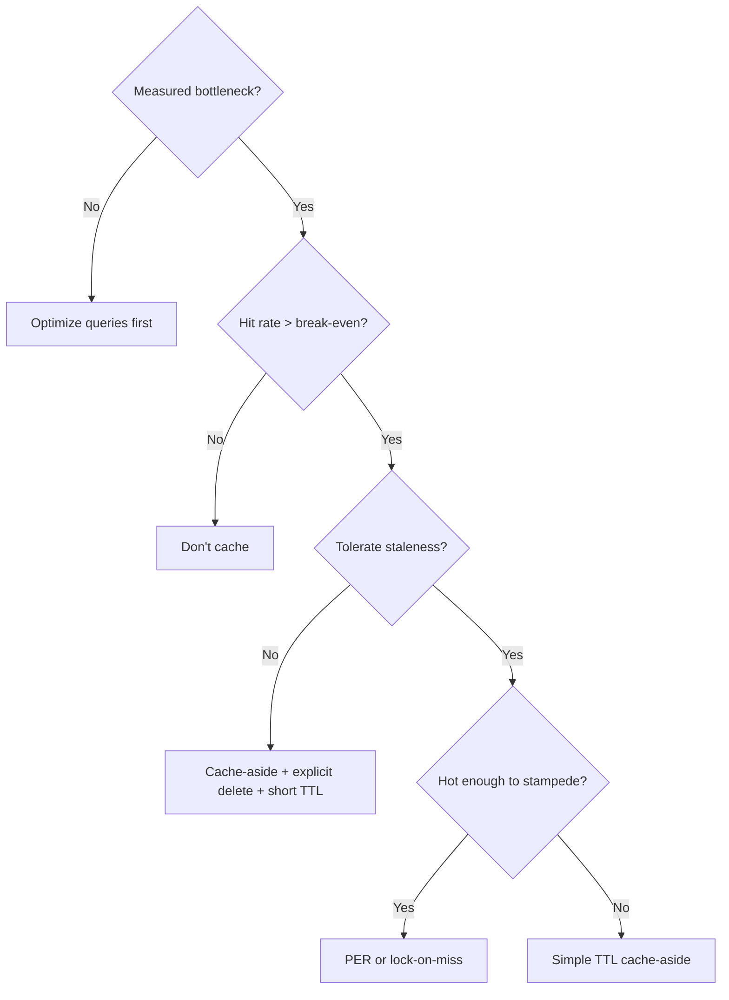

# 3. Caching Architecture

> **Parent**: [System Design Interview Reference](README.md)  
> **Source**: [20 Design Interview Questions](../../articles/medium/20-design-interview-questions.md) — Questions #9–12

---

## P9: Cache Stampede

| | |
|:---|:---|
| **Problem** | Popular cache key expires → 200 concurrent requests all hit the database simultaneously → DB crushed |
| **Root cause** | All requests discover the cache miss at the same instant and race to regenerate |

**Strategy**:

| Strategy | Mechanism | Staleness | Complexity | Best for |
|:---|:---|:---:|:---:|:---|
| **PER (Probabilistic Early Recomp.)** | Random early refresh near TTL: $P(refresh) = \frac{\Delta}{\beta \cdot ttl + \Delta}$ | Low | Low | Default choice |
| **Lock-on-Miss** | Only one request regenerates; others wait | None | Low | Cannot tolerate staleness |
| **External refresh** | Cron job refreshes before expiry | None | High | Predictably hot keys |
| **GETEX** (Redis 6.2+) | Atomic get + TTL reset on every read | None | Minimal | Perennially hot keys |

```python
# PER implementation
def should_refresh(ttl_ms, delta=1000, beta=1.0):
    if ttl_ms <= 0:
        return True
    return random.random() < delta / (beta * ttl_ms + delta)
```

> **Azure**: Azure Cache for Redis 6.2+ supports `GETEX` | **General**: §7.3 Caching Strategies

---

## P10: Cache Invalidation

| | |
|:---|:---|
| **Problem** | User updates email → stale profile in cache |
| **Root cause** | Write path doesn't invalidate or update the cache |

**Strategy — the pragmatic answer**:

```
Cache-Aside + Explicit Delete on Write + TTL Safety Net

WRITE: DB UPDATE → cache DEL user:42
READ:  cache GET → miss → DB SELECT → cache SET user:42 (TTL: 300s)
```

| Write Pattern | How it works | Key risk |
|:---|:---|:---|
| **Cache-Aside** | App manages cache; delete on write | Race: stale data re-enters cache |
| **Write-Through** | Write to cache → sync to DB | Every write touches cache |
| **Write-Behind** | Write to cache → async flush to DB | Data loss if cache crashes |
| **Refresh-Ahead** | Cache preloads before expiry | Complex tuning |

**CDC alternative** (for multi-service scenarios): Debezium tails DB WAL → emits change events to Kafka → cache invalidation consumer updates/deletes keys. Decouples invalidation from application code.

> **Azure**: Azure Cache for Redis | **General**: §7.3 Caching Strategies

---

## P11: Caching Anti-Patterns

| | |
|:---|:---|
| **Problem** | Adding Redis made the system slower, not faster |
| **Root cause** | Cache hit rate too low — paying network hop cost on every miss |

**Break-even formula**:

$$\text{Caching helps when: } hit\_rate > \frac{cache\_latency}{db\_latency}$$

| Scenario | Hit Rate | Avg Latency | Net Effect |
|:---|:---:|:---|:---|
| No cache | — | 3ms | Baseline |
| 90% hit | 90% | 1ms × 0.9 + 4ms × 0.1 = **1.3ms** | ✅ Faster |
| 50% hit | 50% | 1ms × 0.5 + 4ms × 0.5 = **2.5ms** | ⚠️ Marginal |
| 10% hit | 10% | 1ms × 0.9 + 4ms × 0.1 = **3.7ms** | ❌ Slower |

**When not to cache**:
1. Uniform access pattern (every key equally likely → 0% benefit)
2. Highly volatile data (changes faster than TTL)
3. Cache becomes SPOF (no graceful degradation path)
4. Serialization cost exceeds query cost

```python
# ❌ Cache or die
value = redis.get(key)
if value: return value
return db.query(...)

# ✅ Cache optionally — graceful degradation
try:
    value = redis.get(key)
    if value: return value
except RedisError:
    metrics.incr("cache.error")
return db.query(...)
```

> **Azure**: App Insights for cache hit ratio monitoring | **General**: §7.3 Caching Strategies

---

## P12: Eviction Policies

| | |
|:---|:---|
| **Problem** | Users randomly logged out under load, or hot content evicted while cold content stays |
| **Root cause** | Wrong `maxmemory-policy` for the workload |

**Strategy — match policy to workload**:

| Workload | Policy | Why |
|:---|:---|:---|
| **User sessions** | `volatile-ttl` | Eviction = forced logout. Let natural TTL govern. Evict near-expiry first. |
| **Content feeds / timelines** | `allkeys-lru` or `allkeys-lfu` | Hot content (5% of keys, 95% of reads) survives; cold evicted. |
| **Rate limit counters** | `volatile-ttl` | Window expiry = natural eviction. |
| **API response cache** | `allkeys-lru` | Frequently hit endpoints stay warm. |
| **Leaderboards** | `noeviction` | Need all data; scale memory instead. |
| **Distributed locks** | `noeviction` | Never silently evict a lock — safety risk. |

**Redis policy reference**:

| Policy | Scope | Rule |
|:---|:---|:---|
| `noeviction` | — | Error on write when full |
| `allkeys-lru` | All keys | Approximated LRU |
| `allkeys-lfu` | All keys | Approximated LFU (4.0+) |
| `volatile-lru` | Keys with TTL | Approximated LRU |
| `volatile-lfu` | Keys with TTL | Approximated LFU |
| `volatile-ttl` | Keys with TTL | Shortest remaining TTL first |
| `allkeys-random` | All keys | Random eviction |

> **Azure**: Azure Cache for Redis — set `maxmemory-policy` via Azure Portal or CLI | **General**: §7.3 Caching Strategies

---

## Decision Flowchart: Caching


