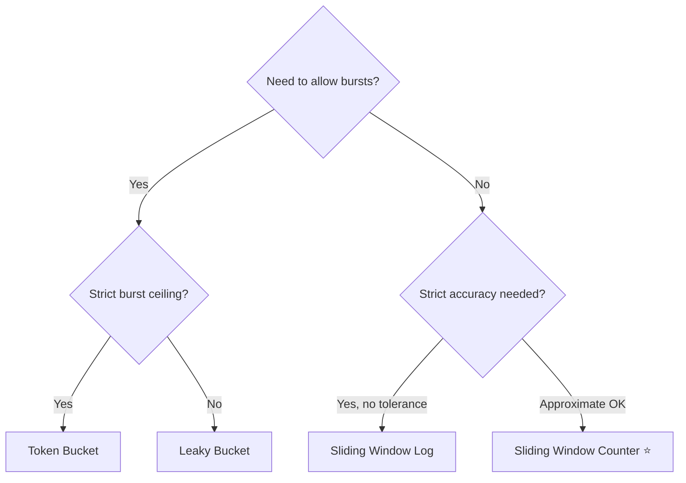

# 4. APIs & Network Design

> **Parent**: [System Design Interview Reference](index.md)  
> **Source**: [20 Design Interview Questions](../../articles/medium/20-design-interview-questions.md) — Questions #13–16, [System Design Interview: API Rate Limiter](../../articles/medium/system-design-interview-api-rate-limiter-distributed.md)  
> **Also see**: [Discord Data Architecture](../../articles/medium/discord-data-architecture-master-class.md) — Consistent hash routing, request coalescing

---

## api-01: API Versioning

> **Source**: [20 Design Interview Questions](../../articles/medium/20-design-interview-questions.md) — Q#13


| | |
|:---|:---|
| **Problem** | API change breaks old mobile clients that haven't been updated in years |
| **Root cause** | Removing or renaming fields — mobile apps live on devices far longer than web apps |

**Strategy — the "only add" principle**:

```
Versioning approach:
  PATH:    /api/v1/users  →  /api/v2/users
  HEADER:  Accept: application/vnd.api+v2+json
  QUERY:   /api/users?version=2

Payload evolution:
  1. Add new fields (never remove old ones)
  2. Mark old fields @Deprecated in docs
  3. Monitor usage of deprecated fields
  4. Remove only when usage = 0 for N months
```

| Approach | Pros | Cons |
|:---|:---|:---|
| **URL path** (`/v1/`, `/v2/`) | Explicit, easy to route, CDN-friendly | URL pollution, duplicate routes |
| **Accept header** | Clean URLs, REST-purist | Harder to test in browser, CDN caching complications |
| **Query param** | Simple | Not RESTful, pollutes query namespace |

> **Azure**: API Management versioning policies | **General**: §8.3 API Design

---

## api-02: Rate Limiting

> **Source**: [20 Design Interview Questions](../../articles/medium/20-design-interview-questions.md) — Q#14


| | |
|:---|:---|
| **Problem** | Client bursts 2× the allowed rate at the boundary between windows; one noisy tenant starves others |
| **Root cause** | Fixed window counter resets at `00:00` — requests at `23:59:59` and `00:00:01` are in different windows |

### Algorithm Comparison

| Algorithm | Mechanism | Boundary burst? | Memory | Fairness | Best for |
|:---|:---|:---:|:---:|:---:|:---|
| **Fixed window** | `INCR counter` per time bucket | ❌ 2× at boundary | $O(1)$ | Low | Simple API quotas |
| **Sliding window log** | Log every timestamp, evict old | ✅ None | $O(N)$ | High | Strict enforcement |
| **Sliding window counter** | Weighted avg of current + previous window | ✅ ~smooth | $O(1)$ | High | **Default choice** |
| **Token bucket** | Tokens refill at steady rate; burst = bucket size | ✅ Controlled burst | $O(1)$ | Medium | Burst-friendly APIs |
| **Leaky bucket** | Fixed output rate; queue → reject on overflow | ✅ No burst | $O(1)$ | High | Traffic shaping |

### How Each Algorithm Works

#### 1. Fixed Window

```
Window: [12:00:00 – 12:01:00)  limit=100
  12:00:05 → counter=1  ✅
  12:00:59 → counter=99 ✅
  12:00:59 → counter=100 ✅  ← last allowed
  ── window resets ──
  12:01:00 → counter=1  ✅  ← new window
```

**The double-burst problem**: 100 requests at `12:00:59` + 100 requests at `12:01:00` = 200 in 2 seconds — 2× the limit.

**Redis**:
```bash
INCR rate:user:42:{minute_timestamp}
EXPIRE rate:user:42:{minute_timestamp} 60
```

#### 2. Sliding Window Log

For every request, append timestamp to a sorted set. Count entries in the last window. Perfect accuracy, unbounded memory.

```
Current time: 12:01:05, window=60s
  ZSET: [12:00:10, 12:00:45, 12:00:58, 12:01:02]
  Remove entries < 12:00:05 → [12:00:10, 12:00:45, 12:00:58, 12:01:02]
  Count = 4 → check against limit
```

**Redis**:
```bash
ZADD rate:user:42 {now_ms} {now_ms}:{random}
ZREMRANGEBYSCORE rate:user:42 0 {now_ms - window_ms}
ZCARD rate:user:42
```

**Downside**: If a user hits 1000 req/s, the sorted set stores 60,000 entries. Use with caution.

#### 3. Sliding Window Counter ⭐ (Recommended)

Weighted interpolation between the current and previous fixed windows. Same $O(1)$ memory as fixed window, but smooths out the boundary burst.

$$\text{rate} = \text{count}\_{prev} \cdot \left(1 - \frac{t}{W}\right) + \text{count}\_{current}$$

Where $t$ = elapsed time in current window, $W$ = window size.

```
Window=60s, limit=100, t=15s into current window (25% elapsed)
  prev_count = 84, current_count = 18
  rate = 84 × (1 - 0.25) + 18 = 84 × 0.75 + 18 = 81
  81 < 100 → ALLOW ✅
```

**Redis (single atomic Lua script)**:
```lua
-- KEYS[1]: rate limit key (e.g. "rate:user:42")
-- ARGV[1]: max requests per window
-- ARGV[2]: window size in seconds
-- ARGV[3]: current timestamp in seconds

local current_window = math.floor(ARGV[3] / ARGV[2])
local prev_window = current_window - 1
local key_prev = KEYS[1] .. ":" .. prev_window
local key_curr = KEYS[1] .. ":" .. current_window
local elapsed = ARGV[3] % ARGV[2]
local weight = 1 - (elapsed / ARGV[2])

local prev_count = redis.call("GET", key_prev) or 0
local curr_count = redis.call("GET", key_curr) or 0
local rate = prev_count * weight + curr_count

if rate < tonumber(ARGV[1]) then
    redis.call("INCR", key_curr)
    redis.call("EXPIRE", key_curr, ARGV[2] * 2)
    return {1, rate + 1}  -- allowed
else
    return {0, rate}       -- denied
end
```

#### 4. Token Bucket

Tokens refill at a constant rate into a bucket of fixed capacity. Each request consumes 1 token. If bucket is empty, reject. Burst = bucket size.

```
Bucket capacity = 100 tokens, refill = 10 tokens/sec
  t=0: 100 tokens
  t=1: 1 req → 99 tokens  (10 tokens added, capped at 100 = no change)
  …
  Sudden burst: 50 req at t=5 → 50 tokens consumed → 50 left
  Gradual refill: 10 tokens/sec replenishes the bucket
```

**Redis Lua (token bucket)**:
```lua
-- KEYS[1]: bucket key
-- ARGV[1]: capacity (max tokens)
-- ARGV[2]: refill rate (tokens/second)
-- ARGV[3]: tokens requested (usually 1)
-- ARGV[4]: current timestamp in seconds

local bucket = redis.call("HMGET", KEYS[1], "tokens", "last_refill")
local tokens = tonumber(bucket[1]) or tonumber(ARGV[1])
local last_refill = tonumber(bucket[2]) or ARGV[4]

local elapsed = math.max(ARGV[4] - last_refill, 0)
local new_tokens = math.min(ARGV[1], tokens + elapsed * ARGV[2])

if new_tokens >= tonumber(ARGV[3]) then
    redis.call("HMSET", KEYS[1], "tokens", new_tokens - ARGV[3], "last_refill", ARGV[4])
    redis.call("EXPIRE", KEYS[1], 60)
    return {1, new_tokens - ARGV[3]}  -- allowed
else
    return {0, new_tokens}             -- denied
end
```

#### 5. Leaky Bucket

Think of a FIFO queue processed at a constant rate. If the queue is full, new requests are rejected. Guarantees smooth, constant output — but allows **zero** burst.

```
Queue capacity = 50, process rate = 10 req/sec
  Requests arrive: [12 R/s burst]
  → Queue fills at +2 R/s (12 in, 10 out)
  → After 25s: queue full → REJECT
  → Steady state: 10 processed/sec regardless of input rate
```

Rarely used for API rate limiting (too inflexible). More common for **traffic shaping** at the network/ingress layer.

### Choosing an Algorithm



### Response Headers

Always include these so clients can self-regulate:

```http
HTTP/1.1 200 OK
X-RateLimit-Limit: 100         # Max requests per window
X-RateLimit-Remaining: 82      # Requests left in current window
X-RateLimit-Reset: 1715281200  # Unix timestamp when window resets
Retry-After: 15                # Seconds until next window (only on 429)

HTTP/1.1 429 Too Many Requests
X-RateLimit-Limit: 100
X-RateLimit-Remaining: 0
X-RateLimit-Reset: 1715281260
Retry-After: 15
```

### Distributed Rate Limiting

When your API runs on N instances, local counters are useless — a single user can hit all N instances for N× the limit.

| Approach | How | Tradeoff |
|:---|:---|:---|
| **Centralized Redis** | All instances read/write the same Redis counters | Adds ~1ms latency; Redis becomes SPOF |
| **Sticky sessions** | Route same user to same instance (hash on API key) | Breaks if instance dies; load imbalance |
| **Consistent hashing** | Partition rate-limit state across Redis cluster | Complex; partial accuracy on failover |
| **Local + async sync** | Count locally, periodically sync to peers (gossip) | Eventual consistency; ~10% over-limit |

**The pragmatic answer**: Centralized Redis with Lua scripts (atomic check-and-increment). Accept the ~1ms overhead — it's negligible compared to the actual API latency. For multi-region, replicate Redis with a slight accuracy tradeoff (CRDT-based counters).

### Tiered Rate Limiting (Defense in Depth)

| Tier | Key | Limit example | Purpose |
|:---|:---|:---|:---|
| **Global** | — | 10,000 req/s | Protect infrastructure |
| **Per IP** | `rate:ip:{ip}` | 100 req/min | Block scrapers/single-source floods |
| **Per API Key** | `rate:key:{api_key}` | 1,000 req/min | Enforce customer plan |
| **Per User** | `rate:user:{user_id}` | 50 req/min | Fairness across users |
| **Per Endpoint** | `rate:key:{api_key}:{endpoint}` | 10 req/s | Protect expensive endpoints |
| **Per Method + Endpoint** | `rate:key:{api_key}:POST:/upload` | 5 req/min | Granular control |

Check in order: most-specific first. The first tier to reject returns `429`.

### Real-World Reference

| Service | Algorithm | Limits | Headers |
|:---|:---|:---|:---|
| **GitHub API** | Sliding window (per-user, per-endpoint) | 5,000/hr auth, 60/hr unauth | `X-RateLimit-*` |
| **Stripe API** | Token bucket | 100 req/s (varies by endpoint) | `X-Stripe-RateLimit-*` |
| **AWS API Gateway** | Token bucket (configurable) | Per-usage-plan | `X-Amzn-RateLimit-*` |
| **Cloudflare** | Sliding window | Per-zone, configurable | `X-RateLimit-*` |

> **Azure**: API Management `rate-limit` / `rate-limit-by-key` policies; Azure Front Door WAF rate limiting; Cosmos DB RU/s (built-in rate limiting at DB layer) | **General**: §8.3 API Design

---

## api-03: Large File Uploads

> **Source**: [20 Design Interview Questions](../../articles/medium/20-design-interview-questions.md) — Q#15


| | |
|:---|:---|
| **Problem** | 5 GB video upload consumes all app server memory, kills the process |
| **Root cause** | Reading the entire file into memory before processing or forwarding |

**Strategy**:

| Approach | How | Best for |
|:---|:---|:---|
| **Presigned URL** | Client uploads directly to cloud storage (S3/Azure Blob) using a time-limited signed URL | >100MB, no transformation needed |
| **Chunked upload** | Client splits file; server reassembles; resume from last successful chunk | Large files over unreliable connections |
| **Streaming proxy** | Server streams chunks through without buffering entire file | Small-medium files where transformation is needed |

```
Presigned URL flow:
  1. Client → Server: POST /upload/initiate {filename, size}
  2. Server → Client: {upload_url: "https://storage/...?SAS=..."}
  3. Client → Storage: PUT (direct upload, no server involvement)
  4. Client → Server: POST /upload/complete {file_id}
  5. Server: Verify, process metadata, trigger async pipeline
```

> **Azure**: Blob Storage SAS tokens (equivalent to presigned URLs) | **General**: §8.3 API Design  
> **Related**: [Large Data Processing Under Constraints](13-large-data-processing-constraints.md#proc-01-streaming--chunking-for-memory-constrained-processing) — streaming & chunking for data files (not just uploads)

---

## api-04: Long-Running Tasks

> **Source**: [20 Design Interview Questions](../../articles/medium/20-design-interview-questions.md) — Q#16


| | |
|:---|:---|
| **Problem** | 40-second PDF generation holds TCP connection open → client or load balancer timeout |
| **Root cause** | Synchronous processing of long-running work in the request thread |

**Strategy — the 202 Accepted pattern**:

```
Sequence:
  1. POST /reports → 202 Accepted { job_id: "abc-123", status_url: "/jobs/abc-123" }
  2. GET /jobs/abc-123 → 200 { status: "processing", progress: 60% }
  3. GET /jobs/abc-123 → 200 { status: "completed", result_url: "/reports/abc-123.pdf" }
```

| Notification method | Mechanism | When to use |
|:---|:---|:---|
| **Polling** | Client polls `GET /jobs/{id}` | Simple, client-driven |
| **Webhook** | Server POSTs to client-registered URL on completion | Server-to-server, immediate |
| **SSE** | Server pushes events over persistent connection | Browser clients, real-time progress |
| **WebSocket** | Bidirectional channel | Interactive dashboards |

> **Azure**: Durable Functions (long-running orchestrations), Logic Apps (workflow engine) | **General**: §8.3 API Design

---

## api-05: Consistent Hash-Based Routing

> **Source**: [Discord Data Architecture](../../articles/medium/discord-data-architecture-master-class.md)


| | |
|:---|:---|
| **Problem** | Hot traffic for a specific entity (channel, user, product) fans out randomly across all service instances — no single instance sees enough requests to coalesce effectively, and hot traffic pollutes cold instances |
| **Root cause** | Default round-robin or least-connections load balancing scatters related requests; no request affinity |

**What it is**: Route requests by a business key (`channel_id`, `user_id`, `product_id`) so all traffic for a given entity always hits the **same** service instance.

```
hash(entity_id) % num_instances  →  which instance handles this entity

  #general  → hash → Svc2    (all 500 requests for this channel land here)
  #memes    → hash → Svc3    (isolated — unaffected by #general's load)
  #random   → hash → Svc1    (isolated — unaffected by #general's load)
```

**Real-world example — Discord**: The Rust data service layer routes all requests by `channel_id`. This concentrates hot-channel traffic at one instance where coalescing ([cache-05: Request Coalescing](../03-caching-architecture.md#cache-05-request-coalescing-in-flight-deduplication)) can collapse 500 simultaneous reads into 1 DB query. Cold channels stay on separate instances — their latency is completely unaffected.

**Why this matters — with and without routing**:

```
Without consistent hash routing:         With consistent hash routing:

  500 requests for #general               500 requests for #general
  scatter across 4 instances              all hash to Svc2
       │                                        │
  ┌────┼────┬────┐                              ▼
  ▼    ▼    ▼    ▼                             Svc2
 Svc1 Svc2 Svc3 Svc4                     (handles #general only)
  │    │    │    │                             │
  125  125  125  125                     ┌─────┴──────┐
  │    │    │    │                       │  Coalesce  │
  ▼    ▼    ▼    ▼                       │  500 → 1   │
 ┌──────────────────┐                    └─────┬──────┘
 │    DB: 4 queries  │                         │
 │  (all instances   │                    1 DB query
 │   slowed down)    │
 └──────────────────┘
```

**Where to implement**:

| Layer | Mechanism | Pros | Cons |
|:---|:---|:---|:---|
| **Client-side** | Client hashes key → picks instance URL directly | No extra hop; lowest latency | Client must know instance list; complex on instance changes |
| **Sidecar proxy** | Envoy/Linkerd with consistent hash LB | Transparent to app; battle-tested | Operational complexity of service mesh |
| **Application middleware** | Custom request router in service layer | Full control; can combine with coalescing | Custom code to maintain |
| **API Gateway** | Route by header/cookie at gateway level | Centralized; no app changes | Gateway becomes bottleneck if not scaled |

**Trade-offs**:

| Pro | Con |
|:---|:---|
| Maximizes coalescing efficiency (all similar requests meet at one place) | Uneven load if entity distribution is skewed (one instance handles more hot entities) |
| Isolates hot entities from cold ones (cold channels stay fast) | Instance failure → all entities on that instance are unavailable until rebalance |
| Enables in-memory caching per entity at the instance level | Adding/removing instances requires rehashing → temporary cache invalidation |

> **Architect's rule**: Consistent hash routing is the **enabler** for request coalescing and per-entity caching. Without it, a hot entity's traffic scatters, coalescing degrades, and cold entities suffer collateral damage. It's the difference between "500 requests = 1 DB query" and "500 requests = 500 DB queries spread across all your instances."

> **Azure**: Application Gateway supports session affinity (cookie-based). For header/query-string-based routing, use Azure Front Door with custom rules, or implement at the application layer. AKS with Envoy/Istio service mesh can do consistent hash load balancing via `RingHash` or `Maglev` LB policies. | **General**: §8.2 Load Balancing Patterns

---

## api-06: API Deprecation as Migration Strategy

> **Source**: [API Deprecation as a Migration Strategy](../articles/medium/api-depreciation.md)

| | |
|:---|:---|
| **Problem** | API V1 has a critical security bug and was "deprecated" 8 months ago but still handles 40% of traffic — blocking the ability to retire it |
| **Root cause** | Deprecation was treated as a communication exercise (announcement only) rather than a migration strategy (active client migration with a hard deadline) |

**Strategy** — six-step migration-driven deprecation:

```
1. Release V2 → immediately announce V1 deprecation
2. Add Deprecation + Sunset headers to all V1 responses (RFC 8594)
3. Track which clients are still calling V1 (per-client-ID monitoring)
4. Publish a hard sunset date (≤ 6 months for normal; ≤ 30 days for security)
5. Actively migrate high-volume consumers — UAT if needed
6. Disable V1 on the sunset date regardless of remaining traffic
```

| Step | Why it matters |
|:---|:---|
| Headers on V1 | Machine-readable signal; clients can react without reading docs |
| Per-client tracking | Enables targeted outreach instead of broadcast announcements |
| Hard sunset date | Creates urgency; "soft" deprecations never complete |
| Active migration | Passive announcements leave large consumers permanently on V1 |
| Forced disable | The only way to actually retire the version |

**Tradeoff**:

| Pro | Con |
|:---|:---|
| Guarantees retirement — V1 actually goes away | Requires dedicated migration engineering effort |
| Security vulnerabilities can be closed | May break clients that missed the sunset date |
| Forces client teams to prioritize migration | High-volume consumers may push back on the timeline |

> **Dictionary**: [Migration-Driven Deprecation](../reference-dictionary/api-design.md#migration-driven-deprecation) · [Deprecation Header](../reference-dictionary/api-design.md#deprecation-header) · [Sunset Header](../reference-dictionary/api-design.md#sunset-header)  
> **General**: §8.3 API Design

---

## api-07: Client Traffic Monitoring During API Migration

> **Source**: [API Deprecation as a Migration Strategy](../articles/medium/api-depreciation.md)

| | |
|:---|:---|
| **Problem** | You announced V1 deprecation but don't know which clients are still calling it or how much traffic they contribute — making targeted outreach impossible |
| **Root cause** | No per-client traffic attribution was instrumented at deprecation time; monitoring was added to V2 but not V1 |

**Strategy** — instrument V1 with per-client-ID metrics:

```
- Log: client_id, endpoint, version, timestamp on every V1 call
- Dashboard: traffic % per client still on V1 (sorted by volume)
- Alert: "V1 > 20% of total traffic at T-30 days before sunset"
- Outreach: contact top-N consumers by volume individually; offer migration support
```

**Tradeoff**:

| Pro | Con |
|:---|:---|
| Enables targeted migration support for high-traffic consumers | Requires client identification (API key, OAuth scope, or custom header) |
| Makes sunset progress visible — avoids surprise on shutdown day | Adds instrumentation overhead to the deprecated version |
| Surfaces unknown consumers (internal teams, undocumented integrations) | — |

> **Azure**: API Management analytics + Application Insights per-operation metrics  
> **Dictionary**: [Migration-Driven Deprecation](../reference-dictionary/api-design.md#migration-driven-deprecation)  
> **General**: §8.3 API Design

---

## api-08: Security-Triggered Forced Sunset

> **Source**: [API Deprecation as a Migration Strategy](../articles/medium/api-depreciation.md)

| | |
|:---|:---|
| **Problem** | A deprecated API version has a known critical security vulnerability but remains live because some clients have not migrated — the compatibility obligation is blocking the security fix |
| **Root cause** | No policy distinguishes security-critical deprecations from routine lifecycle deprecations; compatibility is being treated as higher priority than security |

**Strategy** — escalate to a forced sunset timeline:

```
NORMAL deprecation:   sunset date ≤ 6 months, migration-driven
SECURITY deprecation: sunset date ≤ 30 days, forced disable regardless of traffic
  → Notify all clients immediately (email, status page, Deprecation + short Sunset header)
  → Escalate to customer success for high-value consumers
  → Disable on day 30 — even at non-zero traffic
```

**Tradeoff**:

| Pro | Con |
|:---|:---|
| Closes the vulnerability; risk is bounded in time | Breaks clients that missed the deadline |
| Establishes a clear security-vs-compatibility policy | Requires executive or product sign-off for forced disable |
| Prevents indefinitely-deprecated "zombie" versions | May violate SLAs with certain enterprise customers |

> **Risk principle**: *A deprecated API with a known security flaw should not stay alive indefinitely because migration is inconvenient. At some point, the risk outweighs the compatibility concerns.*

> **Azure**: Azure API Management deprecation + revision policies; Azure Security Center alerts for known vulnerabilities  
> **General**: §8.3 API Design

---

## api-09: Hot Key Problem in Distributed Rate Limiters

> **Source**: [System Design Interview: API Rate Limiter](../../articles/medium/system-design-interview-api-rate-limiter-distributed.md)

| | |
|:---|:---|
| **Problem** | A single API key or client generates tens of thousands of requests per second and the centralized Redis counter becomes the bottleneck |
| **Root cause** | Every request for that tenant updates the exact same Redis key, creating a hot key that saturates one node/slot |

**Strategy** — reduce contention on the single key:

| Technique | How | Tradeoff |
|:---|:---|:---|
| **Key sharding** | Split `rate:user:42` into `rate:user:42:0` … `rate:user:42:N` and sum on read | More reads; slight over-allowance unless reconciled |
| **Local token cache** | Keep a small in-process token cache that syncs asynchronously | Reduced accuracy; eventual consistency |
| **Hierarchical limits** | Enforce coarse limit at edge/gateway, finer limit per service | Multiple counters to maintain; complex debugging |
| **Gateway enforcement** | Reject abuse before it reaches Redis/backend | Gateway itself can become a hotspot |

> **Dictionary**: [Hot Key](../reference-dictionary/caching.md#hot-key) · [Rate Limiting](../reference-dictionary/api-design.md#rate-limiting)  
> **Related**: [gw-03: API Gateway](16-reverse-proxy-lb-api-gateway.md#gw-03-api-gateway--when-api-lifecycle-management-is-the-priority)  
> **General**: §8.3 API Design

---

## api-10: Multi-Tenant Rate Limiting with Plan-Specific Buckets

> **Source**: [System Design Interview: API Rate Limiter](../../articles/medium/system-design-interview-api-rate-limiter-distributed.md)

| | |
|:---|:---|
| **Problem** | Free, Pro, and Enterprise customers need different API quotas, but the rate-limiting algorithm must stay the same |
| **Root cause** | A single bucket configuration cannot represent multiple commercial tiers |

**Strategy** — make bucket parameters part of the tenant configuration:

```
Free:      capacity=100,  refill=100/min
Pro:       capacity=1000, refill=1000/min
Enterprise: capacity=∞,   refill=∞   (or dedicated pool)
```

The algorithm (token bucket, fixed window, etc.) remains identical; only the per-tenant configuration changes. Load the configuration at request time from a fast cache or inject it via the API gateway.

**Tradeoff**:

| Pro | Con |
|:---|:---|
| Single implementation serves all tiers | Configuration propagation must be reliable; stale config can over/under-limit |
| Easy to add new plans or custom limits | More keys/dimensions increase monitoring and operational surface |

> **Dictionary**: [Rate Limiting](../reference-dictionary/api-design.md#rate-limiting)  
> **General**: §8.3 API Design

---

## api-11: Rate Limiter Failure Mode — Fail-Open vs Fail-Closed

> **Source**: [System Design Interview: API Rate Limiter](../../articles/medium/system-design-interview-api-rate-limiter-distributed.md)

| | |
|:---|:---|
| **Problem** | The shared state store (Redis) goes down; the rate limiter must still make an allow/reject decision |
| **Root cause** | Rate limiting is a safety mechanism that itself depends on infrastructure that can fail |

**Strategy** — choose a deliberate failure posture:

| Mode | Behavior | Best for |
|:---|:---|:---|
| **Fail-closed** | Redis down → reject all requests | Internal/admin APIs; abuse-sensitive endpoints |
| **Fail-open** | Redis down → allow requests temporarily | Customer-facing APIs; availability is more important than short-term quota enforcement |

**Tradeoff**:

| Fail-closed | Fail-open |
|:---|:---|
| Protects downstream services from abuse | Avoids an outage caused by the rate limiter itself |
| Can turn a Redis failure into a full API outage | Risks temporary over-consumption and abuse |

> **Dictionary**: [Rate Limiting](../reference-dictionary/api-design.md#rate-limiting) · [Fail-safe vs Fail-secure](../reference-dictionary/resilience.md#fail-safe-vs-fail-secure)  
> **Related**: [resilience-02: Circuit Breaker](10-resilience-patterns.md#resilience-02-circuit-breaker--stop-calling-dead-services)  
> **General**: §8.3 API Design

---

## api-12: Multi-Region Rate Limiting — Consistency vs Latency

> **Source**: [System Design Interview: API Rate Limiter](../../articles/medium/system-design-interview-api-rate-limiter-distributed.md)

| | |
|:---|:---|
| **Problem** | API is deployed in US-East, Europe, and Asia; a user can hit any region and must still respect the global quota |
| **Root cause** | Cross-region coordination to maintain a single consistent counter adds round-trip latency |

**Strategy** — pick the consistency/latency point that matches the product requirement:

| Approach | How | Tradeoff |
|:---|:---|:---|
| **Global consistent counter** | All regions write to a single Redis/Redis Cluster in one region | Perfect accuracy; higher latency for remote regions; single region is a SPOF |
| **Regional counters** | Each region tracks its own quota portion; aggregate asynchronously | Low latency; slight over-allowance when traffic shifts between regions |
| **Partitioned quota** | Pre-allocate quota per region (e.g., 40% US, 35% EU, 25% Asia) | Predictable latency; unused regional quota is wasted |

> **Rule of thumb**: For most customer-facing APIs, accept a small accuracy loss in exchange for low latency; enforce strict global limits only for expensive or abuse-sensitive endpoints.

> **Dictionary**: [Rate Limiting](../reference-dictionary/api-design.md#rate-limiting)  
> **General**: §8.3 API Design
