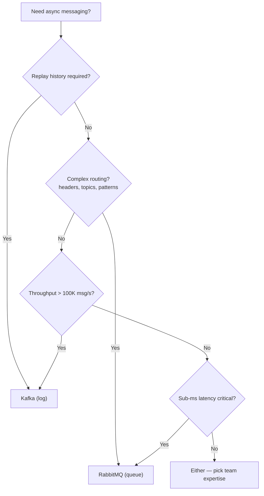
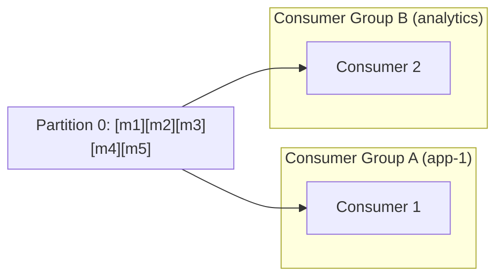
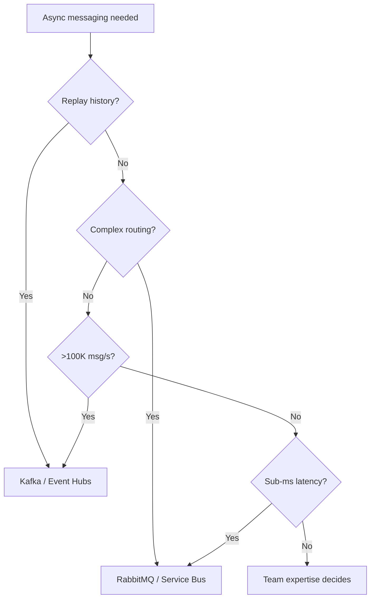

# 5. Message Brokers & Asynchronous Processing

> **Parent**: [System Design Interview Reference](README.md)  
> **Source**: [20 Design Interview Questions](../../articles/medium/20-design-interview-questions.md) — Questions #17–20

---

## P17: Broker Selection

| | |
|:---|:---|
| **Problem** | System uses Kafka for a 100 msg/s task queue with complex routing — high operational cost, wrong abstraction |
| **Root cause** | Treating Kafka (log) and RabbitMQ (queue) as interchangeable |

**Strategy**:



**Philosophical difference**:

| | RabbitMQ | Kafka |
|:---|:---|:---|
| **Worldview** | Deliver to right consumer, then delete | Record forever; consumers read what they need |
| **Broker role** | Smart: routes, tracks delivery, retries | Dumb: stores ordered log, consumers self-manage |
| **Analogy** | Post office | Library archive |
| **Retention** | Until consumed + acked | Configurable time (days/weeks) |
| **Replay** | ❌ Once consumed, gone | ✅ Reset offset, re-read history |
| **Consumer scaling** | Competing consumers (work distribution) | Consumer groups (partition assignment) |

**Use both**: E-commerce — Kafka for clickstream/events (replay for analytics), RabbitMQ for operational commands (send email, generate invoice).

> **Azure mapping**:
> - **Kafka → Event Hubs** (Kafka protocol compatible) or HDInsight Kafka
> - **RabbitMQ → Service Bus** (queues, topics, sessions) or Event Grid (simple pub-sub)
>
> **Full comparisons**: [Event Hubs vs Kafka](../../architecture-azure/integration/messaging-comparisons/eventhubs_vs_kafka_comparison.md) · [Service Bus vs Kafka](../../architecture-azure/integration/messaging-comparisons/servicebus_vs_kafka_comparison.md) · [Azure Event Services Full Doc](../../architecture-azure/integration/messaging-comparisons/azure_event_services_full_doc.md)
>
> **General**: [Messaging Patterns Overview](../../architecture-general/03-integration-communication-architecture/messaging-patterns/messaging-patterns-overview.md)

---

## P18: Offset Commit Failure

| | |
|:---|:---|
| **Problem** | Messages processed twice after consumer crash |
| **Root cause** | Consumer processed messages but crashed before committing the offset — on restart, re-reads from last committed position |

**Strategy**:

```
At-least-once is the default. Design for it.

Partition: [msg-0] [msg-1] [msg-2] [msg-3] [msg-4] ...
                                    ↑ committed=2
Consumer reads 3,4,5 → processes 3 ✅, 4 ✅, 5 ❌ (crash)
→ Offset still at 2. Restarts → reads 3,4,5 again.
→ 3 and 4 processed TWICE.
```

| Commit strategy | Risk |
|:---|:---|
| Auto-commit (5s interval) | Messages between commits replayed |
| Commit after each message | Very slow (round-trip per message) |
| **Commit after batch** | Best balance; at most N duplicates |
| Commit before processing | Data loss risk |

**Idempotent consumer patterns**:

| Pattern | Mechanism | Example |
|:---|:---|:---|
| **Upsert** | `INSERT ... ON CONFLICT DO UPDATE` | PostgreSQL — second write overwrites, no duplicate |
| **Deduplication table** | `SELECT` for message_id → `INSERT` both in same transaction | Universal; works with any DB |
| **Message UUID** | Producer embeds idempotency key; consumer skips if seen | Zero-dependency |
| **Kafka transactions** | Read + write in atomic transaction | Within Kafka ecosystem only |

> **Azure**: Event Hubs uses offset/sequence number — same at-least-once semantics. Service Bus peek-lock provides at-least-once with built-in dead-lettering. | **General**: [Idempotency Store Pattern](../../architecture-general/03-integration-communication-architecture/messaging-patterns/idempotency-store-pattern.md)

---

## P19: Poison Messages

| | |
|:---|:---|
| **Problem** | One malformed message crashes every worker that picks it up — blocks the queue infinitely |
| **Root cause** | No distinction between transient errors (retry) and permanent errors (dead-letter) |

**Strategy**:

```
Message processing decision tree:
  ├─ Transient error (network blip, DB timeout, 503)
  │    └─ NACK + requeue with backoff (≤ max_retries)
  └─ Permanent error (malformed JSON, missing field, null ref)
       └─ NACK + requeue=false → DEAD LETTER QUEUE
```

| Component | Responsibility |
|:---|:---|
| **Max retry count** | Limit redelivery attempts (3-5 typical) |
| **Dead Letter Queue (DLQ)** | Capture poison messages after retries exhausted |
| **Monitoring & alerting** | Alert if DLQ depth > 0 for > 5 minutes |

**Implementation by broker**:

| Broker | Built-in DLQ? | Mechanism |
|:---|:---:|:---|
| **Azure Service Bus** | ✅ Best built-in | `MaxDeliveryCount` → auto dead-letter + `DeadLetterReason` |
| **RabbitMQ** | ✅ First-class | `x-dead-letter-exchange` queue arg + `basic_nack(requeue=false)` |
| **AWS SQS** | ✅ Redrive policy | `maxReceiveCount` → auto-move to DLQ |
| **Kafka** | ⚠️ Manual | Retry topic → DLT (Dead Letter Topic); consumer commits offset after moving |

**DLQ operational runbook**:

| Action | When |
|:---|:---|
| Fix producer | Malformed message — fix upstream schema |
| Fix consumer | Bug in processing — deploy fix, replay from DLQ |
| Skip + acknowledge | Message genuinely invalid (deleted entity) |
| Manual intervention | Complex business-logic failure |
| Alert | DLQ depth > 0 for > 5 min → page on-call |

> **Azure**: Service Bus auto dead-lettering after `MaxDeliveryCount` | **General**: [Dead Letter Queue Pattern](../../architecture-general/03-integration-communication-architecture/messaging-patterns/messaging-patterns-overview.md#2-dead-letter-queue-dlq)

---

## P20: Message Ordering

| | |
|:---|:---|
| **Problem** | Messages processed in wrong order across parallel consumers |
| **Root cause** | Multiple consumers compete for messages — network variance, GC pauses, and CPU scheduling randomize order |

**Strategy — partition by entity**:

```
Global ordering (impossible at scale):
  Consumer 1: [A──100ms──]    Consumer 2: [B-20ms-] ← finishes first!
  → Order: B, A, C... WRONG

Entity-level ordering (scalable):
  user-42: [msg-1] [msg-2] [msg-3] → Partition 0 → Consumer A (ordered)
  user-99: [msg-1] [msg-2]        → Partition 1 → Consumer B (ordered)
  user-17: [msg-1] [msg-2] [msg-3] → Partition 2 → Consumer C (ordered)
```

| Platform | Partitioning mechanism |
|:---|:---|
| **Kafka** | `ProducerRecord` key → `hash(key) % partitions` |
| **RabbitMQ** | Consistent hash exchange plugin or manual sharding |
| **AWS SQS FIFO** | `MessageGroupId` — messages in same group are FIFO |
| **Azure Service Bus** | `SessionId` — session-aware consumer processes in FIFO |

### Kafka: Consumer Groups & Partition Ordering

**Can multiple consumers listen to the same partition?**

| Scenario | Same partition? | Ordering? |
|:---|:---|:---|
| **Same consumer group** | ❌ **No** — Kafka assigns each partition to exactly ONE consumer in the group | ✅ Guaranteed — single consumer reads sequentially |
| **Different consumer groups** | ✅ **Yes** — each group maintains its own offset independently | ✅ Per-group — each group reads in order from its own offset |



**Why this matters**: The "one consumer per partition within a group" rule is Kafka's **ordering guarantee mechanism**. If two consumers in the same group could read partition 0, they'd race and reorder messages. Kafka enforces this at the protocol level through the Group Coordinator — when a consumer joins/leaves, partitions are **rebalanced** to maintain the 1:1 mapping.

**Scaling & ordering trade-off**:

```
Partitions = parallelism ceiling for your consumer group

Topic: orders (3 partitions)
  P0: [order-1] [order-4] [order-7]  → Consumer A (same group)
  P1: [order-2] [order-5] [order-8]  → Consumer B (same group)
  P2: [order-3] [order-6] [order-9]  → Consumer C (same group)

  ✅ Per-partition ordering preserved (by user_id key)
  ✅ Up to 3 consumers can work in parallel
  ❌ Adding Consumer D → it stays idle (no unassigned partition)
  ❌ No global ordering across P0, P1, P2
```

**Key rules**:
- **Max parallelism = partition count**: A consumer group can have at most `N` active consumers for `N` partitions; extras sit idle
- **Partition key = ordering domain**: Messages with the same key go to the same partition → processed in order by one consumer
- **Rebalance disrupts ordering briefly**: During rebalance, no consumer reads — but order within a partition is never violated once the new assignment settles
- **Across groups = fan-out, not competition**: Group A and Group B both read partition 0 independently — like two bookmarks in the same book

> **TL;DR** — Within a consumer group, each partition has exactly **one consumer** — that 1:1 mapping is Kafka's ordering guarantee. To fan-out the same partition to multiple consumers, use **separate consumer groups**.

**When you TRULY need global order** (rare):
1. Single partition / single FIFO queue — accept throughput ceiling (~300 TPS for SQS FIFO)
2. Sequence numbers — producer assigns monotonically increasing number; consumer buffers and reorders
3. Event sourcing + CQRS — write side ordered (single partition), read side eventually consistent

**When order DOESN'T matter** (most cases):
- Two users update their profiles (independent entities)
- User adds then removes cart item (last-write-wins = same result)
- IoT temperature reports (aggregate by time window)

> **Azure**: Service Bus Sessions for ordered delivery within a session | **General**: §3.3 Event-Driven & Messaging

---

## Decision Flowchart: Broker Selection



> See [P17: Broker Selection](#p17-broker-selection) for the detailed decision tree with tradeoffs.
