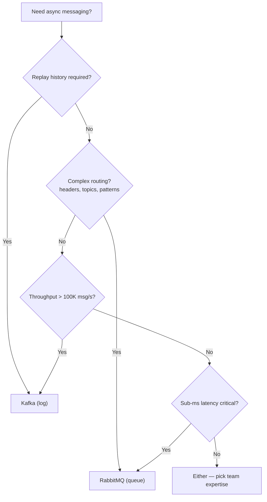
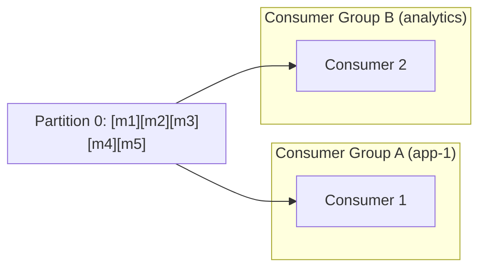
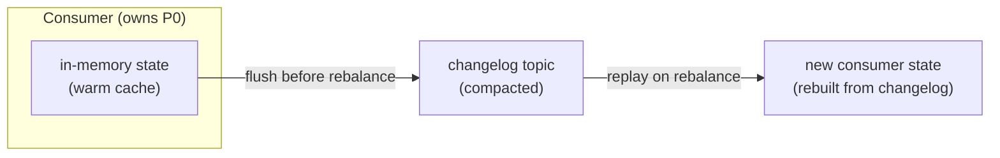
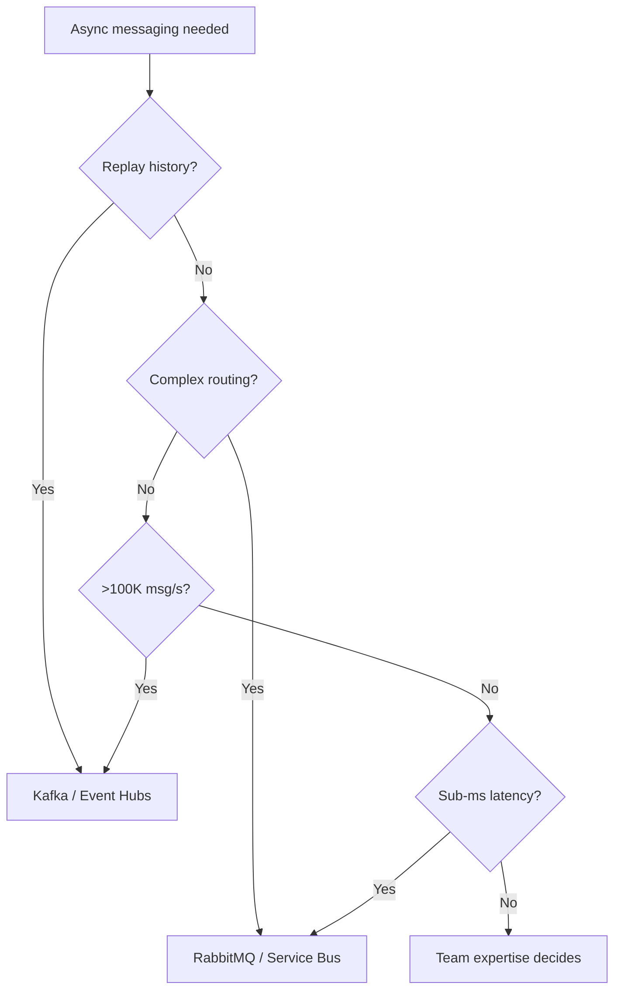

# 5. Message Brokers & Asynchronous Processing

> **Parent**: [System Design Interview Reference](README.md)  
> **Source**: [20 Design Interview Questions](../../articles/medium/20-design-interview-questions.md) — Questions #17–20

---

## P17: Broker Selection

| | |
|:---|:---|
| **Problem** | System uses Kafka for a 100 msg/s task queue with complex routing — high operational cost, wrong abstraction |
| **Root cause** | Treating Kafka (log) and RabbitMQ (queue) as interchangeable |

**Strategy**:



**Philosophical difference**:

| | RabbitMQ | Kafka |
|:---|:---|:---|
| **Worldview** | Deliver to right consumer, then delete | Record forever; consumers read what they need |
| **Broker role** | Smart: routes, tracks delivery, retries | Dumb: stores ordered log, consumers self-manage |
| **Analogy** | Post office | Library archive |
| **Retention** | Until consumed + acked | Configurable time (days/weeks) |
| **Replay** | ❌ Once consumed, gone | ✅ Reset offset, re-read history |
| **Consumer scaling** | Competing consumers (work distribution) | Consumer groups (partition assignment) |

**Use both**: E-commerce — Kafka for clickstream/events (replay for analytics), RabbitMQ for operational commands (send email, generate invoice).

> **Azure mapping**:
> - **Kafka → Event Hubs** (Kafka protocol compatible) or HDInsight Kafka
> - **RabbitMQ → Service Bus** (queues, topics, sessions) or Event Grid (simple pub-sub)
>
> **Full comparisons**: [Event Hubs vs Kafka](../../architecture-azure/integration/messaging-comparisons/eventhubs_vs_kafka_comparison.md) · [Service Bus vs Kafka](../../architecture-azure/integration/messaging-comparisons/servicebus_vs_kafka_comparison.md) · [Azure Event Services Full Doc](../../architecture-azure/integration/messaging-comparisons/azure_event_services_full_doc.md)
>
> **General**: [Messaging Patterns Overview](../../architecture-general/03-integration-communication-architecture/messaging-patterns/messaging-patterns-overview.md)

---

## P18: Offset Commit Failure

| | |
|:---|:---|
| **Problem** | Messages processed twice after consumer crash |
| **Root cause** | Consumer processed messages but crashed before committing the offset — on restart, re-reads from last committed position |

**Strategy**:

```
At-least-once is the default. Design for it.

Partition: [msg-0] [msg-1] [msg-2] [msg-3] [msg-4] ...
                                    ↑ committed=2
Consumer reads 3,4,5 → processes 3 ✅, 4 ✅, 5 ❌ (crash)
→ Offset still at 2. Restarts → reads 3,4,5 again.
→ 3 and 4 processed TWICE.
```

| Commit strategy | Risk |
|:---|:---|
| Auto-commit (5s interval) | Messages between commits replayed |
| Commit after each message | Very slow (round-trip per message) |
| **Commit after batch** | Best balance; at most N duplicates |
| Commit before processing | Data loss risk |

**Idempotent consumer patterns**:

| Pattern | Mechanism | Example |
|:---|:---|:---|
| **Upsert** | `INSERT ... ON CONFLICT DO UPDATE` | PostgreSQL — second write overwrites, no duplicate |
| **Deduplication table** | `SELECT` for message_id → `INSERT` both in same transaction | Universal; works with any DB |
| **Message UUID** | Producer embeds idempotency key; consumer skips if seen | Zero-dependency |
| **Kafka transactions** | Read + write in atomic transaction | Within Kafka ecosystem only |

> **Azure**: Event Hubs uses offset/sequence number — same at-least-once semantics. Service Bus peek-lock provides at-least-once with built-in dead-lettering. | **General**: [Idempotency Store Pattern](../../architecture-general/03-integration-communication-architecture/messaging-patterns/idempotency-store-pattern.md)

---

## P19: Poison Messages

| | |
|:---|:---|
| **Problem** | One malformed message crashes every worker that picks it up — blocks the queue infinitely |
| **Root cause** | No distinction between transient errors (retry) and permanent errors (dead-letter) |

**Strategy**:

```
Message processing decision tree:
  ├─ Transient error (network blip, DB timeout, 503)
  │    └─ NACK + requeue with backoff (≤ max_retries)
  └─ Permanent error (malformed JSON, missing field, null ref)
       └─ NACK + requeue=false → DEAD LETTER QUEUE
```

| Component | Responsibility |
|:---|:---|
| **Max retry count** | Limit redelivery attempts (3-5 typical) |
| **Dead Letter Queue (DLQ)** | Capture poison messages after retries exhausted |
| **Monitoring & alerting** | Alert if DLQ depth > 0 for > 5 minutes |

**Implementation by broker**:

| Broker | Built-in DLQ? | Mechanism |
|:---|:---:|:---|
| **Azure Service Bus** | ✅ Best built-in | `MaxDeliveryCount` → auto dead-letter + `DeadLetterReason` |
| **RabbitMQ** | ✅ First-class | `x-dead-letter-exchange` queue arg + `basic_nack(requeue=false)` |
| **AWS SQS** | ✅ Redrive policy | `maxReceiveCount` → auto-move to DLQ |
| **Kafka** | ⚠️ Manual | Retry topic → DLT (Dead Letter Topic); consumer commits offset after moving |

**DLQ operational runbook**:

| Action | When |
|:---|:---|
| Fix producer | Malformed message — fix upstream schema |
| Fix consumer | Bug in processing — deploy fix, replay from DLQ |
| Skip + acknowledge | Message genuinely invalid (deleted entity) |
| Manual intervention | Complex business-logic failure |
| Alert | DLQ depth > 0 for > 5 min → page on-call |

> **Azure**: Service Bus auto dead-lettering after `MaxDeliveryCount` | **General**: [Dead Letter Queue Pattern](../../architecture-general/03-integration-communication-architecture/messaging-patterns/messaging-patterns-overview.md#2-dead-letter-queue-dlq)

---

## P20: Message Ordering

| | |
|:---|:---|
| **Problem** | Messages processed in wrong order across parallel consumers |
| **Root cause** | Multiple consumers compete for messages — network variance, GC pauses, and CPU scheduling randomize order |

**Strategy — partition by entity**:

```
Global ordering (impossible at scale):
  Consumer 1: [A──100ms──]    Consumer 2: [B-20ms-] ← finishes first!
  → Order: B, A, C... WRONG

Entity-level ordering (scalable):
  user-42: [msg-1] [msg-2] [msg-3] → Partition 0 → Consumer A (ordered)
  user-99: [msg-1] [msg-2]        → Partition 1 → Consumer B (ordered)
  user-17: [msg-1] [msg-2] [msg-3] → Partition 2 → Consumer C (ordered)
```

| Platform | Partitioning mechanism |
|:---|:---|
| **Kafka** | `ProducerRecord` key → `hash(key) % partitions` |
| **RabbitMQ** | Consistent hash exchange plugin or manual sharding |
| **AWS SQS FIFO** | `MessageGroupId` — messages in same group are FIFO |
| **Azure Service Bus** | `SessionId` — session-aware consumer processes in FIFO |

### Kafka: Consumer Groups & Partition Ordering

**Can multiple consumers listen to the same partition?**

| Scenario | Same partition? | Ordering? |
|:---|:---|:---|
| **Same consumer group** | ❌ **No** — Kafka assigns each partition to exactly ONE consumer in the group | ✅ Guaranteed — single consumer reads sequentially |
| **Different consumer groups** | ✅ **Yes** — each group maintains its own offset independently | ✅ Per-group — each group reads in order from its own offset |



**Why this matters**: The "one consumer per partition within a group" rule is Kafka's **ordering guarantee mechanism**. If two consumers in the same group could read partition 0, they'd race and reorder messages. Kafka enforces this at the protocol level through the Group Coordinator — when a consumer joins/leaves, partitions are **rebalanced** to maintain the 1:1 mapping.

**Scaling & ordering trade-off**:

```
Partitions = parallelism ceiling for your consumer group

Topic: orders (3 partitions)
  P0: [order-1] [order-4] [order-7]  → Consumer A (same group)
  P1: [order-2] [order-5] [order-8]  → Consumer B (same group)
  P2: [order-3] [order-6] [order-9]  → Consumer C (same group)

  ✅ Per-partition ordering preserved (by user_id key)
  ✅ Up to 3 consumers can work in parallel
  ❌ Adding Consumer D → it stays idle (no unassigned partition)
  ❌ No global ordering across P0, P1, P2
```

**Key rules**:
- **Max parallelism = partition count**: A consumer group can have at most `N` active consumers for `N` partitions; extras sit idle
- **Partition key = ordering domain**: Messages with the same key go to the same partition → processed in order by one consumer
- **Rebalance disrupts ordering briefly**: During rebalance, no consumer reads — but order within a partition is never violated once the new assignment settles
- **Across groups = fan-out, not competition**: Group A and Group B both read partition 0 independently — like two bookmarks in the same book

#### Rebalance Side Effects

When a consumer joins or leaves a group, Kafka triggers a **rebalance** — all partitions are reassigned across the remaining consumers. During this window, the entire group is disrupted.

```
Timeline of a rebalance:

 Time ──────────────────────────────────────────────────────►
 
 Consumer A:  [msg-41][msg-42] ████ PAUSED ████  [msg-43][msg-44]...
 Consumer B:  [msg-81][msg-82] ████ PAUSED ████  [msg-41][msg-42]...
                                ▲
                           Rebalance
                           (stop-the-world)
                               
 P0 was on A ──► now on B      → msg-41 & 42 processed TWICE if A didn't commit
```

| Side effect | What happens | Impact |
|:---|:---|:---|
| **Stop-the-world pause** | All consumers in the group halt processing during reassignment | Latency spike; upstream backpressure |
| **Duplicate processing** | New consumer picks up from last committed offset, re-reads messages already processed (but not committed) by old consumer | At-least-once semantics amplified |
| **Offset commit race** | Old consumer commits offset mid-rebalance → new consumer starts from wrong position → messages skipped or replayed | Silent data inconsistency |
| **In-memory state loss** | Aggregation windows, counters, caches held in consumer memory vanish when partitions move | Corrupted aggregates; must rebuild from changelog |
| **Rebalance storms** | One slow consumer triggers rebalance → new assignment stresses another consumer → cascading rebalances | Group oscillates; throughput drops to near-zero |

**What triggers a rebalance**

| Trigger | Default | What happens |
|:---|:---|:---|
| Consumer joins/leaves group | — | Immediate rebalance |
| `session.timeout.ms` | 45s | Consumer heartbeat lost → kicked out → rebalance |
| `max.poll.interval.ms` | 5min | Consumer hasn't called `poll()` in time → considered stuck → rebalance |
| Topic metadata change | — | Partitions added to topic → rebalance |

**Mitigation strategies**

| Strategy | Mechanism | Kafka version |
|:---|:---|:---|
| **Cooperative rebalancing** | `partition.assignment.strategy: CooperativeStickyAssignor` — only reassigns partitions that actually need to move; other consumers keep processing | 2.4+ |
| **Static group membership** | `group.instance.id` — consumer keeps its partition assignment across restarts (within `session.timeout.ms`); rejoin without rebalance | 2.3+ |
| **Tune timeouts** | Increase `max.poll.interval.ms` for heavy processing; increase `session.timeout.ms` for flaky networks (but slower failure detection) | All |
| **State in changelog, not memory** | Persist consumer state to a compacted topic (Kafka Streams pattern); rebuild on rebalance instead of losing it | All |
| **Graceful shutdown** | Call `consumer.close()` before shutting down → triggers a controlled leave → faster, cleaner rebalance | All |

##### 1. Cooperative Rebalancing (StickyAssignor)

<details>
<summary><strong>Expand</strong></summary>

The default **eager rebalance** revokes ALL partitions from ALL consumers, reassigns them, then resumes — even if only one consumer joined. **Cooperative rebalancing** (a.k.a. incremental cooperative) only revokes the partitions that actually need to move.

```
Eager (default, pre-2.4):                Cooperative (2.4+):

 P0→A    P1→B    P2→C                    P0→A    P1→B    P2→C
  │       │       │     Consumer D joins   │       │       │     Consumer D joins
  ▼       ▼       ▼                        │       │       ▼
 █████ ALL PAUSED █████                    │       │    █PAUSED█   P0, P1 keep processing
  │       │       │                        │       │       │
 P0→A    P1→D    P2→B                    P0→A    P1→B    P2→D    only P2 moved
                                         
 Impact: ALL partitions stop              Impact: only the moved partition stops
```

**Configuration**:
```properties
# consumer.properties
partition.assignment.strategy=org.apache.kafka.clients.consumer.CooperativeStickyAssignor
```

**Trade-off**: Slightly more complex rebalance protocol; requires broker and client both on 2.4+. The "sticky" part tries to keep partitions on the same consumer — so if Consumer A had P0 before the rebalance, it keeps P0 if possible.

</details>

##### 2. Static Group Membership

<details>
<summary><strong>Expand</strong></summary>

Without static membership, a consumer restart (even a rolling restart) triggers **two rebalances**: one when it leaves, another when it rejoins. With `group.instance.id`, the Group Coordinator holds the consumer's slot for `session.timeout.ms`, so a restart within the timeout window is treated as a **rejoin** — no rebalance at all.

```
Without static membership:              With static membership:
                                       
 Consumer A restarts:                   Consumer A restarts:
 1. Leave group → REBALANCE #1          1. Leave group → slot held (no rebalance)
 2. Rejoin group → REBALANCE #2         2. Rejoin with same group.instance.id →
                                          "Welcome back, here are your partitions"
                                         
 Total: 2 stop-the-world pauses           Total: 0 pauses
```

**Configuration**:
```properties
# consumer.properties
group.instance.id=order-processor-1    # Unique per consumer instance
session.timeout.ms=30000               # Must restart within this window
```

**Trade-off**: If the consumer is truly dead (not coming back), the group waits the full `session.timeout.ms` before reassigning its partitions — delaying recovery. Use shorter timeouts if fast failure detection matters more than avoiding rebalances.

</details>

##### 3. Tune Timeouts

<details>
<summary><strong>Expand</strong></summary>

The two most impactful knobs:

| Property | Default | Increase when | Risk of increasing |
|:---|:---|:---|:---|
| `max.poll.interval.ms` | 300,000 (5min) | Processing a batch takes >5min (e.g., calling a slow external API) | Consumer appears stuck longer before being kicked out |
| `session.timeout.ms` | 45,000 (45s) | Network is flaky or GC pauses >45s | Slower failure detection; consumer down for 60s+ before group reacts |
| `heartbeat.interval.ms` | 3,000 (3s) | Reduce broker load; should be ≤ `session.timeout.ms / 3` | Slower heartbeat → slower session timeout detection |

```properties
# For heavy processing workloads
max.poll.interval.ms=600000             # 10 minutes
# For unstable network environments
session.timeout.ms=60000                # 60 seconds
heartbeat.interval.ms=10000             # 10 seconds
```

</details>

##### 4. State in Changelog, Not Memory

<details>
<summary><strong>Expand</strong></summary>

Consumers that maintain in-memory state (aggregation windows, join tables, session data) lose it on every rebalance. The Kafka Streams pattern solves this:



1. **Write**: Every state mutation is written to a compacted changelog topic
2. **On rebalance**: New consumer reads the changelog from the beginning (or last committed offset), rebuilding the exact state
3. **RocksDB** (Kafka Streams default): Local disk-backed state store with changelog topic — survives both restarts and rebalances

**Without Kafka Streams**, the same pattern can be implemented manually:
- Write state changes to a compacted topic with the partition key
- On `ConsumerRebalanceListener.onPartitionsAssigned()`, replay the changelog before starting to process new messages
- On `onPartitionsRevoked()`, flush any pending state

</details>

##### 5. Graceful Shutdown

<details>
<summary><strong>Expand</strong></summary>

A `kill -9` (or container OOM kill) triggers an **unclean leave** — the Group Coordinator only notices when `session.timeout.ms` expires. A graceful shutdown sends an explicit `LeaveGroup` request, triggering an immediate, controlled rebalance.

```java
// Register shutdown hook
Runtime.getRuntime().addShutdownHook(new Thread(() -> {
    System.out.println("Shutting down consumer...");
    consumer.wakeup();           // Interrupt any blocking poll()
    consumer.close();            // Commit offsets + LeaveGroup request
    System.out.println("Consumer closed cleanly.");
}));
```

```python
import signal

def shutdown(signum, frame):
    print("Shutting down consumer...")
    consumer.close()              # Commit + LeaveGroup
    sys.exit(0)

signal.signal(signal.SIGTERM, shutdown)
signal.signal(signal.SIGINT, shutdown)
```

**Kubernetes note**: Set `terminationGracePeriodSeconds` high enough for `consumer.close()` to complete (typically 30-60s). The preStop hook can trigger a controlled shutdown before SIGTERM.

</details>

> **Takeaway** — Rebalances are Kafka's mechanism for fault tolerance, but they come at a cost: stop-the-world pauses, duplicates, and state loss. Use **cooperative rebalancing + static membership** to minimize disruption, and always design consumers to survive a rebalance (idempotent processing, external state).

**When you TRULY need global order** (rare):
1. Single partition / single FIFO queue — accept throughput ceiling (~300 TPS for SQS FIFO)
2. Sequence numbers — producer assigns monotonically increasing number; consumer buffers and reorders
3. Event sourcing + CQRS — write side ordered (single partition), read side eventually consistent

**When order DOESN'T matter** (most cases):
- Two users update their profiles (independent entities)
- User adds then removes cart item (last-write-wins = same result)
- IoT temperature reports (aggregate by time window)

> **Azure**: Service Bus Sessions for ordered delivery within a session | **General**: §3.3 Event-Driven & Messaging

---

## Decision Flowchart: Broker Selection



> See [P17: Broker Selection](#p17-broker-selection) for the detailed decision tree with tradeoffs.
