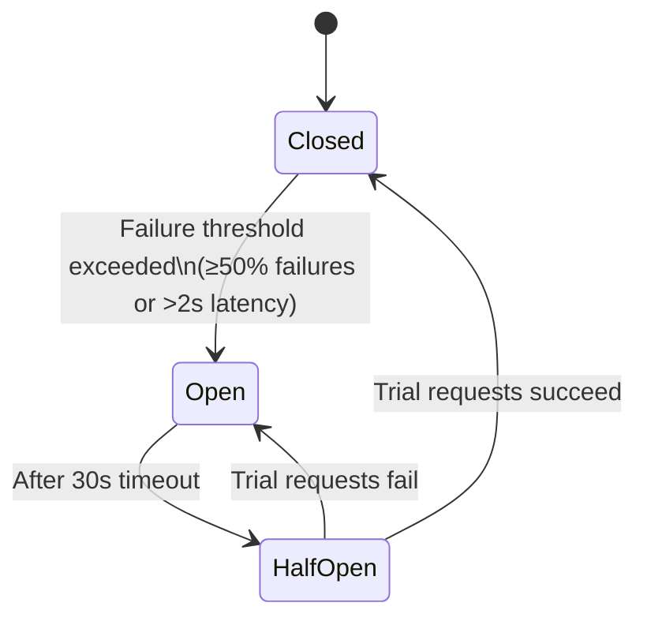

# Resilience Patterns: Surviving Chaos at Scale

> **Source**: [22 Scenario-Based System Design Questions](../articles/medium/22-design-interview-questions/01-22-scenario-based-system-design-questions.md) — Scenarios #20, #21, #22  
> **Taxonomy Reference**: §7.1 Reliability & Resilience  
> **Azure Mapping**: See [Azure Service Mapping](07-azure-service-mapping.md)

---

## Table of Contents

| ID | Problem | Key Concept |
|:---|:---|:---|
| [`resilience-01`](#resilience-01-otp-service-fails-during-peak-traffic) | OTP Service Fails During Peak Traffic | Retry storms, rate limiting, multi-provider failover |
| [`resilience-02`](#resilience-02-circuit-breaker--stop-calling-dead-services) | Circuit Breaker — Stop Calling Dead Services | Failure thresholds, half-open state, fallback |
| [`resilience-03`](#resilience-03-bulkhead--thread-pool-isolation) | Bulkhead — Thread Pool Isolation | Resource partitioning, blast radius containment |
| [`resilience-04`](#resilience-04-timeouts--retries-with-backoff) | Timeouts & Retries with Backoff | Deadlines, exponential backoff, jitter |
| [`resilience-05`](#resilience-05-api-gateway-becomes-a-bottleneck) | API Gateway Becomes a Bottleneck | Auth caching, TLS offload, edge caching |
| [`resilience-06`](#resilience-06-the-resilience-stack) | The Resilience Stack | Composing all patterns |

---

## resilience-01: OTP Service Fails During Peak Traffic

### The Problem

Users stop receiving OTPs during login spikes. The failure is an **amplification feedback loop**:

```
Traffic spike → SMS provider rate-limited → users tap "Resend" repeatedly
→ 2000 req/sec becomes 8000+ req/sec → provider melts down completely
```

### Root Cause

1. **Third-party rate limits**: SMS providers hard-cap at ~500 OTP/sec
2. **Retry storm**: Users who don't receive OTPs hit "Resend" — amplifying load 4x+
3. **No backpressure**: System accepts all requests regardless of downstream capacity

### Solution

**Layer 1 — Client-Side Debouncing (Prevent Retry Storms)**

Disable the resend button for 30 seconds after each request:

```javascript
let cooldown = 30;
resendButton.disabled = true;
const interval = setInterval(() => {
    resendButton.textContent = `Resend in ${--cooldown}s`;
    if (cooldown <= 0) { clearInterval(interval); resendButton.disabled = false; }
}, 1000);
```

**Layer 2 — Token Bucket Rate Limiter (Prevent Provider Overload)**

```java
private final RateLimiter limiter = RateLimiter.create(500.0); // 500/sec cap
public OtpResult sendOtp(String phone, String otp) {
    if (!limiter.tryAcquire(1, TimeUnit.SECONDS)) {
        return OtpResult.rateLimited("High demand — try again in a moment");
    }
    return smsProvider.send(phone, "Your OTP: " + otp);
}
```

**Layer 3 — Multi-Provider with Circuit Breaker Failover**

```
Provider chain: Twilio (primary) → Sinch (secondary) → AWS SNS (fallback)
```

Each provider has its own circuit breaker. When primary opens, traffic flows to secondary.

**Layer 4 — Queue Buffering with Load Shedding**

Use a bounded queue (50K capacity). Store OTP hashes immediately so users can verify even if delivery is delayed. If queue is full, return "try again later" — don't accept and crash.

### Mitigation Summary

| Problem | Solution |
|---------|----------|
| Provider rate limit exceeded | Token bucket rate limiter at gateway |
| User retry storm | Client-side debouncing (30s cooldown) |
| Single provider failure | Multi-provider with circuit breaker failover |
| Traffic spike overflows memory | Bounded queue + load shedding |
| OTP expires before delivery | Store OTP first, deliver async with 5-min TTL |

> **Azure Mapping**: Azure Communication Services (SMS with built-in retry), Azure API Management (rate-limiting policies), Azure Cache for Redis (OTP storage with TTL), Azure Service Bus queue (buffered dispatch).

---

## resilience-02: Circuit Breaker — Stop Calling Dead Services

### The Problem

One slow microservice cascades to take down the entire platform:

```
Payment Service slows (DB connection leak)
  → Order Service threads all block waiting for Payment
    → API Gateway threads all block waiting for Order
      → ALL services unreachable, even healthy ones
```

### Root Cause

**Synchronous calls with unbounded wait times and shared thread pools.** One slow dependency consumes all available threads, starving other dependencies.

### Solution

Stop calling a failing service after a threshold of failures:

```java
@CircuitBreaker(name = "paymentService", fallbackMethod = "paymentFallback")
public PaymentResponse validatePayment(PaymentRequest request) {
    return paymentClient.validate(request);
}

public PaymentResponse paymentFallback(PaymentRequest request, Exception e) {
    log.warn("Payment service unavailable — proceeding with pending status");
    return PaymentResponse.pending(); // Graceful degradation
}
```

### Circuit Breaker States



### Configuration

| Parameter | Value | Rationale |
|:---|:---|:---|
| Failure threshold | 50% | Open if half of recent calls fail |
| Slow call threshold | 2 seconds | Treat slow as failure |
| Wait duration in open | 30 seconds | Give downstream time to recover |
| Half-open permit count | 3 | Test with a few requests before fully closing |

> **Key insight**: Don't just retry indefinitely. After N failures, **stop trying** and fail fast. This preserves resources for healthy dependencies.

> **Azure Mapping**: Azure API Management has built-in circuit breaker policies. Azure Monitor detects cascading failures. Azure Load Testing for chaos engineering.

---

## resilience-03: Bulkhead — Thread Pool Isolation

### The Problem

Without bulkheads, all services share the same thread pool. If Payment Service stalls, threads that could serve Inventory requests are blocked waiting for Payment — even though Inventory is perfectly healthy.

### Solution

Assign **separate thread pools** to each downstream dependency:

```java
@Bean("paymentExecutor")
public ExecutorService paymentExecutor() {
    return new ThreadPoolExecutor(
        10, 20,                           // core, max
        60L, TimeUnit.SECONDS,
        new LinkedBlockingQueue<>(100),    // bounded queue = backpressure
        new ThreadPoolExecutor.CallerRunsPolicy() // reject → caller runs
    );
}

@Bean("inventoryExecutor")
public ExecutorService inventoryExecutor() {
    return new ThreadPoolExecutor(10, 20, 60L, TimeUnit.SECONDS,
        new LinkedBlockingQueue<>(100),
        new ThreadPoolExecutor.CallerRunsPolicy()
    );
}
```

### Why CallerRunsPolicy Matters

When the queue is full and all threads are busy, `CallerRunsPolicy` makes the **caller thread** execute the task. This:

1. **Applies backpressure** — caller slows down naturally
2. **Prevents queue overflow** — no rejected tasks piling up
3. **Preserves ordering** — tasks execute in submission order

### Bulkhead Visualization

```
┌─────────────────────────────────────────────┐
│                 API Gateway                  │
│  ┌──────────┐ ┌──────────┐ ┌──────────────┐ │
│  │ Payment  │ │Inventory │ │ Notifications │ │
│  │ 10 thds  │ │ 10 thds  │ │   5 threads   │ │
│  │ Queue:100│ │ Queue:100│ │  Queue:50     │ │
│  └──────────┘ └──────────┘ └──────────────┘ │
└─────────────────────────────────────────────┘
   Payment stalls → only Payment pool blocked
   Inventory & Notifications → continue normally
```

> **Azure Mapping**: Azure App Service supports separate connection pools per backend. Azure Kubernetes Service with Istio/Envoy for circuit breaking and connection pool isolation.

---

## resilience-04: Timeouts & Retries with Backoff

### The Problem

**Timeouts without backoff amplify failure** — if 100 threads retry immediately after a 3s timeout, they all hit the recovering service simultaneously, potentially re-crashing it.

### Solution: Exponential Backoff with Jitter

```java
public <T> T executeWithRetry(Supplier<T> operation, int maxRetries) {
    for (int attempt = 0; attempt <= maxRetries; attempt++) {
        try {
            return operation.get();
        } catch (TransientException e) {
            if (attempt == maxRetries) throw e;
            
            long baseDelay = (long) Math.pow(2, attempt) * 500; // 500ms, 1s, 2s, 4s
            long jitter = ThreadLocalRandom.current().nextLong(baseDelay / 2);
            Thread.sleep(baseDelay + jitter);
        }
    }
    throw new IllegalStateException("Unreachable");
}
```

### Why Jitter Matters

Without jitter, all retries land at exactly the same time — creating synchronized thundering herds:

```
Without jitter:  [.......wait 2s.......][ALL-HIT-AT-ONCE][.......wait 4s.......][ALL-HIT-AT-ONCE]
With jitter:     [.wait 1.7s.][.wait 2.1s.][.wait 2.4s.]  ← spread across ~1s window
```

### Timeout Hierarchy

| Call Type | Connect Timeout | Socket Timeout | Total Deadline |
|:---|:---|:---|:---|
| Internal service | 500ms | 2s | 2.5s |
| External API | 2s | 5s | 7s |
| Database query | 200ms | 3s | 3.2s |
| Cache (Redis) | 100ms | 500ms | 600ms |

> **Rule of thumb**: Set timeouts at **p99 latency × 2**. Never use unbounded waits.

---

## resilience-05: API Gateway Becomes a Bottleneck

### The Problem

The API gateway is the **single entry point** for all traffic. At 10,000 req/sec, common operations stack up:

| Overhead | Per-Request Cost | At 10K req/sec |
|:---|:---|:---|
| JWT validation | 10-50ms | 100-500 CPU-cores |
| TLS termination | CPU-intensive | 30-50% of CPU |
| JSON parsing | 500 MB/sec | ~2 GB memory |
| Auth service call | 20ms | 200 pending connections |

### Solutions

**Layer 1 — Token Introspection Caching**

Cache validated tokens for 60 seconds. Auth overhead drops from 20ms → <1ms for 95%+ of requests:

```java
String cached = redis.get("auth:token:" + hash(token));
if (cached != null) {
    setUserContext(exchange, cached);   // Cache hit: skip auth service
} else {
    User user = authService.validate(token);
    redis.set("auth:token:" + hash(token), user, Duration.ofSeconds(60));
}
```

**Layer 2 — Offload TLS Termination**

Terminate TLS at CDN edge (Azure Front Door, CloudFront) or hardware load balancer. Internal traffic uses plain HTTP within VPC. **30-50% CPU reduction**.

**Layer 3 — Response Caching at Gateway**

Cache idempotent GET responses for 60 seconds. High-traffic endpoints (product lists, config) see **90%+ backend call reduction**.

**Layer 4 — Horizontal Scaling**

API gateways are stateless — scale horizontally with Kubernetes HPA on CPU + memory targets.

### Bottleneck Mitigation Summary

| Bottleneck | Fix | Impact |
|:---|:---|:---|
| Auth validation per request | Token caching (60s TTL) | 95%+ CPU reduction for auth |
| TLS termination | Offload to CDN/load balancer | 30-50% CPU reduction |
| Repeated identical responses | Gateway-level response cache | 90%+ reduction for cacheable endpoints |
| Abusive clients | Rate limiting at edge | Prevents backend saturation |
| Connection setup overhead | Connection reuse + keep-alive | 20% latency improvement |

> **Azure Mapping**: Azure Front Door (global TLS termination + caching), Azure Application Gateway (layer-7 routing + WAF), Azure API Management (rate limiting, auth caching, circuit breaking).

---

## resilience-06: The Resilience Stack

### Composing All Patterns

Each pattern addresses a different failure mode. Together they form a defense-in-depth:

```
┌──────────────────────────────────────────────────────┐
│                   THE RESILIENCE STACK                │
├────────────┬─────────────────────────────────────────┤
│  Timeout   │ Caps wait time. Every call needs one.   │
│  Retry     │ Handles transient failures. Backoff +   │
│            │ jitter to avoid thundering herds.       │
│  Circuit   │ Stops calling dead services. Prevents   │
│  Breaker   │ wasting resources on doomed calls.      │
│  Bulkhead  │ Isolates failures. One bad dependency   │
│            │ can't starve others.                    │
│  Fallback  │ Graceful degradation when all else      │
│            │ fails. Return cached/stale/default.      │
└────────────┴─────────────────────────────────────────┘
```

### Decision Matrix

| Pattern | What It Does | When to Use |
|:---|:---|:---|
| Timeout | Caps wait time | **Always** — every call needs a deadline |
| Retry | Retries transient failures | Network blips, brief outages |
| Circuit Breaker | Stops calling dead services | Persistent failures |
| Bulkhead | Isolates thread pools | Protect services from bad dependencies |
| Fallback | Returns degraded response | When all else fails |

### The Golden Rules

1. **Always set timeouts** — never wait indefinitely
2. **Retry with backoff + jitter** — never retry immediately
3. **Circuit break before cascading** — fail fast, not slow
4. **Isolate with bulkheads** — one failure shouldn't spread
5. **Degrade gracefully** — partial service > no service

> **Taxonomy Reference**: §7.1 Reliability & Resilience  
> **Related**: [Concurrency & Transactions](02-concurrency-transactions.md) | [Message Brokers](05-message-brokers-async.md) | [Caching Architecture](03-caching-architecture.md) | [Checkpointing for Batch Jobs](13-large-data-processing-constraints.md#proc-02-checkpointing-for-fault-tolerant-batch-processing)
