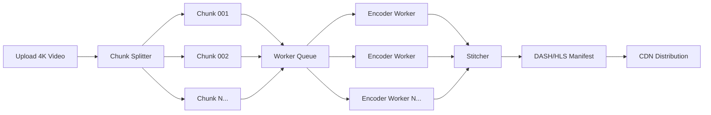

# Media Processing Pipelines: Async Workflows at Scale

> **Source**: [22 Scenario-Based System Design Questions](../articles/medium/22-design-interview-questions/01-22-scenario-based-system-design-questions.md) — Scenario #10  
> **Taxonomy Reference**: §2.2 Application Architecture, §3.3 Event-Driven & Messaging  
> **Azure Mapping**: See [Azure Service Mapping](07-azure-service-mapping.md)

---

## Table of Contents

| ID | Problem | Key Concept |
|:---|:---|:---|
| [`media-01`](#media-01-video-processing-at-youtube-scale) | YouTube Video Processing Pipeline | Chunk splitting, parallel transcoding, progressive availability |

---

## media-01: Video Processing at YouTube Scale

### The Problem

A user uploads a 4K video and expects streaming support quickly. Processing a 2-hour 4K video requires **1000+ chunks × 5+ resolutions = 5000+ encoding jobs**, totaling hours of CPU time. But users expect "processing" to take minutes.

### Why It's Hard

Video processing is a **DAG of dependent jobs**, not a single task. The challenge: split work into independent units, process in parallel across hundreds of workers, stitch results back together — all while making the lowest resolution available as quickly as possible.

### Solution Architecture



### Stage 1 — Chunk Splitting (Immediate)

Split video into 5-second segments at **keyframe boundaries** (GOP-aligned chunking). This ensures clean cuts without re-encoding at boundaries:

```bash
ffmpeg -i input.mp4 -c copy -map 0 -f segment \
       -segment_time 5 -segment_format mpegts \
       -reset_timestamps 1 chunk_%03d.ts
```

### Stage 2 — Parallel Transcoding

Push chunks to a worker queue. Each worker independently transcodes one chunk to one resolution. Scale horizontally — YouTube reportedly runs **millions of encoding tasks concurrently**.

Use hardware encoders (GPU/ASIC) for **10-50x speedup** over CPU encoding.

### Stage 3 — Stitching + Packaging

Once all chunks for a resolution are ready, stitch them and create **DASH/HLS manifests** so the player can dynamically switch quality levels during playback.

### Stage 4 — Progressive Availability

Don't wait for ALL resolutions. Release lowest first, upgrade as higher qualities complete:

```
t+30s:   360p available → user can start watching
t+2min:  720p available → player auto-switches up
t+5min:  1080p available
t+15min: 4K available
```

### Optimization Techniques

| Technique | Impact |
|:---|:---|
| GOP-aligned chunking | No re-encoding of keyframes at boundaries |
| Per-title encoding | Simpler videos get lower bitrate, saving CPU + storage |
| Hardware encoders (GPU/ASIC) | 10-50x faster than CPU encoding |
| Two-pass skipped for low-res | Single-pass VBR good enough for ≤ 720p |
| Warm pool of encoder instances | Avoid cold start latency |

### Key Design Principles

#### 1. Embarrassingly Parallel Decomposition

Video chunks are **independent** — chunk 42 doesn't need chunk 41's result. This means linear scaling: double the workers = halve the processing time.

#### 2. Progressive Enhancement

Low resolution first, high resolution later. Users value **time-to-first-frame** more than initial quality.

#### 3. Work Stealing

Some chunks encode faster than others (simple scenes vs. complex action). Use a **work queue** (not round-robin assignment) so fast workers grab more chunks.

#### 4. Partial Failure Tolerance

If one chunk fails, retry only that chunk — not the entire video. Track per-chunk state in a durable store.

### Architecture Patterns

| Pattern | Video Processing | General Async Processing |
|:---|:---|:---|
| **Fan-out/Fan-in** | Split → Encode → Stitch | Split work → Process → Aggregate |
| **Priority Queue** | 360p before 4K | Critical path first |
| **Checkpoint/Restart** | Per-chunk state tracking | Resume from last checkpoint |
| **Warm Pool** | Pre-provisioned GPU encoders | Avoid cold starts |

### Scaling Math

```
2-hour 4K video:
  Chunks: 7200s ÷ 5s = 1440 chunks
  Resolutions: 360p, 720p, 1080p, 4K = 4 variants
  Total jobs: 1440 × 4 = 5760 encoding jobs

With 100 GPU workers, 2s per chunk:
  Time: 5760 ÷ 100 × 2s ≈ 115 seconds (~2 minutes)

First frame available (360p): 
  1440 ÷ 100 × 2s ≈ 29 seconds
```

> **Azure Mapping**: Azure Media Services (managed encoding at scale), Azure Batch for large-scale parallel transcoding, Azure Functions for lightweight chunk orchestration, Azure Blob Storage for chunk storage with lifecycle management.

---

## General Async Pipeline Patterns

These patterns from video processing apply to **any** async workflow (document processing, image transformation, data pipeline ETL):

| Pattern | Description | Example |
|:---|:---|:---|
| **Chunk & Parallelize** | Split large work into independent units | Split PDF into pages, process in parallel |
| **Progressive Results** | Return partial results immediately | Show first page while rest renders |
| **Work Stealing Queue** | Fast workers pull more work | Dynamic load balancing |
| **Per-Unit Checkpointing** | Track each unit's state | Resume failed batch from last success |
| **Priority Lanes** | Critical items skip the queue | High-priority encoding lane |

### When to Use Fan-Out/Fan-In

```
Can the work be split into independent units?
  ├─ YES → Are units roughly equal size?
  │   ├─ YES → Simple fan-out (round-robin)
  │   └─ NO  → Work-stealing queue
  └─ NO  → Is there a dependency DAG?
      ├─ YES → Topological ordering with parallel stages
      └─ NO  → Sequential processing (can't parallelize)
```

> **Taxonomy Reference**: §2.2 Application Architecture, §3.3 Event-Driven & Messaging  
> **Related**: [Stream Processing (Flink)](09-stream-processing-flink.md) | [Message Brokers & Async](05-message-brokers-async.md) | [Async & Concurrency Patterns](08-async-concurrency-patterns.md)
