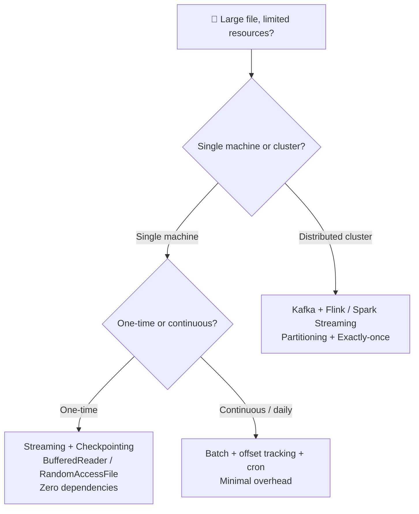

# 13. Large Data Processing Under Constraints

> **Parent**: [System Design Interview Reference](README.md)  
> **Source**: ["I Have a 10GB CSV File and Only 512MB RAM" — The Interview Question That Stumped Me](../articles/medium/10gb-csv-512mb-ram-interview-question.md)  
> **Taxonomy Reference**: §7.2 Performance & Scalability, §7.1 Reliability & Resilience

---

## Table of Contents

| ID | Problem | Key Concept |
|:---|:---|:---|
| [`proc-01`](#proc-01-streaming--chunking-for-memory-constrained-processing) | Can't load entire file into RAM | Stream row-by-row; batch within memory budget |
| [`proc-02`](#proc-02-checkpointing-for-fault-tolerant-batch-processing) | Crash → restart from row 0 | Periodic byte-offset checkpointing for resumability |
| [`proc-03`](#proc-03-producer-consumer-with-backpressure) | Producer overwhelms consumer with data | Bounded queue + blocking `put()` for backpressure |
| [`proc-04`](#proc-04-parallel-consumers-with-ordered-merge) | CPU-bound transform is bottleneck; order must be preserved | N consumers → N temp files → K-way merge by sequence number |
| [`proc-05`](#proc-05-single-machine-vs-distributed-framework-selection) | When to use Kafka/Flink vs simple streaming | Match the tool to the scale — don't over-engineer |

---

## proc-01: Streaming & Chunking for Memory-Constrained Processing

> **Source**: [10GB CSV, 512MB RAM](../articles/medium/10gb-csv-512mb-ram-interview-question.md) — "The Ideal Answer: Streaming + Chunking + Offset Tracking"

| | |
|:---|:---|
| **Problem** | A 10GB file must be processed on a machine with only 512MB RAM — loading the entire file is impossible |
| **Root cause** | Naïve approach of reading the full file into memory (`Files.readAllLines()` or `pd.read_csv()`) |
| **Symptoms** | `OutOfMemoryError`, process killed by OOM killer, or extreme swap thrashing |

### Strategy

| Approach | Memory Usage | When to Use |
|:---|:---|:---|
| **Row-by-row streaming** | $O(1)$ — one line at a time | Simple transforms, validation, format conversion |
| **Small-batch processing** | $O(batch\_size)$ — configurable | Expensive per-row parsing, JSON/Parquet conversion |
| **Full file load** | $O(file\_size)$ — 10GB+ needed | Only if RAM > file size (not this scenario) |

### Row-by-Row (Java)

```java
try (BufferedReader reader = new BufferedReader(new FileReader("large.csv"))) {
    String line;
    while ((line = reader.readLine()) != null) {
        processLine(line);   // transform, validate, enrich
        writeToOutput(line); // append to output file
    }
}
```

### Small-Batch with Memory Budget

```java
int BATCH_SIZE = 5000;  // tune based on average row size
List<String> batch = new ArrayList<>(BATCH_SIZE);
while ((line = reader.readLine()) != null) {
    batch.add(line);
    if (batch.size() == BATCH_SIZE) {
        processBatch(batch);
        batch.clear(); // free memory immediately
    }
}
// Don't forget the last partial batch
if (!batch.isEmpty()) processBatch(batch);
```

> **Key insight**: The memory footprint is $O(1)$ regardless of file size. A 10GB file and a 10TB file use the same RAM — you never hold more than one batch in memory.

> **Azure**: Azure Data Factory Copy Activity (streaming mode), Azure Functions (stream processing with output bindings) | **General**: [Stream Processing Patterns](../../architecture-general/04-data-analytics-ai-architecture/)

---

## proc-02: Checkpointing for Fault-Tolerant Batch Processing

> **Source**: [10GB CSV, 512MB RAM](../articles/medium/10gb-csv-512mb-ram-interview-question.md) — "Track progress for fault tolerance"

| | |
|:---|:---|
| **Problem** | Process crashes halfway through a 10GB file — restarting from row 0 wastes hours of work |
| **Root cause** | No progress tracking; idempotent output not guaranteed |
| **Symptoms** | Duplicate output rows on restart, wasted compute time, missed SLAs |

### Strategy

```
Checkpoint flow:
  1. Process N rows (e.g., 10,000)
  2. Write byte offset to .ckpt file
  3. If crash → read .ckpt → seek to offset → resume

┌──────────┐    ┌──────────┐    ┌──────────┐
│ Process  │───▶│ Save     │───▶│ Process  │
│ 10K rows │    │ offset   │    │ next 10K │
└──────────┘    └──────────┘    └──────────┘
                     │                │
                     ▼                ▼
              crash-safe        .ckpt file
              resume point      "offset=1048576"
```

### Java Implementation

```java
// --- Save checkpoint ---
long currentOffset = raf.getFilePointer();
Files.writeString(Path.of("progress.ckpt"), "offset=" + currentOffset);

// --- Resume from checkpoint ---
long lastOffset = 0;
Path ckpt = Path.of("progress.ckpt");
if (Files.exists(ckpt)) {
    String content = Files.readString(ckpt);
    lastOffset = Long.parseLong(content.split("=")[1]);
}
RandomAccessFile raf = new RandomAccessFile("large.csv", "r");
raf.seek(lastOffset);  // resume from last safe point
```

### Checkpointing Trade-offs

| Checkpoint Frequency | Pros | Cons |
|:---|:---|:---|
| **Every row** | Zero data loss on crash | High I/O overhead — checkpoint file write per row |
| **Every N rows (~10K)** | Good balance — lose at most N rows | Typical default |
| **Every N MB (~100MB)** | Aligned with I/O block sizes | Slightly more data loss on crash |

> **Key insight**: Resumability is often more important than raw speed. A job that takes 4 hours but survives crashes is better than one that takes 3 hours but restarts from zero.

> **Azure**: Azure Batch (auto-resume on node failure), Azure Data Factory (retry policies with checkpoint support) | **General**: [Resilience Patterns](10-resilience-patterns.md#resilience-06-the-resilience-stack)

---

## proc-03: Producer-Consumer with Backpressure

> **Source**: [10GB CSV, 512MB RAM](../articles/medium/10gb-csv-512mb-ram-interview-question.md) — "Use producer-consumer pattern"

| | |
|:---|:---|
| **Problem** | Reading and processing sequentially underutilizes the CPU — disk is idle while CPU works, and vice versa |
| **Root cause** | Single-threaded read → process → write loop |
| **Symptoms** | Throughput capped at the slower of I/O or CPU, not the sum of both |

### Strategy

```
┌──────────┐    ┌────────────────┐    ┌──────────┐
│ Producer │───▶│ Bounded Queue  │───▶│ Consumer │
│  (I/O)   │    │  (~1000 rows)  │    │  (CPU)   │
└──────────┘    └────────────────┘    └──────────┘
   reads              backpressure         transforms
   from disk          if full →            & writes
                      producer blocks      to output
```

### Java Implementation

```java
BlockingQueue<String> queue = new LinkedBlockingQueue<>(1000); // bounded

// Producer: reads lines and blocks if queue is full
Thread producer = new Thread(() -> {
    try (BufferedReader reader = new BufferedReader(new FileReader("large.csv"))) {
        String line;
        while ((line = reader.readLine()) != null) {
            queue.put(line);  // BLOCKS if queue full → backpressure!
        }
    }
});

// Consumer: takes lines and processes
Thread consumer = new Thread(() -> {
    try (BufferedWriter writer = new BufferedWriter(new FileWriter("output.json"))) {
        while (true) {
            String line = queue.take();  // BLOCKS if queue empty
            String result = transform(line);
            writer.write(result);
            writer.newLine();
        }
    }
});
```

### Why Bounded (Not Unbounded)

| Queue Type | Behavior Under Load | Risk |
|:---|:---|:---|
| **`LinkedBlockingQueue<>(capacity)`** | Producer blocks when full → backpressure | Safe — memory capped |
| **`ConcurrentLinkedQueue`** (unbounded) | Queue grows indefinitely → `OutOfMemoryError` | Catastrophic |

> **Key insight**: A **bounded** queue with blocking `put()` is the simplest form of backpressure. The producer naturally slows to the consumer's pace. This is the same principle Kafka and Flink use at scale — just without the distributed coordination.

> **Azure**: Event Hubs partitioned consumer groups, Service Bus sessions for ordered processing | **General**: [Async & Concurrency Patterns](08-async-concurrency-patterns.md#async-01-unbounded-thread-pool-exhaustion)

---

## proc-04: Parallel Consumers with Ordered Merge

> **Source**: [10GB CSV, 512MB RAM](../articles/medium/10gb-csv-512mb-ram-interview-question.md) — "Parallelize writes with multiple consumers (while keeping order)"

| | |
|:---|:---|
| **Problem** | The transform step is CPU-bound — a single consumer thread becomes the bottleneck, but adding more consumers would scramble row order |
| **Root cause** | Multiple consumers writing to a single output file produces interleaved, unordered output |
| **Symptoms** | Output rows appear out of order — row 500 appears before row 3 |

### Strategy

```
Producer assigns sequence numbers → N consumers write to N temp files → K-way merge

  Input CSV          Bounded Queue         Temp Files           Final Output
  ┌──────┐          ┌───────────┐         ┌─────────┐          ┌──────────┐
  │ seq=1│─────────▶│ (1, row1) │────────▶│ part-0  │──┐       │          │
  │ seq=2│          │ (2, row2) │         │ .json   │  │       │  final   │
  │ seq=3│          │ (3, row3) │──┐     └─────────┘  │       │  .json   │
  │ seq=4│          │ (4, row4) │  │     ┌─────────┐  │ ───▶  │  (sorted)│
  │ seq=5│          │  ...      │  └────▶│ part-1  │──┤ K-way │          │
  └──────┘          └───────────┘        │ .json   │  │ merge └──────────┘
                                         └─────────┘  │
                                         ┌─────────┐  │
                                         │ part-2  │──┘
                                         │ .json   │
                                         └─────────┘
```

### Java Implementation

```java
AtomicLong counter = new AtomicLong(0);
int NUM_CONSUMERS = Runtime.getRuntime().availableProcessors();

// Producer: assigns seq number to each row
for (int i = 0; i < NUM_CONSUMERS; i++) {
    final int consumerId = i;
    consumers.submit(() -> {
        try (BufferedWriter writer = new BufferedWriter(
                new FileWriter("tmp/part-" + consumerId + ".json"))) {
            while (true) {
                IndexedRow row = queue.take();
                if (row.isPoison()) break;
                String processed = transform(row.line);
                // Write seq number for ordered merge later
                writer.write("{\"seq\":" + row.seq + ",\"data\":" + processed + "}");
                writer.newLine();
            }
        }
    });
}

// Merge phase: K-way merge of sorted temp files
// Since each file is internally sorted by seq, use a min-heap
mergeTempFiles("tmp/", "final.json");
```

### Trade-offs

| | Pros | Cons |
|:---|:---|:---|
| **Ordered merge** | 100% order guarantee, scales to N cores | Extra disk I/O (N temp files + 1 merge pass) |
| **Single consumer** | Simple, zero merge overhead | CPU-bound transforms bottleneck at 1 core |
| **Unordered output** | Maximum parallelism | Unacceptable if downstream depends on order |

> **When does this actually help?** If your transform is compute-bound — JSON serialization, compression (gzip/snappy), regex validation, Parquet conversion — then 4 consumers give ~3.5× throughput. If disk I/O is the bottleneck, adding consumers just adds contention. **Profile first.**

> **Azure**: Azure Data Lake Analytics (U-SQL with partitioned output), Synapse Spark (partitioned write + merge) | **General**: [Scatter-Gather Pattern](../../architecture-general/03-integration-communication-architecture/scatter-gather-pattern.md)

---

## proc-05: Single-Machine vs Distributed Framework Selection

> **Source**: [10GB CSV, 512MB RAM](../articles/medium/10gb-csv-512mb-ram-interview-question.md) — "Wait — Could Kafka or Flink Be the Right Answer?"

| | |
|:---|:---|
| **Problem** | Jumping to Kafka/Flink/Spark for a one-time 10GB file on a single machine — massive over-engineering |
| **Root cause** | "When you have a hammer, everything looks like a nail" — familiarity with distributed tools biases toward them |
| **Symptoms** | Deploying a 5-node Kafka cluster + Flink job to process a file that `BufferedReader` handles in 10 minutes |

### Decision Framework



### Comparison

| Scenario | Solution | Overhead | When |
|:---|:---|:---|:---|
| **One-time 10GB CSV on a laptop** | `BufferedReader` + checkpoint file | Zero | You're the only user; job runs once |
| **Daily 50GB ingest, single server** | Batch with offset tracking + cron | Minimal | Predictable schedule, single machine sufficient |
| **Continuous file stream, cluster** | Kafka + Flink / Spark Streaming | Significant | Multiple producers, multiple consumers, SLAs |
| **Real-time event processing** | Kafka Streams / Flink | Justified by throughput | <100ms latency, millions of events/sec |

### What to Say in an Interview

| Layer | What to Say | Signals You Understand |
|:---|:---|:---|
| **1. Core** | "Stream row-by-row with `BufferedReader`, never load the full file." | Memory constraints |
| **2. Resilience** | "Track byte offsets in a checkpoint file so a crash resumes from the last safe point." | Fault tolerance & production readiness |
| **3. Scale** | "If this were a distributed pipeline, I'd reach for Kafka + Flink for partitioning and exactly-once semantics — but for a single machine, that's overkill." | Right tool for the right scale — and when NOT to over-engineer |

> **Key insight**: The interviewer isn't testing whether you know Kafka — they're testing whether you know when NOT to use it. Starting with the simplest solution and escalating only when constraints demand it shows senior engineering judgment.

> **Azure**: See [Azure Service Mapping](07-azure-service-mapping.md) for problem → service lookup | **General**: [Stream Processing (Flink)](09-stream-processing-flink.md#flink-01-lambda-architecture--two-systems-two-codebases) — Kappa vs Lambda

---

## Interview Cheat Sheet

| Principle | Why It Matters | Ref |
|:---|:---|:---:|
| **Stream, don't load** | $O(1)$ memory regardless of file size | [`proc-01`](#proc-01-streaming--chunking-for-memory-constrained-processing) |
| **Batch within budget** | Trade off I/O calls vs memory pressure | [`proc-01`](#proc-01-streaming--chunking-for-memory-constrained-processing) |
| **Checkpoint often** | Crash → resume from last checkpoint, not row 0 | [`proc-02`](#proc-02-checkpointing-for-fault-tolerant-batch-processing) |
| **Bounded queues = backpressure** | Producer slows to consumer's pace naturally | [`proc-03`](#proc-03-producer-consumer-with-backpressure) |
| **Parallelize only if CPU-bound** | If disk is the bottleneck, parallelism adds contention | [`proc-04`](#proc-04-parallel-consumers-with-ordered-merge) |
| **Right tool for right scale** | `BufferedReader` for one-off; Kafka/Flink for pipelines | [`proc-05`](#proc-05-single-machine-vs-distributed-framework-selection) |
