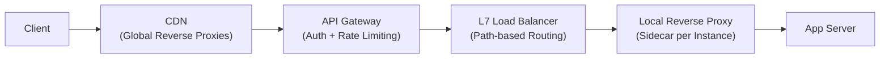
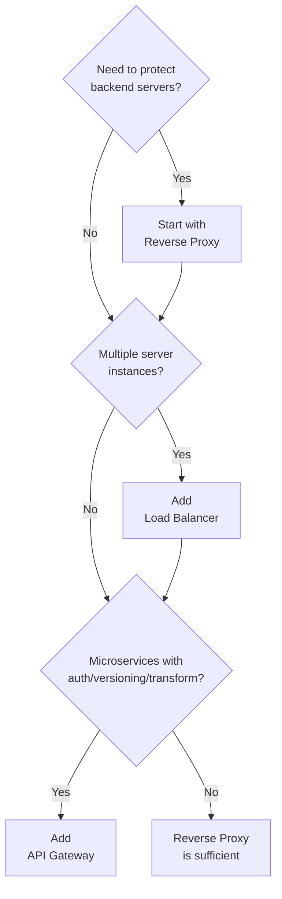

# 16. Reverse Proxy, Load Balancer & API Gateway: Key Takeaways

> **Parent**: [System Design Interview Reference](index.md)  
> **Source**: [Reverse Proxy vs Load Balancer vs API Gateway: The Real Difference?](../videos/reverse-proxy-load-balancer-api-gateway.md) — YouTube breakdown  
> **Purpose**: Distinguish these three often-conflated networking components, understand when each applies, and how they compose in production.

---

## Contents

| ID | Problem | Key Concept |
|:---|:---|:---|
| [`gw-01`](#gw-01-reverse-proxy--when-server-protection-is-the-priority) | Reverse Proxy — When server protection is the priority | SSL termination, caching, IP masking |
| [`gw-02`](#gw-02-load-balancer--when-traffic-distribution-is-the-priority) | Load Balancer — When traffic distribution is the priority | Routing strategies, health checks, L4 vs L7 |
| [`gw-03`](#gw-03-api-gateway--when-api-lifecycle-management-is-the-priority) | API Gateway — When API lifecycle management is the priority | Auth, transformation, versioning |
| [`gw-04`](#gw-04-the-nuance--nginx-wears-all-three-hats) | The Nuance — Nginx wears all three hats | Single tool, multiple roles |
| [`gw-05`](#gw-05-production-layering--they-compose-dont-compete) | Production Layering — They compose, don't compete | CDN → Gateway → LB → Proxy chain |
| [`gw-06`](#gw-06-decision-matrix--which-one-do-i-reach-for) | Decision Matrix — Which one do I reach for? | Problem → component mapping |

---

## gw-01: Reverse Proxy — When Server Protection Is the Priority

### The Problem

Backend servers are directly exposed to the internet. Every server handles its own TLS, caches its own responses, and advertises its real IP. This duplicates work, wastes CPU, and enlarges the attack surface.

### Strategy

Place a **reverse proxy** in front of backend servers. It acts *on behalf of the server*, not the client.

```
BEFORE (every server does everything):
  Client ──TLS──▶ Server-1 (decrypt + serve + cache)
  Client ──TLS──▶ Server-2 (decrypt + serve + cache)

AFTER (proxy centralizes cross-cutting concerns):
  Client ──TLS──▶ [Reverse Proxy] ──HTTP──▶ Server-1
                   │                      ▶ Server-2
                   ├─ SSL termination
                   ├─ Response caching
                   ├─ gzip/Brotli compression
                   └─ IP masking + basic rate limiting
```

### What It Does NOT Do

| Capability | Reverse Proxy? |
|:---|:---:|
| Understand business logic | ❌ |
| Validate user tokens | ❌ |
| Route by API version | ❌ |
| Transform request/response payloads | ❌ |

It is a **network-level** tool. If you need app-level intelligence, move up the stack to an API Gateway.

### Common Tools

Nginx, HAProxy, Caddy, Envoy (as edge proxy).

> **Azure**: [Azure Front Door](https://learn.microsoft.com/en-us/azure/frontdoor/) — global reverse proxy + CDN  
> **Taxonomy**: §5.2 Cloud Networking

---

## gw-02: Load Balancer — When Traffic Distribution Is the Priority

### The Problem

A single server cannot handle all traffic. You scale horizontally, but now you need a mechanism to spread requests evenly — and stop sending traffic to dead instances.

### Strategy

A **load balancer** is a specialized reverse proxy whose core job is distribution + health awareness.

### Routing Strategies

| Strategy | Logic | Best For |
|:---|:---|:---|
| **Round Robin** | Cycle through servers sequentially | Homogeneous servers |
| **Least Connections** | Send to the server with fewest active connections | Variable-duration requests |
| **Weighted Routing** | Send proportionally more traffic to bigger instances | Heterogeneous hardware |
| **IP Hash** | Hash client IP → pin to same server | Session stickiness without cookies |

### Layer 4 vs. Layer 7 — A Critical Distinction

```
Layer 4 (TCP/IP):
  Client ──▶ LB looks at IP:port ──▶ Backend
  • Fast (no payload inspection)
  • Blind to HTTP — cannot route by URL path, header, or cookie

Layer 7 (HTTP):
  Client ──▶ LB reads HTTP headers ──▶ Backend
  • Can route /images/* → image servers, /api/* → app servers
  • Slower than L4, but enables content-based routing
```

| | Layer 4 | Layer 7 |
|:---|:---|:---|
| **OSI level** | Transport | Application |
| **Routing criteria** | IP + port | URL path, headers, cookies |
| **Performance** | Very high | Moderate |
| **TLS termination** | ❌ (pass-through) | ✅ |
| **Use case** | Simple TCP/UDP distribution | Microservice routing, A/B testing |

### Health Checks

The LB continuously pings backend `/health` endpoints. If an instance goes down, traffic is automatically rerouted — no manual intervention.

```
Active check:  LB → GET /health → 200 OK? → route traffic
                                       ✗ → mark unhealthy, retry N times, evict
Passive check: LB observes 5xx responses → mark unhealthy
```

> **Azure**: [Azure Load Balancer](https://learn.microsoft.com/en-us/azure/load-balancer/) (L4), [Application Gateway](https://learn.microsoft.com/en-us/azure/application-gateway/) (L7)  
> **Taxonomy**: §5.2 Cloud Networking

---

## gw-03: API Gateway — When API Lifecycle Management Is the Priority

### The Problem

You have 30 microservices. Each one independently validates JWTs, logs requests, enforces rate limits, and handles CORS. That's 30 copies of identical infrastructure code — and 30 places to update when auth logic changes.

### Strategy

An **API Gateway** is the single entry point that *understands your APIs*. It centralizes cross-cutting concerns so individual services focus on business logic.

```
Without Gateway (chaos):
  Client → AuthSvc (JWT?) → OrderSvc (JWT?) → PaymentSvc (JWT?)
  Each service duplicates: auth, logging, rate-limiting, CORS, TLS

With Gateway (order):
  Client → [API Gateway] ──▶ AuthSvc
            │               ▶ OrderSvc
            ├─ JWT validation (once)     ▶ PaymentSvc
            ├─ Rate limiting (per-tier)
            ├─ Request logging
            ├─ CORS headers
            └─ API version routing
```

### Core Capabilities

| Capability | Why It Matters |
|:---|:---|
| **Token validation** | Validate JWT/API key once at the edge — services trust `X-User-Id` header |
| **Rate limiting** | Per-user, per-tier, per-endpoint — prevents abuse and cost spikes |
| **Request transformation** | XML → JSON, legacy field mapping, v1→v2 migration without client changes |
| **API versioning** | Route `/v1/orders` and `/v2/orders` to different backends |
| **Visibility** | Single pane of glass for latency, errors, and traffic patterns |

### Common Tools

Kong, AWS API Gateway, Apigee, Traefik, Envoy (as API gateway).

> **Azure**: [Azure API Management](https://learn.microsoft.com/en-us/azure/api-management/) — policy-based gateway with developer portal  
> **Taxonomy**: §3.3 Event-Driven & Messaging, §8.3 API Design

---

## gw-04: The Nuance — Nginx Wears All Three Hats

### The Problem

Interviewers love this trap: "Is Nginx a reverse proxy or a load balancer?" The answer is "yes, and it can also be an API gateway." Modern tools blur the lines, and rigid categorization is a junior mistake.

### Strategy

Acknowledge the overlap:

```
Nginx configuration evolution:

1. Reverse Proxy:
   server { location / { proxy_pass http://backend; } }

2. Add upstream block → Load Balancer:
   upstream backend_pool {
       server 10.0.0.1:8080 weight=3;
       server 10.0.0.2:8080 weight=1;
   }

3. Add OpenResty/Lua plugins → API Gateway:
   access_by_lua_block {
       -- JWT validation, rate limiting, request transformation
   }
```

**Senior answer**: "Nginx is a tool. Whether it's a reverse proxy, load balancer, or API gateway depends entirely on which modules you enable and how you configure it. I choose the label based on the *primary function* it serves in my architecture."

---

## gw-05: Production Layering — They Compose, Don't Compete

### The Problem

Juniors ask "which one should I use?" Seniors know they are **layered**, not alternatives.

### The Production Stack



| Layer | Component | Responsibility |
|:---|:---|:---|
| **Edge** | CDN / Global Reverse Proxy | Cache static assets, absorb DDoS, terminate TLS near user |
| **Entry** | API Gateway | Authenticate, rate-limit, transform, route by API version |
| **Distribution** | L7 Load Balancer | Spread traffic across service instances, health checks |
| **Sidecar** | Local Reverse Proxy | Per-instance TLS, connection pooling, service mesh (e.g., Envoy) |

### Why Not Collapse Them?

Each layer solves a **different failure domain**:

- If the CDN goes down, the API Gateway absorbs the traffic spike
- If the Gateway has an auth bug, the LB still routes healthy traffic
- If an app instance crashes, the LB health check catches it — the Gateway never knows

> **Taxonomy**: §7.1 Reliability & Resilience — defense in depth

---

## gw-06: Decision Matrix — Which One Do I Reach For?

### Quick Diagnostic

| Symptom | Problem | Component | Ref |
|:---|:---|:---|:---:|
| "Every server does its own TLS, wasting CPU" | No SSL termination point | Reverse Proxy | [`gw-01`](#gw-01-reverse-proxy--when-server-protection-is-the-priority) |
| "One server is melting while others are idle" | No traffic distribution | Load Balancer | [`gw-02`](#gw-02-load-balancer--when-traffic-distribution-is-the-priority) |
| "30 services all validate JWTs independently" | Duplicated cross-cutting code | API Gateway | [`gw-03`](#gw-03-api-gateway--when-api-lifecycle-management-is-the-priority) |
| "Need to route /images to one pool and /api to another" | Content-based routing needed | L7 Load Balancer | [`gw-02`](#gw-02-load-balancer--when-traffic-distribution-is-the-priority) |
| "Mobile clients on v1 API are breaking because we changed v2" | No API versioning | API Gateway | [`gw-03`](#gw-03-api-gateway--when-api-lifecycle-management-is-the-priority) |
| "Which tool — Nginx, Kong, or Azure Front Door?" | Tool selection confusion | Understand the role first | [`gw-04`](#gw-04-the-nuance--nginx-wears-all-three-hats) |

### Decision Flow



### Azure Quick Mapping

| Need | Azure Service |
|:---|:---|
| Global edge + CDN + WAF | **Azure Front Door** |
| L4 (TCP/UDP) distribution | **Azure Load Balancer** |
| L7 (HTTP) routing + WAF | **Application Gateway** |
| API management + developer portal | **API Management** |

> **Azure Implementation**: See [Architecture Azure Networking](../architecture-azure/networking/) and [Integration](../architecture-azure/integration/) for service deep-dives.
