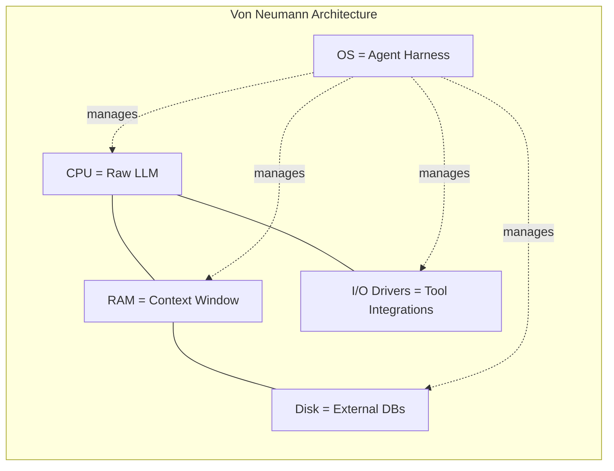
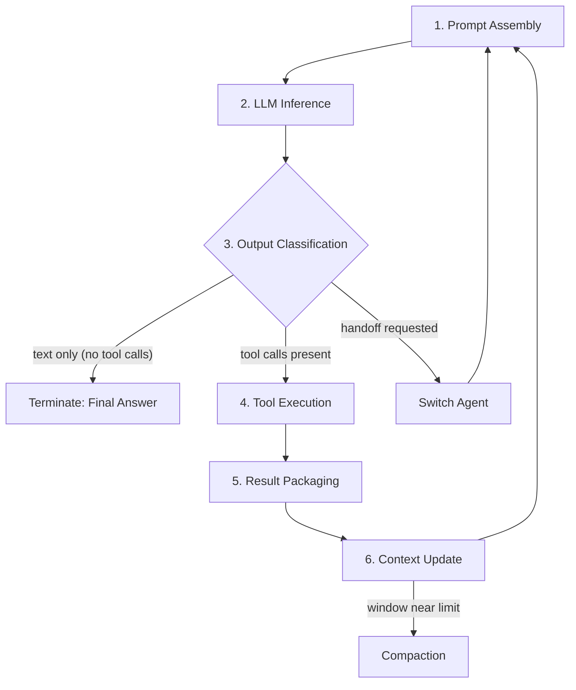
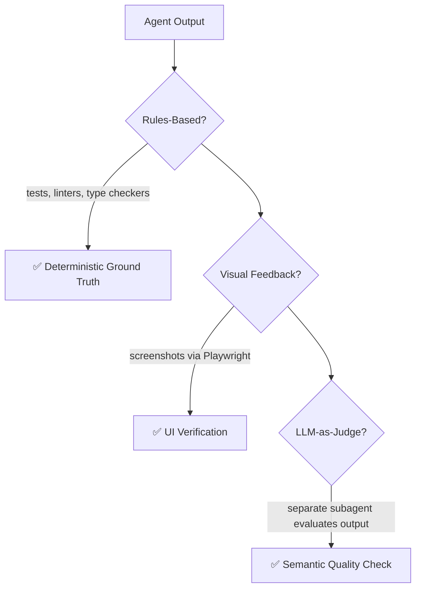
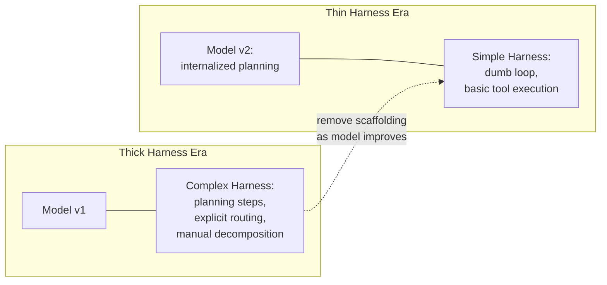
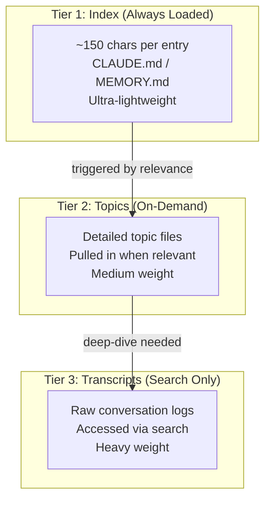

# 28. Agent Harness — The Anatomy of Production AI Agents

> **Parent**: [System Design Interview Reference](README.md)  
> **Source**: [The Anatomy of an Agent Harness](../articles/personal-blogs/the-anatomy-of-agent-harness.md) — by Akshay Pachaar (2026)  
> **Purpose**: Extract reusable architectural patterns for designing the non-model infrastructure that transforms a stateless LLM into a capable, production-grade agent.  
> **Also see**: [AI Agent Architecture](21-ai-agent-architecture-key-takeaways.md), [Agentic AI — Enterprise Strategic Systems](17-agentic-ai-enterprise-strategic-systems.md), [AI/ML Infrastructure](11-ai-ml-infrastructure.md)  
> **Taxonomy Reference**: §12 AI Applications, §2 Application Software Architecture

---

## Contents

- [harness-01: The Harness Is the Product — Infrastructure over Model](#harness-01-the-harness-is-the-product--infrastructure-over-model) — Why harness design matters more than model choice
- [harness-02: Three Levels of Engineering — Prompt, Context, Harness](#harness-02-three-levels-of-engineering--prompt-context-harness) — The concentric layers that make agents work
- [harness-03: The Orchestration Loop — ReAct/TAO Cycle](#harness-03-the-orchestration-loop--reacttao-cycle) — The heartbeat of every agent
- [harness-04: Context Management — Fighting Context Rot](#harness-04-context-management--fighting-context-rot) — Why 30%+ degradation happens mid-window and how to prevent it
- [harness-05: Verification Loops — Rules, Visual, LLM-as-Judge](#harness-05-verification-loops--rules-visual-llm-as-judge) — 2–3x quality improvement through self-verification
- [harness-06: Error Handling — Compounding Failure in Multi-Step Agents](#harness-06-error-handling--compounding-failure-in-multi-step-agents) — Why 99% per-step isn't good enough
- [harness-07: Thin vs. Thick Harness — The Scaffolding Co-Evolution](#harness-07-thin-vs-thick-harness--the-scaffolding-co-evolution) — Betting on model improvement vs. explicit control
- [harness-08: Tool Scoping — Less Is More](#harness-08-tool-scoping--less-is-more) — Why removing 80% of tools gets better results
- [harness-09: Memory Architecture — Multi-Tiered Persistence](#harness-09-memory-architecture--multi-tiered-persistence) — Index → Topics → Transcripts hierarchy
- [harness-10: Seven Decisions That Define Every Harness](#harness-10-seven-decisions-that-define-every-harness) — The architect's choice framework

---

## harness-01: The Harness Is the Product — Infrastructure over Model

> **Source**: [The Harness Is the Product](../articles/personal-blogs/the-anatomy-of-agent-harness.md#the-harness-is-the-product)

| | |
|:---|:---|
| **Problem** | Two products using the same LLM can have wildly different performance. Teams focus on model selection while the infrastructure wrapping the model determines production outcomes |
| **Root cause** | The "agent" is emergent behavior — the goal-directed, tool-using, self-correcting entity the user interacts with. The harness is the machinery producing that behavior. When someone says "I built an agent," they mean they built a harness and pointed it at a model |

**Strategy — Invest in harness engineering as the primary differentiator**:

> "If you're not the model, you're the harness." — Vivek Trivedy, LangChain

| Evidence | Result |
|:---|:---|
| LangChain on TerminalBench 2.0 | Jumped from outside top 30 to rank 5 by changing **only** the harness (same model, same weights) |
| LLM-optimized harness research | 76.4% pass rate when an LLM optimized the harness itself, surpassing hand-designed systems |
| TerminalBench rankings | Changing only the harness moved agents by 20+ ranking positions |

**The LLM-as-Computer Analogy** (Beren Millidge, 2023):



> "We have reinvented the Von Neumann architecture" because it's a natural abstraction for any computing system.

**Tradeoff**: Harness engineering is invisible work — harder to demo and hype than model selection — vs. the reality that the harness, not the model, is what ships to production.

> **Azure**: [Azure AI Agent Service](https://learn.microsoft.com/en-us/azure/ai-services/agents/) (managed harness) + [Azure AI Foundry](https://learn.microsoft.com/en-us/azure/ai-foundry/) | **Taxonomy**: §12 AI Applications

---

## harness-02: Three Levels of Engineering — Prompt, Context, Harness

> **Source**: [Three Levels of Engineering](../articles/personal-blogs/the-anatomy-of-agent-harness.md#three-levels-of-engineering)

| | |
|:---|:---|
| **Problem** | Teams conflate prompt writing with agent building. A great prompt on a bad harness produces a chatbot, not an agent |
| **Root cause** | Three concentric levels of engineering surround every model, but most teams only invest in the innermost one |

**Strategy — Engineer all three levels explicitly**:

```
┌─────────────────────────────────────────────────────────────┐
│                  HARNESS ENGINEERING                         │
│  (Tool orchestration, state persistence, error recovery,     │
│   verification loops, safety enforcement, lifecycle mgmt)    │
│  ┌───────────────────────────────────────────────────────┐  │
│  │              CONTEXT ENGINEERING                       │  │
│  │  (What the model sees and when: memory files,          │  │
│  │   compaction, JIT retrieval, sub-agent delegation)     │  │
│  │  ┌─────────────────────────────────────────────────┐  │  │
│  │  │           PROMPT ENGINEERING                     │  │  │
│  │  │  (Instructions the model receives: system        │  │  │
│  │  │   prompt, tool schemas, conversation history)    │  │  │
│  │  │                                                  │  │  │
│  │  │              ┌──────────────┐                    │  │  │
│  │  │              │   THE MODEL  │                    │  │  │
│  │  │              └──────────────┘                    │  │  │
│  │  └─────────────────────────────────────────────────┘  │  │
│  └───────────────────────────────────────────────────────┘  │
└─────────────────────────────────────────────────────────────┘
```

| Level | Scope | Example |
|:---|:---|:---|
| **Prompt Engineering** | The instructions the model receives | System prompt, tool schemas, user message |
| **Context Engineering** | What the model sees and when | Memory files, compaction, JIT retrieval |
| **Harness Engineering** | The complete application infrastructure | Tool orchestration, state persistence, error recovery, verification loops, safety enforcement |

**The harness is NOT a wrapper around a prompt. It is the complete system that makes autonomous agent behavior possible.**

**Tradeoff**: Each additional engineering layer adds complexity vs. the impossibility of a raw LLM (even with a perfect prompt) behaving as a reliable agent without harness infrastructure.

> **Azure**: [Azure AI Foundry — Prompt Flow](https://learn.microsoft.com/en-us/azure/ai-foundry/concepts/prompt-flow) (prompt + context engineering) + [Azure AI Agent Service](https://learn.microsoft.com/en-us/azure/ai-services/agents/) (harness) | **Taxonomy**: §12 AI Applications

---

## harness-03: The Orchestration Loop — ReAct/TAO Cycle

> **Source**: [The Orchestration Loop](../articles/personal-blogs/the-anatomy-of-agent-harness.md#1-the-orchestration-loop)

| | |
|:---|:---|
| **Problem** | A single LLM call is stateless. Without a loop, there's no agent — just a chatbot that answers once and stops |
| **Root cause** | The Thought-Action-Observation (TAO) cycle — also called the `ReAct` loop — is the heartbeat that transforms single-call models into multi-step agents |

**Strategy — Implement a "dumb loop" with intelligent model-driven decisions**:



| Step | What Happens | Key Concern |
|:---|:---|:---|
| 1. Prompt Assembly | System prompt + tool schemas + memory + history + current message | Position critical content at beginning and end (Lost in the Middle) |
| 2. LLM Inference | Model generates tokens: text, tool calls, or both | Stateless — all state lives in prompt |
| 3. Output Classification | Text only → done. Tool calls → execute. Handoff → switch agent | Native tool calling preferred over free-text parsing |
| 4. Tool Execution | Validate args, check permissions, sandboxed exec, capture results | Read-only parallel; mutating serial |
| 5. Result Packaging | Format tool results as LLM-readable messages | Errors returned as results so model can self-correct |
| 6. Context Update | Append results to history; compact if near limit | Avoid context rot (see [harness-04](#harness-04-context-management--fighting-context-rot)) |

**Anthropic's approach**: The runtime is a "dumb loop." All intelligence lives in the model. The harness just manages turns.

**Termination conditions** (layered): Model produces text with no tool calls, max turn limit exceeded, token budget exhausted, guardrail tripwire fires, user interrupts, or safety refusal.

| Task Complexity | Typical Turns |
|:---|:---|
| Simple question | 1–2 turns |
| Complex refactoring | Dozens of tool calls across many turns |
| Multi-session (Ralph Loop) | Initializer → multiple Coding Agent sessions |

**Tradeoff**: `ReAct` interleaves reasoning and action at every step (flexible, higher per-step cost) vs. plan-and-execute (LLMCompiler reports 3.6x speedup over sequential `ReAct`, but less flexible for mid-course corrections).

> **Azure**: [Azure AI Agent Service](https://learn.microsoft.com/en-us/azure/ai-services/agents/) (managed orchestration loop) | **Taxonomy**: §12 AI Applications

---

## harness-04: Context Management — Fighting Context Rot

> **Source**: [Context Management](../articles/personal-blogs/the-anatomy-of-agent-harness.md#4-context-management)

| | |
|:---|:---|
| **Problem** | Model performance degrades 30%+ when key content falls in mid-window positions. Even million-token windows suffer instruction-following degradation as context grows |
| **Root cause** | The "Lost in the Middle" phenomenon (Stanford research): models attend strongly to beginning and end of context, but mid-window content is effectively invisible. More tokens = worse results |

**Strategy — Find the smallest possible set of high-signal tokens**:

> Anthropic's context engineering guide: find the smallest possible set of high-signal tokens that maximize likelihood of the desired outcome.

| Strategy | How It Works | Used By |
|:---|:---|:---|
| **Compaction** | Summarize conversation history when approaching limits; preserve architectural decisions and unresolved bugs; discard redundant tool outputs | Claude Code |
| **Observation Masking** | Hide old tool outputs while keeping tool calls visible | JetBrains Junie |
| **Just-in-Time Retrieval** | Maintain lightweight identifiers; load data dynamically via `grep`, `glob`, `head`, `tail` rather than loading full files | Claude Code (95% context reduction) |
| **Sub-Agent Delegation** | Each subagent explores extensively but returns only 1,000–2,000 token condensed summaries | Claude Code, LangGraph |
| **ACON (Automated Context Optimization)** | Prioritize reasoning traces over raw tool outputs | Research: 26–54% token reduction while preserving 95%+ accuracy |

**The five production approaches to context window management**:

| Approach | Mechanism | Best For |
|:---|:---|:---|
| Time-based clearing | Drop messages older than N turns | Short, fast sessions |
| Conversation summarization | LLM-compress history into a summary | Long-running tasks |
| Observation masking | Hide old outputs, show tool calls | Debugging + context saving |
| Structured note-taking | Auto-generated progress/status files | Multi-session continuity |
| Sub-agent delegation | Condensed sub-task summaries | Complex multi-file tasks |

**Tradeoff**: Aggressive context trimming may discard relevant information vs. degraded model performance from context bloat. The sweet spot is preserving high-signal content while discarding redundant tool outputs.

> **Azure**: [Azure OpenAI — Prompt Caching](https://learn.microsoft.com/en-us/azure/ai-services/openai/how-to/prompt-caching) (reduce token usage) | **Taxonomy**: §12 AI Applications, §7 Reliability & Performance

---

## harness-05: Verification Loops — Rules, Visual, LLM-as-Judge

> **Source**: [Verification Loops](../articles/personal-blogs/the-anatomy-of-agent-harness.md#10-verification-loops)

| | |
|:---|:---|
| **Problem** | Agents generate output with no self-check. A demo works; production fails silently because nothing verified the result |
| **Root cause** | Toy agents omit verification entirely. Production agents need a feedback loop that catches errors before they compound |

**Strategy — Three verification approaches that improve quality 2–3x**:

> Boris Cherny, creator of Claude Code: giving the model a way to verify its work improves quality by 2 to 3x.



| Verification Type | Mechanism | Use Case | Characteristics |
|:---|:---|:---|:---|
| **Rules-Based** | Tests, linters, type checkers, schema validation | Code generation, data transformation | Deterministic, fast, no LLM cost |
| **Visual Feedback** | Screenshots via Playwright for UI tasks | Front-end work, visual changes | Catches rendering issues text-based checks miss |
| **LLM-as-Judge** | Separate subagent evaluates output quality | Semantic correctness, reasoning quality | Adds latency but catches issues rules miss |

**Martin Fowler's Thoughtworks framing**:

| Role | Mechanism | Timing |
|:---|:---|:---|
| **Guides** (feedforward) | Steer behavior before action | Before tool execution |
| **Sensors** (feedback) | Observe result after action | After tool execution |

**Claude Code's Gather-Act-Verify cycle**: Gather context (search files, read code) → Take action (edit files, run commands) → Verify results (run tests, check output) → Repeat.

**Tradeoff**: Verification loops add latency and LLM cost (especially LLM-as-judge) vs. the compounding cost of undetected errors in multi-step agent workflows.

> **Azure**: [Azure DevOps](https://azure.microsoft.com/en-us/products/devops/) (rules-based CI verification) + [Azure OpenAI](https://learn.microsoft.com/en-us/azure/ai-services/openai/) (LLM-as-judge) | **Taxonomy**: §12 AI Applications, §7 Reliability & Performance

---

## harness-06: Error Handling — Compounding Failure in Multi-Step Agents

> **Source**: [Error Handling](../articles/personal-blogs/the-anatomy-of-agent-harness.md#8-error-handling)

| | |
|:---|:---|
| **Problem** | A 10-step process with 99% per-step success has only ~90.4% end-to-end success. Errors compound fast in multi-turn agents |
| **Root cause** | Each tool call, API invocation, and LLM inference carries independent failure probability. Without structured error handling, failure probability multiplies across steps |

**Strategy — Classify errors and handle each category differently**:

| Error Type | Strategy | Example |
|:---|:---|:---|
| **Transient** | Retry with exponential backoff | Network timeout, rate limit |
| **LLM-Recoverable** | Return error as `ToolMessage` so the model can adjust | Wrong argument format, missing parameter |
| **User-Fixable** | Interrupt for human input | Missing file path, permission denied |
| **Unexpected** | Bubble up for debugging | Assertion failure, unhandled exception |

**Key practices across frameworks**:

| Framework | Error Handling Approach |
|:---|:---|
| **LangGraph** | Four-category classification (above); errors returned as structured `ToolMessage` |
| **Anthropic Claude Code** | Catches failures within tool handlers; returns them as error results to keep the loop running |
| **Stripe (production harness)** | Caps retry attempts at two |

**The error compounding formula**:

$$P(\text{end-to-end success}) = \prod_{i=1}^{n} P(\text{step}_i)$$

For $n = 10$ steps at $P = 0.99$: $0.99^{10} \approx 0.904$ — nearly 10% failure rate from seemingly reliable components.

**Tradeoff**: More sophisticated error handling adds harness complexity vs. silent failures that corrupt agent state and produce wrong results with no visibility.

> **Azure**: [Azure API Management — Retry Policies](https://learn.microsoft.com/en-us/azure/api-management/retry-policy) (transient handling) + [Azure Monitor](https://learn.microsoft.com/en-us/azure/azure-monitor/) (error observability) | **Taxonomy**: §12 AI Applications, §10 Resilience Patterns

---

## harness-07: Thin vs. Thick Harness — The Scaffolding Co-Evolution

> **Source**: [The Scaffolding Metaphor](../articles/personal-blogs/the-anatomy-of-agent-harness.md#the-scaffolding-metaphor)

| | |
|:---|:---|
| **Problem** | Should harness logic live in code (thick harness) or in the model (thin harness)? The answer changes as models improve |
| **Root cause** | Construction scaffolding is temporary infrastructure that enables workers to build structures they couldn't reach otherwise. It doesn't do the construction — but without it, workers can't reach the upper floors. As the building rises, scaffolding is removed |

**Strategy — Design harnesses that can shed complexity as models improve**:



| Framework Philosophy | Approach | Bet |
|:---|:---|:---|
| **Anthropic** | Thin harness — "dumb loop," model intelligence | Model improvement will internalize harness complexity |
| **OpenAI** | Code-first thin harness — native Python, no graph DSL | Developer ergonomics over explicit control |
| **LangGraph** | Explicit state graphs — typed dictionaries, conditional edges | Explicit control enables debugging and reliability |
| **CrewAI** | Role-based multi-agent with deterministic Flows backbone | Deterministic routing + autonomous collaboration |

**The co-evolution principle**: Models are now post-trained with specific harnesses in the loop. Changing tool implementations can degrade performance because of this tight coupling.

| Evidence | Implication |
|:---|:---|
| Manus rebuilt 5 times in 6 months | Each rewrite removed complexity as models improved |
| Claude Code's model learned specific harness behavior | Changing tools may break model expectations |
| Anthropic regularly deletes planning steps | New model versions internalize what was explicit harness logic |

**The "future-proofing test"**: If performance scales up with more powerful models without adding harness complexity, the design is sound.

**Tradeoff**: Thin harnesses depend on model capability (risk: model regressions break behavior) vs. thick harnesses that become legacy overhead as models improve (risk: maintaining scaffolding the building no longer needs).

> **Azure**: [Azure AI Foundry](https://learn.microsoft.com/en-us/azure/ai-foundry/) (model versioning + evaluation) | **Taxonomy**: §12 AI Applications, §11 Architectural Qualities

---

## harness-08: Tool Scoping — Less Is More

> **Source**: [Tool Scoping Strategy](../articles/personal-blogs/the-anatomy-of-agent-harness.md#6-tool-scoping-strategy)

| | |
|:---|:---|
| **Problem** | More tools often means worse agent performance. Models get confused by too many options and make wrong tool selections |
| **Root cause** | Tool definitions consume context window tokens and increase decision complexity. The model must evaluate every tool for every step — tool overload degrades both speed and accuracy |

**Strategy — Expose the minimum tool set needed for the current step**:

| Evidence | Result |
|:---|:---|
| Vercel v0 | Removed 80% of tools — got better results |
| Claude Code | 95% context reduction via lazy loading |
| Industry consensus | ~10 overlapping tools is the threshold before splitting into multi-agent |

**Tool categories in production harnesses** (Claude Code model):

| Category | Examples |
|:---|:---|
| File Operations | Read, write, edit, glob, grep |
| Search | Code search, semantic search |
| Execution | Shell commands, script execution |
| Web Access | HTTP requests, browser automation |
| Code Intelligence | References, definitions, diagnostics |
| Subagent Spawning | Fork, Teammate, Worktree |

**The tool selection principle**: Expose exactly what the current step needs, not everything the system can do. Use lazy loading, context-dependent tool filtering, and narrow scoping per agent role.

**Tradeoff**: Fewer tools limits agent flexibility (some tasks become impossible) vs. too many tools causing decision paralysis and degraded performance across all tasks.

> **Azure**: [Azure AI Agent Service — Tool Configuration](https://learn.microsoft.com/en-us/azure/ai-services/agents/) + [MCP (Model Context Protocol)](../reference-dictionary/ai-ml-llm.md#mcp) | **Taxonomy**: §12 AI Applications

---

## harness-09: Memory Architecture — Multi-Tiered Persistence

> **Source**: [Memory](../articles/personal-blogs/the-anatomy-of-agent-harness.md#3-memory)

| | |
|:---|:---|
| **Problem** | Agents forget context between sessions. Without persistent memory, every conversation starts from zero — the agent cannot learn or build on prior work |
| **Root cause** | Raw LLMs are stateless. Memory must be engineered externally across multiple timescales and retrieval strategies |

**Strategy — Three-tier memory hierarchy with lazy loading**:



| Timescale | Mechanism | Framework Examples |
|:---|:---|:---|
| **Short-term** | Conversation history within a single session | All frameworks (context window) |
| **Long-term (file-based)** | `CLAUDE.md` project files, auto-generated `MEMORY.md` | Anthropic Claude Code |
| **Long-term (structured)** | Namespace-organized JSON Stores | LangGraph |
| **Long-term (database)** | Sessions backed by SQLite or Redis | OpenAI Agents SDK |

**Critical design principle**: The agent treats its own memory as a "hint" and verifies against actual state before acting. Memory is suggestive, not authoritative.

**Tradeoff**: Persistent memory enables continuity across sessions but introduces staleness risk — the agent might act on outdated cached information unless verification is built into the memory retrieval pipeline.

> **Azure**: [Azure Cosmos DB](https://learn.microsoft.com/en-us/azure/cosmos-db/) (session persistence) + [Azure Cache for Redis](https://learn.microsoft.com/en-us/azure/azure-cache-for-redis/) (short-term memory) | **Taxonomy**: §12 AI Applications, §4 Data & Analytics

---

## harness-10: Seven Decisions That Define Every Harness

> **Source**: [Seven Decisions That Define Every Harness](../articles/personal-blogs/the-anatomy-of-agent-harness.md#seven-decisions-that-define-every-harness)

| | |
|:---|:---|
| **Problem** | Every harness architect faces the same set of choices, but there's no universal right answer — each decision depends on use case, model capability, and deployment context |
| **Root cause** | The agent harness design space is multi-dimensional. Making these choices implicitly (by accepting defaults) leads to accidental architecture |

**Strategy — Make each decision explicitly based on context**:

| # | Decision | Options | Key Insight |
|:---|:---|:---|:---|
| 1 | **Single-agent vs. multi-agent** | Maximize single-agent first; split only when >10 overlapping tools or clearly separate domains | Both Anthropic and OpenAI agree: multi-agent adds overhead (extra LLM calls for routing, context loss during handoffs) |
| 2 | **ReAct vs. plan-and-execute** | `ReAct` interleaves reasoning + action; plan-and-execute separates them | LLMCompiler: 3.6x speedup over sequential `ReAct`, but less flexible for mid-course corrections |
| 3 | **Context window management** | Time-based, summarization, masking, note-taking, sub-agent delegation | No single strategy fits all; most production systems combine multiple approaches |
| 4 | **Verification loop design** | Rules-based (deterministic), visual (Playwright), LLM-as-judge (semantic) | Verification improves quality 2–3x; choose based on output type |
| 5 | **Permission & safety architecture** | Permissive (auto-approve, fast) vs. restrictive (approve each action, safe) | Depends on deployment context; Anthropic gates ~40 discrete tool capabilities independently with three permission stages |
| 6 | **Tool scoping strategy** | Minimal tool set per step; lazy loading; context-dependent filtering | Vercel removed 80% of tools and got better results |
| 7 | **Harness thickness** | Thin (bet on model improvement) vs. thick (explicit control logic) | Co-evolves with model capability; the future-proofing test: does performance scale with better models without more harness? |

**The meta-principle**:

> Don't accept defaults. Every harness decision has a performance implication. Make them explicit and revisit them as models improve.

**Tradeoff**: Explicit architectural decisions require upfront investment in understanding the design space vs. accepting framework defaults that may be suboptimal for your specific use case.

> **Azure**: [Azure Well-Architected Framework — AI Workloads](https://learn.microsoft.com/en-us/shows/azure-essentials-show/designing-ai-workloads-with-waf/) | **Taxonomy**: §12 AI Applications, §11 Architectural Qualities

---

## Quick Reference: Agent Harness Patterns

| Pattern | When to Use | Key Tradeoff |
|:---|:---|:---|
| Harness-First Design | Building production agents (not demos) | Invisible engineering vs. visible model hype |
| Three-Level Engineering | Any agent beyond a single prompt | Layer complexity vs. chatbot simplicity |
| Dumb Loop + Smart Model | Maximum flexibility, evolving models | Model-dependent; regressions break behavior |
| Context Compaction | Long-running or multi-session tasks | Risk of discarding critical context |
| Verification Loops | Any output that must be correct | Latency + LLM cost vs. undetected errors |
| Error Classification | Multi-step agent workflows | Harness complexity vs. silent failure |
| Lazy Tool Loading | >5 tools or large tool schemas | Less flexibility vs. better model decisions |
| Multi-Tier Memory | Cross-session continuity | Staleness risk if verification is skipped |
| Thin Harness Architecture | Betting on model improvement | Requires re-validation on model updates |
| Explicit Harness Decisions | Avoiding accidental architecture | Upfront design cost vs. framework defaults |

---

> **Taxonomy**: §12 AI Applications · §2 Application Software Architecture · §7 Reliability & Performance · §11 Architectural Qualities  
> **See also**: [AI Agent Architecture](21-ai-agent-architecture-key-takeaways.md) · [Agentic AI — Enterprise Strategic Systems](17-agentic-ai-enterprise-strategic-systems.md) · [AI/ML Infrastructure](11-ai-ml-infrastructure.md) · [Resilience Patterns](10-resilience-patterns.md)  
> **Source article**: [The Anatomy of an Agent Harness](../articles/personal-blogs/the-anatomy-of-agent-harness.md)
