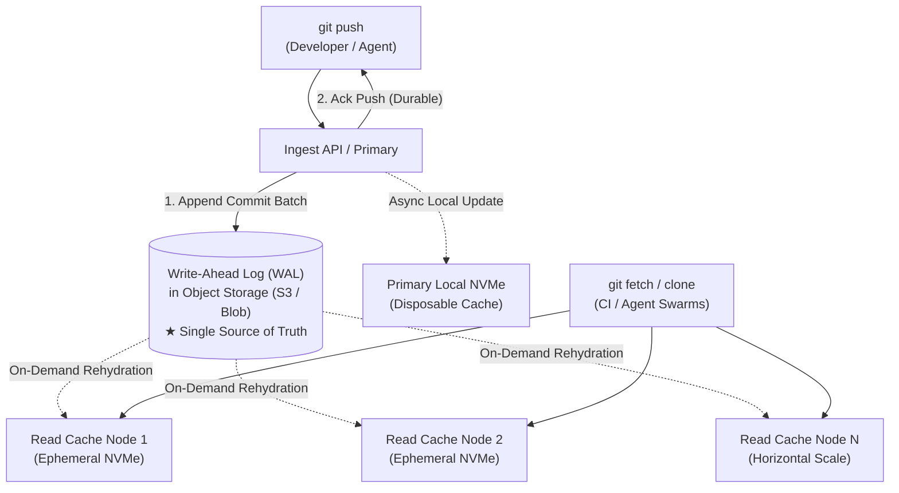

# 39. Git Repository Infrastructure for the AI Agent Era — Key Takeaways

> **Parent**: [System Design Interview Reference](../index.md)  
> **Source**: [Your Git Repository Wasn’t Designed for the AI Era](../../articles/agentic-ai/your-git-repository-wasnt-designed-for-the-ai-era.md)  
> **Reference Blog**: [Cursor Blog — Git at any scale (Vicent Martí)](https://cursor.com/blog/git-at-any-scale)  
> **Purpose**: Extract reusable storage and distributed systems patterns for hosting version control systems under autonomous coding agent workloads: solving the mismatch between Git's pointer-chasing DAG storage model and distributed network latency, resolving the fixed-floor/low-ceiling trade-offs of quorum consensus replication, and adopting log-first architectures where object storage acts as the single source of truth while on-disk Git instances act as disposable, lazily-materialized read caches.

> **Also see**: [Agent Harness](agent-harness.md), [Agentic Core Engineering](agentic-core-engineering.md), [Agentic Loop Engineering](agentic-loop-engineering.md), [38. Agentic AI — Key Takeaways](38-agentic-key-takeaways.md)  
> **Dictionary**: [Log-First Storage Architecture](../../reference-dictionary/architecture-patterns.md#log-first-storage-architecture), [Application-Level Replication](../../reference-dictionary/architecture-patterns.md#application-level-replication), [Disposable Repositories](../../reference-dictionary/ai-ml-llm.md#disposable-repositories), [AI/ML/LLM](../../reference-dictionary/ai-ml-llm.md)  
> **Taxonomy Reference**: §8.1 DevOps Architecture

---

## Contents

| ID | Problem | Key Concept |
|:---|:---|:---|
| [agentic-51](#agentic-51) | Git's pointer-chasing DAG data model incurs severe latency amplification when distributed across networked disks | Git Object DAG & Distributed Latency Amplification |
| [agentic-52](#agentic-52) | Autonomous coding agents invert historical version control assumptions by orders of magnitude | Agentic Workload Inversion: High-Frequency Pushes & Disposable Repos |
| [agentic-53](#agentic-53) | Traditional application-level replication imposes a costly fixed floor on idle repos and a low consensus ceiling on busy monorepos | Application-Level Replication Bottlenecks (Fixed Floor vs. Consensus Ceiling) |
| [agentic-54](#agentic-54) | Decoupling repository durability from read serving via log-first storage and ephemeral local caches | Log-First Git Architecture (Object Storage WAL + Materialized Caches) |

---

## agentic-51: Git Object DAG & Distributed Latency Amplification

> **Source**: [§Git Was Built for a Very Different Workload](../../articles/agentic-ai/your-git-repository-wasnt-designed-for-the-ai-era.md#git-was-built-for-a-very-different-workload)

| | |
|:---|:---|
| **Problem** | Hosting Git repositories at cloud scale over networked storage or clustered nodes introduces dramatic latency degradation compared to local workstation disks, making operations like diffing trees, listing commits, or fetching file blobs sluggish. |
| **Root cause** | Git models repository history and directory trees as a Directed Acyclic Graph (DAG) of immutable, content-addressed objects (commits, trees, blobs, annotated tags) stored in packfiles. Locating a specific file at a given commit requires sequential pointer chasing (fetching the commit $\to$ fetching the root tree $\to$ traversing directory tree objects sequentially for each path segment $\to$ fetching the final blob). On local NVMe storage, these random I/O operations take microseconds; distributed across a network cluster, each step incurs an $O(N)$ network round trip. |

```python
# Sequential pointer chasing in Git's object graph
def walk_to_file(commit_sha: str, path: str) -> Blob:
    commit = fetch_object(commit_sha)          # Network round-trip 1
    tree = fetch_object(commit.tree_sha)       # Network round-trip 2
    for part in path.strip("/").split("/"):
        entry = tree.find_entry(part)
        tree = fetch_object(entry.sha)         # Network round-trip N
    return tree  # Target file blob
```

> **Strategy**:
> 1. **Co-locate DAG traversal on fast local media**: Keep active packfile indexes and object caches on local high-IOPS NVMe disks rather than executing graph traversal over distributed networked filesystems (NFS/EFS/SMB).
> 2. **Pre-compute and index commit reachability**: Utilize commit-graph files and reachability bitmaps (`git commit-graph write --reachable`) to short-circuit multi-hop commit graph traversals during fetch and merge negotiations.
> 3. **Batch object fetching**: Where network queries are unavoidable, vectorize object requests into bulk batch lookups rather than chasing single SHA pointers iteratively.
>
> **Tradeoff**: Local caching requires cache warming and synchronization mechanisms when commits are updated across distributed server nodes.
>
> **Also see**: [Virtual File System (VFS)](../../reference-dictionary/architecture-patterns.md#virtual-file-system-vfs) · [Pointer Chasing](../../reference-dictionary/concurrency-runtimes.md#pointer-chasing)

---

## agentic-52: Agentic Workload Inversion: High-Frequency Pushes & Disposable Repos

> **Source**: [§What Agents Change](../../articles/agentic-ai/your-git-repository-wasnt-designed-for-the-ai-era.md#what-agents-change)

| | |
|:---|:---|
| **Problem** | Cloud Git hosting architectures designed around human collaboration patterns face severe resource exhaustion, connection pool saturation, and metadata bloat when subjected to autonomous AI coding agents. |
| **Root cause** | Traditional systems assume bounded human pacing (a few developers pushing branches a handful of times per day). AI coding agents invert these traffic profiles across three vectors simultaneously: (1) **Push volume explosion** (continuous edit-test-fix loops pushing multiple commits per minute), (2) **Repository count explosion** (agents provisioning thousands of disposable, short-lived sandboxed repositories for isolated experiments that are abandoned after minutes), and (3) **Immediate read concurrency spikes** (multi-agent swarms, CI runners, and verification loops requesting identical commit states immediately upon push). |

| Metric / Dimension | Human Developer Workload | Autonomous Agent Workload | Architecture Impact |
|:---|:---|:---|:---|
| **Push Cadence** | 5–20 pushes/day per engineer | 100–1,000+ pushes/day per active loop | Saturates write coordination & packfile delta calculation |
| **Repository Lifecycle** | Long-lived, multi-year projects | Ephemeral, throwaway sandboxes (5–60 min) | Exhausts static tenant provisioning & replica pools |
| **Read Synchronization** | Minutes to hours between push and review | Milliseconds (CI runners, review agents, test bots) | Causes intense lock contention & thundering herds on new commits |

> **Strategy**:
> 1. **Tiered Repository Lifecycle Management**: Classify repositories into *persistent* and *ephemeral/disposable* tiers. Ephemeral agent sandboxes bypass heavy governance and full static multi-node provisioning.
> 2. **Decouple Write Durability from Live Replica Quotas**: Accept high-frequency push writes directly into high-throughput append-only ingest streams rather than blocking on heavy distributed packfile repacking.
> 3. **Edge Caching for Immediate Reads**: Fan out commit notifications via pub/sub so read caches warm before downstream CI/review agent swarms initiate fetches.
>
> **Tradeoff**: Ephemeral repository classification requires explicit TTLs and garbage collection policies to prevent abandoned sandboxes from accumulating metadata debt.
>
> **Also see**: [Disposable Repositories](../../reference-dictionary/ai-ml-llm.md#disposable-repositories) · [Verification Loop (AI)](../../reference-dictionary/ai-ml-llm.md#verification-loop-ai) · [Agent Harness](agent-harness.md)

---

## agentic-53: Application-Level Replication Bottlenecks (Fixed Floor vs. Consensus Ceiling)

> **Source**: [§What Agents Change](../../articles/agentic-ai/your-git-repository-wasnt-designed-for-the-ai-era.md#what-agents-change)

| | |
|:---|:---|
| **Problem** | Traditional enterprise Git hosting (e.g., maintaining 3 full on-disk repository copies synchronized via quorum consensus protocols like Raft or Paxos) incurs unsustainable infrastructure costs on idle repos and hits strict throughput bottlenecks on high-traffic monorepos. |
| **Root cause** | Quorum-replicated on-disk architectures suffer from a dual constraint: (1) **The Fixed Floor**: Every repository—including ephemeral single-use agent sandboxes—demands its full replica quota (3+ NVMe instances) permanently allocated, wasting massive compute, RAM, and disk for idle repos. (2) **The Low Consensus Ceiling**: To handle heavy CI/agent traffic on a monorepo, adding more replicas slows down the write path because synchronous quorum consensus waits on the slowest machine in the consensus ring (straggler effect). |

```text
Traditional Application-Level Replication (Quorum Push Bottleneck):

PUSH ──▶         ┌─────────────┐
                 │ Coordinator │
                 └──────┬──────┘
                         │ synchronous fan-out
           ┌─────────────┼─────────────┐
           ▼             ▼             ▼
     ┌─────────┐   ┌─────────┐   ┌─────────┐
     │ Replica │   │ Replica │   │ Replica │
     │    A    │   │    B    │   │    C    │
     └─────────┘   └─────────┘   └─────────┘
           │             │             │
           └─────────────┴─────────────┘
             Majority acknowledgment required
             (Bottlenecked by slowest replica)
```

> **Strategy**:
> 1. **Break the Homogeneous Quorum Requirement**: Do not require full on-disk filesystem instances to participate in synchronous consensus rings for write confirmation.
> 2. **Asymmetric Replication**: Separate the durability consensus mechanism (handled by storage-layer WAL) from query execution instances (stateless read nodes).
> 3. **Eliminate Straggler-Induced Push Latency**: Confine the write commit path to a fast, single-hop durable append rather than a multi-node lockstep filesystem sync.
>
> **Tradeoff**: Moving away from full local active-active replicas requires dynamic cache invalidation and lazy materialization protocols for read nodes.
>
> **Also see**: [Application-Level Replication](../../reference-dictionary/architecture-patterns.md#application-level-replication) · [Consensus Protocol](../../reference-dictionary/data-concurrency.md#consensus-protocol)

---

## agentic-54: Log-First Git Architecture (Object Storage WAL + Materialized Caches)

> **Source**: [§A Different Shape: Log First, Filesystem Second](../../articles/agentic-ai/your-git-repository-wasnt-designed-for-the-ai-era.md#a-different-shape-log-first-filesystem-second)

| | |
|:---|:---|
| **Problem** | Modern Git hosting for AI agents must provide near-zero hosting costs for millions of dormant/disposable repositories while simultaneously enabling unbounded, low-latency horizontal read scaling for hot repositories without push consensus bottlenecks. |
| **Root cause** | Conflating the durable source of truth with the query-serving filesystem format. Storing Git repositories as stateful on-disk directories forces instances to remain permanently running and bound to dedicated storage. |



> **Strategy**:
> 1. **Write-Ahead Log in Object Storage as the Single Source of Truth**: All `git push` operations serialize into an append-only WAL stored durably in cloud object storage (e.g., S3, Azure Blob Storage, Cloud Storage). A push is acknowledged as successful as soon as it is durably committed to the WAL.
> 2. **Disposable, Materialized Local Caches**: Local NVMe on-disk Git repositories act purely as disposable read caches. They materialize the Git packfile and tree structures by replaying segments from the object storage WAL on demand.
> 3. **Zero-Cost Dormant Repositories**: Dormant, historical, or disposable agent repos require 0 running compute and 0 warm NVMe storage; their entire state resides cheaply in object storage and rehydrates within seconds upon the next fetch.
> 4. **Unbounded Horizontal Read Scaling**: Because read replicas independently pull and materialize changes from the WAL, the system can spin up dozens of stateless read caches during high-concurrency CI spikes without degrading push latency or requiring consensus coordination.
>
> **Tradeoff**: Ephemeral read replicas experience a minor lag catching up to the latest WAL offset unless reading through the primary coordinator; initial cold repository hydration incurs a brief startup latency when materializing packfiles from object storage.
>
> **Also see**: [Log-First Storage Architecture](../../reference-dictionary/architecture-patterns.md#log-first-storage-architecture) · [Read/Write Path Separation](../../reference-dictionary/architecture-patterns.md#readwrite-path-separation) · [CQRS & Event Sourcing](../../reference-dictionary/cqrs-event-driven.md#cqrs)

---

## Architectural Comparison Matrix

| Architectural Dimension | Traditional Quorum Replication (e.g., Gitaly Cluster) | Log-First Object Storage Architecture (e.g., Cursor / Modern Git) |
|:---|:---|:---|
| **Authoritative Source of Truth** | Quorum of on-disk local NVMe filesystems | Append-only Write-Ahead Log in Object Storage (S3 / Blob) |
| **Write (Push) Commit Contract** | Majority ACK across $N$ physical storage nodes | Durable write to Object Storage WAL |
| **Cost of Idle / Disposable Repos** | High (full disk and compute allocation for 3+ replicas) | Near Zero (cents/GB/month in object storage; 0 compute) |
| **Read Scaling Constraint** | Limited (adding replicas increases consensus coordination) | Unbounded (stateless read nodes pull independently from WAL) |
| **Cold Repository Start** | Instantaneous (if servers are pre-provisioned) | Brief lazy hydration from S3 ($\sim$100–300 ms) |
| **Agentic Workload Suitability** | Poor (breaks under throwaway repos & high push rates) | Optimal (designed for bursty, disposable, high-concurrency loops) |

---

```json
{
  "takeaways": [
    {
      "id": "agentic-51",
      "title": "Git Object DAG & Distributed Latency Amplification",
      "problem": "Sequential pointer chasing over Git's DAG object model creates severe network round-trip amplification when hosted across distributed filesystems.",
      "strategy": "Co-locate object DAG traversals on fast local media and pre-compute reachability bitmaps to minimize random network hops.",
      "tradeoff": "Requires local caching and cache-invalidation logic across distributed nodes."
    },
    {
      "id": "agentic-52",
      "title": "Agentic Workload Inversion: High-Frequency Pushes & Disposable Repos",
      "problem": "AI coding agents violate human-centric Git assumptions with continuous high-frequency pushes, disposable sandbox repo proliferation, and immediate read spikes.",
      "strategy": "Classify repositories into persistent vs. disposable tiers and decouple fast write ingestion from long-term maintenance.",
      "tradeoff": "Requires explicit TTLs and garbage collection policies for abandoned agent sandboxes."
    },
    {
      "id": "agentic-53",
      "title": "Application-Level Replication Bottlenecks (Fixed Floor vs. Consensus Ceiling)",
      "problem": "Quorum-replicated Git hosting enforces costly resource floors on idle repos and caps write throughput on busy repos due to slowest-replica consensus wait.",
      "strategy": "Separate storage durability consensus from query-serving filesystem replicas using asymmetric replication.",
      "tradeoff": "Read nodes must manage dynamic cache invalidation rather than relying on synchronous lockstep state."
    },
    {
      "id": "agentic-54",
      "title": "Log-First Git Architecture (Object Storage WAL + Materialized Caches)",
      "problem": "Balancing near-zero idle cost for disposable agent repos with unbounded, low-latency horizontal read scaling for active monorepos.",
      "strategy": "Commit pushes to an append-only WAL in object storage as the single source of truth; treat local NVMe Git repositories as ephemeral, lazily-materialized read caches.",
      "tradeoff": "Replicas exhibit brief lag from the WAL offset; cold repos incur slight initial hydration latency from S3."
    }
  ]
}
```
