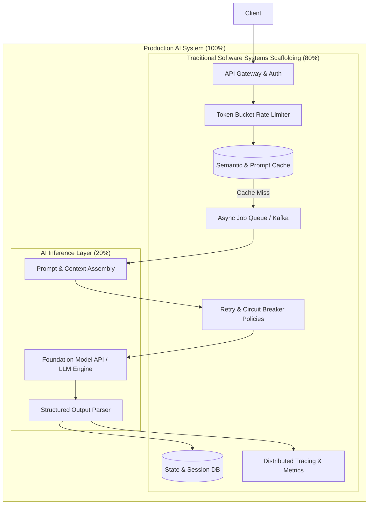
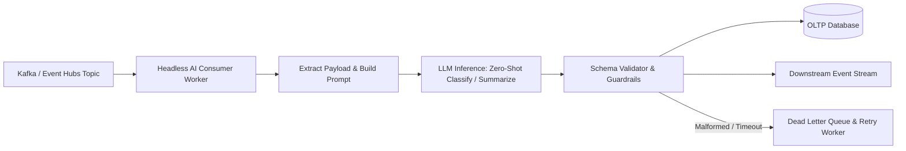
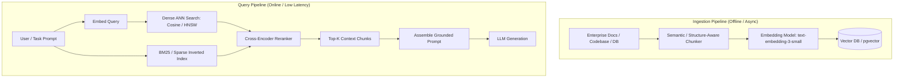
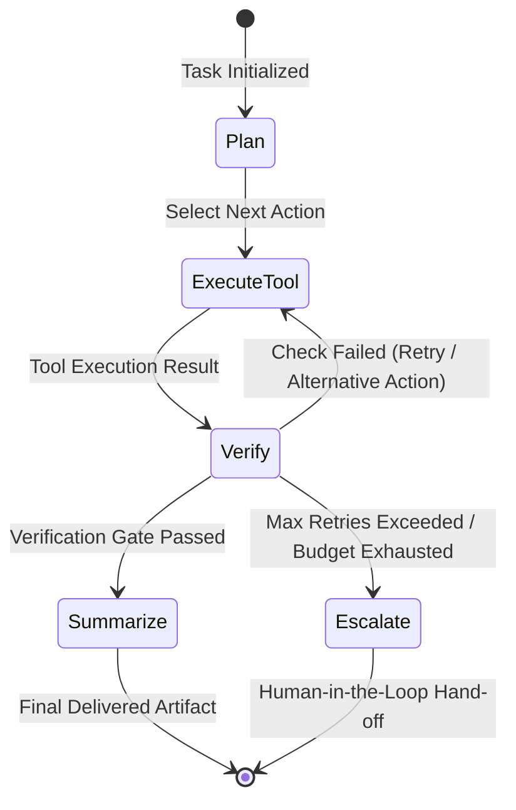
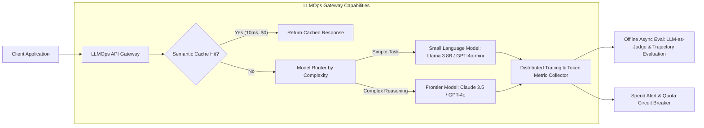

# 40. Software Engineer to AI Engineer Systems Architecture — Key Takeaways

> **Parent**: [System Design Interview Reference](../index.md)  
> **Source**: [Software Engineer to AI Engineer: Best Move 2026](../../articles/agentic-ai/software-engineer-to-ai-engineer-best-move-2026.md)  
> **Author**: [@TechWithTimm](https://x.com/TechWithTimm), published 2026-09-09  
> **Purpose**: Bridge traditional distributed software engineering and AI systems engineering by formalizing core architecture patterns: wrapping stochastic foundation models with resilient distributed systems scaffolding, enforcing deterministic structured output contracts, scaling RAG retrieval boundaries, orchestrating cyclic agent state graphs, and operationalizing production LLMOps.  

> **Also see**: [Agent Harness](agent-harness.md) (`agentic-42`), [Agentic Loop Engineering](agentic-loop-engineering.md) (`agentic-16`–`agentic-21`), [Agentic Core Engineering](agentic-core-engineering.md) (`agentic-22`–`agentic-33`), [Context Rot & Governance](38-agentic-key-takeaways.md) (`agentic-46`–`agentic-50`), [Git Infrastructure for AI](39-agentic-key-takeaways.md) (`agentic-51`–`agentic-54`), [Google SDLC & Verification](29-agentic-key-takeaways.md) (`agentic-55`–`agentic-64`)  
> **Dictionary**: [AI Engineering](../../reference-dictionary/ai-ml-llm.md#ai-engineering), [Structured Outputs](../../reference-dictionary/ai-ml-llm.md#structured-outputs), [LLMOps](../../reference-dictionary/ai-ml-llm.md#llmops), [RAG (Retrieval-Augmented Generation)](../../reference-dictionary/ai-ml-llm.md#rag), [Vector Database](../../reference-dictionary/ai-ml-llm.md#vector-database), [Model Routing by Complexity](../../reference-dictionary/ai-ml-llm.md#model-routing-by-complexity), [Semantic Caching](../../reference-dictionary/caching.md#semantic-caching), [Circuit Breaker](../../reference-dictionary/resilience.md#circuit-breaker)  
> **Azure Services**: [Azure OpenAI Service](../../architecture-azure/), [Azure AI Search](../../architecture-azure/), [Azure API Management (GenAI Gateway)](../../architecture-azure/networking/)  
> **Taxonomy Reference**: §12.1 AI Application Patterns, §2.2 Application Integration Architecture  

---

## Contents

| ID | Problem | Key Concept |
|:---|:---|:---|
| [`agentic-65`](#agentic-65-the-8020-systems-rule--ai-engineering-as-distributed-systems-scaffolding) | Mistaking AI engineering for model training and mathematical research rather than systems engineering around foundation models | The 80/20 Systems Rule: AI Engineering as Distributed Systems Scaffolding |
| [`agentic-66`](#agentic-66-operational-mental-models-vs-stochastic-prompt-hacking) | Treating LLMs as magical black boxes and relying on ad-hoc prompt hacking without reasoning about operational mechanics | Operational Mental Models: Tokens, Context Windows, and Temperature Dynamics |
| [`agentic-67`](#agentic-67-beyond-the-chatbox--headless-asynchronous-and-event-driven-llm-workflows) | Coupling LLM capabilities strictly to synchronous conversational chat UIs, causing blocking latency and thread starvation | Headless & Asynchronous LLM Pipelines: Background Workers, Queues, and Event Streams |
| [`agentic-68`](#agentic-68-output-determinism--reliability-engineering-via-structured-outputs) | Free-form natural language and markdown JSON responses fail unpredictably in downstream transactional code | Deterministic Output Contracts: Native Structured Outputs & Function Calling |
| [`agentic-69`](#agentic-69-enterprise-context-grounding--rag-and-vector-data-architecture-at-scale) | Foundation models lack proprietary corporate context and hallucinate stale facts; fine-tuning is slow and brittle | Dynamic Context Grounding: RAG, Dense Vector Embeddings, and Hybrid Retrieval |
| [`agentic-70`](#agentic-70-multi-step-orchestration--agent-state-machines) | Complex multi-hop goals cannot be solved in a single prompt execution; unmanaged agent loops spiral into runaway failure states | Agent State Graph Orchestration: Explicit State, Tool Interfaces, and Recovery Cycles |
| [`agentic-71`](#agentic-71-llmops-production-tier--runtime-governance-and-cost-quality-observability) | Deploying AI applications without production controls leads to runaway token costs, provider rate limiting, and silent quality drift | LLMOps Infrastructure Layer: Semantic Caching, Model Routing, Distributed Tracing, and Evals |

---

## agentic-65: The 80/20 Systems Rule — AI Engineering as Distributed Systems Scaffolding

| | |
|:---|:---|
| **Problem** | Software engineers often assume transitioning to AI requires a PhD in mathematics, deep learning theory, or pretraining models from scratch (PyTorch, gradient descent, CUDA kernels). Consequently, teams delay AI initiatives or hire ML researchers to build product applications, resulting in academically pure models wrapped in brittle, unmaintainable, and unscalable production software. |
| **Root cause** | Foundation models (GPT-4o, Claude 3.5 Sonnet, Llama 3) are commoditized, stateless inference engines consumed over HTTP/gRPC APIs. In production systems, the model invocation accounts for ~20% of the architecture; the remaining 80% consists of classic distributed systems challenges: authentication, rate limiting, connection pooling, retries with exponential backoff, state persistence, idempotency, data consistency, latency budgets, and telemetry. |



> **Strategy**:
> 1. **Anchor on Software Engineering Fundamentals**: Leverage existing competencies in API integration, database design, asynchronous message queues, Docker, CI/CD, and defensive error handling as the primary substrate for AI services.
> 2. **Treat the Model as a High-Latency Third-Party Microservice**: Architect the AI integration layer under the assumption that the LLM endpoint has variable latency (500ms–15s), occasional HTTP 429/500/503 errors, and token-metered operational costs.
> 3. **Decouple Business Logic from Inference**: Isolate model calls behind strict service interfaces and repository abstractions so models can be swapped, upgraded, or routed without rewriting product logic.
>
> **Tradeoff**: Focuses on application-layer implementation rather than low-level model architecture. For organizations requiring bespoke foundational pretraining, specialized ML research expertise is still necessary.
>
> **Also see**: [AI Engineering](../../reference-dictionary/ai-ml-llm.md#ai-engineering) · [Circuit Breaker](../../reference-dictionary/resilience.md#circuit-breaker) · [29. Google SDLC Guide](29-agentic-key-takeaways.md#agentic-58)

---

## agentic-66: Operational Mental Models vs. Stochastic Prompt Hacking

| | |
|:---|:---|
| **Problem** | Developers often approach LLMs with heuristic "vibe prompt engineering," blindly rephrasing prompts or adding random adjectives when a model outputs inaccurate results. When responses intermittently fail in CI/CD or production, teams cannot diagnose why the failure occurred. |
| **Root cause** | Developers lack a concrete operational mental model of how autoregressive transformers process information. LLMs do not "understand words"; they calculate conditional probability distributions over byte-pair encoding (BPE) tokens within a finite attention context window, shaped by sampling parameters and conversational role prefixes. |

```python
# Conceptual mental model of autoregressive inference mechanics
def compute_next_token_distribution(
    system_role: str,
    context_tokens: list[int],
    temperature: float
) -> int:
    # 1. Attention budget is strictly bounded by max_context_window
    assert len(context_tokens) <= MAX_CONTEXT_TOKENS, "Context window overflow"
    
    # 2. Raw logits are modulated by temperature parameter
    raw_logits = transformer_forward_pass(system_role, context_tokens)
    
    if temperature == 0.0:
        # Deterministic greedy decoding for software system reliability
        return argmax(raw_logits)
    else:
        # Scaled softmax distribution for stochastic/creative tasks
        scaled_logits = [l / temperature for l in raw_logits]
        probabilities = softmax(scaled_logits)
        return sample_from_distribution(probabilities)
```

> **Strategy**:
> 1. **Token-First Budgeting**: Measure and budget prompts by tokens rather than characters or words. Account for tokenization nuances (e.g., code, numbers, and non-English scripts consume disproportionately higher token counts).
> 2. **Context Window Attention Management**: Recognize the "lost in the middle" phenomenon where attention degrades across long token sequences. Place high-priority constraints and system directives at the boundaries (start and end) of the prompt payload.
> 3. **Deterministic Parameter Tuning**: Set `temperature = 0.0` (or `seed` parameters where supported) for structured extraction, SQL generation, routing, and classification to minimize sampling variance.
> 4. **Role Boundary Separation**: Strictly isolate `system` (immutable behavioral rules), `user` (untrusted runtime input), and `assistant` (prior conversation history) messages to prevent prompt injection and maintain conversational coherence.
>
> **Tradeoff**: Zero temperature reduces response creativity, which is desirable for structured system workflows but undesirable for open-ended brainstorming.
>
> **Also see**: [Token](../../reference-dictionary/ai-ml-llm.md#token) · [Context Rot & Governance](38-agentic-key-takeaways.md#agentic-46) · [Prompt Injection](../../reference-dictionary/security.md#prompt-injection)

---

## agentic-67: Beyond the Chatbox — Headless, Asynchronous, and Event-Driven LLM Workflows

| | |
|:---|:---|
| **Problem** | Teams reflexively implement LLM features as interactive chat widgets with synchronous HTTP request-response cycles. Under enterprise scale, user-facing threads hang during multi-second model generation, timeouts occur under load spikes, and background systems remain un-augmented by AI intelligence. |
| **Root cause** | Developers conflate the consumer interface of ChatGPT with the architectural capabilities of LLMs. In an enterprise system, LLMs are general-purpose semantic compute units capable of classification, normalization, extraction, validation, and transformation. |



> **Strategy**:
> 1. **Event-Driven Headless Processing**: Deploy worker microservices consuming from message queues (Kafka, Azure Service Bus, RabbitMQ) to perform autonomous data enrichment, ticket triage, fraud analysis, and document parsing asynchronously.
> 2. **Decouple User Ingestion from AI Inference**: Return an immediate `202 Accepted` with a job correlation ID to clients; execute multi-step LLM extraction in background task queues and notify clients via WebSockets, Server-Sent Events (SSE), or webhooks.
> 3. **Batch Embedding and Offline Ingestion**: Schedule bulk background vectorization and classification jobs during off-peak windows with aggressive rate-limit backoffs.
>
> **Tradeoff**: Increases asynchronous architecture complexity, requiring distributed job tracking, dead-letter queues (DLQ), and status-polling mechanisms for frontends.
>
> **Also see**: [Event-Driven Architecture](../../reference-dictionary/cqrs-event-driven.md#event-driven-architecture) · [Dead Letter Queue (DLQ)](../../reference-dictionary/messaging.md#dead-letter-queue-dlq)

---

## agentic-68: Output Determinism & Reliability Engineering via Structured Outputs

| | |
|:---|:---|
| **Problem** | Applications prompt LLMs to "respond in valid JSON," then attempt to parse the raw text response using `json.loads()`. In production, models intermittently prepend markdown fences (` ```json `), omit closing brackets, invent nonexistent schema keys, or interject conversational commentary, causing catastrophic downstream serialization crashes. |
| **Root cause** | Autoregressive models sample characters probabilistically. Without programmatic decoding constraints, the probability of generating a syntax error or schema violation across a multi-hundred token JSON response is non-zero. Regex stripping and fallback string manipulation are fragile stopgaps. |

```python
from pydantic import BaseModel, Field
from openai import OpenAI

class CustomerTicketExtraction(BaseModel):
    category: str = Field(description="Billing, Technical, or Account")
    urgency_score: int = Field(ge=1, le=5, description="1 is low, 5 is critical")
    extracted_account_id: str | None
    action_required: bool

client = OpenAI()

# Constrained Decoding / Structured Outputs guarantees 100% schema conformance
completion = client.beta.chat.completions.parse(
    model="gpt-4o-2024-08-06",
    messages=[
        {"role": "system", "content": "Extract customer ticket metadata."},
        {"role": "user", "content": "My account ACC-9921 is locked and payroll is blocked!"}
    ],
    response_format=CustomerTicketExtraction,
)

ticket_data: CustomerTicketExtraction = completion.choices[0].message.parsed
assert isinstance(ticket_data.urgency_score, int)  # Guaranteed valid schema
```

> **Strategy**:
> 1. **Constrained Decoding / Native Structured Outputs**: Utilize provider-native JSON Schema enforcement (e.g., OpenAI Structured Outputs, Anthropic Tool Use) that masks invalid token logits during sampling, mathematically guaranteeing 100% adherence to the defined schema.
> 2. **Pydantic / Type-Safe Model Contracts**: Define all LLM input/output payloads with strict data validation frameworks (Pydantic, Zod), treating model outputs with the same defensive serialization rules as untrusted third-party HTTP payloads.
> 3. **Native Function Calling for Actions**: Route external interactions through function calling / tool definitions rather than attempting to parse intent from conversational text.
>
> **Tradeoff**: Constrained grammar decoding adds a minor initialization latency penalty during the first request while the provider compiles the schema DFA (deterministic finite automaton).
>
> **Also see**: [Structured Outputs](../../reference-dictionary/ai-ml-llm.md#structured-outputs) · [Tool Calling](../../reference-dictionary/ai-ml-llm.md#tool-calling) · [Guardrails (AI)](../../reference-dictionary/ai-ml-llm.md#guardrails-ai)

---

## agentic-69: Enterprise Context Grounding — RAG and Vector Data Architecture at Scale

| | |
|:---|:---|
| **Problem** | Foundation models have training cutoff limits and zero awareness of private enterprise repositories, internal documentation, or transactional state. Attempts to solve this via full model fine-tuning incur high training costs, slow iteration cycles, and catastrophic forgetting, while dumping entire document libraries into large context windows causes extreme token latency, context rot, and prohibitive billing. |
| **Root cause** | Fine-tuning adjusts the model's parametric memory (style, tone, reasoning formats), not its retrievable factual knowledge. Factual context must be injected dynamically into working memory (non-parametric retrieval). |



> **Strategy**:
> 1. **Hybrid Retrieval (Dense + Sparse)**: Combine vector similarity (dense embeddings capturing semantic intent) with lexical keyword matching (BM25 capturing exact part numbers, error codes, and entity names) using Reciprocal Rank Fusion (RRF).
> 2. **Relational Co-location**: Where relational filtering is essential (e.g., tenant ID, user permissions, item stock), adopt relational vector engines (`pgvector` in PostgreSQL) rather than decoupled vector clusters to avoid synchronization lag and post-filtering recall loss.
> 3. **Cross-Encoder Reranking**: Execute a two-stage retrieval pipeline: retrieve a broad candidate pool (~50 chunks) via fast vector ANN, then score candidates with a cross-encoder reranker to extract the top-5 most relevant chunks for prompt assembly.
>
> **Tradeoff**: RAG architectures introduce vector index maintenance, embedding drift management, and chunking strategy tuning overhead.
>
> **Also see**: [RAG (Retrieval-Augmented Generation)](../../reference-dictionary/ai-ml-llm.md#rag) · [Vector Database](../../reference-dictionary/ai-ml-llm.md#vector-database) · [pgvector](../../reference-dictionary/ai-ml-llm.md#pgvector) · [FAISS](../../reference-dictionary/ai-ml-llm.md#faiss)

---

## agentic-70: Multi-Step Orchestration & Agent State Machines

| | |
|:---|:---|
| **Problem** | Real-world engineering tasks (e.g., bug fixing, data reconciliation, multi-system migration) require multiple interdependent steps. Attempting to execute entire workflows in a single prompt causes hallucinated outputs, incomplete actions, and untraceable failures. Conversely, naive while-loops around LLMs enter infinite loops, consume unbounded tokens, and crash on unexpected tool errors. |
| **Root cause** | Complex execution requires state persistence, branching logic, cyclic self-correction, and tool execution boundaries. A single LLM call is stateless; orchestrating an agent is an exercise in distributed state machine design. |



> **Strategy**:
> 1. **Explicit State Graph Modeling**: Model agent workflows as directed state graphs (using frameworks like LangGraph, Temporal, or durable workflow engines) where state transitions, conditional edges, and terminal states are deterministic code.
> 2. **Evidence-Based Verification Gates**: Enforce automated verification checkpoints (unit tests, linters, schema checks, dry-run validations) before an agent can transition to a completed state.
> 3. **Defensive Loop Controls**: Instrument all agent loops with hard budget ceilings: maximum iterations, token quotas, execution timeouts, and cycle-detection guards to prevent recursive spinlocks.
> 4. **Human-in-the-Loop Escalation**: When automated verification fails repeatedly or operations exceed safety boundaries (e.g., dropping database tables, financial transfers), halt execution and emit a structured approval request to a human operator.
>
> **Tradeoff**: State machines require more upfront architecture and scaffolding code than prompt chains, but deliver predictable, debuggable, and recoverable enterprise execution.
>
> **Also see**: [Agent Harness](agent-harness.md) · [Agentic Loop Engineering](agentic-loop-engineering.md) · [Two-Track Agentic Workflow](../../reference-dictionary/ai-ml-llm.md#two-track-agentic-workflow)

---

## agentic-71: LLMOps Production Tier — Runtime Governance and Cost-Quality Observability

| | |
|:---|:---|
| **Problem** | AI applications deployed directly to production experience catastrophic budget overruns from repetitive queries, cascading outages during provider service degradations, and undetected silent regressions where model responses degrade without throwing HTTP errors. |
| **Root cause** | Traditional application performance monitoring (APM) tracks CPU, memory, and HTTP status codes, but is blind to token consumption metrics, prompt/completion drift, semantic correctness, embedding distance distributions, and stochastic reasoning failures. |



> **Strategy**:
> 1. **Semantic Caching**: Store prompt embeddings and cached responses in Redis/vector stores. For queries within a cosine similarity threshold ($\tau \ge 0.95$), return cached completions instantly, eliminating ~400× inference latency and 100% of downstream token costs.
> 2. **Model Routing by Complexity**: Route incoming requests dynamically: dispatch extraction, classification, and formatting tasks to small language models (SLMs) costing fraction of a cent; reserve expensive frontier reasoning models for complex multi-hop synthesis.
> 3. **GenAI Distributed Tracing**: Instrument every inference call with OpenTelemetry/OpenInference spans capturing prompt tokens, completion tokens, time-to-first-token (TTFT), tool latency, and model versions.
> 4. **Continuous Offline Trajectory Evaluations**: Run automated evaluation pipelines (LLM-as-a-judge, benchmark test suites, semantic assertions) against production trace samples to detect quality drift before customers report issues.
>
> **Tradeoff**: Introducing an LLMOps gateway layer adds network hop overhead (~5–15ms), which is negligible compared to model inference latency (500–5000ms).
>
> **Also see**: [LLMOps](../../reference-dictionary/ai-ml-llm.md#llmops) · [Model Routing by Complexity](../../reference-dictionary/ai-ml-llm.md#model-routing-by-complexity) · [Semantic Caching](../../reference-dictionary/caching.md#semantic-caching) · [Trajectory Evaluation](../../reference-dictionary/ai-ml-llm.md#trajectory-evaluation)
