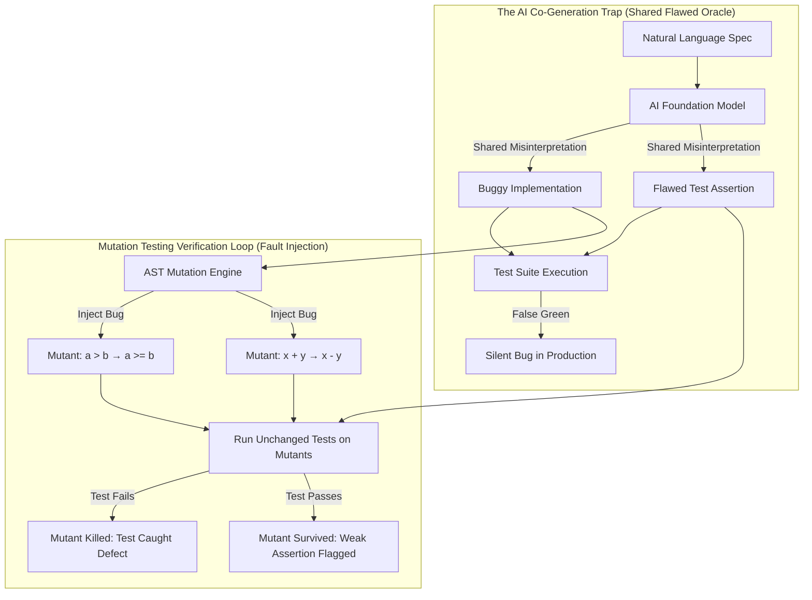
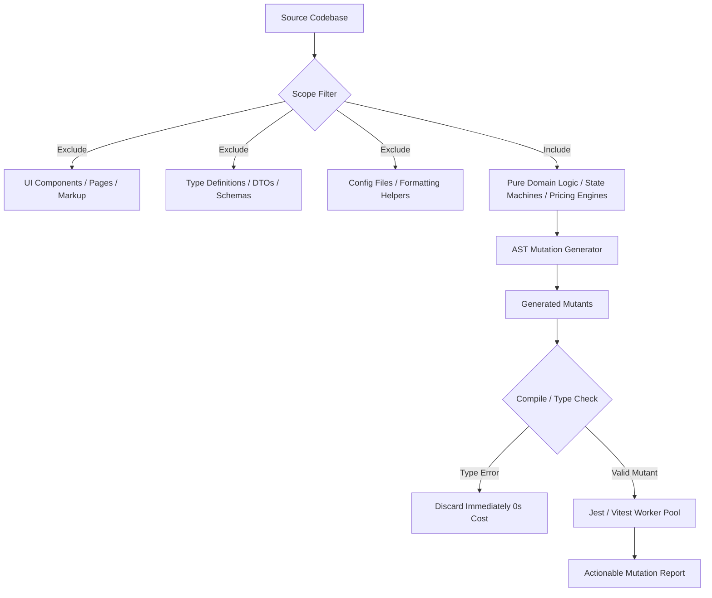
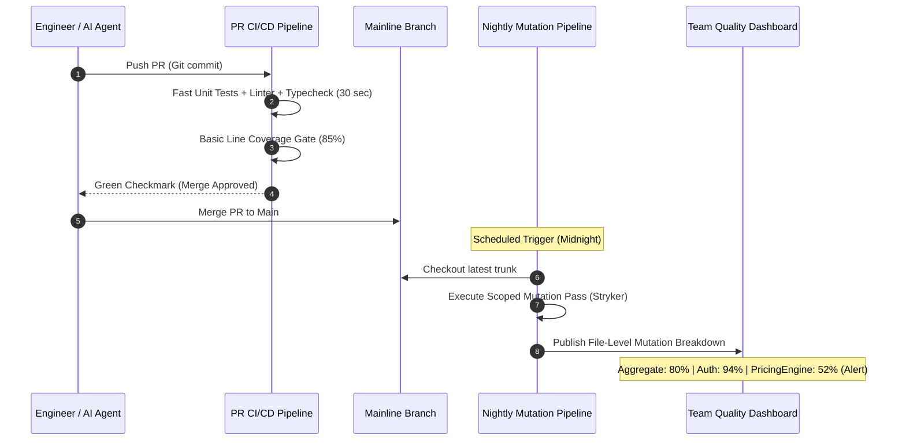

# 41. Mutation Testing for AI-Generated Code — Key Takeaways

> **Parent**: [System Design Interview Reference](../index.md)  
> **Source**: [Mutation Testing Closes the Trust Gap in AI Generated Code](../../articles/agentic-ai/mutation-testing-closes-the-trust-gap-in-ai-generated-code.md)  
> **Author**: Josphine Job, published August 13, 2026  
> **Purpose**: Formalize the systems engineering and verification architecture required to establish trust in AI-generated software. Addresses the fundamental breakdown in the human-to-code review ratio, the shared test oracle trap, the deceptive nature of high line coverage, and the operational patterns needed to run fault-based testing at enterprise scale.  

> **Also see**: [Agent Harness](agent-harness.md) (`harness-01`–`harness-10`), [Agentic Loop Engineering](agentic-loop-engineering.md) (`agentic-15`–`agentic-22`), [Agentic Accountability](agentic-accountability.md) (`agentic-08`–`agentic-12`), [Verification Boundary in Agentic SDLC](29-agentic-key-takeaways.md) (`agentic-55`–`agentic-64`), [AI Engineer Systems Architecture](40-agentic-key-takeaways.md) (`agentic-65`–`agentic-71`)  
> **Dictionary**: [Mutation Testing](../../reference-dictionary/architecture-patterns.md#mutation-testing), [Mutant](../../reference-dictionary/architecture-patterns.md#mutant), [Mutation Score](../../reference-dictionary/architecture-patterns.md#mutation-score), [Test Oracle Problem](../../reference-dictionary/architecture-patterns.md#test-oracle-problem), [Architecture Tests](../../reference-dictionary/architecture-patterns.md#architecture-tests), [Verification Loop (AI)](../../reference-dictionary/ai-ml-llm.md#verification-loop-ai)  
> **Azure Services**: [Azure Pipelines / GitHub Actions (Continuous Delivery)](../../architecture-azure/devops/), [Azure Container Instances (Isolated Ephemeral Test Runners)](../../architecture-azure/compute/)  
> **Taxonomy Reference**: §12.1 AI Application Patterns, §8.1 Continuous Integration & Delivery Runtime  

---

## Contents

| ID | Problem | Key Concept |
|:---|:---|:---|
| [`agentic-72`](#agentic-72-the-shared-oracle-dilemma--why-ai-generated-tests-pass-while-shipping-bugs) | AI models write both implementation and test suites, creating green suites with high coverage that silently miss critical bugs | The Shared Oracle Dilemma: Co-Generation & The Illusion of TDD Rigor |
| [`agentic-73`](#agentic-73-coverage-vs-sensitivity--exposing-decorative-test-suites) | High line/branch coverage creates a false sense of security while tests remain purely decorative | Execution Reachability vs Assertion Efficacy: Mutation Score as Ground Truth |
| [`agentic-74`](#agentic-74-mutation-triage-hierarchy--survived-mutants-vs-no-coverage) | Mutation reports generate overwhelming data matrices causing triage paralysis across engineering teams | Triage Hierarchy: Uncovered Blind Spots vs Weak Assertions |
| [`agentic-75`](#agentic-75-scope-pruning--compiler-filtering-for-combinatorial-cost-control) | Running mutation passes across entire enterprise repositories causes combinatorial test runtime explosion | AST Scope Pruning & Type-Checker Mutation Filtering |
| [`agentic-76`](#agentic-76-cicd-pipeline-decoupling--nightly-background-runs-vs-pr-gates) | Synchronous mutation runs on pull requests stall developer velocity and agent feedback loops | Asynchronous Decoupling: Nightly Mainline Passes & Module Score Granularity |
| [`agentic-77`](#agentic-77-the-upstream-invariant--test-sensitivity-vs-semantic-correctness) | High mutation scores are mistaken for proof that the software satisfies true business requirements | The Upstream Invariant: Assertion Sensitivity vs Specification Correctness |

---

## agentic-72: The Shared Oracle Dilemma — Why AI-Generated Tests Pass While Shipping Bugs

| | |
|:---|:---|
| **Problem** | In AI-native development workflows, foundation models generate voluminous code alongside corresponding test suites. The generated tests execute cleanly, coverage tools report 90%+ pass rates, yet critical logic regressions reach production undetected. Human review cannot bridge this gap because code volume drastically outpaces human cognitive bandwidth. |
| **Root cause** | The **Test Oracle Problem** under co-generation. When the same AI prompt, model, or context window generates both the implementation and its verification tests, the oracle (what the answer *should* be) and the implementation (what the answer *is*) share the exact same flawed interpretation of the specification. Strict Test-Driven Development (TDD) does not prevent this failure mode: if the AI misinterprets requirements, it writes a flawed test first (red), followed by code satisfying that flawed test (green). Ordering discipline cannot compensate for shared misunderstanding. |



### Key Architectural Takeaways

1. **Test the Testing, Not Just the Code**: Verifying AI output requires automated verification of the *tests themselves* at AI scale.
2. **Independence from Generation Sequence**: Mutation testing is agnostic to whether tests were written before code (TDD) or after code; it strictly evaluates whether altering code logic triggers test failure.
3. **Closing the Trust Gap**: Synthetic fault injection exposes assumptions baked into both the implementation and assertions, breaking the symmetry of co-generated hallucinations.

---

## agentic-73: Coverage vs. Sensitivity — Exposing Decorative Test Suites

| | |
|:---|:---|
| **Problem** | Engineering leaders establish pull-request quality gates based on code coverage (e.g., requiring $\ge 85\%$ line coverage). AI tools effortlessly generate suites reaching 94%+ coverage, yet these suites fail to catch basic arithmetic inversions, off-by-one errors, or missing return values. |
| **Root cause** | Line and branch coverage measure **reachability** (did the runtime execute this instruction?), but measure zero **assertion sensitivity** (would any assertion fail if the instruction executed incorrectly?). AI-generated tests frequently execute functions, populate inputs, and assert trivial truths (`expect(result).toBeDefined()` or `expect(response.status).toBe(200)`) without validating specific output values, state mutations, or business boundaries. |

### Comparative Verification Matrix

| Metric Dimension | Traditional Line/Branch Coverage | Mutation Testing Score |
|:---|:---|:---|
| **Core Question** | *"Did this line execute during the test run?"* | *"If this line were subtly broken, would a test catch it?"* |
| **Vulnerability to AI Gaming** | **High**: AI easily generates decorative tests that invoke code without asserting outcomes. | **Very Low**: Synthetic mutants explicitly break logic; weak assertions immediately produce survived mutants. |
| **False Confidence Factor** | High: 95% coverage can have 0% assertion rigor. | Low: A high mutation score requires assertions tied directly to outputs. |
| **Operational Cost** | Negligible ($\sim 1\times$ execution overhead). | Moderate to High ($\sim 10\times$–$30\times$ test run compute). |
| **Metric Formula** | $\frac{\text{Executed Lines}}{\text{Total Executable Lines}} \times 100$ | $\frac{\text{Killed Mutants}}{\text{Total Valid Mutants Attempted}} \times 100$ |

**Strategy**: Shift team and agent verification gates from passive line coverage to active **Mutation Score**. Require core business modules to meet both baseline line coverage and an explicit mutation threshold ($\ge 75\%–80\%$).

**Tradeoff**: Demanding high mutation scores across non-critical or boilerplate code causes diminishing returns. Target mutation rigor where logical failure incurs direct business or financial consequence.

---

## agentic-74: Mutation Triage Hierarchy — Survived Mutants vs. No Coverage

| | |
|:---|:---|
| **Problem** | Enterprise mutation testing runs produce extensive reports containing hundreds of data points across killed mutants, survived mutants, compile errors, timeouts, and uncovered lines. Engineering teams suffer triage fatigue and fail to act on findings. |
| **Root cause** | Teams treat all mutation outputs with equal priority, conflating diagnostic noise (e.g., syntax errors discarded by compilers) with actionable software vulnerabilities, and failing to distinguish between weak assertions and completely missing tests. |

### Two-Tier Triage Protocol

```
Mutation Finding
 ├── Discarded Context (Type error, Compile error, Killed mutant) ──→ Auto-logged / Discarded
 └── Actionable Findings
      ├── NO COVERAGE (Uncovered Mutant) ──→ PRIORITY 1: High Urgency (Zero tests touch this code)
      └── SURVIVED MUTANT ─────────────────→ PRIORITY 2: Assertion Weakness (Test runs, but assertion is blind)
```

1. **Priority 1: No Coverage (Uncovered Mutants)**
   - *Status*: No test touches this code path even indirectly.
   - *Severity*: **Critical**. Represents total absence of verification.
   - *Action*: Author foundational unit or integration tests to establish execution reachability before refining assertion depth.
2. **Priority 2: Survived Mutants**
   - *Status*: Tests execute the line, but every test still passed after the bug was injected.
   - *Severity*: **Actionable Defect**. The assertions are decorative or insufficiently specific.
   - *Action*: Strengthen existing test assertions with exact boundary conditions, relational checks, or negative assertions.
3. **Contextual Statuses (Ignore in Daily Triage)**:
   - *Killed Mutants*: The test suite performed as designed; tests failed when the code broke.
   - *Compile / Type Errors*: The mutation engine generated code rejected by the compiler/type-checker (e.g., TypeScript error); discarded before executing the test runner.
   - *Timeouts*: Mutants that introduced infinite loops; automatically treated as killed.

### Dual-Score Delta Metric

Monitor two complementary scores per file:
$$\text{Total Mutation Score} = \frac{\text{Killed Mutants}}{\text{Total Mutants}} \quad \text{vs.} \quad \text{Covered Mutation Score} = \frac{\text{Killed Mutants}}{\text{Covered Mutants}}$$

- **Scores Converged (e.g., 82% vs 84%)**: Test coverage is uniform; remaining gaps represent assertion subtlety.
- **Scores Diverged (e.g., 52% vs 88%)**: The tests that exist are thorough, but large blocks of functionality are completely unreached by tests.

---

## agentic-75: Scope Pruning & Compiler Filtering for Combinatorial Cost Control

| | |
|:---|:---|
| **Problem** | Running mutation testing across a full enterprise repository results in runaway test execution times (multiple hours or days), CPU saturation, and reports cluttered with equivalent or meaningless mutants. |
| **Root cause** | Mutating structural glue, configuration files, UI view components, and DTOs yields mutations that do not alter observable business logic (equivalent mutants). Furthermore, generating syntactically invalid mutations wastes precious test execution cycles running tests on code that could never compile. |

### Optimization & Pruning Architecture



### Pruning Strategies

1. **AST Scope Exclusion**:
   - Focus exclusively on algorithmic modules, state transitions, validation boundaries, and financial/security calculations.
   - Configure tooling (e.g., `stryker.config.json`) to exclude view layers (`*.tsx`, `*.vue`), generated GraphQL/OpenAPI schemas, and configuration scripts.
2. **Compiler & Type-Checker Pre-Filtering**:
   - Use language-aware mutation checkers (e.g., `@stryker-mutator/typescript-checker`) to type-check mutants in memory *before* invoking test runners.
   - Discard invalid mutants without spinning up Node.js or test framework instances, eliminating up to 40% of useless test runs.
3. **Differential PR Scoping**:
   - For ad-hoc verification, limit mutation runs strictly to files modified in the current branch diff (`--since origin/main`).

---

## agentic-76: CI/CD Pipeline Decoupling — Nightly Background Runs vs. PR Gates

| | |
|:---|:---|
| **Problem** | Forcing full mutation test suites into pull-request CI/CD validation blocks developer merges, stalls autonomous AI coding agents, and creates developer backlash that leads teams to disable verification tooling entirely. |
| **Root cause** | Mutation testing is inherently compute-heavy: running even a scoped 13-file test suite with dozens of mutants per file can take 20–30 minutes, whereas standard unit tests complete in seconds. |

### CI/CD Deployment Architecture



### Operational Rules for Asynchronous Verification

1. **Keep PR Checks Fast**: PR merge gates execute fast unit, integration, and lint checks (< 2 minutes). Autonomous coding agents require fast inner loops to preserve reasoning momentum.
2. **Nightly Asynchronous Heavy Pass**: Run deep mutation passes against the mainline branch every night or across scheduled weekend regression runs.
3. **File-Level Granularity vs Aggregate Masking**:
   - Aggregate numbers mask critical failures (e.g., an overall 80% suite score can conceal a core payment file sitting at 52%).
   - Dashboards must flag individual feature files that drop below team quality floors, triggering focused refactoring sprints.
4. **Shared Test Harness Investment**: High mutation scores are not produced by the tool itself; they reflect upstream investment in reusable, strongly asserted testing harnesses.

---

## agentic-77: The Upstream Invariant — Test Sensitivity vs. Semantic Correctness

| | |
|:---|:---|
| **Problem** | Engineering teams achieve a 95% mutation score and assume their software is provably correct and bug-free, only to discover that the software implements the wrong product requirement. |
| **Root cause** | **Sensitivity is not correctness**. Mutation testing proves that the test suite is sensitive to code changes; it does *not* prove that the test's expected values reflect true business intent. If the original requirement was misinterpreted by both developer/AI and encoded consistently into both code and test, mutation testing operates within that false agreement. A mutant that breaks that agreement will be killed, producing a perfect mutation score on an objectively incorrect feature. |

### Complementary Verification Architecture

```
                    ┌─────────────────────────────────────────────────────────┐
                    │               Complete Verification Matrix              │
                    └─────────────────────────────────────────────────────────┘
                                                 │
         ┌───────────────────────────────────────┴───────────────────────────────────────┐
         ▼                                                                               ▼
┌─────────────────────────────────┐                             ┌─────────────────────────────────┐
│        Assertion Rigor          │                             │      Input & State Space        │
├─────────────────────────────────┤                             ├─────────────────────────────────┤
│ • Mutation Testing              │                             │ • Property-Based Testing        │
│   (Injects bugs into code;      │                             │   (Generates random inputs;     │
│    verifies test sensitivity)   │                             │    validates domain invariants) │
└─────────────────────────────────┘                             └─────────────────────────────────┘
         │                                                                               │
         └───────────────────────────────────────┬───────────────────────────────────────┘
                                                 ▼
                                ┌─────────────────────────────────┐
                                │       Semantic Alignment        │
                                ├─────────────────────────────────┤
                                │ • Spec-Driven Contract Tests    │
                                │ • Human-In-The-Loop Spec Review │
                                │ • Formal Acceptance Criteria    │
                                └─────────────────────────────────┘
```

1. **Mutation Testing + Property-Based Testing (PBT)**:
   - *PBT*: Generates hundreds of pseudo-random inputs to verify that general mathematical or domain properties hold across wide input boundaries.
   - *Mutation Testing*: Stresses exact boundary operators (`<` vs `<=`) on the specific lines written.
   - *Synergy*: A function can pass every property test and still harbor a survived mutant if generated inputs miss exact boundary thresholds. Both are necessary.
2. **Grounding the Oracle**:
   - The test oracle must be anchored upstream in formal specifications, contract definitions (OpenAPI, JSON Schema, Protobuf), and human acceptance tests.
   - Mutation testing guarantees that if future changes or autonomous refactorings alter the code, the test suite will sound the alarm.

---

## Cross-References & System Mapping

- **Architecture Taxonomy**:
  - [§12.1 AI Application Patterns](../../architecture-general/10-practicality-taxonomy/architecture_taxonomy_reference.md) — Autonomous agent development & code generation safeguards
  - [§8.1 Continuous Integration & Delivery Runtime](../../architecture-general/10-practicality-taxonomy/architecture_taxonomy_reference.md#8-devops-delivery--runtime-architecture) — Asynchronous verification pipelines and quality gates
- **Reference Dictionary**:
  - [`Mutation Testing`](../../reference-dictionary/architecture-patterns.md#mutation-testing)
  - [`Mutant`](../../reference-dictionary/architecture-patterns.md#mutant)
  - [`Mutation Score`](../../reference-dictionary/architecture-patterns.md#mutation-score)
  - [`Test Oracle Problem`](../../reference-dictionary/architecture-patterns.md#test-oracle-problem)
  - [`Architecture Tests`](../../reference-dictionary/architecture-patterns.md#architecture-tests)
  - [`Verification Loop (AI)`](../../reference-dictionary/ai-ml-llm.md#verification-loop-ai)
- **Azure Cloud Implementations**:
  - [Azure DevOps Pipelines](../../architecture-azure/devops/) — Scheduled nightly verification stages
  - [Azure Container Instances](../../architecture-azure/compute/) — Parallelized worker pools for isolated mutation execution
