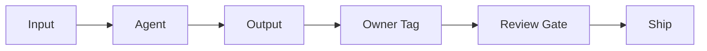

# 45. Agentic AI Accountability — Key Takeaways

> **Parent**: [System Design Interview Reference](../index.md)  
> **Source**: [Quality First, Quantity Second: The Leadership Lesson Every Tech Team Needs](../../articles/medium/quality-first-quantity-second-the-leadership-lesson-every-tech-team-needs.md) — by The Latency Gambler (Jun 2026)  
> **Purpose**: Extract the ownership and quality patterns required to ship AI-generated output into production without losing accountability.

> **Also see**: [Agentic AI — Enterprise Strategic Systems](agentic-ai/enterprise-strategic-systems.md), [AI Agent Architecture](agentic-ai/ai-agent-architecture.md), [AI-Assisted Development — Five Levels](agentic-ai/ai-assisted-development.md)
> **Dictionary**: [Accountability Gap](../../reference-dictionary/ai-ml-llm.md#accountability-gap), [Context Freshness](../../reference-dictionary/ai-ml-llm.md#context-freshness), [Owner Tag](../../reference-dictionary/ai-ml-llm.md#owner-tag), [Review Gate](../../reference-dictionary/ai-ml-llm.md#review-gate)
> **Taxonomy Reference**: §4.4 AI / ML Architecture

---

## Contents

| ID | Problem | Key Concept |
|:---|:---|:---|
| [agentic-07](#agentic-07) | Nobody owns AI output failures | Accountability gap |
| [agentic-08](#agentic-08) | Agents reason from stale context | Context freshness check |
| [agentic-09](#agentic-09) | Unreviewed AI output ships to production | Owner tag + review gate |
| [agentic-10](#agentic-10) | 10x AI volume creates unowned debt | 2x with accountability |

---

## agentic-07: Accountability Gap in Production AI

> **Source**: [§"The Accountability Gap Nobody Wants to Talk About"](../../articles/medium/quality-first-quantity-second-the-leadership-lesson-every-tech-team-needs.md#the-accountability-gap-nobody-wants-to-talk-about)

| | |
|:---|:---|
| **Problem** | When an AI agent returns a wrong answer, a stale recommendation, or a hallucinated report, no one has pre-decided who owns the failure. The model doesn't; the API doesn't; only the team that shipped it does. |
| **Root cause** | Production systems are wired to generate and ship output, but not to attach a named owner to that output. Accountability is an afterthought. |

**Strategy**: Make **human ownership** a first-class property of every AI-generated artifact. The owner is the person who would put their name on the output if it were published externally.

**Tradeoff**: Ownership assignments add a small coordination cost to every output, but they eliminate the far larger cost of blameless-yet-unactionable post-mortems.

> **Also see**: [agentic-06](agentic-ai/enterprise-strategic-systems.md#agentic-06-human-in-the-decision--ai-as-reasoning-partner) — Human-in-the-Decision  
> **Dictionary**: [Accountability Gap](../../reference-dictionary/ai-ml-llm.md#accountability-gap)

---

## agentic-08: Context Freshness Checks

> **Source**: [§"A Lightweight Ownership Pattern"](../../articles/medium/quality-first-quantity-second-the-leadership-lesson-every-tech-team-needs.md#a-lightweight-ownership-pattern)

| | |
|:---|:---|
| **Problem** | Agents retrieve answers from context that may already be outdated. Stale context is invisible unless the system explicitly surfaces it. |
| **Root cause** | Most agent pipelines store or retrieve context without a freshness timestamp, so neither the agent nor the reviewer can tell whether the source material is current. |

**Strategy**: Attach a `context_as_of` timestamp at generation time and validate it before the agent runs. A date-tagged pipeline makes staleness explicit:

```python
{
    "output": response,
    "owner": "priya.sharma@company.com",
    "context_as_of": "2026-06-01",
    "reviewed": False
}
```

**Tradeoff**: Freshness checks may block outputs that are still directionally correct but technically stale. Teams must define freshness SLAs by use case.

> **Also see**: [ai-01](ai-ml-infrastructure/ai-ml-infrastructure.md#ai-01-rag-architecture--stopping-ai-hallucinations) — RAG grounding reduces hallucination but does not guarantee freshness  
> **Dictionary**: [Context Freshness](../../reference-dictionary/ai-ml-llm.md#context-freshness)

---

## agentic-09: Owner Tag + Review Gate

> **Source**: [§"What 'Quality First' Looks Like in Practice"](../../articles/medium/quality-first-quantity-second-the-leadership-lesson-every-tech-team-needs.md#what-quality-first-looks-like-in-practice)

| | |
|:---|:---|
| **Problem** | AI output ships without a named owner or a human review step. Culture alone cannot enforce "would you put your name on this?" |
| **Root cause** | Ownership and review are treated as process or policy concerns instead of system-enforced invariants. |

**Strategy**: Build the pipeline so that **no review gate means no ship**:



Every output gets an owner tag, and the review gate checks that the owner explicitly approves the output before it is released.

**Tradeoff**: Adds review latency and requires owner availability, but reduces production incidents caused by unowned, low-quality output.

> **Also see**: [aidev-03](agentic-ai/ai-assisted-development.md#aidev-03-the-level-2-trap--feeling-done-is-not-being-done) — Level 3 is code review at scale; this pattern is the enforcement mechanism  
> **Dictionary**: [Owner Tag](../../reference-dictionary/ai-ml-llm.md#owner-tag), [Review Gate](../../reference-dictionary/ai-ml-llm.md#review-gate)

---

## agentic-10: 2x with Accountability Beats 10x Volume

> **Source**: [§"Why 2x Beats 10x"](../../articles/medium/quality-first-quantity-second-the-leadership-lesson-every-tech-team-needs.md#why-2x-beats-10x)

| | |
|:---|:---|
| **Problem** | Leadership sets AI productivity targets based on output volume. The team ships more, but debugging and operations slow down because quality was not the constraint. |
| **Root cause** | The real bottleneck is releasing, debugging, and running code — not writing it. Optimizing for generation speed increases downstream debt. |

**Strategy**: Set sustainable targets (e.g., **2x**) built on accountability rather than chasing headline **10x** output. Honeycomb's CTO chose 2x and coupled it with clear AI values before scaling further.

**Tradeoff**: Lower peak generation volume, but fewer incidents, clearer post-mortems, and higher trust in AI-assisted tools.

> **Also see**: [aidev-02](agentic-ai/ai-assisted-development.md#aidev-02-the-five-levels-framework) — Five-level maturity model; this is the governance layer above it  
> **Dictionary**: [Human Ownership](../../reference-dictionary/ai-ml-llm.md#human-ownership)

---

## Quick Reference: Agentic AI Accountability Patterns

| Pattern | When to Use | Key Tradeoff |
|:---|:---|:---|
| Named Owner per Output | Any AI output that can affect production or decisions | Coordination overhead vs. unowned failures |
| Context Freshness Check | Outputs depend on time-sensitive context | Possible blocking of usable-but-stale context vs. invisible staleness |
| Review Gate | High-stakes or externally visible AI output | Review latency vs. incident reduction |
| Sustainable Velocity Target | Leadership setting AI productivity goals | Lower headline throughput vs. sustainable, trusted output |

---

> **Taxonomy Reference**: §4.4 AI / ML Architecture · §8.1 DevOps Architecture  
> **See also**: [Agentic AI — Enterprise Strategic Systems](agentic-ai/enterprise-strategic-systems.md) · [AI Agent Architecture](agentic-ai/ai-agent-architecture.md) · [AI-Assisted Development — Five Levels](agentic-ai/ai-assisted-development.md)  
> **Source article**: [Quality First, Quantity Second: The Leadership Lesson Every Tech Team Needs](../../articles/medium/quality-first-quantity-second-the-leadership-lesson-every-tech-team-needs.md)
