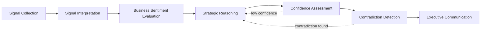
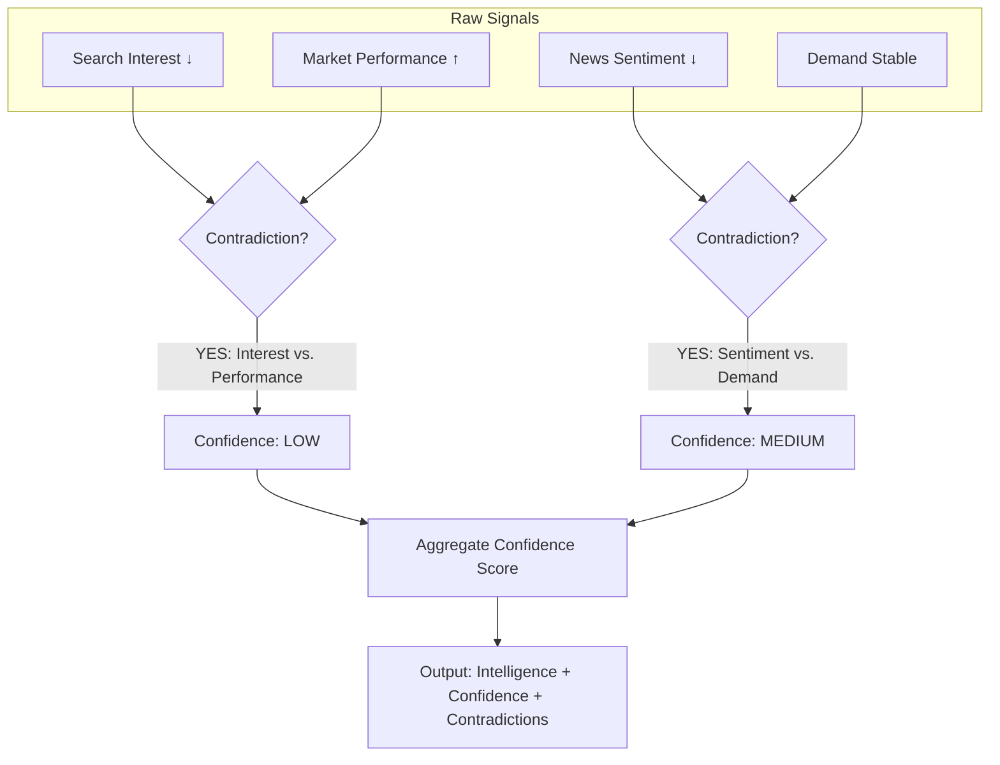
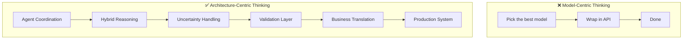

# 17. Agentic AI for Enterprise Strategic Systems: Key Takeaways

> **Parent**: [System Design Interview Reference](../index.md)  
> **Source**: [Building an Agentic AI System for Enterprise Strategic Intelligence](../../articles/agentic-ai/build-ai-for-enterprise-strategic-systems.md) — by Oktay Selcuk (Jun 2026)  
> **Purpose**: Extract reusable architectural patterns for multi-agent AI systems in enterprise decision-intelligence contexts.  
> **Taxonomy Reference**: §12 AI Applications, §2 Application Software Architecture

---

## Contents

- [agentic-01: Multi-Agent Specialization over Monolithic AI](#agentic-01-multi-agent-specialization-over-monolithic-ai) — Why one AI cannot serve all intelligence roles
- [agentic-02: Hybrid Intelligence — Deterministic + AI Reasoning](#agentic-02-hybrid-intelligence--deterministic--ai-reasoning) — When NOT to use LLMs for every decision
- [agentic-03: Contradiction Detection & Confidence Scoring](#agentic-03-contradiction-detection--confidence-scoring) — Surfacing uncertainty instead of hiding it
- [agentic-04: AI Interpretation Layer — Beyond Dashboards](#agentic-04-ai-interpretation-layer--beyond-dashboards) — From data visualization to AI-generated contextual explanations
- [agentic-05: Architecture Is the Hard Problem, Not the Model](#agentic-05-architecture-is-the-hard-problem-not-the-model) — System design challenges dominate over model challenges
- [agentic-06: Human-in-the-Decision — AI as Reasoning Partner](#agentic-06-human-in-the-decision--ai-as-reasoning-partner) — Assisting decision-makers, not replacing them

---

## agentic-01: Multi-Agent Specialization over Monolithic AI

> **Source**: [From One AI Assistant to Multiple Specialized Roles](../../articles/agentic-ai/build-ai-for-enterprise-strategic-systems.md#from-one-ai-assistant-to-multiple-specialized-roles)

| | |
|:---|:---|
| **Problem** | A single AI chatbot cannot reliably perform all the responsibilities of strategic intelligence: collecting signals, validating information, interpreting context, identifying contradictions, assessing risk, AND communicating insights |
| **Root cause** | Strategic intelligence is a **multi-step reasoning problem** (collect → evaluate → detect → assess → validate → interpret → communicate). Each step requires different expertise and context windows. A single-agent architecture forces one model to context-switch across all roles, degrading quality at each step |

**Strategy — Decompose by intelligence role, not by data shape**:



| Role | Responsibility | Why Specialized |
|:---|:---|:---|
| Signal Collection | Gathering raw signals from multiple sources | Needs source-specific connectors, rate handling, dedup |
| Signal Interpretation | Making sense of raw data patterns | Requires domain-specific context windows |
| Business Sentiment Evaluation | Assessing market and business sentiment | Needs financial/economic reasoning |
| Strategic Reasoning | Connecting signals to strategic implications | Requires long-horizon causal reasoning |
| Confidence Assessment | Evaluating reliability of intelligence | Needs calibration against historical accuracy |
| Contradiction Detection | Identifying conflicting signals | Requires cross-source comparison logic |
| Executive Communication | Translating findings for decision-makers | Needs audience-adaptive summarization |

**The meta-principle**:

> Strategic decisions rarely emerge from a single individual in organizations. They emerge from multiple specialists contributing different forms of expertise. Agentic systems should mirror this organizational pattern — specialization over monolithic design.

**Tradeoff**: Inter-agent communication overhead and orchestration complexity vs. the impossibility of a single-agent solution handling all reasoning steps reliably.

> **Azure**: [Azure AI Agent Service](https://learn.microsoft.com/en-us/azure/ai-services/agents/) (multi-agent orchestration) + [Azure AI Foundry](https://learn.microsoft.com/en-us/azure/ai-foundry/) | **Taxonomy**: §12 AI Applications, §2.7 Language & Framework Selection

---

## agentic-02: Hybrid Intelligence — Deterministic + AI Reasoning

> **Source**: [Agentic AI Is More Than LLM Calls](../../articles/agentic-ai/build-ai-for-enterprise-strategic-systems.md#agentic-ai-is-more-than-llm-calls)

| | |
|:---|:---|
| **Problem** | Over-reliance on LLMs for every decision leads to non-deterministic, unverifiable, and potentially incorrect system behavior — especially for risk calculations, scoring, and validation |
| **Root cause** | LLMs are probabilistic, not deterministic. For decisions that require auditability, reproducibility, and transparency (risk scores, financial calculations, compliance checks), generative output alone is insufficient |

**Strategy — Hybrid Intelligence Model**:

```
┌─────────────────────────────────────────────────────────┐
│                    HYBRID INTELLIGENCE                    │
├──────────────────────────┬──────────────────────────────┤
│   DETERMINISTIC LAYER    │      AI REASONING LAYER       │
│   (Rules & Calculations) │   (LLM Interpretation)        │
├──────────────────────────┼──────────────────────────────┤
│ • Risk scores            │ • Signal interpretation       │
│ • Signal calculations    │ • Strategic reasoning          │
│ • Confidence measures    │ • Executive summaries          │
│ • Validation checks      │ • Contextual explanations      │
│ • Business rules         │ • Anomaly narratives           │
├──────────────────────────┴──────────────────────────────┤
│  Deterministic outputs feed into AI prompts as grounded  │
│  context → AI reasons ABOUT verified facts, not instead  │
│  of computing them                                       │
└─────────────────────────────────────────────────────────┘
```

**When to use deterministic vs. AI**:

| Concern | Use Deterministic | Use AI Reasoning |
|:---|:---:|:---:|
| Audit trail required | ✅ | ❌ |
| Reproducible results needed | ✅ | ❌ |
| Contextual interpretation | ❌ | ✅ |
| Narrative generation | ❌ | ✅ |
| Financial/regulatory calculation | ✅ | ❌ |
| Anomaly explanation | ❌ | ✅ |
| Confidence scoring | ✅ | ❌ |
| Strategic implication analysis | ❌ | ✅ |

> ⚠️ **Architectural Note**: Hybrid solutions may be a necessary pre-step before fully autonomous systems. Given the unique circumstances of every project within an organization, hybrid approaches can yield more efficient and reliable results than jumping directly to full autonomy.

**Tradeoff**: Maintaining two reasoning paradigms (deterministic rules + LLM prompts) increases system complexity vs. the risk of purely generative systems producing unverifiable outputs.

> **Azure**: [Azure AI Foundry](https://learn.microsoft.com/en-us/azure/ai-foundry/) (model orchestration) + [Azure Functions](https://learn.microsoft.com/en-us/azure/azure-functions/) (deterministic compute layer) | **Taxonomy**: §12 AI Applications, §2.7 Language & Framework Selection

---

## agentic-03: Contradiction Detection & Confidence Scoring

> **Source**: [One of the Hardest Problems: Contradictory Signals](../../articles/agentic-ai/build-ai-for-enterprise-strategic-systems.md#one-of-the-hardest-problems-contradictory-signals)

| | |
|:---|:---|
| **Problem** | Business signals frequently disagree: search interest declines while market performance stays strong; news sentiment weakens while demand remains stable; external narratives turn negative while quantitative indicators stay positive |
| **Root cause** | Most AI systems present intelligence as **absolute truth** — a single answer with no uncertainty quantification. When underlying signals conflict, this creates a false sense of certainty that can mislead decision-makers |

**Strategy — Explicit Contradiction Detection with Confidence Calibration**:



**Contradiction categories**:

| Type | Example | Implication |
|:---|:---|:---|
| Interest vs. Performance | Search declining, market strong | Leading indicator divergence |
| Sentiment vs. Demand | News negative, demand stable | Narrative lag or resilience |
| Narrative vs. Data | External stories negative, KPIs positive | Potential perception gap |
| Leading vs. Lagging | Early signals negative, historical data positive | Timing mismatch |

**The principle**:

> Rather than hiding uncertainty, explicitly surface it. Identify conflicting evidence across signal sources, communicate confidence levels alongside conclusions, and surface uncertainty rather than presenting intelligence as absolute truth.

**Why this matters at scale**: As organizations rely more heavily on AI-assisted decision support, transparency about uncertainty becomes critical for trust. A system that says "I'm 60% confident — here's why" is more trustworthy than one that says "the answer is X" with hidden uncertainty.

**Tradeoff**: Surfacing contradictions may slow down decision-making (more information to process) vs. the risk of confident but wrong intelligence leading to bad strategic decisions.

> **Azure**: [Azure AI Content Safety](https://learn.microsoft.com/en-us/azure/ai-services/content-safety/) (confidence scoring patterns) + Custom scoring via [Azure Functions](https://learn.microsoft.com/en-us/azure/azure-functions/) | **Taxonomy**: §12 AI Applications, §6.3 Risk Assessment

---

## agentic-04: AI Interpretation Layer — Beyond Dashboards

> **Source**: [From Data Visualization to AI Interpretation](../../articles/agentic-ai/build-ai-for-enterprise-strategic-systems.md#from-data-visualization-to-ai-interpretation)

| | |
|:---|:---|
| **Problem** | Traditional dashboards stop at displaying information — charts, KPIs, and alerts. Users must manually analyze every chart, correlate across signals, and derive meaning. This doesn't scale with signal volume |
| **Root cause** | Visualization is **presentation**, not **interpretation**. The cognitive load of cross-referencing multiple charts, detecting patterns, and forming conclusions remains entirely on the human analyst |

**Strategy — AI-Generated Contextual Explanations**:

```
┌─────────────────────────────────────────────────────────┐
│              TRADITIONAL DASHBOARD                        │
│  ┌──────────┐  ┌──────────┐  ┌──────────┐               │
│  │ Chart A  │  │ Chart B  │  │ Chart C  │               │
│  │ (data)   │  │ (data)   │  │ (data)   │               │
│  └──────────┘  └──────────┘  └──────────┘               │
│        ↑             ↑             ↑                     │
│     User must manually correlate and interpret           │
└─────────────────────────────────────────────────────────┘

┌─────────────────────────────────────────────────────────┐
│           AI-INTERPRETED INTELLIGENCE                     │
│  ┌──────────────────────────────────────────────────┐   │
│  │ 📊 What is changing?                              │   │
│  │    Search interest declined 12% WoW in segment X   │   │
│  │                                                    │   │
│  │ 🎯 Why does it matter?                            │   │
│  │    This segment drives 34% of Q2 pipeline          │   │
│  │                                                    │   │
│  │ ⚠️ Emerging risks?                                │   │
│  │    If trend continues → 8% pipeline gap by Q3      │   │
│  │                                                    │   │
│  │ 📋 What deserves attention?                       │   │
│  │    PRIORITY 1: Segment X — confidence: MEDIUM      │   │
│  │    PRIORITY 2: Segment Y — confidence: HIGH        │   │
│  │                                                    │   │
│  │ 🔒 Confidence calibration                         │   │
│  │    Based on 3/5 corroborating sources              │   │
│  └──────────────────────────────────────────────────┘   │
└─────────────────────────────────────────────────────────┘
```

**AI interpretation answers five questions per chart/signal**:

| Question | Purpose | Output |
|:---|:---|:---|
| What is changing? | Detect anomalies and trends | Specific metric + magnitude + direction |
| Why does it matter? | Connect signals to business impact | Revenue/pipeline/risk implication |
| Which risks may be emerging? | Proactive risk identification | If-then scenario with estimated impact |
| What deserves attention? | Prioritization of signals | Ranked list with rationale |
| How confident should we be? | Confidence calibration | Source count + historical accuracy |

> The objective is **not** replacing human analysis. The objective is **accelerating understanding** — transforming AI from a reporting tool into a **Reasoning Partner**.

**Tradeoff**: AI-generated interpretations may miss nuance that a human analyst would catch vs. the impossibility of humans manually analyzing every signal at enterprise scale.

> **Azure**: [Azure OpenAI Service](https://learn.microsoft.com/en-us/azure/ai-services/openai/) (GPT-4o for interpretation) + [Power BI Embedded](https://learn.microsoft.com/en-us/power-bi/developer/embedded/) (visualization layer) | **Taxonomy**: §12 AI Applications, §4.1 Data & Analytics

---

## agentic-05: Architecture Is the Hard Problem, Not the Model

> **Source**: [Lessons Learned: Building an Applied AI System](../../articles/agentic-ai/build-ai-for-enterprise-strategic-systems.md#lessons-learned-building-an-applied-ai-system)

| | |
|:---|:---|
| **Problem** | Teams focus disproportionately on model selection (GPT-4 vs. Claude vs. Gemini) while neglecting the system design challenges that determine production success |
| **Root cause** | AI hype centers on models, but enterprise AI failures typically stem from architectural issues: poor agent coordination, missing validation layers, unhandled uncertainty, and brittle integration patterns |

**Strategy — Five Architectural Pillars for Production Agentic AI**:

| Pillar | Challenge | Anti-Pattern |
|:---|:---|:---|
| 1. **Coordinating multiple intelligence roles** | Specialization over monolithic design | One mega-prompt trying to do everything |
| 2. **Combining deterministic and AI reasoning** | Hybrid intelligence models | LLM for risk calculations or financial math |
| 3. **Handling uncertainty** | Explicit contradiction detection + confidence scoring | Presenting AI output as absolute truth |
| 4. **Validating conclusions** | Transparent validation mechanisms | No guardrails between generation and output |
| 5. **Translating signals into business context** | From data to decision | Raw data dumps without business interpretation |

**The meta-principle**:

> Enterprise AI is rarely about a single model. It is about system design. These are architectural challenges as much as they are AI challenges — and they become increasingly important as organizations move beyond experimentation toward production-grade AI systems.



**Tradeoff**: Architectural investment upfront vs. the cost of rebuilding when model-centric prototypes fail in production.

> **Azure**: [Azure Well-Architected Framework — AI Workloads](https://learn.microsoft.com/en-us/shows/azure-essentials-show/designing-ai-workloads-with-waf/) | **Taxonomy**: §12 AI Applications, §11 Architectural Qualities

---

## agentic-06: Human-in-the-Decision — AI as Reasoning Partner

> **Source**: [Where Agentic Enterprise AI May Be Heading](../../articles/agentic-ai/build-ai-for-enterprise-strategic-systems.md#where-agentic-enterprise-ai-may-be-heading)

| | |
|:---|:---|
| **Problem** | The industry narrative pushes toward fully autonomous AI systems. But in strategic contexts, removing humans from the decision loop creates unacceptable risk: AI lacks accountability, contextual judgment, and ethical reasoning |
| **Root cause** | Confusing **task execution** (where autonomy is valuable) with **strategic decision-making** (where human judgment remains essential). The goal is AI-assisted reasoning, not AI replacement of judgment |

**Strategy — Shift from Human-in-the-Loop to Human-in-the-Decision**:

| Dimension | Human-in-the-Loop (Today) | Human-in-the-Decision (Tomorrow) |
|:---|:---|:---|
| AI role | Task executor | Intelligence synthesizer |
| Human role | Approver/reviewer of AI output | Decision-maker informed by AI reasoning |
| Interaction | Human validates each AI step | Human evaluates AI-synthesized options |
| Autonomy scope | Single tasks | Continuous monitoring + synthesis |
| Human focus | Process oversight | Strategic judgment |

**The principle**:

> The future will require more than powerful models. It will require thoughtful architecture — not as an attempt to replace human judgment, but as a step toward AI-assisted strategic reasoning.

**What changes**:

| From | To |
|:---|:---|
| "AI tells me the answer" | "AI shows me the evidence, contradictions, and options" |
| Single recommendation | Multiple scenarios with confidence scores |
| Black-box output | Transparent reasoning chain |
| AI replaces analyst | AI accelerates analyst |
| Automation of decisions | Augmentation of judgment |

**Tradeoff**: Human-in-the-decision is slower than full autonomy vs. the catastrophic risk of autonomous strategic decisions without accountability.

> **Azure**: [Azure AI Foundry — Responsible AI](https://learn.microsoft.com/en-us/azure/ai-foundry/responsible-ai/) + [Azure AI Content Safety](https://learn.microsoft.com/en-us/azure/ai-services/content-safety/) | **Taxonomy**: §12 AI Applications, §6 Security Architecture, §11 Architectural Qualities

---

## Quick Reference: Agentic AI Patterns

| Pattern | When to Use | Key Tradeoff |
|:---|:---|:---|
| Multi-Agent Decomposition | Multi-step reasoning with diverse expertise needed | Orchestration complexity vs. single-agent quality degradation |
| Hybrid Intelligence | Decisions requiring audit trails + contextual interpretation | Dual-paradigm maintenance vs. unverifiable AI output |
| Contradiction Detection | Multiple conflicting signal sources | Slower decisions vs. confidently wrong intelligence |
| AI Interpretation Layer | High-volume signals exceeding human analysis capacity | Missing nuance vs. missing signals entirely |
| Architecture-First Design | Moving from prototype to production | Upfront investment vs. prototype-in-production failures |
| Human-in-the-Decision | Strategic/irreversible decisions | Speed vs. accountability |

---

> **Taxonomy**: §12 AI Applications · §2 Application Software Architecture · §6 Security Architecture · §11 Architectural Qualities  
> **See also**: [AI/ML Infrastructure](ai-ml-infrastructure/ai-ml-infrastructure.md) · [Resilience Patterns](resilience/resilience-patterns.md) · [Azure Service Mapping](azure-service-mapping/azure-service-mapping.md)  
> **Source article**: [Building an Agentic AI System for Enterprise Strategic Intelligence](../../articles/agentic-ai/build-ai-for-enterprise-strategic-systems.md)
