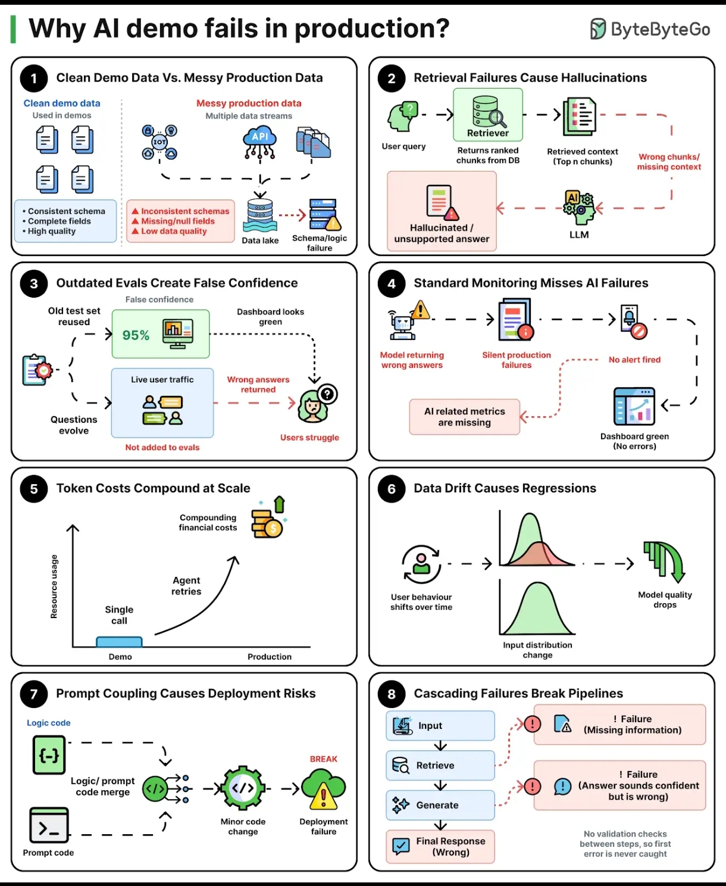

# 36. Why AI Demos Fail in Production — Key Takeaways

> **Parent**: [System Design Interview Reference](../index.md)
> **Purpose**: Extract reusable architectural patterns from the "Why AI Demo Fails in Production?" infographic: eight systemic failure modes that cause AI systems to break when moving from prototype to production.

> **Also see**: [AI/ML Infrastructure](ai-ml-infrastructure.md), [RAG Architecture](ai-ml-infrastructure.md#ai-01), [LLM Cost Optimization](ai-ml-infrastructure.md#ai-02)
> **Dictionary**: [AI/ML/LLM](../../reference-dictionary/ai-ml-llm.md), [Observability](../../reference-dictionary/observability.md), [Resilience](../../reference-dictionary/resilience.md), [Data Architecture](../../reference-dictionary/data-architecture.md)
> **Taxonomy Reference**: §4.2 Machine Learning & AI Infrastructure

---

## Contents

| ID | Problem | Key Concept |
|:---|:---|:---|
| [ai-17](#ai-17) | Demo data is clean and consistent; production data is messy, incomplete, and schema-inconsistent | Data Quality Gap Between Demo and Production |
| [ai-18](#ai-18) | Wrong or missing retrieval context causes the LLM to hallucinate unsupported answers | Retrieval Validation Guard |
| [ai-19](#ai-19) | Reusing static eval sets creates false confidence as live user questions evolve beyond them | Live- Traffic Eval Feedback Loop |
| [ai-20](#ai-20) | Standard application monitoring (latency, error rate) is blind to AI-specific failures | AI-Aware Observability Surface |
| [ai-21](#ai-21) | Demo cost (~$0.01/call) compounds exponentially with agent retries and production volume | Token Cost Governance at Scale |
| [ai-22](#ai-22) | User behavior and input distributions shift over time, silently degrading model quality | Data Drift Detection Pipeline |
| [ai-23](#ai-23) | Merging prompt logic with application code couples deployment to fragile prompt changes | Decoupled Prompt Management |
| [ai-24](#ai-24) | Unvalidated intermediate pipeline steps propagate failures to the final response | Per-Stage Validation in AI Pipelines |

---

## ai-17: Data Quality Gap Between Demo and Production

| | |
|:---|:---|
| **Problem** | AI demos use curated datasets with consistent schemas, complete fields, and high data quality. Production data arrives from real systems with inconsistent schemas, missing/null fields, low-quality inputs, and data lake failures. The model that performed flawlessly in the demo produces garbage because the input quality collapsed. |
| **Root cause** | Demo environments are built with sanitized datasets that remove edge cases. Production pipelines encounter raw, unvalidated data with no schema enforcement and no quality gates — the gap between curated and real data is never measured or bridged. |
| **Key Concept** | Insert data quality gates and schema validation at the ingestion boundary — validate, normalize, and reject malformed inputs before they reach the AI pipeline, not after. |

> **Strategy**: Build a data validation layer that enforces schema contracts at ingestion, applies quality scoring (completeness, freshness, consistency), and routes low-quality inputs to a dead-letter queue for inspection. Monitor the ratio of clean-to-rejected inputs as a leading indicator of pipeline health. Treat data quality not as a one-time cleanup but as a continuous operational concern with automated quality gates mirroring CI checks.
>
> **Tradeoff**: Strict validation gates add latency and may reject legitimate edge cases. Overly aggressive rejection reduces throughput and can mask upstream data issues. The schema validation layer itself becomes a maintenance surface as upstream schemas evolve. However, without quality gates, every data quality regression silently degrades model output — and unlike a code bug, bad data doesn't throw an exception.

---

## ai-18: Retrieval Validation Guard

| | |
|:---|:---|
| **Problem** | RAG pipelines retrieve wrong or irrelevant chunks, then feed them to the LLM as context. The LLM — unable to distinguish good context from bad — generates a hallucinated answer that *looks* confident and well-structured but is factually wrong. The failure is silent: no error, no alert, just a wrong answer delivered to the user. |
| **Root cause** | Most RAG systems treat retrieval as a fire-and-forget step: chunks are retrieved and passed to the LLM without any validation that the retrieved context is actually relevant to the query. The embedding similarity score is treated as a proxy for relevance, but high cosine similarity does not guarantee the chunk contains the answer. |
| **Key Concept** | Insert a retrieval validation step between retrieval and generation that scores context relevance independently and gates the LLM call — if no chunk meets the relevance threshold, fall back to "insufficient information" instead of generating from bad context. |

> **Strategy**: Implement a two-stage retrieval pipeline: (1) retrieve top-N chunks by embedding similarity, (2) re-rank and score each chunk for query relevance using a lightweight cross-encoder or LLM-as-judge. Only chunks above a calibrated relevance threshold are passed to the generation step. If no chunk passes, trigger a fallback response ("I don't have enough information to answer that") instead of forcing the LLM to guess.
>
> **Tradeoff**: The re-ranking step adds latency (~50-200ms) and compute cost for the cross-encoder or judge LLM call. The relevance threshold requires careful calibration — too strict rejects valid but borderline-context answers, too loose lets bad context through. The fallback rate becomes a new metric to monitor: too high means retrieval needs improvement, too low with bad answers means the threshold is misconfigured.

---

## ai-19: Live-Traffic Eval Feedback Loop

| | |
|:---|:---|
| **Problem** | Teams evaluate their AI system against a static test set created during development. The eval shows 95% accuracy, so everyone is confident. But live users ask questions the test set never anticipated — new topics, new phrasings, new edge cases. The system returns wrong answers for these novel questions, and nobody knows because the eval set still says 95%. |
| **Root cause** | Static eval sets don't evolve with user behavior. The eval becomes a lagging indicator that measures yesterday's performance against yesterday's questions while today's users struggle with unmeasured failures. |
| **Key Concept** | Continuously sample live production traffic, curate failure cases into the eval set, and measure both offline eval accuracy AND online user satisfaction — the gap between them is the drift signal. |

> **Strategy**: Build a feedback pipeline that samples live user interactions, flags low-confidence or edge-case responses, and routes them for human review. Curated failures are added to the eval set on a regular cadence (weekly). Track two metrics: offline eval accuracy (on the growing test set) and online user satisfaction (thumbs up/down, re-query rate). When online satisfaction drops but offline eval stays flat, the eval set has drifted.
>
> **Tradeoff**: Human review for eval curation is labor-intensive and doesn't scale linearly with traffic volume. Sampling introduces bias — the failures you catch depend on what you choose to review. Automated curation (flagging low-confidence responses) risks reinforcing model blind spots by only testing what the model already knows it doesn't know. Budget 2-4 hours/week for eval maintenance per production AI system.

---

## ai-20: AI-Aware Observability Surface

| | |
|:---|:---|
| **Problem** | Standard production monitoring tracks latency, error rate, and throughput. These metrics show green across the board — the API returns 200 OK in 200ms. But the AI is returning wrong answers, hallucinating facts, and producing toxic outputs. Standard monitoring is blind to *semantic* failures: a fast, successful HTTP response with a factually wrong answer looks identical to a fast, successful response with a correct answer. |
| **Root cause** | AI systems fail in ways that don't map to traditional observability signals. A hallucination is not a 500 error. A toxic output is not a timeout. The monitoring surface was designed for deterministic systems, not probabilistic ones. |
| **Key Concept** | Extend the observability surface with AI-native metrics: answer correctness scores, hallucination rate, retrieval relevance, toxicity scores, and token-per-request distributions. These are first-class metrics, not afterthoughts. |

> **Strategy**: Instrument the AI pipeline at three levels: (1) **System metrics** — latency, throughput, error rate (standard), (2) **Pipeline metrics** — retrieval recall, chunk relevance scores, token consumption per request, guardrail trigger rate, (3) **Quality metrics** — hallucination rate (via LLM-as-judge or human sampling), user satisfaction signals, answer groundedness scores. Alert on quality metric degradation independently from system metric degradation — a silent accuracy drop is a production incident even if the API is fast.
>
> **Tradeoff**: AI-native metrics are more expensive to compute than standard metrics — each quality check may require an additional LLM call. Sampling is essential: evaluate 5-10% of production traffic for quality signals. The observability infrastructure itself adds token cost. However, the alternative is flying blind: you can't fix what you can't measure, and AI failures are invisible to standard monitoring.

---

## ai-21: Token Cost Governance at Scale

| | |
|:---|:---|
| **Problem** | A single AI call costs pennies in a demo, so nobody worries about cost. In production, agentic workflows make multiple LLM calls with retries, each call consumes thousands of tokens of context, and the volume scales to millions of requests. The cost that looked negligible at demo time compounds into a material operational expense. |
| **Root cause** | Cost estimation uses the happy path: one call, one response, minimal context. Production introduces retries (exponential backoff on rate limits), agent loops (multiple calls per user request), verbose tool outputs inflating context, and traffic spikes. The gap between estimated and actual cost grows geometrically with agent complexity. |
| **Key Concept** | Implement token budgeting per request with hard caps, track cost-per-user-session (not per-call), and treat token consumption as a capacity-planning variable — not an afterthought. |

> **Strategy**: (1) Set per-request token budgets with hard caps — if an agent loop exceeds the budget, fail gracefully rather than burning unlimited tokens. (2) Track cost at the session/user level, not per API call, to capture the true cost of agentic workflows. (3) Implement cost attribution — tag tokens by pipeline stage (retrieval, generation, guardrails, re-ranking) to identify optimization targets. (4) Use model routing: send simple queries to cheaper/faster models, reserve expensive models for complex queries that need them.
>
> **Tradeoff**: Token budgets can prematurely cut off legitimate complex queries that genuinely need more context. Cost attribution adds metadata overhead to every request. Model routing introduces complexity and risks quality degradation if the routing heuristic misclassifies a complex query as simple. The goal is not to minimize cost but to make cost predictable and attributable — surprises, not absolute spend, are the production risk.

---

## ai-22: Data Drift Detection Pipeline

| | |
|:---|:---|
| **Problem** | The AI system was trained and evaluated on a specific input distribution. Over months in production, user behavior shifts — new topics trend, query patterns change, input formats evolve. The model's quality silently degrades because it was optimized for a distribution that no longer matches reality. No alert fires because the model still returns responses — they're just increasingly wrong. |
| **Root cause** | Data drift is invisible without explicit monitoring. Unlike a code regression that breaks deterministically, drift is a slow, cumulative degradation. By the time users notice and complain, the system has been underperforming for weeks. |
| **Key Concept** | Monitor the statistical distance between training/eval distributions and live production inputs. When drift exceeds a threshold, trigger a model re-evaluation or fine-tuning cycle — don't wait for user complaints. |

> **Strategy**: (1) Embed production inputs and compare their distribution against the eval set embedding distribution using statistical distance metrics (e.g., Maximum Mean Discrepancy, KL divergence on cluster assignments). (2) Track semantic drift: cluster production queries by topic and monitor cluster size changes — a new growing cluster signals an emerging use case. (3) Set drift thresholds that trigger automated re-evaluation of the model against the new distribution. (4) Maintain a rolling window of recent production queries as a "live eval set" that reflects current reality.
>
> **Tradeoff**: Embedding-based drift detection adds compute cost for embedding every production query. Statistical distance metrics require careful threshold calibration — too sensitive generates noise, too loose misses real drift. Drift detection tells you *that* the distribution changed but not *why* — root cause analysis still requires human investigation. However, without drift detection, you're operating blind between eval refreshes, and users are your only degradation sensor.

---

## ai-23: Decoupled Prompt Management

| | |
|:---|:---|
| **Problem** | Prompts are embedded as string literals in application code. A minor prompt tweak (e.g., "be concise" → "be thorough") requires a full code deployment. During that deployment, an unrelated code change introduces a bug that takes down the AI service. The prompt change wasn't the problem, but the coupling made it a deployment risk. |
| **Root cause** | Prompts are configuration, not code — but storing them in code couples their lifecycle to the application deployment cycle. This creates unnecessary deployment risk for prompt iterations and prevents A/B testing of prompt variants without code changes. |
| **Key Concept** | Externalize prompts to a configuration store (feature flags, remote config, prompt registry) with versioning, rollback, and A/B testing — decouple prompt changes from code deployments entirely. |

> **Strategy**: Store prompts in a versioned configuration store (e.g., LaunchDarkly, a prompt registry, or a simple config service). Each prompt has a version, and the application fetches the active version at runtime. This enables: (1) prompt changes without code deployment, (2) A/B testing prompt variants with traffic splitting, (3) instant rollback of problematic prompts by reverting the active version, (4) prompt-change audit trail independent of code commits. Treat prompt changes with the same caution as code changes: test against eval sets before promoting to production.
>
> **Tradeoff**: Externalized prompts add a runtime dependency on the configuration store — if the store is unavailable, the AI service can't function (mitigate with local fallback/caching). Prompt versioning requires discipline: an orphaned prompt version referenced by code that no longer exists creates a different kind of coupling. The configuration store becomes a new attack surface — prompts can contain sensitive business logic. However, the decoupling benefit is substantial: prompt iteration cycles drop from days (deployment pipeline) to minutes (config update).

---

## ai-24: Per-Stage Validation in AI Pipelines

| | |
|:---|:---|
| **Problem** | AI pipelines chain multiple stages: retrieve → generate → validate. If retrieval returns bad chunks, generation produces a hallucinated answer, and validation fails to catch it — the pipeline outputs a wrong answer with no indication of where or why the failure occurred. Each stage assumes the previous stage succeeded, creating a cascade of silent failures. |
| **Root cause** | Pipeline stages are composed without validation boundaries. The output of stage N becomes the input of stage N+1 with no quality check in between. A failure at stage 1 propagates through stages 2 and 3, compounding errors and making root-cause analysis nearly impossible. |
| **Key Concept** | Insert validation gates between each pipeline stage. Each stage's output is validated before it becomes the next stage's input. A failure at any stage is caught, logged with context, and triggers a graceful degradation path — not a cascade. |

> **Strategy**: Design AI pipelines as a sequence of validated stages. Between each stage, insert a lightweight validation check: (1) **Retrieve → Validate Context**: check that retrieved chunks have relevance scores above threshold and are not empty, (2) **Validate Context → Generate**: confirm context is well-formed before passing to LLM, (3) **Generate → Validate Output**: run guardrail checks (factual consistency, toxicity, format validity) on the generated response before returning to user. Each validation failure is logged with the stage identifier, input, and failure reason for debugging. Failed requests follow a defined degradation path — e.g., fallback response, human escalation, or retry with adjusted parameters.
>
> **Tradeoff**: Per-stage validation adds latency (each gate is an additional check) and compute cost (validation calls may themselves be LLM calls). Over-validation risks false positives — legitimate responses rejected by overly strict guardrails. The validation logic itself must be maintained and calibrated as model behavior evolves. However, without stage-level validation, debugging a wrong answer requires tracing through the entire pipeline with no intermediate signal — a cascade of failures where every stage looks like it succeeded.

---

## Adoption Strategy

1. **Start with observability (ai-20) and data quality (ai-17)**: You can't fix what you can't see. Instrument AI-native metrics and data quality gates before attempting deeper pipeline changes.
2. **Add retrieval validation (ai-18)**: A retrieval guard is the highest-leverage single change — it catches the most common failure mode (bad context → hallucination) at the source.
3. **Decouple prompts (ai-23)**: Externalize prompts early, even if you don't need A/B testing yet. The deployment-risk reduction is immediate and the migration cost only grows.
4. **Layer in cost governance (ai-21) and drift detection (ai-22)**: Once the pipeline is observable and validated, add cost controls and drift monitoring to catch slow degradations.
5. **Evolve evals (ai-19)**: Move from static to live-traffic eval sets. This is an ongoing process, not a one-time fix.
6. **Add pipeline validation gates (ai-24)**: With all other pieces in place, per-stage validation provides the final safety net.
