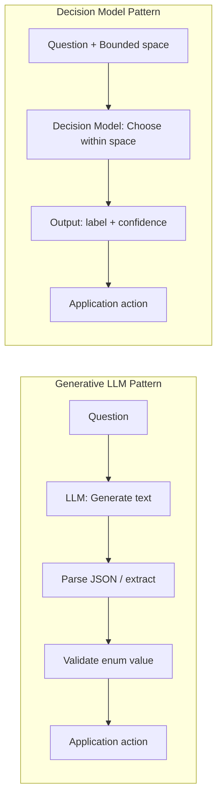

# 40. Decision-Oriented AI Models (Jev / System One Models) — Key Takeaways

> **Parent**: [AI/ML Infrastructure](index.md)  
> **Source**: [Jev Explained: Why TypeSafe AI Built an AI Model That Makes Decisions Instead of Generating Text](../../articles/agentic-ai/jev-typesafe-ai-decision-model.md)  
> **Author**: Arvind Kumar, published 2026-10-01  
> **Purpose**: Extract reusable system design and architectural patterns from the introduction of Jev, TypeSafe AI's decision-oriented System One Model — covering the generation-vs-decision axis, bounded output spaces, calibrated confidence routing, layered AI stack composition, and the important nuance that output validity does not guarantee semantic correctness.

> **Also see**: [AI/ML Infrastructure](ai-ml-infrastructure.md) (`ai-01`–`ai-03`), [Agentic Core Engineering](../agentic-ai/agentic-core-engineering.md) (`agentic-23`–`agentic-33`), [Agent Harness](../agentic-ai/agent-harness.md) (`harness-01`–`harness-10`), [AI Engineer Systems Architecture](39-ai-key-takeaways.md) (`ai-31`–`ai-33`)  
> **Dictionary**: [System One Model](#) → [ai-ml-llm.md](../../reference-dictionary/ai-ml-llm.md#system-one-model), [Jev](../../reference-dictionary/ai-ml-llm.md#jev-decision-model), [RLCD](../../reference-dictionary/ai-ml-llm.md#rlcd), [Noul / Choice / Score](../../reference-dictionary/ai-ml-llm.md#noul-choice-score)  
> **Taxonomy Reference**: §4.2 Machine Learning & AI Infrastructure, §12.1 AI Application Patterns

---

## Contents

| ID | Problem | Key Concept |
|:---|:---|:---|
| [`ai-34`](#ai-34-generation-vs-decision-why-bounded-output-spaces-solve-a-different-problem) | Software routinely uses LLMs for bounded classification and routing tasks even when free-text generation adds no value | Generation vs. Decision: The Bounded Output Space |
| [`ai-35`](#ai-35-noul-choice-score--decision-primitives-as-a-typed-interface) | LLMs return loosely typed text that must be parsed, validated, and constrained before software can act on it reliably | Typed Decision Primitives: Noul, Choice, Score |
| [`ai-36`](#ai-36-calibrated-confidence-routing--actionable-thresholds-for-automation) | LLM confidence is implicit in prose, making it difficult for software to automate tiered decisions without custom extraction logic | Calibrated Confidence Routing via RLCD |
| [`ai-37`](#ai-37-decision-model-as-agentic-ai-subsystem-judgment-without-generation) | Agentic workflows invoke large generative models for small routing and verification micro-decisions, paying high latency and token cost per step | Decision Models as Lightweight Agentic Subsystems |
| [`ai-38`](#ai-38-valid-output-is-not-correct-output--the-semantic-gap-in-bounded-decision-models) | Bounded output guarantees (no hallucinated enums) are mistaken for semantic correctness guarantees, leading to over-trusted automation | Valid Output ≠ Correct Decision: The Semantic Gap |

---

## ai-34: Generation vs. Decision — Why Bounded Output Spaces Solve a Different Problem

| | |
|:---|:---|
| **Problem** | Software systems routinely use LLMs to perform classification, routing, moderation scoring, and intent detection — tasks that produce a small set of known outputs — even though LLMs are architecturally optimized for open-ended text generation. This mismatch incurs unnecessary token cost, latency from full generative inference, and output parsing fragility. |
| **Root cause** | The default framing of LLM interaction ("give me text back") is inappropriate for applications that only need a decision from a closed choice set. JSON mode and structured output APIs reduce formatting fragility but do not change the underlying optimization target of the model. A generative model trained to minimize perplexity on next-token prediction is not the same as a model trained to maximize decision calibration within a bounded space. |

**Strategy**: For tasks where the answer belongs to a finite, known set (yes/no, enum value, numeric score), treat the problem as a **decision problem** rather than a generation problem. Route these tasks to a decision-specialized model or enforce rigorous output constraints and validation pipelines on LLM output.

**Tradeoff**: Adopting a separate decision model adds an additional service dependency and increases operational surface area. The break-even point is workloads where (a) volume is high enough for the token cost difference to matter, and (b) decision latency is on the critical path of user-facing or agentic workflows.



---

## ai-35: Noul, Choice, Score — Decision Primitives as a Typed Interface

| | |
|:---|:---|
| **Problem** | Application code handling LLM outputs must implement ad hoc parsers, enum validators, and confidence extractors for every distinct decision type. This logic is brittle, diverges across teams, and is difficult to test. |
| **Root cause** | LLM outputs are strings; any structure imposed on them is a post-processing convention rather than a contract enforced by the model. Decision models that expose typed primitives shift the contract to the model layer. |

**Strategy**: TypeSafe's Jev exposes three first-class decision primitives:

| Primitive | Type | Example |
|:---|:---|:---|
| **Noul** | Binary decision with confidence | `is_fraud = YES, 0.97` |
| **Choice** | Categorical selection with confidence | `team = PAYMENTS, 0.96` |
| **Score** | Numeric judgment with confidence | `urgency = 0.84` |

Each primitive returns a label **and** a calibrated probability, giving application code a typed, testable interface instead of free text.

**Tradeoff**: Decision primitives require that the application developer define the decision space upfront. This is excellent discipline for well-understood domains but requires rework when new categories emerge. Generative models are more forgiving of underspecified requirements because they can return novel output.

---

## ai-36: Calibrated Confidence Routing — Actionable Thresholds for Automation

| | |
|:---|:---|
| **Problem** | Tiered automation (auto-resolve, human-review, escalate) requires quantified confidence from the AI system. LLMs embed confidence implicitly in hedging language ("appears highly suspicious") that is impractical for software to threshold reliably. |
| **Root cause** | LLMs are not trained to produce externally calibrated probability estimates. A well-calibrated classifier assigns probability 0.90 to events that actually occur 90% of the time. LLMs optimized for text quality do not guarantee this calibration property. |

**Strategy**: TypeSafe trains Jev with **Reinforcement Learning for Calibrated Decisions (RLCD)** — a training objective aimed at making the emitted confidence score match empirical accuracy. This makes threshold-based routing directly operable by application code:

```text
p(FRAUD) > 0.95   → auto-block transaction
p(FRAUD) 0.70–0.95 → route to human review queue
p(FRAUD) < 0.70   → allow through normally
```

**Tradeoff**: Calibration quality is difficult to verify independently and varies across domains not well-represented in training data. Teams must measure empirical calibration on their own workload before trusting confidence thresholds in production automation. Miscalibrated confidence is more dangerous than uncalibrated text because it creates the illusion of measurable certainty.

---

## ai-37: Decision Model as Agentic AI Subsystem — Judgment Without Generation

| | |
|:---|:---|
| **Problem** | Agentic AI workflows — loops that repeatedly select tools, verify step completion, and decide whether to retry — invoke large generative models for each micro-decision. Each LLM call adds hundreds of milliseconds of latency and consumes significant token budget, even when the decision is a binary yes/no. |
| **Root cause** | Agentic frameworks were designed around LLMs as the universal reasoning layer. The architecture does not distinguish between steps that require generation (producing code, drafting emails) and steps that require judgment (checking whether a previous step succeeded, selecting the next tool). |

**Strategy**: Decompose the AI stack into specialized layers:

| Layer | Model Type | Example Task |
|:---|:---|:---|
| **Generation** | LLM (GPT, Claude, Gemini) | Write code, summarize text, draft a reply |
| **Decision** | Decision model (Jev) | Did the step succeed? Which tool next? Escalate? |
| **Deterministic** | Code | Arithmetic, lookups, schema validation |
| **Human** | Human-in-the-loop | Edge cases, high-stakes irreversible actions |

Decision models could serve as lightweight judgment nodes in the agentic loop — evaluating loop continuation, tool selection, and policy compliance — without incurring full LLM inference cost for each step.

**Tradeoff**: Introducing a separate decision layer adds architectural complexity and inter-service latency. The benefit emerges only when the volume of micro-decisions is high enough that per-call cost reduction outweighs the integration overhead. For simple or low-traffic agents, a single LLM with structured outputs may remain the simpler choice.

---

## ai-38: Valid Output Is Not Correct Output — The Semantic Gap in Bounded Decision Models

| | |
|:---|:---|
| **Problem** | Engineering teams interpret the "zero hallucination" claim of bounded output models as a guarantee of semantic correctness and reduce oversight accordingly. This leads to miscategorized decisions being acted on automatically without human review. |
| **Root cause** | Bounded output models eliminate **format hallucination** (the model cannot return an enum value outside the declared space), but they do not eliminate **judgment errors** (the model can still choose the wrong valid label). The concepts are logically independent: a model constrained to output `{LOW, MEDIUM, HIGH}` can still return `LOW` when the ground truth is `HIGH`. |

**Strategy**: Design production systems with explicit two-layer mental models:

```
Layer 1 — Output Shape Contract (guaranteed by bounded model):
  ✓ Output is always a valid enum member
  ✓ Output is never an invented category
  ✗ Output is NOT guaranteed to be correct

Layer 2 — Semantic Accuracy (NOT guaranteed by bounded model):
  → Require empirical evaluation on production data
  → Implement calibration measurement dashboards
  → Maintain human-review tiers for uncertain confidence ranges
  → Run A/B tests before migrating automation thresholds
```

**Tradeoff**: Adding human-review tiers and calibration measurement adds operational cost. The appropriate confidence threshold for automation versus human review is domain-specific and must be established empirically — it cannot be assumed from the model vendor's benchmark numbers.

---

## Cross-References & System Mapping

- **Architecture Taxonomy**:
  - [§4.2 Machine Learning & AI Infrastructure](../../architecture-general/10-practicality-taxonomy/architecture_taxonomy_reference.md) — Decision model specialization & model layering
  - [§12.1 AI Application Patterns](../../architecture-general/10-practicality-taxonomy/architecture_taxonomy_reference.md#12-ai-applications) — Agentic decision layers & guardrail architectures
- **Reference Dictionary**:
  - [`System One Model`](../../reference-dictionary/ai-ml-llm.md#system-one-model)
  - [`Jev (Decision Model)`](../../reference-dictionary/ai-ml-llm.md#jev-decision-model)
  - [`RLCD`](../../reference-dictionary/ai-ml-llm.md#rlcd)
  - [`Noul / Choice / Score`](../../reference-dictionary/ai-ml-llm.md#noul-choice-score)
  - [`Hallucination`](../../reference-dictionary/ai-ml-llm.md#hallucination)
  - [`Guardrails (AI)`](../../reference-dictionary/ai-ml-llm.md#guardrails-ai)
- **Related Takeaways**:
  - [Agentic Core Engineering](../agentic-ai/agentic-core-engineering.md) — Agent loop anatomy & multi-model patterns
  - [Agent Harness](../agentic-ai/agent-harness.md) — Verification loops & tool selection architecture
  - [AI Content Watermarking & Provenance](39-ai-key-takeaways.md) — Complementary AI governance patterns
