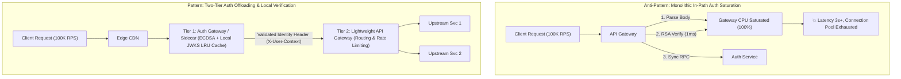
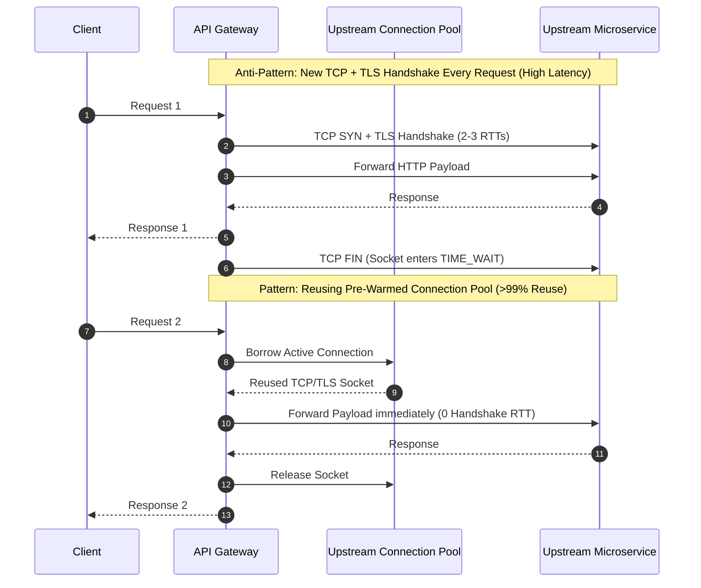
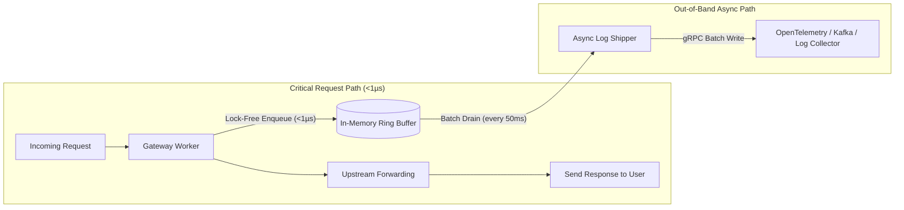
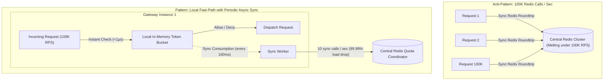
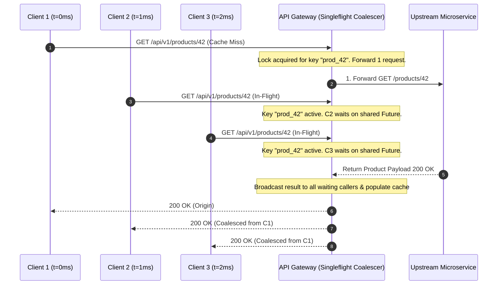

# API Gateway Bottlenecks: Scaling, Auth Overhead & Routing Optimization — Key Takeaways

> **Parent**: [APIs & Network Design](index.md)  
> **Source**: [API Gateway Becomes a Bottleneck: System Design Deep Dive on Gateway Scaling, Authentication Overhead, Edge Caching, and Request Routing Optimization](../../articles/api-network/api-gateway-becomes-a-bottleneck.md)  
> **Taxonomy Reference**: §5.2 Infrastructure Architecture, §7.2 Performance Architecture  

---

## Contents

| ID | Problem | Key Concept |
|:---|:---|:---|
| [`gw-07`](#gw-07-in-path-jwt-cryptographic-verification-saturation-vs-dedicated-auth-offloading) | In-path cryptographic JWT verification and synchronous auth service RPCs saturate gateway CPU | Auth Sidecar, Dedicated Auth Gateway Tier, ECDSA vs RSA, Token Introspection Cache |
| [`gw-08`](#gw-08-per-request-tcptls-handshake-exhaustion-vs-persistent-connection-pooling) | Creating new TCP and TLS handshakes for every upstream request exhausts gateway ports and sockets | Upstream Connection Pooling, HTTP/2 Multiplexing, Keep-Alive Reuse (>99%) |
| [`gw-09`](#gw-09-synchronous-request-path-logging-io-vs-asynchronous-ring-buffer-batching) | Synchronous logging and audit writes directly on the request path cause thread pool blocking and latency degradation | Non-Blocking In-Memory Ring Buffer, Asynchronous Batch Flushing, Out-of-Band Audit Shipping |
| [`gw-10`](#gw-10-centralized-redis-rate-limiting-roundtrips-vs-hybrid-token-bucket) | High-frequency Redis roundtrips per incoming request saturate network and centralized cache CPU | Hybrid Token Bucket, Local In-Memory Counter, Periodic Async Counter Sync (100ms) |
| [`gw-11`](#gw-11-origin-gateway-traffic-overload-vs-edge-caching-and-request-coalescing) | Duplicate concurrent read requests bypass caches and hammer upstream microservices | Edge CDN Response Caching, Singleflight Request Coalescing, Cache Stampede Mitigation |
| [`gw-12`](#gw-12-api-gateway-golden-observability-signals-and-upstream-fault-isolation) | Inadequate gateway metrics disguise upstream microservice degradation as gateway failure | CPU Microseconds Per Request, Connection Reuse Ratio, Phase Latency Breakdown, Upstream Error Attribution |

---

## gw-07: In-Path JWT Cryptographic Verification Saturation vs Dedicated Auth Offloading

| | |
|:---|:---|
| **Problem** | The API gateway parses JSON request bodies, verifies RSA cryptographic signatures on incoming JWTs (~0.5–1ms of CPU time per request), and performs synchronous round-trips to an identity service. Under 10x traffic spikes (e.g., 100K RPS), in-path cryptographic validation consumes 100% of gateway CPU, causing latency to spike from 5ms to 3,000ms and bringing down all downstream microservices. |
| **Root cause** | Coupling computationally expensive cryptographic signature verification and synchronous remote authentication checks directly onto the central ingress request thread pool. |

**Strategy**: Implement **Authentication Offloading, Algorithm Modernization, and Local Token Caching**:

1. **Auth Sidecar or Dedicated Auth Gateway Tier**:
   - *Sidecar Pattern*: Run a lightweight auth proxy beside each gateway instance to verify JWT signatures locally against cached public keys (JWKS).
   - *Dedicated Tier 1 Auth Gateway*: Deploy an independently scalable stateless auth gateway tier. Tier 1 validates credentials and attaches a signed, pre-verified identity context token (or mutual TLS headers); Tier 2 (Routing Gateway) trusts this pre-verified header and skips re-verification.
2. **ECDSA (ES256) vs RSA (RS256)**: Transition from RSA-256 to ECDSA (P-256 / ES256). ECDSA signature verification uses significantly fewer CPU instructions (~10x faster verification for equivalent cryptographic strength).
3. **Token Introspection LRU Caching**: Maintain a bounded local in-memory LRU cache of recently verified token signatures and claims (e.g., 60–300s TTL). Skip signature validation for identical active tokens.



```json
// Tier 1 passes pre-verified context to internal services
{
  "X-User-Id": "usr_991823",
  "X-Tenant-Id": "org_enterprise_42",
  "X-Roles": ["billing_admin", "viewer"],
  "X-Auth-Verified-At": 1774218000
}
```

**Tradeoff**: Introducing a dedicated auth tier adds an internal network hop or sidecar process footprint, but isolates CPU-intensive cryptographic work from routing pipelines and allows auth to scale independently.

> **Dictionary**: [Authentication Offloading](../../reference-dictionary/security-iam.md#authentication-offloading), [Token Introspection Cache](../../reference-dictionary/security-iam.md#token-introspection-cache), [JWT](../../reference-dictionary/security-iam.md#jwt-json-web-token)  
> **Azure Implementation**: [Azure API Management validate-jwt policy](https://learn.microsoft.com/en-us/azure/api-management/validate-jwt-policy) + [Azure Front Door](https://learn.microsoft.com/en-us/azure/frontdoor/)  
> **Related**: [`gw-03`](reverse-proxy-lb-gateway.md#gw-03-api-gateway--when-api-lifecycle-management-is-the-priority), [`auth-01`](../security/authentication-authorization.md)

---

## gw-08: Per-Request TCP/TLS Handshake Exhaustion vs Persistent Connection Pooling

| | |
|:---|:---|
| **Problem** | The gateway opens a brand new TCP connection with a full TLS handshake for every incoming request dispatched to upstream microservices. At 100K RPS, thousands of short-lived sockets are opened and closed per second, causing TCP socket port exhaustion (`TIME_WAIT` pileup), high kernel socket lock contention, TLS handshake latency penalties (10–50ms per call), and upstream connection refusal errors. |
| **Root cause** | Ephemeral socket management and absence of persistent HTTP connection reuse across gateway-to-upstream communication paths. |

**Strategy**: Enforce **Upstream Connection Pooling, HTTP/2 Multiplexing, and Keep-Alive Tuning**:

1. **Persistent Upstream Connection Pooling**: Maintain a pre-warmed connection pool per upstream microservice cluster (e.g., 20–50 connections per host instance). Requests borrow an established connection and return it immediately upon receiving the response.
2. **HTTP/2 & gRPC Multiplexing**: Use HTTP/2 multiplexing for upstream communication. A single persistent TCP connection handles hundreds of concurrent in-flight streams, eliminating per-request connection overhead and TLS handshakes entirely.
3. **Keep-Alive Configuration & Connection Reuse Ratio Monitoring**: Configure keep-alive timeouts (e.g., 60 seconds) and monitor the **Connection Reuse Ratio** metric. Target $>99\%$ reuse ratio in production.



| Metric | Without Connection Pooling | With HTTP/2 & Connection Pooling |
|:---|:---|:---|
| **Socket Lifecycle** | Open / Close per request | Persistent long-lived pool |
| **Handshake Overhead** | 2–3 RTTs + asymmetric crypto per request | 0 RTT on subsequent requests |
| **Port / Socket Consumption** | Saturated with `TIME_WAIT` | Bounded (e.g., 20–50 sockets per upstream) |
| **Connection Reuse Ratio** | 0% | $>99\%$ |

**Tradeoff**: Connection pools consume idle memory buffers on the gateway and require proactive stale-connection eviction (handling upstream server-initiated disconnects), but eliminate socket starvation and dramatically cut tail latency.

> **Dictionary**: [Connection Reuse Ratio](../../reference-dictionary/networking.md#connection-reuse-ratio), [Zero-Copy Transfer](../../reference-dictionary/networking.md#zero-copy-transfer), [North-South Traffic](../../reference-dictionary/networking.md#north-south-traffic)  
> **Azure Implementation**: [Azure API Management backend connection pool settings](https://learn.microsoft.com/en-us/azure/api-management/api-management-howto-properties)  
> **Related**: [`gw-01`](reverse-proxy-lb-gateway.md#gw-01-reverse-proxy--when-server-protection-is-the-priority), [`perf-01`](../performance/microservices-runtime-performance.md)

---

## gw-09: Synchronous Request-Path Logging I/O vs Asynchronous Ring Buffer Batching

| | |
|:---|:---|
| **Problem** | The API gateway executes synchronous disk writes, database inserts, or network logging calls (such as writing detailed access logs, audit trails, and request body snapshots) on the critical request path. When log collectors experience backpressure or disk I/O saturates, the gateway's event loop threads block, causing requests to stall and thread pools to exhaust. |
| **Root cause** | Executing blocking I/O and telemetry operations synchronously within the client request-response lifecycle. |

**Strategy**: Move All Telemetry and Audit Writes **Out-of-Band via In-Memory Ring Buffers**:

1. **Non-Blocking In-Memory Ring Buffer**: When a request completes, the gateway pushes a lightweight structured log record onto an in-memory lock-free circular ring buffer (e.g., LMAX Disruptor pattern or concurrent channel). The enqueue operation takes $<1\,\mu\text{s}$.
2. **Background Batch Flusher**: A dedicated worker thread pool drains the buffer in batches (e.g., every 50ms or 1,000 records) and streams log bundles asynchronously over gRPC / TCP to a centralized observability pipeline (e.g., FluentBit, Vector, OpenTelemetry Collector, Kafka).
3. **Bounded Shedding Policy**: If the ring buffer fills completely under catastrophic telemetry collector failure, drop non-critical debug logs gracefully or sample telemetry rather than blocking real user traffic.



**Tradeoff**: In the event of a sudden ungraceful node crash, buffered log messages currently sitting in memory may be lost, but synchronous request handlers remain 100% immune to log collector latency spikes and disk stalls.

> **Dictionary**: [Real User Monitoring](../../reference-dictionary/observability.md), [Golden Signals](../../reference-dictionary/observability.md)  
> **Azure Implementation**: [Azure Monitor Application Insights non-blocking telemetry channel](https://learn.microsoft.com/en-us/azure/azure-monitor/app/telemetry-channels)  
> **Related**: [`broker-15`](../messaging/kafka-pipeline-bottlenecks.md)

---

## gw-10: Centralized Redis Rate Limiting Roundtrips vs Hybrid Token Bucket

| | |
|:---|:---|
| **Problem** | A distributed rate limiter executes an atomic Redis call (e.g., Lua script or `INCR` + `EXPIRE`) for every incoming API request. At 100K RPS, the rate limiter bombards the Redis cluster with 100,000 round-trips per second. Network latency to Redis (1–2ms), serialization overhead, and Redis single-thread CPU saturation throttle the gateway and limit overall cluster scalability. |
| **Root cause** | Enforcing fine-grained distributed rate limiting via per-request centralized synchronous network round-trips. |

**Strategy**: Implement a **Hybrid Token Bucket (Local Memory Counter + Periodic Background Sync)**:

1. **Local In-Memory Token Bucket**: Each gateway instance evaluates rate limits against a local in-memory token bucket. Requests decrement the local counter instantly with sub-microsecond latency and zero network I/O.
2. **Periodic Background Redis Synchronization**: Every gateway node synchronizes its local token consumption with the central Redis store periodically (e.g., every 50–100ms) in batches.
3. **Traffic-Proportional Token Allocation**: The central cluster allocates a slice of the global rate limit quota to each gateway instance based on its current traffic share. This reduces Redis operations from 100,000 ops/sec down to 10–20 ops/sec (a 99.99% reduction).



| Characteristic | Centralized Redis Per-Request | Hybrid Token Bucket |
|:---|:---|:---|
| **Latency per Request** | 1–3 ms (Network RTT + serialization) | $<1\,\mu\text{s}$ (Local RAM) |
| **Redis Load at 100K RPS** | 100,000 ops/sec | 10–20 ops/sec |
| **Failure Mode** | Redis outage blocks all gateway traffic | Redis outage defaults to local fallback bucket |
| **Rate Limit Precision** | Exact real-time global count | Soft boundary ($\pm$ sync window burst) |

**Tradeoff**: Local token buckets allow slight temporary over-subscription during rapid traffic surges within the 100ms sync window, but eliminate Redis as a single point of failure and remove rate-limiting latency from client requests.

> **Dictionary**: [Hybrid Token Bucket](../../reference-dictionary/api-design.md#hybrid-token-bucket), [Token Bucket](../../reference-dictionary/api-design.md#token-bucket), [Rate Limiting](../../reference-dictionary/api-design.md#rate-limiting)  
> **Azure Implementation**: [Azure API Management rate-limit-by-key policy](https://learn.microsoft.com/en-us/azure/api-management/rate-limit-by-key-policy)  
> **Related**: [`api-03`](api-network-design.md#api-03-rate-limiting-strategies), [`cache-05`](../caching/redis-rate-limiting-patterns.md)

---

## gw-11: Origin Gateway Traffic Overload vs Edge Caching and Request Coalescing

| | |
|:---|:---|
| **Problem** | High-concurrency read-heavy traffic (e.g., product catalog queries, trending feeds, public search results) reaches the origin API gateway directly. When cache entries expire or sudden hot items are requested, thousands of identical requests pass through the gateway simultaneously, causing downstream cache stampedes and backend thread exhaustion. |
| **Root cause** | Lack of edge response caching and missing in-flight request deduplication on the gateway ingress layer. |

**Strategy**: Combine **Edge CDN Tiering with Singleflight Request Coalescing**:

1. **Edge CDN Response Caching**: Deploy a global Content Delivery Network (CDN) or edge reverse proxy (e.g., Cloudflare, Azure Front Door) with appropriate `Cache-Control` and `Surrogate-Control` headers. Read-heavy public endpoints achieve 70–90%+ cache hit ratios at the edge, preventing requests from ever reaching the gateway.
2. **Request Coalescing (Singleflight / Collapsed Forwarding)**: When multiple concurrent requests arrive at the gateway for the exact same cache key and there is a cache miss, the gateway allows only the **first request** to query the upstream microservice. All subsequent concurrent requests join a shared promise/future and receive the identical response once the first request completes.



**Tradeoff**: Request coalescing introduces slight synchronization overhead (mutex / mutex lock per in-flight cache key) on the gateway, but guarantees that upstream microservices experience exactly one query during cache warmup or hot-key bursts.

> **Dictionary**: [Request Coalescing](../../reference-dictionary/caching.md#request-coalescing), [CDN](../../reference-dictionary/networking.md#cdn), [Cache Stampede](../../reference-dictionary/caching.md#cache-stampede)  
> **Azure Implementation**: [Azure Front Door Rules Engine & Caching](https://learn.microsoft.com/en-us/azure/frontdoor/front-door-caching)  
> **Related**: [`cache-01`](../caching/redis-internals.md), [`gw-05`](reverse-proxy-lb-gateway.md#gw-05-production-layering--they-compose-dont-compete)

---

## gw-12: API Gateway Golden Observability Signals and Upstream Fault Isolation

| | |
|:---|:---|
| **Problem** | Operational dashboards monitor only aggregate gateway response times and 5xx rates. When an individual upstream microservice begins stalling or erroring, the gateway thread pool fills up, causing the gateway itself to report timeouts and appear as the root failure, obscuring the actual culprit service and delaying incident resolution. |
| **Root cause** | Lack of granular gateway phase decomposition, missing connection health metrics, and failure to isolate upstream-attributed errors from gateway-internal errors. |

**Strategy**: Instrument and Monitor the **Seven API Gateway Golden Telemetry Signals**:

1. **Gateway CPU Microseconds Per Request**: Track CPU consumption normalized per request. A rising trend indicates inefficient filters, CPU-heavy regex transformations, or payload serialization regressions.
2. **Connection Reuse Ratio**: $\frac{\text{Reused Connections}}{\text{Total Connections Requested}} \times 100\%$. A drop below 90% signals upstream keep-alive misconfiguration or connection pool starvation.
3. **Auth Verification Latency ($p_{50}, p_{99}$)**: Dedicated tracking of authentication signature verification and token lookup latency. Alerts fire if $p_{99} > 2\,\text{ms}$.
4. **Local Rate Limiter Sync Latency**: Measures background sync duration with the central Redis cluster. Latencies $>10\,\text{ms}$ indicate network congestion or overloaded Redis shards.
5. **Multi-Tier Cache Hit Ratios**: Monitor cache efficiency independently at the Edge CDN, Auth Token LRU, and Gateway Response Caches.
6. **Request Latency Phase Breakdown**: Deconstruct end-to-end gateway latency into granular phases:
   $$\text{Total Duration} = T_{\text{parsing}} + T_{\text{auth}} + T_{\text{rate-limit}} + T_{\text{upstream-rtt}} + T_{\text{transformation}}$$
7. **Upstream-Attributed Error Rate Matrix**: Segment 5xx errors by upstream service ID (`X-Upstream-Service-Id`). Distinguish gateway-generated 504 timeouts caused by slow backends from gateway-internal 502/503 errors caused by instance resource saturation.

```
┌──────────────────────────────────────────────────────────────────────────────┐
│                    API Gateway Telemetry Breakdown Dashboard                 │
├──────────────────────────────────────────────────────────────────────────────┤
│ 1. Gateway CPU / Request: 12 µs [NORMAL]   │ 2. Connection Reuse: 99.4% [OK] │
│ 3. Auth p99 Latency:      0.4 ms [FAST]    │ 4. Rate-Limit Sync:  1.2 ms [OK]│
│ 5. Cache Hit Ratio (CDN: 82%, Auth: 94%)   │ 6. Active Sockets:   340 / 2000 │
├──────────────────────────────────────────────────────────────────────────────┤
│ Phase Latency Breakdown (p99):                                               │
│ [Parsing: 0.1ms] [Auth: 0.4ms] [RateLimit: 0.05ms] [Upstream: 42ms] [XForm: 0.1ms]│
├──────────────────────────────────────────────────────────────────────────────┤
│ Upstream Error Attribution:                                                  │
│ - Order-Service:     0.01% error rate  |  p99 latency:  35ms                 │
│ - Payment-Service:   0.00% error rate  |  p99 latency:  48ms                 │
│ - Inventory-Service: 8.42% error rate  |  p99 latency: 980ms [ALERT: BACKEND]│
└──────────────────────────────────────────────────────────────────────────────┘
```

**Tradeoff**: Collecting high-cardinality telemetry introduces slight metric storage and collection overhead, but enables instant mean-time-to-identification (MTTI) and prevents false-positive gateway blame during cascading microservice outages.

> **Dictionary**: [Golden Signals](../../reference-dictionary/observability.md), [OpenTelemetry](../../reference-dictionary/observability.md)  
> **Azure Implementation**: [Azure API Management diagnostic logs & Azure Monitor metrics](https://learn.microsoft.com/en-us/azure/api-management/api-management-howto-use-azure-monitor)  
> **Related**: [`resilience-01`](../resilience/resilience-patterns.md), [`resilience-06`](../resilience/cascading-failure-prevention.md)
