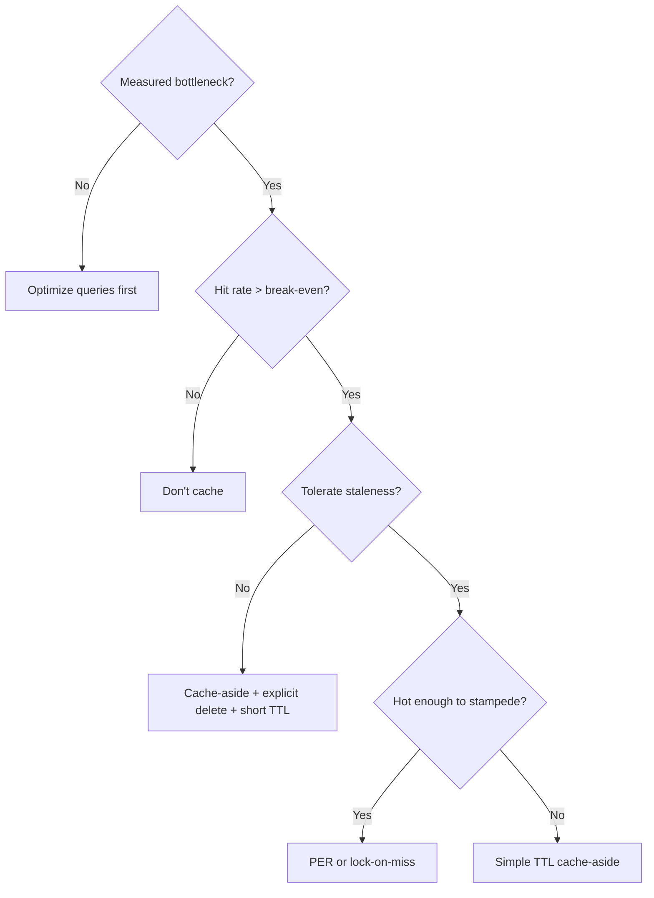

# 3. Caching Architecture

> **Parent**: [System Design Interview Reference](../index.md)  
> **Source**: [20 Design Interview Questions](../../../articles/databases/20-design-interview-questions.md) — Questions #9–12  
> **Also see**: [Discord Data Architecture](../../../articles/databases/discord-data-architecture-master-class.md) — Request coalescing (in-flight deduplication)

---

## cache-01: Cache Stampede

> **Source**: [20 Design Interview Questions](../../../articles/databases/20-design-interview-questions.md) — Q#9


| | |
|:---|:---|
| **Problem** | Popular cache key expires → 200 concurrent requests all hit the database simultaneously → DB crushed |
| **Root cause** | All requests discover the cache miss at the same instant and race to regenerate |

**Strategy**:

| Strategy | Mechanism | Staleness | Complexity | Best for |
|:---|:---|:---:|:---:|:---|
| **PER (Probabilistic Early Recomp.)** | Random early refresh near TTL: $P(refresh) = \frac{\Delta}{\beta \cdot ttl + \Delta}$ | Low | Low | Default choice |
| **Lock-on-Miss** | Only one request regenerates; others wait | None | Low | Cannot tolerate staleness |
| **External refresh** | Cron job refreshes before expiry | None | High | Predictably hot keys |
| **GETEX** (Redis 6.2+) | Atomic get + TTL reset on every read | None | Minimal | Perennially hot keys |

```python
# PER implementation
def should_refresh(ttl_ms, delta=1000, beta=1.0):
    if ttl_ms <= 0:
        return True
    return random.random() < delta / (beta * ttl_ms + delta)
```

> **Azure**: Azure Cache for Redis 6.2+ supports `GETEX` | **General**: §7.3 Caching Strategies

---

## cache-02: Cache Invalidation

> **Source**: [20 Design Interview Questions](../../../articles/databases/20-design-interview-questions.md) — Q#10


| | |
|:---|:---|
| **Problem** | User updates email → stale profile in cache |
| **Root cause** | Write path doesn't invalidate or update the cache |

**Strategy — the pragmatic answer**:

```
Cache-Aside + Explicit Delete on Write + TTL Safety Net

WRITE: DB UPDATE → cache DEL user:42
READ:  cache GET → miss → DB SELECT → cache SET user:42 (TTL: 300s)
```

| Write Pattern | Write path | How it works | Key risk |
|:---|:---|:---|:---|
| **Cache-Aside** | `App → DB → Cache` | App updates DB first, then deletes cache entry | Race: stale data re-enters cache |
| **Write-Through** | `App → Cache → DB` | Write to cache, cache syncs to DB synchronously | Every write touches cache |
| **Write-Behind** | `App → Cache ⇢ DB` | Write to cache, DB updated asynchronously later | Data loss if cache crashes |
| **Refresh-Ahead** | `Cache ⇠ DB` | Cache pre-fetches from DB before key expires | Complex tuning |

**Write pattern visualizations** — WRITE flow on the left, READ flow on the right.

**Cache-Aside** — App talks to DB first, then clears cache:

```
 WRITE: +-----+  1)UPDATE   +---+  2)DEL    +-------+
        | App |------------>|DB |---------->| Cache |
        +-----+             +---+           +-------+

 READ:  +-----+  1)GET MISS  +-------+  2)SELECT    +---+  3)SET     +-------+
        | App |------------->| Cache |------------->|DB |----------->| Cache |
        +-----+              +-------+              +---+            +-------+
```
⚡ **Race**: read between 1) and 2) gets old data back into cache.

**Write-Through** — Cache sits between App and DB:

```
 WRITE: +-----+  1)SET    +-------+  2)UPDATE   +---+
        | App |---------->| Cache |------------>|DB |
        +-----+           +-------+             +---+

 READ:  +-----+  1)GET HIT   +-------+
        | App |------------->| Cache |   (DB never touched)
        +-----+              +-------+
```
⚡ Every write hits cache + DB. Best for: rare writes, frequent reads.

**Write-Behind** — App writes cache only, DB updated later:

```
 WRITE: +-----+  1)SET    +-------+                 +-------+  flush   +---+
        | App |---------->| Cache |   ...later...   | Cache |--------->|DB |
        +-----+           +-------+                 +-------+          +---+

 READ:  +-----+  1)GET HIT   +-------+
        | App |------------->| Cache |   (always fast)
        +-----+              +-------+
```
⚡ Cache crash = **data lost**. Best for: metrics, counters.

**Refresh-Ahead** — Cache auto-refreshes before key expires:

```
 t=0s   +-----+  GET HIT   +-------+
        | App |----------->| Cache |  (ttl=300s)
        +-----+            +-------+

 t=250s +-----+  GET HIT   +-------+  triggers    +---+
        | App |----------->| Cache |---SELECT---->|DB |---row--> Cache refresh
        +-----+            +-------+              +---+

 t=310s +-----+  GET HIT   +-------+
        | App |----------->| Cache |  <-- fresh, no stall
        +-----+            +-------+
```
⚡ Hard to tune threshold. Best for: hot keys where cache miss is unacceptable.

**Write pattern decision matrix**:

| Decision factor | Cache-Aside | Write-Through | Write-Behind | Refresh-Ahead |
|:---|:---:|:---:|:---:|:---:|
| Write-heavy workload | ✅ | ❌ | ✅ | — |
| Read-heavy workload | ✅ | ✅ | ✅ | ✅ |
| Data loss tolerance | High | None | Low | None |
| Staleness tolerance | Short TTL | None | Until flush | Configurable |
| Operational complexity | Low | Low | Medium | High |
| Best for | General purpose | Config/metadata | Metrics/counters | Hot keys, ML features |

**CDC alternative** (for multi-service scenarios): Debezium tails DB WAL → emits change events to Kafka → cache invalidation consumer updates/deletes keys. Decouples invalidation from application code.

> **Azure**: Azure Cache for Redis | **General**: §7.3 Caching Strategies

---

## cache-03: Caching Anti-Patterns

> **Source**: [20 Design Interview Questions](../../../articles/databases/20-design-interview-questions.md) — Q#11


| | |
|:---|:---|
| **Problem** | Adding Redis made the system slower, not faster |
| **Root cause** | Cache hit rate too low — paying network hop cost on every miss |

**Break-even formula**:

$$\text{Caching helps when: } hit\_rate > \frac{cache\_latency}{db\_latency}$$

| Scenario | Hit Rate | Avg Latency | Net Effect |
|:---|:---:|:---|:---|
| No cache | — | 3ms | Baseline |
| 90% hit | 90% | 1ms × 0.9 + 4ms × 0.1 = **1.3ms** | ✅ Faster |
| 50% hit | 50% | 1ms × 0.5 + 4ms × 0.5 = **2.5ms** | ⚠️ Marginal |
| 10% hit | 10% | 1ms × 0.9 + 4ms × 0.1 = **3.7ms** | ❌ Slower |

**When not to cache**:
1. Uniform access pattern (every key equally likely → 0% benefit)
2. Highly volatile data (changes faster than TTL)
3. Cache becomes SPOF (no graceful degradation path)
4. Serialization cost exceeds query cost

```python
# ❌ Cache or die
value = redis.get(key)
if value: return value
return db.query(...)

# ✅ Cache optionally — graceful degradation
try:
    value = redis.get(key)
    if value: return value
except RedisError:
    metrics.incr("cache.error")
return db.query(...)
```

> **Azure**: App Insights for cache hit ratio monitoring | **General**: §7.3 Caching Strategies

---

## cache-04: Eviction Policies

> **Source**: [20 Design Interview Questions](../../../articles/databases/20-design-interview-questions.md) — Q#12


| | |
|:---|:---|
| **Problem** | Users randomly logged out under load, or hot content evicted while cold content stays |
| **Root cause** | Wrong `maxmemory-policy` for the workload |

**Strategy — match policy to workload**:

| Workload | Policy | Why |
|:---|:---|:---|
| **User sessions** | `volatile-ttl` | Eviction = forced logout. Let natural TTL govern. Evict near-expiry first. |
| **Content feeds / timelines** | `allkeys-lru` or `allkeys-lfu` | Hot content (5% of keys, 95% of reads) survives; cold evicted. |
| **Rate limit counters** | `volatile-ttl` | Window expiry = natural eviction. |
| **API response cache** | `allkeys-lru` | Frequently hit endpoints stay warm. |
| **Leaderboards** | `noeviction` | Need all data; scale memory instead. |
| **Distributed locks** | `noeviction` | Never silently evict a lock — safety risk. |

**Redis policy reference**:

| Policy | Scope | Rule |
|:---|:---|:---|
| `noeviction` | — | Error on write when full |
| `allkeys-lru` | All keys | Approximated LRU |
| `allkeys-lfu` | All keys | Approximated LFU (4.0+) |
| `volatile-lru` | Keys with TTL | Approximated LRU |
| `volatile-lfu` | Keys with TTL | Approximated LFU |
| `volatile-ttl` | Keys with TTL | Shortest remaining TTL first |
| `allkeys-random` | All keys | Random eviction |

> **Azure**: Azure Cache for Redis — set `maxmemory-policy` via Azure Portal or CLI | **General**: §7.3 Caching Strategies

---

## cache-05: Request Coalescing (In-Flight Deduplication)

> **Source**: [Discord Data Architecture](../../../articles/databases/discord-data-architecture-master-class.md)


| | |
|:---|:---|
| **Problem** | 500 concurrent requests for the same data all hit the database simultaneously — even a cache won't help because all 500 miss at the same instant |
| **Root cause** | Cache stampede solutions (PER, lock-on-miss) help when data is **already cached**. Coalescing helps when data is **not yet cached** — it prevents duplicate DB queries before they happen |

**How it differs from cache stampede protection**:

```
Cache Stampede (P9):                    Request Coalescing (P13):

  Key expired → 500 miss cache           No cache entry exists → 500 requests
  PER: random early refresh              Coalescer: 1st requests DB,
  Lock-on-miss: 1 regenerates              others subscribe to in-flight result

  Protects cached data                  Protects uncached/expired data
  from expiring under load              from launching duplicate DB queries
```

**Real-world example — Discord**: A popular channel (#general) gets 500 simultaneous read requests. Without coalescing, all 500 hit Cassandra. With coalescing, the Rust data service issues **only 1 DB query** — the other 499 subscribe to the in-flight result and receive it when it resolves.

**Strategy**:

```rust
// In-flight request map — keyed by what's being fetched
inflight: HashMap<PartitionKey, JoinHandle<Result>>

async fn get_data(key: &str) -> Result<Data> {
    if let Some(handle) = inflight.get(key) {
        // Someone already fetching this — subscribe, don't query
        return handle.subscribe().await;
    }
    // First request: fetch from DB, let others subscribe
    let handle = spawn_db_query(key);
    inflight.insert(key, handle.clone());
    let result = handle.await;
    inflight.remove(key);  // clean up for next batch
    result
}
```

**Timeline — 500 requests, 1 DB query**:

```
Time ──────────────────────────────────────────────────────►

Req #1:   [map empty] [issues DB query] [stores handle] .... [DB responds]
                                                             [wakes all 500]
Req #2:        [found handle] [subscribes] ................. [wakes up]
Req #3:             [found handle] [subscribes] ............ [wakes up]
...
Req #500:           [found handle] [subscribes] ............ [wakes up]

DB:                                    [1 query executing] ... [1 response]
```

| Coalescing vs Cache | Cache (Redis) | Coalescing (in-flight map) |
|:---|:---|:---|
| **What it stores** | Completed results | In-flight promises/futures |
| **Lifetime** | Minutes/hours (TTL) | Millseconds (duration of DB query) |
| **Protects against** | Repeated reads over time | Simultaneous reads at the same instant |
| **Storage** | External (Redis) | In-process memory (HashMap) |
| **Pair with** | PER, lock-on-miss | Consistent hash routing (see [api-05: Consistent Hash Routing](../api-network/api-network-design.md#api-05-consistent-hash-based-routing)) |

**Prerequisite — why this needs consistent hash routing**:

```
Without routing:                    With routing:
  500 requests scatter               500 requests all go to Svc2
  across 4 instances                 (hash(channel_id) → Svc2)
  Svc1: 125 → coalesce to 1          Svc2: 500 → coalesce to 1
  Svc2: 125 → coalesce to 1          DB: 1 query (not 4, not 500)
  Svc3: 125 → coalesce to 1
  Svc4: 125 → coalesce to 1
  DB: 4 queries (better, but not 1)
```

> **Architect's rule**: Coalescing and caching solve different problems. Caching prevents **repeated** reads. Coalescing prevents **simultaneous** reads. For hot data that's read by many users at the same instant (social media feeds, popular channels, trending items), you need both.

> **Azure**: No built-in Azure service provides in-flight request coalescing — implement at the application layer. Pair with consistent hash routing via Application Gateway or custom middleware. Cosmos DB's direct mode + gateway mode does internal connection coalescing but not request-level deduplication. | **General**: §7.3 Caching Strategies

---

## Decision Flowchart: Caching


