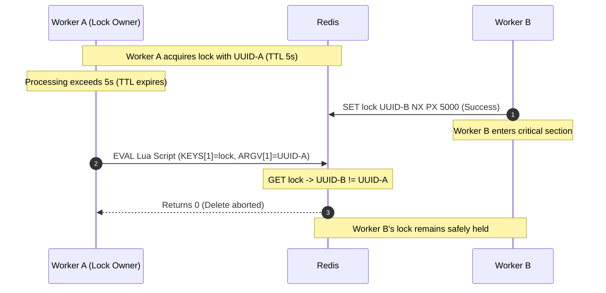

```mermaid
gantt
    title Transaction Boundary vs Distributed Lock Scope
    dateFormat  X
    axisFormat %s

    section Correct Architecture
    Redis Distributed Lock Held :active, l1, 0, 10
    DB Transaction Begin       :crit, t1, 1, 2
    DB Operations & Flushing   :t2, 2, 7
    DB Commit Finished         :crit, t3, 7, 8
    Lock Released              :milestone, m1, 10, 10

    section Faulty Inversion
    Redis Distributed Lock Held :l2, 0, 6
    DB Operations              :t4, 1, 5
    Lock Released Prematurely  :crit, milestone, m2, 6, 6
    Race Window (Stale DB Read):active, r1, 6, 8
    DB Commit (Too Late)       :crit, t5, 8, 9
```

# 63. Redis Distributed Locking — Key Takeaways

> **Parent**: [System Design Interview Reference](../index.md)  
> **Source**: [Redis Distributed Locking — Commands, Patterns, and Production Pitfalls](../../articles/caching/redis-distributed-locking-commands-patterns-pitfalls.md)  
> **Purpose**: Extract reusable distributed locking patterns using Redis atomic primitives — atomic acquisition, safe script release, retry backoff, and transaction boundary correctness.  
> **Also see**: [Redis Internals](redis-internals.md), [Redis Rate Limiting Patterns](redis-rate-limiting-patterns.md), [Concurrency & Transactions](../concurrency-transactions/concurrency-transactions.md)  
> **Dictionary**: [Caching](../../reference-dictionary/caching.md) — [`#set-nx-redis`](../../reference-dictionary/caching.md#set-nx-redis), [`#redlock-algorithm`](../../reference-dictionary/caching.md#redlock-algorithm), [`#safe-lock-release-lua-script`](../../reference-dictionary/caching.md#safe-lock-release-lua-script); [Data Concurrency](../../reference-dictionary/data-concurrency.md) — [`#distributed-lock`](../../reference-dictionary/data-concurrency.md#distributed-lock), [`#lock-transaction-inversion`](../../reference-dictionary/data-concurrency.md#lock-transaction-inversion), [`#fencing-token`](../../reference-dictionary/data-concurrency.md#fencing-token); [Resilience](../../reference-dictionary/resilience.md) — [`#retry-pattern`](../../reference-dictionary/resilience.md#retry-pattern)  
> **Taxonomy Reference**: §7.3 Caching Strategies

---

## Contents

| ID | Problem | Key Concept |
|:---|:---|:---|
| [cache-49](#cache-49) | Non-atomic lock acquisition causes race conditions or permanent deadlocks on worker failure | Atomic `SET NX PX` (Mutual Exclusion + Lease Expiry) |
| [cache-50](#cache-50) | Expired locks released by late workers cause cross-client lock destruction | Safe Owner-Verified Lock Release via Atomic Lua Script |
| [cache-51](#cache-51) | Tight polling on contested locks causes Redis CPU saturation and thundering herd | Capped Exponential Backoff Retry Strategy |
| [cache-52](#cache-52) | Releasing distributed locks before database commit causes stale-read race conditions | Transaction Boundary Lock Alignment (Commit-Before-Release) |
| [cache-53](#cache-53) | Single-node failover and clock skew break mutual exclusion guarantees | Redlock Consensus Quorum & Clock Drift Mitigation |

---

## cache-49: Atomic Lock Acquisition with SET NX PX

> **Source**: [§"1. Lock Acquisition — SET NX with TTL"](../../articles/caching/redis-distributed-locking-commands-patterns-pitfalls.md#1-lock-acquisition--set-nx-with-ttl)

| | |
|:---|:---|
| **Problem** | Distributed workers competing for exclusive access to a shared resource (e.g., inventory deduction, coupon redemption) risk simultaneous execution if lock acquisition is non-atomic, or permanent deadlock if the lock holder crashes before setting a TTL |
| **Root cause** | Executing `SETNX` and `EXPIRE` as two separate commands creates an execution gap; if the client crashes or network disconnects between commands, the key remains indefinitely without a TTL |

**Strategy**: Combine key creation conditional on non-existence (`NX`) and expiration lease (`PX milliseconds` or `EX seconds`) into a single atomic command:

```bash
SET coupon:lock:SUMMER50 "uuid-abc-123" NX PX 5000
```

- **Resource Key**: `coupon:lock:<resource_id>` ensures isolation per entity.
- **Unique Lock Value (UUID / Token)**: Generates client-specific proof of ownership used during release.
- **`NX` Flag**: Guarantees mutual exclusion — Redis only writes if the key does not exist.
- **`PX 5000` Flag**: Sets an auto-expiry lease (5 seconds) atomically upon creation.

```java
Boolean acquired = redisTemplate.opsForValue()
    .setIfAbsent(lockKey, lockValue, Duration.ofMillis(5000));
```

| Tradeoff | Detail |
|:---|:---|
| **Lease estimation risk** | TTL must safely exceed expected critical section latency; if too short, lock expires prematurely; if too long, crashed worker blocks progress until TTL expires |
| **Failover risk (single node)** | Standard Redis replication is asynchronous; if master fails before replication, lock key may be lost on replica promotion |

> **Also see**: [Concurrency & Transactions](../concurrency-transactions/concurrency-transactions.md) — `tx-03` Distributed locks  
> **Dictionary**: [SET NX (Redis)](../../reference-dictionary/caching.md#set-nx-redis), [Distributed Lock](../../reference-dictionary/data-concurrency.md#distributed-lock)  
> **Azure**: Azure Cache for Redis (Standard/Premium tier)

---

## cache-50: Safe Lock Release via Atomic Lua Script

> **Source**: [§"2. Safe Lock Release — Lua Script"](../../articles/caching/redis-distributed-locking-commands-patterns-pitfalls.md#2-safe-lock-release--lua-script)

| | |
|:---|:---|
| **Problem** | Client A holds a lock whose TTL expires due to a long GC pause or database latency. Client B acquires the lock. Client A finishes and executes a naive `DEL lock_key`, accidentally deleting Client B's valid lock and allowing Client C to enter |
| **Root cause** | Non-owner lock release: `DEL` indiscriminately destroys the lock without verifying whether the caller is still the rightful lock owner |

**Strategy**: Use an atomic **Lua script** that reads the key's current value, compares it with the client's unique UUID token, and only issues `DEL` if the token matches. Because Lua scripts in Redis execute as a single atomic unit, no other command can interleave between verification and deletion:

```lua
if redis.call('get', KEYS[1]) == ARGV[1] then
    return redis.call('del', KEYS[1])
else
    return 0
end
```



| Tradeoff | Detail |
|:---|:---|
| **Script execution overhead** | Lua script execution introduces minimal CPU overhead; mitigated by script caching via `EVALSHA` |
| **Silent TTL expiration** | Returning 0 indicates the lock was lost prior to completion; application must handle late-completion cleanup or rollback |

> **Also see**: [Redis Rate Limiting Patterns](redis-rate-limiting-patterns.md) — `cache-17` Lua script atomicity  
> **Dictionary**: [Safe Lock Release (Lua Script)](../../reference-dictionary/caching.md#safe-lock-release-lua-script), [Lua Scripting (Redis)](../../reference-dictionary/caching.md#lua-scripting-redis)

---

## cache-51: Contention Mitigation via Capped Exponential Backoff

> **Source**: [§"3. Exponential Backoff Retry"](../../articles/caching/redis-distributed-locking-commands-patterns-pitfalls.md#3-exponential-backoff-retry)

| | |
|:---|:---|
| **Problem** | High-concurrency contention (e.g. flash sales, coupon redemption) causes hundreds of threads to busy-wait / poll Redis in tight loops, consuming massive network bandwidth, saturating Redis CPU, and triggering thundering herds |
| **Root cause** | Constant-interval polling (e.g., 50ms sleep) generates $O(N \times \text{attempts})$ Redis commands and synchronizes client retries |

**Strategy**: Implement **exponential backoff with a maximum delay cap** and total retry duration bounded below the lock TTL:

1. Initial delay: 50 ms.
2. Double delay each failed attempt: $50\text{ms} \to 100\text{ms} \to 200\text{ms} \to 400\text{ms} \to 800\text{ms} \to 1000\text{ms}$.
3. Cap delay at 1,000 ms (1 second).
4. Maximum attempts: 10 (~4.5s total wait time, safely within the 5.0s TTL).

```java
private boolean acquireLockWithRetry(String lockKey, String lockValue) {
    long delayMs = 50;
    for (int attempt = 0; attempt < 10; attempt++) {
        if (lockStrategy.acquireLock(lockKey, lockValue, 5000)) {
            return true;
        }
        if (attempt < 9) {
            try {
                Thread.sleep(delayMs);
            } catch (InterruptedException e) {
                Thread.currentThread().interrupt();
                return false;
            }
            delayMs = Math.min(delayMs * 2, 1000);
        }
    }
    return false;
}
```

| Metric | Constant 50ms Polling | Exponential Backoff |
|:---|:---|:---|
| **Redis calls (100 clients)** | 50,000 commands / 5s | ~1,000 commands / 5s (98% reduction) |
| **Thundering herd risk** | High (aligned retry beats) | Minimal (desynchronized backoff spread) |
| **Average lock latency** | Low for fast unlocks | Slightly higher under heavy contention |

| Tradeoff | Detail |
|:---|:---|
| **Contention wait latency** | Clients wait progressively longer on heavily contested locks rather than acquiring immediately upon release |
| **Tuning bound** | Total retry duration must be aligned with upstream client HTTP timeouts and lock TTL |

> **Also see**: [Resilience Patterns](../resilience/) — `resilience-01` Retry storms & backoff with jitter  
> **Dictionary**: [Retry Pattern](../../reference-dictionary/resilience.md#retry-pattern), [Thundering Herd](../../reference-dictionary/caching.md#cache-stampede)

---

## cache-52: Transaction Boundary Alignment (Commit-Before-Release)

> **Source**: [§"5. The Transaction Boundary Bug"](../../articles/caching/redis-distributed-locking-commands-patterns-pitfalls.md#5-the-transaction-boundary-bug)

| | |
|:---|:---|
| **Problem** | An application acquires a distributed lock, updates relational database rows, releases the lock, and then the database transaction commits. Concurrent workers acquire the released lock and read uncommitted/stale DB state, causing race conditions despite locking |
| **Root cause** | **Lock-Transaction Inversion**: Declarative transaction wrappers (e.g. Spring `@Transactional`) commit the database transaction *after* the method returns. Releasing the lock inside the method body creates a race window before database commit |

```java
// ❌ WRONG: Lock released before database commit
@Transactional
public RedeemResponse redeemCoupon(RedeemRequest request) {
    acquireLock(); // Step 1: Lock acquired
    // ... DB updates executed in memory/session buffer ...
    releaseLock(); // Step 2: ❌ Lock released BEFORE DB commit!
}                  // Step 3: DB transaction commits (race window between 2 & 3!)
```

**Strategy**: Enforce programmatic transaction boundaries via `TransactionTemplate` (or explicit transaction blocks) so the lock strictly encloses the full transaction lifecycle (`acquire → begin tx → commit tx → release lock`):

```java
// ✅ CORRECT: Lock strictly encompasses database commit
public RedeemResponse redeemCoupon(RedeemRequest request) {
    acquireLock(); // Step 1: Lock acquired

    try {
        return transactionTemplate.execute(status -> {
            // Step 2: DB modifications run and commit within callback
            return processRedemption(request);
        }); // Database transaction commits here!
    } finally {
        releaseLock(); // Step 3: Lock released strictly AFTER commit
    }
}
```



| Tradeoff | Detail |
|:---|:---|
| **Lock hold duration** | Holding the lock through network commit roundtrip slightly increases lock hold time |
| **Correctness guarantee** | Completely eliminates the post-lock stale read window; guarantees absolute consistency across distributed replicas |

> **Also see**: [Concurrency & Transactions](../concurrency-transactions/concurrency-transactions.md) — `tx-05` Locks for coordination, database for correctness  
> **Dictionary**: [Lock-Transaction Inversion](../../reference-dictionary/data-concurrency.md#lock-transaction-inversion), [Atomic Conditional Update](../../reference-dictionary/data-concurrency.md#atomic-conditional-update)

---

## cache-53: Multi-Node Consensus Quorum & Clock Drift (Redlock)

> **Source**: [§"8. Production Considerations"](../../articles/caching/redis-distributed-locking-commands-patterns-pitfalls.md#8-production-considerations)

| | |
|:---|:---|
| **Problem** | A single Redis master holding a lock crashes before asynchronous replication propagates the lock key to replicas. A promoted replica accepts a new lock for the same resource, violating mutual exclusion |
| **Root cause** | Standard Redis replication is asynchronous ($CP$ vs $AP$ trade-off); failover does not guarantee lock persistence across split-brain scenarios |

**Strategy**: Deploy the **Redlock algorithm** across $N$ independent Redis master nodes (typically 5):

1. **Acquisition Phase**: Client records current timestamp $T_1$, then attempts to acquire lock on all $N$ instances sequentially using short connection timeouts ($<\text{TTL}$).
2. **Quorum Verification**: Client checks if lock was acquired on at least $\lfloor N/2 \rfloor + 1$ nodes (e.g. 3 of 5) and total elapsed time $(T_2 - T_1) < \text{TTL}$.
3. **Validity Time Computation**: Effective lock validity time is $\text{TTL} - (T_2 - T_1) - \text{ClockDrift}$.
4. **Rollback on Failure**: If quorum is not met or validity time is invalid, release lock on all nodes (even those where acquisition timed out).

```
          ┌────────────────────────────────────────┐
          │      Client Lock Coordinator           │
          └────┬───────────┬───────────┬───────┬───┘
               │           │           │       │
    ┌──────────▼───┐ ┌─────▼────┐ ┌────▼───┐ ┌─▼────────┐ ┌──────────┐
    │ Redis Node 1 │ │ Node 2   │ │ Node 3 │ │ Node 4   │ │ Node 5   │
    │   (Master)   │ │ (Master) │ │(Master)│ │ (Master) │ │ (Master) │
    └──────────────┘ └──────────┘ └────────┘ └──────────┘ └──────────┘
           ▲               ▲           ▲
           └───────────────┴───────────┴─── Quorum (>= 3 of 5)
```

**Production Operational Requirements**:
- **Clock Synchronization**: NTP synchronization with monotonically non-decreasing clock monitoring to avoid sudden time jumps.
- **Connection Pools**: Configure dedicated Lettuce/Jedis pools with aggressive socket timeouts (1–2s) so degraded nodes don't block the acquisition quorum.

| Tradeoff | Detail |
|:---|:---|
| **Complexity & Latency** | $N$ separate network roundtrips per lock acquisition; higher operational cost of managing independent master nodes |
| **When to Use** | Use Redlock when correctness across node failures is mandatory without a full consensus system (like ZooKeeper/etcd) |

> **Also see**: [System Design Interview Roadmap](../system-design-interview/) — Quorum vs consensus  
> **Dictionary**: [Redlock Algorithm](../../reference-dictionary/caching.md#redlock-algorithm), [Fencing Token](../../reference-dictionary/data-concurrency.md#fencing-token)  
> **Azure**: Azure Cache for Redis Enterprise (Active-Active multi-region replication or multi-zone clustering)

---

## Architectural Summary

```json
{
  "domain": "caching",
  "topic": "Redis Distributed Locking",
  "patterns": [
    {
      "id": "cache-49",
      "name": "Atomic Lock Acquisition (SET NX PX)",
      "mechanism": "Single-command mutual exclusion + TTL lease",
      "failure_mode": "Deadlock prevention on worker crash"
    },
    {
      "id": "cache-50",
      "name": "Safe Lock Release (Lua Script)",
      "mechanism": "Atomic GET token + DEL verification",
      "failure_mode": "Prevents cross-client lock destruction on late expiry"
    },
    {
      "id": "cache-51",
      "name": "Capped Exponential Backoff Retry",
      "mechanism": "50ms doubling up to 1000ms cap across 10 attempts",
      "failure_mode": "Eliminates Redis CPU saturation & thundering herds"
    },
    {
      "id": "cache-52",
      "name": "Transaction Boundary Alignment",
      "mechanism": "Programmatic TransactionTemplate enclosing commit before release",
      "failure_mode": "Eliminates stale-read race conditions during uncommitted DB writes"
    },
    {
      "id": "cache-53",
      "name": "Redlock Quorum Consensus",
      "mechanism": "Majority acquisition across N independent masters with drift adjustment",
      "failure_mode": "Tolerates single-node asynchronous failover loss"
    }
  ]
}
```
