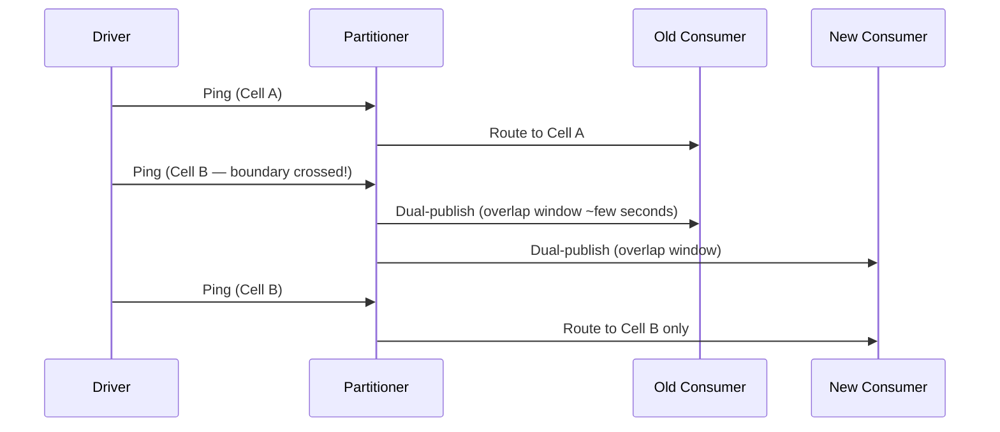
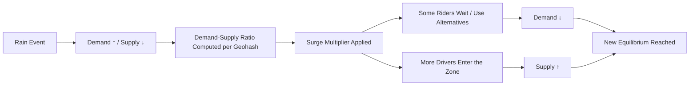
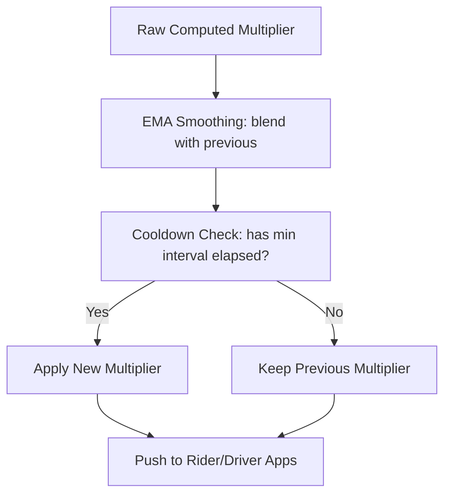
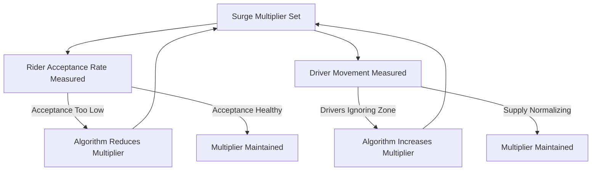

# 6. Uber Architecture Case Study: Key Takeaways

> **Parent**: [System Design Interview Reference](../index.md)  
> **Source**: [Uber Architecture — 5-Part Series](../../../articles/case-studies/uber-architecture/) — by Simranjeet Singh (Mar 2026) + [Part 6 — Surge Pricing During Rain](../../../articles/case-studies/uber-architecture/06-surge-pricing-during-rain.md) — by Arvind Kumar (Jul 2026)  
> **Purpose**: Extract reusable architectural patterns, tradeoffs, and strategies from Uber's real-time GPS tracking system at 83,000 writes/sec.

---

## Contents

- [uber-01: The Decomposition Principle](#uber-01-the-decomposition-principle) — Why one system cannot serve three consumers
- [uber-02: Ingestion Edge — Stateless Validation Gate](#uber-02-ingestion-edge--stateless-validation-gate) — Validate, dedup, rate-control before anything touches a database
- [uber-03: Geo-Partitioning vs Identity-Partitioning](#uber-03-geo-partitioning-vs-identity-partitioning) — Why driver_id breaks dispatch; H3 hexagonal grid
- [uber-04: Ring Buffer for Real-Time Serving](#uber-04-ring-buffer-for-real-time-serving) — Redis capped lists + two-layer eviction
- [uber-05: B-Tree vs LSM-Tree — Write-Heavy Workloads](#uber-05-b-tree-vs-lsm-tree--write-heavy-workloads) — Why Postgres fails at 83K writes/sec; Cassandra data model
- [uber-06: Dispatch as O(1) Spatial Lookup](#uber-06-dispatch-as-o1-spatial-lookup) — H3 gridDisk + Redis MGET
- [uber-07: ETA Computation Pipeline](#uber-07-eta-computation-pipeline) — Velocity vectors + road graph + contraction hierarchies
- [uber-08: Map Rendering as Signal Processing](#uber-08-map-rendering-as-signal-processing) — Kalman filter, dead reckoning, map matching, batching
- [uber-09: Adaptive Sampling — Server-Side Rate Control](#uber-09-adaptive-sampling--server-side-rate-control) — Closed-loop feedback for 20–30% write reduction
- [uber-10: Partition Boundary Handoff](#uber-10-partition-boundary-handoff) — Dual-publish at H3 cell crossings
- [uber-11: The Full Stack in One Breath](#uber-11-the-full-stack-in-one-breath) — End-to-end architecture summary
- [uber-12: Surge Pricing as Real-Time Market Feedback System](#uber-12-surge-pricing-as-real-time-market-feedback-system) — Dynamic pricing as market-clearing mechanism
- [uber-13: Per-Geohash Demand-Supply Computation with Sliding Windows](#uber-13-per-geohash-demand-supply-computation-with-sliding-windows) — Redis counters + 5-min sliding window
- [uber-14: Oscillation Prevention via EMA Smoothing and Cooldown](#uber-14-oscillation-prevention-via-ema-smoothing-and-cooldown) — Two-layer damping: EMA + cooldown period
- [uber-15: Adjacency Adjustment for Spatial Price Smoothing](#uber-15-adjacency-adjustment-for-spatial-price-smoothing) — Neighbor cell influence on surge multiplier
- [uber-16: Surge Pricing Monitoring — 7 Key Metrics + Behavioral Feedback Loops](#uber-16-surge-pricing-monitoring--7-key-metrics--behavioral-feedback-loops) — Observability for a market-feedback system
- [Azure Service Mapping](#azure-service-mapping)

---

## uber-01: The Decomposition Principle

> **Source**: [Part 1 — Why Tracking 5 Million Drivers Is Hard](../../../articles/case-studies/uber-architecture/01-why-tracking-5-million-drivers-is-hard.md)


| | |
|:---|:---|
| **Problem** | 83,000 GPS writes/sec must serve three consumers with conflicting requirements: rider's map (point lookup, <1s), dispatch engine (range query, <100ms), analytics (batch/stream, seconds+) |
| **Root cause** | A single storage system cannot optimize for write throughput, read latency, and storage cost simultaneously — the **tradeoff triangle** forces you to pick at most two |

**Strategy — Decompose by consumer need, not by data shape**:

| Consumer | Access Pattern | Latency | System |
|----------|---------------|---------|--------|
| Rider's Map | Point lookup (single driver) | < 1 second | Ring Buffer (Redis) |
| Dispatch Engine | Range query (geographic area) | < 100 ms | Ring Buffer (Redis) + H3 spatial index |
| Analytics Pipeline | Batch/stream processing | Seconds+ | Cassandra (durable, time-partitioned) |

**The meta-principle**:

> When a problem seems impossibly large, it is usually because you are looking at it as one problem. Break it into the smallest problem that a single excellent system can solve completely, define its output contract precisely, and hand off to the next layer.

**Architecture pattern**: **Staged Event-Driven Architecture (SEDA)** — a network of stages connected by queues (Kafka), where each stage is independently tunable. This is a **Kappa Architecture** variant (single streaming pipeline for both real-time and batch).

**Tradeoff**: Operational complexity of six layers vs. the impossibility of a single-system solution.

> **Azure**: [Event Hubs](../../architecture-azure/integration/event-hubs/) (Kafka protocol) + [Azure Cache for Redis](../../architecture-azure/data/redis/) + [Cosmos DB Cassandra API](../../architecture-azure/data/databases/) | **Taxonomy**: §3.3 Event-Driven & Messaging, §7.3 Caching Strategies

---

## uber-02: Ingestion Edge — Stateless Validation Gate

> **Source**: [Part 2 — The Ingestion Edge](../../../articles/case-studies/uber-architecture/02-the-ingestion-edge.md)


| | |
|:---|:---|
| **Problem** | Raw GPS pings contain malformed data, duplicates, and impossible coordinates — sending garbage directly to a database at 83K writes/sec corrupts the pipeline |
| **Root cause** | No pre-database validation layer; database becomes both ingestion gate and storage engine |

**Strategy — Three responsibilities, nothing more**:

| # | Job | How |
|---|-----|-----|
| 1 | **Validate** | Schema check, timestamp plausibility, coordinate plausibility (reject 0,0 and mid-ocean coords). Silently drop + increment metric. No back-pressure to client. |
| 2 | **Deduplicate** | In-memory cache keyed by `(driver_id, timestamp)`, TTL ~few seconds. Silently drop duplicates. |
| 3 | **Forward** | Push clean events to Kafka. Nothing else. |

**Key design constraint**: The edge node is **stateless**. No queries. No computation. No persistent storage. This is what makes it infinitely horizontally scalable — no coordination, no distributed locks, no consensus.

**Regional deployment**: Edge nodes live close to drivers (Mumbai edge for Mumbai drivers), not near the central datacenter. This provides both lower latency and **blast radius control** (São Paulo spike doesn't degrade Mumbai drivers).

**Protocol**: WebSocket over TCP (not UDP). Reasoning: UDP loses ordering and connection state needed for dedup, validation, and lifecycle management. QUIC (HTTP/3) is a plausible future direction.

| Protocol | Use Case | Why Not for Uber |
|----------|----------|-----------------|
| UDP | Lossy-tolerant telemetry | No ordering, no connection state |
| TCP + WebSocket | Persistent full-duplex with reliability | ✅ Uber's choice |
| QUIC (HTTP/3) | Fast connection establishment, better under packet loss | Future direction |

> **Analogy**: The edge node is a **bouncer** — checks IDs and lets people in. It doesn't seat anyone. Keep the door separate from everything behind it.

> **Azure**: [API Management](../../architecture-azure/integration/) for validation/routing + [Event Hubs](../../architecture-azure/integration/event-hubs/) as the Kafka-equivalent ingestion buffer | **Taxonomy**: §8.2 API Gateway & Edge Patterns

---

## uber-03: Geo-Partitioning vs Identity-Partitioning

> **Source**: [Part 3 — Kafka Partitioning & Hexagonal Grid](../../../articles/case-studies/uber-architecture/03-kafka-partitioning-geography-hex-grid.md)


| | |
|:---|:---|
| **Problem** | Partitioning Kafka by `driver_id` scatters physically co-located drivers across all partitions, forcing the dispatch engine to do a distributed scatter-gather for every spatial query |
| **Root cause** | Indexing by **identity** when the consumer needs to query by **location** |

**Strategy — Partition by geography (H3 cell), not by driver identity**:

| Partition Key | Query Type | Complexity | Dispatch Feasible? |
|:---|:---|:---:|:---:|
| `driver_id` | Distributed scatter-gather | O(N) — query all partitions | ❌ |
| H3 cell ID | Local memory read | O(1) — single partition has all data | ✅ |

### ⚠️ Clarification: Kafka doesn't query — the consumer does

This is the most frequently misunderstood point. Kafka is a **log**, not a database. It doesn't answer queries. The "query" in the table above refers to what the **dispatch consumer instance** does — not what Kafka does.

Here's the mechanism step by step:

```
┌─────────────────────────────────────────────────────────┐
│  KAFKA (streaming log — no queries happen here)         │
│                                                         │
│  Partition "Koramangala"      Partition "Indiranagar"   │
│  ┌─────────────────────┐     ┌─────────────────────┐    │
│  │ Driver A (12.934,    │     │ Driver X (12.978,    │    │
│  │           77.612)    │     │           77.641)    │    │
│  │ Driver B (12.935,    │     │ Driver Y (12.977,    │    │
│  │           77.614)    │     │           77.643)    │    │
│  │ Driver C (12.933,    │     │ Driver Z (12.979,    │    │
│  │           77.611)    │     │           77.640)    │    │
│  └─────────┬───────────┘     └─────────┬───────────┘    │
│            │                           │                │
└────────────┼───────────────────────────┼────────────────┘
             │ consumes                  │ consumes
             ▼                           ▼
┌─────────────────────────┐  ┌─────────────────────────┐
│ Consumer Instance #1    │  │ Consumer Instance #2    │
│ (owns Koramangala)      │  │ (owns Indiranagar)      │
│                         │  │                         │
│ IN-MEMORY STATE TABLE:  │  │ IN-MEMORY STATE TABLE:  │
│ ┌─────────────────────┐ │  │ ┌─────────────────────┐ │
│ │ Driver A → (lat,lng)│ │  │ │ Driver X → (lat,lng)│ │
│ │ Driver B → (lat,lng)│ │  │ │ Driver Y → (lat,lng)│ │
│ │ Driver C → (lat,lng)│ │  │ │ Driver Z → (lat,lng)│ │
│ └─────────────────────┘ │  │ └─────────────────────┘ │
│                         │  │                         │
│ ← LOCAL lookup when     │  │ ← LOCAL lookup when     │
│   dispatch query hits   │  │   dispatch query hits   │
│   this neighborhood     │  │   this neighborhood     │
└─────────────────────────┘  └─────────────────────────┘
```

**The dispatch consumer does three things continuously**:

| Step | Action | Where |
|------|--------|-------|
| 1 | **Ingest** — Consume GPS events from its assigned Kafka partition | From Kafka |
| 2 | **Build state** — Maintain an in-memory hashmap: `driver_id → (lat, lng, speed, heading, timestamp)` | In RAM (consumer process heap) |
| 3 | **Answer queries** — When a dispatch request arrives for a pickup in this area, look up candidates from the in-memory state table | Local memory read |

The geo-partitioning in Kafka is what makes Step 2 produce a **geographically coherent** state table. If Koramangala's drivers all land in one partition, consumer #1's hashmap contains **every driver in Koramangala and only Koramangala drivers**. No other consumer needs to be consulted for a Koramangala dispatch.

**What happens if you partition by `driver_id` instead:**

```
Partition by driver_id → each consumer gets a RANDOM subset of drivers
                         from EVERY neighborhood

Consumer #1: Driver A (Koramangala), Driver X (Indiranagar), Driver M (Whitefield) ...
Consumer #2: Driver B (Koramangala), Driver Y (Indiranagar), Driver N (Whitefield) ...
Consumer #3: Driver C (Koramangala), Driver Z (Indiranagar), Driver O (Whitefield) ...

Dispatch for Koramangala → must query ALL N consumers → scatter-gather → O(N) latency
```

No single consumer has a complete picture of any neighborhood. The spatial locality is destroyed at ingestion time and can never be recovered downstream.

> **The geo-partitioning is not about making Kafka queryable. It's about making each consumer's in-memory state table a complete, self-contained spatial index for one geographic region.** Kafka is just the delivery mechanism that pre-sorts the data so the consumer doesn't have to.

**H3 Hexagonal Grid** (Uber's open-source library):

| Property | Square Grid | H3 Hex Grid |
|----------|-------------|-------------|
| Neighbors | 8 (4 edge + 4 corner) | 6 (all edge) |
| Neighbor distance | Two classes (1× and ~1.41×) | All equidistant |
| Spatial aliasing | Yes — diagonal neighbors skew proximity | No |
| Hierarchical nesting | No | Yes — bitwise parent/child operations |

**Resolution levels**:

| Resolution | Area | Use Case |
|-----------|------|----------|
| 5 | ~250 km² | Surge pricing, demand heatmaps |
| **9** | ~0.1 km² (~few city blocks) | **Dispatch queries** |
| 15 | < 1 m² | Hyper-precise location |

### How H3 Is Stored: The 64-Bit Integer Layout

Every H3 cell is a single **64-bit unsigned integer** (`uint64`). The bits encode the entire hierarchy — resolution, base cell, and path through the tree — in a self-contained format. No external lookup table needed.

```
 H3 Index (64-bit integer)
┌────┬──────┬──────────────────────────────────────────────┐
│  0 │   1–4│  5–63                                         │
│Res │ Res  │  Cell path (depends on resolution)            │
│erved│Level│                                               │
└────┴──────┴──────────────────────────────────────────────┘

Detailed breakdown for resolution 9:
┌──────┬──────┬──────────┬──────────────────────────────────┐
│Bit 63│62–59 │  58–52   │  51–0                             │
│  1b  │  4b  │   7b     │   52b                              │
│ Mode │ Res  │ Base     │  Direction bits (3 bits × res)     │
│(=1)  │(=9)  │ cell #   │  Dir₀ │ Dir₁ │ ... │ Dir₉          │
└──────┴──────┴──────────┴──────────────────────────────────┘
                                      ▲
                         3 bits per resolution level
                         (value 0–6, selecting which
                          of 7 child hexagons)
```

| Field | Bits | What It Encodes |
|-------|------|-----------------|
| **Mode** | 63 | Always `1` for hexagon cells (mode 1) |
| **Resolution** | 59–62 | 4 bits → values 0–15 |
| **Base cell** | 52–58 | 7 bits → one of 122 base cells at resolution 0 |
| **Direction digits** | 0–51 | 3 bits per resolution level → each digit (0–6) picks which of 7 children |

Why 7 children per hexagon? A hexagon can be perfectly subdivided into 7 smaller hexagons — this is the unique geometric property that makes hex grids superior to squares (which subdivide into 4). At resolution 9, the cell ID contains the base cell number (7 bits) followed by 9 direction digits (9 × 3 = 27 bits), forming a **path** from the base cell down to the specific resolution-9 cell.

### How Traversal Works: Pure Bit Manipulation

This is the part that makes H3 extremely fast — every operation is integer arithmetic, never geometry.

**Going UP (cell → parent)** — ask "which resolution-5 cell contains this resolution-9 cell?"

```
Child cell (res 9):  0x892830B20FFFFFF
                     │  base  │ dir₀│ dir₁│ dir₂│ dir₃│ dir₄│ dir₅│ dir₆│ dir₇│ dir₈│ dir₉│
                     └──7b────┴──3b──┴──3b──┴──3b──┴──3b──┴──3b──┴──3b──┴──3b──┴──3b──┴──3b──┴──3b──┘

To get parent at res 5:
  1. Zero out direction digits for levels 6–9 (dir₆ through dir₉) → set those 12 bits to 0
  2. Set resolution field to 5

Parent cell (res 5): 0x852830B2FFFFFFFF
                     │  base  │ dir₀│ dir₁│ dir₂│ dir₃│ dir₄│ dir₅│  0   │  0   │  0   │  0   │
                     └──7b────┴──3b──┴──3b──┴──3b──┴──3b──┴──3b──┴──3b──┴──3b──┴──3b──┴──3b──┴──3b──┘
```

Implementation: `parent = (child & mask) | (new_resolution << 59)`. The mask keeps bits above the target resolution; everything below is zeroed.

**Going DOWN (parent → children)** — ask "what are the 7 resolution-10 children of this resolution-9 cell?"

```
Parent cell (res 9): 0x892830B20FFFFFF

Children at res 10: append a 3-bit direction digit (0–6)
  Child 0: 0x8A2830B20FFFFFF0   (append dir=0)
  Child 1: 0x8A2830B20FFFFFF1   (append dir=1)
  Child 2: 0x8A2830B20FFFFFF2   (append dir=2)
  ...
  Child 6: 0x8A2830B20FFFFFF6   (append dir=6)

Implementation: child = (parent << 3) | direction | (new_resolution << 59)
```

**CONTAINMENT check** (is cell A inside cell B?) — the most common operation in Uber's pipeline:

```
Is resolution-9 cell contained in resolution-5 cell?
  → parent_of(A) == B
  → Bitwise mask + integer comparison → O(1), ~1 CPU cycle
```

All three operations — parent, children, containment — are **single-digit nanosecond** operations because they're just bit shifts, masks, and integer comparisons. At 83,000 pings per second, this means the total CPU cost of H3 operations across the entire fleet is negligible compared to network and I/O costs.

### Why This Matters for Uber's Pipeline

Uber uses multiple resolutions **simultaneously** on the same ping:

| Resolution | Purpose | How |
|-----------|---------|-----|
| **9** | Kafka partition key (dispatch) | `h3.latlng_to_cell(lat, lng, 9)` → route to partition |
| **5** | Supply-demand heatmap (surge) | `h3.cell_to_parent(cell9, 5)` → aggregate into neighborhood bucket |
| **6** | Regional analytics | `h3.cell_to_parent(cell9, 6)` → city-district aggregation |

All three are computed from a single `latlng_to_cell` call plus two `cell_to_parent` bitwise operations. No second geo-lookup. No spatial join. No database index. The same 64-bit integer that routes the ping through Kafka also tells you which neighborhood and which city the driver is in — **for free**.

> **Analogy**: A full postal address like "Apartment 4B, 123 Main St, Koramangala, Bangalore, India" encodes multiple geographic levels in one string. You can extract "Koramangala" (resolution 5) or "Bangalore" (resolution 3) without a second lookup — it's already in the address itself. H3 does the same with bit fields.

**Real-world nuance**: A single Kafka partition owns many H3 cells, grouped by expected driver density. Territory assignments are stored in a metadata service, enabling **rebalancing without changing the Kafka topic structure**.

> **Key insight**: The spatial index is built **for free** as a side effect of the partitioning strategy. Every downstream system inherits geographic organization without building its own spatial index.

> **Azure**: [Event Hubs partitions](https://learn.microsoft.com/en-us/azure/event-hubs/event-hubs-features#partitions) + custom partition key routing | **Taxonomy**: §3.3 Event-Driven & Messaging, §4.2 Spatial Data Architecture

---

## uber-04: Ring Buffer for Real-Time Serving

> **Source**: [Part 4 — Ring Buffer & Cassandra](../../../articles/case-studies/uber-architecture/04-ring-buffer-and-cassandra-two-stores-one-stream.md)


| | |
|:---|:---|
| **Problem** | Dispatch engine needs sub-millisecond reads of the last few driver positions; Cassandra's read path (MemTable → block cache → SSTables → disk) takes 1–5ms+ |
| **Root cause** | Using a durable, disk-backed database for data whose useful lifetime is measured in seconds |

**Strategy — Redis capped list per driver**:

```
LPUSH driver:{id}:positions {ping}
LTRIM driver:{id}:positions 0 9    # Keep only last 10
```

| Property | Value |
|----------|-------|
| Data structure | Capped linked list (ring buffer) |
| Capacity | 5–10 positions per driver |
| Memory footprint | Fixed — never grows |
| Read latency | < 1 ms (RAM only) |
| Durability | None — data lost on restart (acceptable: refills in seconds) |

**What the last N positions enable**:

| Capability | How |
|------------|-----|
| **Smooth map animation** | Interpolate between T and T−1 positions for 60fps glide |
| **ETA velocity vector** | Distance between two positions ÷ time = speed; 3 positions = smoothed velocity + acceleration detection |
| **Dead reckoning** | Project last known velocity forward during GPS outages (tunnels, garages) |

**Two-Layer Eviction Strategy**:

| Layer | Mechanism | Purpose |
|-------|-----------|---------|
| **TTL expiry** | Redis key TTL (60–90s), refreshed on each write | Auto-cleanup when driver goes offline |
| **Timestamp freshness** | Each slot stores `received_at`; check before serving | Catch stale data even if TTL hasn't fired yet |

> A stale position that looks fresh is more dangerous than no position at all — it causes failed dispatch matches.

**Optional third layer**: Bloom filter pre-check — "has this driver pinged in the last N seconds?" — O(1), near-zero memory, avoids Redis reads for definitely-offline drivers.

> **Azure**: [Azure Cache for Redis](../../architecture-azure/data/redis/) (capped lists, TTL, pipelined MGET) | **Taxonomy**: §7.3 Caching Strategies

---

## uber-05: B-Tree vs LSM-Tree — Write-Heavy Workloads

> **Source**: [Part 4 — Ring Buffer & Cassandra](../../../articles/case-studies/uber-architecture/04-ring-buffer-and-cassandra-two-stores-one-stream.md)


| | |
|:---|:---|
| **Problem** | 83,000 sustained writes/sec to a B-Tree database (Postgres/MySQL) exhausts disk I/O due to random write overhead from page splits and index maintenance |
| **Root cause** | B-Tree modifies pages in place → random writes; GPS time-series ingestion needs sequential writes |

**Strategy — LSM-Tree (Cassandra) for append-heavy time-series**:

| | B-Tree (Postgres/MySQL) | LSM-Tree (Cassandra) |
|:---|:---|:---|
| **Write pattern** | Random writes (modify in place) | Sequential appends (log-structured) |
| **Write throughput** | Limited by page splits/merges | Extremely high |
| **Read pattern** | Fast sorted reads O(log N) | Efficient range scans within partition |
| **Storage overhead** | Write amplification from B-tree maintenance | Write amplification from compaction |
| **Best for** | Transactional, join-heavy, ACID | Time-series, append-heavy, high-ingest |

**Cassandra write path**: `CommitLog` (sequential disk append) + `MemTable` (in-memory sorted) → flush to immutable `SSTable` → background compaction merges SSTables.

**Cassandra data model for GPS**:

```sql
-- Partition key: (driver_id, date_bucket) — prevents unbounded partition growth
-- Clustering key: timestamp DESC — newest rows at partition head
CREATE TABLE driver_positions (
    driver_id    UUID,
    date_bucket  TEXT,        -- e.g., '2024-01-15'
    timestamp    TIMESTAMP,
    latitude     DOUBLE,
    longitude    DOUBLE,
    PRIMARY KEY ((driver_id, date_bucket), timestamp)
) WITH CLUSTERING ORDER BY (timestamp DESC);
```

| Key Design Decision | Why |
|---------------------|-----|
| `(driver_id, date_bucket)` partition key | Caps partition size to one day of pings — prevents hot partitions from highly active drivers |
| `timestamp DESC` clustering | Most common query is "recent history" — reads from partition head without scanning old rows |
| LOCAL_QUORUM consistency | Balances durability with write latency |

> **Tradeoff**: Cassandra's compaction causes write amplification. For GPS data, the sequential-write throughput gain vastly outweighs this cost.

> **Azure**: [Cosmos DB Cassandra API](../../architecture-azure/data/databases/) | **Taxonomy**: §4.1 Data Storage Architecture, §4.2 Time-Series Data Patterns

---

## uber-06: Dispatch as O(1) Spatial Lookup

> **Source**: [Part 5 — Dispatch Engine & Map Rendering](../../../articles/case-studies/uber-architecture/05-the-dispatch-engine-and-map-rendering.md)


| | |
|:---|:---|
| **Problem** | Matching a rider to the nearest available driver must complete in < 100 ms, but naive spatial queries scan all active drivers |
| **Root cause** | Treating driver proximity as a database query problem instead of a pre-indexed spatial lookup |

**Strategy — H3 gridDisk + Redis MGET**:

| Step | Operation | Time |
|------|-----------|------|
| 1 | Encode pickup → H3 cell ID | Microseconds |
| 2 | `gridDisk(K=1)` → 7 cells (center + 6 neighbors) | O(1), microseconds |
| 3 | Redis `MGET` 7 cell keys → candidate driver set | Sub-millisecond |

**Adaptive ring expansion**:

| K | Cells | Use Case |
|---|-------|----------|
| 1 | 7 | Dense urban rush hour |
| 2 | 19 | Medium density |
| 3 | 37 | Sparse suburban / late night |

If K=1 returns fewer than minimum candidates, expand to K=2 and retry. Each expansion is still O(1).

**Why Redis, never Cassandra for dispatch**:

| | Cassandra | Redis |
|:---|:---|:---|
| Read path | MemTable → block cache → SSTables (potentially disk) | RAM only |
| Read latency | 1–5 ms (disk hit), 10+ ms under compaction | < 1 ms |
| Fits 100ms budget? | ❌ A single read could consume 20%+ | ✅ Entire MGET fits easily |

> Freshness always wins over durability when the data has a useful lifetime measured in seconds.

> **Azure**: [Azure Cache for Redis](../../architecture-azure/data/redis/) pipelined reads + [Azure Maps](https://azure.microsoft.com/en-us/products/azure-maps/) for geospatial | **Taxonomy**: §2.1 Application Architecture, §7.3 Caching Strategies

---

## uber-07: ETA Computation Pipeline

> **Source**: [Part 5 — Dispatch Engine & Map Rendering](../../../articles/case-studies/uber-architecture/05-the-dispatch-engine-and-map-rendering.md)


| | |
|:---|:---|
| **Problem** | Ranking 15–20 candidate drivers by ETA requires accurate travel-time computation, not straight-line distance |
| **Root cause** | Straight-line distance ignores road geometry, traffic, and driver heading |

**Strategy — Three inputs combined**:

| Input | Source | Purpose |
|-------|--------|---------|
| **Velocity vector** | Last 3 GPS positions from Redis ring buffer | Current speed & heading; project position forward 2–3 seconds |
| **Road graph** | Directed weighted graph with live traffic edge weights (aggregated from all active Uber drivers) | Actual travel time, not straight-line distance |
| **Routing algorithm** | Bidirectional Dijkstra with **precomputed contraction hierarchies** | Fastest path — milliseconds instead of seconds |

**Key subtlety**: The ETA query starts from the driver's **projected position** (where they'll be in 2–3 seconds), not their current GPS position. This accounts for the delay between dispatch decision and driver acceptance.

**Parallelization**: ETA for all 15–20 candidates is computed concurrently via a pool of routing workers. Results are collected and ranked within the 100ms budget.

**Supply-Demand Heatmap**: A separate Flink/Spark Streaming job aggregates driver positions by H3 resolution-5 cells every 5 seconds → Redis hash → surge pricing engine reads and applies fare multipliers. End-to-end latency: 10–20 seconds.

> **Azure**: [Azure Maps](https://azure.microsoft.com/en-us/products/azure-maps/) (routing API + traffic) + [Azure Cache for Redis](../../architecture-azure/data/redis/) + [Azure Stream Analytics](https://azure.microsoft.com/en-us/products/stream-analytics/) or [Azure Databricks](https://azure.microsoft.com/en-us/products/databricks/) for streaming aggregation | **Taxonomy**: §2.1 Application Architecture, §4.2 Spatial & Real-Time Data

---

## uber-08: Map Rendering as Signal Processing

> **Source**: [Part 5 — Dispatch Engine & Map Rendering](../../../articles/case-studies/uber-architecture/05-the-dispatch-engine-and-map-rendering.md)


| | |
|:---|:---|
| **Problem** | Raw GPS data is noisy (±3–5m jitter), discrete (1 Hz), delayed (200–800ms), and occasionally lands in impossible places (inside buildings, wrong road) |
| **Root cause** | Consumer smartphone GPS is inherently imprecise; rendering raw coordinates produces a twitchy, unrealistic icon |

**Strategy — Four techniques in concert**:

| Technique | Solves | Limitation |
|-----------|--------|------------|
| **Kalman Filter** | GPS noise/jitter (±3–5m) | Doesn't fill gaps between pings |
| **Dead Reckoning** | Gaps between pings (discreteness at 1 Hz) | Drifts without correction |
| **Map Matching** (HMM + Viterbi) | Off-road coordinate errors | Doesn't smooth noise or fill gaps |
| **Server-Side Batching** (1s cadence) | Delivery jitter & battery drain | Introduces 200–800ms staleness |

**Kalman Filter intuition**:

```
Prediction Step:  "Where I think you are now" (physics model: position + velocity)
Update Step:      "How much do I trust the new GPS reading?"
Kalman Gain:      Blend ratio — high when measurement is trustworthy, low when prediction is trustworthy
```

- Highway cruising → reliable prediction → low Kalman gain → filter barely moves toward GPS
- Sharp turn → unreliable prediction → high Kalman gain → filter moves substantially toward GPS

**Dead Reckoning**: Between real GPS updates (1 Hz), the app runs a 60fps animation loop projecting the icon forward at the last known velocity. Each frame advances ~0.18m at 40 km/h — imperceptibly smooth.

**Map Matching**: Uses a **Hidden Markov Model** (HMM) with the **Viterbi algorithm** to find the most likely sequence of road segments. Runs **locally on the rider's device** using a compact road geometry dataset.

**Server-Side Batching**: WebSocket push server accumulates positions for all tracked drivers, sends a single batched message at a fixed 1-second interval. Tradeoff: stable, predictable rendering at the cost of sub-second display lag.

> What you see on your Uber map is not reality. It is a prediction, smoothed by a Kalman filter, animated by dead reckoning, and snapped to a road graph. Reality arrives 200 milliseconds later.

> **Azure**: [Azure Maps](https://azure.microsoft.com/en-us/products/azure-maps/) (road geometry + traffic tiles) + client-side SDK for rendering | **Taxonomy**: §2.1 Application Architecture, §7.5 Signal Processing in Distributed Systems

---

## uber-09: Adaptive Sampling — Server-Side Rate Control

> **Source**: [Part 2 — The Ingestion Edge](../../../articles/case-studies/uber-architecture/02-the-ingestion-edge.md)


| | |
|:---|:---|
| **Problem** | Every driver pings every second regardless of state — stationary drivers at red lights send identical coordinates, wasting 20–30% of write capacity |
| **Root cause** | Client autonomously decides ping rate without visibility into system load or its own movement state |

**Strategy — Server-side closed-loop feedback control**:

| Driver State | Speed | Ping Interval | Rationale |
|-------------|-------|---------------|-----------|
| Highway cruising | ~100 km/h | **1 second** (1 Hz) | Needs continuous tracking |
| Stop-and-go traffic | Low, variable | **2 seconds** (0.5 Hz) | Lower rate of meaningful change |
| Stationary (red light) | 0 km/h | **4 seconds** (0.25 Hz) | No movement = no new information |

**How it works**:
1. Edge node monitors each driver's velocity (computed from last few received coordinates)
2. Sends control frame back to driver app specifying ping interval
3. Driver app adjusts — no code push needed
4. During city-wide spikes, edge layer can globally throttle ping rates to protect downstream

**Impact**: Reduces overall write volume by **20–30%**. At 83K pings/sec, that's 17K–25K fewer writes/sec — the difference between 40 servers and 30 servers.

> This is a **closed-loop feedback system**: server = controller, client = plant, ping rate = actuator, velocity = sensor. Google's fleet tracking uses an identical pattern.

> **Azure**: [API Management](../../architecture-azure/integration/) rate-limit policies + custom throttling logic on edge | **Taxonomy**: §8.2 API Gateway & Edge Patterns, §7.4 Load Shedding & Backpressure

---

## uber-10: Partition Boundary Handoff

> **Source**: [Part 3 — Kafka Partitioning & Hexagonal Grid](../../../articles/case-studies/uber-architecture/03-kafka-partitioning-geography-hex-grid.md)


| | |
|:---|:---|
| **Problem** | When a driver crosses an H3 cell boundary, their pings route to a new Kafka partition whose consumer has no state (no velocity vector, no previous positions) |
| **Root cause** | Partition reassignment is instantaneous; consumer state buildup takes time — creating a window where the driver is invisible to dispatch |

**Strategy — Dual-publish at boundaries**:



The partitioner detects boundary crossing (current cell ≠ previous cell) and temporarily publishes to **both** old and new partitions for an overlap window (typically a few seconds).

**Complementary approach**: Consumer-side **ring-query** — dispatch consumer expands its query to include neighboring H3 cells at the boundary. Extra candidates are cheap to consider because H3 ring queries are O(1).

> **Analogy**: Cell tower handoff during a phone call — brief moment where both towers handle your signal simultaneously to prevent dropped calls.

> **Azure**: [Event Hubs](../../architecture-azure/integration/event-hubs/) partition routing + custom partitioner logic | **Taxonomy**: §3.3 Event-Driven & Messaging

---

## uber-11: The Full Stack in One Breath

> **Source**: All 5 parts


**One second. Everything that happens inside it:**

```
GPS chip fires → WebSocket → Regional Edge Node (validate, dedup, <2ms)
  → Kafka (H3 cell partition key, geo-routed)
    → Redis Ring Buffer: last 10 positions, TTL refresh
    → Cassandra: (driver_id, date_bucket) + timestamp DESC, LOCAL_QUORUM, LSM sequential write
      → Dispatch Engine: H3 encode pickup → gridDisk(7 cells) → Redis MGET (<1ms)
        → Parallel ETA: velocity vectors + live traffic road graph + contraction hierarchies
          → Rank & assign → WebSocket push to driver
            → Push Server: 1-second batched update → Rider app
              → Kalman filter → Map match → Dead reckoning (60fps) → Smooth icon
```

**Total elapsed time**: 200–800 milliseconds from GPS chip to icon update.

**The Six Layers Summary**:

| Layer | Problem Solved | Technology | Deliberate Tradeoff |
|-------|---------------|------------|-------------------|
| **1. Ingestion Edge** | Raw pings contain garbage | WebSocket/TCP, stateless regional nodes | No local durability |
| **2. Kafka + H3** | Dispatch needs area view, not driver history | Kafka, H3 hexagonal grid | Dual-publish overhead at boundaries |
| **3. Ring Buffer** | Dispatch needs sub-ms reads | Redis, capped linked list per driver | Only 10 pings of history; data lost on restart |
| **4. Cassandra** | Analytics needs durable, queryable history | Cassandra, LSM trees, time-partitioned | Write amplification from compaction |
| **5. Dispatch Engine** | Match riders to drivers < 100ms | H3 gridDisk, Redis MGET, parallel routing pool | Ring expansion in sparse areas adds latency |
| **6. Map Rendering** | Raw GPS is noisy, discrete, delayed | Kalman filter, dead reckoning, map matching, batching | 200–800ms display lag |

> **The decomposition IS the architecture.** Each layer exists because someone asked "what is the hardest sub-problem that starts here?" and built something specific for exactly that.

**Meta-pattern**: This is **Staged Event-Driven Architecture (SEDA)** — a network of stages connected by queues, each independently tunable and able to shed load gracefully.

---

## Azure Service Mapping

| Uber Component | Azure Equivalent | Notes |
|:---|:---|:---|
| **Edge Node** (WebSocket) | [Azure API Management](https://azure.microsoft.com/en-us/products/api-management/) + [Azure Web PubSub](https://azure.microsoft.com/en-us/products/web-pubsub/) | WebSocket at scale, regional gateways |
| **Kafka** | [Azure Event Hubs](https://azure.microsoft.com/en-us/products/event-hubs/) | Kafka protocol support, partitions, capture |
| **H3 Spatial Index** | [Azure Maps](https://azure.microsoft.com/en-us/products/azure-maps/) | Geospatial indexing, routing, traffic tiles |
| **Redis Ring Buffer** | [Azure Cache for Redis](https://azure.microsoft.com/en-us/products/cache/) | Capped lists, pipelined MGET, TTL, bloom filter via Redis modules |
| **Cassandra** | [Azure Cosmos DB — Cassandra API](https://azure.microsoft.com/en-us/products/cosmos-db/) | LSM-based, time-partitioned, multi-region |
| **Flink/Spark Streaming** | [Azure Stream Analytics](https://azure.microsoft.com/en-us/products/stream-analytics/) or [Azure Databricks](https://azure.microsoft.com/en-us/products/databricks/) | Streaming aggregation, stateful operators |
| **Routing Worker Pool** | [Azure Kubernetes Service (AKS)](https://azure.microsoft.com/en-us/products/kubernetes-service/) or [Container Apps](https://azure.microsoft.com/en-us/products/container-apps/) | Horizontally scalable compute for parallel ETA |
| **Dispatch Engine** | [Azure Functions](https://azure.microsoft.com/en-us/products/functions/) (for lightweight orchestration) + AKS | Sub-100ms decision logic |
| **Road Graph** | [Azure Maps](https://azure.microsoft.com/en-us/products/azure-maps/) + [Azure Cosmos DB](https://azure.microsoft.com/en-us/products/cosmos-db/) (graph data) | Versioned road network, contraction hierarchies |

---

## Cross-References

### Related System Design Strategies

| This Takeaway | Related Reference |
|:---|:---|
| **uber-03** (Geo-partitioning) | [`broker-04`](messaging/message-brokers-async.md#broker-04-message-ordering) — Entity-level partitioning for ordering |
| **uber-04** (Ring buffer) | [`cache-01`](caching/caching-architecture.md#cache-01-cache-stampede) — Cache stampede prevention |
| **uber-04** (Two-layer eviction) | [`cache-04`](caching/caching-architecture.md#cache-04-eviction-policies) — Eviction policies |
| **uber-05** (B-Tree vs LSM) | [`db-01`](databases/query-performance.md#db-01-random-uuid-indexing) — Index write amplification |
| **uber-05** (Hot partition) | [`db-05`](databases/query-performance.md#db-05-hot-partition-problem) — Hot partition prevention |
| **uber-06** (Redis MGET) | [`cache-05`](caching/caching-architecture.md#cache-05-request-coalescing-in-flight-deduplication) — Request coalescing |
| **uber-09** (Adaptive sampling) | [`api-02`](api-network/api-network-design.md#api-02-rate-limiting) — Rate limiting strategies |
| **uber-10** (Boundary handoff) | [`broker-04`](messaging/message-brokers-async.md#broker-04-message-ordering) — Message ordering across partitions |
| **uber-02** (Edge dedup) | [`tx-04`](concurrency-transactions/concurrency-transactions.md#tx-04-idempotency) — Idempotency patterns |

### Related Architecture Deep-Dives

| Resource | Path |
|:---|:---|
| Uber Architecture — Full Series | [`articles/medium/uber-architecture/`](../../../articles/case-studies/uber-architecture/) |
| Kafka Concepts Every Architect Must Master | [`articles/medium/kafka-concepts-that-every-architect-should-master.md`](../../../articles/messaging/kafka-concepts-that-every-architect-should-master.md) |
| Discord Data Architecture Masterclass | [`articles/medium/discord-data-architecture-master-class.md`](../../../articles/databases/discord-data-architecture-master-class.md) |
| Azure Event Services Full Comparison | [`architecture-azure/integration/messaging-comparisons/azure_event_services_full_doc.md`](../../architecture-azure/integration/messaging-comparisons/azure_event_services_full_doc.md) |
| Event Hubs vs Kafka | [`architecture-azure/integration/messaging-comparisons/eventhubs_vs_kafka_comparison.md`](../../architecture-azure/integration/messaging-comparisons/eventhubs_vs_kafka_comparison.md) |
| Messaging Patterns Overview | [`architecture-general/03-integration-communication-architecture/messaging-patterns/messaging-patterns-overview.md`](../../../architecture-general/03-integration-communication-architecture/messaging-patterns/messaging-patterns-overview.md) |

---

> **Taxonomy Reference**: §2.1 Application Architecture Patterns, §3.3 Event-Driven & Messaging Architecture, §4.1 Data Storage Architecture, §7.3 Caching Strategies, §8.2 API Gateway & Edge Patterns

---

## uber-12: Surge Pricing as Real-Time Market Feedback System

> **Source**: [Part 6 — Surge Pricing During Rain](../../../articles/case-studies/uber-architecture/06-surge-pricing-during-rain.md)


| | |
|:---|:---|
| **Problem** | Rain events simultaneously spike rider demand and suppress driver supply — creating a supply-demand mismatch that, without price adjustment, causes market failure (most riders cannot find a ride) |
| **Root cause** | Fixed pricing cannot signal scarcity or incentivize supply-side response; the market needs a real-time price signal to reach equilibrium |

**Strategy — Dynamic pricing as a market-clearing mechanism**:

Surge pricing is not just an algorithm — it is a real-time market feedback system. The core economic loop:



**The two-sided incentive structure**:

| Side | Mechanism | Effect |
|:---|:---|:---|
| **Rider** | Higher price displayed before confirmation | Price-sensitive riders self-select out; those with urgent need still get rides |
| **Driver** | Surge heatmap on driver app + higher earnings per trip | Drivers are incentivized to move toward high-demand zones |

**Tradeoff**: Higher prices generate user complaints and regulatory scrutiny, but the alternative — no available rides during rain — is objectively worse for all participants.

> **Key insight**: Surge pricing is not about maximizing revenue — it is about ensuring the market clears. Without it, the service degrades to the point where no one gets a ride.

> **Dictionary**: [Surge Pricing](../../../reference-dictionary/architecture-patterns.md#surge-pricing) | **Azure**: [Event Hubs](../../../architecture-azure/integration/event-hubs/) (event ingestion) + [Azure Cache for Redis](../../../architecture-azure/data/redis/) (real-time counters) | **Taxonomy**: §3.3 Event-Driven & Messaging

---

## uber-13: Per-Geohash Demand-Supply Computation with Sliding Windows

> **Source**: [Part 6 — Surge Pricing During Rain](../../../articles/case-studies/uber-architecture/06-surge-pricing-during-rain.md)


| | |
|:---|:---|
| **Problem** | Computing accurate demand-supply ratios across thousands of geographic cells at millions of events per second — global averages are useless because rain affects only specific neighborhoods |
| **Root cause** | Demand and supply are inherently local phenomena; aggregating globally destroys the spatial signal needed for per-zone pricing |

**Strategy — Geohash-partitioned counters with 5-minute sliding windows**:

For every geohash cell, the pricing engine maintains two counters in Redis:

| Counter | Definition | Source Events |
|:---|:---|:---|
| **Demand** | Riders who opened the app or requested a ride in the last 5 minutes | `rider.requests` topic |
| **Supply** | Available drivers in the cell (online, not on a trip) | `driver.locations` + `driver.status` topics |

The **surge multiplier** is the demand-supply ratio mapped to a price multiplier:

```
surge_multiplier = f(demand_count / supply_count)
```

**Sliding window rationale**: A 5-minute window smooths short-term noise. Even if 50 riders open the app in one second, the window captures them as a trend rather than an instantaneous spike. The window size is tunable — too small causes jitter, too large causes lag in responding to real changes.

**Why Redis**: Per-geohash counters with TTL-based expiry. If a geohash stops receiving events (e.g., rain stops, riders disperse), its counters decay to zero naturally via TTL — no explicit cleanup job required.

| Redis Operation | Purpose |
|:---|:---|
| `INCR geohash:{id}:demand` | Increment demand counter per rider event |
| `EXPIRE geohash:{id}:demand 300` | TTL ensures automatic decay after 5 minutes of inactivity |
| `GET geohash:{id}:demand` + `GET geohash:{id}:supply` | Compute ratio for pricing decision |

**Tradeoff**: Window-based counting loses exact moment-by-moment precision but gains stability. The alternative — instantaneous counting — would produce wildly oscillating prices from single-second spikes.

> **Dictionary**: [Geohash](../../../reference-dictionary/geospatial.md#geohash), [Sliding Window](../../../reference-dictionary/api-design.md#sliding-window) | **Azure**: [Azure Cache for Redis](../../../architecture-azure/data/redis/) + [Event Hubs](../../../architecture-azure/integration/event-hubs/) | **Taxonomy**: §3.3 Event-Driven & Messaging, §7.3 Caching Strategies

---

## uber-14: Oscillation Prevention via EMA Smoothing and Cooldown

> **Source**: [Part 6 — Surge Pricing During Rain](../../../articles/case-studies/uber-architecture/06-surge-pricing-during-rain.md)


| | |
|:---|:---|
| **Problem** | Aggressive price updates cause wild oscillations: drivers rush to a surge zone → supply overshoots → demand crashes → prices plummet → drivers leave → cycle repeats — a classic control system instability |
| **Root cause** | Direct application of the computed multiplier without damping creates positive feedback loops between price signals and driver/rider behavior |

**Strategy — Two-layer damping mechanism**:

**Layer 1: Exponential Moving Average (EMA) smoothing**:

The computed multiplier is not applied directly. Instead:

```
final_multiplier = (α × computed_multiplier) + ((1 − α) × previous_multiplier)
```

| Parameter | Typical Value | Effect |
|:---|:---|:---|
| α = 0.3 | More aggressive smoothing | Slower price changes, less responsive |
| α = 0.5 | Moderate smoothing | Balanced responsiveness vs. stability |

This creates an exponential moving average — prices change smoothly instead of jumping from 1× to 3× instantly. The higher the α, the more weight given to the latest computation.

**Layer 2: Cooldown period**:

Once a surge multiplier is set for a geohash, it cannot change more than once per pricing cycle (typically 2–5 minutes). This prevents rapid see-sawing by introducing a minimum hold time.



**Tradeoff**: Damping adds latency to price adjustments. During a sudden, genuine demand spike (e.g., stadium event ending), prices may lag 2–5 minutes behind reality. However, this is preferable to the alternative — price whiplash that erodes user trust in the platform.

> **Dictionary**: [Exponential Moving Average](../../../reference-dictionary/ai-ml-llm.md#exponential-moving-average), [Cooldown](../../../reference-dictionary/architecture-patterns.md#cooldown) | **Azure**: [Azure Stream Analytics](../../../architecture-azure/data/) (stateful windowed computation) | **Taxonomy**: §3.3 Event-Driven & Messaging

---

## uber-15: Adjacency Adjustment for Spatial Price Smoothing

> **Source**: [Part 6 — Surge Pricing During Rain](../../../articles/case-studies/uber-architecture/06-surge-pricing-during-rain.md)


| | |
|:---|:---|
| **Problem** | A single geohash cell with 3× surge surrounded by cells at 1× creates an artificial hot-spot: drivers flood in from all sides → supply normalizes in seconds → surge was a false signal that wasted driver movement |
| **Root cause** | Computing surge multipliers in isolation ignores the spatial continuity of real-world driver behavior — drivers respond to price gradients, not absolute prices |

**Strategy — Neighbor-aware multiplier computation**:

Each cell's final multiplier is influenced by its neighboring cells:

```
adjusted_multiplier(cell) = β × local_multiplier + (1 − β) × avg(neighbor_multipliers)
```

| Parameter | Effect |
|:---|:---|
| β = 0.7 | 70% weight on local signal, 30% on neighbors — preserves local precision |
| β = 0.5 | Equal weight — strong spatial smoothing for dense urban grids |

**Why this matters**:

| Without Adjacency Adjustment | With Adjacency Adjustment |
|:---|:---|
| Sharp price cliffs at cell boundaries | Smooth price gradients across neighborhoods |
| Drivers overshoot from adjacent 1× zones | Graduated incentives — drivers see a gradient to follow |
| False surge spikes that self-correct in seconds | Persistent, meaningful surge signals |

This is analogous to **spatial anti-aliasing** in computer graphics — smoothing out artificial edges introduced by the discrete grid to better approximate the continuous reality.

**Tradeoff**: Adjacency adjustment blurs the spatial precision of demand signals. A genuinely isolated demand spike (e.g., a single concert venue in one cell) will be partially dampened by its lower-demand neighbors. The β parameter controls this tradeoff.

> **Dictionary**: [Geohash](../../../reference-dictionary/geospatial.md#geohash) | **Taxonomy**: §3.3 Event-Driven & Messaging

---

## uber-16: Surge Pricing Monitoring — 7 Key Metrics + Behavioral Feedback Loops

> **Source**: [Part 6 — Surge Pricing During Rain](../../../articles/case-studies/uber-architecture/06-surge-pricing-during-rain.md)


| | |
|:---|:---|
| **Problem** | Surge pricing is a black-box system from the outside — without comprehensive monitoring, it is impossible to distinguish between correct market behavior and a bug causing false surges |
| **Root cause** | The system operates on market dynamics, not deterministic rules — behavioral metrics are the only way to validate correctness |

**Strategy — Seven key metrics plus behavioral feedback loops**:

| # | Metric | What It Tells You | Red Flag |
|:---|:---|:---|:---|
| 1 | **Surge multiplier distribution** | % of geohashes at 1×, 1.5×, 2×, 3×+ | Sudden spike in 3×+ zones without weather/event correlation |
| 2 | **Rider acceptance rate** | % of riders who accept surge price and book | Dropping below historical baseline → surge is too aggressive |
| 3 | **Driver movement into surge zones** | Are drivers responding to the price signal? | Surge multiplier rising but driver count unchanged → signal is ignored |
| 4 | **End-to-end latency** | Time from rider opening app to seeing surge price | >10 seconds → pipeline bottleneck |
| 5 | **Stream processing lag** | How far behind real-time is the Kafka consumer? | Growing lag → system falling behind, pricing based on stale data |
| 6 | **Surge oscillation frequency** | How often multiplier changes >0.5× within 5 minutes per geohash | High frequency → inadequate EMA/cooldown tuning |
| 7 | **False surge events** | Surge triggered but demand not actually high | Indicates bug, data pipeline glitch, or misconfigured threshold |

**Behavioral feedback loops** (closed-loop control):



**The system is constantly seeking equilibrium** — it is never "done." Each pricing cycle is a new experiment based on the previous cycle's outcome.

**Tradeoff**: Seven metrics create alert fatigue if thresholds are too tight. Focus on metrics 2 (acceptance rate) and 6 (oscillation frequency) as leading indicators — they detect problems before users complain.

> **Dictionary**: [Consumer Lag](../../../reference-dictionary/messaging.md#consumer-lag) | **Azure**: [Application Insights](../../../architecture-azure/observability/) (metrics, alerts, dashboards) + [Azure Monitor](../../../architecture-azure/observability/) | **Taxonomy**: §7.1 Observability & Monitoring, §3.3 Event-Driven & Messaging

---

## Cross-References (Surge Pricing)

### Related System Design Strategies

| This Takeaway | Related Reference |
|:---|:---|
| **uber-12** (Market feedback) | [`uber-01`](#uber-01-the-decomposition-principle) — Decomposition principle; each layer solves one problem |
| **uber-13** (Sliding windows) | [`uber-03`](#uber-03-geo-partitioning-vs-identity-partitioning) — H3 geo-partitioning |
| **uber-14** (EMA + cooldown) | [`cache-01`](../caching/caching-architecture.md#cache-01-cache-stampede) — Damping patterns for volatile data |
| **uber-15** (Adjacency) | [`uber-10`](#uber-10-partition-boundary-handoff) — Spatial boundary handling |
| **uber-16** (Monitoring) | [`resilience-03`](../resilience/resilience-patterns.md) — Health-check patterns |

### Related Architecture Resources

| Resource | Path |
|:---|:---|
| Surge Pricing Article | [`articles/case-studies/uber-architecture/06-surge-pricing-during-rain.md`](../../../articles/case-studies/uber-architecture/06-surge-pricing-during-rain.md) |
| Uber Architecture — Full Series | [`articles/case-studies/uber-architecture/`](../../../articles/case-studies/uber-architecture/) |
| Dictionary: Surge Pricing | [`reference-dictionary/architecture-patterns.md`](../../../reference-dictionary/architecture-patterns.md#surge-pricing) |
| Dictionary: Geohash | [`reference-dictionary/geospatial.md`](../../../reference-dictionary/geospatial.md#geohash) |
