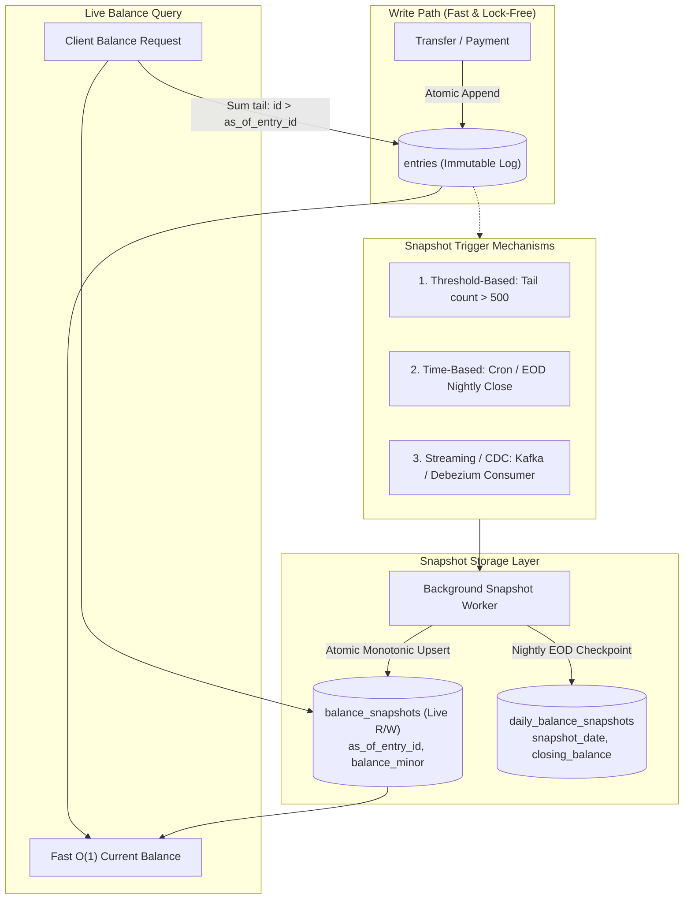
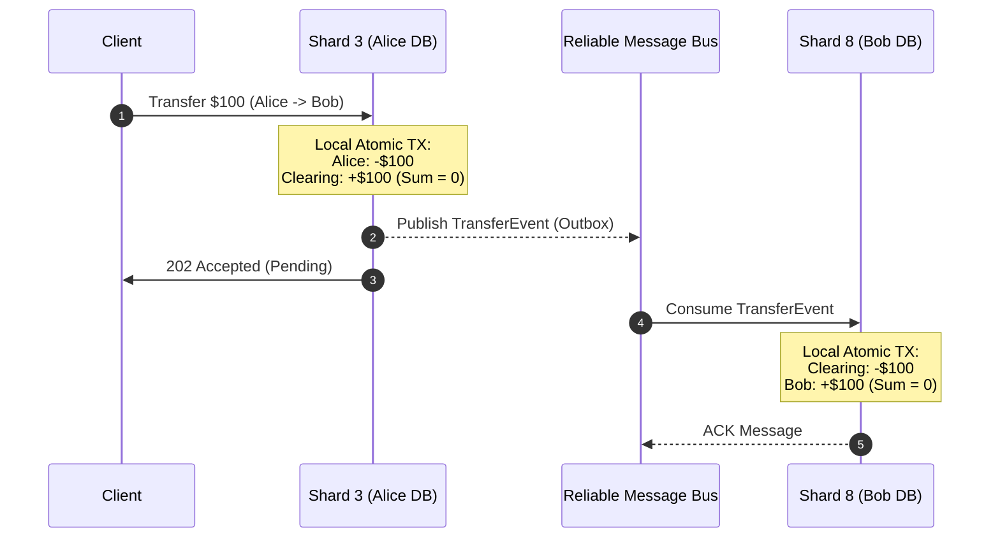

# 53. Bank Ledger Concurrency & Locking — Key Takeaways

> **Parent**: [System Design Interview Reference](../index.md)
> **Source**: [Coinbase Interview Question — Building a Bank Ledger: Concurrency, Locks, and Race Conditions](../../articles/concurrency-transactions/coinbase-building-bank-ledger-concurrency-locks.md) — Emily, 2026

> **Also see**: [Concurrency & Transactions](concurrency-transactions.md) (tx-01–tx-07), [Transaction Patterns](transaction-patterns.md) (tx-08–tx-12), [Payment Race Condition](29-tx-key-takeaways.md) (tx-21–tx-24), [Idempotency & Deduplication](idempotency-deduplication-distributed-systems-takeaways.md) (tx-53–tx-58), [CQRS for Fintech](../cqrs-fintech/cqrs-fintech.md)
> **Dictionary**: [Append-Only Ledger](../../reference-dictionary/data-concurrency.md#append-only-ledger), [Lost Update](../../reference-dictionary/data-concurrency.md#lost-update), [Lock Ordering](../../reference-dictionary/data-concurrency.md#lock-ordering), [Wait-For Graph](../../reference-dictionary/data-concurrency.md#wait-for-graph), [Atomic Conditional Update](../../reference-dictionary/data-concurrency.md#atomic-conditional-update), [Optimistic Locking](../../reference-dictionary/data-concurrency.md#optimistic-locking), [Pessimistic Locking](../../reference-dictionary/data-concurrency.md#pessimistic-locking), [Idempotency Key](../../reference-dictionary/cqrs-event-driven.md#idempotency-key), [Ledger (Double-Entry)](../../reference-dictionary/fintech.md#ledger-double-entry), [Clearing Account](../../reference-dictionary/fintech.md#clearing-account), [Balance Snapshot](../../reference-dictionary/fintech.md#balance-snapshot)
> **Taxonomy Reference**: §2.3 Concurrency & Asynchronous Processing

---

## Contents

| ID | Problem | Key Concept |
|:---|:---|:---|
| [tx-59](#tx-59) | Concurrency failures in financial ledgers are conflated into a single ambiguous problem | Disentangle concurrency into three orthogonal races: lost updates, deadlocks, and duplicate spends |
| [tx-60](#tx-60) | Wrapping read-modify-write inside standard transactions fails to prevent lost updates | Transactions provide atomicity, not mutual exclusion; atomic conditional updates eliminate the read window |
| [tx-61](#tx-61) | Bidirectional pessimistic row locking causes circular wait-for deadlocks under load | Enforce strict universal lock ordering across all transactions to make wait-for cycles mathematically impossible |
| [tx-62](#tx-62) | Optimistic concurrency control (OCC) suffers severe retry storms on hot accounts | OCC is optimal under low contention but degrades catastrophically into CPU and connection exhaustion on hot rows |
| [tx-63](#tx-63) | Mutable balance columns create inherent race conditions, update contention, and audit loss | Append-only double-entry ledger: record signed entry pairs and derive balances, eliminating lost updates by construction |
| [tx-64](#tx-64) | Aggregating millions of append-only ledger entries introduces read latency bottlenecks | Periodically advance balance snapshots as read optimizations while retaining entries as the sole source of truth |
| [tx-65](#tx-65) | Network retries trigger duplicate debits despite correct row-level locking | Use unique database constraints on `(client_id, idempotency_key)` to serialize retries and return cached results |
| [tx-66](#tx-66) | Cross-shard ledger transfers break single-database atomicity and double-entry invariants | Use intermediate in-flight Clearing Accounts in distributed Sagas so double-entry zero-sum invariants hold continuously |

---

## tx-59: Concurrency as Three Distinct Failure Modes

> **Source**: [Coinbase Interview Question — Building a Bank Ledger: Concurrency, Locks, and Race Conditions](../../articles/concurrency-transactions/coinbase-building-bank-ledger-concurrency-locks.md)

| | |
|:---|:---|
| **Problem** | Engineering teams treat "concurrency" as a monolithic issue with a single generic fix (e.g., throwing distributed locks or bigger transactions at the problem), leading to misapplied solutions. |
| **Root cause** | Concurrency in transaction systems manifests as three distinct failure modes with independent causal mechanisms: lost updates (state overwrites), deadlocks (circular waits), and double spends (identity/retry ambiguity). |

**Strategy**: Classify and solve each failure mode with its dedicated, precise architectural primitive:

```text
┌──────────────────────────────────────────────────────────────────────────┐
│                      Three Distinct Ledger Races                         │
├───────────────────────┬─────────────────────────┬────────────────────────┤
│ 1. Lost Update        │ 2. Deadlock             │ 3. Double Spend        │
│ (State Overwrite)     │ (Circular Wait)         │ (Identity Ambiguity)   │
├───────────────────────┼─────────────────────────┼────────────────────────┤
│ Cause: Concurrent     │ Cause: Out-of-order     │ Cause: Network timeout │
│ read-modify-write     │ multi-resource locks    │ & client retry         │
│ Fix: Locks / Atomic   │ Fix: Universal total    │ Fix: Idempotency keys  │
│ conditional UPDATE    │ lock ordering (proof)   │ & unique constraints   │
└───────────────────────┴─────────────────────────┴────────────────────────┘
```

**Tradeoff**: Demands clear problem decomposition during system design rather than reaching for blanket infrastructure solutions (like global Redis locks) that add unnecessary latency and single points of failure.

> **Dictionary**: [Lost Update](../../reference-dictionary/data-concurrency.md#lost-update), [Lock Ordering](../../reference-dictionary/data-concurrency.md#lock-ordering), [Idempotency Key](../../reference-dictionary/cqrs-event-driven.md#idempotency-key)
> **Azure**: Azure SQL Transaction Isolation Levels; Azure Cosmos DB conditional operations

---

## tx-60: The Transaction Isolation Illusion & Atomic Conditional Updates

> **Source**: [Coinbase Interview Question — Building a Bank Ledger: Concurrency, Locks, and Race Conditions](../../articles/concurrency-transactions/coinbase-building-bank-ledger-concurrency-locks.md)

| | |
|:---|:---|
| **Problem** | Wrapping a read-modify-write balance update (`SELECT balance` → calculate in code → `UPDATE balance`) in `BEGIN` and `COMMIT` still permits lost updates and balance corruption in production. |
| **Root cause** | Default isolation levels (such as PostgreSQL's `READ COMMITTED`) guarantee atomicity and prevent dirty reads, but do **not** provide mutual exclusion. Concurrent transactions legally read the same starting balance and overwrite each other's writes. |

**Strategy**: Replace the separate read and write steps with a single-statement **Atomic Conditional Update**. The database performs the balance check and row mutation inside an internal row lock in one atomic step:

```sql
-- Atomic conditional balance deduction
UPDATE accounts
   SET balance_minor = balance_minor - :amount
 WHERE id = :from_account_id
   AND balance_minor >= :amount;
```

If the affected row count is `1`, the balance was deducted atomically. If the row count is `0`, the account had insufficient funds. No application-level balance read or explicit lock is required.

**Tradeoff**:
- **Pros**: Zero read-window race condition; single database round trip; row lock duration is minimized to single-statement execution time.
- **Cons**: Does not accommodate multi-step pre-flight validations (e.g., complex compliance checks, fraud scoring) that must read and hold state before mutating.

> **Dictionary**: [Atomic Conditional Update](../../reference-dictionary/data-concurrency.md#atomic-conditional-update), [Isolation Levels](../../reference-dictionary/data-concurrency.md#isolation-levels), [Lost Update](../../reference-dictionary/data-concurrency.md#lost-update)
> **Azure**: Azure SQL `UPDATE ... WHERE`, Cosmos DB Patch API with filter predicates

---

## tx-61: Deadlock Elimination via Strict Universal Lock Ordering

> **Source**: [Coinbase Interview Question — Building a Bank Ledger: Concurrency, Locks, and Race Conditions](../../articles/concurrency-transactions/coinbase-building-bank-ledger-concurrency-locks.md)

| | |
|:---|:---|
| **Problem** | When pessimistic row locking (`SELECT ... FOR UPDATE`) is used for multi-account transfers, concurrent transfers in opposite directions (Alice $\to$ Bob vs. Bob $\to$ Alice) deadlock, triggering transaction aborts and latency spikes. |
| **Root cause** | `WHERE id IN (:from, :to) FOR UPDATE` acquires locks in arbitrary physical scan order. Two transactions acquiring the same pair of locks in reverse order create a cycle in the database's wait-for graph ($T_1 \to \text{holds } A, \text{waits for } B$; $T_2 \to \text{holds } B, \text{waits for } A$). |

**Strategy**: Enforce a universal total order on lock acquisition (e.g., sorting all account IDs in ascending numerical order) across every codebase, batch job, and administrative script:

```java
// Total lock ordering enforced in application logic
List<Long> lockedAccountIds = Stream.of(fromAccountId, toAccountId)
                                   .sorted()
                                   .toList();

for (Long accountId : lockedAccountIds) {
    accountDao.acquireExclusiveLock(accountId); // SELECT ... WHERE id = ? FOR UPDATE
}
```

```text
Lock Acquisition Total Order (Ascending ID):
  Transfer 1 (Acc 3 -> Acc 7): Locks Acc 3 first ──> then Locks Acc 7
  Transfer 2 (Acc 7 -> Acc 3): Locks Acc 3 first ──> then Locks Acc 7
  Result: Transfer 2 waits for Transfer 1 cleanly. No cycle in wait-for graph possible!
```

**Tradeoff**:
- **Pros**: Mathematical impossibility of deadlocks (not just probabilistic mitigation).
- **Cons**: Serializes all transactions touching a hot account (e.g., a viral merchant account), bounding throughput to $1 / \text{transaction\_duration}$.

> **Dictionary**: [Lock Ordering](../../reference-dictionary/data-concurrency.md#lock-ordering), [Wait-For Graph](../../reference-dictionary/data-concurrency.md#wait-for-graph), [Pessimistic Locking](../../reference-dictionary/data-concurrency.md#pessimistic-locking)
> **Azure**: Azure SQL `WITH (XLOCK, ROWLOCK)` ordered queries

---

## tx-62: Hot-Row Contention Cascades in Optimistic Locking

> **Source**: [Coinbase Interview Question — Building a Bank Ledger: Concurrency, Locks, and Race Conditions](../../articles/concurrency-transactions/coinbase-building-bank-ledger-concurrency-locks.md)

| | |
|:---|:---|
| **Problem** | Optimistic Concurrency Control (OCC) using version columns (`UPDATE ... WHERE id = :id AND version = :v`) causes severe latency spikes, CPU saturation, and connection pool exhaustion when applied to high-traffic accounts. |
| **Root cause** | On a hot row (e.g., merchant account during flash sales), $N$ concurrent transactions read version $V$. Exactly one commits (advancing to $V+1$), while the remaining $N-1$ transactions fail, retry, re-read $V+1$, and collide again, triggering a self-amplifying retry storm. |

**Strategy**: Apply OCC strictly based on contention characteristics rather than as a universal pattern:

| Metric / Scenario | Optimistic Locking (OCC) | Pessimistic Locking (`FOR UPDATE`) | Append-Only Ledger |
|:---|:---|:---|:---|
| **Best suited for** | Low contention (personal checking accounts) | Multi-step logic with moderate contention | High-volume hot accounts & core ledgers |
| **Failure behavior** | Retry storms; CPU & connection thrashing | Queued waiting; deterministic latency | Zero lock contention; concurrent inserts |
| **Lock overhead** | Zero lock acquisition cost | Row locks held for transaction duration | Zero row-update locks |

**Tradeoff**: OCC is efficient and non-blocking for distributed low-contention reads, but must be paired with exponential backoff + jitter and capped retry limits, or replaced by append-only ledgers for high-contention accounts.

> **Dictionary**: [Optimistic Locking](../../reference-dictionary/data-concurrency.md#optimistic-locking), [Lock Contention](../../reference-dictionary/data-concurrency.md#lock-contention), [Append-Only Ledger](../../reference-dictionary/data-concurrency.md#append-only-ledger)
> **Azure**: Cosmos DB ETag conditional updates (`If-Match`); Azure Table Storage ETag optimistic concurrency

---

## tx-63: Append-Only Double-Entry Ledgers (Eliminating Updates by Construction)

> **Source**: [Coinbase Interview Question — Building a Bank Ledger: Concurrency, Locks, and Race Conditions](../../articles/concurrency-transactions/coinbase-building-bank-ledger-concurrency-locks.md)

| | |
|:---|:---|
| **Problem** | Maintaining a mutable `balance` column on account records inherently creates update bottlenecks, lock contention, and vulnerability to lost updates. |
| **Root cause** | In-place updates force write-write serialization. Because updates mutate past state, historical balance auditing requires separate logging mechanisms that can fall out of sync. |

**Strategy**: Eliminate the mutable balance column entirely. Design the ledger as an **append-only event log** using double-entry bookkeeping. Every transfer inserts a transfer record and two signed entry rows that sum to zero:

```sql
BEGIN;

-- 1. Insert transfer metadata with uniqueness constraint
INSERT INTO transfers (id, idempotency_key, from_account, to_account, amount_minor, state)
VALUES (:tid, :key, :from, :to, :amt, 'POSTED');

-- 2. Insert balanced entry pair (Sender Debit, Receiver Credit)
INSERT INTO entries (transfer_id, account_id, amount_minor) VALUES
    (:tid, :from, -:amt),
    (:tid, :to,   +:amt);

COMMIT;
```

The account balance is derived dynamically via aggregation:
$$\text{Current Balance} = \sum \text{amount\_minor} \quad \text{WHERE account\_id} = :id$$

**Invariants and Guarantees**:
1. **Lost updates are impossible by construction**: You cannot lose an update if you never update.
2. **Deadlocks on balances are eliminated**: `INSERT` operations do not block other concurrent inserts.
3. **Full auditability**: Past state is immutable and verifiable via continuous zero-sum corruption checks:
   ```sql
   SELECT transfer_id FROM entries GROUP BY transfer_id HAVING SUM(amount_minor) <> 0;
   ```

**Tradeoff**:
- **Pros**: Complete immutability; high concurrent write throughput; zero update locks.
- **Cons**: `SUM()` across large entry tables degrades read performance over time (solved by balance snapshots); overdraft prevention requires explicit reservation/hold entries.

> **Dictionary**: [Append-Only Ledger](../../reference-dictionary/data-concurrency.md#append-only-ledger), [Ledger (Double-Entry)](../../reference-dictionary/fintech.md#ledger-double-entry), [Lost Update](../../reference-dictionary/data-concurrency.md#lost-update)
> **Azure**: Azure SQL Ledger (immutable ledger tables & cryptographic verification); Azure Cosmos DB analytical store

---

## tx-64: Periodic Balance Snapshots for Derived State Acceleration

> **Source**: [Coinbase Interview Question — Building a Bank Ledger: Concurrency, Locks, and Race Conditions](../../articles/concurrency-transactions/coinbase-building-bank-ledger-concurrency-locks.md)

| | |
|:---|:---|
| **Problem** | Calculating account balances by querying `SELECT SUM(amount_minor) FROM entries` becomes unacceptably slow as an account accumulates millions of entries over months and years. |
| **Root cause** | Full-table scans and aggregations scale linearly ($O(N)$) with entry count, creating read latency bottlenecks for frequent balance checks and dashboard queries. |

**Strategy**: Periodically materialize point-in-time balance snapshots. To fetch the current balance, query the snapshot and sum only the small un-aggregated "tail" of entries created after the snapshot's anchor entry:

```sql
-- Schema for point-in-time snapshot
CREATE TABLE balance_snapshots (
    account_id      BIGINT PRIMARY KEY,
    as_of_entry_id  BIGINT NOT NULL,
    balance_minor   BIGINT NOT NULL,
    updated_at      TIMESTAMPTZ NOT NULL
);

-- Fast O(1) balance query: Snapshot + Tail Sum
SELECT s.balance_minor + COALESCE(SUM(e.amount_minor), 0) AS current_balance
  FROM balance_snapshots s
  LEFT JOIN entries e
    ON e.account_id = s.account_id
   AND e.id > s.as_of_entry_id
 WHERE s.account_id = :id
 GROUP BY s.balance_minor;
```

**Core Safety Principle**:
The snapshot is **strictly an optimization, not the source of truth**. If a snapshot is corrupt, stale, or lost, the exact authoritative balance is 100% reconstructible from the immutable append-only ledger entries.

### How Balance Snapshots Are Maintained in Practice



#### 1. Trigger Strategies
- **Volume / Threshold-Based**: An asynchronous worker evaluates active accounts and triggers a snapshot when the number of unaggregated tail entries exceeds a threshold (e.g., $N > 500$ entries). This ensures high-velocity accounts (like merchant accounts) are checkpointed frequently.
- **Time-Based (Periodic & EOD)**: Scheduled batch jobs (e.g., hourly sweeps or midnight End-of-Day EOD accounting jobs) scan accounts with active entries since the last checkpoint.
- **Streaming / CDC-Driven**: A Change Data Capture pipeline (e.g., Debezium streaming from PostgreSQL WAL into Kafka) reads appended entries and buffers micro-batches to update snapshot tables asynchronously without impacting write latency.

#### 2. Atomic, Monotonic Snapshot Upsert
Background workers compute the delta after `as_of_entry_id` and advance the snapshot monotonically, ensuring safe concurrent worker execution:

```sql
-- Step 1: Calculate the new snapshot point from the previous anchor
WITH new_checkpoint AS (
    SELECT e.account_id,
           COALESCE(s.balance_minor, 0) + SUM(e.amount_minor) AS new_balance,
           MAX(e.id) AS new_as_of_entry_id
      FROM entries e
      LEFT JOIN balance_snapshots s ON s.account_id = e.account_id
     WHERE e.account_id = :account_id
       AND e.id > COALESCE(s.as_of_entry_id, 0)
     GROUP BY e.account_id, s.balance_minor, s.as_of_entry_id
    HAVING COUNT(e.id) > 0
)
-- Step 2: Idempotent monotonic upsert (only advance forward)
INSERT INTO balance_snapshots (account_id, as_of_entry_id, balance_minor, updated_at)
SELECT account_id, new_as_of_entry_id, new_balance, NOW()
  FROM new_checkpoint
ON CONFLICT (account_id) DO UPDATE
SET as_of_entry_id = EXCLUDED.as_of_entry_id,
    balance_minor  = EXCLUDED.balance_minor,
    updated_at     = EXCLUDED.updated_at
WHERE EXCLUDED.as_of_entry_id > balance_snapshots.as_of_entry_id;
```

#### 3. Rolling vs. Historical EOD Snapshots
- **Rolling Operational Snapshot (`balance_snapshots`)**: A single mutable record per account updated continuously to keep live API balance queries strictly bounded to $O(1)$ latency.
- **Historical Daily Snapshots (`daily_balance_snapshots`)**: Immutable historical records created at midnight EOD (`account_id, snapshot_date, closing_balance_minor, eod_entry_id`). These power accounting audits, monthly statements, and historical time-travel queries without re-scanning years of raw entries.

**Tradeoff**: Requires a background snapshotting worker to periodically checkpoint active accounts, but keeps read queries bounded at constant time ($O(1)$) without compromising auditability.

> **Dictionary**: [Balance Snapshot](../../reference-dictionary/fintech.md#balance-snapshot), [Append-Only Ledger](../../reference-dictionary/data-concurrency.md#append-only-ledger)
> **Azure**: Azure Functions Timer Trigger for snapshot generation; Azure SQL indexed views; Azure Event Hubs / Kafka for CDC streaming

---

## tx-65: Database Unique Constraint as Natural Concurrency Serializer

> **Source**: [Coinbase Interview Question — Building a Bank Ledger: Concurrency, Locks, and Race Conditions](../../articles/concurrency-transactions/coinbase-building-bank-ledger-concurrency-locks.md)

| | |
|:---|:---|
| **Problem** | Network timeouts during payment processing cause clients to retry transfers, leading to duplicate charges even when database transactions and row locks are functioning correctly. |
| **Root cause** | Duplicate retries are an **identity and messaging problem**, not a row-locking problem. Without request-level deduplication, each retry is treated as an independent, legitimate transfer request. |

**Strategy**: Scope idempotency keys to callers with a compound unique database constraint: `UNIQUE (api_client_id, idempotency_key)`. Let the database's native unique index serve as the serialization and deduplication gate:

```sql
CREATE TABLE transfers (
    id               UUID PRIMARY KEY,
    api_client_id    VARCHAR(64) NOT NULL,
    idempotency_key  TEXT NOT NULL,
    ...
    CONSTRAINT uq_client_idempotency UNIQUE (api_client_id, idempotency_key)
);
```

```java
// Idempotency handler catching constraint violations
try {
    return ledgerService.postTransfer(clientId, idempotencyKey, from, to, amount);
} catch (UniqueConstraintViolationException e) {
    // Return the ORIGINAL outcome rather than an error code
    return ledgerService.getTransferByIdempotencyKey(clientId, idempotencyKey);
}
```

**Key Execution Nuance**:
When two identical requests arrive simultaneously, the second insert **blocks on the database unique index** until the first transaction commits or rolls back. If the first commits, the second fails with a constraint violation and safely reads the committed result. If the first aborts, the second proceeds and completes the transfer.

**Tradeoff**:
- **Pros**: Zero extra distributed infrastructure (no external Redis lock manager needed); transactional consistency is guaranteed by the database engine.
- **Cons**: Requires clean handling of in-flight/pending states if asynchronous settlement is decoupled from initial transfer creation.

> **Dictionary**: [Idempotency Key](../../reference-dictionary/cqrs-event-driven.md#idempotency-key), [Retry Identity](../../reference-dictionary/fintech.md#retry-identity)
> **Azure**: Azure SQL `UNIQUE` constraints with index options; Cosmos DB unique key policies

---

## tx-66: Clearing Accounts for Cross-Shard Double-Entry Balancing

> **Source**: [Coinbase Interview Question — Building a Bank Ledger: Concurrency, Locks, and Race Conditions](../../articles/concurrency-transactions/coinbase-building-bank-ledger-concurrency-locks.md)

| | |
|:---|:---|
| **Problem** | In a horizontally partitioned/sharded banking architecture, payer (Account A on Shard 3) and payee (Account B on Shard 8) reside on separate database nodes, eliminating single-database ACID transaction guarantees. |
| **Root cause** | Traditional Two-Phase Commit (2PC) creates blocking distributed locks and coordinator single points of failure. Conversely, naive asynchronous Sagas leave money "in limbo" between steps, violating double-entry balance invariants. |

**Strategy**: Introduce a dedicated **In-Flight Clearing Account** into the double-entry ledger. Split the transfer into two local, atomic double-entry steps within an asynchronous Saga:

```text
Cross-Shard Transfer Workflow (Sender Shard 3 -> Receiver Shard 8):

  Step 1 (Local TX on Shard 3):
    Alice Account:            - $100.00
    Transit Clearing Account: + $100.00
    ───────────────────────────────────
    Net Shard 3 Sum:            $0.00   ✅ (Invariant Preserved)

  Step 2 (Local TX on Shard 8 via Message / Saga):
    Transit Clearing Account: - $100.00
    Bob Account:              + $100.00
    ───────────────────────────────────
    Net Shard 8 Sum:            $0.00   ✅ (Invariant Preserved)
```



**Benefits**:
1. **Continuous zero-sum balance invariant**: At every millisecond and partial state, the sum of all debits and credits across the institution is exactly zero.
2. **Auditable in-flight money**: In-flight money is not an invisible transient state—it is a concrete balance in the clearing account that can be monitored, alerted on, and reconciled.
3. **No distributed locking**: Each step is an isolated local database write, maintaining high throughput across shards.

**Tradeoff**: Requires robust reconciliation jobs to monitor clearing account balances trending away from zero and trigger automated compensations if Step 2 permanently stalls.

> **Dictionary**: [Clearing Account](../../reference-dictionary/fintech.md#clearing-account), [Ledger (Double-Entry)](../../reference-dictionary/fintech.md#ledger-double-entry), [Saga Pattern](../../reference-dictionary/data-concurrency.md#saga-pattern), [Reconciliation](../../reference-dictionary/fintech.md#reconciliation)
> **Azure**: Azure Service Bus (transactional message outbox between Azure SQL shards); Azure Event Grid
