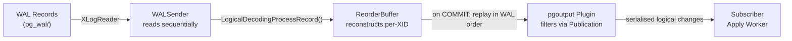
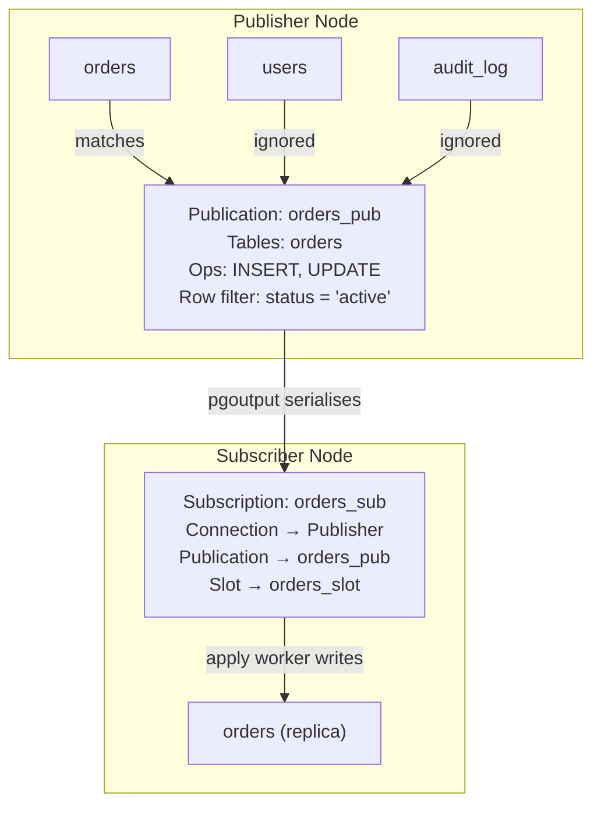

# 35. PostgreSQL Logical Replication Internals — Key Takeaways

> **Parent**: [System Design Interview Reference](../index.md)
> **Source**: [Understanding PostgreSQL Logical Replication: The Complete End-to-End Flow](../../articles/databases/postgresql-logical-replication-end-to-end-flow.md)
> **Author**: Nadeem Khan (NK), published 2026-02-14
> **Purpose**: Extract the WAL-based CDC state machine, replication slot lifecycle management, and publication/subscription model from this PostgreSQL internals deep-dive.

> **Also see**: [Database Decisions](database-decisions.md) (db-08–db-17), [Query Performance](query-performance.md) (db-01–db-07)
> **Dictionary**: [Write-Ahead Log (WAL)](../../reference-dictionary/databases.md#write-ahead-log), [Change Data Capture (CDC)](../../reference-dictionary/data-concurrency.md#change-data-capture), [Logical Replication](../../reference-dictionary/data-architecture.md#logical-replication), [Replication Slot](../../reference-dictionary/data-architecture.md#replication-slot)
> **Taxonomy Reference**: §3.3 Data Architecture

---

## Contents

| ID | Problem | Key Concept |
|:---|:---|:---|
| [`db-28`](#db-28-wal-based-cdc--the-logical-decoding-state-machine) | CDC consumers treat replication as a black box, making production lag and WAL bloat un-debuggable | WAL → ReorderBuffer → pgoutput pipeline: understand each stage of the state machine |
| [`db-29`](#db-29-replication-slot-lifecycle--wal-retention-pressure) | Unmonitored replication slots silently accumulate WAL until disk exhaustion on the primary | Track confirmed_flush_lsn, restart_lsn, and catalog_xmin; minimize the lag gap |
| [`db-30`](#db-30-publicationsubscription-model-for-selective-cdc) | Full-database replication is wasteful; you need table-level, operation-level selectivity | Publications define WHAT to replicate; subscriptions define WHERE it goes |

---

## db-28: WAL-Based CDC — The Logical Decoding State Machine

| | |
|:---|:---|
| **Problem** | Teams enable logical replication without understanding the internal state machine. When replication lags or WAL accumulates, there's no mental model to debug it — every outage becomes a firefight. |
| **Root cause** | Logical decoding is treated as a configuration toggle rather than a pipeline with distinct stages, each with its own failure modes. |

**The Logical Decoding Pipeline (5 stages)**:

**Stage-by-stage breakdown**:

1. **WAL Generation**: Every INSERT/UPDATE/DELETE writes a WAL record. At COMMIT, WAL is flushed to disk — only then is the transaction durable. Data pages remain in shared buffers and are written later by checkpointer/background writer.
2. **WALSender**: A dedicated backend process reads WAL records sequentially from `pg_wal/` using XLogReader, starting at the slot's `confirmed_flush_lsn`. All records are read — filtering happens later.
3. **ReorderBuffer**: WAL records are physically ordered by LSN but interleaved across concurrent transactions. The ReorderBuffer reconstructs per-transaction change sets using a hash table keyed by XID. Only when the COMMIT record arrives are all buffered changes released in WAL order.
4. **pgoutput (Output Plugin)**: The publication metadata is loaded at session start. As each committed transaction is decoded, pgoutput filters changes by table, operation type (INSERT/UPDATE/DELETE/TRUNCATE), column lists, and row-level filters.
5. **Subscriber Apply Worker**: Receives deserialised messages, executes equivalent DML locally, writes to its own heap/WAL, and uses a **replication origin** to prevent infinite loops in bidirectional setups.

**Key insight**: Logical decoding operates at two granularities — **record-by-record** while parsing WAL, and **transaction-by-transaction** when emitting changes. You cannot debug slot lag without understanding which stage is the bottleneck.

| | |
|:---|:---|
| **Tradeoff** | Logical decoding adds CPU and memory overhead on the primary (ReorderBuffer spills to disk if `logical_decoding_work_mem` is exceeded). The benefit is row-level CDC without triggers or polling — the WAL is already there, you're just reading it differently. |

> **Cross-reference**: [Change Data Capture §db-17](database-decisions.md#db-17-change-data-capture-cdc) | **Dictionary**: [Write-Ahead Log](../../reference-dictionary/databases.md#write-ahead-log), [Logical Replication](../../reference-dictionary/data-architecture.md#logical-replication) | **Azure**: [Azure Database for PostgreSQL — Logical Replication](https://learn.microsoft.com/en-us/azure/postgresql/flexible-server/concepts-logical)

---

## db-29: Replication Slot Lifecycle — WAL Retention Pressure

| | |
|:---|:---|
| **Problem** | A subscriber goes down or falls behind. Days later, the primary runs out of disk space — the replication slot silently prevented WAL recycling, and no alert fired. |
| **Root cause** | The gap between `restart_lsn` (oldest WAL needed for safe decoding) and `confirmed_flush_lsn` (highest LSN the subscriber has durably acknowledged) grows without bound when the subscriber stalls. |

**The Three LSNs That Govern Slot Behavior**:

| LSN | Meaning | Who Advances It |
|:---|:---|:---|
| `confirmed_flush_lsn` | Highest LSN the subscriber has acknowledged as durably flushed | Subscriber (via feedback messages) |
| `restart_lsn` | Earliest WAL position still required to safely decode in-progress transactions | Publisher (recalculated after feedback) |
| `catalog_xmin` | Oldest catalog transaction ID that must be retained for schema visibility | Publisher (slot metadata) |

**The retention contract**:
- Decoding starts from `confirmed_flush_lsn`
- WAL retention is governed by `restart_lsn`
- PostgreSQL **will not remove** WAL segments required by any slot
- WAL older than `restart_lsn` can be safely recycled

**Production rule**: The goal is to **minimize the gap between `restart_lsn` and `confirmed_flush_lsn`**. The difference represents WAL that must be retained for the slot — a large gap directly translates to disk pressure on the primary.

**Feedback loop mechanics**: After applying changes and flushing its local WAL, the subscriber periodically sends a feedback message containing its highest flushed LSN. The publisher updates `confirmed_flush_lsn` and recalculates `restart_lsn`. This closes the durability loop.

| | |
|:---|:---|
| **Tradeoff** | Replication slots guarantee exactly-once delivery and crash-safe resume, but they create a **hard dependency** — if the subscriber disappears without dropping the slot, WAL accumulates indefinitely. In production, you must monitor `pg_replication_slots` and alert on growing `pg_wal` size. |

> **Cross-reference**: [Scaling Reads — Read Replicas §db-11](database-decisions.md#db-11-scaling-reads--read-replicas--caching), [PACELC Theorem — Sync vs Async §db-26](../34-db-key-takeaways.md#db-26-synchronous-vs-asynchronous-replication--consistency-vs-latency) | **Dictionary**: [Replication Slot](../../reference-dictionary/data-architecture.md#replication-slot) | **Azure**: [Azure Database for PostgreSQL — Read Replicas](https://learn.microsoft.com/en-us/azure/postgresql/flexible-server/concepts-read-replicas)

---

## db-30: Publication/Subscription Model for Selective CDC

| | |
|:---|:---|
| **Problem** | You need to stream only specific tables and operations (e.g., `orders` INSERT + UPDATE only) to a downstream system, but full-database replication is too expensive and noisy. |
| **Root cause** | Without a filtering mechanism, every committed row change is decoded and transmitted — wasting network bandwidth, subscriber CPU, and storage on irrelevant data. |

**The Publication/Subscription Decoupling**:

**Publication** (stored in `pg_publication`, `pg_publication_rel`, `pg_publication_namespace`):
- Defines **which tables** are eligible for replication
- Filters by **operation type** (INSERT, UPDATE, DELETE, TRUNCATE)
- Supports optional **row-level filters** and **column lists**
- Requires **Replica Identity** (default: Primary Key) for UPDATE/DELETE to identify rows

**Subscription** (stored in `pg_subscription`, `pg_subscription_rel`):
- Defines **connection details** to the publisher
- Specifies **which publication(s)** to consume
- Manages the **replication slot** lifecycle
- Tracks per-table synchronisation state during initial copy and streaming

**Initial synchronisation**: When `CREATE SUBSCRIPTION` runs, PostgreSQL takes a consistent snapshot, copies table data via COPY, and creates the replication slot. Because the snapshot is tied to a specific LSN, no rows are missed and none are duplicated — changes after the snapshot are captured in WAL for streaming.

| | |
|:---|:---|
| **Tradeoff** | Publications give you surgical control over what gets replicated, but they introduce a **schema contract** — if you add a column to a published table without updating the publication, the new column is silently dropped in transit. Replica Identity configuration is mandatory for UPDATE/DELETE and choosing FULL (entire row) creates WAL bloat on the primary. |

> **Cross-reference**: [CQRS with SQL §sqld-03](sql-system-design.md#sqld-03-cqrs-with-sql), [Change Data Capture §db-17](database-decisions.md#db-17-change-data-capture-cdc) | **Dictionary**: [Change Data Capture](../../reference-dictionary/data-concurrency.md#change-data-capture) | **Azure**: [Azure Database for PostgreSQL — Logical Replication and CDC](https://learn.microsoft.com/en-us/azure/postgresql/flexible-server/concepts-logical)
