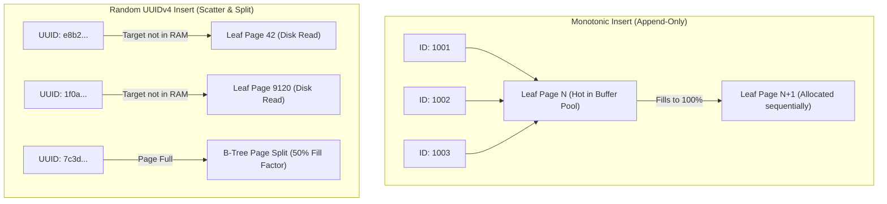
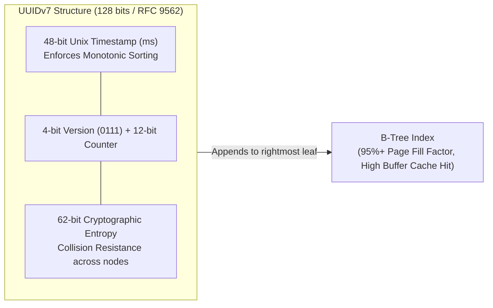
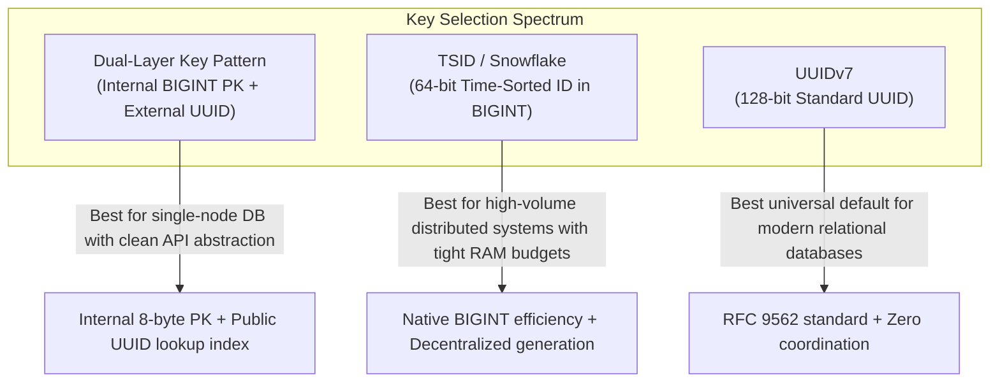

# 36. Database ID Architecture & Key Selection — Key Takeaways

> **Parent**: [System Design Interview Reference](../index.md)  
> **Source**: [The Database Architecture Trap Almost Everyone Falls For](../../articles/databases/the-database-architecture-trap-almost-everyone-falls-for.md)  
> **Author**: Cloud With Azeem, published 2026-08-08  
> **Purpose**: Extract B-tree index fragmentation mechanics, buffer pool churn dynamics, and time-ordered primary key strategies (UUIDv7, ULID, TSID) from this database architecture analysis.  

> **Also see**: [Database ID Strategy](database-id-strategy.md) (`db-18`), [Query Performance](query-performance.md) (`db-01`–`db-07`), [Database Decisions](database-decisions.md) (`db-08`–`db-17`)  
> **Dictionary**: [B-Tree](../../reference-dictionary/databases.md#b-tree), [B-Tree Page Split](../../reference-dictionary/databases.md#b-tree-page-split), [Buffer Pool](../../reference-dictionary/databases.md#buffer-pool), [UUIDv7](../../reference-dictionary/databases.md#uuidv7), [UUIDv4](../../reference-dictionary/databases.md#uuidv4), [ULID](../../reference-dictionary/databases.md#ulid), [TSID](../../reference-dictionary/databases.md#tsid)  
> **Azure Services**: [Azure Database for PostgreSQL Flexible Server](../../architecture-azure/data/), [Azure SQL Database](../../architecture-azure/data/), [Azure Cosmos DB](../../architecture-azure/data/)  
> **Taxonomy Reference**: §3.3 Data Architecture  

---

## Contents

| ID | Problem | Key Concept |
|:---|:---|:---|
| [`db-31`](#db-31-random-uuidv4-clustered-index-fragmentation--page-splits) | Defaulting to random UUIDv4 for primary keys causes multi-second query spikes and massive I/O once data exceeds RAM | Random key distribution forces random disk reads and continuous B-tree leaf page splits |
| [`db-32`](#db-32-time-ordered-key-architecture-uuidv7--ulid-for-b-tree-locality) | Applications need decentralized ID generation and security without paying the B-tree fragmentation penalty | Time-ordered keys (UUIDv7/ULID) embed millisecond timestamps in leading bits to restore append-only locality |
| [`db-33`](#db-33-compact-64-bit-identifiers-tsidsnowflake-vs-128-bit-uuid-trade-offs) | High-volume tables suffer secondary index and foreign key storage bloat when using 128-bit identifiers | 64-bit TSID / Snowflake provides time-sorted locality and fits in native `BIGINT` (8 bytes) |

---

## db-31: Random UUIDv4 Clustered Index Fragmentation & Page Splits

| | |
|:---|:---|
| **Problem** | A relational database performing sub-15ms primary key lookups suddenly degrades to multi-second latency (>3,800ms) with tens of thousands of disk reads per query as the table grows. |
| **Root cause** | Using cryptographically random UUIDv4 as a clustered primary key scatters inserts across the entire B-tree. Once the index exceeds the Buffer Pool / `shared_buffers` in RAM, every insert and lookup triggers cache misses and expensive B-tree page splits. |



### Architectural Breakdown:
1. **B-Tree Page Splitting**: When an insert hits a full 8 KB/16 KB leaf page, the engine splits the page in half, moving 50% of the rows to a new page and modifying parent branch nodes. This reduces average fill factor to ~50–60%, doubling disk footprint.
2. **Buffer Pool Pollution**: Working set ceases to be the "recent data" and expands to the entire index space across all historical rows, evicting warm cached data.
3. **Secondary Index Amplification**: In clustered storage engines (MySQL InnoDB, SQL Server), every secondary index record stores a copy of the primary key, multiplying index storage and RAM requirements across all indexed columns.

**Strategy**: Stop using UUIDv4 for clustered primary keys in relational database tables where dataset size will exceed available RAM.

**Tradeoff**: UUIDv4 is effortless to generate in application code without coordination, but imposes a severe storage, memory, and I/O penalty under scale.

```json
{
  "id": "db-31",
  "category": "Databases & Indexing",
  "pattern": "B-Tree Page Split & Buffer Pool Churn Mitigation",
  "problem": "Random UUIDv4 primary keys cause severe index fragmentation, buffer pool churn, and multi-second query degradation.",
  "strategy": "Avoid UUIDv4 for clustered primary keys; reserve random UUIDs for unindexed correlation IDs or non-clustered attributes.",
  "tradeoff": "Immediate simplicity of random generation vs severe long-term disk I/O and RAM overhead."
}
```

---

## db-32: Time-Ordered Key Architecture (UUIDv7 / ULID) for B-Tree Locality

| | |
|:---|:---|
| **Problem** | Distributed microservices require non-enumerable, decentralized primary keys generated without database round-trips, but must avoid B-tree page splits. |
| **Root cause** | Pure random identifiers lack temporal monotonicity; pure auto-increment integers require central sequence coordination and leak business metrics. |



### Architectural Breakdown:
1. **RFC 9562 UUIDv7**: Combines a 48-bit millisecond Unix timestamp in high-order bits with 62+ bits of random entropy. Because the leading bits increase with time, new inserts naturally append to the rightmost leaf of the B-tree.
2. **ULID (Universally Unique Lexicographically Sortable Identifier)**: Combines 48-bit timestamp with 80-bit randomness, formatted in 26-character Crockford Base32. Ideal for string-based identifiers, URL routing, and human readability.
3. **Performance Parity**: Benchmarks demonstrate UUIDv7 write throughput and query latency match auto-increment `BIGINT` within 3–5%, while delivering complete decentralization and non-enumerability.

**Strategy**: Standardize on **UUIDv7 (RFC 9562)** as the primary key format for new relational databases requiring decentralized ID generation.

**Tradeoff**: 128-bit UUIDv7 consumes 16 bytes per row (vs 8 bytes for `BIGINT`), slightly increasing foreign-key storage compared to pure integer keys.

```json
{
  "id": "db-32",
  "category": "Databases & Key Generation",
  "pattern": "Time-Ordered Key Architecture (UUIDv7 / ULID)",
  "problem": "Reconciling decentralized, non-enumerable ID generation with B-tree index locality.",
  "strategy": "Use RFC 9562 UUIDv7 or ULID to embed Unix millisecond timestamps in leading bits, ensuring monotonic B-tree appends.",
  "tradeoff": "16-byte storage footprint vs 8-byte BIGINT, but eliminates page splits and maintains high buffer cache hit ratios."
}
```

---

## db-33: Compact 64-Bit Identifiers (TSID/Snowflake) vs 128-Bit UUID Trade-offs

| | |
|:---|:---|
| **Problem** | At massive transaction scale (billions of rows, high JOIN volume), 128-bit UUID primary keys cause significant foreign-key memory overhead and secondary index bloat. |
| **Root cause** | 16-byte UUIDs double the primary key storage overhead across every secondary index and foreign-key relationship compared to 8-byte `BIGINT` columns. |



### Architectural Breakdown:
1. **TSID (Time-Sorted Unique Identifier)**: 64-bit identifier (42-bit timestamp + 10-bit Node ID + 12-bit sequence). Fits directly inside a standard SQL `BIGINT` column, halving storage overhead relative to 128-bit UUIDs while maintaining temporal monotonicity.
2. **Twitter Snowflake / Sonyflake**: Distributed 64-bit ID generator requiring worker node coordination (ZooKeeper, Consul, or environment variable node IDs).
3. **Dual-Layer Architecture**: Single-node databases can maintain `id BIGINT AUTO_INCREMENT` as the clustered primary key and expose `public_id UUID` externally. The application resolves `public_id` on ingress and uses `id` for all internal relational joins.

**Strategy**: Select key strategy based on scale requirements:
- **Default for modern apps**: `UUIDv7` (16 bytes, RFC 9562 standard, no worker ID coordination).
- **Extreme volume / high JOIN density**: `TSID` or `Snowflake` (8 bytes `BIGINT`, time-sorted, compact foreign keys).
- **Single-database architectures**: `Dual-Layer Key Pattern` (internal `BIGINT`, external `UUID`).

**Tradeoff**: 64-bit distributed generators require worker node ID allocation to prevent inter-node collision; UUIDv7 requires no node ID coordination due to 62 bits of entropy.

```json
{
  "id": "db-33",
  "category": "Databases & Key Generation",
  "pattern": "64-Bit Time-Sorted Identifiers vs Dual-Layer Key Pattern",
  "problem": "Optimizing storage density and foreign-key join efficiency in ultra-high-volume relational databases.",
  "strategy": "Use 64-bit TSID/Snowflake for 8-byte BIGINT storage efficiency, or the Dual-Layer Pattern (internal BIGINT + external UUID) to isolate public APIs from internal indexing.",
  "tradeoff": "64-bit distributed IDs require node/worker configuration; 128-bit UUIDv7 requires no coordination but consumes 16 bytes."
}
```
