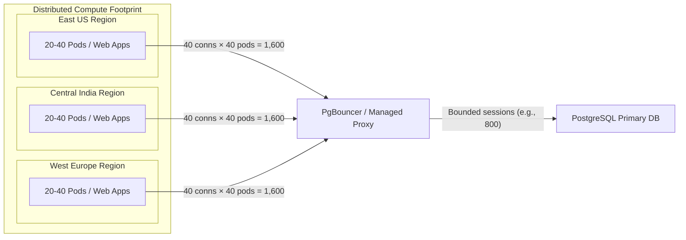

# 37. Database Connection Pool Architecture & Virtual Thread Contention — Key Takeaways

> **Parent**: [System Design Interview Reference](../index.md)  
> **Source**: [Why Did Our Database Collapse After We Migrated to Virtual Threads?](../../articles/databases/why-did-our-database-collapse-after-we-migrated-to-virtual-threads.md)  
> **Author**: Lets Learn Now (Bhuwan KC), published 2026-08-14  
> **Purpose**: Extract connection pool sizing mathematics, distributed instance multiplication dynamics across multi-region cloud autoscaling, semaphore-based backpressure, and transaction lifecycle isolation from Java virtual thread migrations.  

> **Also see**: [Query Performance](query-performance.md) (`db-01`–`db-07`), [Database Decisions](database-decisions.md) (`db-08`–`db-17`), [JVM Thread Model vs Go](../jvm-runtime/jvm-thread-model-vs-go.md) (`jvm-02`), [Resilience Patterns](../resilience/resilience-patterns.md) (`resilience-01`–`resilience-05`)  
> **Dictionary**: [Connection Pooling](../../reference-dictionary/databases.md#connection-pooling), [Connection Storm](../../reference-dictionary/databases.md#connection-storm), [Connection Acquisition Latency](../../reference-dictionary/databases.md#connection-acquisition-latency), [Database Backpressure](../../reference-dictionary/databases.md#database-backpressure), [Virtual Thread](../../reference-dictionary/java-jvm.md#virtual-thread), [Circuit Breaker](../../reference-dictionary/resilience.md#circuit-breaker)  
> **Azure Services**: [Azure Database for PostgreSQL Flexible Server (Built-in PgBouncer)](../../architecture-azure/data/), [Azure App Service / Web Apps](../../architecture-azure/compute/), [Azure Monitor / Application Insights](../../architecture-azure/observability/)  
> **Taxonomy Reference**: §3.3 Data Architecture  

---

## Contents

| ID | Problem | Key Concept |
|:---|:---|:---|
| [`db-34`](#db-34-compute-vs-resource-concurrency-mismatch-in-virtual-thread-runtimes) | Migrating to virtual threads removes OS thread throttling, causing concurrent tasks to flood database connection pools | Unbounded compute concurrency shifts the bottleneck downstream to finite database socket and lock resources |
| [`db-35`](#db-35-distributed-multi-region-connection-multiplication--pool-sizing) | Multi-region deployments with autoscaling multiply per-instance connection pools beyond DB `max_connections` | Total connections scale as $\text{Pool} \times \text{Instances} \times \text{Regions}$; autoscaling surges trigger connection exhaustion |
| [`db-36`](#db-36-database-backpressure-transaction-hygiene--acquisition-monitoring) | High concurrency and long-running transactions trigger pool exhaustion, cascading timeouts, and retry storms | Apply client-side semaphores, isolate network calls outside transactions, separate read/write pools, and alert on acquisition latency |

---

## db-34: Compute vs. Resource Concurrency Mismatch in Virtual Thread Runtimes

| | |
|:---|:---|
| **Problem** | An application migrating from platform threads to virtual threads achieves lower CPU/memory usage and higher concurrency in staging, but completely collapses its backend database under production load with connection timeouts, lock contention, and cascading retries. |
| **Root cause** | Platform (OS) threads inadvertently served as a physical concurrency limiter (e.g., 200 worker threads = max 200 concurrent DB callers). Virtual threads make task creation virtually free (millions of threads), allowing unconstrained parallel tasks (e.g., `parallelStream`, `CompletableFuture.allOf`, `StructuredTaskScope`) to storm the database connection pool simultaneously. |

```mermaid
flowchart TD
    subgraph S1["Traditional Platform Threads (Natural Limiter)"]
        R1["Incoming Requests (10,000)"] --> Q1["Thread Pool Queue"]
        Q1 --> T1["200 OS Threads"]
        T1 -->|"Max 200 concurrent calls"| P1["HikariCP Pool (e.g., 50)"]
        P1 --> DB1["PostgreSQL DB"]
    end

    subgraph S2["Virtual Threads (Connection Storm)"]
        R2["Incoming Requests (10,000)"] --> VT["10,000 Virtual Threads"]
        VT -->|"10,000 concurrent acquire() calls"| P2["HikariCP Pool (Max 50)"]
        P2 -->|"Pool Exhaustion & Timeout"| E1["Connection Acquisition Timeout"]
        E1 -->|"Cascading Retries"| DB2["PostgreSQL Crash / Lock Contention"]
    end
```



### Architectural Breakdown:
1. **The Concurrency Shift**: Virtual threads decouple compute concurrency from thread overhead. However, the database is an external, stateful, resource-constrained system bound by CPU cores, disk I/O, lock tables, and `max_connections`.
2. **Sub-Task Amplification**: When developers use concurrent sub-task fanouts (e.g., fetching pricing, inventory, recommendations, and shipping validations concurrently within one request), each request opens multiple simultaneous database leases instead of sequential execution.
3. **Queue Splay & Timeouts**: When thousands of virtual threads block on `HikariCP.getConnection()`, threads exceed `connectionTimeout` (default 30s), throwing exceptions and triggering upstream retries.

**Strategy**: Decouple task execution concurrency from database access concurrency. Retain virtual threads for I/O multiplexing, but enforce explicit concurrency boundaries (bulkheads or semaphores) around database operations.

---

## db-35: Distributed Multi-Region Connection Multiplication & Pool Sizing

| | |
|:---|:---|
| **Problem** | Per-instance connection pool settings appear safe in isolation (e.g., 40 connections), but during traffic spikes and autoscaling events, the database cluster hits `FATAL: remaining connection slots are reserved` and rejects all traffic. |
| **Root cause** | Failure to account for distributed multiplication across autoscaled instances and regions. Sizing pools based on incoming request rate (TPS) rather than active query execution time and failure scenarios causes massive over-allocation. |



### Mathematical Sizing Formulas:

1. **Theoretical Baseline Requirement**:
   $$\text{Required Active Connections} \approx \text{TPS} \times \text{Average DB Time Per Request}$$
   *Example*: $1{,}000\text{ TPS} \times 0.05\text{ s} (50\text{ ms}) = 50\text{ actively utilized connections}$.

2. **Production-Safe Pool Formula**:
   $$\text{Pool Size} = (\text{Peak TPS} \times \text{P95 DB Time}) + \text{Retry Buffer} + \text{Failover Buffer} + \text{Regional Surge Buffer}$$

3. **Global Multi-Region Footprint**:
   $$\text{Total Possible Connections} = \text{Pool Size Per Pod} \times \text{Max Autoscaling Pods} \times \text{Active Regions}$$
   *Risk Case*: $40\text{ pool size} \times 40\text{ instances} \times 3\text{ regions} = 4{,}800\text{ connections}$ against a database configured for $1{,}000$ connections.

**Strategy**:
- Downsize per-instance application pools aggressively (e.g., from 100 to 20–30).
- Introduce an intermediate connection multiplexer (such as PgBouncer in transaction pooling mode or Azure Database for PostgreSQL built-in PgBouncer).
- Coordinate autoscaling scale-out limits with database `max_connections`.

---

## db-36: Database Backpressure, Transaction Hygiene & Connection Acquisition Observability

| | |
|:---|:---|
| **Problem** | Latency spikes on external APIs cause database connection pool exhaustion; retry storms from failed requests exacerbate database saturation; teams only notice outages when overall API response times degrade. |
| **Root cause** | Long-lived transactions holding database connections open while awaiting remote HTTP/Kafka responses; lack of client-side backpressure; failure to monitor connection acquisition wait time as a leading health indicator. |

```mermaid
sequenceDiagram
    autonumber
    actor Client
    participant App as App (Virtual Thread)
    participant Sem as Semaphore (Backpressure)
    participant Pool as HikariCP Pool
    participant DB as PostgreSQL DB
    participant Ext as External Payment / Remote API

    Client->>App: Process Order Request
    Note over App,Ext: Non-DB Work & Remote API (Hold NO DB Connection)
    App->>Ext: Validate Payment / External Call
    Ext-->>App: Payment Confirmed

    Note over App,DB: Bounded DB Transaction Phase
    App->>Sem: acquire() (Permit check)
    App->>Pool: getConnection() (Fast Lease)
    Pool-->>App: Active Connection
    App->>DB: BEGIN; UPDATE inventory; INSERT order; COMMIT;
    DB-->>App: Success
    App->>Pool: close() (Return Connection)
    App->>Sem: release()
    App-->>Client: 200 OK
```

### Architectural Breakdown & Fixes:

1. **Explicit Client-Side Backpressure**:
   Protect database connection pools from virtual thread stampedes using a `Semaphore` or Resilience4j Bulkhead:
   ```java
   private final Semaphore dbSemaphore = new Semaphore(50);

   public Order process(OrderRequest req) {
       dbSemaphore.acquire();
       try {
           return orderRepository.save(req.toEntity());
       } finally {
           dbSemaphore.release();
       }
   }
   ```
2. **Transaction Scope Hygiene**:
   Never include network I/O, external REST APIs, or Kafka publishing inside a database `@Transactional` block. Connections must only be held during active database execution.
3. **Read/Write Pool Separation**:
   Split application data sources into separate connection pools for the write-primary database and read replicas, ensuring heavy read queries cannot starve critical transaction writes.
4. **Leading Observability Metrics**:
   Monitor **Connection Acquisition Latency** (`hikaricp.connections.acquire` or pool pending count) and P95/P99 latency rather than CPU or average response time.

---

## Tradeoff Analysis

| Pattern | Advantages | Tradeoffs / Risks | Mitigation |
|:---|:---|:---|:---|
| **Virtual Thread per Task** | Maximizes compute utilization; simplifies asynchronous code without reactive frameworks. | Removes natural OS thread limits; risks connection storms on shared resources. | Guard resource access with semaphores and bulkheads. |
| **Aggressive Pool Downsizing** | Reduces database connection overhead and context switching; prevents DB thrashing. | Requests queue at the application pool level during unexpected surges. | Implement fast-fail timeouts, circuit breakers, and read replicas. |
| **Intermediate Connection Pooler (PgBouncer)** | Multiplexes thousands of client connections onto a small backend pool; protects database memory. | Transaction pooling mode disables named prepared statements and session-level features (`SET`, temp tables). | Use PgBouncer transaction mode with query parameterization or session mode for specific stateful workflows. |
| **Read/Write Pool Splitting** | Isolates critical write transactions from read spikes and analytical scans. | Replication lag can cause read-after-write inconsistency on replicas. | Route read-your-own-writes queries to primary or enforce monotonic read consistency. |

---

## Azure Service Implementations

| Concept | Azure Architecture Mapping |
|:---|:---|
| **Managed Connection Pooling** | [Azure Database for PostgreSQL Flexible Server built-in PgBouncer](../../architecture-azure/data/) allows tens of thousands of application connections to share bounded backend database processes. |
| **Compute Autoscaling & Bounding** | [Azure App Service / Web Apps](../../architecture-azure/compute/) scale-out rules must be bounded by maximum database connection pool capacity. |
| **Pool & Acquisition Observability** | [Azure Monitor / Application Insights](../../architecture-azure/observability/) metrics combined with Micrometer/HikariCP JMX metrics (`hikaricp.connections.acquire`, `hikaricp.connections.pending`, `hikaricp.connections.timeout`). |

---

```json
{
  "takeaways": [
    {
      "id": "db-34",
      "title": "Compute vs. Resource Concurrency Mismatch in Virtual Thread Runtimes",
      "problem": "Unbounded lightweight virtual threads eliminate OS thread limits and flood downstream database connection pools and lock managers.",
      "strategy": "Apply explicit client-side concurrency bulkheads and semaphores to decouple compute concurrency from physical database connection concurrency.",
      "tradeoffs": "Prevents database collapse at the cost of queuing requests at the application layer when resource capacity is reached."
    },
    {
      "id": "db-35",
      "title": "Distributed Multi-Region Connection Multiplication & Pool Sizing",
      "problem": "Independent connection pools across autoscaled instances and regions multiply connection counts beyond database capacity.",
      "strategy": "Size pools using (Peak TPS * P95 DB Time) + Buffers, downsize instance pools, and deploy connection poolers (PgBouncer).",
      "tradeoffs": "Smaller instance pools require strict query latency discipline to avoid pool wait timeouts during traffic surges."
    },
    {
      "id": "db-36",
      "title": "Database Backpressure, Transaction Hygiene & Connection Acquisition Observability",
      "problem": "Long-lived transactions holding connections across network calls and retry storms cause cascading pool exhaustion.",
      "strategy": "Strictly scope transactions to DB mutations, split read/write pools, implement backpressure, and monitor connection acquisition latency.",
      "tradeoffs": "Refactoring transactions requires decoupling orchestration logic and handling eventual consistency or dual-write safeguards."
    }
  ]
}
```
