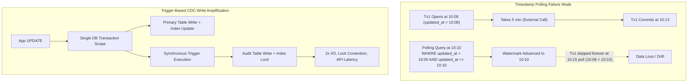
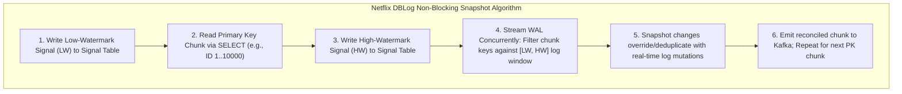
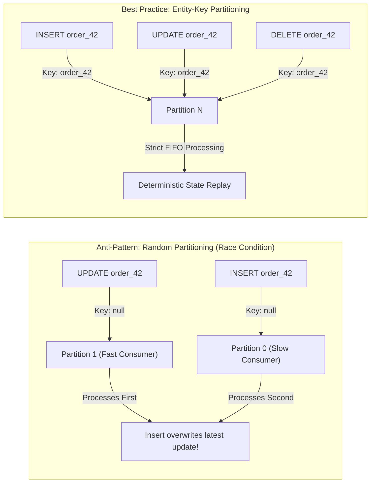
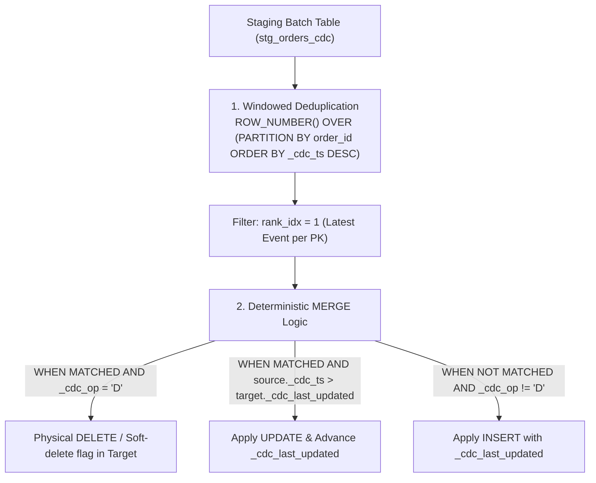

# 38. CDC Pipeline Scale Failures & Resilient Change Streams — Key Takeaways

> **Parent**: [System Design Interview Reference](../index.md)  
> **Source**: [Why Most CDC Pipelines Break at Scale (And How Senior Engineers Build Them Right)](../../articles/databases/why-most-cdc-pipelines-break-at-scale.md)  
> **Author**: Cloud With Azeem, published 2026-08-11  
> **Purpose**: Extract architectural trade-offs between polling and log-based CDC, non-blocking incremental snapshot mechanics (DBLog), stream partition ordering guarantees, and idempotent warehouse reconciliation patterns.  

> **Also see**: [PostgreSQL Logical Replication Internals](35-db-key-takeaways.md) (`db-28`–`db-30`), [Database Decisions](database-decisions.md) (`db-08`–`db-17`), [Kafka Reliability & Ordering](../messaging/kafka-reliability-ordering.md) (`broker-18`–`broker-21`), [Notifications at Scale Takeaways](../messaging/notifications-at-scale-takeaways.md) (`broker-114`–`broker-118`)  
> **Dictionary**: [Write-Ahead Log (WAL)](../../reference-dictionary/databases.md#write-ahead-log-wal), [Change Data Capture (CDC)](../../reference-dictionary/data-concurrency.md#change-data-capture), [Non-Blocking Incremental Snapshot](../../reference-dictionary/databases.md#non-blocking-incremental-snapshot), [CDC Tombstone](../../reference-dictionary/databases.md#cdc-tombstone), [LSN Lag](../../reference-dictionary/databases.md#lsn-lag), [Monotonic Timestamp Guard](../../reference-dictionary/databases.md#monotonic-timestamp-guard)  
> **Azure Services**: [Azure Event Hubs / Kafka Surface](../../architecture-azure/messaging/), [Azure Database for PostgreSQL (Logical Replication)](../../architecture-azure/data/), [Azure Synapse / Databricks Delta Lake](../../architecture-azure/data/)  
> **Taxonomy Reference**: §3.3 Data Architecture  

---

## Contents

| ID | Problem | Key Concept |
|:---|:---|:---|
| [`db-37`](#db-37-state-polling-vs-mutation-streaming-failure-modes) | Timestamp-based polling silently drops out-of-order committed transactions and misses physical deletes; trigger-based CDC creates severe write amplification | Long-running transactions commit behind watermarks; physical deletes leave no timestamps. Log-based CDC decouples extraction from transaction scope |
| [`db-38`](#db-38-log-based-cdc-bootstrapping--non-blocking-incremental-snapshots) | Historical bootstrapping via table locks halts OLTP traffic on multi-million row tables | Netflix DBLog algorithm: low/high watermark signal tables interleave chunk reads with live WAL streams without table locks |
| [`db-39`](#db-39-partition-key-determinism--cross-partition-race-conditions) | Round-robin/random Kafka partitioning delivers updates before inserts or causes out-of-order state overwrites | Enforce entity-level partition key determinism (primary key as message key) to guarantee total per-entity event ordering |
| [`db-40`](#db-40-modern-warehouse-reconciliation-idempotent-merge-pipelines) | Naive warehouse upserts allow stale network retries to overwrite fresh records and leave deleted entities as zombie rows | Idempotent `MERGE` with windowed batch deduplication, monotonic timestamp guards, and explicit tombstone handling |

---

## db-37: State Polling vs. Mutation Streaming Failure Modes

| | |
|:---|:---|
| **Problem** | Analytical dashboards and caches diverge from primary transactional databases due to missing rows, zombie hard-deletes, or severe database latency introduced by synchronization queries. |
| **Root cause** | Timestamp-based polling relies on commit-time watermarks which fail during long-running concurrent transactions, and cannot detect physical row deletions. Trigger-based CDC executes synchronous secondary writes within the main transaction scope, doubling I/O and creating index lock contention. |



### Architectural Breakdown:

1. **The Out-of-Order Transaction Commit Anomaly**:
   - Transaction $A$ starts at $T_0$, assigns `updated_at = T_0`, and executes slow I/O.
   - Transaction $B$ starts at $T_1$ ($T_1 > T_0$), commits immediately at $T_1$.
   - Poller runs at $T_2$ ($T_0 < T_2 < \text{Commit}_A$), reading $B$ and setting $\text{Watermark} = T_2$.
   - Transaction $A$ commits at $T_3$. Next poller queries `WHERE updated_at > T_2`. Transaction $A$ ($T_0$) is skipped permanently.
2. **The Silent Hard-Delete Trap**:
   - `DELETE FROM orders WHERE id = 42` removes the row physically.
   - Polling queries have no row to evaluate `updated_at`. The deletion never propagates to downstream warehouses or data lakes, creating permanent "zombie records".
3. **Trigger-Induced Latency & Amplification**:
   - Secondary inserts into audit tables compete for buffer pool pages, transaction logs, and index locks.
   - Under heavy write concurrency, database throughput plummets and connection pools exhaust.

**Strategy**: Transition to asynchronous log-based CDC (Postgres WAL, MySQL Binlog, MongoDB Oplog). Log tailers (e.g., Debezium) read committed changes asynchronously from disk with zero transaction lock overhead and full capture of physical deletes.

---

## db-38: Log-Based CDC Bootstrapping & Non-Blocking Incremental Snapshots

| | |
|:---|:---|
| **Problem** | Enabling log-based CDC on an existing active table requires bootstrapping millions of historical rows. Traditional snapshotting requires locking tables (`LOCK TABLE IN SHARE MODE`), degrading application availability. |
| **Root cause** | The transaction log (WAL) only retains mutations from the moment the replication slot is created; historical state must be synchronized without blocking concurrent transactional updates. |



### Key Mechanics of DBLog Incremental Snapshotting:

1. **Control Table Signaling**: The CDC engine writes unique low-watermark ($LW$) and high-watermark ($HW$) marker records to a lightweight signal table inside the source database.
2. **Chunk Reading**: Between $LW$ and $HW$, the connector reads a defined range of primary keys (e.g., `WHERE id >= 1 AND id < 10000`) as a snapshot batch.
3. **Windowed Log Deduplication**:
   - Real-time WAL stream continues uninterrupted.
   - For all mutations occurring in the transaction log between $LW$ and $HW$, the connector updates or removes corresponding keys from the memory snapshot chunk.
   - If an entity was updated in the WAL during the snapshot read, the WAL version takes precedence.
4. **Zero Application Downtime**: No table-level read locks are acquired, allowing OLTP queries to proceed at full performance.

**Strategy**: Use connectors that support incremental non-blocking snapshots (e.g., Debezium incremental snapshotting based on DBLog) to bootstrap tables seamlessly in production.

---

## db-39: Partition-Key Determinism & Cross-Partition Race Conditions

| | |
|:---|:---|
| **Problem** | Downstream consumers receive state updates out of order (e.g., `SHIPPED` before `PENDING`, or updates applied to non-existent rows), resulting in corrupted analytical state. |
| **Root cause** | Kafka/Event Hubs guarantee total ordering **only within a single partition**. If events are produced with round-robin, null, or random message keys, mutations for the same entity land across different partitions processed by different consumer threads at varying speeds. |



### Architectural Principles for CDC Stream Ordering:

1. **Primary Key as Message Key**: Always configure CDC producers to use the source table's primary key (e.g., `order_id` or composite primary key) as the broker partition routing key.
2. **Consistent Partition Hashing**: Guarantee that $\text{hash}(\text{pk}) \pmod N$ maps all lifecycle events (`INSERT`, `UPDATE`, `DELETE`) of entity $E$ to the exact same partition.
3. **Single Consumer per Partition**: Within a Kafka consumer group, each partition is consumed by exactly one thread, preserving causal ordering from the database WAL.

---

## db-40: Modern Warehouse Reconciliation: Idempotent MERGE Pipelines

| | |
|:---|:---|
| **Problem** | Analytical tables drift from source databases due to duplicate messages, out-of-order network retries, and uncleared hard-deleted records. |
| **Root cause** | Naive `INSERT` or `UPDATE SET status = source.status` statements lack idempotency guards and fail to handle tombstone records emitted by CDC engines. |



### Production SQL Reconciliation Blueprint:

```sql
MERGE INTO analytics.dim_orders AS target
USING (
    -- 1. Deduplicate micro-batch: pick newest event per entity
    SELECT order_id, customer_id, status, total_amount, _cdc_op, _cdc_ts
    FROM (
        SELECT *,
               ROW_NUMBER() OVER (
                   PARTITION BY order_id 
                   ORDER BY _cdc_ts DESC
               ) AS rank_idx
        FROM staging.stg_orders_cdc
    )
    WHERE rank_idx = 1
) AS source
ON target.order_id = source.order_id
-- 2. Explicit Tombstone Processing (Cleans up hard-deletes)
WHEN MATCHED AND source._cdc_op = 'D' THEN
    DELETE
-- 3. Monotonic Timestamp Guard (Protects against stale out-of-order deliveries)
WHEN MATCHED AND source._cdc_ts > target._cdc_last_updated THEN
    UPDATE SET
        target.customer_id = source.customer_id,
        target.status = source.status,
        target.total_amount = source.total_amount,
        target._cdc_last_updated = source._cdc_ts
-- 4. Clean Insertions
WHEN NOT MATCHED AND source._cdc_op != 'D' THEN
    INSERT (order_id, customer_id, status, total_amount, _cdc_last_updated)
    VALUES (source.order_id, source.customer_id, source.status, source.total_amount, source._cdc_ts);
```

### Operational Guardrails for Production CDC:

1. **Schema Drift as an Event**: Enforce backward-compatible Avro/JSON schemas via Confluent/Aiven Schema Registry before messages enter Kafka to prevent downstream warehouse ingestion parser breaks.
2. **Monitor LSN Lag Over Consumer Lag**: Track primary database `pg_replication_slots` (`confirmed_flush_lsn` vs current WAL LSN). High LSN lag prevents WAL segments from being recycled by checkpointers, leading to disk full outages.
3. **Isolate OLTP and OLAP**: Point CDC connectors to dedicated read replicas or physical standby instances rather than primary write masters to prevent WAL decoding from competing for I/O and memory cache.
