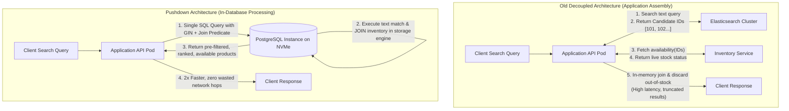
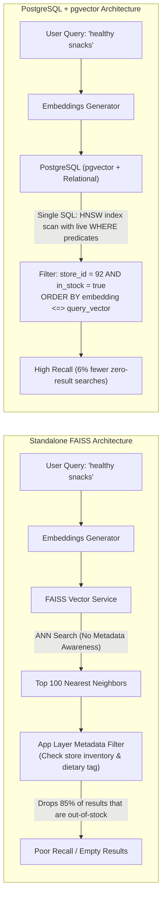
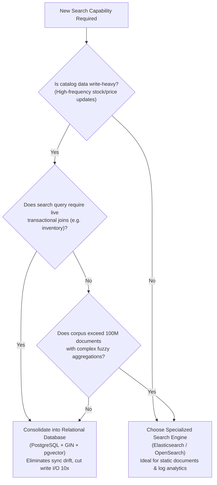

# 39. Search Architecture at Scale: Elasticsearch vs. PostgreSQL Relational Consolidation — Key Takeaways

> **Parent**: [System Design Interview Reference](../index.md)  
> **Source**: [Elasticsearch Is Dead in 2026. Instacart Just Proved It](../../articles/databases/elasticsearch-is-dead-instacart-proved-it.md)  
> **Author**: The Latency Gambler, published 2026-08-16  
> **Purpose**: Extract architectural trade-offs between document-oriented search clusters and normalized relational databases under write-heavy inventory workloads, computation pushdown patterns, and consolidated semantic vector search.  

> **Also see**: [Query Performance & Optimization](query-performance.md) (`db-01`–`db-07`), [Database Decisions](database-decisions.md) (`db-08`–`db-17`), [Sharding & Partitioning Strategies](sharding-partitioning-strategies.md) (`db-19`–`db-24`), [AI & Vector Search Infrastructure](../ai-ml-infrastructure/35-ai-key-takeaways.md) (`ai-28`–`ai-30`)  
> **Dictionary**: [GIN Index (Generalized Inverted Index)](../../reference-dictionary/databases.md#gin-index), [tsvector & ts_rank](../../reference-dictionary/databases.md#tsvector-ts-rank), [Inverted Index](../../reference-dictionary/databases.md#inverted-index), [pgvector](../../reference-dictionary/ai-ml-llm.md#pgvector), [FAISS](../../reference-dictionary/ai-ml-llm.md#faiss), [Computation Pushdown](../../reference-dictionary/architecture-patterns.md#computation-pushdown)  
> **Azure Services**: [Azure Database for PostgreSQL (Flexible Server / pgvector)](../../architecture-azure/data/), [Azure AI Search](../../architecture-azure/data/)  
> **Taxonomy Reference**: §3.3 Data Architecture  

---

## Contents

| ID | Problem | Key Concept |
|:---|:---|:---|
| [`db-41`](#db-41-document-denormalization-vs-relational-normalization-for-write-heavy-catalogs) | High write volume on rapidly changing item attributes (price, stock, promotions) creates catastrophic indexing load and lag in document stores | Document-level denormalization forces full document rewriting per mutation. Relational normalization isolates updates to single rows/tables, cutting write workload by ~10x |
| [`db-42`](#db-42-computation-pushdown-in-database-joins--filtering-vs-application-tier-assembly) | Decoupled search engines force broad ID-fetching and high-latency post-filtering/joining in application pods | Pushdown computation directly to storage: in-database SQL join of `tsvector` full-text ranking with live inventory on NVMe halves search latency |
| [`db-43`](#db-43-in-database-vector-search-pgvector-vs-standalone-ann-stores-faiss) | Standalone vector databases (FAISS) cannot filter on live transactional attributes at query time, causing overfetching, result drops, and index drift | Unified SQL execution with `pgvector` evaluates semantic similarity and real-time inventory predicates simultaneously, reducing zero-result searches by 6% |
| [`db-44`](#db-44-workload-driven-search-engine-selection-the-specialized-engine-liability-boundary) | Teams adopt dedicated search clusters reflexively, turning document indexing into an expensive liability for write-heavy, joined-state workloads | Architectural decision boundary: specialized search engines excel at immutable/log text; relational consolidation wins when search depends on fast-changing, join-heavy transactional state |

---

## db-41: Document Denormalization vs. Relational Normalization for Write-Heavy Catalogs

| | |
|:---|:---|
| **Problem** | In high-concurrency catalog systems (e.g., e-commerce, grocery platforms with billions of items across thousands of merchants), frequent updates to volatile attributes like stock counts, dynamic pricing, and promotions cause search clusters to suffer severe indexing backlogs, stale search results, and degraded query throughput. |
| **Root cause** | Document-oriented search engines (like Elasticsearch/Lucene) rely on denormalized document models. A mutation to any single field requires rewriting and re-indexing the entire document. Under continuous write load, Lucene segment creation and merging saturate I/O and CPU, dragging down read latency and making data corrections take hours or days to converge. |


### Architectural Breakdown:

1. **Write Amplification in Inverted Index Documents**:
   - In Elasticsearch, documents are immutable within Lucene segments. An `update` API call is internally a soft-delete of the old document followed by an insert of an entirely new document containing all fields.
   - When a catalog item has hundreds of fields (titles, taxonomies, descriptions, ML ranking features) and 1 field updates 50 times per day, the system executes 50 complete document re-indexing operations rather than 50 atomic field updates.
2. **Relational Decomposition Advantage**:
   - Normalizing high-churn attributes (`inventory`, `prices`) into separate tables linked by foreign keys to stable attributes (`products`, `descriptions`) confines write I/O strictly to small, fixed-width rows.
   - The PostgreSQL GIN index on `products.search_vector` experiences zero write churn when stock fluctuates from 10 to 9.
3. **Operational Recovery & Reconciliation**:
   - Repairing corrupted denormalized search indices requires re-crawling multiple upstream databases to rebuild JSON documents, often taking days.
   - Normalized relational tables allow targeted, transactional repair scripts (`UPDATE inventory SET ...`) that execute in milliseconds with ACID guarantees.

**Strategy**: For write-heavy search catalogs, reject premature document-level denormalization. Structure product data into normalized relational tables, maintaining the text-search index only on static or low-churn text attributes.

**Tradeoff**: Normalized tables require join operations at query time rather than flat document retrieval. This requires rigorous indexing on join foreign keys and fast storage (e.g., NVMe) to ensure read latency remains low.

---

## db-42: Computation Pushdown (In-Database Joins & Filtering) vs. Application-Tier Assembly

| | |
|:---|:---|
| **Problem** | Architectures that decouple text search from transactional data suffer from high end-to-end query latency, excessive network bandwidth consumption, and empty-page user experiences due to post-search filtering. |
| **Root cause** | The application layer searches the text engine to get candidate IDs, calls separate microservices to fetch live availability and localized pricing, and then joins/filters in application memory. When top search matches are out-of-stock, post-filtering discards them, resulting in truncated result sets or empty pages. |



### Architectural Comparison:

```sql
-- Anti-Pattern: Two-phase fetch and app-layer join
-- Phase 1 (Search Engine):
GET /products/_search?q=organic+apples -> returns IDs [401, 402, 403, 404, 405]
-- Phase 2 (Application Service):
SELECT * FROM inventory WHERE product_id IN (401, 402, 403, 404, 405) AND store_id = 92;
-- Phase 3 (App memory): discard 401, 403 (out of stock). User gets 3 items instead of requested 5.

-- Optimized Pattern: Computation Pushdown directly in PostgreSQL
SELECT 
    p.id,
    p.title,
    p.brand,
    i.price,
    ts_rank(p.search_vector, websearch_to_tsquery('english', 'organic apples')) AS rank
FROM products p
JOIN inventory i ON i.product_id = p.id
WHERE i.store_id = 92
  AND i.available = true
  AND p.search_vector @@ websearch_to_tsquery('english', 'organic apples')
ORDER BY rank DESC
LIMIT 20;
```

### Key Mechanics of In-Database Computation:

1. **Elimination of the "Candidate Discard" Defect**:
   - In application-tier filtering, if the top 20 text matches are unavailable at the user's local store, the user sees an empty or sparse page despite hundreds of valid products existing deeper in the catalog.
   - Pushing the `JOIN inventory` into the database query engine guarantees that the top $N$ returned results are strictly available in the target retail store.
2. **Hardware Co-Location**:
   - Modern NVMe SSDs provide hundreds of thousands of random read IOPS with microsecond latency. Running indexed joins directly across memory-mapped relational tables avoids serialized JSON serialization/deserialization cycles across network boundaries.
3. **Query Engine Optimizer Leverage**:
   - The relational query planner dynamically decides whether to scan the `inventory` index first (e.g., if a store has very few items) or evaluate the `search_vector` GIN index first (if text search is highly specific), optimizing the execution path per query.

**Strategy**: Push predicate filtering and relational joins directly into the database engine handling the search index. Exploit PostgreSQL full-text search (`tsvector`, GIN, `ts_rank`) alongside relational constraints.

**Tradeoff**: Pushing compute into the database increases database CPU and memory consumption. It requires horizontal sharding (e.g., by retailer or geographical region) and read-replica scaling to prevent query spikes from impacting transactional writes.

---

## db-43: In-Database Vector Search (pgvector) vs. Standalone ANN Stores (FAISS)

| | |
|:---|:---|
| **Problem** | Augmenting catalog search with semantic vector retrieval using standalone vector libraries (e.g., FAISS) introduces operational synchronization drift and degrades search recall due to post-query attribute filtering. |
| **Root cause** | Dedicated vector engines excel at unconstrained Approximate Nearest Neighbor (ANN) math but cannot evaluate relational predicates (store availability, pricing, category filters) during index traversal. They overfetch candidate vectors and filter them afterward in the application layer, dropping valid semantic matches. |



### Architectural Comparison:

| Dimension | Standalone Vector Store (FAISS) | In-Database Extension (pgvector) |
|:---|:---|:---|
| **Raw Search Speed** | Extremely fast (C++ in-memory optimized) | Marginally slower on raw vector distance |
| **Filtered Search** | Post-filtering (overfetch & discard) or complex pre-filtering | Single-query integrated filtering with SQL `WHERE` |
| **Index Maintenance** | Dedicated index per retailer (hundreds of indexes to sync) | Standard SQL indexing (`HNSW` / `IVFFlat`) partitioned natively |
| **Data Consistency** | Eventual consistency; high risk of drift from primary DB | Immediate transactional consistency with product state |
| **Operational Footprint** | Separate microservice, memory clustering, custom sync jobs | Existing database operations, backup, and monitoring tooling |
| **Business Impact** | Truncated result lists on restricted subsets | 6% drop in zero-result searches; increased checkout conversion |

### The Hybrid Search Query in PostgreSQL:

```sql
-- Simultaneous Vector Distance + Relational Join + Metadata Filtering
SELECT 
    p.id,
    p.title,
    (1 - (p.embedding <=> $1)) AS semantic_score,
    ts_rank(p.search_vector, $2) AS lexical_score
FROM products p
JOIN inventory i ON i.product_id = p.id
WHERE i.store_id = $3
  AND i.available = true
  AND (p.embedding <=> $1) < 0.35  -- Cosine distance threshold
ORDER BY (0.7 * (1 - (p.embedding <=> $1)) + 0.3 * ts_rank(p.search_vector, $2)) DESC
LIMIT 20;
```

**Strategy**: When semantic search requires real-time business constraints (stock, price, tenant context), consolidate vector embeddings into the primary relational database via `pgvector`. Prioritize overall recall and transactional correctness over raw isolated ANN latency.

**Tradeoff**: `pgvector` index builds consume substantial CPU and RAM. Standalone vector stores remain superior for unconstrained, billions-scale pure vector clustering where no relational predicates exist.

---

## db-44: Workload-Driven Search Engine Selection: The Specialized Engine Liability Boundary

| | |
|:---|:---|
| **Problem** | Architecture teams prematurely adopt distributed document search engines (Elasticsearch, OpenSearch) as default infrastructure for all search features, incurring high operational overhead, cluster instability, and synchronisation bugs. |
| **Root cause** | Failing to evaluate the write-to-read ratio and transactional coupling of the search data. Elasticsearch is optimized for append-only logs or mostly static read-heavy document corpuses. Applying it to highly volatile, relationally coupled data turns its document-level indexing into an expensive liability. |



### Decision Matrix: Elasticsearch vs. PostgreSQL Search Consolidation

| System Property | Choose Elasticsearch / OpenSearch | Choose PostgreSQL (GIN + pgvector) |
|:---|:---|:---|
| **Primary Workload** | Read-heavy search, append-only logs, static articles | Write-heavy catalog with constant attribute mutations |
| **Transactional Coupling** | Loosely coupled; eventual consistency acceptable | Tight coupling; must reflect real-time stock/pricing |
| **Query Complexity** | Multi-faceted aggregations, typo tolerance, fuzzy scoring | Structured filters, range queries, exact catalog matching |
| **Vector Requirements** | Large-scale unconstrained semantic retrieval | Filtered semantic retrieval constrained by live business rules |
| **Operational Burden** | High: JVM tuning, heap sizing, shard balancing, dual-write sync | Low: Uses existing RDBMS operations, backups, and HA replicas |

**Strategy**: Apply the "Specialized Engine Liability Boundary": default to in-database search capabilities (PostgreSQL GIN full-text and `pgvector`) whenever the data is write-heavy and requires live joins with relational state. Reserve dedicated search clusters for read-dominated corpuses, log analytics, or petabyte-scale unconstrained text exploration.

**Tradeoff**: Consolidating search into PostgreSQL requires proactive connection management, database sharding strategies for hyperscale, and careful vacuum tuning to manage MVCC row turnover.
