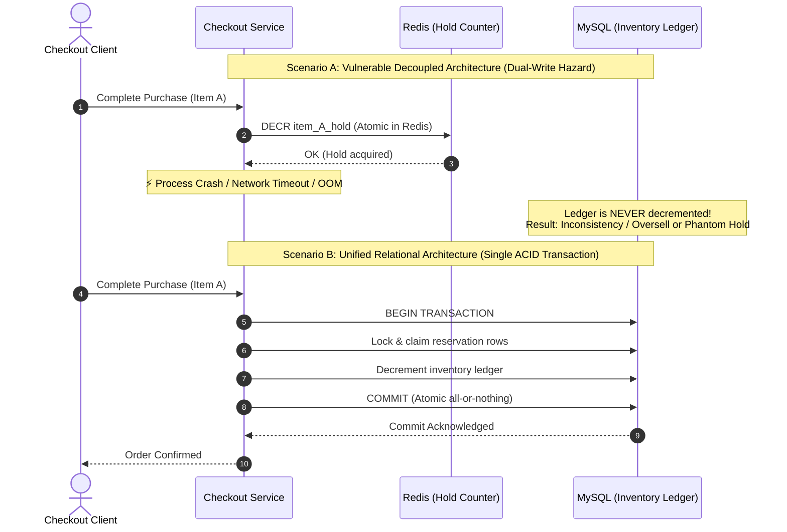
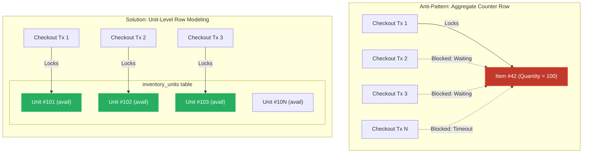
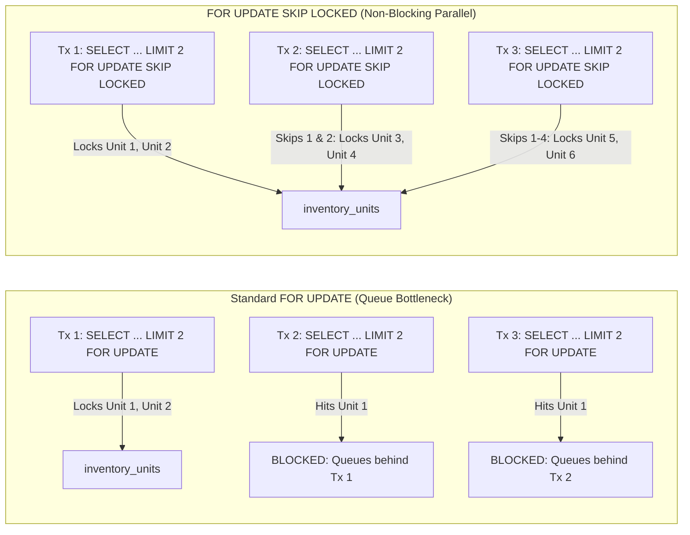
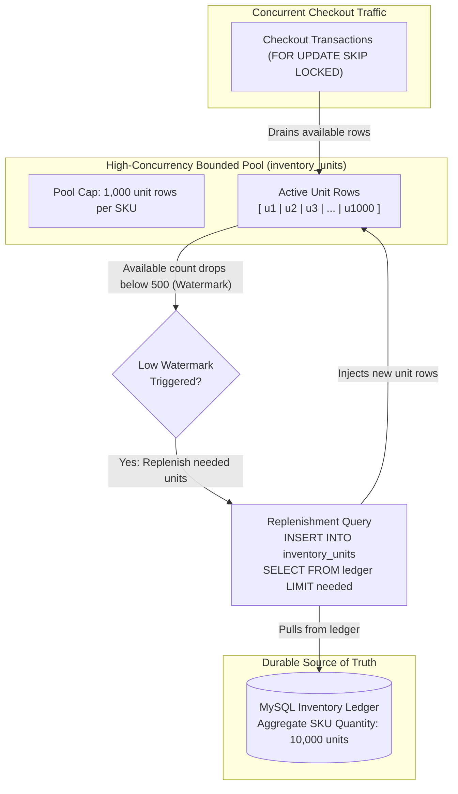

# 40. High-Contention Inventory Reservations: Redis to MySQL Relational Consolidation — Key Takeaways

> **Parent**: [System Design Interview Reference](../index.md)  
> **Source**: [Shopify Replaced Redis With MySQL. The Reason Is a Masterclass in System Design.](../../articles/databases/shopify-replaced-redis-with-mysql.md)  
> **Author**: The Latency Gambler, published 2026-09-08 (Shopify Engineering case study)  
> **Purpose**: Analyze the architectural transition from decoupled distributed caches (Redis) to unified relational transactions (MySQL 8) for high-contention checkout reservations using unit-level row modeling and `SKIP LOCKED`.  

> **Also see**: [Query Performance & Optimization](query-performance.md) (`db-01`–`db-07`), [Database Decisions](database-decisions.md) (`db-08`–`db-17`), [Search Architecture Relational Consolidation](39-db-key-takeaways.md) (`db-41`–`db-44`), [Concurrency & Transactions](../concurrency-transactions/29-tx-key-takeaways.md) (`tx-01`–`tx-04`)  
> **Dictionary**: [Unit-Level Row Modeling](../../reference-dictionary/data-concurrency.md#unit-level-row-modeling), [FOR UPDATE SKIP LOCKED](../../reference-dictionary/data-concurrency.md#for-update-skip-locked), [Inventory Reservation](../../reference-dictionary/data-concurrency.md#inventory-reservation), [Overselling](../../reference-dictionary/data-concurrency.md#overselling), [Dual-Write](../../reference-dictionary/messaging.md#dual-write), [Bounded Working Pool](../../reference-dictionary/architecture-patterns.md#bounded-working-pool)  
> **Azure Services**: [Azure Database for MySQL (Flexible Server)](../../architecture-azure/data/), [Azure Database for PostgreSQL (Flexible Server)](../../architecture-azure/data/)  
> **Taxonomy Reference**: §3.3 Data Architecture  

---

## Contents

| ID | Problem | Key Concept |
|:---|:---|:---|
| [`db-45`](#db-45-cross-system-dual-write-vs-single-engine-acid-consolidation-for-high-contention-state) | Decoupled cache counter (Redis) and persistent inventory ledger (MySQL) create distributed dual-write inconsistency and crash vulnerability | Consolidating reservation state into the relational database wraps the hold and ledger in a single atomic ACID transaction, eliminating cross-system coordination and deleting cache infrastructure |
| [`db-46`](#db-46-row-level-contention--serialization-collapse-single-counter-quantity-rows-vs-unit-level-modeling) | High-concurrency flash sales serializing thousands of checkouts onto a single quantity row (`qty = qty - 1`), causing lock wait timeouts | Unit-Level Row Modeling: represent stock as discrete individual sellable unit rows rather than a single scalar counter, transforming a single hot lock into parallelizable row acquisitions |
| [`db-47`](#db-47-queue-free-non-blocking-lock-acquisition-via-select--for-update-skip-locked) | Standard row locking (`FOR UPDATE`) forces concurrent queries to queue behind locked candidate rows, recreating serialized bottlenecks | `SELECT ... FOR UPDATE SKIP LOCKED` instructs the engine to silently skip locked rows and grab the next available unlocked units, achieving queue-free concurrent reservation |
| [`db-48`](#db-48-bounded-working-pool--dynamic-replenishment-pattern-for-unit-level-modeling) | Creating physical database rows for millions of units per SKU causes astronomical table bloat and B-tree index degradation | Bounded Working Pool: maintain a capped buffer (~1,000 unit rows) in the active reservation table and dynamically replenish from the master ledger when the pool drops below a watermark |
| [`db-49`](#db-49-pragmatic-architecture-engine-capability-discovery-before-infrastructure-sprawl) | Engineering teams reflexively adopt external distributed systems (locks, queues, caches) rather than shaping data models to native RDBMS features | Exhaust native database engine capabilities and evaluate data model topology before adding external distributed infrastructure |

---

## db-45: Cross-System Dual-Write vs. Single-Engine ACID Consolidation for High-Contention State

| | |
|:---|:---|
| **Problem** | At high checkout concurrency (e.g., flash sales peaking at $5.1M/minute), holding inventory reservations in an in-memory cache (Redis counter) while maintaining the durable financial source of truth in an RDBMS (MySQL ledger) introduces a distributed dual-write window. Network partitions or application crashes between writes cause catastrophic state drift: either inventory is deducted from the ledger while the Redis hold remains orphaned (phantom stockout / lost sales), or payment clears without the ledger being updated (overselling risk). |
| **Root cause** | Independent storage engines lack shared transaction boundaries. Because distributed two-phase commit (2PC) over network boundaries adds unacceptable latency to millisecond checkout SLAs, applications rely on non-atomic sequential writes across heterogeneous systems. Under continuous multi-thousand QPS load, the narrow crash window between the two writes becomes a frequent point of failure. |



### Architectural Breakdown

1. **The Inherent Incoherence of Cache-Ledger Separation**:
   - In-memory data structures (such as Redis `INCR`/`DECR`) offer high single-threaded throughput and microsecond latency, leading developers to use them as high-velocity pre-allocation counters.
   - However, inventory reservations are **legally binding transactional commitments**. A reservation must guarantee delivery upon payment clearance. Decoupling the reservation hold from the ledger creates two divergent truths that require background reconciliation, compensation sagas, and eventual consistency repairs that struggle to converge during flash traffic.

2. **Single-Engine ACID Consolidation**:
   - By consolidating the reservation hold directly into the relational database where the ledger resides, both state transitions are bound to the same database engine Write-Ahead Log (WAL / InnoDB redo log).
   - If the checkout process crashes at any step before the database commit, the transaction aborts automatically and all row locks release cleanly with zero orphaned state.

**Strategy**: Relational Consolidation. Eliminate external cache-based reservation counters by co-locating the volatile reservation hold and durable inventory ledger within a single transactional relational database.

**Tradeoff**: The relational database must handle the full write concurrency of peak checkout traffic without succumbing to lock contention, connection exhaustion, or transaction latency spikes.

---

## db-46: Row-Level Contention & Serialization Collapse: Single-Counter Quantity Rows vs. Unit-Level Modeling

| | |
|:---|:---|
| **Problem** | When moving inventory reservations into a relational database, standard database modeling represents product stock as a single aggregate integer: `UPDATE products SET available_quantity = available_quantity - 1 WHERE id = ?`. Under flash-sale conditions where thousands of buyers race for the same hot SKU, every checkout transaction contends for the exact same physical database row lock, collapsing concurrent processing into a single-file serial queue and causing severe lock wait timeouts. |
| **Root cause** | Relational row-level locking (e.g., InnoDB exclusive `X` lock) grants write access to exactly one transaction at a time per row. When 5,000 transactions target the same row simultaneously, transaction processing time degrades from $O(1)$ to $O(N)$ lock wait queues. Transactions waiting on row locks hold database connections open, rapidly exhausting the connection pool and cascading into database collapse. |



### Architectural Breakdown

1. **Counter Row Serialization**:
   - In standard schema designs, `inventory` has columns `(product_id, quantity)`. A reservation executes `UPDATE inventory SET quantity = quantity - :qty WHERE product_id = :id AND quantity >= :qty`.
   - Because all transactions require an exclusive lock on the row with primary key `product_id`, the database engine serializes transactions. At 5,000 checkouts/sec, even a 1ms lock hold duration results in a 5-second queue depth, triggering client timeouts and connection pool starvation.

2. **Unit-Level Row Modeling (One-Row-Per-Unit)**:
   - Instead of storing aggregate count `100`, the database stores 100 individual records in an `inventory_units` table, each representing a single physical, sellable unit.
   - Reserving 3 units is modeled as claiming any 3 available rows. Because each transaction claims a different set of rows, transactions no longer contend for the same lock. Serialization is broken into parallel row acquisitions.

**Strategy**: Unit-Level Row Modeling. Deconstruct aggregate scalar quantity counters into discrete, individually lockable unit rows (`inventory_units`), turning a monolithic serial locking bottleneck into independently lockable resources.

**Tradeoff**: Increases row volume, table size, and B-tree index maintenance compared to a single counter row, requiring bounded management for large catalogs.

---

## db-47: Queue-Free Non-Blocking Lock Acquisition via `SELECT ... FOR UPDATE SKIP LOCKED`

| | |
|:---|:---|
| **Problem** | Naive unit-level row selection (`SELECT id FROM inventory_units WHERE product_id = ? AND status = 'available' LIMIT 3 FOR UPDATE`) fails under high concurrency. Because multiple transactions query the same index page simultaneously, they evaluate the same leading rows, causing secondary transactions to block waiting on the primary transaction's uncommitted locks. If the first transaction commits and marks the row reserved, the waiting transaction resumes, discovers the row is no longer available, and re-evaluates or fails. |
| **Root cause** | Standard pessimistic row locking (`FOR UPDATE`) is **blocking by default**. When an index scan encounters a row locked by another uncommitted transaction, it sleeps until that lock is released. When hundreds of concurrent transactions execute identical `SELECT ... FOR UPDATE LIMIT N` queries, they serialize behind each other on the top index entries. |



### Architectural Breakdown

1. **Locking Primitives Comparison**:
   - `FOR UPDATE`: Acquires exclusive lock; **blocks** on locked rows until previous transaction commits or rolls back. Causes lock waits and deadlocks under concurrent scans.
   - `FOR UPDATE NOWAIT`: Attempts to acquire exclusive lock; **fails immediately with an error** (`Lock wait timeout / serialization error`) if any candidate row is locked. Requires aggressive application retries, creating retry storms.
   - `FOR UPDATE SKIP LOCKED`: **Skips locked rows entirely** and continues scanning the index until it satisfies the `LIMIT` clause with unlocked rows, returning immediately without blocking or erroring.

2. **Transactional Workflow**:

```sql
BEGIN;

-- Grab up to 3 available units, skipping any rows currently locked by other checkouts
SELECT id 
FROM inventory_units 
WHERE product_id = 42 AND status = 'available'
LIMIT 3
FOR UPDATE SKIP LOCKED;

-- Mark the returned discrete unit IDs as reserved
UPDATE inventory_units 
SET status = 'reserved', 
    reservation_id = 'res_98765', 
    reserved_at = NOW()
WHERE id IN (101, 102, 103);

COMMIT;
```

3. **Concurrency Mechanics**:
   - In a flash sale with 500 concurrent workers requesting 3 units each, Worker 1 locks units 1–3, Worker 2 seamlessly skips units 1–3 and locks 4–6, and Worker 3 skips units 1–6 and locks 7–9.
   - All 500 transactions execute in parallel without queuing behind each other, eliminating row-level lock contention.

**Strategy**: `FOR UPDATE SKIP LOCKED`. Pair unit-level row modeling with non-blocking row skipping in MySQL 8.0+ (or PostgreSQL 9.5+) to allow concurrent transactions to peel off distinct, non-overlapping subsets of available inventory simultaneously.

**Tradeoff**: Query results are non-deterministic with respect to physical row ordering (non-FIFO), which is fully acceptable for fungible inventory units but unacceptable for strictly sequenced message processing.

---

## db-48: Bounded Working Pool & Dynamic Replenishment Pattern for Unit-Level Modeling

| | |
|:---|:---|
| **Problem** | Unconstrained unit-level modeling does not scale for merchants with large inventory volumes. If a merchant carries 50,000 distinct SKUs with an average of 5,000 units in stock, creating a physical row for every unit generates 250,000,000 database rows. This causes severe table bloat, degrades B-tree index depth and caching efficiency, inflates backup sizes, and wastes storage. |
| **Root cause** | High-velocity lock contention only exists on the **active frontier** of available inventory. Units deep in the inventory backlog (units 1,000 to 5,000) do not need individual row locks during a flash sale because they are not being actively claimed in that exact second. Representing all quiescent stock as discrete physical rows conflates concurrency modeling with storage modeling. |



### Architectural Breakdown

1. **Decoupling Working Set from Total Stock**:
   - The master inventory ledger maintains aggregate stock numbers (e.g., 50,000 units).
   - The `inventory_units` table acts as a **bounded working pool**, capped at a maximum of $K$ rows per SKU (e.g., $K = 1,000$).
   - Concurrency is bounded to what the database engine needs to service simultaneous in-flight checkouts without starvation.

2. **Watermark-Based Replenishment Loop**:
   - As checkout checkouts claim rows (`status = 'reserved'`), the count of `available` rows in the pool decreases.
   - When the available count crosses a low-watermark threshold (e.g., $\le 50\%$ of pool size), a replenishment query pulls from the ledger and inserts new rows into `inventory_units` up to the cap.

```go
// refillPoolIfLow checks if the active available pool dropped below watermark (50%)
// and replenishes it from the master ledger in a controlled batch.
func refillPoolIfLow(ctx context.Context, db *sql.DB, productID int64, poolSize int) error {
    var availableCount int
    err := db.QueryRowContext(ctx, `
        SELECT COUNT(*) FROM inventory_units 
        WHERE product_id = ? AND status = 'available'`, productID).Scan(&availableCount)
    if err != nil {
        return err
    }

    // Healthy pool: no replenishment needed
    if availableCount >= poolSize/2 {
        return nil
    }

    needed := poolSize - availableCount
    _, err = db.ExecContext(ctx, `
        INSERT INTO inventory_units (product_id, status)
        SELECT ?, 'available' FROM ledger_free_units
        WHERE product_id = ? LIMIT ?`, productID, productID, needed)
    return err
}
```

3. **Lifecycle Management**:
   - Once units transition to `completed_order`, completed rows can be archived or deleted asynchronously in batches, keeping the working table lightweight, hot in the InnoDB buffer pool, and extremely fast to query.

**Strategy**: Bounded Working Pool. Cap the unit-level reservation table at a bounded pool size (e.g., 1,000 rows per SKU) and dynamically replenish it from the durable inventory ledger as stock drains below a defined watermark.

**Tradeoff**: Introduces replenishment orchestration logic. If checkouts drain the pool faster than replenishment can insert new rows, checkouts may momentarily perceive a stockout unless synchronous top-up fallback is implemented.

---

## db-49: Pragmatic Architecture: Engine Capability Discovery Before Infrastructure Sprawl

| | |
|:---|:---|
| **Problem** | When systems hit concurrency bottlenecks, engineering organizations routinely reflexively adopt new specialized distributed infrastructure — distributed lock managers (ZooKeeper, Redis Redlock), dedicated reservation services, or event-driven queueing systems. This infrastructure sprawl multiplies operational overhead, introduces dual-write hazards, increases deployment complexity, and expands operational failure domains. |
| **Root cause** | Defaulting to architectural addition rather than capability discovery. Engineers often assume relational databases are inherently incapable of scaling high-concurrency write workloads because they evaluate only naive schema designs (such as single-row integer counters) against default locking modes. |

```mermaid
flowchart TD
    subgraph ReflexiveSprawl["The Infrastructure Sprawl Anti-Pattern"]
        HitBottleneck1["Hit Single-Row Lock Contention"] --> AddRedis["Add Redis Cluster for Fast Holds"]
        AddRedis --> DualWrite["Face Dual-Write Inconsistency"]
        AddRedis --> AddLockManager["Add Distributed Lock Manager (Redlock)"]
        AddLockManager --> AddReconciliation["Add Reconciliation Cron Jobs & Sagas"]
        AddReconciliation --> OpsOverhead["High Operational Complexity & Failure Modes"]
    end

    subgraph PragmaticDiscovery["The Pragmatic Architecture Pattern"]
        HitBottleneck2["Hit Single-Row Lock Contention"] --> InspectCapabilities["Inspect Native Engine Features<br/>(MySQL 8 SKIP LOCKED, MVCC, Partitioning)"]
        InspectCapabilities --> ReshapeModel["Reshape Data Model<br/>(Unit-Level Rows + Bounded Pool)"]
        ReshapeModel --> DeleteInfra["Delete External Cache Cluster"]
        DeleteInfra --> Correctness["Native ACID Guarantees with Zero Sync Lag"]
    end
```



### Architectural Comparison

| Dimension | Decoupled Architecture (Redis + MySQL) | Consolidated Relational (MySQL 8 + SKIP LOCKED) |
|:---|:---|:---|
| **Transaction Boundary** | Distributed / Non-atomic (dual-write risk) | Single-engine ACID transaction |
| **Consistency Guarantee** | Eventual consistency; prone to orphan holds or overselling | Strict serializable/read-committed consistency |
| **Infrastructure Components** | Application + Redis cluster + MySQL cluster | Application + MySQL cluster |
| **Operational Failure Modes** | Redis split-brain, network timeouts between writes, cache TTL desync | Standard relational database failover & replication |
| **Data Shape** | Key-value integer counter in Redis; ledger table in MySQL | Bounded unit rows (`inventory_units`) + ledger in MySQL |
| **Concurrency Mechanism** | Redis single-threaded execution | MySQL row-level `SKIP LOCKED` across unit rows |
| **Recovery / Crash Hygiene** | Requires compensating saga or background reconciliation | Automatic rollback on connection/process death |

### Key Architectural Lessons

1. **The Shape of the Data Model Dictates Contention**:
   - Concurrency limits are rarely caused by the database engine itself; they are dictated by whether the data model forces all concurrent writers to funnel through a single gate.
   - Restructuring the data model from an aggregate value to partitionable units parallelizes load naturally across database CPU cores.

2. **Deleting Infrastructure as a Goal**:
   - Eliminating a distributed cache tier from a critical path reduces network hops, eliminates serialization desynchronization, and drastically simplifies disaster recovery and multi-region replication.
   - Always verify whether the database engine already in your stack possesses unused native primitives (`SKIP LOCKED`, partial indexes, window functions, generated columns) before introducing an external distributed system.

**Strategy**: Pragmatic Architecture. Before adding external distributed systems to solve performance or concurrency limitations, evaluate whether reshaping the data model around native database engine features (`SKIP LOCKED`, bounded pools) can satisfy both performance SLAs and strict consistency requirements.

**Tradeoff**: Requires engineering teams to master database engine internals, lock managers, and non-intuitive data modeling techniques rather than relying on generic caching abstractions.
