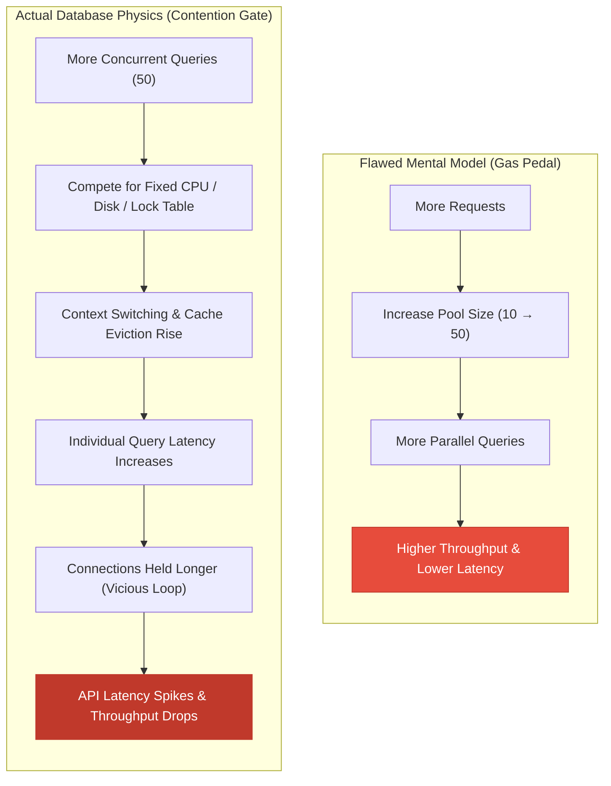
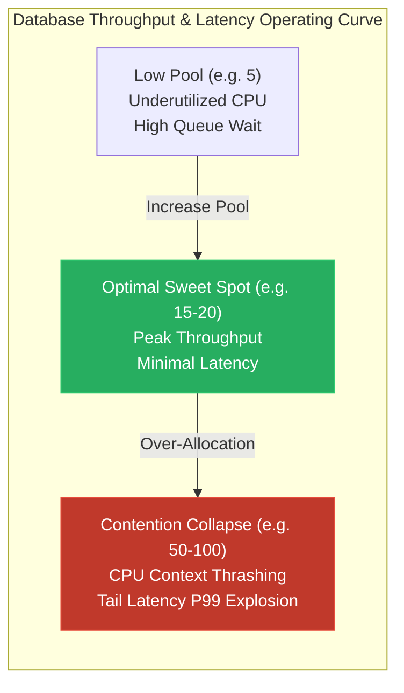
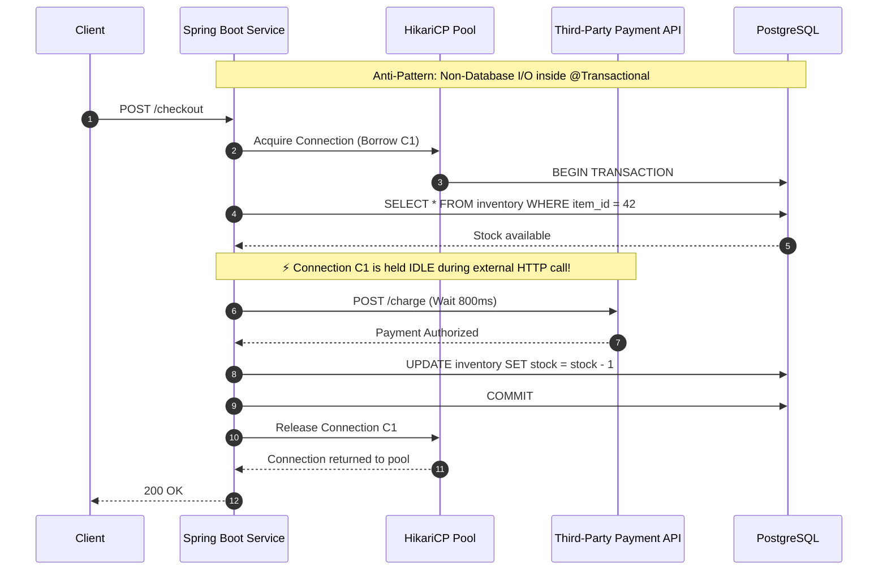
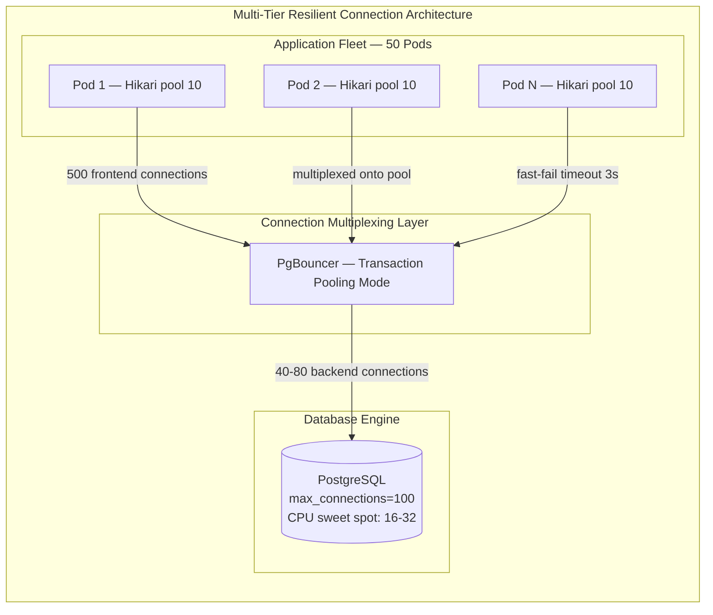

# 41. Database Connection Pool Sizing & Contention: Sizing for Capacity vs. Concurrency Gate — Key Takeaways

> **Parent**: [System Design Interview Reference](../index.md)  
> **Source**: [I Increased the Database Connection Pool. Then My API Got Slower.](../../articles/databases/i-increased-the-database-connection-pool-then-my-api-got-slower.md)  
> **Author**: The Atomic Architect, published September 24, 2026  
> **Purpose**: Analyze database connection pool physics, Little's Law capacity relationships, contention collapse feedback loops, latency decomposition, and fleet-wide connection multiplexing.  

> **Also see**: [Query Performance & Optimization](query-performance.md) (`db-01`–`db-07`), [Database Decisions](database-decisions.md) (`db-08`–`db-17`), [Virtual Thread Connection Storm](37-db-key-takeaways.md) (`db-34`–`db-36`), [Microservices Runtime Performance](../performance/microservices-runtime-performance.md) (`perf-01`–`perf-05`), [Cascading Failure Prevention](../resilience/cascading-failure-prevention.md)  
> **Dictionary**: [Connection Pooling](../../reference-dictionary/databases.md#connection-pooling), [Connection Acquisition Latency](../../reference-dictionary/databases.md#connection-acquisition-latency), [Database Backpressure](../../reference-dictionary/databases.md#database-backpressure), [Connection Storm](../../reference-dictionary/databases.md#connection-storm), [Little's Law](../../reference-dictionary/architecture-patterns.md#littles-law), [HikariCP](../../reference-dictionary/java-jvm.md#hikaricp), [Contention Collapse](../../reference-dictionary/databases.md#contention-collapse)  
> **Azure Services**: [Azure Database for PostgreSQL (Flexible Server) — Built-in PgBouncer](../../architecture-azure/data/), [Azure Database for MySQL](../../architecture-azure/data/)  
> **Taxonomy Reference**: §3.3 Data Architecture  

---

## Contents

| ID | Problem | Key Concept |
|:---|:---|:---|
| [`db-50`](#db-50-the-gas-pedal-fallacy-connection-pool-as-a-concurrency-gate-vs-unit-of-performance) | Increasing connection pool size under high load increases API latency rather than throughput | Connections are communication channels competing for fixed DB hardware, not independent workers; the pool acts as a concurrency gate to prevent internal database contention |
| [`db-51`](#db-51-littles-law--the-saturation-curve-contention-collapse-beyond-optimal-concurrency) | System throughput drops and tail latency ($P_{99}$) explodes exponentially beyond a specific concurrency threshold | Little's Law ($\text{Concurrency} \approx \text{Throughput} \times \text{Latency}$) defines the sweet spot; exceeding saturation triggers resource thrashing and contention collapse |
| [`db-52`](#db-52-latency-decomposition-connection-acquisition-wait-vs-query-execution-bottlenecks) | Mistaking slow query execution for connection pool starvation leads to enlarging pools, worsening database strain | Decompose total request latency into connection acquisition wait time vs. database SQL execution time before touching pool configurations |
| [`db-53`](#db-53-distributed-autoscaling-multiplication--long-transaction-connection-bloat) | Horizontal pod autoscaling and long transaction boundaries hold connections idle, exhausting database session limits | Fleet connection multiplier ($\text{Replicas} \times \text{Pool Size}$) requires fleet-wide budgeting; transaction boundaries must exclude non-database external I/O |
| [`db-54`](#db-54-pool-based-backpressure-timeout-fail-fast-and-multi-tier-multiplexing) | Slow database queries cause connection pool exhaustion that cascades into application thread exhaustion and node crash | Enforce bounded acquisition timeouts (`connectionTimeout`) for fail-fast backpressure and implement multi-tier pooling (HikariCP + PgBouncer) |

---

## db-50: The Gas Pedal Fallacy: Connection Pool as a Concurrency Gate vs. Unit of Performance

| | |
|:---|:---|
| **Problem** | When API latency degrades under increased traffic (e.g., requests rising from 150ms to 700ms), engineers frequently increase client connection pool size (e.g., HikariCP `maximumPoolSize` from 10 to 50), expecting 5× concurrency. Instead of improving throughput, API latency worsens, CPU and lock contention spike, and the database slows down further. |
| **Root cause** | Treating database connections as "worker threads" or units of compute. A connection is an IPC/network communication channel and stateful session memory structure, not a dedicated CPU core. The database engine has strictly finite shared resources (CPU cores, RAM buffers, disk I/O channels, lock managers). Exposing more concurrent queries to an already busy database shifts the queue from the application tier into the database engine, multiplying context-switching and resource thrashing. |



### Architectural Breakdown

1. **Connections as Concurrency Gates**:
   - Connection pools (such as HikariCP) do not create database capacity; they restrict how many application threads are permitted to execute queries against the database simultaneously.
   - A bounded pool acts as a **bulkhead / concurrency limiter**, shielding the database from concurrency levels that exceed its physical hardware capabilities.
2. **The Restaurant Kitchen Analogy**:
   - If a kitchen has 4 chefs capable of cooking 10 orders concurrently:
     - **Option A (Bounded Queue)**: Allow 10 orders into the kitchen; the remaining 90 wait outside in an orderly line. Dishes finish in optimal time (~10 min).
     - **Option B (Expanded Pool)**: Allow 100 orders into the kitchen simultaneously. Chefs bump into each other, counter space is exhausted, and all dishes take 60 minutes.
3. **Database Hardware Constraints**:
   - PostgreSQL allocates a separate OS backend process per connection, each with private memory (`work_mem`, session caches) and OS scheduling overhead.
   - High connection counts multiply kernel context switching, CPU cache misses, and shared buffer lock contention.

**Strategy**: Treat connection pool sizing as a concurrency control mechanism. Keep per-instance connection pools small and bounded to match the database's optimal operating capacity.

**Tradeoff**: Application threads must wait in pool queues during traffic bursts; requires proper acquisition timeout configuration and graceful degradation.

---

## db-51: Little's Law & The Saturation Curve: Contention Collapse Beyond Optimal Concurrency

| | |
|:---|:---|
| **Problem** | Sizing connection pools by guessing or copying arbitrary values (e.g., setting `maximumPoolSize: 50` or `100`) leads to operating in the "contention collapse" zone, where p95 and p99 tail latencies explode into multi-second timeouts while average latency barely moves. |
| **Root cause** | Every shared database system exhibits a non-linear saturation curve governed by queueing theory and Little's Law ($\text{Concurrency} \approx \text{Throughput} \times \text{Latency}$). Initial concurrency increases keep hardware efficiently utilized. Once the saturation threshold is crossed, additional concurrency adds zero productive work, converting hardware cycles into lock waits, latch contention, and cache thrashing. |



### Empirical Capacity Discovery

```text
Pool Size     Throughput (QPS)     Avg Latency     p99 Latency     Database CPU
5             820 req/s            115 ms          210 ms          45% (Underutilized)
10            1,180 req/s           98 ms          180 ms          72% (Efficient)
20            1,260 req/s          105 ms          240 ms          88% (Sweet Spot)
40            1,250 req/s          160 ms          850 ms          98% (Saturation)
80            1,210 req/s          290 ms        2,400 ms          100% (Contention Collapse)
```

### Key Mathematical Principles

1. **Little's Law for In-Flight Work**:
   $$\text{In-Flight DB Concurrency} = \text{Arrival Rate } (\lambda) \times \text{Mean Service Time } (W)$$
   - If an application processes $1,000\text{ req/sec}$ and each request performs $20\text{ms}$ of database work:
     $$\text{Optimal Concurrency} = 1000 \times 0.020 = 20\text{ connections}$$
   - Provisioning 100 connections does not increase throughput; it merely allows 80 additional queries to queue inside the database engine.
2. **The Tail Latency Indicator ($P_{99}$)**:
   - Database contention appears in $P_{95}$ and $P_{99}$ percentiles long before it affects average ($P_{50}$) latency.
   - A rise in $P_{99}$ latency while throughput remains flat is the definitive signal of pool over-allocation and resource contention.

**Strategy**: Determine connection pool size empirically via stepped load testing (5, 10, 15, 20, 30, 40) under representative production workloads. Identify the point where throughput plateaus and $P_{99}$ begins exponential growth.

**Tradeoff**: Requires load testing environments that accurately reflect production hardware, query distributions, and concurrent background workloads.

---

## db-52: Latency Decomposition: Connection Acquisition Wait vs. Query Execution Bottlenecks

| | |
|:---|:---|
| **Problem** | When API endpoints become slow, developers assume the connection pool is exhausted and increase `maximumPoolSize`. If the true root cause is an unindexed query scanning millions of rows or holding lock tables, expanding the pool allows more slow queries to execute concurrently, turning a local query flaw into full database CPU exhaustion. |
| **Root cause** | Monolithic latency metrics (e.g. `http_server_requests_seconds`) hide where time is spent. An 800ms API call could be spending 10ms waiting for a connection and 780ms executing a slow query, or 780ms waiting for a connection and 10ms executing SQL. Increasing the pool only affects acquisition wait time and does nothing for query execution time. |

```mermaid
gantt
    title Request Timeline Decomposition
    dateFormat X
    axisFormat %s ms

    section Scenario A: Slow Query Problem (Pool Increase Makes Worse)
    Controller / Service       :0, 10
    Wait for Connection (Pool) :10, 25
    SQL Execution (Slow Query) :25, 625
    Response Mapping           :625, 635

    section Scenario B: Connection Starvation (Pool Sizing Valid)
    Controller / Service       :0, 10
    Wait for Connection (Pool) :10, 600
    SQL Execution (Fast Query) :600, 620
    Response Mapping           :620, 630
```



### Diagnostic Decision Tree

```text
                       [ API Latency Spikes ]
                                 │
                                 ▼
              [ Check Connection Acquisition Latency ]
               (hikaricp.connections.acquire P95/P99)
                                 │
                 ┌───────────────┴───────────────┐
                 ▼                               ▼
       [ Acquisition Time Low ]        [ Acquisition Time High ]
       (e.g., < 15ms)                  (e.g., > 200ms)
                 │                               │
                 ▼                               ▼
     [ Check SQL Execution Time ]    [ Check Active Pool Utilization ]
     (pg_stat_statements / APM)      (hikaricp.connections.active)
                 │                               │
       ┌─────────┴─────────┐           ┌─────────┴─────────┐
       ▼                   ▼           ▼                   ▼
[ Slow Queries ]     [ Network / ] [ Pool Full due to  ] [ Pool genuinely ]
- Missing index      [ App CPU   ] [ Slow SQL / Long Tx] [ Under-sized    ]
- Large table scan                 - Fix queries first   - Increase pool  
- Lock contention                  - Shorten Tx          - Add PgBouncer  
```

**Strategy**: Instrument granular APM spans separating connection acquisition time (`hikaricp.connections.acquire`) from query execution time (`hikaricp.connections.usage`). Before changing pool sizing, ask: *"Are we waiting for a connection, or are we waiting for the database?"*

**Tradeoff**: Requires fine-grained tracing and metrics collection; telemetry overhead must be managed.

---

## db-53: Distributed Autoscaling Multiplication & Long-Transaction Connection Bloat

| | |
|:---|:---|
| **Problem** | A single service instance configured with `maximumPoolSize: 50` appears modest in isolation. When Kubernetes horizontally autoscales the service from 4 pods to 20 pods during a traffic surge, total open connections jump from 200 to 1,000, immediately exceeding PostgreSQL `max_connections` and causing fatal connection rejection errors (`FATAL: remaining connection slots are reserved for non-replication superuser connections`). |
| **Root cause** | Application-level YAML configuration operates in isolation, but the relational database receives the aggregate connection load across all microservices, replicas, background workers, and admin tools ($\sum \text{Replicas}_i \times \text{PoolSize}_i$). Additionally, long transaction boundaries (`@Transactional`) that perform non-database I/O (third-party HTTP APIs, gRPC calls) hold database connections idle for hundreds of milliseconds. |



### Architectural Mitigation Patterns

1. **Fleet Connection Budgeting Formula**:
   $$\text{Max Allowed Pool Per Pod} = \frac{\text{DB Capacity Limit} - \text{Reserved Slots}}{\text{Max Projected Autoscaled Pods}}$$
   - If PostgreSQL supports 300 active connections and autoscaling caps at 20 pods with 20 reserved admin slots:
     $$\text{Pool Size Per Pod} = \frac{300 - 20}{20} = 14\text{ connections}$$
2. **Strict Transaction Boundary Scoping**:
   - Never execute network I/O, Kafka publishing, or third-party HTTP calls inside a database transaction block.
   - Use programmatic transaction templates (`TransactionTemplate`) or separate transactional service methods strictly around SQL operations:

```java
// Anti-Pattern: @Transactional on method spanning external API
@Transactional
public void processOrder(OrderRequest req) {
    Order order = repo.save(req.toEntity());
    paymentGateway.charge(req.getCard()); // HOLDS DB CONNECTION OPEN FOR 800ms!
    order.setStatus(OrderStatus.CONFIRMED);
    repo.save(order);
}

// Resilient Pattern: Narrow Transaction Scope
public void processOrderResilient(OrderRequest req) {
    Order order = txTemplate.execute(status -> repo.save(req.toEntity()));
    PaymentResult res = paymentGateway.charge(req.getCard()); // No DB connection held
    txTemplate.execute(status -> {
        order.setStatus(res.isSuccess() ? OrderStatus.CONFIRMED : OrderStatus.FAILED);
        return repo.save(order);
    });
}
```

**Strategy**: Enforce fleet-wide connection quotas across autoscaling tiers and isolate transaction boundaries from external network I/O.

**Tradeoff**: Refactoring monolithic `@Transactional` annotations into scoped blocks requires careful handling of entity detach/merge states and eventual consistency.

---

## db-54: Pool-Based Backpressure, Timeout Fail-Fast and Multi-Tier Multiplexing

| | |
|:---|:---|
| **Problem** | When the database experiences transient latency spikes or lock contention, application threads pile up waiting for connections indefinitely. The entire microservice thread pool exhausts, memory consumption spikes, and health check endpoints fail, causing Kubernetes to restart healthy pods and amplify the cascading outage. |
| **Root cause** | Missing or overly generous connection acquisition timeouts (`connection-timeout`), coupled with direct one-to-one connections between large application fleets and PostgreSQL without an intermediate connection multiplexing layer. |



### Architectural Controls

1. **Fail-Fast Acquisition Timeout**:
   - Configure HikariCP `connection-timeout` to fail fast (e.g., 2,000–3,000ms) rather than the default 30,000ms.
   - Failing fast sheds load, returns immediate HTTP 503 / 429 to clients, and prevents thread pool starvation on the application server.
2. **Multi-Tier Multiplexing (PgBouncer in Transaction Mode)**:
   - Client applications connect to PgBouncer, maintaining hundreds of cheap idle frontend client connections.
   - PgBouncer assigns a physical database connection **only for the duration of a single transaction**, releasing it immediately upon `COMMIT` / `ROLLBACK`.
   - Allows an application fleet of 100+ pods to share 40 physical PostgreSQL backend connections with zero connection exhaustion risk.
3. **Azure Database for PostgreSQL Flexible Server Integration**:
   - Azure Flexible Server includes built-in, fully managed PgBouncer proxying, enabled via server parameters (`pgbouncer.enabled = true`), transparently multiplexing microservice fleets without external sidecar maintenance.

**Strategy**: Combine client-side fast-fail backpressure (`connectionTimeout`) with server-side / proxy connection multiplexing (PgBouncer in transaction mode) to decouple application concurrency from database backend process limits.

**Tradeoff**: PgBouncer transaction pooling does not support session-level constructs (session-level prepared statements without named query handling, `LISTEN`/`NOTIFY`, temporary tables, or session-level advisory locks).

---

## Architectural Comparison & Decision Matrix

| Dimension | Small Bounded Pool (e.g., 10–20) | Oversized Pool (e.g., 50–100) | Multi-Tier Pooling (Hikari + PgBouncer) |
|:---|:---|:---|:---|
| **Database Concurrency** | Controlled within hardware sweet spot | Exceeds hardware capacity; contention collapse | Strict hardware concurrency bounding |
| **API Tail Latency ($P_{99}$)** | Stable, predictable under load | Unpredictable, multi-second spikes | Low and consistent across scale |
| **Failure Mode** | Fast failure at pool queue (HTTP 429/503) | Database CPU 100%, cascading outage | Graceful queueing at multiplexer |
| **Autoscaling Safety** | Moderate (requires fleet budgeting) | Dangerous (rapid session exhaustion) | High (supports hundreds of pods) |
| **Session Feature Support** | Full RDBMS features supported | Full RDBMS features supported | Limited (transaction-scoped only) |
| **Operational Complexity** | Low (configuration only) | Low (until production incident) | Medium (requires proxy configuration) |

---

## JSON Summary

```json
{
  "takeaways": [
    {
      "id": "db-50",
      "title": "Connection Pool as a Concurrency Gate vs. Unit of Performance",
      "problem": "Increasing connection pool size under high load increases API latency rather than throughput",
      "strategy": "Treat the pool as a concurrency gate/bulkhead sized to DB hardware capacity rather than application request concurrency",
      "tradeoff": "Application threads queue at the pool during traffic spikes, requiring fast-fail timeouts",
      "domain": "db",
      "taxonomy": "§3.3 Data Architecture"
    },
    {
      "id": "db-51",
      "title": "Little's Law & The Saturation Curve: Contention Collapse Beyond Optimal Concurrency",
      "problem": "Throughput degrades and tail latency explodes when pool size exceeds database saturation point",
      "strategy": "Empirical capacity discovery via stepped load testing measuring throughput alongside p50/p95/p99 latency",
      "tradeoff": "Optimal operating point varies with workload and query mix, requiring ongoing observability",
      "domain": "db",
      "taxonomy": "§3.3 Data Architecture"
    },
    {
      "id": "db-52",
      "title": "Latency Decomposition: Connection Acquisition Wait vs. Query Execution Bottlenecks",
      "problem": "Mistaking slow query execution for connection pool starvation leads to enlarging pools and worsening DB strain",
      "strategy": "Instrument granular metrics separating acquisition wait time from database SQL execution time before tuning pool",
      "tradeoff": "Requires comprehensive APM/metric instrumentation across application and database tiers",
      "domain": "db",
      "taxonomy": "§3.3 Data Architecture"
    },
    {
      "id": "db-53",
      "title": "Distributed Autoscaling Multiplication & Long-Transaction Connection Bloat",
      "problem": "Autoscaling fleets multiply connections into database session exhaustion while long transactions hold connections idle",
      "strategy": "Fleet-wide connection quota budgeting and strict transaction boundary scoping excluding external non-DB I/O",
      "tradeoff": "Refactoring transactional boundaries requires careful handling of entity state and eventual consistency",
      "domain": "db",
      "taxonomy": "§3.3 Data Architecture"
    },
    {
      "id": "db-54",
      "title": "Pool-Based Backpressure, Timeout Fail-Fast and Multi-Tier Multiplexing",
      "problem": "Database stalls cause unlimited connection wait queue bloat, exhausting application threads and crashing nodes",
      "strategy": "Combine fail-fast acquisition timeouts with multi-tier connection proxy multiplexing (HikariCP + PgBouncer)",
      "tradeoff": "PgBouncer transaction mode restricts session-level features such as temporary tables and session locks",
      "domain": "db",
      "taxonomy": "§3.3 Data Architecture"
    }
  ]
}
```
