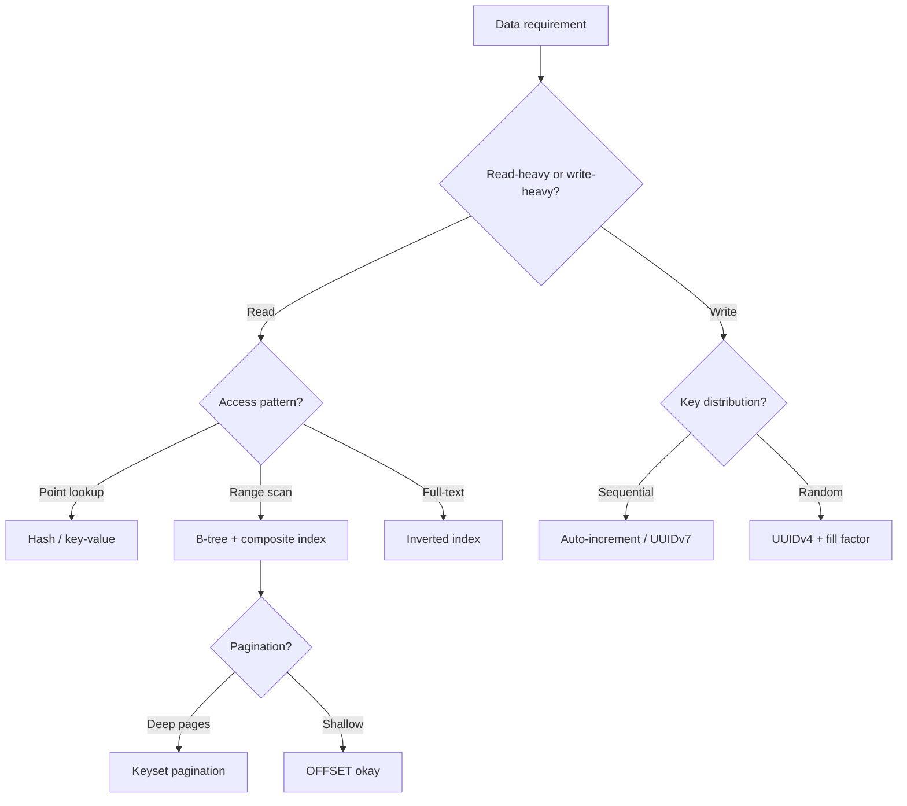

# 1. Databases & Query Performance

> **Parent**: [System Design Interview Reference](../index.md)  
> **Source**: [20 Design Interview Questions](../../../articles/databases/20-design-interview-questions.md) — Questions #1–4  
> **Also see**: [Discord Data Architecture](../../../articles/databases/discord-data-architecture-master-class.md) — Hot partitions, DB migration at scale

---

## db-01: Random UUID Indexing

> **Source**: [20 Design Interview Questions](../../../articles/databases/20-design-interview-questions.md) — Q#1


| | |
|:---|:---|
| **Problem** | `INSERT` performance degrades as table grows; high disk I/O; index fragmentation |
| **Root cause** | UUIDv4 values are cryptographically random — every insert lands at a random B-tree leaf page, causing page splits across the entire index |

**Strategy**:

| Approach | How | When to use |
|:---|:---|:---|
| **UUIDv7 / ULID** | First 48 bits = Unix timestamp → roughly sequential inserts | Default choice for distributed systems |
| **Sequential IDs** | `BIGSERIAL` / `AUTO_INCREMENT` | Single-DB, no distribution needed |
| **Cluster on business key** | Keep UUID PK but cluster on `(tenant_id, created_at)` | Multi-tenant, query by tenant |
| **Fill factor tuning** | `FILLFACTOR=80` — leave 20% free per page | Mitigation when you can't change the key type |

**Tradeoff**: UUIDv7 leaks creation time (privacy concern for user-facing IDs). ULID is case-insensitive, UUIDv7 is standard (RFC 9562).

> **Azure**: [Azure SQL indexing](../../architecture-azure/data/databases/) | **General**: §3.3 Data Architecture

---

## db-02: Keyset Pagination

> **Source**: [20 Design Interview Questions](../../../articles/databases/20-design-interview-questions.md) — Q#2


| | |
|:---|:---|
| **Problem** | `SELECT ... LIMIT 20 OFFSET 1000000` scans 1,000,020 rows to return 20 — time grows linearly with offset |
| **Root cause** | Database must scan and discard all skipped rows |

**Strategy**:

```sql
-- ❌ O(n): scans everything
SELECT * FROM users ORDER BY id LIMIT 20 OFFSET 1000000;

-- ✅ O(1): seeks to cursor position
SELECT * FROM users WHERE id > 1042 ORDER BY id LIMIT 21;
```

Fetch `LIMIT page_size + 1` to detect whether a next page exists — no `COUNT(*)` needed.

| Aspect | OFFSET/LIMIT | Keyset |
|:---|:---|:---|
| Performance | $O(n)$ degrades with depth | $O(1)$ constant |
| Jump to page N | Easy | Not possible |
| Requires unique sort column | No | Yes (+ tiebreaker) |
| Tolerates inserts mid-pagination | Yes | Can shift cursor |

**Implementation checklist**:
1. Identify a unique, indexed, sortable column (or composite: `(created_at, id)`)
2. Add `WHERE column > :last_seen_value`
3. Fetch `page_size + 1` to detect `has_next`
4. Return cursor to client

> **Azure**: Cosmos DB continuation tokens natively implement this pattern | **General**: §2.2 Query Optimization

---

## db-03: Composite Index vs. Separate Indexes

> **Source**: [20 Design Interview Questions](../../../articles/databases/20-design-interview-questions.md) — Q#3


| | |
|:---|:---|
| **Problem** | Query filters by column `A` and sorts by column `B` — database scans slowly despite having separate indexes on `A` and `B` |
| **Root cause** | Database uses only one index per table scan; separate indexes can't satisfy both filter and sort |

**Strategy — the Leftmost Prefix Rule**:

Index on `(A, B)` can serve:

| Query | Uses index? |
|:---|:---:|
| `WHERE A = ? AND B = ?` | ✅ Full |
| `WHERE A = ?` | ✅ Partial (leftmost prefix) |
| `WHERE A = ? ORDER BY B` | ✅ Filter + sort — no filesort |
| `WHERE A = ? AND B > ?` | ✅ Range scan within A |
| `WHERE B = ?` | ❌ Skips leftmost column |

**Column order heuristic**:
- Equality filters first, range filters last
- Most selective column first (reduces scan range fastest)
- If you query `(user_id, status)` AND `(user_id)` alone → `(user_id, status)` covers both

> **Azure**: [Azure SQL indexes](../../architecture-azure/data/databases/) | **General**: §2.2 Query Optimization

---

## db-04: N+1 Query Problem

> **Source**: [20 Design Interview Questions](../../../articles/databases/20-design-interview-questions.md) — Q#4


| | |
|:---|:---|
| **Problem** | 1 query for a list, then N queries for each item's associations → 101 queries for a 100-item page |
| **Root cause** | ORM lazy loading is the default; each access to an unloaded association triggers a separate query |

**Strategy**:

| Approach | Mechanism | Example |
|:---|:---|:---|
| **Eager loading** | ORM directive to JOIN in the same query | `Post.includes(:author)` (Rails), `select_related('author')` (Django) |
| **Batch loading** | Collect foreign keys → `WHERE id IN (...)` | Manual control when ORM abstraction hurts |
| **DataLoader pattern** | Per-request cache that deduplicates + batches within a tick | GraphQL (Facebook's DataLoader) |

**Detection in production**:
- Rails `bullet` gem, Django `nplusone`, Laravel debugbar (dev)
- Datadog / New Relic query-spike alerts (prod)
- Database slow-query log: repeated identical queries with different IDs in one trace

> **Azure**: App Insights query dependency tracking surfaces N+1 as repeated DB calls | **General**: §2.3 ORM Patterns

---

## Decision Flowchart: Data Layer Design



---

## db-05: Hot Partition Problem

> **Source**: [Discord Data Architecture](../../../articles/databases/discord-data-architecture-master-class.md)


| | |
|:---|:---|
| **Problem** | A single partition receives disproportionate traffic — latency spikes across the entire cluster even for unrelated queries |
| **Root cause** | Partition key causes uneven data distribution; quorum consistency amplifies the damage because every query must wait for the slow node |

**How quorum amplifies the problem**:

```
Cassandra Cluster (quorum reads/writes — must wait for 2/3 nodes)
┌──────────┐    ┌──────────┐    ┌──────────┐
│  Node A  │    │  Node B  │    │  Node C  │
│          │◄───│ hot part │───►│          │
│  normal  │    │ ●●●●●●●● │    │  normal  │
│  latency │    │ OVERLOAD │    │  latency │
│   <5ms   │    │  >125ms  │    │   <5ms   │
└──────────┘    └──────────┘    └──────────┘
        quorum = must wait for 2/3 nodes
        → hot node poisons EVERY query, not just hot-channel queries
```

**Real-world example — Discord**: The partition key `(channel_id, bucket)` kept messages for a given channel and time window co-located. A popular server with hundreds of thousands of concurrent users sent a torrent of traffic to a single partition. Every query on any channel that touched that node waited >125ms.

**Strategies**:

| Strategy | Mechanism | When to use |
|:---|:---|:---|
| **Partition key redesign** | Add high-cardinality component to spread load (e.g., `(channel_id, bucket, shard_id)`) | Can change schema |
| **Request coalescing** | Intercept duplicate reads before they reach DB — only first query hits DB | Read-heavy hot partitions (see [cache-05: Request Coalescing](../caching/caching-architecture.md#cache-05-request-coalescing-in-flight-deduplication)) |
| **Consistent hash routing** | Route same partition key to same service instance → maximize coalescing + isolate heat | Multi-instance service layer (see [api-05: Consistent Hash Routing](../api-network/api-network-design.md#api-05-consistent-hash-based-routing)) |
| **Caching layer** | Cache hot partition results in Redis/Memcached | Read-heavy, can tolerate some staleness |
| **Shard-per-core architecture** | Each CPU core owns its data slice independently — hot partition only burns one shard, not the whole node | Database engine selection (ScyllaDB vs Cassandra) |

> **Architect's rule**: Hot partitions are the **universal scaling bottleneck** in distributed databases. The partition key is your most consequential design decision — get it wrong and no amount of hardware fixes it. Always benchmark with production-like data distribution, not uniform synthetic data.

> **Azure**: Cosmos DB uses logical partition keys — same hot partition risk. Mitigate with synthetic partition keys (e.g., `userId_mod100`). Cosmos DB's RU/sec is provisioned per partition; a hot partition exhausts its RUs while other partitions sit idle. | **General**: §4.1 Data Partitioning

---

## db-06: Database Migration at Scale

> **Source**: [Discord Data Architecture](../../../articles/databases/discord-data-architecture-master-class.md)


| | |
|:---|:---|
| **Problem** | Migrating trillions of live records from one database to another without downtime or data loss |
| **Root cause** | Naive migration tools are too slow (months); stop-the-world migration is unacceptable for live services |

**Real-world example — Discord**: Migrated 4 trillion messages from Cassandra (177 nodes) to ScyllaDB (72 nodes). Initial plan using Spark migrator: **3 months**. Custom Rust migrator: **9 days**.

**Strategy — the safe migration playbook**:

```
Phase 1: Dual-writes active
  ┌──────────┐     ┌──────────┐
  │  Source  │     │  Target  │
  │ (Cassandra)│   │(ScyllaDB)│
  └─────┬────┘     └────┬─────┘
        │               │
        └─── New writes go to BOTH ───┘

Phase 2: Backfill historical data
  Custom migrator reads source → writes target
  Checkpoints progress locally (SQLite)

Phase 3: Automated validation
  Compare X% of reads across both clusters
  Alert on divergence > threshold

Phase 4: Cut-over
  Flip traffic to target only
  Keep source as read-only fallback for N days
```

| Technique | Purpose | Implementation |
|:---|:---|:---|
| **Dual-writes** | No data loss during migration window | Write to both databases simultaneously; wrap in idempotent producer |
| **Checkpointing** | Restartable migration — survive crashes without losing progress | SQLite (portable, zero-dependency) or any local KV store |
| **Automated read comparison** | Prove correctness, not just confidence | Sample X% of reads from both clusters; compare; alert on mismatch |
| **Token-range parallelism** | Maximize throughput | Partition source data by token range; run N concurrent workers |
| **Read-only fallback** | Safety net after cut-over | Keep source cluster online (read-only) for 7-30 days post-migration |

**Why SQLite for checkpoints**:

```sql
-- Each migrator worker maintains a local SQLite DB
CREATE TABLE checkpoint (
    token_range_start  BIGINT PRIMARY KEY,
    token_range_end    BIGINT,
    last_processed_key BLOB,
    rows_migrated      BIGINT,
    updated_at         TIMESTAMP DEFAULT CURRENT_TIMESTAMP
);

-- On restart: SELECT last_processed_key → resume from there
-- No lost work. No external dependency.
```

**Database comparison — why ScyllaDB over Cassandra**:

| | Cassandra | ScyllaDB |
|:---|:---|:---|
| Language | Java (JVM) | C++ |
| GC pauses | Yes — frequent latency spikes | None |
| Thread model | Shared thread pool | Shard-per-core (each core owns its data) |
| p99 read latency | 40–125ms | ~15ms |
| p99 write latency | 5–70ms | ~5ms |
| Node count (Discord) | 177 | 72 (same workload, better perf) |

> **Key insight**: API compatibility ≠ performance equivalence. ScyllaDB speaks Cassandra's CQL but executes fundamentally differently. Always benchmark your **actual workload** — the same schema on the same API can behave wildly differently.

> **Architect's rule**: Never trust a migration without continuous automated validation. Dual-writes + sampled read comparison is the minimum for any migration where data loss is unacceptable. Gut feelings don't survive trillion-record datasets.

> **Azure**: Azure Database Migration Service for SQL migrations. Cosmos DB change feed for live migrations between Cosmos containers. For Cassandra → Cosmos DB (Cassandra API), use the same dual-write + validation pattern with custom tooling.

---

## db-07: PostgreSQL 18 Async I/O — When Sequential Scans Become the Right Plan

> **Source**: [PostgreSQL 18’s Async I/O Isn’t Just Faster — It Changes How You Think About Slow Queries](../../articles/databases/PostgreSQL 18’s Async IO Isn’t Just Faster — It Changes How You Think About Slow Queries.md)

| | |
|:---|:---|
| **Problem** | A slow query is reflexively treated as a sequential-scan bug that must be indexed away, even when the workload is cold and scan-heavy |
| **Root cause** | Pre-18 PostgreSQL issues one synchronous read at a time; the CPU idles while waiting for each block from disk, making large scans disproportionately expensive |

**Strategy**:

PostgreSQL 18 introduces a native asynchronous I/O subsystem that queues multiple read requests and overlaps disk latency instead of serializing it.

| Setting | Meaning | When to use |
|:---|:---|:---|
| [`io_method = 'worker'`](../../reference-dictionary/databases.md#io-method) | Default: dedicated background I/O processes; runs everywhere | Safe default on any OS |
| [`io_method = 'io_uring'`](../../reference-dictionary/databases.md#io-uring) | Linux kernel async I/O interface; usually fastest on supported kernels | Recent Linux only; benchmark before committing |
| [`io_method = 'sync'`](../../reference-dictionary/databases.md#io-method) | Pre-18 synchronous behavior | Escape hatch for regression testing or compatibility |
| [`effective_io_concurrency`](../../reference-dictionary/databases.md#effective-io-concurrency) | Number of concurrent reads Postgres may issue (default 16 in 18) | Raise for high-latency cloud volumes; lower for single local NVMe |

Monitoring: query [`pg_aios`](../../reference-dictionary/databases.md#pg-aios) while a heavy query runs to observe in-flight async I/O.

**Tradeoff**:

- ✅ Big wins only for **cold, scan-heavy, disk-bound reads** that exceed [`shared_buffers`](../../reference-dictionary/databases.md#shared-buffers) / OS cache
- ❌ No benefit for cached data, plain index lookups, or writes (WAL is still synchronous)
- ❌ `io_method` requires a config change and restart; not a runtime knob
- ⚠️ Project benchmarks show 2–3× throughput in specific cases, but your number requires measurement on your data, your disks, and your queries

> **Architect's rule**: The index reflex is still correct for transactional hot paths, but it is no longer automatically correct for large analytical reads. Let the execution plan and measured A/B test decide, not habit.

> **Dictionary**: [io_method](../../reference-dictionary/databases.md#io-method) · [io_uring](../../reference-dictionary/databases.md#io-uring) · [effective_io_concurrency](../../reference-dictionary/databases.md#effective-io-concurrency) · [pg_aios](../../reference-dictionary/databases.md#pg-aios) · [shared_buffers](../../reference-dictionary/databases.md#shared-buffers)

---

## db-08: Primary Node as Single Point of Failure

> **Source**: [How a Fintech System Taught Me Why Netflix Uses Cassandra](../../articles/databases/how-fintech-system-taught-me-why-netflix-uses-cassandra.md)

| | |
|:---|:---|
| **Problem** | When a MongoDB primary node fails, leader election pauses all writes — the entire system stops accepting data until a new primary is elected |
| **Root cause** | Single-master architectures concentrate write authority in one node; any disruption to that node blocks the entire write path |

**Strategy**:

| Approach | Mechanism | When to use |
|:---|:---|:---|
| **Masterless / peer-to-peer** | Every node accepts writes; no leader election needed — node failure only reduces capacity, not availability | Write-availability is paramount (Cassandra, ScyllaDB, DynamoDB) |
| **Active-active replication** | Two primaries accept writes simultaneously with conflict resolution | Multi-region, can't tolerate any write downtime |
| **Faster failover** | Tune election timeout, add dedicated arbiters, pre-warm secondaries | Stuck with single-master; minimize pause window |
| **Queue-buffered writes** | Buffer writes in a queue (Kafka, SQS) during failover; replay when primary is back | Accepts eventual consistency; protects against data loss |

**Tradeoff**: Masterless systems (Cassandra) trade strong consistency guarantees for continuous write availability. Single-master systems (MongoDB, PostgreSQL) guarantee consistency at the cost of availability during leader transitions. The choice depends on whether your business can tolerate brief write pauses vs. brief data inconsistency.

> **Dictionary**: [Masterless Architecture](../../reference-dictionary/architecture-patterns.md#masterless-architecture) · [Eventual Consistency](../../reference-dictionary/cqrs-event-driven.md#eventual-consistency) · [CAP Theorem](../../reference-dictionary/databases.md#cap-theorem)

---

## db-09: Availability vs. Consistency — Business-Driven Tradeoff

> **Source**: [How a Fintech System Taught Me Why Netflix Uses Cassandra](../../articles/databases/how-fintech-system-taught-me-why-netflix-uses-cassandra.md)

| | |
|:---|:---|
| **Problem** | Different business domains require fundamentally different database guarantees — fintech cannot tolerate inconsistency, while media streaming cannot tolerate unavailability |
| **Root cause** | The CAP theorem forces a choice: during a network partition, you pick either consistency (correct data) or availability (system stays up). The right answer depends on what your business considers failure. |

**Strategy**:

| Domain | Priority | Why | Database Choice |
|:---|:---|:---|:---|
| **Fintech / payments** | Consistency | Wrong balance = real money lost | SQL (PostgreSQL), MongoDB (strong reads) |
| **Media streaming** | Availability | Off by a few seconds = invisible; down for 5 min = trending on Twitter | Cassandra, DynamoDB |
| **Social media feeds** | Availability | Stale timelines > no timelines | Cassandra, eventual-consistent stores |
| **E-commerce checkout** | Consistency | Double-charging destroys trust | SQL with strict serializability |

> **Key insight**: Netflix chose Cassandra not because it has more features than MongoDB, but because its failure mode (graceful degradation) matches Netflix's business requirements (never pause). MongoDB's failure mode (write stall during election) is incompatible with always-on streaming.

**Tradeoff**: Choosing availability means accepting that data may be briefly inconsistent across nodes. Choosing consistency means accepting that the system may briefly reject writes. There is no "best" database — only the database whose failure mode your business can survive.

> **Dictionary**: [Eventual Consistency](../../reference-dictionary/cqrs-event-driven.md#eventual-consistency) · [CAP Theorem](../../reference-dictionary/databases.md#cap-theorem) · [Masterless Architecture](../../reference-dictionary/architecture-patterns.md#masterless-architecture)

---

## db-10: Database Selection by Failure Behavior

> **Source**: [How a Fintech System Taught Me Why Netflix Uses Cassandra](../../articles/databases/how-fintech-system-taught-me-why-netflix-uses-cassandra.md)

| | |
|:---|:---|
| **Problem** | Teams select databases based on feature checklists (document model, joins, query flexibility) while ignoring failure behavior — then discover the mismatch in production |
| **Root cause** | Database marketing emphasizes features, not failure modes. The features that make development fast (schema flexibility, rich queries) often create operational fragility under load. |

**Strategy — the failure-mode-first selection framework**:

| Question | MongoDB answer | Cassandra answer |
|:---|:---|:---|
| What happens when a node dies? | Leader election pause (seconds) | Nothing — other nodes continue |
| What happens under write spike? | Primary becomes bottleneck | Spread across all nodes |
| What happens during network partition? | Partitioned side can't write | All sides can write (tunable consistency) |
| Multi-region complexity? | High — primary must be in one region | Native — any region can serve writes |
| Query flexibility? | Rich — joins, aggregations, ad-hoc | Limited — design queries first, then schema |

> **Architect's rule**: Don't pick a database for what it can do when everything works. Pick it for how it degrades when things break. The feature you'll miss most in production isn't ad-hoc queries — it's the ability to keep accepting writes when a node catches fire.

**Tradeoff**: Designing for failure behavior means accepting limitations during normal operation (Cassandra's restricted query model). Designing for developer velocity means accepting fragility during incidents (MongoDB's leader election pause). The right choice is the one whose *worst-case behavior* your business can tolerate.

> **Dictionary**: [Masterless Architecture](../../reference-dictionary/architecture-patterns.md#masterless-architecture) · [Eventual Consistency](../../reference-dictionary/cqrs-event-driven.md#eventual-consistency) · [CAP Theorem](../../reference-dictionary/databases.md#cap-theorem)
> **Azure**: Cosmos DB offers tunable consistency (5 levels from Strong to Eventual) — you can choose per-request whether to prioritize consistency or availability. This lets a single database serve both fintech (strong consistency) and streaming (eventual consistency) workloads.
