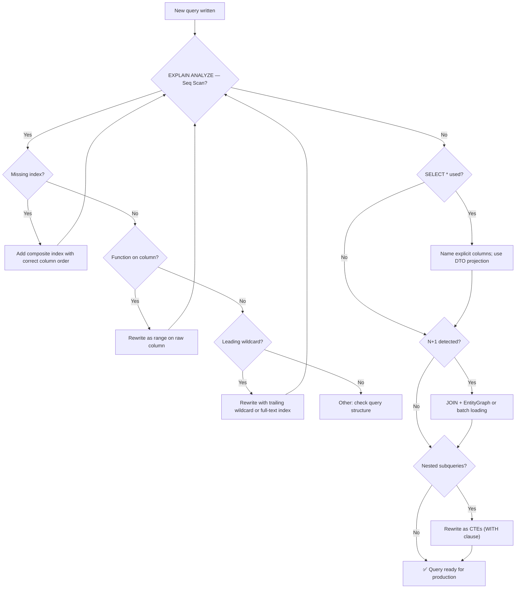

# 14. SQL Query Optimization Patterns

> **Parent**: [System Design Interview Reference](../index.md)  
> **Source**: [5 Query Optimization Patterns](../../../articles/medium/sql-query-optimization-patterns.md) — HabibWahid, May 2026  
> **Also see**: [Databases & Query Performance](databases/query-performance.md) — db-01 through db-06, [SQL System Design](databases/sql-system-design.md) — sqld-01 (Scaling Ladder), sqld-08 (Performance Checklist)

---

## sql-01: Index-Aware Query Design

> **Source**: [5 Query Optimization Patterns](../../../articles/medium/sql-query-optimization-patterns.md) — Pattern 1


| | |
|:---|:---|
| **Problem** | Queries are written without knowing whether the database can use an index to answer them — `Seq Scan` on 10M rows instead of `Index Scan` in <5ms |
| **Root cause** | Functions on indexed columns, leading wildcards, and wrong composite index column order silently disable indexes |

**Three index killers:**

```sql
-- ❌ Leading wildcard — no index on email can help
SELECT * FROM customers WHERE email LIKE '%gmail.com';

-- ❌ Function on column — disables the index on created_at entirely
SELECT * FROM orders WHERE YEAR(created_at) = 2025;

-- ❌ Wrong column order — index is on (status, created_at), query skips status
SELECT * FROM orders WHERE created_at > '2025-01-01';
```

**Strategy — index-friendly rewrites:**

```sql
-- ✅ Trailing wildcard — index works
SELECT id, name FROM customers WHERE email LIKE 'john%';

-- ✅ Range directly on column — index works
SELECT id, total FROM orders WHERE created_at >= '2025-01-01';

-- ✅ Leading column first — composite index (status, created_at) now works
SELECT id, total FROM orders WHERE status = 'PENDING' AND created_at > '2025-01-01';
```

**Declare indexes your queries need:**

```java
@Entity
@Table(name = "orders", indexes = {
    @Index(columnList = "customer_id, status"),
    @Index(columnList = "status, created_at")
})
public class Order { ... }
```

| Principle | Explanation |
|:---|:---|
| **Leftmost prefix rule** | Composite index `(A, B)` serves `WHERE A = ?` but NOT `WHERE B = ?` alone |
| **No functions on columns** | `YEAR()`, `LOWER()`, `DATE()` disable the index — use range comparisons instead |
| **Equality before range** | In composite indexes, equality-filter columns first, range-filter columns last |

> **Azure**: [Azure SQL indexes](../../architecture-azure/data/databases/) | **General**: §2.2 Query Optimization | **Related**: [db-03: Composite Index vs. Separate Indexes](databases/query-performance.md#db-03-composite-index-vs-separate-indexes)

---

## sql-02: SELECT Only What You Need

> **Source**: [5 Query Optimization Patterns](../../../articles/medium/sql-query-optimization-patterns.md) — Pattern 2


| | |
|:---|:---|
| **Problem** | `SELECT *` fetches every column across every joined table — most of which the application never touches — then ships all of it over the network |
| **Root cause** | Developers don't name columns explicitly; ORMs make `SELECT *` the path of least resistance |

**Strategy — explicit columns only:**

```sql
-- ❌ 50-column products table. You need 3 columns. You get all 50.
SELECT * FROM products
JOIN categories c ON products.category_id = c.id
WHERE products.active = true;

-- ✅ Explicit columns only
SELECT p.id, p.name, p.price
FROM products p
WHERE p.active = true
ORDER BY p.created_at DESC
LIMIT 20;
```

**ORM-level enforcement with interface projections:**

```java
public interface ProductSummary {
    Long getId();
    String getName();
    BigDecimal getPrice();
}

// JPA fetches only these three columns — not the full entity
Page<ProductSummary> findByActiveTrue(Pageable pageable);
```

| Benefit | Mechanism |
|:---|:---|
| **Covering indexes** | Database answers query entirely from the index, never touching the table |
| **No entity tracking** | Projections eliminate Hibernate's dirty-checking and session management overhead |
| **Schema resilience** | `SELECT *` breaks silently when tables change — named columns fail loudly |

> **Azure**: Use DTO projections with Cosmos DB SDK or EF Core `Select()` to minimize RU consumption | **General**: §2.2 Query Optimization

---

## sql-03: Eliminate N+1 at the SQL Level

> **Source**: [5 Query Optimization Patterns](../../../articles/medium/sql-query-optimization-patterns.md) — Pattern 3  
> **Related**: [db-04: N+1 Query Problem](databases/query-performance.md#db-04-n1-query-problem)


| | |
|:---|:---|
| **Problem** | Loading a list, then querying for related data one row at a time — 500 orders = 1,001 database round-trips |
| **Root cause** | JPA lazy loading makes N+1 invisible; each access to an unloaded association triggers a separate query |

**❌ Classic N+1 in JPA:**

```java
List<Order> orders = orderRepository.findAll(); // 1 query

orders.forEach(order -> {
    order.getCustomer().getName(); // +1 query per order
    order.getItems().size();       // +1 query per order
});
// Result: 1,001 queries for 500 orders
```

**Strategy — one JOIN replaces 1,001 queries:**

```sql
SELECT
    o.id, o.total, o.status,
    c.name           AS customer_name,
    COUNT(oi.id)     AS item_count
FROM orders o
JOIN customers c   ON o.customer_id = c.id
LEFT JOIN order_items oi ON oi.order_id = o.id
WHERE o.status = 'PENDING'
GROUP BY o.id, c.name
ORDER BY o.created_at DESC
LIMIT 50;
```

**ORM-level fix — EntityGraph:**

```java
@EntityGraph(attributePaths = {"customer", "items"})
Page<Order> findByStatus(String status, Pageable pageable);
```

| Approach | Mechanism | When to use |
|:---|:---|:---|
| **JOIN + aggregation** | Single SQL query with JOINs and `GROUP BY` | Complex reporting, counts, summaries |
| **EntityGraph / eager fetch** | ORM directive to JOIN in the same query | Standard CRUD with known associations |
| **Batch loading** | Collect foreign keys → `WHERE id IN (...)` | Manual control when ORM abstraction hurts |

> **Key rule**: Use `LEFT JOIN` when related records might not exist — `INNER JOIN` silently drops parent rows that have no children. Every database round trip has fixed overhead (connection, parsing, network) regardless of query size.

> **Azure**: App Insights dependency tracking surfaces N+1 as repeated DB calls in a single request trace | **General**: §2.3 ORM Patterns

---

## sql-04: CTEs Over Nested Subqueries

> **Source**: [5 Query Optimization Patterns](../../../articles/medium/sql-query-optimization-patterns.md) — Pattern 4


| | |
|:---|:---|
| **Problem** | Complex business queries written as deeply nested subqueries become impossible to read, debug, or optimize — each subquery is anonymous and can't be tested independently |
| **Root cause** | Nesting obscures logical flow; the query planner gets no room to optimize each step |

**❌ Three levels deep — unreadable and undebuggable:**

```sql
SELECT customer_id, total_spent FROM (
    SELECT customer_id, SUM(total) AS total_spent
    FROM orders
    WHERE customer_id IN (
        SELECT id FROM customers WHERE country = 'US'
    )
    AND status = 'COMPLETED'
    GROUP BY customer_id
) AS summary
WHERE total_spent > 1000;
```

**✅ Same result — each step named and debuggable in isolation:**

```sql
WITH us_customers AS (
    SELECT id, name FROM customers WHERE country = 'US'
),
completed_orders AS (
    SELECT o.customer_id, SUM(o.total) AS total_spent
    FROM orders o
    JOIN us_customers uc ON o.customer_id = uc.id
    WHERE o.status = 'COMPLETED'
    GROUP BY o.customer_id
    HAVING SUM(o.total) > 1000
)
SELECT uc.name, co.total_spent
FROM completed_orders co
JOIN us_customers uc ON co.customer_id = uc.id
ORDER BY co.total_spent DESC;
```

**JPA native query with CTE:**

```java
@Override
public List<CustomerSpendDTO> findHighValueCustomers(String country) {
    String sql = """
        WITH target AS (
            SELECT id, name FROM customers WHERE country = :country
        ),
        spend AS (
            SELECT customer_id, SUM(total) AS total_spent
            FROM orders WHERE status = 'COMPLETED'
            GROUP BY customer_id HAVING SUM(total) > 1000
        )
        SELECT t.name, s.total_spent FROM spend s JOIN target t ON s.customer_id = t.id
    """;
    return em.createNativeQuery(sql, "CustomerSpendMapping")
        .setParameter("country", country)
        .getResultList();
}
```

| CTE Advantage | vs. Nested Subquery |
|:---|:---|
| **Debuggable** | Run any individual CTE as a standalone query |
| **Readable** | Each step has a meaningful name — reviewed properly, not rubber-stamped |
| **Optimizable** | PostgreSQL and MySQL 8+ optimize CTEs as well as subqueries — no performance penalty |
| **Composable** | CTEs can reference earlier CTEs, building logic step by step |

> **General**: §3.3 Data Architecture | **Azure**: Azure SQL and PostgreSQL Flexible Server both support CTEs (`WITH` clause)

---

## sql-05: EXPLAIN Before You Ship

> **Source**: [5 Query Optimization Patterns](../../../articles/medium/sql-query-optimization-patterns.md) — Pattern 5


| | |
|:---|:---|
| **Problem** | Shipping queries without ever looking at how the database actually executes them — the query looks correct, the results look right, and the execution plan is scanning 4 million rows every time |
| **Root cause** | Developers test for correctness, not for execution plan — the two are unrelated |

**❌ Written, tested, shipped — plan never checked:**

```java
@Query("SELECT o FROM Order o WHERE o.status = :status AND o.createdAt > :since")
List<Order> findForReport(String status, LocalDateTime since);
// Does this use an index? Unknown. You'll find out from a production incident.
```

**✅ Read the plan before users see the latency:**

```sql
EXPLAIN ANALYZE
SELECT o.id, o.total, c.name
FROM orders o JOIN customers c ON o.customer_id = c.id
WHERE o.status = 'PENDING' AND o.created_at > '2025-01-01'
ORDER BY o.created_at DESC LIMIT 50;
```

**How to read the output:**

| Signal | Meaning | Action |
|:---|:---|:---|
| `Index Scan using idx_orders_status_created` | Index is being used ✅ | Good — ship it |
| `rows=50` near a `LIMIT` node | Database stops early ✅ | Good — LIMIT is effective |
| `Seq Scan on orders  rows=1200000` | Full table scan ❌ | Add an index |
| `Sort  rows=800000` | Sorting before LIMIT ❌ | Add index on `ORDER BY` column |

**Enable Hibernate statistics in dev to surface slow queries automatically:**

```properties
# application-dev.properties
spring.jpa.properties.hibernate.generate_statistics=true
logging.level.org.hibernate.stat=DEBUG
```

| Practice | Why |
|:---|:---|
| **Run EXPLAIN on every significant query** | `EXPLAIN` is free. Diagnosing a production slowdown at 2 AM is not |
| **Re-check plans as data grows** | A plan that uses an index at 1M rows may switch to `Seq Scan` at 10M |
| **Enable ORM statistics in dev** | Surfaces N+1 problems and slow query counts without touching DB logs |

> **General**: §7.2 Performance Engineering | **Azure**: Use Query Performance Insight in Azure SQL and `pg_stat_statements` in PostgreSQL Flexible Server

---

## Decision Flowchart: Query Optimization


