# 19. SQL System Design: From Fresher to Staff Engineer

> **Parent**: [System Design Interview Reference](../index.md)
> **Source**: [SQL for System Design: From Fresher to Staff Engineer](../../../articles/databases/sql-for-system-design.md) — The Latency Gambler, Mar 2026
> **Purpose**: Extract system-design-level SQL principles — when to use SQL, how to scale it honestly, and the architectural patterns that make SQL the backbone of production systems.
> **Also see**: [Databases & Query Performance](databases/query-performance.md) (db-01–db-06), [SQL Query Optimization](databases/sql-query-optimization.md) (sql-01–sql-05), [Concurrency & Transactions](concurrency-transactions/concurrency-transactions.md) (tx-01–tx-04)

---

## Contents

| ID | Problem | Key Concept |
|:---|:---|:---|
| [`sqld-01`](#sqld-01-the-sql-scaling-ladder) | SQL Scaling Ladder | 9-step sequence: don't climb until the current step breaks |
| [`sqld-02`](#sqld-02-sql-vs-nosql-decision-framework) | SQL vs NoSQL Decision Framework | Binary decision tree based on relationships, ACID, and schema |
| [`sqld-03`](#sqld-03-cqrs-with-sql) | CQRS with SQL | Normalized writes + materialized views for reads |
| [`sqld-04`](#sqld-04-event-sourcing-with-sql) | Event Sourcing with SQL | Immutable domain events as source of truth |
| [`sqld-05`](#sqld-05-row-level-security-for-multi-tenancy) | Row-Level Security for Multi-tenancy | DB-enforced tenant isolation, safer than application filtering |
| [`sqld-06`](#sqld-06-database-per-service--saga-pattern) | Database per Service + Saga Pattern | Microservices DB architecture without distributed transactions |
| [`sqld-07`](#sqld-07-staff-engineers-5-questions) | Staff Engineer's 5 Questions | The framework for picking any database |
| [`sqld-08`](#sqld-08-performance-checklist) | Performance Checklist | Query → Schema → Infrastructure triage |

---

## sqld-01: The SQL Scaling Ladder

> **Source**: [SQL for System Design](../../../articles/databases/sql-for-system-design.md) — §4


| | |
|:---|:---|
| **Problem** | Teams jump to sharding or distributed databases before exhausting simpler, cheaper options. |
| **Root cause** | Premature optimization driven by "web-scale" cargo culting — most systems never exceed what a single well-tuned Postgres instance can handle. |

**The 9-Step Scaling Ladder — only climb when the current step breaks:**

```mermaid
flowchart TD
    S1["<b>Step 1: Single Instance</b><br/>One DB, one connection<br/>⏱️ 0 operational overhead"]
    S2["<b>Step 2: Connection Pooling</b><br/>PgBouncer / RDS Proxy<br/>⏱️ +1 config file"]
    S3["<b>Step 3: Query Optimization</b><br/>Indexes, EXPLAIN, N+1 fixes<br/>⏱️ +0 ops, +big perf gains"]
    S4["<b>Step 4: Caching Layer</b><br/>Redis / Memcached<br/>⏱️ +1 service to manage"]
    S5["<b>Step 5: Read Replicas</b><br/>Async replication, read routing<br/>⏱️ +N servers, +lag monitoring"]
    S6["<b>Step 6: Vertical Scaling</b><br/>Bigger instance, more RAM/IOPS<br/>⏱️ +downtime or live migration"]
    S7["<b>Step 7: Partitioning</b><br/>Table splits within one DB<br/>⏱️ +schema complexity"]
    S8["<b>Step 8: Sharding</b><br/>Hash/range across multiple DBs<br/>⏱️ +router, +cross-shard hell"]
    S9["<b>Step 9: Multi-Region</b><br/>Geo-replication, failover<br/>⏱️ +consistency nightmares"]

    S1 -->|"connections<br/>exhausted"| S2
    S2 -->|"queries<br/>still slow"| S3
    S3 -->|"indexes<br/>maxed out"| S4
    S4 -->|"read volume<br/>saturates DB"| S5
    S5 -->|"write volume<br/>too high"| S6
    S6 -->|"single instance<br/>ceiling hit"| S7
    S7 -->|"partitions<br/>not enough"| S8
    S8 -->|"global<br/>latency reqs"| S9

    style S1 fill:#2e7d32,color:#fff
    style S2 fill:#388e3c,color:#fff
    style S3 fill:#43a047,color:#fff
    style S4 fill:#f9a825,color:#000
    style S5 fill:#f57c00,color:#fff
    style S6 fill:#ef6c00,color:#fff
    style S7 fill:#e65100,color:#fff
    style S8 fill:#c62828,color:#fff
    style S9 fill:#b71c1c,color:#fff
```



> **Color key**: 🟢 Green = Low complexity, do early. 🟡 Yellow = Moderate, do when needed. 🟠 Orange = Significant complexity. 🔴 Red = Last resort, most systems never reach.

**When to climb — symptoms and triggers:**

| Step | Trigger | Symptom | You Are Here If... |
|:---|:---|:---|:---|
| **1. Single Instance** | Project starts | — | One app, one DB. It works. |
| **2. Connection Pooling** | `too many connections` errors | App servers exhaust DB slots | >10 app instances connecting to one DB |
| **3. Query Optimization** | Queries >100ms | Seq Scan on large tables | `EXPLAIN` shows Seq Scan where it shouldn't |
| **4. Caching Layer** | Same queries hit DB repeatedly | DB CPU 70%+ serving identical data | Hot data that changes infrequently |
| **5. Read Replicas** | Read volume saturates primary | DB CPU 80%+ with mostly SELECTs | Read:write > 10:1, non-critical reads |
| **6. Vertical Scaling** | Write volume outgrows instance | IOPS limit, write throughput ceiling | Need 2–4× more; horizontal not yet justified |
| **7. Partitioning** | Large tables slowing queries | Multi-GB tables, time-based access | Most queries filter on partitionable column |
| **8. Sharding** | Write volume exceeds single instance | Single DB can't keep up with writes | Thousands of writes/sec after step 6 exhausted |
| **9. Multi-Region** | Global user base, latency reqs | Users on another continent see 300ms+ p95 | Active users on 2+ continents; data residency |

**The Golden Rule:**

> Before you add infrastructure, ask: **"Can I fix this with better SQL instead of more servers?"**

A single well-tuned Postgres instance on modern hardware handles: **~10 TB** data, **~10,000 writes/sec**, **~100,000 reads/sec**. Steps 1–3 solve 90% of problems. Steps 4–6 solve the next 9%. Steps 7–9 are for the remaining 1%.

**Cross-reference**: This is the database-specific scaling sequence. For the general principle of not over-engineering, see [`prag-06`: Solve Today's Problems, Not Tomorrow's](system-design-interview/pragmatic-takeaways.md#prag-06-solve-todays-problems-not-tomorrows) and [`prag-08`: Boring Architecture Wins](system-design-interview/pragmatic-takeaways.md#prag-08-boring-architecture-wins).

---

## sqld-02: SQL vs NoSQL Decision Framework

> **Source**: [SQL for System Design](../../../articles/databases/sql-for-system-design.md) — §5


| | |
|:---|:---|
| **Problem** | Teams choose NoSQL for scale that never arrives, then spend years fighting the absence of joins and transactions. |
| **Root cause** | Technology selection driven by hype ("NoSQL scales better") rather than data shape, access patterns, and consistency requirements. |

**Strategy — the binary decision tree:**

```text
            Does your data have complex relationships?
                    /                    \
                  YES                    NO
                   │                      │
          Need ACID transactions?    Schema flexible/unpredictable?
          /             \             /                \
        YES              NO         YES                NO
         │                │           │                  │
    Use SQL          Evaluate       Document DB        Key-Value /
  (Postgres,        by access      (MongoDB)          Column Store
    MySQL)          patterns                     (Cassandra, DynamoDB)
```

**Decision factors — ask in this order:**

| # | Question | If YES → | If NO → |
|:---|:---|:---|:---|
| 1 | Does data have **complex relationships** (JOINs, FKs)? | Continue to #2 | Continue to #3 |
| 2 | Do you need **ACID transactions**? | **Use SQL** (Postgres, MySQL) | Evaluate by access patterns |
| 3 | Is the **schema flexible/unpredictable**? | **Document DB** (MongoDB) | **Key-Value / Column Store** (Cassandra, DynamoDB) |

**The most common mistake at every level:**

> Choosing NoSQL for scale that never arrives, then spending years fighting the absence of joins and transactions. SQL handles more than most systems will ever demand.

**Cross-reference**: For the Staff-level lens on database selection, see [`sqld-07`](#sqld-07-staff-engineers-5-questions).

---

## sqld-03: CQRS with SQL

> **Source**: [SQL for System Design](../../../articles/databases/sql-for-system-design.md) — §6


| | |
|:---|:---|
| **Problem** | Complex read patterns (aggregations, multi-table joins) compete with write throughput on the same database, especially in high-read systems. |
| **Root cause** | Using the same normalized schema for both writes (OLTP) and reads (reporting/dashboards) — two workloads with opposite optimization goals. |

**Strategy — separate write and read models:**

```text
  ┌─────────┐  Commands  ┌──────────────┐
  │ Client  │───────────►│ Write Model  │──► SQL Primary (normalized)
  │         │            └──────┬───────┘
  │         │  Queries          │ async projection
  │         │◄─────────  ┌──────▼───────┐
  └─────────┘            │  Read Model  │──► Materialized View / Replica
                         │(denormalized)│
                         └──────────────┘
```

**Implementation with materialized views:**

```sql
-- Write side: normalized, ACID
INSERT INTO orders(user_id, status) VALUES (42, 'PLACED');

-- Read side: pre-aggregated materialized view
CREATE MATERIALIZED VIEW order_summary AS
SELECT
  u.email,
  COUNT(o.id)                AS total_orders,
  SUM(oi.quantity * p.price) AS total_spent
FROM users u
JOIN orders o ON o.user_id = u.id
JOIN order_items oi ON oi.order_id = o.id
JOIN products p ON p.id = oi.product_id
GROUP BY u.email;

REFRESH MATERIALIZED VIEW CONCURRENTLY order_summary;
```

| Principle | Why |
|:---|:---|
| **Write model stays normalized** | ACID guarantees, no data duplication at write time |
| **Read model is denormalized** | Pre-joined, pre-aggregated — instant reads, no runtime JOINs |
| **Async projection** | Write path is fast; read model updates with acceptable lag |
| **Materialized views are rebuildable** | Drop and recreate from source of truth if they drift |

> **Azure**: [Azure SQL Materialized Views](https://learn.microsoft.com/en-us/azure/azure-sql/) | **General**: §3.3 Event-Driven & Messaging, CQRS pattern

---

## sqld-04: Event Sourcing with SQL

> **Source**: [SQL for System Design](../../../articles/databases/sql-for-system-design.md) — §6


| | |
|:---|:---|
| **Problem** | Current-state-only databases lose the "how did we get here?" — making audit trails, time-travel queries, and debugging impossible. |
| **Root cause** | UPDATE and DELETE mutate state in place — the previous state is destroyed. |

**Strategy — store state changes as an immutable event log:**

```sql
-- Immutable event log — append-only, never UPDATE or DELETE
CREATE TABLE domain_events (
  id           BIGSERIAL PRIMARY KEY,
  aggregate_id UUID NOT NULL,
  type         VARCHAR(100) NOT NULL,
  payload      JSONB NOT NULL,
  created_at   TIMESTAMP DEFAULT NOW()
);

-- Rebuild current state by replaying events in order
SELECT * FROM domain_events
WHERE aggregate_id = 'order-uuid-123'
ORDER BY id ASC;
```

| Principle | Why |
|:---|:---|
| **Events are source of truth** | The event log is the authoritative record — everything else is derived |
| **Projections are derived** | Current state, materialized views, and read models are computed from events and can be rebuilt |
| **Append-only** | No UPDATE or DELETE on events — full audit trail, no data loss |
| **Time-travel built in** | Replay events up to any point in time to see past state |
| **JSONB for payload** | Schema flexibility per event type while keeping relational queryability |

**Tradeoff**: Event sourcing adds storage cost (every state change is a row) and query complexity (current state requires a projection). Use it when audit, traceability, or rebuild capability matters more than simplicity.

> **Azure**: [Event Hubs Capture](https://learn.microsoft.com/en-us/azure/event-hubs/event-hubs-capture-overview) + Azure SQL for durable event storage | **General**: §3.3 Event Sourcing pattern

---

## sqld-05: Row-Level Security for Multi-tenancy

> **Source**: [SQL for System Design](../../../articles/databases/sql-for-system-design.md) — §6


| | |
|:---|:---|
| **Problem** | Application-level tenant filtering is fragile — one missing `WHERE tenant_id = ?` clause leaks data across tenants. |
| **Root cause** | Security enforced in application code, not at the database level — every query, every developer, every code path must remember the filter. |

**Strategy — enforce isolation at the database level:**

```sql
ALTER TABLE orders ENABLE ROW LEVEL SECURITY;

CREATE POLICY tenant_isolation ON orders
  USING (tenant_id = current_setting('app.current_tenant')::BIGINT);

-- Set per connection in middleware (once per request)
SET app.current_tenant = '42';

-- Every query now automatically scoped — even if app code has a bug
SELECT * FROM orders; -- only sees tenant 42's data
```

| Principle | Why |
|:---|:---|
| **DB-level enforcement** | Database rejects unauthorized reads at the storage layer — no code path can bypass it |
| **Set once per session** | Middleware sets `app.current_tenant` at connection start; all subsequent queries inherit the filter |
| **Defense in depth** | Application filtering is the first line; RLS is the last line that catches bugs |
| **Zero query modification** | Existing queries work unchanged — the DB adds the filter transparently |

> **Azure**: [Azure SQL Row-Level Security](https://learn.microsoft.com/en-us/sql/relational-databases/security/row-level-security) | **General**: §6.2 Multi-tenancy Security Patterns

---

## sqld-06: Database per Service + Saga Pattern

> **Source**: [SQL for System Design](../../../articles/databases/sql-for-system-design.md) — §7


| | |
|:---|:---|
| **Problem** | Microservices sharing a single database creates tight coupling — any schema change risks all services; cross-service joins become implicit dependencies. |
| **Root cause** | The database becomes the integration layer instead of well-defined APIs or events. |

**Strategy — Database per service:**

```text
❌ WRONG: Shared database (tight coupling)
┌──────────┐  ┌──────────┐  ┌──────────┐
│Service A │  │Service B │  │Service C │
└────┬─────┘  └────┬─────┘  └────┬─────┘
     └──────────────┼──────────────┘
                ┌───▼────┐
                │ One DB │  ← any schema change risks all services
                └────────┘

✅ RIGHT: Database per service
┌──────────┐  ┌──────────┐  ┌──────────┐
│Service A │  │Service B │  │Service C │
└────┬─────┘  └────┬─────┘  └────┬─────┘
┌────▼─────┐  ┌────▼─────┐  ┌────▼─────┐
│  DB A    │  │  DB B    │  │  DB C    │
└──────────┘  └──────────┘  └──────────┘
```

**For cross-service transactions, use the Saga pattern:**

```text
Order Service        Payment Service      Inventory Service
     │                     │                     │
 Create order              │                     │
 (PENDING)                 │                     │
     │──event:OrderCreated──►                    │
     │                     │                     │
     │              Charge payment                │
     │                     │──event:PaymentDone──►│
     │                     │                     │
     │                     │             Reserve stock
     │◄────────────────────│◄──event:StockReserved┘
     │
 Mark CONFIRMED
```

| Principle | Why |
|:---|:---|
| **Each step = local ACID** | Every service uses its own DB with full transaction guarantees |
| **Failed step → compensating action** | Refund payment, release stock — reverse the side effects, don't roll back across DBs |
| **No distributed lock** | Events carry the state; services react independently |
| **No cross-DB joins** | Services communicate via APIs or events, not SQL |

> **Azure**: [Service Bus](https://learn.microsoft.com/en-us/azure/service-bus-messaging/) for Saga orchestration + [Azure SQL](https://learn.microsoft.com/en-us/azure/azure-sql/) per microservice | **General**: §3.3 Saga Pattern

---

## sqld-07: Staff Engineer's 5 Questions

> **Source**: [SQL for System Design](../../../articles/databases/sql-for-system-design.md) — §9


| | |
|:---|:---|
| **Problem** | Database selection debates get stuck on syntax, features, and benchmarks instead of system properties that actually determine success or failure at scale. |
| **Root cause** | Evaluating databases like features in a product comparison table instead of as architectural components with operational and team-level implications. |

**Strategy — ask these five questions, in order, before picking any database:**

| # | Question | Why It's Decisive |
|:---|:---|:---|
| **1** | **What's the consistency requirement?** | Financial transactions need ACID. Social feeds can tolerate eventual consistency. This single question eliminates most alternatives. |
| **2** | **What's the read/write ratio?** | 80% reads → optimize reads (indexes, replicas, cache). Predominantly writes (event ingestion, logging) → write-optimized stores become competitive. |
| **3** | **What are the access patterns?** | Lookups by PK → any DB. Range scans by time → partitioned SQL or Cassandra. Complex graph traversals → dedicated graph DB. *Describe the query before picking the engine.* |
| **4** | **What does the team know how to operate?** | A database nobody knows how to tune, backup, or recover is an operational risk. **Boring and well-understood beats exotic and powerful.** |
| **5** | **What's the realistic data scale in 2 years?** | If you're not approaching hundreds of millions of rows or thousands of writes/sec, you almost certainly don't need a distributed store. A well-tuned Postgres handles terabytes. |

**The meta-principle:**

> At Staff level, the conversation is about system properties (consistency, operability, realistic scale), not query syntax or feature checklists.

**Cross-reference**: Questions 1, 2, and 3 feed directly into the [`sqld-02` SQL vs NoSQL decision tree](#sqld-02-sql-vs-nosql-decision-framework). Question 5 aligns with [`prag-06`: Solve Today's Problems](system-design-interview/pragmatic-takeaways.md#prag-06-solve-todays-problems-not-tomorrows).

---

## sqld-08: Performance Checklist

> **Source**: [SQL for System Design](../../../articles/databases/sql-for-system-design.md) — §8


| | |
|:---|:---|
| **Problem** | Performance issues are debugged ad-hoc — no systematic triage from query to schema to infrastructure. |
| **Root cause** | Teams jump to infrastructure changes (more replicas, bigger instances) before fixing query and schema issues that are cheaper and higher-impact. |

**Strategy — triage in order: Query → Schema → Infrastructure:**

### Query Level (cheapest, highest impact)

- [ ] `EXPLAIN ANALYZE` every slow query — look for `Seq Scan` on large tables
- [ ] No `SELECT *` in production code — explicit columns only
- [ ] N+1 query patterns eliminated — batch with `JOIN`s or `WHERE IN (...)`
- [ ] Keyset (cursor) pagination instead of `OFFSET`

```sql
-- ❌ Slow at page 500 (scans and discards 10,000 rows)
SELECT * FROM orders ORDER BY id LIMIT 20 OFFSET 10000;

-- ✅ Fast regardless of page (uses index, no scan)
SELECT * FROM orders WHERE id > :last_seen_id ORDER BY id LIMIT 20;
```

### Schema Level

- [ ] Every foreign key has an index
- [ ] Composite indexes match actual query patterns (see [`sql-01`: Index-Aware Query Design](databases/sql-query-optimization.md#sql-01-index-aware-query-design))
- [ ] Unused indexes dropped — each one costs write performance
- [ ] JSONB query columns have GIN indexes

### Infrastructure Level

- [ ] Connection pooler in front of DB (PgBouncer or RDS Proxy)
- [ ] Read replicas handling reports and dashboards (not the primary)
- [ ] Autovacuum configured (Postgres) — prevents table bloat
- [ ] `work_mem` tuned for sort/hash-heavy queries

> **The triage rule**: Fix query-level issues first (free, often 10× improvement), then schema (free, can be 10× more), then infrastructure (costs money and ops time). In that order.

**Cross-reference**: For query-level patterns in depth, see [`sql-01` through `sql-05`](databases/sql-query-optimization.md). For the scaling infrastructure sequence, see [`sqld-01`](#sqld-01-the-sql-scaling-ladder).

---

## Quick Reference

| Your Situation | Go To |
|:---|:---|
| "Should I use SQL or NoSQL?" | [`sqld-02`](#sqld-02-sql-vs-nosql-decision-framework) + [`sqld-07`](#sqld-07-staff-engineers-5-questions) |
| "When should I add read replicas?" | [`sqld-01`](#sqld-01-the-sql-scaling-ladder) — Step 5 |
| "When should I shard?" | [`sqld-01`](#sqld-01-the-sql-scaling-ladder) — Step 8 (after exhausting Steps 1–7) |
| "How do I separate reads from writes?" | [`sqld-03`](#sqld-03-cqrs-with-sql) |
| "How do I audit every data change?" | [`sqld-04`](#sqld-04-event-sourcing-with-sql) |
| "How do I isolate tenants in a shared DB?" | [`sqld-05`](#sqld-05-row-level-security-for-multi-tenancy) |
| "How do microservices share data?" | [`sqld-06`](#sqld-06-database-per-service--saga-pattern) — they don't |
| "My query is slow, what now?" | [`sqld-08`](#sqld-08-performance-checklist) — start at Query Level |
| "What does my DB need right now?" | [`sqld-01`](#sqld-01-the-sql-scaling-ladder) — find your symptom in the trigger table |
