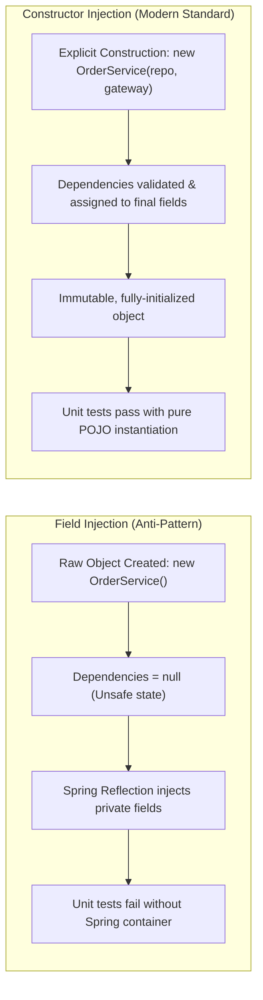
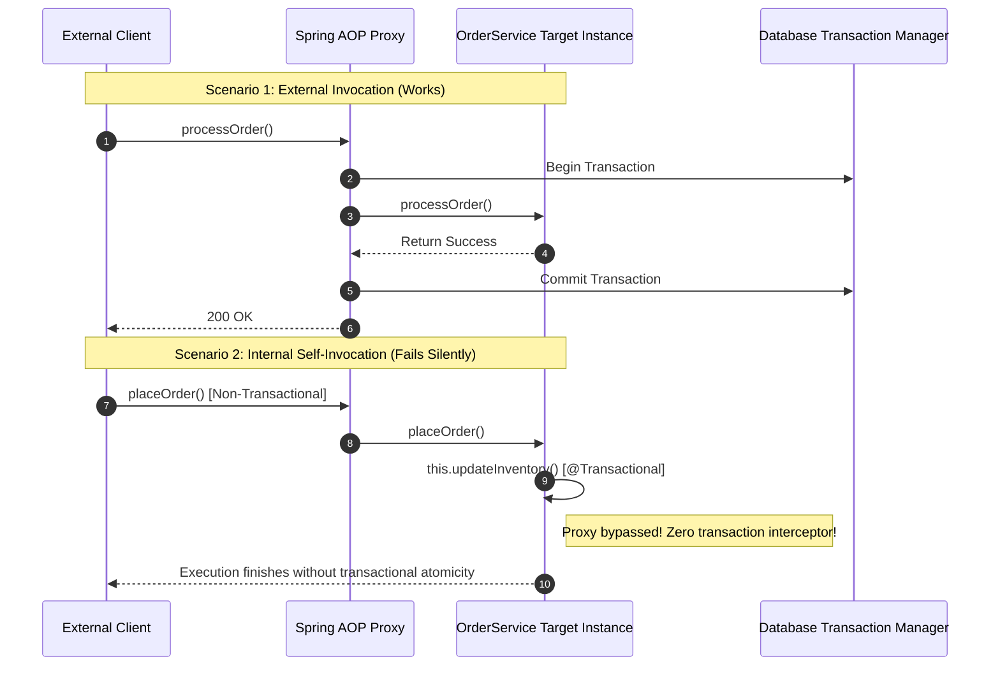
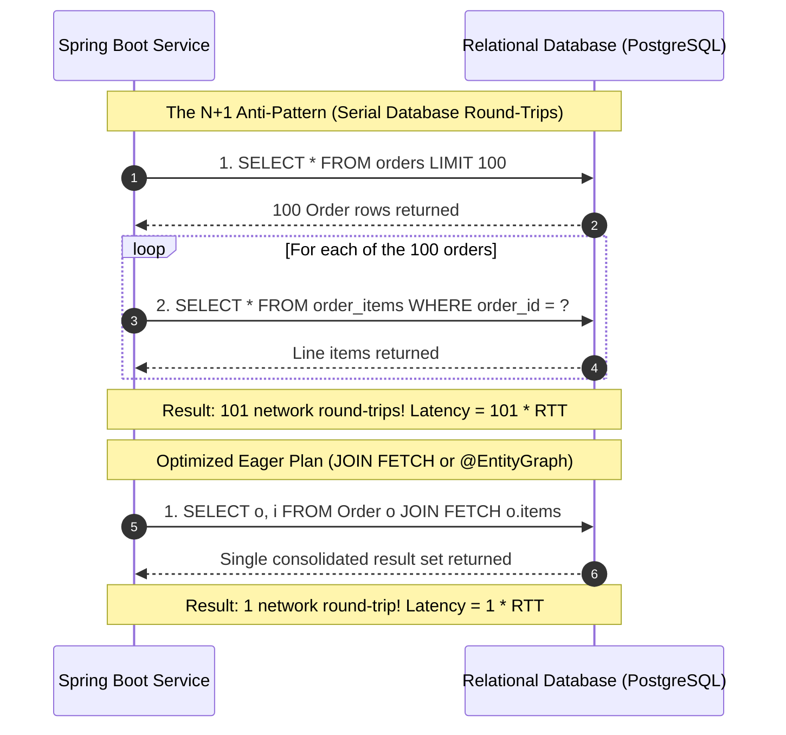
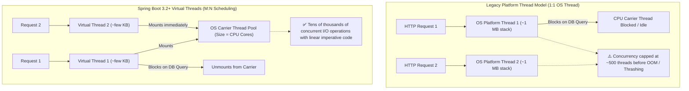

# 65. Modern Spring Boot Architecture & Migration Patterns — Key Takeaways

> **Parent**: [System Design Interview Reference](../index.md)  
> **Source**: [These Spring Boot Patterns Are Outdated](../../articles/jvm-runtime/these-spring-boot-patterns-are-outdated.md)  
> **Author**: Umesh Kumar Yadav, published September 09, 2026  
> **Purpose**: Formalize enterprise system design patterns, architectural tradeoffs, and operational modernization paths for Spring Boot backend services transitioning from 2.x to 3.x and toward 4.x. Addresses dependency encapsulation, proxy-based cross-cutting boundaries, type-safe configuration governance, standardized error contracts, ORM query efficiency, and I/O concurrency models.  
> **Also see**: [JVM Memory & GC](jvm-memory-gc.md) (`jvm-01`–`jvm-09`), [JVM Thread Model vs Go](jvm-thread-model-vs-go.md) (`jvm-10`–`jvm-13`), [Modern Java Evolution](modern-java-evolution-takeaways.md) (`jvm-14`–`jvm-19`), [Microservices Runtime Performance](../performance/microservices-runtime-performance.md) (`perf-01`–`perf-08`), [API Design Patterns](../api-network/api-design-patterns.md) (`apipat-01`–`apipat-12`)  
> **Dictionary**: [Constructor Injection](../../reference-dictionary/java-jvm.md#constructor-injection), [AOP Proxy Self-Invocation](../../reference-dictionary/java-jvm.md#aop-proxy-self-invocation), [Type-Safe Configuration Properties](../../reference-dictionary/java-jvm.md#type-safe-configuration-properties), [RestClient](../../reference-dictionary/java-jvm.md#restclient), [RFC 7807 Problem Details](../../reference-dictionary/api-design.md#rfc-7807-problem-details), [N+1 Query Problem](../../reference-dictionary/databases.md#n1-query-problem), [SecurityFilterChain](../../reference-dictionary/security-iam.md#securityfilterchain), [Virtual Threads](../../reference-dictionary/java-jvm.md#virtual-threads)  
> **Azure Services**: [Azure Spring Apps](../../architecture-azure/compute/), [Azure Container Apps](../../architecture-azure/compute/), [Azure Database for PostgreSQL](../../architecture-azure/data/)  
> **Taxonomy Reference**: §2.1 Application Architecture Patterns, §2.3 Concurrency & Asynchronous Processing  

---

## Contents

| ID | Problem | Key Concept |
|:---|:---|:---|
| [`jvm-20`](#jvm-20-constructor-injection-vs-field-injection--eliminating-hidden-dependencies--container-coupling) | `@Autowired` field injection hides dependencies, allows circular coupling, and complicates unit testing | Constructor Injection: Explicit contracts, immutability (`final`), and dependency bloat telemetry |
| [`jvm-21`](#jvm-21-type-safe-configuration-objects-configurationproperties-over-scattered-value) | Scattered `@Value` annotations lack type safety, centralized validation, and fail-fast startup guarantees | `@ConfigurationProperties`: Centralized, validated (JSR-380), cohesive configuration domain models |
| [`jvm-22`](#jvm-22-spring-aop-proxy-self-invocation--transactional-boundary-traps) | Internal method calls and private annotations silently bypass `@Transactional` proxy interception | AOP Proxy Boundaries: Separation of concerns, explicit rollback policies, and public service contracts |
| [`jvm-23`](#jvm-23-modern-synchronous-http-client-architecture-restclient-over-legacy-resttemplate) | `RestTemplate` enters maintenance mode; developers adopt reactive WebFlux unnecessarily for sync I/O | `RestClient`: Fluent synchronous HTTP client coupled with Virtual Threads for lightweight I/O |
| [`jvm-24`](#jvm-24-standardized-api-error-contracts-via-rfc-7807-problemdetail) | Disjointed microservice teams return proprietary JSON error maps, breaking client retry & telemetry | RFC 7807 `ProblemDetail`: Deterministic, machine-readable HTTP error payloads |
| [`jvm-25`](#jvm-25-orm-access-optimization-eliminating-the-jpa-n1-query-cascade) | `LAZY` entity relationships execute serial per-row queries, exhausting connection pools under traffic | Explicit Fetch Plans: `JOIN FETCH`, `@EntityGraph`, and Hibernate `@BatchSize` |
| [`jvm-26`](#jvm-26-virtual-threads-vs-webflux-for-modern-high-concurrency-spring-services) | Reactive programming introduces debugging overhead and stack trace loss for standard CRUD workloads | Spring MVC + Virtual Threads: High concurrent I/O throughput with imperative simplicity |

---

## jvm-20: Constructor Injection vs. Field Injection — Eliminating Hidden Dependencies & Container Coupling

> **Source**: [1. Stop Using @Autowired Field Injection](../../articles/jvm-runtime/these-spring-boot-patterns-are-outdated.md#1-stop-using-autowired-field-injection)

| | |
|:---|:---|
| **Problem** | A legacy microservice relies heavily on `@Autowired` field injection. Classes instantiate with missing dependencies during isolated unit tests, causing unexpected `NullPointerException`s unless the entire Spring `ApplicationContext` is booted or awkward reflection mocks are configured. Over time, service classes silently accumulate 12–15 dependencies because there is no visual or syntactic friction preventing class bloat. |
| **Root cause** | Field injection injects dependencies directly into private fields via reflection after instance construction. Because dependencies bypass the constructor, the class cannot enforce required invariants at instantiation time, cannot declare fields `final`, and conceals violations of the Single Responsibility Principle (SRP). |

### Strategy

Enforce **Constructor Injection** across all Spring components. When using Lombok, leverage `@RequiredArgsConstructor` with `private final` fields:

```java
// Anti-Pattern: Field Injection
@Service
public class OrderService {
    @Autowired private OrderRepository orderRepo;
    @Autowired private PaymentGateway paymentGateway;
    @Autowired private InventoryClient inventoryClient;
}

// Modern Production Pattern: Explicit Constructor Injection
@Service
public class OrderService {
    private final OrderRepository orderRepo;
    private final PaymentGateway paymentGateway;
    private final InventoryClient inventoryClient;

    // Single constructor: Spring automatically autowires without @Autowired annotation
    public OrderService(
            OrderRepository orderRepo,
            PaymentGateway paymentGateway,
            InventoryClient inventoryClient) {
        this.orderRepo = Objects.requireNonNull(orderRepo, "orderRepo must not be null");
        this.paymentGateway = Objects.requireNonNull(paymentGateway, "paymentGateway must not be null");
        this.inventoryClient = Objects.requireNonNull(inventoryClient, "inventoryClient must not be null");
    }
}
```



### Tradeoff

| Dimension | Field Injection (`@Autowired`) | Constructor Injection |
|:---|:---|:---|
| **Immutability** | Impossible (fields must remain mutable for reflection) | Guaranteed (`private final` fields) |
| **Unit Testability** | Poor (requires `@SpringBootTest` or Mockito reflection) | Excellent (instantiate via plain `new` in milliseconds) |
| **Architectural Telemetry** | Low (adding 10 fields looks like 10 lines of code) | High (a constructor with >5 parameters triggers code smell alarms) |
| **Circular Dependencies** | Hidden and deferred until runtime | Detected immediately at startup or compile-time |

**Cross-reference**: [Constructor Injection](../../reference-dictionary/java-jvm.md#constructor-injection)

---

## jvm-21: Type-Safe Configuration Objects (@ConfigurationProperties) over Scattered @Value

> **Source**: [2. Don’t Use @Value for Large Configuration Objects](../../articles/jvm-runtime/these-spring-boot-patterns-are-outdated.md#2-dont-use-value-for-large-configuration-objects)

| | |
|:---|:---|
| **Problem** | A distributed service references dozens of environment variables and application properties scattered across controllers, clients, and repositories using `@Value("${app.service.timeout:5000}")`. Typos in property names remain undetected until runtime invocation, type conversions fail intermittently, and teams cannot discover which configuration knobs exist across the repository. |
| **Root cause** | `@Value` uses string-based SpEL expressions evaluated on individual fields. It provides no schema validation, lacks property grouping, cannot enforce JSR-380 bean constraints at startup, and provides zero IDE autocomplete or documentation metadata. |

### Strategy

Replace scattered `@Value` declarations with centralized, hierarchical, validated `@ConfigurationProperties` domain models:

```java
// Dedicated, type-safe configuration object
@Configuration
@ConfigurationProperties(prefix = "payment.gateway")
@Validated
public class PaymentGatewayProperties {

    @NotBlank(message = "Base URL is mandatory")
    @Pattern(regexp = "^https://.*", message = "Gateway communication must use TLS")
    private String baseUrl;

    @Min(value = 1, message = "Timeout must be positive")
    @Max(value = 30, message = "Timeout must not exceed gateway SLA of 30 seconds")
    private int timeoutSeconds = 5;

    @NotNull
    private Duration connectTimeout = Duration.ofMillis(1000);

    @Valid
    private RetryPolicy retry = new RetryPolicy();

    public static class RetryPolicy {
        @Min(0) @Max(5)
        private int maxAttempts = 3;
        private Duration backoff = Duration.ofMillis(200);
        // Getters / Setters
    }

    // Getters and Setters
}
```

Enable Spring Boot configuration annotation processor in `pom.xml` / `build.gradle` to generate `META-INF/spring-configuration-metadata.json`. This provides instant IDE autocomplete, validation warnings, and documentation across `application.yml`.

### Tradeoff

| Dimension | Scattered `@Value` | `@ConfigurationProperties` |
|:---|:---|:---|
| **Validation Timing** | Late (evaluated when bean initializes or method runs) | Fail-fast at application boot via JSR-380 |
| **Hierarchical Structure** | Flat, repetitive string prefixes | Nested, strongly-typed object graphs |
| **Refactoring Safety** | Fragile (search-and-replace across strings) | Type-safe IDE refactoring and compile checks |
| **Configuration Discoverability** | Low (buried across individual classes) | High (single schema definition per subsystem) |

**Cross-reference**: [Type-Safe Configuration Properties](../../reference-dictionary/java-jvm.md#type-safe-configuration-properties)

---

## jvm-22: Spring AOP Proxy Self-Invocation & Transactional Boundary Traps

> **Source**: [3. @Transactional Is Powerful — and Easy to Misuse](../../articles/jvm-runtime/these-spring-boot-patterns-are-outdated.md#3-transactional-is-powerful--and-easy-to-misuse)

| | |
|:---|:---|
| **Problem** | An e-commerce service calls a private or internal method annotated with `@Transactional` (`this.updateInventory()`). During an order processing failure, the database operation does not roll back, leaving corrupt data in the inventory table. Code reviews consistently miss this flaw because the annotation looks completely normal in isolation. |
| **Root cause** | Spring implements declarative middleware (`@Transactional`, `@Async`, `@Cacheable`, `@Secured`) via runtime AOP dynamic proxies (CGLIB or JDK dynamic proxies). When method A calls method B within the same bean using `this.methodB()`, the call executes directly on the target instance, completely bypassing the proxy wrapper and its transaction interceptor chain. Furthermore, Spring's default rollback policy only rolls back on unchecked (`RuntimeException` / `Error`), ignoring checked exceptions. |



### Strategy

1. **Enforce Boundary Separation**: Extract transactional logic into distinct, dedicated collaborator services rather than keeping helper methods inside the same class.
2. **Configure Explicit Rollback Policies**: Always declare `rollbackFor = Exception.class` unless checked exceptions are explicitly intended to permit database commits.
3. **Never Swallow Exceptions in Transactional Scopes**: If a `try-catch` block catches a failure without re-throwing or invoking `TransactionAspectSupport.currentTransactionStatus().setRollbackOnly()`, Spring assumes the business operation succeeded and issues a `COMMIT`.
4. **Isolate `REQUIRES_NEW`**: Use `Propagation.REQUIRES_NEW` strictly for independent append-only concerns (e.g., security audit logs or payment attempt tracking). Be aware that `REQUIRES_NEW` requires a second physical database connection from the connection pool, creating a deadlock risk if the pool is exhausted.

```java
// Boundary Separation: Dedicated transactional component
@Service
@RequiredArgsConstructor
public class OrderPlacementCoordinator {

    private final InventoryTransactionalService inventoryService;
    private final OrderRepository orderRepo;

    public OrderResult placeOrder(OrderRequest request) {
        // Step 1: Execute transactional inventory reservation via proxy
        inventoryService.reserveInventory(request.items());

        // Step 2: Proceed with external non-transactional orchestration
        return new OrderResult("CONFIRMED");
    }
}

@Service
public class InventoryTransactionalService {

    @Transactional(rollbackFor = Exception.class)
    public void reserveInventory(List<OrderItem> items) {
        // Correctly intercepted by Spring AOP proxy
        for (OrderItem item : items) {
            // updates executed atomically
        }
    }
}
```

### Tradeoff

| Pattern | Operational Risk | Architectural Purity |
|:---|:---|:---|
| **Self-invocation (`this.method()`)** | Extreme (silent data corruption, false transaction expectation) | Low (monolithic service with mixed concerns) |
| **`AopContext.currentProxy()` hack** | Moderate (tightly couples domain code to Spring AOP internals) | Low (leaks infrastructure into business logic) |
| **Collaborator Service Extraction** | None (guaranteed proxy interception on public methods) | High (enforces modular cohesion and single responsibility) |

**Cross-reference**: [AOP Proxy Self-Invocation](../../reference-dictionary/java-jvm.md#aop-proxy-self-invocation)

---

## jvm-23: Modern Synchronous HTTP Client Architecture: RestClient over Legacy RestTemplate

> **Source**: [6. RestTemplate Is Entering the Legacy Zone](../../articles/jvm-runtime/these-spring-boot-patterns-are-outdated.md#6-resttemplate-is-entering-the-legacy-zone)

| | |
|:---|:---|
| **Problem** | A legacy microservice network relies on `RestTemplate` for inter-service communication. As the team migrates to Spring Boot 3, developers encounter deprecated methods and verbose template boilerplate. Some teams overcompensate by pulling in `spring-boot-starter-webflux` solely to use `WebClient`, unnecessarily introducing Project Reactor dependencies, Mono/Flux complexity, and reactive runtime overhead into a standard synchronous pipeline. |
| **Root cause** | `RestTemplate` was designed over 15 years ago with an overloaded, procedural method surface. When `WebClient` was introduced, Spring lacked a modern fluent HTTP client for synchronous workloads. Developers mistakenly conflated modern API ergonomics with reactive programming. |

### Strategy

Adopt **`RestClient`** (introduced in Spring Framework 6.1 / Spring Boot 3.2). `RestClient` offers the modern, fluent, functional programming model of `WebClient` while running synchronously on top of standard HTTP libraries (Apache HttpClient, OkHttp, or Java `HttpClient`):

```java
@Configuration
public class ClientConfiguration {

    @Bean
    public RestClient paymentRestClient(PaymentGatewayProperties properties) {
        return RestClient.builder()
                .baseUrl(properties.getBaseUrl())
                .defaultHeader(HttpHeaders.CONTENT_TYPE, MediaType.APPLICATION_JSON_VALUE)
                .requestFactory(new JdkClientHttpRequestFactory())
                .build();
    }
}

@Service
@RequiredArgsConstructor
public class PaymentClient {

    private final RestClient paymentRestClient;

    public PaymentResponse authorize(PaymentRequest request) {
        return paymentRestClient.post()
                .uri("/v1/authorizations")
                .body(request)
                .retrieve()
                .onStatus(HttpStatusCode::is4xxClientError, (req, res) -> {
                    throw new PaymentClientException("Client error: " + res.getStatusCode());
                })
                .onStatus(HttpStatusCode::is5xxServerError, (req, res) -> {
                    throw new PaymentGatewayException("Gateway unavailable: " + res.getStatusCode());
                })
                .body(PaymentResponse.class);
    }
}
```

When coupled with Java 21 Virtual Threads (`spring.threads.virtual.enabled=true`), `RestClient` achieves high concurrent throughput without the cognitive overhead of reactive streams.

### Tradeoff

| Dimension | `RestTemplate` | `RestClient` | `WebClient` |
|:---|:---|:---|:---|
| **Programming Model** | Procedural / Overloaded | Fluent / Functional | Reactive (`Mono` / `Flux`) |
| **Concurrency Alignment** | Platform Threads | Platform or Virtual Threads | Event Loop (Netty non-blocking) |
| **Debugging & Stack Traces** | Linear | Linear and readable | Asynchronous / Fragmented |
| **Ideal Workload** | Legacy maintenance only | Synchronous microservice RPC | Streaming, SSE, Full Reactive WebFlux |

**Cross-reference**: [RestClient](../../reference-dictionary/java-jvm.md#restclient)

---

## jvm-24: Standardized API Error Contracts via RFC 7807 ProblemDetail

> **Source**: [11. Use ProblemDetail for Standardized Error Responses](../../articles/jvm-runtime/these-spring-boot-patterns-are-outdated.md#11-use-problemdetail-for-standardized-error-responses)

| | |
|:---|:---|
| **Problem** | In an enterprise ecosystem of 40+ microservices, each service returns its own ad-hoc error payload structure (`{"error": "..."}`, `{"message": "...", "code": 500}`, `{"errors": [...]}`). Frontend applications, API Gateways, and inter-service HTTP clients must write custom parsing logic for every endpoint, complicating automated retries, error alerting, and status monitoring. |
| **Root cause** | Before Spring Boot 3, Spring did not provide an opinionated default standard for error payloads. Developers implemented custom `@ExceptionHandler` methods returning arbitrary maps or proprietary DTOs. |

### Strategy

Adopt **RFC 7807 Problem Details for HTTP APIs**, supported natively via `org.springframework.http.ProblemDetail` in Spring Boot 3+. Extend `ResponseEntityExceptionHandler` in a global `@ControllerAdvice`:

```java
@RestControllerAdvice
public class GlobalExceptionHandler extends ResponseEntityExceptionHandler {

    @ExceptionHandler(OrderNotFoundException.class)
    public ProblemDetail handleOrderNotFound(OrderNotFoundException ex, HttpServletRequest request) {
        ProblemDetail problem = ProblemDetail.forStatusAndDetail(
                HttpStatus.NOT_FOUND, ex.getMessage());
        problem.setTitle("Order Not Found");
        problem.setType(URI.create("https://api.example.com/errors/not-found"));
        problem.setProperty("orderId", ex.getOrderId());
        problem.setProperty("timestamp", Instant.now());
        problem.setInstance(URI.create(request.getRequestURI()));
        return problem;
    }
}
```

Standardized JSON output compliant with RFC 7807:

```json
{
  "type": "https://api.example.com/errors/not-found",
  "title": "Order Not Found",
  "status": 404,
  "detail": "Order ORD-98124 does not exist or has been archived.",
  "instance": "/orders/ORD-98124",
  "orderId": "ORD-98124",
  "timestamp": "2026-09-13T14:30:00Z"
}
```

Enable global problem details automatically across Spring MVC via configuration:

```properties
spring.mvc.problemdetails.enabled=true
```

### Tradeoff

| Dimension | Ad-Hoc Map/DTO Responses | RFC 7807 `ProblemDetail` |
|:---|:---|:---|
| **Client Interoperability** | Low (custom client deserializer per service) | High (standardized parsing across languages) |
| **Machine Readability** | Poor (string matching on error text) | High (stable URI `type` and status attributes) |
| **Gateway & Mesh Support** | Custom lua scripts or transforms required | Native support in Azure API Management & Envoy |
| **Extensibility** | Unbounded, inconsistent fields | Type-safe standard attributes + structured extension properties |

**Cross-reference**: [RFC 7807 Problem Details](../../reference-dictionary/api-design.md#rfc-7807-problem-details)

---

## jvm-25: ORM Access Optimization: Eliminating the JPA N+1 Query Cascade

> **Source**: [12. Watch Out for the JPA N+1 Problem](../../articles/jvm-runtime/these-spring-boot-patterns-are-outdated.md#12-watch-out-for-the-jpa-n1-problem)

| | |
|:---|:---|
| **Problem** | A customer portal listing 100 recent orders experiences severe latency spikes and connection pool exhaustion during peak hours. Database metrics show over 10,000 queries per minute for a basic dashboard view that displays order headers and line item names. |
| **Root cause** | The **N+1 Query Problem**. An entity relationship configured as `FetchType.LAZY` (e.g., `@OneToMany List<OrderItem> items`) loads parent orders in 1 initial query. When application code subsequently loops over the orders and accesses `order.getItems()`, Hibernate generates an individual secondary `SELECT` query for *every single parent row*, turning 1 query into $1 + N$ queries. |



### Strategy

1. **Explicit Query-Time Join Fetching**: Use `JOIN FETCH` in JPQL to eagerly fetch associated collections in a single round-trip:

```java
public interface OrderRepository extends JpaRepository<Order, Long> {

    @Query("""
        SELECT DISTINCT o
        FROM Order o
        JOIN FETCH o.items
        WHERE o.status = :status
    """)
    List<Order> findOrdersWithItemsEager(@Param("status") OrderStatus status);
}
```

2. **Declarative Fetch Graphs**: Use `@EntityGraph` to override default lazy fetching dynamically on specific repository methods without duplicating query strings:

```java
@EntityGraph(attributePaths = {"items", "customer"})
List<Order> findTop100ByOrderByCreatedAtDesc();
```

3. **Hibernate Batch Fetching Safeguard**: Configure batch fetching globally in `application.yml` or via `@BatchSize(size = 25)` on collections. When lazy loading occurs, Hibernate groups IDs using `WHERE order_id IN (?, ?, ...)`, reducing $N$ queries down to $\lceil N / 25 \rceil$:

```yaml
spring:
  jpa:
    properties:
      hibernate:
        default_batch_fetch_size: 30
```

### Tradeoff

| Technique | Network Round-Trips | Memory & Result Set Size | Best For |
|:---|:---|:---|:---|
| **Default `LAZY` (N+1)** | $1 + N$ (worst case) | Small per query | Scenarios where child collections are rarely accessed |
| **`JOIN FETCH`** | 1 round-trip | Multiplied by Cartesian product if multiple collections | Single collection eager loading |
| **`@EntityGraph`** | 1 round-trip | Clean query decoupling from entity mappings | Dynamic endpoint-specific fetch projections |
| **Batch Fetching (`IN (...)`)** | $1 + \lceil N / \text{batch} \rceil$ | Balanced memory and round-trips | Protection against unforeseen lazy traversal |

**Cross-reference**: [N+1 Query Problem](../../reference-dictionary/databases.md#n1-query-problem)

---

## jvm-26: Virtual Threads vs. WebFlux for Modern High-Concurrency Spring Services

> **Source**: [13. Virtual Threads Change the Concurrency Conversation](../../articles/jvm-runtime/these-spring-boot-patterns-are-outdated.md#13-virtual-threads-change-the-concurrency-conversation)

| | |
|:---|:---|
| **Problem** | An engineering organization faces increasing concurrency requirements on its I/O-bound REST services. Senior engineers debate rewriting core services in Spring WebFlux (Project Reactor). Proponents cite non-blocking event-loop scalability, while opponents cite steep learning curves, lost `ThreadLocal` context, fragmented stack traces, and high operational debugging costs. |
| **Root cause** | Prior to Java 21, platform threads were mapped 1:1 to operating system kernel threads (~1MB stack overhead per thread). A standard Tomcat container was limited to 200–500 active threads before exhausting system memory and incurring massive context-switching penalties. WebFlux was historically the only way to scale I/O concurrency in Java. |

### Strategy

Enable **Java 21 Virtual Threads** on Spring Boot 3.2+ while retaining the standard, intuitive **Spring MVC** imperative programming model:

```properties
# Enable Virtual Threads across Spring Boot 3.2+ (Tomcat, TaskExecutor, @Async)
spring.threads.virtual.enabled=true
```

With this single property:
1. Embedded Tomcat dispatches every incoming HTTP request to a lightweight Virtual Thread.
2. Blocking I/O operations (JDBC database queries, downstream REST calls via `RestClient`, Redis commands) unmount the virtual thread from the underlying OS carrier thread.
3. The carrier thread immediately processes other tasks. When the I/O response arrives, the JVM scheduler remounts the virtual thread on an available carrier thread.



### Critical Operational Safeguard: Guarding Against Thread Pinning

Ensure database connection pools and legacy libraries do not execute blocking operations inside `synchronized` blocks. If code blocks inside `synchronized`, the virtual thread is **pinned** to its carrier thread, preventing other virtual threads from executing. Use modern drivers (e.g., PostgreSQL JDBC driver 42.7.2+ or modern connection pools like HikariCP 5.1+) that replace `synchronized` with `java.util.concurrent.locks.ReentrantLock`.

Run JVM flight recorder or startup flags to audit pinning:
```bash
-Djdk.tracePinnedThreads=full
```

### Tradeoff

| Architecture | Concurrency Capability | Programming Model | Debugging & Profiling |
|:---|:---|:---|:---|
| **Spring MVC (Platform Threads)** | Low (200–500 concurrent connections) | Standard Imperative | Simple, linear stack traces |
| **Spring MVC + Virtual Threads** | High (10,000+ concurrent I/O connections) | Standard Imperative | Simple, linear stack traces |
| **Spring WebFlux (Reactor / Netty)** | High (10,000+ concurrent connections) | Reactive (`Mono` / `Flux`) | Complex, fragmented async traces |

> **Architectural rule**: *Default to Spring MVC + Virtual Threads for microservice development. Reserve Spring WebFlux strictly for event-driven streaming, WebSocket backpressure, or non-blocking reactive driver pipelines.*

**Cross-reference**: [Virtual Threads](../../reference-dictionary/java-jvm.md#virtual-threads)
