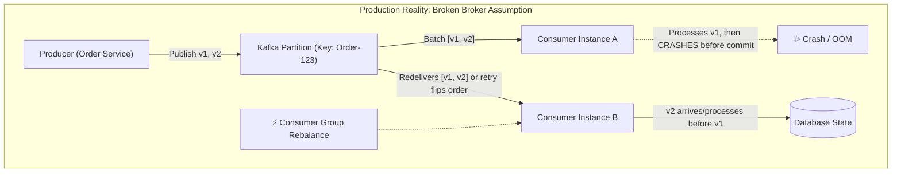
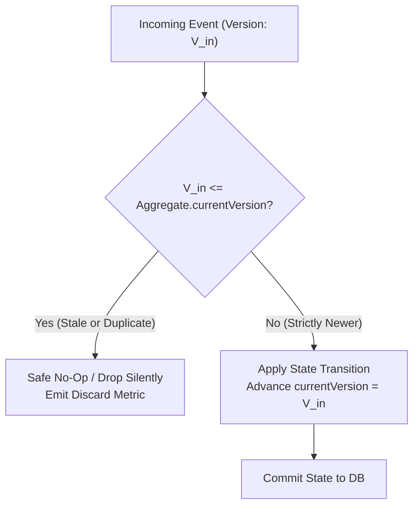
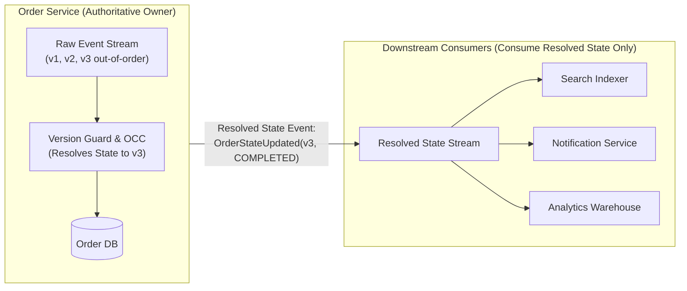
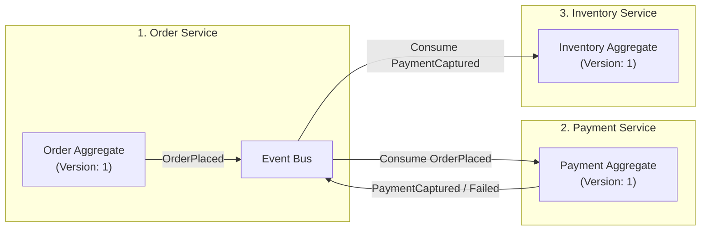

# Event-Driven Business Consistency & Out-of-Order Events — Key Takeaways

> **Parent**: [Messaging & Event Streaming](index.md)  
> **Source**: [How to Guarantee Business Consistency in Event-Driven Architecture When Events Arrive Out of Order](../../articles/messaging/how-to-guarantee-business-consistency-in-event-driven-architecture-when-events-arrive-out-of-order.md)  
> **Taxonomy Reference**: §3.3 Event-Driven & Messaging  

## Contents

| ID | Problem | Key Concept |
|:---|:---|:---|
| [`broker-134`](#broker-134-false-broker-ordering-guarantees-vs-redelivery-and-rebalance-reality) | Relying on broker partition ordering while consumer crashes, rebalances, and retries invert message processing | Transport-level vs business ordering, in-flight redelivery, failure of last-write-wins |
| [`broker-135`](#broker-135-versioned-aggregates-with-guard-clause-silent-discard) | Handling out-of-order or duplicate events without triggering false-positive alerts | Entity version tracking, guard clause silent drop, expected at-least-once traffic |
| [`broker-136`](#broker-136-single-writer-aggregate-ownership-vs-downstream-re-ordering-anti-pattern) | Dispersing event re-ordering logic across multiple downstream consumer microservices | Single-writer ownership, authoritative domain boundary, resolved state consumption |
| [`broker-137`](#broker-137-logical-clocks-and-monotonic-counters-vs-physical-clock-drift) | Wall-clock timestamp ordering corrupted by NTP drift and cloud virtualization jitter | Clock skew, monotonic entity counters, Lamport timestamps, vector clocks |
| [`broker-138`](#broker-138-optimistic-concurrency-control-for-concurrent-consumer-race-conditions) | Two consumer threads or overlapping rebalances reading current version before either writes | Check-then-act race, conditional updates (`WHERE version = expected`), lock-free OCC |
| [`broker-139`](#broker-139-operational-discard-observability-vs-dead-letter-queue-pollution) | Blindness to silent discards leading to DLQ pollution with normal at-least-once deliveries | Metric emission over DLQ routing, discard rate counters, retry loop anomaly detection |
| [`broker-140`](#broker-140-multi-service-aggregate-boundary-decomposition-via-sagas) | Forcing a single versioned aggregate across multiple microservices causing distributed write contention | Single-writer principle, domain boundary correction, localized aggregates, Sagas |

---

## broker-134: False Broker Ordering Guarantees vs Redelivery and Rebalance Reality

| | |
|:---|:---|
| **Problem** | Engineering teams assume that partitioning messages by entity ID in brokers like Apache Kafka guarantees that events will always be processed in business chronological order. In production, consumer crashes mid-batch, consumer group rebalances, and producer network retries cause in-flight messages to be redelivered and processed out of chronological sequence, corrupting business state (e.g., an hours-old `PaymentRefunded` arriving late and overwriting a fresher `PaymentCaptured`). |
| **Root cause** | Conflating transport-level partition ordering with end-to-end business ordering, and assuming consumer processing sequence or "last write wins" reflects chronological business truth. |

**Strategy**: Decouple business correctness from broker delivery and consumer processing sequence. The domain aggregate itself must determine freshness and ordering invariants rather than trusting broker sequence or wall-clock arrival times. Design application-layer state machines to be resilient to out-of-order and duplicate message delivery as normal, expected operating conditions.



**Tradeoff**: Pushes the cognitive and architectural responsibility of ordering into application domain logic instead of relying on transport primitives, requiring explicit aggregate versioning.

> **Dictionary**: [Eventual Consistency](../../reference-dictionary/cqrs-event-driven.md#eventual-consistency), [Idempotency](../../reference-dictionary/cqrs-event-driven.md#idempotency), [Consumer Group](../../reference-dictionary/messaging.md#consumer-group)  
> **Azure**: [Azure Event Hubs Partitions](../../architecture-azure/integration/event-hubs/), [Azure Service Bus Message Sessions](../../architecture-azure/integration/service-bus/)  
> **Related**: [`broker-119`](event-driven-architecture-questions-takeaways.md#broker-119-business-consistency-with-eventually-consistent-out-of-order-events), [`broker-120`](event-driven-architecture-questions-takeaways.md#broker-120-tripartite-separation-of-event-loss-duplicates-and-reprocessing), [`tx-01`](../concurrency-transactions/concurrency-transactions.md#tx-01-double-booking)  

---

## broker-135: Versioned Aggregates with Guard Clause Silent Discard

| | |
|:---|:---|
| **Problem** | When out-of-order or duplicate events arrive, naive implementations either overwrite newer aggregate state with older event data, or throw runtime exceptions that trigger alert fatigue, paging on-call engineers for normal distributed retransmissions. |
| **Root cause** | Treating redelivered or stale events as exceptional failure states rather than routine, expected traffic inherent in at-least-once messaging. |

**Strategy**: Implement **Versioned Aggregates** where every domain event carries a monotonically increasing entity version number. The aggregate applies incoming events through a strict guard clause:
```python
def apply(aggregate, incoming_event):
    if incoming_event.version <= aggregate.current_version:
        return aggregate  # Stale or duplicate: safe silent no-op

    aggregate.state = transition(aggregate.state, incoming_event)
    aggregate.current_version = incoming_event.version
    return aggregate
```
If `v2` arrives before `v1`, `v2` passes the guard and updates state; when `v1` arrives subsequently, it fails the guard and is safely dropped as a no-op without error.



**Tradeoff**: Out-of-order intermediate transitions are dropped. If an entity requires sequential execution of every step without gaps (e.g. strict ledger calculations), gaps must be buffered in a local holding store until missing versions arrive.

> **Dictionary**: [Versioned Aggregates](../../reference-dictionary/cqrs-event-driven.md#versioned-aggregates), [Idempotent Consumer](../../reference-dictionary/messaging.md#idempotent-consumer)  
> **Azure**: [Azure Cosmos DB Optimistic Concurrency Control](../../architecture-azure/data/databases/azure_cosmosdb/)  
> **Related**: [`broker-119`](event-driven-architecture-questions-takeaways.md#broker-119-business-consistency-with-eventually-consistent-out-of-order-events), [`broker-122`](event-driven-architecture-questions-takeaways.md#broker-122-replay-safe-consumer-design-for-high-volume-historical-reprocessing)  

---

## broker-136: Single-Writer Aggregate Ownership vs Downstream Re-Ordering Anti-Pattern

| | |
|:---|:---|
| **Problem** | Downstream microservices (e.g., search indexing, analytics, notifications) attempt to independently ingest raw event streams and reconcile out-of-order messages. Each downstream team reimplements custom ordering and buffering logic, creating multiple divergent implementations of the same bug. |
| **Root cause** | Leaking raw, unresolved domain event streams across bounded contexts instead of enforcing strict single-writer aggregate boundaries. |

**Strategy**: Restrict version evaluation and state resolution exclusively to the single service that owns the aggregate. Downstream consumers subscribe to the **already-resolved state** emitted by the owning service (e.g., entity state change events with authoritative snapshots or clean read APIs), rather than independently trying to reconstruct state from raw event sequences.



**Tradeoff**: Increases the scope of the owning service to publish clean resolved-state integration events, but prevents ordering logic fragmentation across all dependent microservices.

> **Dictionary**: [Resolved State Consumption](../../reference-dictionary/messaging.md#resolved-state-consumption), [Single Source of Truth](../../reference-dictionary/architecture-patterns.md#single-source-of-truth)  
> **Azure**: [Azure Service Bus Topics & Subscriptions](../../architecture-azure/integration/service-bus/), [Azure Event Grid Domains](../../architecture-azure/integration/event-grid/)  
> **Related**: [`broker-124`](event-driven-architecture-questions-takeaways.md#broker-124-multi-version-consumer-event-schema-evolution), [`broker-128`](event-driven-architecture-questions-takeaways.md#broker-128-anti-degradation-governance-against-eda-distributed-monoliths)  

---

## broker-137: Logical Clocks and Monotonic Counters vs Physical Clock Drift

| | |
|:---|:---|
| **Problem** | When domain events lack an explicit aggregate version field, engineering teams default to ordering events by physical wall-clock timestamps (`created_at` / `System.currentTimeMillis()`). In production, hardware clock drift, NTP adjustments, and cloud container virtualization skew timestamps by tens to hundreds of milliseconds, inverting business event sequence. |
| **Root cause** | Relying on uncoordinated physical clocks across distributed nodes to determine causal sequence. |

**Strategy**: Never rely on wall-clock timestamps to determine state transition sequence. Replace physical timestamps with logical clocks:
1. **Single Writer**: Use a strictly monotonically increasing sequence counter managed by the authoritative owning service (`version = 1, 2, 3...`).
2. **Multiple Concurrent Writers**: If multiple nodes legitimately emit events for the same aggregate, use **Lamport Timestamps** (tracking causal dependencies) or **Vector Clocks** (detecting true concurrency and branch conflicts).

**Tradeoff**: Logical clocks require explicit state tracking on the producer or aggregate owner, but provide absolute mathematical determinism immune to NTP synchronization failures or virtual machine clock drift.

> **Dictionary**: [Clock Skew](../../reference-dictionary/data-concurrency.md#clock-skew), [Lamport Clocks](../../reference-dictionary/data-concurrency.md#lamport-clocks), [Vector Clocks](../../reference-dictionary/data-concurrency.md#vector-clocks)  
> **Azure**: [Azure Cosmos DB _etag / Resource Tokens](../../architecture-azure/data/databases/azure_cosmosdb/)  
> **Related**: [`tx-10`](../concurrency-transactions/concurrency-transactions.md#tx-10-causal-consistency-in-distributed-databases), [`tx-29`](../concurrency-transactions/29-tx-key-takeaways.md)  

---

## broker-138: Optimistic Concurrency Control for Concurrent Consumer Race Conditions

| | |
|:---|:---|
| **Problem** | When two events for the same aggregate are processed nearly simultaneously (by concurrent consumer worker threads or during a transient consumer group rebalance overlap), both workers read `currentVersion = 2` concurrently. Both determine their incoming event is newer, and the slower worker clobbers the faster worker's write. |
| **Root cause** | Check-then-act race condition between in-memory aggregate version checking and database persistence without transactional concurrency enforcement. |

**Strategy**: Protect the aggregate write path with database-level **Optimistic Concurrency Control (OCC)** using atomic conditional updates:
```sql
UPDATE orders 
SET state = :newState, version = :incomingVersion 
WHERE id = :orderId AND version = :expectedVersion;
```
If 0 rows are modified, the conditional update failed because another thread updated the aggregate concurrently. Catch the condition failure, reload the aggregate's latest state, and re-evaluate the transition. This achieves complete race safety without introducing distributed locks (e.g. Redis Redlock or ZooKeeper).

**Tradeoff**: High-contention workloads may experience OCC retry churn, but it completely avoids the latency, single point of failure, and deadlock risks of distributed locking systems.

> **Dictionary**: [Optimistic Locking](../../reference-dictionary/data-concurrency.md#optimistic-locking), [Atomic Conditional Update](../../reference-dictionary/data-concurrency.md#atomic-conditional-update)  
> **Azure**: [Azure Cosmos DB ETag OCC](../../architecture-azure/data/databases/azure_cosmosdb/), [Azure SQL Database Rowversion / Concurrency](../../architecture-azure/data/databases/azure_sql/)  
> **Related**: [`tx-01`](../concurrency-transactions/concurrency-transactions.md#tx-01-double-booking), [`tx-21`](../concurrency-transactions/29-tx-key-takeaways.md#tx-21-check-then-act-race-in-payment-retries), [`broker-123`](event-driven-architecture-questions-takeaways.md#broker-123-transactional-outbox-capabilities-and-inherent-scope-boundaries)  

---

## broker-139: Operational Discard Observability vs Dead-Letter Queue Pollution

| | |
|:---|:---|
| **Problem** | Operations teams fear that silently dropping stale or duplicate events causes invisible data loss. In response, teams route every stale or out-of-order event to a Dead-Letter Queue (DLQ), causing alert storms, on-call alert fatigue, and DLQ pollution with millions of normal messages. |
| **Root cause** | Failing to distinguish expected at-least-once transport retransmissions from actual system bugs or poison pill failures. |

**Strategy**: Keep discards silent to the domain aggregate, but fully visible to observability systems. Emit dedicated operational metrics on every discard:
- Counter: `stale_events_discarded_total{entity_type, entity_id, lag_versions}`
- Histogram: `stale_event_age_seconds`

A steady, low baseline rate of discards is expected normal behavior in distributed systems with retries and consumer rebalances. Set alert thresholds only on **abnormal rate spikes**, which indicate stuck upstream retry loops, thrashing consumer group rebalances, or producer replay bugs. Reserve DLQs strictly for non-retryable processing errors, serialization failures, or poison messages.

**Tradeoff**: Requires telemetry instrumentation and threshold tuning, but keeps DLQs clean and actionable while preserving deep operational visibility.

> **Dictionary**: [Dead Letter Queue (DLQ)](../../reference-dictionary/messaging.md#dead-letter-queue-dlq), [Consumer Lag](../../reference-dictionary/messaging.md#consumer-lag)  
> **Azure**: [Azure Monitor Metrics & Alerts](../../architecture-azure/observability/application-insights/), [Azure Service Bus Dead-Letter Subqueues](../../architecture-azure/integration/service-bus/)  
> **Related**: [`broker-126`](event-driven-architecture-questions-takeaways.md#broker-126-distributed-production-flow-debugging-across-poly-service-eda), [`broker-131`](when-to-avoid-event-driven-architecture-takeaways.md#broker-131-operational-maturity-preconditions-for-event-driven-systems)  

---

## broker-140: Multi-Service Aggregate Boundary Decomposition via Sagas

| | |
|:---|:---|
| **Problem** | When a business process spans three distinct microservices, teams attempt to share a single versioned aggregate across all three services. This creates multi-writer split-brain, distributed deadlocks, and destroys service autonomy. |
| **Root cause** | Violating the single-writer principle by artificially stretching a single aggregate's transactional boundary across service boundaries. |

**Strategy**: Every aggregate root must have strictly **one owning service** as its single writer. If a business transaction spans multiple services (e.g. Order, Payment, and Inventory), do not attempt to share a distributed aggregate. Decompose the workflow into a **Saga pattern** (choreography or orchestration):
- Each participating service owns its own local aggregate, local database transaction, and version guard.
- The workflow coordinates across boundaries through explicit commands, event notifications, and compensating transactions (e.g., refund payment, release inventory) if downstream steps fail.



**Tradeoff**: Replaces atomic single-aggregate transactions with eventual consistency and requires designing explicit compensating actions, but preserves service isolation and eliminates distributed write contention.

> **Dictionary**: [Saga Pattern](../../reference-dictionary/data-concurrency.md#saga-pattern), [Compensating Transaction](../../reference-dictionary/data-concurrency.md#compensating-transaction)  
> **Azure**: [Azure Durable Functions (Saga Orchestration)](../../architecture-azure/compute/functions/), [Azure Service Bus Topics](../../architecture-azure/integration/service-bus/)  
> **Related**: [`broker-121`](event-driven-architecture-questions-takeaways.md#broker-121-inapplicability-boundaries-of-event-driven-architecture), [`broker-128`](event-driven-architecture-questions-takeaways.md#broker-128-anti-degradation-governance-against-eda-distributed-monoliths), [`broker-129`](when-to-avoid-event-driven-architecture-takeaways.md#broker-129-strict-transactional-invariants-vs-distributed-window-of-uncertainty)  

---

```json
[
  {
    "id": "broker-134",
    "problem": "False Broker Ordering Guarantees vs Redelivery and Rebalance Reality",
    "strategy": "Decouple business correctness from transport sequence; the domain aggregate itself must enforce ordering invariants across in-flight redeliveries, rebalances, and retries rather than trusting broker partitions or consumer arrival times.",
    "tradeoff": "Pushes ordering responsibility into application domain logic rather than relying on transport primitives, requiring explicit aggregate versioning.",
    "links": {
      "dictionary": "../../reference-dictionary/cqrs-event-driven.md#eventual-consistency",
      "azure": "../../architecture-azure/integration/event-hubs/",
      "source": "../../articles/messaging/how-to-guarantee-business-consistency-in-event-driven-architecture-when-events-arrive-out-of-order.md"
    }
  },
  {
    "id": "broker-135",
    "problem": "Versioned Aggregates with Guard Clause Silent Discard",
    "strategy": "Embed strictly monotonic entity version numbers on events and enforce an aggregate guard clause (incoming.version <= current.version -> return aggregate) that drops stale and duplicate events as safe silent no-ops without throwing exceptions.",
    "tradeoff": "Stale events are discarded without mutating state; entities requiring strict gapless sequences must buffer out-of-order events until missing versions arrive.",
    "links": {
      "dictionary": "../../reference-dictionary/cqrs-event-driven.md#versioned-aggregates",
      "azure": "../../architecture-azure/data/databases/azure_cosmosdb/",
      "source": "../../articles/messaging/how-to-guarantee-business-consistency-in-event-driven-architecture-when-events-arrive-out-of-order.md"
    }
  },
  {
    "id": "broker-136",
    "problem": "Single-Writer Aggregate Ownership vs Downstream Re-Ordering Anti-Pattern",
    "strategy": "Enforce version checks exclusively within the authoritative service owning the aggregate; downstream services consume the resolved entity state rather than independently trying to reconstruct ordering from raw event streams.",
    "tradeoff": "Increases the scope of the owning service to publish clean resolved-state integration events, but prevents ordering logic fragmentation and bugs across all dependent microservices.",
    "links": {
      "dictionary": "../../reference-dictionary/messaging.md#resolved-state-consumption",
      "azure": "../../architecture-azure/integration/service-bus/",
      "source": "../../articles/messaging/how-to-guarantee-business-consistency-in-event-driven-architecture-when-events-arrive-out-of-order.md"
    }
  },
  {
    "id": "broker-137",
    "problem": "Logical Clocks and Monotonic Counters vs Physical Clock Drift",
    "strategy": "Replace physical wall-clock timestamps with logical clocks (monotonic sequence counters for single writers, Lamport timestamps or vector clocks for concurrent producers) to eliminate event misordering caused by NTP drift and container virtualization jitter.",
    "tradeoff": "Logical clocks require explicit state tracking on the producer or aggregate owner, but provide absolute mathematical determinism immune to clock drift.",
    "links": {
      "dictionary": "../../reference-dictionary/data-concurrency.md#clock-skew",
      "azure": "../../architecture-azure/data/databases/azure_cosmosdb/",
      "source": "../../articles/messaging/how-to-guarantee-business-consistency-in-event-driven-architecture-when-events-arrive-out-of-order.md"
    }
  },
  {
    "id": "broker-138",
    "problem": "Optimistic Concurrency Control for Concurrent Consumer Race Conditions",
    "strategy": "Protect aggregate updates with database-level Optimistic Concurrency Control (UPDATE ... WHERE version = expectedVersion) to prevent check-then-act races during concurrent consumer processing or overlapping rebalances without distributed locks.",
    "tradeoff": "High-contention workloads may experience OCC retry churn, but it completely avoids the latency, failure modes, and deadlock risks of distributed locking systems.",
    "links": {
      "dictionary": "../../reference-dictionary/data-concurrency.md#optimistic-locking",
      "azure": "../../architecture-azure/data/databases/azure_cosmosdb/",
      "source": "../../articles/messaging/how-to-guarantee-business-consistency-in-event-driven-architecture-when-events-arrive-out-of-order.md"
    }
  },
  {
    "id": "broker-139",
    "problem": "Operational Discard Observability vs Dead-Letter Queue Pollution",
    "strategy": "Keep stale event discards silent to the business aggregate while emitting operational discard metrics and alerting on abnormal rate spikes, reserving DLQs strictly for non-retryable poison message failures.",
    "tradeoff": "Requires telemetry instrumentation and threshold tuning, but keeps DLQs clean and actionable while preserving deep operational visibility.",
    "links": {
      "dictionary": "../../reference-dictionary/messaging.md#dead-letter-queue-dlq",
      "azure": "../../architecture-azure/observability/application-insights/",
      "source": "../../articles/messaging/how-to-guarantee-business-consistency-in-event-driven-architecture-when-events-arrive-out-of-order.md"
    }
  },
  {
    "id": "broker-140",
    "problem": "Multi-Service Aggregate Boundary Decomposition via Sagas",
    "strategy": "Enforce single-writer aggregate ownership within one service; model multi-service business workflows as Sagas with localized aggregates and compensating actions rather than stretching a shared aggregate across service boundaries.",
    "tradeoff": "Replaces atomic single-aggregate transactions with eventual consistency and compensating logic, but preserves service autonomy and eliminates distributed write contention.",
    "links": {
      "dictionary": "../../reference-dictionary/data-concurrency.md#saga-pattern",
      "azure": "../../architecture-azure/compute/functions/",
      "source": "../../articles/messaging/how-to-guarantee-business-consistency-in-event-driven-architecture-when-events-arrive-out-of-order.md"
    }
  }
]
```
