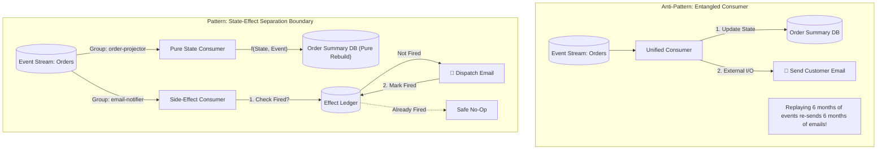
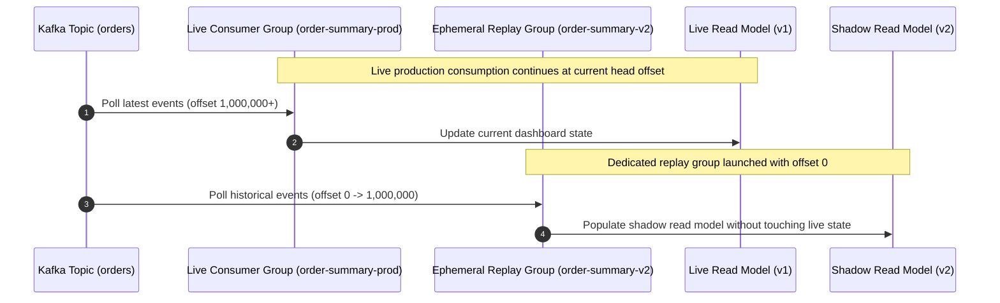
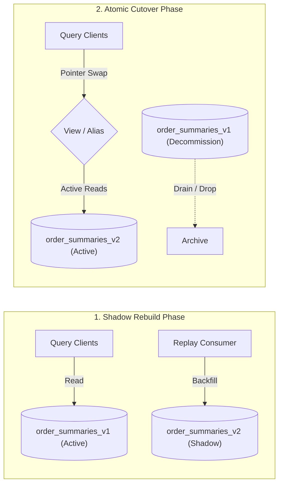
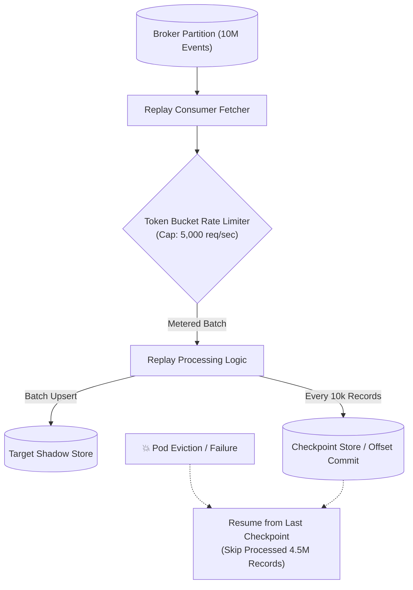
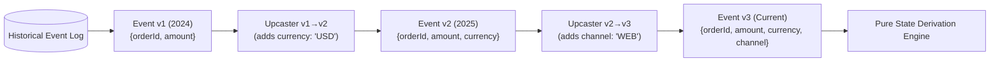
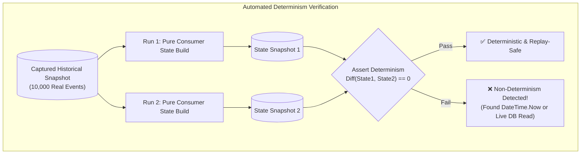

# Event-Driven Consumer Replay at Scale — Key Takeaways

> **Parent**: [Messaging & Event Streaming](index.md)  
> **Source**: [How to Design Event-Driven Consumers That Survive Replaying Millions of Old Events](../../articles/messaging/how-to-design-event-driven-consumers-that-survive-replaying-millions-of-old-events.md)  
> **Taxonomy Reference**: §3.3 Event-Driven & Messaging  

## Contents

| ID | Problem | Key Concept |
|:---|:---|:---|
| [`broker-159`](#broker-159-conflating-state-derivation-with-irreversible-side-effects) | Replaying event history to rebuild state accidentally re-triggers real-world side effects (emails, payments) | State-Effect Separation, pure state derivation, dedicated effect consumer |
| [`broker-160`](#broker-160-live-consumer-group-offset-rewind-vs-dedicated-replay-groups) | Resetting live consumer group offsets interleaves historical replay with live production traffic | Dedicated ephemeral replay consumer group, offset isolation, zero live disruption |
| [`broker-161`](#broker-161-in-place-read-model-mutation-vs-blue-green-rebuild-and-cutover) | Replaying millions of events into an active database corrupts live queries and risks partial rebuild failure | Blue-green read model rebuild, isolated shadow tables/indexes, atomic cutover |
| [`broker-162`](#broker-162-downstream-infrastructure-saturation-vs-throttled-checkpointed-replay) | Full-speed historical replays saturate downstream databases and connection pools sized for live traffic | Rate-throttled consumption, batch backpressure, resumable checkpointing |
| [`broker-163`](#broker-163-historical-schema-drift-vs-in-memory-deterministic-event-upcasting) | Replaying events across multiple schema generations breaks consumers expecting the current payload shape | In-memory deterministic event upcasting, pipeline transformation chain, immutable logs |
| [`broker-164`](#broker-164-unverified-replay-determinism-vs-automated-snapshot-replay-testing) | Subtle non-deterministic consumer logic (wall-clock time, live DB lookups) produces corrupted replay state | Determinism testing, dual-run snapshot verification, staging volume replay validation |

---

## broker-159: Conflating State Derivation with Irreversible Side Effects

| | |
|:---|:---|
| **Problem** | An event consumer owns two coupled responsibilities: updating internal state (such as a read model, cache, or materialized aggregate) and triggering external, irreversible side effects (such as sending shipment confirmation emails or dispatching third-party webhooks). When a bug fix or schema migration forces operators to replay historical events from the broker log, the consumer cannot distinguish between new live events and replayed historical events, resulting in massive re-execution of real-world side effects. |
| **Root cause** | Entangling pure, idempotent mathematical state transitions with stateful, non-idempotent external I/O actions within the same consumer execution boundary. |

**Strategy**: Enforce strict **State-Effect Separation**. Architecturally split the consumer into two completely independent consumers reading from the same event stream:
1. **State Derivation Consumer**: A pure function of the event log ($S_{t} = f(S_{t-1}, E_{t})$). It reads solely from the immutable event payload—with zero live database lookups, zero wall-clock `now()` calls, and zero random numbers. This consumer can be replayed zero, one, or a thousand times with guaranteed deterministic results.
2. **Side-Effect Consumer**: Runs under its own distinct consumer group with an explicit **Effect Ledger** (idempotency store). Before dispatching any external I/O action, it checks if the effect has already fired for `event.id`; upon dispatch, it atomically records the completion mark in the ledger. Replaying the topic for a state rebuild completely leaves the side-effect consumer untouched.



**Tradeoff**: Increases the number of active consumer groups and necessitates maintaining an explicit effect ledger database, but provides absolute safety against duplicate real-world actions during operational replays.

> **Dictionary**: [State-Effect Separation](../../reference-dictionary/cqrs-event-driven.md#state-effect-separation), [Side-Effect Gating](../../reference-dictionary/cqrs-event-driven.md#side-effect-gating), [Effect Ledger](../../reference-dictionary/cqrs-event-driven.md#ledger), [Deterministic Processing](../../reference-dictionary/cqrs-event-driven.md#deterministic-processing)  
> **Azure Services**: [Azure Event Hubs](../../architecture-azure/integration/azure_event_hubs/), [Azure Functions](../../architecture-azure/compute/azure_functions/), [Azure Table Storage](../../architecture-azure/data/databases/azure_table_storage/)  
> **Related**: [`broker-144`](event-loss-duplicates-reprocessing-takeaways.md#broker-144-deterministic-consumer-replay--side-effect-gating-during-reprocessing), [`broker-76`](kafka-user-activity-tracking.md#broker-76-replay-safe-idempotent-processing)  

---

## broker-160: Live Consumer Group Offset Rewind vs Dedicated Replay Groups

| | |
|:---|:---|
| **Problem** | To initiate a replay, operators rewind the partition offsets of the active production consumer group (`kafka-consumer-groups --reset-offsets --to-earliest --group order-summary-group`). As the consumer restarts, in-flight real-time events and replayed historical records interleave across consumer instances. Real-time dashboards stop reflecting current business state, end users experience severe staleness, and consumer group rebalances trigger unpredictable processing pauses. |
| **Root cause** | Mutating the offset pointers of an active production consumer group that is actively responsible for serving live traffic. |

**Strategy**: Spin up a **Dedicated Ephemeral Replay Consumer Group** (`order-summary-rebuilder-20260918`) specifically provisioned for the replay task:
1. The active production consumer group (`order-summary-group`) continues reading real-time events without offset modification or interruption.
2. The dedicated replay group initializes its offset to `--to-earliest` (or a specific target timestamp) and reads the historical log into a shadow store.
3. Once the replay group catches up to the real-time stream watermark, query traffic switches to the new store, and the replay consumer group is decommissioned.



**Tradeoff**: Requires temporary broker partition read bandwidth and double consumer CPU allocation, but isolates production traffic entirely from replay disruption.

> **Dictionary**: [Consumer Group](../../reference-dictionary/messaging.md#consumer-group), [Offset Management](../../reference-dictionary/messaging.md#offset-management), [Event Replay](../../reference-dictionary/cqrs-event-driven.md#event-replay)  
> **Azure Services**: [Azure Event Hubs Consumer Groups](../../architecture-azure/integration/azure_event_hubs/)  
> **Related**: [`broker-08e`](message-brokers-async.md#broker-08e-wrong-consumer-group-usage), [`broker-141`](event-loss-duplicates-reprocessing-takeaways.md#broker-141-tripartite-failure-surface-separation-in-at-least-once-delivery)  

---

## broker-161: In-Place Read Model Mutation vs Blue-Green Rebuild and Cutover

| | |
|:---|:---|
| **Problem** | A read model or search index contains corrupt data due to a past logic bug. Operators truncate the active table or replay updates in place. For several hours during the replay, the table contains incomplete, half-rebuilt state, causing user-facing queries to return missing or contradictory results. If the replay crashes or encounters unhandled data mid-way, the active read model is left in an unrecoverable, partially modified state. |
| **Root cause** | Directly executing batch reconciliation mutations against active serving storage without staging or atomic cutover capabilities. |

**Strategy**: Adopt a **Blue-Green Read Model Rebuild** (Rebuild-and-Cutover) strategy:
1. **Provision Shadow Storage**: Create a clean, independent shadow table, collection, or search index (e.g., `order_summaries_v2`).
2. **Replay into Shadow**: Stream historical events into the shadow store. Live applications continue querying `order_summaries_v1` undisturbed.
3. **Catch Up to Tail**: Keep the replay running until it processes up to the real-time event timestamp.
4. **Atomic Cutover**: Atomically swap a database view, synonym, alias (e.g., Elasticsearch index alias, PostgreSQL view pointer), or application feature toggle to redirect reads to `v2`.
5. **Decommission Blue**: Retain `order_summaries_v1` as a rollback snapshot for a defined bake period, then drop it.



**Tradeoff**: Requires temporary 2x storage footprint during the rebuild window, but guarantees zero downtime, zero stale intermediate states, and immediate zero-cost rollback capability.

> **Dictionary**: [Read Model](../../reference-dictionary/cqrs-event-driven.md#read-model), [Projection](../../reference-dictionary/cqrs-event-driven.md#projection), [Rebuild-and-Cutover](../../reference-dictionary/cqrs-event-driven.md#rebuild-and-cutover)  
> **Azure Services**: [Azure Cosmos DB](../../architecture-azure/data/databases/azure_cosmosdb/), [Azure SQL Database (Synonyms/Views)](../../architecture-azure/data/databases/azure_sql/), [Azure AI Search Aliases](../../architecture-azure/data/)  
> **Related**: [`broker-157`](outbox-pattern-capabilities-limits-takeaways.md#broker-157-unbounded-outbox-table-bloat-and-degrading-relay-query-performance), [`cqrs-02`](../../architecture-general/02-application-software-architecture/)  

---

## broker-162: Downstream Infrastructure Saturation vs Throttled Checkpointed Replay

| | |
|:---|:---|
| **Problem** | When historical replays are launched, consumer workers pull events at network wire speed (e.g., 50,000 events/sec), which drastically exceeds normal live traffic rates (e.g., 500 events/sec). Downstream relational databases exhaust connection pools, CPU saturates at 100%, and replication lag spikes, bringing down concurrent production OLTP workloads. Furthermore, if a worker pod crashes at event 4,500,000, lack of progress tracking forces the entire replay to restart from event 0. |
| **Root cause** | Unbounded consumer fetch throughput and lack of checkpointing during administrative backfills. |

**Strategy**: Combine **Client-Side Rate Throttling** with **Granular Progress Checkpointing**:
1. **Rate Limiting / Throttling**: Configure token-bucket or leaky-bucket rate limiters on the replay consumer workers to cap write operations to a safe threshold (e.g., 5,000 ops/sec) calibrated against downstream database capacity.
2. **Periodic Checkpointing**: Commit consumer offsets or persist watermarks (e.g., `last_replayed_timestamp`, `last_offset`) at bounded intervals (e.g., every 10,000 events or 10 seconds). If a worker crashes or is evicted by Kubernetes, recovery resumes from the last watermark rather than starting from the beginning.
3. **Off-Peak Execution & Resource Isolation**: Target the shadow database instance on isolated compute or read replicas to prevent contention with primary write nodes.



**Tradeoff**: Increases the total wall-clock duration of the replay operation, but protects mission-critical production databases from denial-of-service outages and bounds recovery time upon mid-stream failures.

> **Dictionary**: [Backpressure](../../reference-dictionary/architecture-patterns.md#backpressure), [Rate Limiting](../../reference-dictionary/resilience.md#rate-limiting), [Offset Management](../../reference-dictionary/messaging.md#offset-management)  
> **Azure Services**: [Azure Event Hubs Epoch Receivers](../../architecture-azure/integration/azure_event_hubs/), [Azure SQL Elastic Pools](../../architecture-azure/data/databases/azure_sql/)  
> **Related**: [`broker-106`](kafka-pipeline-bottlenecks.md#broker-106-backpressure--tell-producers-to-stop), [`broker-113`](notifications-at-scale-takeaways.md#broker-113-worker-self-throttling-and-downstream-rate-matching)  

---

## broker-163: Historical Schema Drift vs In-Memory Deterministic Event Upcasting

| | |
|:---|:---|
| **Problem** | Replaying an event topic spanning multiple months or years encounters events formatted according to obsolete schemas (v1 from two years ago, v2 from last year, v3 currently). If the replay consumer expects v3 schema attributes, it crashes with deserialization errors or writes corrupted null values. Running ad-hoc SQL or migration scripts directly against the broker log is impossible because log segments are immutable. |
| **Root cause** | Schema evolution in append-only logs without standardized in-memory adaptation layers for legacy event shapes. |

**Strategy**: Implement **In-Memory Deterministic Event Upcasting**:
1. Treat historical events on the wire as permanently immutable facts.
2. Build versioned upcasters directly into the consumer's deserialization pipeline. An upcaster chain transforms a raw v1 event into v2 by applying deterministic defaults, and v2 into v3 before any domain or projection logic executes.
3. Ensure upcasting is completely deterministic and stateless—avoiding external lookups or mutable context.

```c
FUNCTION upcast(rawEvent):
    event = deserialize(rawEvent)
    SWITCH event.version:
        CASE 1:
            event = upcastV1ToV2(event) // adds default currency = 'USD'
            FALLTHROUGH
        CASE 2:
            event = upcastV2ToV3(event) // splits customerName into first/last
            FALLTHROUGH
        CASE 3:
            RETURN event                // current domain shape
```



**Tradeoff**: Requires maintaining upcaster adapter classes across the lifecycle of the application, but eliminates fragile one-off migration scripts and guarantees reproducible replays forever.

> **Dictionary**: [Event Upcasting](../../reference-dictionary/cqrs-event-driven.md#event-upcasting), [Schema Evolution](../../reference-dictionary/messaging.md#schema-evolution), [Immutable Log](../../reference-dictionary/messaging.md#immutable-event-log)  
> **Azure Services**: [Azure Schema Registry](../../architecture-azure/integration/azure_event_hubs/)  
> **Related**: [`broker-124`](event-driven-architecture-questions-takeaways.md#broker-124-event-schema-evolution-without-breaking-consumers), [`broker-82`](kafka-real-world-scenarios.md#broker-82-schema-evolution--governance)  

---

## broker-164: Unverified Replay Determinism vs Automated Snapshot Replay Testing

| | |
|:---|:---|
| **Problem** | An engineering team attempts a production read model replay after refactoring consumer logic, only to discover hours later that the newly generated state diverges from production truth. Hidden non-deterministic logic—such as evaluating `DateTime.UtcNow`, generating client UUIDs, relying on database auto-increment keys, or reading non-versioned reference tables—produced silently flawed state. |
| **Root cause** | Deploying replay-critical consumer logic without automated determinism testing against captured historical datasets. |

**Strategy**: Establish a **Determinism Test Suite & Staging Dry-Run Verification**:
1. **Dual-Run Determinism Unit/Component Test**:
   - Capture a production snapshot of serialized historical events (e.g., 10,000 real events).
   - In an automated test, run the state consumer against an empty state store from start to finish: $S_1 = \text{run}(E)$.
   - Reset the state store and run the identical consumer code against the exact same event sequence: $S_2 = \text{run}(E)$.
   - Assert that $S_1 \equiv S_2$ with zero byte, row, or timestamp discrepancies.
2. **Staging Volume Dry-Run**:
   - Mirror topic partitions into a staging cluster.
   - Execute the replay tool end-to-end at production volume to validate checkpointing resilience, consumer rate throttling, and total operational duration before touching production.



**Tradeoff**: Requires investing in testing infrastructure to capture and replay event fixtures, but guarantees mathematical correctness and prevents disastrous operational incidents in production.

> **Dictionary**: [Deterministic Processing](../../reference-dictionary/cqrs-event-driven.md#deterministic-processing), [Deterministic Consumer](../../reference-dictionary/messaging.md#deterministic-consumer), [State-Effect Separation](../../reference-dictionary/cqrs-event-driven.md#state-effect-separation)  
> **Azure Services**: [Azure Pipelines / GitHub Actions (CI Replay Tests)](../../architecture-azure/devops/)  
> **Related**: [`broker-144`](event-loss-duplicates-reprocessing-takeaways.md#broker-144-deterministic-consumer-replay--side-effect-gating-during-reprocessing), [`broker-76`](kafka-user-activity-tracking.md#broker-76-replay-safe-idempotent-processing)  
