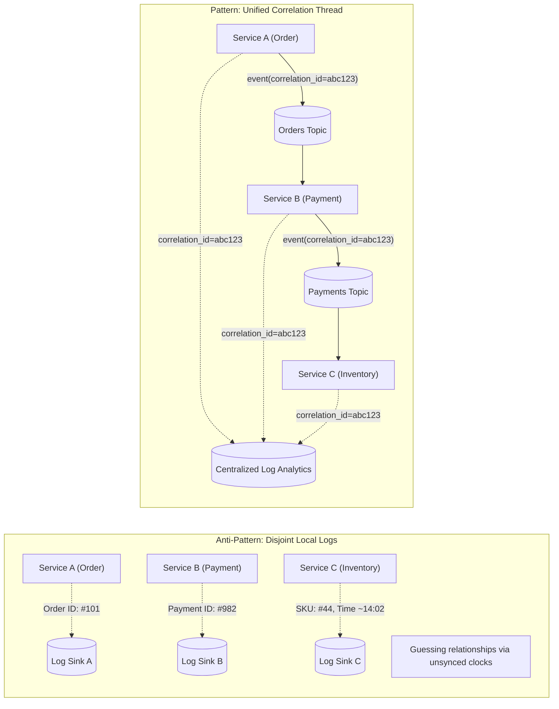
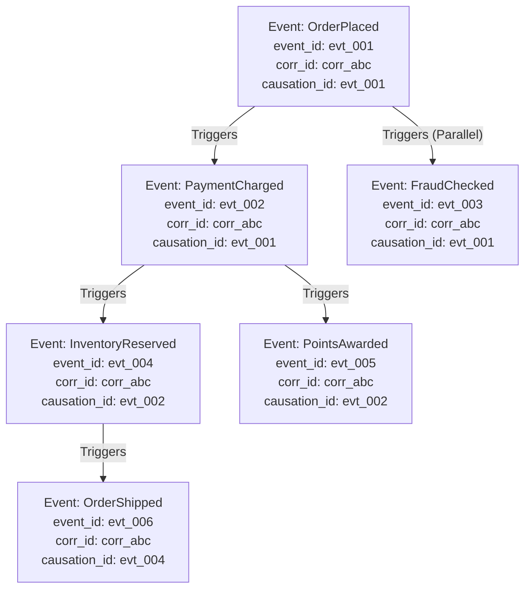
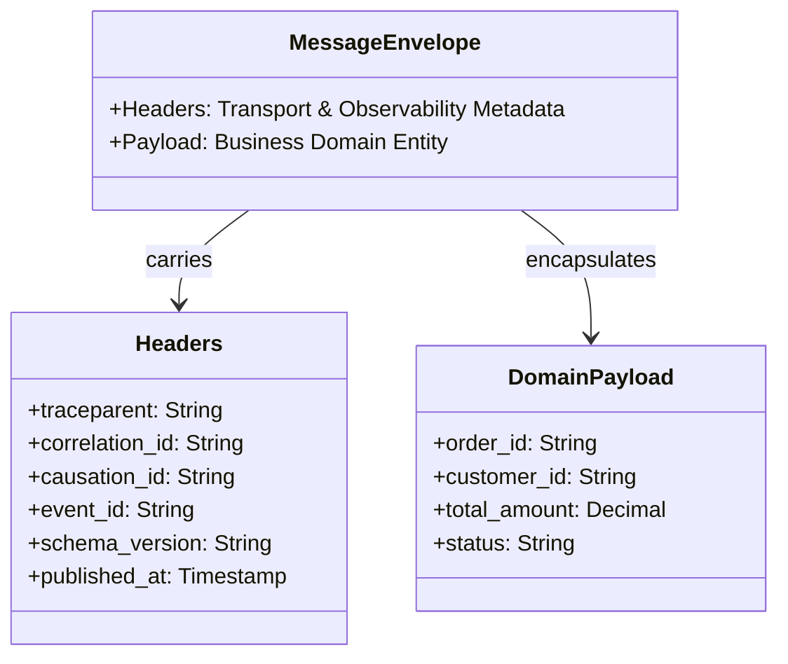
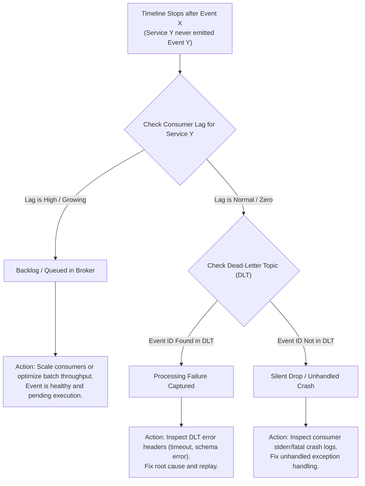
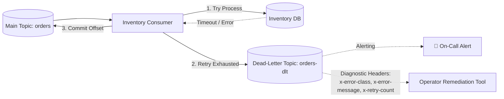

# Event-Driven Cross-Service Debugging at Scale — Key Takeaways

> **Parent**: [Messaging & Event Streaming](index.md)  
> **Source**: [How to Debug a Production Issue That Spans 10 Event-Driven Services](../../articles/messaging/how-to-debug-a-production-issue-that-spans-10-event-driven-services.md)  
> **Taxonomy Reference**: §3.3 Event-Driven & Messaging  

## Contents

| ID | Problem | Key Concept |
|:---|:---|:---|
| [`broker-165`](#broker-165-flat-per-service-log-grepping-vs-distributed-business-flow-correlation-id) | Debugging multi-service failures by grepping disjoint per-service logs with local IDs and drifting timestamps | Distributed Correlation ID, origin generation, unified flow timeline |
| [`broker-166`](#broker-166-flat-correlation-id-sets-vs-hierarchical-causation-id-tree-reconstruction) | A flat set of events sharing a correlation ID obscures parent-child relationships in fan-out workflows | Causation ID DAG reconstruction, tripartite identity (Event, Correlation, Causation) |
| [`broker-167`](#broker-167-asynchronous-trace-disconnection-vs-explicit-header-context-propagation) | Distributed tracing breaks across message brokers because thread-local call stacks do not cross async boundaries | Distributed Context Propagation, W3C traceparent injection/extraction, span continuity |
| [`broker-168`](#broker-168-payload-metadata-pollution-vs-standardized-event-envelope--message-headers) | Embedding operational and tracing metadata inside domain payload schemas breaks schema evolution | Event Envelope Pattern, native broker message headers, protocol/payload separation |
| [`broker-169`](#broker-169-timeline-discontinuity-vs-consumer-lag-triage-for-unprocessed-backlogs) | Assuming a missing downstream event is a crash failure when it is simply sitting unprocessed in a backlog | Consumer Lag Triage, offset delta inspection (`LogEndOffset - CommittedOffset`), backlog vs failure |
| [`broker-170`](#broker-170-silent-processing-failure-dropouts-vs-context-rich-dead-letter-topic-routing) | Consumers dropping poison events or failing silently leave business transactions permanently lost | Context-Rich Dead-Letter Topic (DLT), error metadata headers, unblocking head-of-line |

---

## broker-165: Flat Per-Service Log Grepping vs Distributed Business Flow Correlation ID

| | |
|:---|:---|
| **Problem** | When a customer transaction halts or fails across a ten-service event-driven pipeline, on-call engineers attempt to troubleshoot by searching individual service logs using localized primary keys (e.g., local database order row IDs) or approximate timestamps. Because each microservice maintains independent logging formats, isolated log sinks, and slightly drifting system clocks, operators are forced to guess timing relationships, making cross-service root cause analysis slow, error-prone, and ineffective. |
| **Root cause** | Attempting to debug distributed asynchronous workflows using localized service logs and clock approximations rather than a flow-level correlation identity established at the workflow origin. |

**Strategy**: Enforce an end-to-end **Correlation ID** standard across all participating services:
1. **Origin Generation**: Generate a globally unique, immutable correlation identifier (`correlation_id`, e.g., UUIDv4 or ULID) at the exact entry boundary where the business transaction is initiated (e.g., API Gateway or Order Placement Service).
2. **Mandatory Envelope Propagation**: Inject the `correlation_id` into the metadata envelope or broker message headers of every event emitted during that workflow. Every downstream consumer must extract and forward this identifier to all subsequent events and asynchronous commands it emits.
3. **Structured Log Context (MDC)**: Bind the `correlation_id` to the local logging context (Mapped Diagnostic Context / MDC) in every microservice for the duration of event processing. A single query (`correlation_id = 'abc123' ORDER BY timestamp ASC`) across centralized logging (e.g., Elasticsearch, Azure Monitor Log Analytics) yields a unified, ordered timeline across all ten services.



**Tradeoff**: Requires company-wide framework or middleware enforcement to guarantee that no service drops or overwrites correlation headers, but narrows multi-service search space from $O(N)$ disconnected logs to a single unified timeline query.

> **Dictionary**: [Correlation ID](../../reference-dictionary/cqrs-event-driven.md#correlation-id), [Event Envelope](../../reference-dictionary/cqrs-event-driven.md#event-envelope), [Event-Driven Architecture](../../reference-dictionary/cqrs-event-driven.md#event-driven-architecture)  
> **Azure Services**: [Azure Monitor Log Analytics](../../architecture-azure/observability/azure_monitor/), [Application Insights](../../architecture-azure/observability/application_insights/), [Azure Event Hubs](../../architecture-azure/integration/azure_event_hubs/)  
> **Related**: [`broker-141`](event-loss-duplicates-reprocessing-takeaways.md#broker-141-tripartite-failure-surface-separation-in-at-least-once-delivery), [`broker-166`](#broker-166-flat-correlation-id-sets-vs-hierarchical-causation-id-tree-reconstruction)  

---

## broker-166: Flat Correlation ID Sets vs Hierarchical Causation ID Tree Reconstruction

| | |
|:---|:---|
| **Problem** | In complex event-driven workflows involving parallel fan-out (e.g., an `OrderPlaced` event simultaneously triggering inventory reservation, fraud scoring, customer loyalty accrual, and email notification), all resulting downstream events share the exact same `correlation_id`. Querying centralized logs returns a flat, disordered collection of events where race conditions, concurrent branch executions, and retry attempts become entangled, obscuring which specific event directly triggered a downstream failure. |
| **Root cause** | Modeling distributed transaction lineage as a flat set of events rather than a directed acyclic graph (DAG) of explicit parent-child causal relationships. |

**Strategy**: Adopt a **Tripartite Event Identity Model** comprising Event ID, Correlation ID, and Causation ID:
1. **`event_id`**: A globally unique identifier for this specific event instance (e.g., `evt_901`).
2. **`correlation_id`**: Shared across the entire business flow lifecycle from start to finish (e.g., `corr_abc123`).
3. **`causation_id`**: Set to the `event_id` of the immediate predecessor event that triggered the current action (e.g., for `InventoryReserved`, its `causation_id` is the `event_id` of `PaymentCharged`).



**Tradeoff**: Consumers must explicitly capture the incoming message's `event_id` and pass it to downstream event factories as `causation_id`, but enables automated visualization of execution DAGs, parallel branch isolation, and unambiguous fault attribution.

> **Dictionary**: [Causation ID](../../reference-dictionary/cqrs-event-driven.md#causation-id), [Correlation ID](../../reference-dictionary/cqrs-event-driven.md#correlation-id), [Event ID](../../reference-dictionary/cqrs-event-driven.md#event-id)  
> **Azure Services**: [Application Insights](../../architecture-azure/observability/application_insights/), [Azure Monitor](../../architecture-azure/observability/azure_monitor/)  
> **Related**: [`broker-165`](#broker-165-flat-per-service-log-grepping-vs-distributed-business-flow-correlation-id), [`broker-167`](#broker-167-asynchronous-trace-disconnection-vs-explicit-header-context-propagation)  

---

## broker-167: Asynchronous Trace Disconnection vs Explicit Header Context Propagation

| | |
|:---|:---|
| **Problem** | In synchronous microservice environments, distributed tracing libraries automatically inject and extract trace headers (e.g., W3C `traceparent`) across HTTP/gRPC boundaries using thread-local request contexts. When execution passes through an asynchronous message broker, the thread terminates upon publication, breaking the in-process call stack. If the consumer fails to extract the trace context from the incoming message headers, it starts a brand-new root span, creating disconnected, orphaned traces and blinding APM tooling. |
| **Root cause** | Relying on synchronous in-process thread-local APM auto-instrumentation across decoupled, asynchronous broker transport boundaries. |

**Strategy**: Implement **Explicit Distributed Context Propagation** across message brokers:
1. **Producer Context Injection**: When publishing an event, the producer serializes the active OpenTelemetry/W3C trace context (`traceparent`, `tracestate`) and writes it into the broker message headers (e.g., Kafka record headers or Event Hubs application properties).
2. **Consumer Context Extraction**: Upon receiving a record, the consumer reads the `traceparent` header, parses the remote parent context, and initializes a new child span explicitly linked to that remote parent span.
3. **Span Closure on Ack**: Ensure the consumer span encapsulates the entire event processing block and terminates only after successful business processing and broker offset commit.

```typescript
// Producer Context Injection
function publish(event: BusinessEvent, currentTraceContext: TraceContext): void {
    event.headers.traceparent = currentTraceContext.serialize();
    event.headers.correlation_id = currentTraceContext.correlationId;
    event.headers.causation_id = currentTraceContext.currentEventId;
    broker.send(event);
}

// Consumer Context Extraction
function onConsume(event: BusinessEvent): void {
    const parentContext = TraceContext.parse(event.headers.traceparent);
    const span = tracer.startSpan("handle " + event.type, { parent: parentContext });
    try {
        processBusinessLogic(event);
    } catch (err) {
        span.recordException(err);
        throw err;
    } finally {
        span.end();
    }
}
```

**Tradeoff**: Requires consistent broker interceptor libraries or framework middleware across all microservice codebases, but produces continuous end-to-end distributed flamegraphs across complex asynchronous event topologies.

> **Dictionary**: [Distributed Context Propagation](../../reference-dictionary/cqrs-event-driven.md#distributed-context-propagation), [Event-Driven Architecture](../../reference-dictionary/cqrs-event-driven.md#event-driven-architecture)  
> **Azure Services**: [Azure Event Hubs](../../architecture-azure/integration/azure_event_hubs/), [Azure Service Bus](../../architecture-azure/integration/azure_service_bus/), [Application Insights](../../architecture-azure/observability/application_insights/)  
> **Related**: [`broker-165`](#broker-165-flat-per-service-log-grepping-vs-distributed-business-flow-correlation-id), [`broker-168`](#broker-168-payload-metadata-pollution-vs-standardized-event-envelope--message-headers)  

---

## broker-168: Payload Metadata Pollution vs Standardized Event Envelope & Message Headers

| | |
|:---|:---|
| **Problem** | Embedding operational metadata (correlation ID, causation ID, trace headers, retry counts, schema version, timestamp) directly inside the business payload (DTO) forces domain schemas to constantly change whenever observability or routing requirements evolve. Furthermore, intermediate infrastructure (API gateways, routing brokers, audit collectors) must fully deserialize domain payloads just to inspect headers. |
| **Root cause** | Conflating transport/governance metadata with domain business data inside the payload schema. |

**Strategy**: Adopt the **Event Envelope Pattern** leveraging native broker message headers:
1. **Header Metadata Plane**: Place all transport, governance, and observability metadata into native broker headers (e.g., Kafka Record Headers, Azure Event Hubs / Service Bus User Properties):
   - `traceparent` (W3C Distributed Tracing)
   - `correlation_id` (Business Flow ID)
   - `causation_id` (Parent Event ID)
   - `event_id` (Unique Message ID)
   - `schema_version` (Avro/Protobuf/JSON Schema ID)
   - `event_type` (Fully Qualified Domain Event Name)
2. **Pure Business Payload**: Keep the message value/payload strictly focused on domain state (`orderId`, `customerId`, `amount`, `items`). Domain models remain clean, decoupled from infrastructure concerns, and backwards/forwards schema compatibility is preserved.



**Tradeoff**: Requires brokers that natively support arbitrary record headers (Kafka >= 0.11, Azure Service Bus, Event Hubs), but cleanly isolates domain modeling from operational instrumentation and allows zero-deserialization routing.

> **Dictionary**: [Event Envelope](../../reference-dictionary/cqrs-event-driven.md#event-envelope), [Event Carried State Transfer](../../reference-dictionary/cqrs-event-driven.md#event-carried-state-transfer)  
> **Azure Services**: [Azure Event Hubs](../../architecture-azure/integration/azure_event_hubs/), [Azure Service Bus](../../architecture-azure/integration/azure_service_bus/)  
> **Related**: [`broker-124`](event-driven-architecture-questions-takeaways.md#broker-124-event-schema-evolution-without-breaking-consumers), [`broker-163`](event-driven-consumer-replay-takeaways.md#broker-163-historical-schema-drift-vs-in-memory-deterministic-event-upcasting)  

---

## broker-169: Timeline Discontinuity vs Consumer Lag Triage for Unprocessed Backlogs

| | |
|:---|:---|
| **Problem** | When querying a correlated event timeline, operators observe that the event sequence abruptly stops at a specific service boundary (e.g., `PaymentCharged` exists on the payments topic, but `InventoryReserved` was never published). Operators frequently jump to the false conclusion that the Inventory consumer crashed, encountered a critical bug, or dropped the event, triggering premature emergency service redeployments or database interventions. In reality, the consumer may simply be healthy but running behind due to an upstream traffic surge. |
| **Root cause** | Equating the absence of a published downstream event with consumer failure without verifying the consumer group's processing lag. |

**Strategy**: Enforce a strict **Two-Step Triage Decision Tree** when a correlated event timeline stops:
1. **Step 1: Check Consumer Lag First**:
   - Query consumer group metrics: $\text{Lag} = \text{LogEndOffset} - \text{CommittedOffset}$.
   - If consumer lag is elevated and increasing, the event is sitting safely in partition storage waiting in queue. The system is experiencing a throughput backlog, not an execution failure. Mitigate by scaling consumer replicas, optimizing batch processing, or adjusting partition parallelism.
2. **Step 2: Check Dead-Letter Topic Second**:
   - If consumer lag is zero (or normal) and the consumer offset has moved past the message offset, the consumer has already read and attempted processing. The missing event indicates an unhandled error, timeout, or schema rejection. Immediately inspect the consumer's dead-letter topic (DLT) for the specific `event_id`.



**Tradeoff**: Requires real-time consumer lag metrics exporting (e.g., Burrow, Prometheus Kafka exporter, Azure Monitor metrics), but prevents incorrect failure diagnosis and unnecessary disruptive operational restarts.

> **Dictionary**: [Consumer Lag](../../reference-dictionary/messaging.md#consumer-lag), [Consumer Group](../../reference-dictionary/messaging.md#consumer-group), [Offset Commit](../../reference-dictionary/messaging.md#offset-commit)  
> **Azure Services**: [Azure Monitor Metrics](../../architecture-azure/observability/azure_monitor/), [Azure Event Hubs](../../architecture-azure/integration/azure_event_hubs/)  
> **Related**: [`broker-102`](kafka-pipeline-bottlenecks.md#broker-102-consumer-lag-detection), [`broker-106`](kafka-pipeline-bottlenecks.md#broker-106-backpressure--tell-producers-to-stop), [`broker-170`](#broker-170-silent-processing-failure-dropouts-vs-context-rich-dead-letter-topic-routing)  

---

## broker-170: Silent Processing Failure Dropouts vs Context-Rich Dead-Letter Topic Routing

| | |
|:---|:---|
| **Problem** | When an event consumer encounters an unrecoverable failure (e.g., database foreign key constraint violation, downstream HTTP dependency timeout, or schema deserialization crash), catching and discarding the error or logging it to a generic unstructured file halts the business transaction silently. Alternatively, repeatedly failing without committing offsets triggers endless retry loops, causing poison pill head-of-line blocking for all subsequent healthy messages in the partition. |
| **Root cause** | Conflating retryable transient failures with non-retryable poison errors and lacking a standardized dead-letter routing mechanism with diagnostic error metadata. |

**Strategy**: Implement a **Context-Rich Dead-Letter Topic (DLT)** pattern with standardized diagnostic headers:
1. **Isolated DLT Routing**: When retries are exhausted or a fatal non-retryable exception is caught, route the failed message to a dedicated dead-letter topic (e.g., `inventory-reservations-dlt`).
2. **Contextual Diagnostic Headers**: Attach rich operational diagnostic metadata as headers without modifying the original message payload:
   - `x-error-class`: Exception type (e.g., `InventoryUnavailableException`, `SchemaParseException`).
   - `x-error-message`: Detailed error message string.
   - `x-error-stack`: Truncated stack trace for immediate debugging.
   - `x-failed-service`: Identifier of the failing microservice instance.
   - `x-failure-timestamp`: Exact UTC timestamp when failure occurred.
   - `x-retry-attempts`: Number of retry attempts exhausted.
3. **Offset Commit and Alerting**: Commit the main topic offset to unblock healthy messages in the partition, while triggering high-priority metric alerts on DLT publication rates.



**Tradeoff**: Requires provisioning and monitoring DLT infrastructure along with building operational replay workflows, but prevents head-of-line partition stalls while capturing full forensic context for incident triage.

> **Dictionary**: [Dead-Letter Topic](../../reference-dictionary/messaging.md#dead-letter-queue), [Poison Message](../../reference-dictionary/messaging.md#poison-message), [Idempotency](../../reference-dictionary/cqrs-event-driven.md#idempotency)  
> **Azure Services**: [Azure Service Bus Dead-Letter Queue](../../architecture-azure/integration/azure_service_bus/), [Azure Event Hubs](../../architecture-azure/integration/azure_event_hubs/), [Application Insights](../../architecture-azure/observability/application_insights/)  
> **Related**: [`broker-16`](kafka-design-patterns.md#broker-16-dead-letter-queue), [`broker-37`](kafka-reliability-ordering.md#broker-37-dlq-retry-tracking), [`broker-107`](kafka-pipeline-bottlenecks.md#broker-107-poison-messages--dlq-design), [`broker-169`](#broker-169-timeline-discontinuity-vs-consumer-lag-triage-for-unprocessed-backlogs)  
