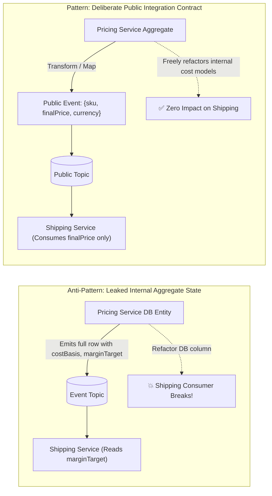
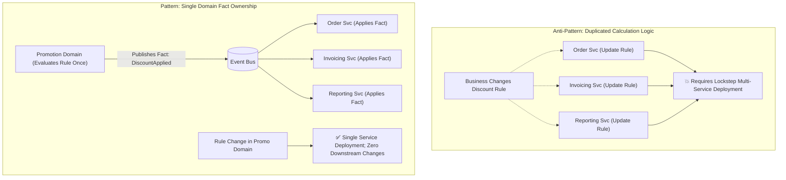
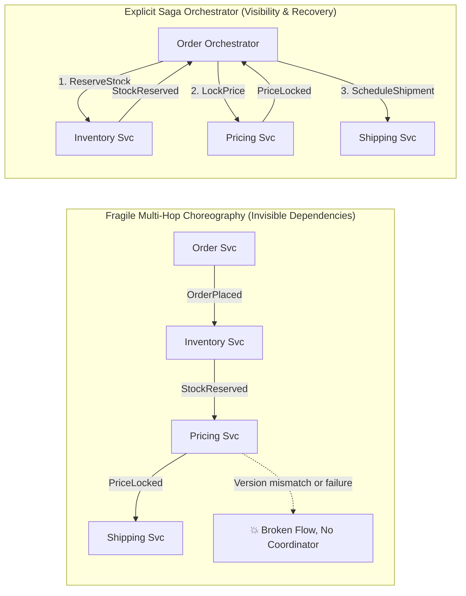
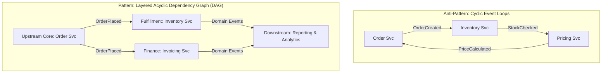
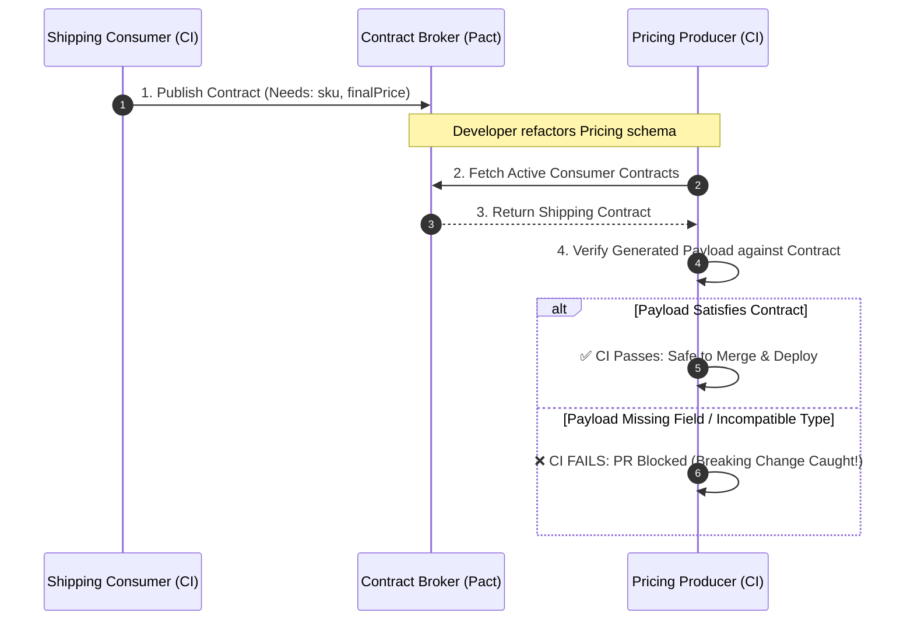

# Event-Driven Distributed Monolith Prevention — Key Takeaways

> **Parent**: [Messaging & Event Streaming](index.md)  
> **Source**: [How to Stop an Event-Driven System From Becoming a Distributed Monolith](../../articles/messaging/how-to-stop-an-event-driven-system-from-becoming-a-distributed-monolith.md)  
> **Taxonomy Reference**: §3.3 Event-Driven & Messaging  

## Contents

| ID | Problem | Key Concept |
|:---|:---|:---|
| [`broker-183`](#broker-183-leaked-internal-aggregate-state-vs-deliberate-public-event-contract) | Emitting internal aggregate state or database row projections in event payloads breaks downstream consumers on internal refactors | Public Contract vs Internal State Leakage, Deliberate Event Design, Bounded Context encapsulation |
| [`broker-184`](#broker-184-duplicated-business-rule-calculations-vs-single-domain-fact-ownership) | Multiple consumers reimplementing identical business calculations causes logic drift and lockstep deployment requirements | Single-Domain Fact Ownership, Authority Principle, Event-Carried Result vs Re-Derivation |
| [`broker-185`](#broker-185-long-multi-hop-reactive-chains-vs-workflow-visibility-and-sla-fragility) | Deep cascades of reactive event hops conceal end-to-end latency, version fragility, and multi-service failure blast radiuses | Choreography Cascade Smell, Dependency Depth Auditing, Orchestration Threshold |
| [`broker-186`](#broker-186-cyclic-event-dependencies-and-temporal-service-coupling) | Bidirectional and cyclic event subscriptions create hidden deadlocks and destroy independent service deployability | Acyclic Event Architecture, Upstream-Downstream Directionality, Layered Domain Topology |
| [`broker-187`](#broker-187-consumer-driven-contract-testing-cdc-for-asynchronous-event-producers) | Producer schema changes inadvertently breaking downstream consumers without compile-time or runtime warning | Consumer-Driven Contract Testing (CDC), Pact for Messaging, Pre-Merge CI Contract Verification |
| [`broker-188`](#broker-188-broker-schema-registry-scope-boundaries-structural-vs-semantic-governance) | Relying solely on schema registries (Avro/JSON Schema) creates a false sense of decoupling against semantic and behavioral drift | Schema Registry Scope Boundaries, Structural vs Semantic Governance, API Stewardship |

---

## broker-183: Leaked Internal Aggregate State vs Deliberate Public Event Contract

| | |
|:---|:---|
| **Problem** | When designing event payloads, producers frequently dump their entire domain aggregate or internal database entity into the message (e.g., Pricing includes `costBasis`, `marginTarget`, `warehouseAdjustment`, and internal database IDs in its event payload). When downstream consumers (e.g., Shipping or Invoicing) inspect and bind their code to these internal fields, the producer loses the ability to refactor its internal schema, alter database columns, or optimize pricing algorithms without breaking external builds and requiring cross-team release coordination. |
| **Root cause** | Treating events as convenient transport dumps of internal domain state (data-on-the-outside as data-on-the-inside) rather than deliberately designed, minimal public API contracts. |

**Strategy**: Enforce strict **Public Event vs Internal Domain Event Separation**:

1. **Internal Domain Events vs Public Integration Events**: Maintain a strict boundary between internal events (used within the microservice boundary or module for audit/event sourcing) and public integration events (published to external shared topics).
2. **Minimalist Deliberate Contracts**: Public event schemas must expose only the stable business facts required by external consumers, intentionally excluding internal calculation variables, operational metadata, and private identifiers.
3. **Dedicated Contract Review Process**: Treat event schemas with the exact same rigor, review stages, and deprecation policies as public REST or gRPC API contracts.



```json
// Anti-Pattern: Leaked aggregate state
{
  "sku": "SKU-9921",
  "costBasis": 42.50,
  "marginTarget": 0.35,
  "warehouseAdjustment": -1.20,
  "finalPrice": 56.18,
  "internalPricingRuleId": "RULE-MAR-2026"
}

// Best Practice: Deliberate minimal public contract
{
  "sku": "SKU-9921",
  "finalPrice": 56.18,
  "currency": "USD"
}
```

**Tradeoff**: Requires explicit DTO mapping and translation logic at the producer boundary, but guarantees producer autonomy and decouples internal persistence from external consumers.

> **Dictionary**: [Public Event](../../reference-dictionary/cqrs-event-driven.md#public-event), [Event Carried State Transfer](../../reference-dictionary/cqrs-event-driven.md#event-carried-state-transfer), [Bounded Context](../../reference-dictionary/architecture-patterns.md#bounded-context)  
> **Related**: [`broker-124`](event-driven-architecture-questions-takeaways.md#broker-124-multi-version-consumer-event-schema-evolution), [`broker-128`](event-driven-architecture-questions-takeaways.md#broker-128-anti-degradation-governance-against-eda-distributed-monoliths)

---

## broker-184: Duplicated Business Rule Calculations vs Single-Domain Fact Ownership

| | |
|:---|:---|
| **Problem** | Multiple downstream microservices (e.g., Order, Invoicing, Reporting) each independently implement duplicate business logic (such as dynamic tax calculation, promotional discount percentages, or tier eligibility rules) instead of consuming a single authoritative decision. When the business rule changes, all three services must be modified, tested, and deployed in lockstep. If one service is delayed or implements the rule slightly differently, calculations diverge silently across systems. |
| **Root cause** | Violating single-domain ownership and the "Authority Principle": distributing business decision-making logic across consumers instead of establishing a single source of truth that publishes computed facts. |

**Strategy**: Apply **Single-Domain Ownership and Fact Publishing**:

1. **Domain Authority Ownership**: Identify the single business domain responsible for the rule (e.g., Discounting is exclusively owned by Promotion/Pricing domain).
2. **Compute Once, Publish Fact**: The authoritative service evaluates all input parameters, applies current business rules, and publishes the evaluated output as an immutable fact (`DiscountApplied { discountAmount, effectiveRate, appliedPromotionId }`).
3. **Downstream Passive Subscription**: Downstream services treat the published result as an indisputable business fact and apply it directly without recalculating or interpreting raw discount equations.



**Tradeoff**: Centralizing rule execution requires the owning domain to process requests before downstream actions can proceed, but eliminates calculation discrepancies and eradicates lockstep deployment coupling.

> **Dictionary**: [Single Source of Truth](../../reference-dictionary/data-concurrency.md#single-source-of-truth), [Distributed Monolith](../../reference-dictionary/architecture-patterns.md#distributed-monolith), [Lockstep Deployment](../../reference-dictionary/architecture-patterns.md#lockstep-deployment)  
> **Related**: [`broker-128`](event-driven-architecture-questions-takeaways.md#broker-128-anti-degradation-governance-against-eda-distributed-monoliths), [`broker-171`](event-driven-vs-message-driven-takeaways.md#broker-171-fact-events-vs-command-messages-in-event-driven-architectures)

---

## broker-185: Long Multi-Hop Reactive Chains vs Workflow Visibility and SLA Fragility

| | |
|:---|:---|
| **Problem** | A single logical business transaction (e.g., "Place Order") is implemented as a long, multi-hop choreography chain across 4+ services: `Order` publishes `OrderPlaced` $\rightarrow$ `Inventory` reacts and publishes `StockReserved` $\rightarrow$ `Pricing` reacts and publishes `PriceLocked` $\rightarrow$ `Shipping` reacts and publishes `ShipmentScheduled`. If any service in the middle is down, deploys an incompatible schema, or introduces latency, the business flow stalls mid-flight without clear workflow ownership, making troubleshooting, timeouts, and rollbacks extraordinarily difficult. |
| **Root cause** | Relying on uncoordinated pure choreography for complex end-to-end workflows, assuming that asynchronous event hops remove architectural dependencies when they merely make them invisible. |

**Strategy**: Establish **Workflow Dependency Metrics and Hybrid Orchestration**:

1. **Choreography Depth Threshold ($\le 2\text{--}3$ hops)**: Measure dependency chain depth across event flows as an explicit architectural metric. Limit autonomous choreography hops to short, decoupled reactions.
2. **Directed Saga Orchestration for Complex Multi-Step Flows**: When a workflow spans $\ge 3\text{--}4$ sequential hops, requires strict timeouts, or mandates coordinated compensation on failure, transition from choreography to an **Orchestrator-based Saga** (e.g., Order Workflow Orchestrator).
3. **End-to-End Latency & Tracing SLOs**: Mandate correlation and causation ID tracking across every hop to monitor distributed flow duration and detect cascading delays.



**Tradeoff**: Orchestration introduces a centralized coordinator service for the specific workflow, but provides explicit state tracking, clear SLA monitoring, deterministic timeout management, and graceful compensations.

> **Dictionary**: [Orchestrator-based Saga](../../reference-dictionary/cqrs-event-driven.md#orchestrator-based-saga), [Correlation ID](../../reference-dictionary/cqrs-event-driven.md#correlation-id), [Coordination Cost](../../reference-dictionary/architecture-patterns.md#coordination-cost)  
> **Related**: [`broker-34`](kafka-design-patterns.md#broker-34-saga-choreography), [`broker-165`](event-driven-cross-service-debugging-takeaways.md#broker-165-distributed-correlation-id-and-context-propagation-across-asynchronous-boundaries)

---

## broker-186: Cyclic Event Dependencies and Temporal Service Coupling

| | |
|:---|:---|
| **Problem** | Services develop cyclic event dependencies where Service A reacts to Service B's events, Service B reacts to Service C's events, and Service C in turn reacts to Service A's events (e.g., `Order` $\rightarrow$ `Inventory` $\rightarrow$ `Pricing` $\rightarrow$ `Order`). Cyclic dependencies introduce distributed race conditions, infinite event loops, startup/recovery sequencing deadlocks, and eliminate independent team release cycles. |
| **Root cause** | Lack of architectural layer boundaries and absence of acyclic dependency governance in event-driven systems. |

**Strategy**: Design an **Acyclic Layered Event Architecture**:

1. **Acyclic Dependency Principle (ADP)**: The event dependency graph between bounded contexts must be a Directed Acyclic Graph (DAG). No cycle of events may exist across services.
2. **Upstream / Downstream Classification**: Define clear producer/consumer hierarchies. Core upstream domains (e.g., User, Product) emit facts; downstream composite domains (e.g., Recommendation, Reporting) consume facts without forcing upstream domains to subscribe back to downstream events.
3. **Automated Graph Linting**: Periodically generate and audit service subscription graphs from broker topic metadata or distributed tracing topologies to detect and alert on emerging cycles.



**Tradeoff**: Prevents bidirectional shortcuts and may require introducing intermediate coordination services or restructuring bounded context boundaries, but ensures predictable failure isolation and true independent deployability.

> **Dictionary**: [Circular Dependency](../../reference-dictionary/architecture-patterns.md#circular-dependency), [Upstream/Downstream Relationship](../../reference-dictionary/architecture-patterns.md#upstreamdownstream-relationship), [Architecture Tests](../../reference-dictionary/testing.md#architecture-tests)  
> **Related**: [`broker-128`](event-driven-architecture-questions-takeaways.md#broker-128-anti-degradation-governance-against-eda-distributed-monoliths), [`broker-174`](event-driven-vs-message-driven-takeaways.md#broker-174-the-multi-subscriber-naming-litmus-test)

---

## broker-187: Consumer-Driven Contract Testing (CDC) for Asynchronous Event Producers

| | |
|:---|:---|
| **Problem** | Producers refactor event payloads (removing "unused" fields, restructuring nested JSON objects, or modifying data types) without realizing that downstream services depend on those exact attributes. Because asynchronous message brokers decouple build pipelines, breaking changes slip through unit tests and deploy into production, failing only when downstream consumers attempt to deserialize payloads at runtime. |
| **Root cause** | Relying on producer-only unit tests and assuming schema compatibility without verifying explicit downstream consumer field expectations before merging producer code. |

**Strategy**: Implement **Consumer-Driven Contract Testing (CDC)** with Pact / Spring Cloud Contract:

1. **Consumer Specifies Expectations**: Each consuming service writes a contract test declaring the exact subset of event fields and types it requires to operate.
2. **Contract Publishing to Broker**: Consumers publish their contract specifications (Pacts) to a centralized Contract Broker during their CI runs.
3. **Producer Verification Gate in CI**: During the producer's CI build, the pipeline pulls all registered consumer contracts and verifies that the producer's generated event payloads satisfy all active consumer requirements. If a producer change breaks any consumer contract, the producer's PR build fails immediately.



**Tradeoff**: Requires running and maintaining a contract broker infrastructure (e.g., Pact Broker) and writing consumer mock tests, but shifts breaking integration error detection entirely to pre-merge CI pipelines.

> **Dictionary**: [Contract Testing](../../reference-dictionary/testing.md#contract-testing), [Architecture Tests](../../reference-dictionary/testing.md#architecture-tests)  
> **Related**: [`broker-124`](event-driven-architecture-questions-takeaways.md#broker-124-multi-version-consumer-event-schema-evolution), [`broker-128`](event-driven-architecture-questions-takeaways.md#broker-128-anti-degradation-governance-against-eda-distributed-monoliths)

---

## broker-188: Broker Schema Registry Scope Boundaries: Structural vs Semantic Governance

| | |
|:---|:---|
| **Problem** | Engineering teams assume that adopting a Schema Registry (e.g., Confluent Schema Registry, Azure Schema Registry, Avro/JSON Schema) with `BACKWARD` or `FULL` compatibility modes completely prevents distributed monolith coupling. While the registry prevents low-level binary/field type serialization mismatches, systems still suffer from severe coupling due to semantic changes (changing field business meaning), leaking internal fields, and duplicated domain rules. |
| **Root cause** | Conflating **structural syntax compatibility** (enforced by schema registry serializers) with **semantic contract governance** (business meaning, minimal field exposure, and domain boundaries). |

**Strategy**: Combine **Automated Structural Enforcement with Architectural Domain Governance**:

1. **Schema Registry for Structural Invariants**: Use Schema Registries to enforce syntactic rules: preventing field renames, ensuring default values for new optional fields, and blocking incompatible type conversions.
2. **API Stewardship for Semantic Integrity**: Enforce architectural reviews for new public schemas to ensure:
   - Only minimal integration fields are exposed (no internal aggregate leakage).
   - Domain rule ownership is respected (no duplicated calculation derivations).
   - Event naming reflects immutable past business facts (`OrderPlaced`, not `ProcessOrder`).
3. **Semantic Versioning and Changelogs**: Document semantic changes and maintain migration windows when business meaning of fields evolves.

```
┌─────────────────────────────────────────────────────────────────────────┐
│                    Event Contract Governance Layers                     │
├─────────────────────────────────────────────────────────────────────────┤
│ 1. SEMANTIC GOVERNANCE (Human & Architectural Review)                   │
│    - Minimal Public Fields (Zero Internal Aggregate Leakage)            │
│    - Single-Domain Fact Ownership (No Duplicated Calculations)          │
│    - Consumer-Driven Contracts (Pact pre-merge CI verification)         │
├─────────────────────────────────────────────────────────────────────────┤
│ 2. STRUCTURAL GOVERNANCE (Automated Schema Registry / Avro / Protobuf)  │
│    - Backward / Forward Compatibility Checks                            │
│    - Type Safety, Default Values, Required Field Checks                 │
│    - Wire Serialization & Deserialization Enforcement                   │
└─────────────────────────────────────────────────────────────────────────┘
```

**Tradeoff**: Schema registries automate syntax safety, but team discipline and domain boundary reviews remain irreplaceable for preventing architectural degradation.

> **Dictionary**: [Distributed Monolith](../../reference-dictionary/architecture-patterns.md#distributed-monolith), [Public Event](../../reference-dictionary/cqrs-event-driven.md#public-event), [Event-Driven Architecture](../../reference-dictionary/cqrs-event-driven.md#event-driven-architecture)  
> **Related**: [`broker-124`](event-driven-architecture-questions-takeaways.md#broker-124-multi-version-consumer-event-schema-evolution), [`broker-128`](event-driven-architecture-questions-takeaways.md#broker-128-anti-degradation-governance-against-eda-distributed-monoliths), [`broker-183`](#broker-183-leaked-internal-aggregate-state-vs-deliberate-public-event-contract)
