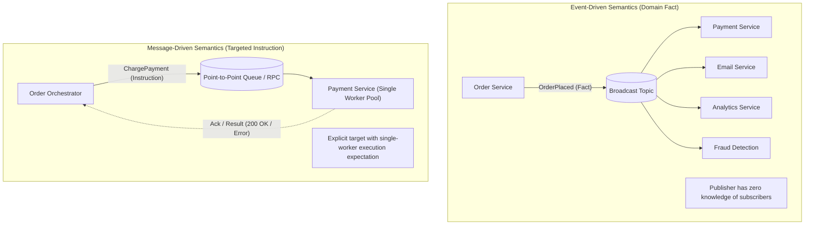
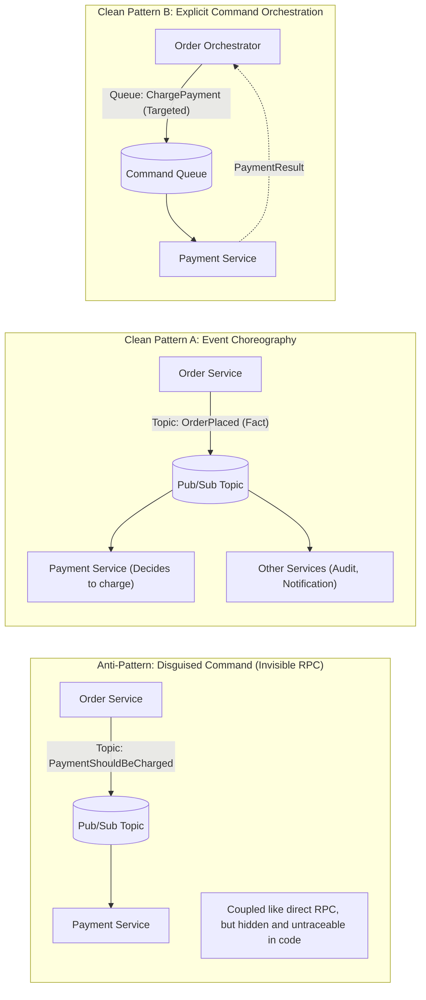
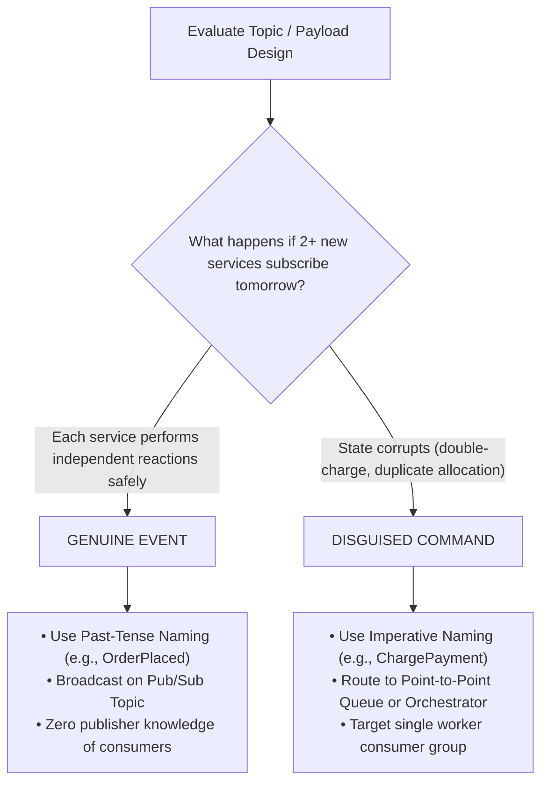
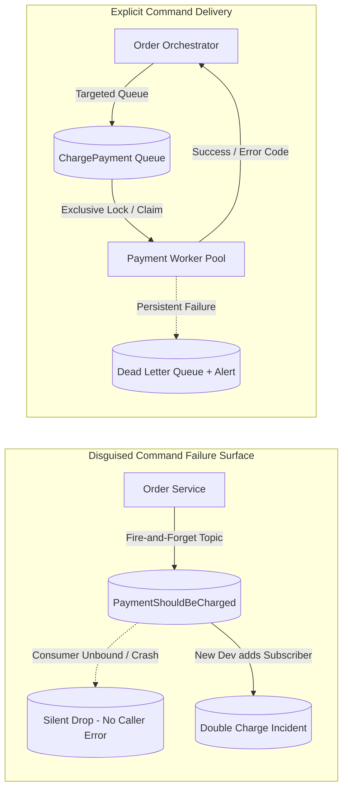
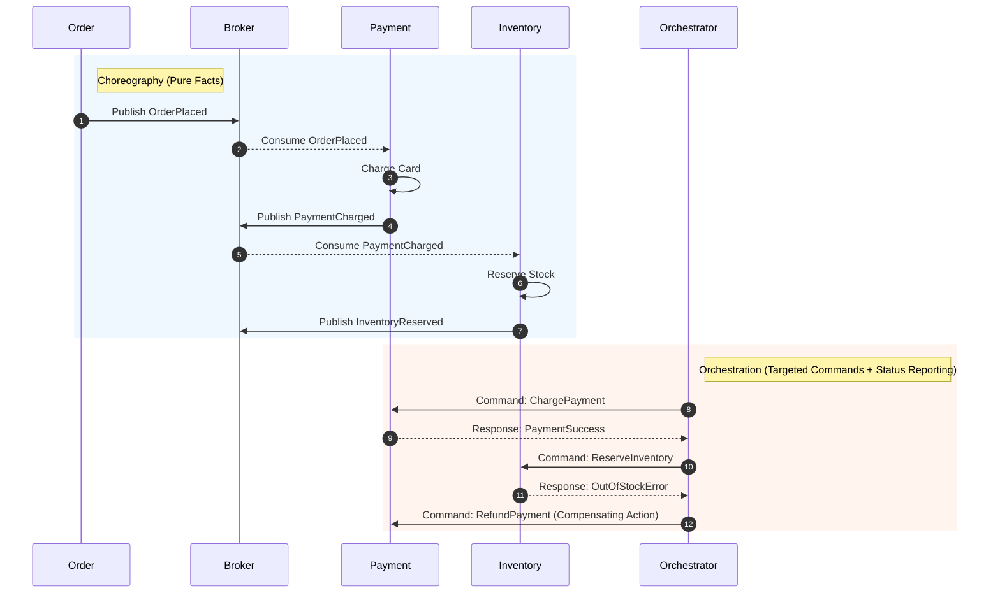
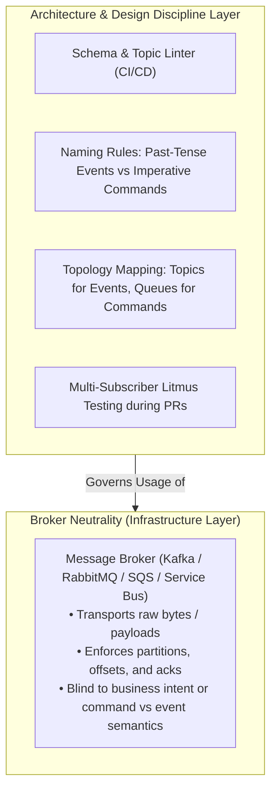

# Event-Driven vs Message-Driven Systems — Key Takeaways

> **Parent**: [Messaging & Event Streaming](index.md)  
> **Source**: [The Real Difference Between Event-Driven and Message-Driven Systems](../../articles/messaging/the-real-difference-between-event-driven-and-message-driven-systems.md)  
> **Taxonomy Reference**: §3.3 Event-Driven & Messaging  

## Contents

| ID | Problem | Key Concept |
|:---|:---|:---|
| [`broker-171`](#broker-171-fact-vs-instruction-semantics-event-vs-command-separation) | Conflating events and messages due to identical broker transport mechanics | Fact vs Instruction semantics, past-tense domain facts vs imperative commands |
| [`broker-172`](#broker-172-disguised-command-anti-pattern-invisible-rpc-over-pubsub) | Wrapping imperative commands into pseudo-event topic names to avoid direct coupling | Disguised Command Anti-Pattern, Invisible RPC, topic-bound tight coupling |
| [`broker-173`](#broker-173-the-multi-subscriber-naming-litmus-test) | Inability to objectively verify whether a topic payload is an event or a command | Multi-Subscriber Naming Litmus Test, invariant violation on multi-subscription |
| [`broker-174`](#broker-174-silent-failure-modes-of-disguised-pubsub-commands) | Commands routed over pub/sub topics fail silently or execute multiple times | Silent failure modes, lost consumer unreachability, duplicate subscription execution |
| [`broker-175`](#broker-175-choreography-vs-orchestration-architecture-selection) | Conflating decentralized event choreography with centralized command orchestration | Choreography vs Orchestration, Saga state machines, explicit rollback visibility |
| [`broker-176`](#broker-176-broker-neutrality-and-architectural-design-governance) | Relying on messaging brokers to enforce domain semantics and architectural boundaries | Broker Neutrality, dumb transport vs smart endpoints, schema & naming linting |

---

## broker-171: Fact vs Instruction Semantics (Event vs Command Separation)

| | |
|:---|:---|
| **Problem** | Engineering teams use "event-driven" and "message-driven" interchangeably because both architectures move asynchronous byte payloads through brokers (topics/queues) to consumer services. When payload semantics are not explicitly differentiated, developers treat command instructions as events, expecting decoupled pub/sub scalability while inadvertently relying on point-to-point command behavior. |
| **Root cause** | Transport-level equivalence (brokers carrying byte arrays) blinding teams to payload-level semantic divergence (past-tense domain facts vs imperative future instructions). |

**Strategy**: Enforce strict separation between **Events** and **Commands** at the conceptual, naming, and contract levels:

1. **Events (Past-Tense Facts)**:
   - Statements of immutable historical occurrence (`OrderPlaced`, `PaymentCharged`, `InventoryReserved`).
   - Published by the producer without knowing, targeting, or caring who or how many consumers listen.
   - Consumers decide autonomously what the occurrence means to their local bounded context.
2. **Commands (Imperative Instructions)**:
   - Explicit instructions requesting an action in the future (`ChargePayment`, `ReserveInventory`, `ShipOrder`).
   - Targeted at a specific, known recipient that is expected to perform the action and report back success or failure.
   - Makes sense only when handled by exactly one designated actor.

**Tradeoff**: Requires architectural discipline and contract enforcement; prevents misrouted traffic by ensuring events use broadcast topics (Kafka, Event Grid) while commands use point-to-point queues (Service Bus Queues, RabbitMQ) or direct RPC (gRPC/REST).

> **Dictionary**: [Event vs Message](../../reference-dictionary/cqrs-event-driven.md#event-vs-message), [Event-Driven Architecture](../../reference-dictionary/cqrs-event-driven.md#event-driven-architecture)  
> **Azure**: [Azure Event Grid](../../architecture-azure/integration/event-grid/), [Azure Event Hubs](../../architecture-azure/integration/event-hubs/), [Azure Service Bus Queues](../../architecture-azure/integration/service-bus/)  
> **Related**: [`broker-121`](event-driven-architecture-questions-takeaways.md#broker-121-inapplicability-boundaries-of-event-driven-architecture), [`broker-129`](when-to-avoid-event-driven-architecture-takeaways.md#broker-129-strict-transactional-invariants-vs-distributed-window-of-uncertainty), [`broker-172`](#broker-172-disguised-command-anti-pattern-invisible-rpc-over-pubsub)  

---

## broker-172: Disguised Command Anti-Pattern (Invisible RPC over Pub/Sub)

| | |
|:---|:---|
| **Problem** | Developers name broadcast topics with modal or imperative phrases (e.g., `PaymentShouldBeCharged`, `InventoryShouldReserve`) under the belief that routing through a pub/sub broker decouples their microservices. In reality, the upstream producer is implicitly relying on one specific downstream service to react in a specific way, creating tight point-to-point coupling while hiding the dependency inside a topic name rather than an explicit interface contract. |
| **Root cause** | Attempting to avoid visible direct dependencies by dressing imperative command RPCs in event-shaped pub/sub clothing. |

**Strategy**: Identify and eliminate the **Disguised Command Anti-Pattern**:

1. **Audit Topic Naming**: Scan topic catalogues for modal verbs (`*Should*`, `*NeedsTo*`, `*Must*`) or imperative verbs (`*Do*`, `*Execute*`).
2. **Expose Real Dependencies**: If a payload requires exactly one specific service to execute an action, make the dependency explicit:
   - Use direct RPC (gRPC / HTTP) with timeouts, retries, and circuit breakers if synchronous feedback is required.
   - Use point-to-point command queues or a central Saga Orchestrator if asynchronous execution is required.
3. **Refactor to Genuine Events**: If decentralized pub/sub is genuinely desired, re-anchor the event to what actually happened in the producer's domain (`OrderPlaced` instead of `PaymentShouldBeCharged`), letting downstream consumers react on their own terms.

**Tradeoff**: Removes the illusion of "free decoupling," forcing architects to explicitly choose between genuine broadcast event choreography and structured command orchestration.

> **Dictionary**: [Disguised Command Anti-Pattern](../../reference-dictionary/cqrs-event-driven.md#disguised-command-anti-pattern), [Orchestrator-based Saga](../../reference-dictionary/cqrs-event-driven.md#orchestrator-based-saga)  
> **Azure**: [Azure Service Bus Topics vs Queues](../../architecture-azure/integration/service-bus/), [Azure Logic Apps](../../architecture-azure/integration/logic-apps/)  
> **Related**: [`broker-128`](event-driven-architecture-questions-takeaways.md#broker-128-anti-degradation-governance-against-eda-distributed-monoliths), [`broker-171`](#broker-171-fact-vs-instruction-semantics-event-vs-command-separation), [`broker-173`](#broker-173-the-multi-subscriber-naming-litmus-test)  

---

## broker-173: The Multi-Subscriber Naming Litmus Test

| | |
|:---|:---|
| **Problem** | During architecture reviews and code reviews, teams lack an objective, deterministic test to verify whether a proposed asynchronous topic payload represents a genuine domain event or a disguised command. |
| **Root cause** | Subjective architectural discussions centered on developer intent rather than verifiable multi-subscriber safety and domain invariants. |

**Strategy**: Apply the **Multi-Subscriber Naming Litmus Test**:

$$\text{Litmus Test}: \text{If 2+ new services subscribe to this topic tomorrow, does it enhance the system or break business invariants?}$$

- **Genuine Event (`OrderPlaced`, past-tense noun)**: Multiple independent subscribers (Notifications, Analytics, Loyalty, Fraud) can subscribe and react without coordination. Adding subscribers is a pure feature enhancement.
- **Disguised Command (`PaymentShouldBeCharged`, imperative/modal)**: If a second service subscribes and acts on the payload, the customer is double-charged or stock is double-allocated. Multi-subscriber participation produces a critical system bug.

**Tradeoff**: Provides an unambiguous, instant design heuristic for engineering teams with zero runtime overhead; requires renaming topics and refactoring messaging topologies whenever the test reveals disguised commands.

> **Dictionary**: [Naming Litmus Test](../../reference-dictionary/cqrs-event-driven.md#naming-litmus-test), [Idempotency](../../reference-dictionary/cqrs-event-driven.md#idempotency)  
> **Azure**: [Azure Event Hubs](../../architecture-azure/integration/event-hubs/), [Azure Service Bus](../../architecture-azure/integration/service-bus/)  
> **Related**: [`broker-121`](event-driven-architecture-questions-takeaways.md#broker-121-inapplicability-boundaries-of-event-driven-architecture), [`broker-172`](#broker-172-disguised-command-anti-pattern-invisible-rpc-over-pubsub), [`broker-174`](#broker-174-silent-failure-modes-of-disguised-pubsub-commands)  

---

## broker-174: Silent Failure Modes of Disguised Pub/Sub Commands

| | |
|:---|:---|
| **Problem** | When imperative commands are placed on pub/sub topics, systems inherit the tight coupling of direct calls along with the invisibility and fragile failure modes of asynchronous messaging. If the intended consumer's subscription silently disconnects or drops, no immediate error is raised to the upstream caller, leaving transactions unexecuted. If another team adds a consumer group thinking it is a standard event, operations execute multiple times without alerting. |
| **Root cause** | Conflating fire-and-forget broadcast transport with targeted execution guarantees, eliminating both compile-time contract checks and runtime RPC error propagation. |

**Strategy**: Match execution guarantees to interaction semantics:

1. **For Commands**:
   - Use dedicated point-to-point queues where messages are claimed by a single worker instance (competing consumers pattern).
   - Require explicit consumer acknowledgments (`ACK`) and dead-letter queue routing (`DLQ`) on persistent failures.
   - For critical paths, utilize synchronous RPC (gRPC / HTTP) with immediate HTTP status code return and circuit breakers.
2. **For Events**:
   - Consumers must be fully autonomous and idempotent.
   - A failure in one event consumer (e.g., Analytics) must never block or affect other independent consumers (e.g., Shipping).

**Tradeoff**: Direct commands and dedicated queues require explicit timeout and backpressure management, but eliminate untraceable silent transaction dropouts in production.

> **Dictionary**: [Dead Letter Queue (DLQ)](../../reference-dictionary/messaging.md#dead-letter-queue-dlq), [Competing Consumers](../../reference-dictionary/messaging.md#competing-consumers), [Consumer Lag](../../reference-dictionary/messaging.md#consumer-lag)  
> **Azure**: [Azure Service Bus Dead-Lettering](../../architecture-azure/integration/service-bus/), [Azure Application Insights](../../architecture-azure/observability/application-insights/)  
> **Related**: [`broker-141`](event-loss-duplicates-reprocessing-takeaways.md#broker-141-tripartite-failure-surface-separation-in-at-least-once-delivery), [`broker-170`](event-driven-cross-service-debugging-takeaways.md#broker-170-silent-processing-failure-dropouts-vs-context-rich-dead-letter-topic-routing), [`broker-172`](#broker-172-disguised-command-anti-pattern-invisible-rpc-over-pubsub)  

---

## broker-175: Choreography vs Orchestration Architecture Selection

| | |
|:---|:---|
| **Problem** | Engineering teams struggle to choose between event choreography and command orchestration, often implementing "accidental choreography"—where a complex, multi-service transaction is driven entirely by chaining events across services, leading to unobservable end-to-end workflow states, difficult partial failure retries, and convoluted compensation rollbacks. |
| **Root cause** | Dogmatically adopting pure event choreography under the assumption that central coordinators are anti-patterns, ignoring the cognitive and operational complexity of distributed implicit state machines. |

**Strategy**: Select coordination style based on workflow complexity, state tracking, and failure recovery requirements:

| Dimension | Event Choreography | Command Orchestration |
|:---|:---|:---|
| **Primary Interaction** | Events (broadcast facts: `OrderPlaced`) | Commands (targeted instructions: `ChargePayment`) |
| **State Tracking** | Implicit (scattered across participating service databases) | Explicit (central state machine in orchestrator) |
| **Coordination** | Decentralized (services react autonomously) | Centralized (Saga Orchestrator dictates steps) |
| **Error Handling / Rollback** | Complex compensating event chains (`RefundPaymentRequested`) | Simple, explicit compensating step execution by coordinator |
| **Visibility** | Requires distributed tracing across $N$ topics to reconstruct flow | Single query on orchestrator reveals exact workflow state and current step |
| **Best Fit** | Independent, loosely coupled broadcast reactions (notifications, search indexing, metrics) | Strict multi-step business transactions (checkout, order fulfillment, account opening) |

**Tradeoff**: Choreography maximizes service autonomy and minimizes central bottlenecks at the cost of global workflow visibility; Orchestration provides full workflow visibility and straightforward compensation logic at the cost of maintaining a central orchestrator service.

> **Dictionary**: [Orchestrator-based Saga](../../reference-dictionary/cqrs-event-driven.md#orchestrator-based-saga), [Choreography](../../reference-dictionary/messaging.md#choreography), [Compensating Event](../../reference-dictionary/cqrs-event-driven.md#compensating-event)  
> **Azure**: [Azure Durable Functions](../../architecture-azure/compute/functions/), [Azure Logic Apps](../../architecture-azure/integration/logic-apps/)  
> **Related**: [`broker-124`](event-driven-architecture-questions-takeaways.md#broker-124-replay-safe-idempotent-consumer-state-reconstruction), [`broker-128`](event-driven-architecture-questions-takeaways.md#broker-128-anti-degradation-governance-against-eda-distributed-monoliths), [`broker-140`](event-driven-business-consistency-takeaways.md#broker-140-multi-service-distributed-sagas-vs-local-invariants)  

---

## broker-176: Broker Neutrality and Architectural Design Governance

| | |
|:---|:---|
| **Problem** | Architects mistakenly assume that messaging brokers (Apache Kafka, RabbitMQ, AWS SQS, Azure Service Bus) will automatically enforce domain semantics or prevent architectural anti-patterns. When systems become tightly coupled distributed monoliths, teams blame the broker technology. |
| **Root cause** | Failing to recognize that message brokers are infrastructure-level transports agnostic to domain intent, payload semantics, or consumer cardinality. |

**Strategy**: Establish architectural governance and automated linting independent of broker infrastructure:

1. **Broker Neutrality Awareness**: Recognize that Kafka, RabbitMQ, and SQS happily transmit events, commands, documents, or RPC payloads without distinction. Semantics are a design discipline enforced by developers.
2. **Topic & Message Naming Governance**: Enforce strict CI/CD linting on schema contracts and topic names:
   - **Events**: Past-tense domain nouns (`<entity>-<action-past-tense>`, e.g., `orders.order-placed.v1`).
   - **Commands**: Imperative verbs targeted to queues (`<service>.<action-imperative>`, e.g., `payment-service.charge-card.v1`).
3. **Infrastructure Nudging**: Use the broker's native topological strengths:
   - Pub/sub topics (Kafka, Event Grid, Service Bus Topics) for broadcast events with multiple consumer groups.
   - Point-to-point queues (Service Bus Queues, RabbitMQ queues, SQS) for load-balanced single-consumer command processing.

**Tradeoff**: Requires team education, schema registry validation, and automated pull-request linters, but prevents architectural rot and protects event streaming platforms from turning into unmaintainable distributed monoliths.

> **Dictionary**: [Schema Registry](../../reference-dictionary/messaging.md#schema-registry), [Distributed Commit Log](../../reference-dictionary/messaging.md#distributed-commit-log), [Event Backbone](../../reference-dictionary/cqrs-event-driven.md#event-backbone)  
> **Azure**: [Azure Event Hubs Schema Registry](../../architecture-azure/integration/event-hubs/), [Azure Service Bus Topics vs Queues](../../architecture-azure/integration/service-bus/)  
> **Related**: [`broker-126`](event-driven-architecture-questions-takeaways.md#broker-126-distributed-production-flow-debugging-across-poly-service-eda), [`broker-128`](event-driven-architecture-questions-takeaways.md#broker-128-anti-degradation-governance-against-eda-distributed-monoliths), [`broker-171`](#broker-171-fact-vs-instruction-semantics-event-vs-command-separation)  

---

## Cross-References

- **Dictionary**: [Event vs Message](../../reference-dictionary/cqrs-event-driven.md#event-vs-message), [Disguised Command Anti-Pattern](../../reference-dictionary/cqrs-event-driven.md#disguised-command-anti-pattern), [Naming Litmus Test](../../reference-dictionary/cqrs-event-driven.md#naming-litmus-test), [Orchestrator-based Saga](../../reference-dictionary/cqrs-event-driven.md#orchestrator-based-saga), [Choreography](../../reference-dictionary/messaging.md#choreography)
- **Azure Implementations**: [Azure Event Grid](../../architecture-azure/integration/event-grid/), [Azure Event Hubs](../../architecture-azure/integration/event-hubs/), [Azure Service Bus](../../architecture-azure/integration/service-bus/), [Azure Durable Functions](../../architecture-azure/compute/functions/)
- **Related System Design**:
  - [`broker-119` – `broker-128`](event-driven-architecture-questions-takeaways.md) — 10 EDA Questions Key Takeaways
  - [`broker-129` – `broker-133`](when-to-avoid-event-driven-architecture-takeaways.md) — When to Avoid EDA Key Takeaways
  - [`broker-134` – `broker-140`](event-driven-business-consistency-takeaways.md) — Business Consistency in EDA Key Takeaways
  - [`broker-141` – `broker-146`](event-loss-duplicates-reprocessing-takeaways.md) — Event Loss, Duplicates & Reprocessing Key Takeaways
  - [`broker-165` – `broker-170`](event-driven-cross-service-debugging-takeaways.md) — Cross-Service Debugging Key Takeaways
