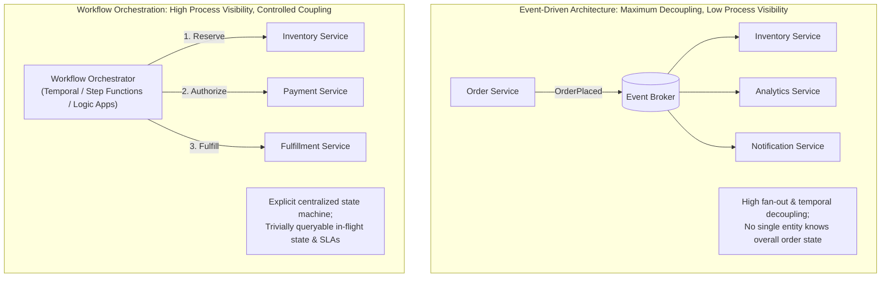
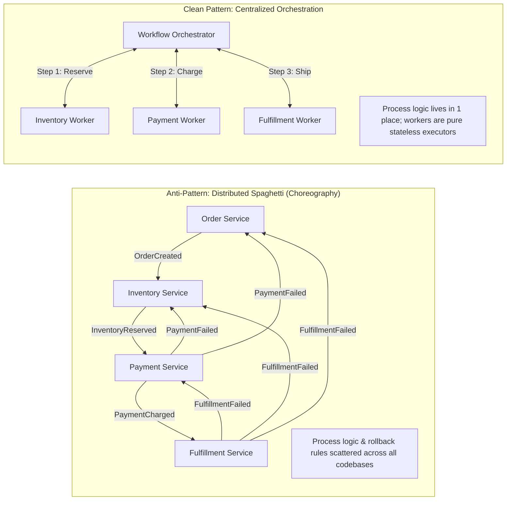
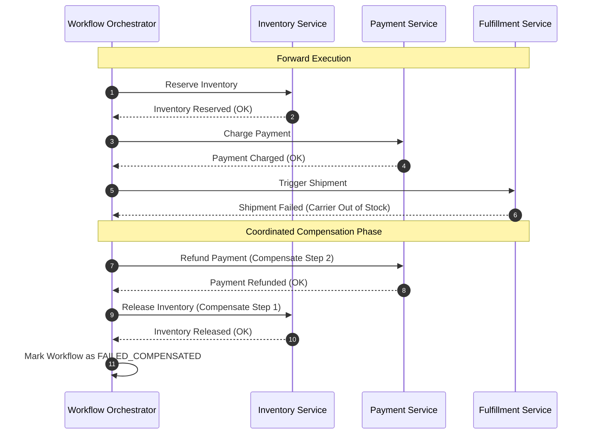
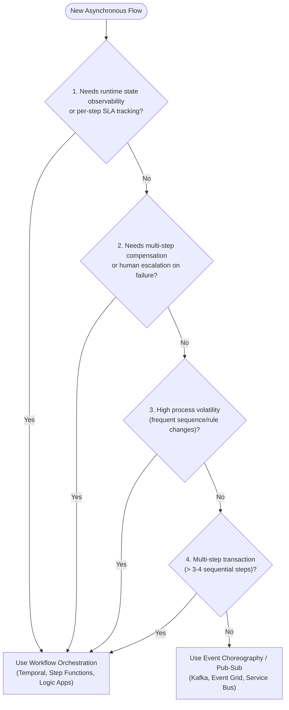
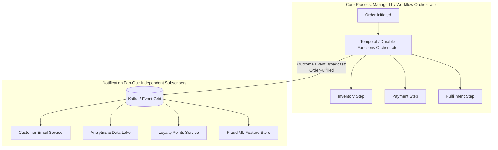
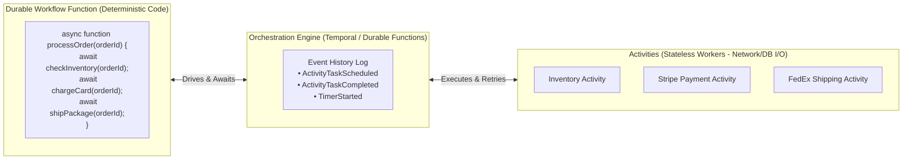
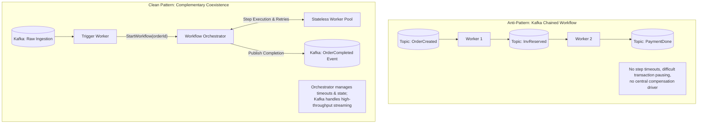

# Event-Driven vs. Workflow-Driven Architecture — Key Takeaways

> **Parent**: [Messaging & Event Streaming](index.md)  
> **Source**: [Event-Driven vs. Workflow-Driven Architecture: How to Choose](../../articles/messaging/event-driven-vs-workflow-driven-architecture-how-to-choose.md)  
> **Taxonomy Reference**: §3.3 Event-Driven & Messaging  

## Contents

| ID | Problem | Key Concept |
|:---|:---|:---|
| [`broker-205`](#broker-205-decoupling-vs-runtime-visibility-tradeoff) | Optimizing purely for decoupling leaves multi-step async transactions unobservable during runtime incidents | Decoupling vs Runtime Visibility, fan-out event emission vs observable centralized workflow state |
| [`broker-206`](#broker-206-distributed-spaghetti-anti-pattern-in-saga-choreography) | Multi-step choreography scatters process routing across all services, creating hidden coupling | Distributed Spaghetti Anti-Pattern, implicit choreography rules, hidden process coupling |
| [`broker-207`](#broker-207-complex-multi-step-compensating-transactions-in-distributed-sagas) | Partial failures in choreography require fragile multi-hop rollback events that fail silently | Orchestrated Saga Compensation, reverse compensating sequence, deterministic failure recovery |
| [`broker-208`](#broker-208-three-question-architectural-selection-framework) | Teams choose architecture patterns based on hype rather than systematic operational criteria | Three-Question Selection Framework (Runtime State, Failure Complexity, Process Volatility) |
| [`broker-209`](#broker-209-process-vs-notification-partitioning-hybrid-architecture) | Forcing an entire system into 100% choreography or 100% orchestration creates architectural dysfunction | Process vs Notification Partition Rule, hybrid workflow orchestration with event broadcast |
| [`broker-210`](#broker-210-workflow-as-code-vs-dsl-based-orchestration) | Legacy workflow engines impose brittle JSON/YAML DSLs that resist refactoring and testing | Workflow-as-Code (Temporal paradigm), general-purpose languages, deterministic state machines |
| [`broker-211`](#broker-211-streaming-platform-misuse-as-workflow-orchestrator) | Chaining event streams and consumer groups to simulate state machine workflows creates operational failure | Event Log vs Orchestrator boundaries, separation of event streaming from stateful coordination |

---

## broker-205: Decoupling vs Runtime Visibility Tradeoff

| | |
|:---|:---|
| **Problem** | Engineering teams adopt Event-Driven Architecture (EDA) to decouple services and scale asynchronously. However, when applied to multi-step business transactions (e.g., checkout flows spanning inventory, billing, fraud, and shipping), pure event-driven systems fail to provide runtime visibility into end-to-end progress. When a transaction stalls at step 4 of 8 during an outage, operators cannot query the system to identify stuck orders without expensive cross-system event log reconstruction. |
| **Root cause** | Optimizing solely for structural producer-consumer decoupling while failing to model runtime operational observability, transaction state querying, and debugging complexity. |

**Strategy**: Explicitly evaluate the fundamental tradeoff between **Decoupling** and **Runtime Visibility**:

1. **Event-Driven Architecture (EDA)**:
   - Emits past-tense facts (`OrderPlaced`, `PaymentProcessed`) to an event bus (Kafka, Event Grid).
   - Producers have zero knowledge of consumers; consumers subscribe independently.
   - Ideal for fan-out notifications, immutable audit trails (event sourcing), and high-throughput ingestion.
   - Tradeoff: Sacrifices centralized transaction state tracking.
2. **Workflow Orchestration**:
   - Central coordinator drives explicit steps, timeouts, retries, and compensations.
   - Workflow state is a first-class, queryable entity (`SELECT count(*) WHERE state = 'AWAITING_PAYMENT_CAPTURE'`).
   - Ideal for multi-step processes with defined business outcomes and strict operational SLAs.
   - Tradeoff: Introduces intentional architectural coupling between the orchestrator and participating workers.

**Tradeoff**: Decoupling reduces compile-time and deployment dependencies, but dramatically increases runtime cognitive and debugging overhead during incidents. Orchestration introduces dependency on a central coordinator, but delivers immediate operational visibility and traceable state machines.

> **Dictionary**: [Choreography](../../reference-dictionary/messaging.md#choreography), [Orchestration](../../reference-dictionary/messaging.md#orchestration), [Event-Driven Architecture](../../reference-dictionary/cqrs-event-driven.md#event-driven-architecture)  
> **Azure**: [Azure Event Grid](../../architecture-azure/integration/event-grid/), [Azure Logic Apps](../../architecture-azure/integration/logic-apps/), [Azure Functions (Durable Functions)](../../architecture-azure/compute/functions/)  
> **Related**: [`broker-171`](event-driven-vs-message-driven-takeaways.md#broker-171-fact-vs-instruction-semantics-event-vs-command-separation), [`broker-121`](event-driven-architecture-questions-takeaways.md#broker-121-inapplicability-boundaries-of-event-driven-architecture), [`broker-206`](#broker-206-distributed-spaghetti-anti-pattern-in-saga-choreography)  

---

## broker-206: Distributed Spaghetti Anti-Pattern in Saga Choreography

| | |
|:---|:---|
| **Problem** | Teams implement multi-step business transactions using choreography-based sagas to avoid the perceived coupling of a central coordinator. While the happy path appears clean on architecture diagrams, adding failure handling, compensations, and conditional branching forces every participating microservice to listen for and emit events across the entire workflow. The business process becomes implicitly fragmented across dozens of codebases, resulting in "Distributed Spaghetti" where nobody can understand or modify the process without reading all services simultaneously. |
| **Root cause** | Mistaking the absence of an orchestrator for true decoupling, ignoring that services remain tightly coupled through distributed process routing logic and shared event contracts. |

**Strategy**: Identify and eliminate the **Distributed Spaghetti Anti-Pattern**:

1. **Recognize the Symptoms**:
   - Every service contains subscriptions spanning upstream and downstream workflow stages.
   - Adding a single step to an existing business process requires modifying and deploying multiple independent services.
   - Root-cause analysis requires correlating trace IDs across disparate service logs to understand what event fired next.
2. **Measure Complexity Against Choreography Thresholds**:
   - If a workflow exceeds 3–4 steps, or contains conditional branching and rollback logic, choreography is an anti-pattern.
3. **Consolidate Process Logic into an Orchestrator**:
   - Extract distributed event subscriptions into an explicit state machine or workflow definition.
   - Participating services become simple workers executing atomic tasks (Activities) without needing to know what happened before or what comes next.

**Tradeoff**: Choreography avoids a central coordinator service at the cost of distributed complexity, fragile rollbacks, and hidden coupling. Orchestration centralizes process changes into a single deployable artifact, reducing cross-service churn.

> **Dictionary**: [Distributed Spaghetti](../../reference-dictionary/messaging.md#distributed-spaghetti), [Choreography](../../reference-dictionary/messaging.md#choreography), [Orchestrator-based Saga](../../reference-dictionary/cqrs-event-driven.md#orchestrator-based-saga)  
> **Azure**: [Azure Logic Apps](../../architecture-azure/integration/logic-apps/), [Azure Functions (Durable Task Framework)](../../architecture-azure/compute/functions/)  
> **Related**: [`broker-172`](event-driven-vs-message-driven-takeaways.md#broker-172-disguised-command-anti-pattern-invisible-rpc-over-pubsub), [`broker-125`](event-driven-architecture-questions-takeaways.md#broker-125-choreography-spaghetti-vs-orchestration-coupling), [`broker-207`](#broker-207-complex-multi-step-compensating-transactions-in-distributed-sagas)  

---

## broker-207: Complex Multi-Step Compensating Transactions in Distributed Sagas

| | |
|:---|:---|
| **Problem** | When a multi-step business transaction fails mid-flight (e.g., inventory reserved and payment captured, but fulfillment shipment fails), previous steps must be reversed via compensating transactions. In pure choreography, compensation requires triggering cascade events in reverse order, verifying that each rollback succeeded, and managing partial compensation failures. When compensation events fail or get delayed, distributed systems enter silent, inconsistent states with stranded inventory or unauthorized charges. |
| **Root cause** | Choreographed services lacking durable execution history, global retry governors, and coordinated rollback state tracking. |

**Strategy**: Enforce **Orchestrated Saga Compensation** for complex multi-step transactions:

1. **Pair Every Forward Action with a Compensation Action**:
   - `ReserveInventory` $\leftrightarrow$ `ReleaseInventory`
   - `AuthorizePayment` $\leftrightarrow$ `VoidAuthorization`
   - `CapturePayment` $\leftrightarrow$ `RefundPayment`
2. **Execute Compensation in Reverse Order**:
   - The orchestrator records completed forward steps in durable storage.
   - Upon encountering an unrecoverable step failure, the orchestrator invokes compensating activities in strictly reverse sequence ($N-1, N-2, \dots, 1$).
3. **Handle Compensation Failures Durably**:
   - Compensations must be idempotent and retryable indefinitely.
   - If a compensating activity fails after exhausting retries, the orchestrator raises a persistent alert and halts for operator intervention / human-in-the-loop remediation.

**Tradeoff**: Designing idempotent compensations requires extra domain modeling and database hooks; however, centralized orchestration guarantees that partial failures are systematically unwound or surfaced for operations review rather than remaining undetected.

> **Dictionary**: [Compensating Event](../../reference-dictionary/cqrs-event-driven.md#compensating-event), [Saga Pattern](../../reference-dictionary/data-concurrency.md#saga-pattern), [Idempotency](../../reference-dictionary/cqrs-event-driven.md#idempotency)  
> **Azure**: [Azure Functions (Durable Functions - Saga Pattern)](../../architecture-azure/compute/functions/), [Azure Service Bus Dead-Letter Queues](../../architecture-azure/integration/service-bus/)  
> **Related**: [`broker-124`](event-driven-architecture-questions-takeaways.md#broker-124-event-sourcing-and-saga-coordination), [`broker-206`](#broker-206-distributed-spaghetti-anti-pattern-in-saga-choreography)  

---

## broker-208: Three-Question Architectural Selection Framework

| | |
|:---|:---|
| **Problem** | Engineering teams default to either pure choreography or centralized orchestration based on ideological bias or buzzwords rather than technical requirements. Teams that choose choreography for complex business flows end up with unmaintainable event meshes, while teams that use orchestrators for simple event notifications introduce unnecessary operational bottlenecks. |
| **Root cause** | Lack of an objective, structured decision framework for evaluating whether an asynchronous workflow requires choreography, orchestration, or a hybrid model. |

**Strategy**: Apply the **Three-Question Architectural Selection Framework**:

| Question | If YES / High | If NO / Low |
|:---|:---|:---|
| **1. Runtime State Observability**: Does operations need to answer *"where is this specific transaction right now?"* or track SLA breaches per step? | **Orchestration**: Requires centralized state machine with queryable in-flight state. | **Event Choreography**: Fire-and-forget; only aggregate outcomes or audit logs are required. |
| **2. Failure & Compensation Complexity**: Does failure require undoing previous steps, notifying users, and conditional human escalation? | **Orchestration**: Compensation logic belongs adjacent to the workflow definition. | **Event Choreography**: Failure only requires simple retry-and-log or dead-letter queue routing. |
| **3. Process Volatility**: How frequently will the sequence, rules, or steps of this process change? | **Orchestration**: Updating one workflow definition prevents coordinated multi-repo deployments. | **Event Choreography**: Process is fixed, stable, and well-understood across teams. |

**Practical Rule of Thumb**:
- If you can draw the workflow on a whiteboard in **under two minutes** and failure handling fits on a **sticky note**, choreography is appropriate.
- If you need a **flowchart with conditional branching, timers, and rollbacks**, use an orchestrator.

**Tradeoff**: Requires architectural discipline during design phases; prevents costly production migrations by matching the workflow pattern to the problem complexity before implementation starts.

> **Dictionary**: [Communication Pattern](../../reference-dictionary/messaging.md#communication-pattern), [Choreography](../../reference-dictionary/messaging.md#choreography), [Orchestration](../../reference-dictionary/messaging.md#orchestration)  
> **Azure**: [Azure Architecture Center: Choreography vs Orchestration](https://learn.microsoft.com/azure/architecture/patterns/choreography)  
> **Related**: [`broker-121`](event-driven-architecture-questions-takeaways.md#broker-121-inapplicability-boundaries-of-event-driven-architecture), [`broker-205`](#broker-205-decoupling-vs-runtime-visibility-tradeoff), [`broker-209`](#broker-209-process-vs-notification-partitioning-hybrid-architecture)  

---

## broker-209: Process vs Notification Partitioning (Hybrid Architecture)

| | |
|:---|:---|
| **Problem** | Architects often frame choreography vs orchestration as a mutually exclusive, binary choice for an entire platform. Systems built purely on orchestration become monolithic bottlenecks where even simple audit logging blocks workflow execution. Systems built purely on event streaming suffer from unobservable distributed transactions. |
| **Root cause** | Failing to decompose asynchronous interactions into two fundamentally different concerns: **Processes** versus **Notifications**. |

**Strategy**: Apply the **Partition Rule: Orchestrate Processes, Broadcast Notifications**:

1. **Processes (Multi-Step Execution $\rightarrow$ Orchestration)**:
   - A *process* is a transactional, multi-step sequence with defined prerequisites, business goals, and failure modes.
   - Example: Order Fulfillment Pipeline (Inventory Reservation $\rightarrow$ Payment Capture $\rightarrow$ Warehouse Dispatch).
   - Implementation: Run inside an orchestration engine (Temporal, AWS Step Functions, Azure Logic Apps).
2. **Notifications (Post-Fact Broadcast $\rightarrow$ Events)**:
   - A *notification* is a broadcast stating that an outcome has finalized (`OrderFulfilled`, `UserRegistered`).
   - Downstream consumers (marketing email, CRM sync, search indexers, data lake ETL) listen independently with zero coordination.
   - Implementation: Publish to high-throughput event buses (Kafka, Azure Event Grid, AWS EventBridge).
3. **Incremental Migration Pattern**:
   - When decoupling an unruly choreography mesh, extract the multi-step core process into an orchestrator first. Leave peripheral notification consumers subscribed to boundary events.

**Tradeoff**: Requires running and maintaining two distinct infrastructure components (a workflow orchestrator plus an event broker), but achieves the optimal architectural balance: complete operational visibility for business processes and clean horizontal scalability for downstream subscribers.

> **Dictionary**: [Async Workflow](../../reference-dictionary/cqrs-event-driven.md#async-workflow), [Synchronous Core, Asynchronous Shell](../../reference-dictionary/cqrs-event-driven.md#synchronous-core-asynchronous-shell), [Fanout on Write](../../reference-dictionary/messaging.md#fanout-on-write)  
> **Azure**: [Azure Logic Apps](../../architecture-azure/integration/logic-apps/), [Azure Event Grid](../../architecture-azure/integration/event-grid/), [Azure Event Hubs](../../architecture-azure/integration/event-hubs/)  
> **Related**: [`broker-175`](event-driven-vs-message-driven-takeaways.md#broker-175-choreography-vs-orchestration-architecture-selection), [`broker-205`](#broker-205-decoupling-vs-runtime-visibility-tradeoff), [`broker-208`](#broker-208-three-question-architectural-selection-framework)  

---

## broker-210: Workflow-as-Code vs DSL-Based Orchestration

| | |
|:---|:---|
| **Problem** | First-generation workflow orchestrators (BPMN engines, XML/JSON DSLs) required developers to express business logic in declarative configuration files or graphical drag-and-drop canvases. These configurations lack strong typing, cannot be easily unit tested, break refactoring in IDEs, and become unmaintainable when implementing complex business branching, loops, or dynamic task dependencies. |
| **Root cause** | Treating procedural business process logic as data configuration rather than executable software code. |

**Strategy**: Adopt **Workflow-as-Code** (exemplified by Temporal, Cadence, and Azure Durable Functions):

1. **Define Workflows in General-Purpose Code**:
   - Write workflows in Go, Java, TypeScript, Python, or C#.
   - Utilize standard language constructs (`if/else`, `for`, `try/catch`, async/await) directly for business control flow.
2. **Deterministic Execution Guarantees**:
   - The workflow engine intercepts execution using an append-only event history.
   - In the event of process crashes or server restarts, the engine replays the workflow code up to the last recorded checkpoint, restoring local variable state without re-executing completed side effects.
3. **Strict Separation of Workflows and Activities**:
   - **Workflow Code**: Must be pure and deterministic (no direct DB access, no unseeded UUIDs, no random numbers, no arbitrary network I/O).
   - **Activity Code**: Where non-deterministic side effects occur (REST calls, SQL queries, external third-party API mutations) with automatic retry and timeout policies.

**Tradeoff**: Developers must understand determinism constraints (e.g., cannot call `DateTime.UtcNow` or `Math.random()` directly in workflow definitions, must use workflow runtime APIs); in exchange, workflows gain native unit testability, versioning, refactoring safety, and crash-resilient durability.

> **Dictionary**: [Workflow-as-Code](../../reference-dictionary/messaging.md#workflow-as-code), [Deterministic Processing](../../reference-dictionary/cqrs-event-driven.md#deterministic-processing)  
> **Azure**: [Azure Functions (Durable Functions C# / TypeScript)](../../architecture-azure/compute/functions/)  
> **Related**: [`broker-206`](#broker-206-distributed-spaghetti-anti-pattern-in-saga-choreography), [`broker-209`](#broker-209-process-vs-notification-partitioning-hybrid-architecture)  

---

## broker-211: Streaming Platform Misuse as Workflow Orchestrator

| | |
|:---|:---|
| **Problem** | Because Kafka and distributed event streams handle high throughput reliably, teams frequently attempt to use them as workflow orchestrators by stitching together complex consumer group topologies, intermediate routing topics, and custom state tracking in Kafka Streams. The resulting system suffers from topic sprawl, unmanageable consumer rebalances, lack of step timeouts, and an inability to pause, resume, or replay individual business transactions. |
| **Root cause** | Confusing an append-only, distributed event log with a stateful distributed workflow coordinator. |

**Strategy**: Enforce architectural boundaries between **Event Streaming** and **Workflow Orchestration**:

1. **Kafka / Event Streaming Platforms Are Purpose-Built For**:
   - High-throughput telemetry and clickstream ingestion ($>100\text{k}$ events/sec).
   - Fan-out pub/sub to independent consumers.
   - Event sourcing and distributed change data capture (CDC).
   - Stream processing (windowed aggregations, anomaly detection).
2. **Workflow Orchestrators (Temporal, Step Functions, Logic Apps) Are Purpose-Built For**:
   - Multi-step, long-running business processes (seconds to months).
   - Individual entity state machines with queryable status.
   - Deterministic retry policies, activity timeouts, and heartbeats.
   - Coordinated reverse compensations and human-in-the-loop approvals.
3. **Integration Pattern**:
   - Stream events into Kafka $\rightarrow$ Trigger workflow instance in orchestrator when process boundary starts $\rightarrow$ Orchestrator coordinates steps $\rightarrow$ Orchestrator publishes completion event back to Kafka.

**Tradeoff**: Requires provisioning and operating two specialized technologies rather than attempting to force all patterns into a single Kafka cluster; drastically reduces operational overhead, debugging time, and custom infrastructure development.

> **Dictionary**: [Orchestration](../../reference-dictionary/messaging.md#orchestration), [Event Backbone](../../reference-dictionary/cqrs-event-driven.md#event-backbone), [Message Brokers](../../reference-dictionary/messaging.md#message-brokers)  
> **Azure**: [Azure Event Hubs](../../architecture-azure/integration/event-hubs/), [Azure Logic Apps](../../architecture-azure/integration/logic-apps/), [Azure Service Bus](../../architecture-azure/integration/service-bus/)  
> **Related**: [`broker-176`](event-driven-vs-message-driven-takeaways.md#broker-176-broker-neutrality-and-architectural-design-governance), [`broker-205`](#broker-205-decoupling-vs-runtime-visibility-tradeoff), [`broker-209`](#broker-209-process-vs-notification-partitioning-hybrid-architecture)  
