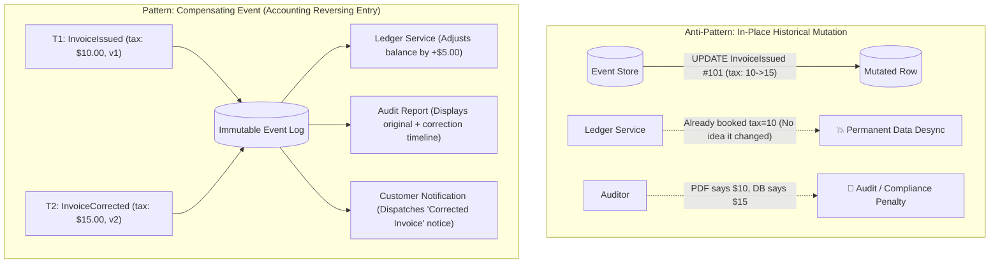
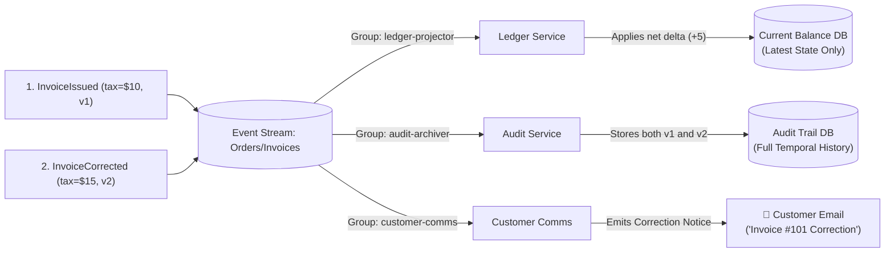
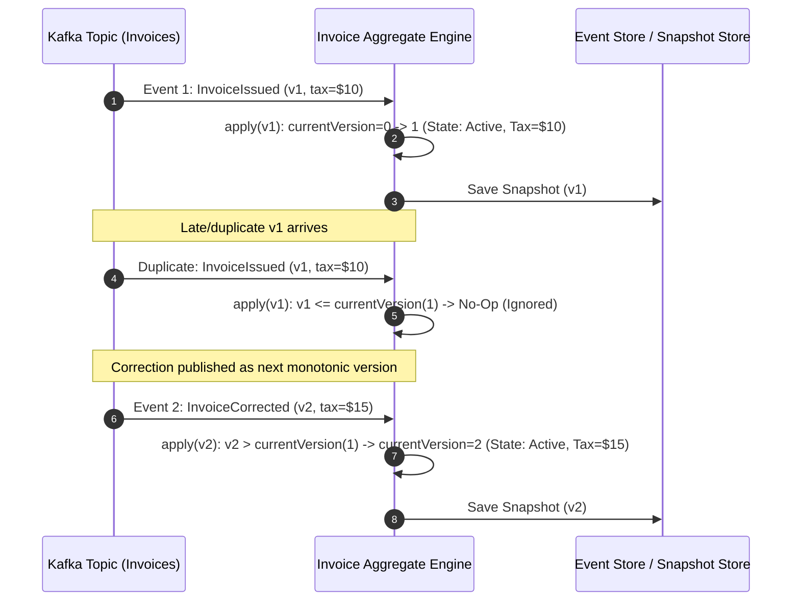
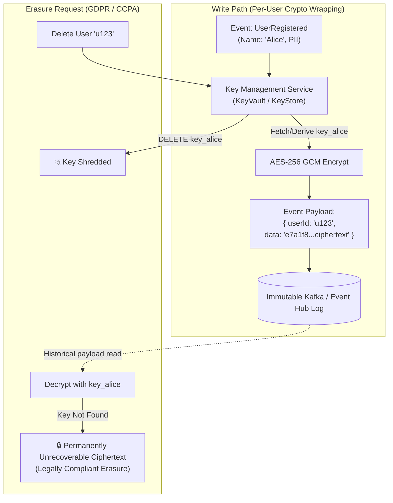
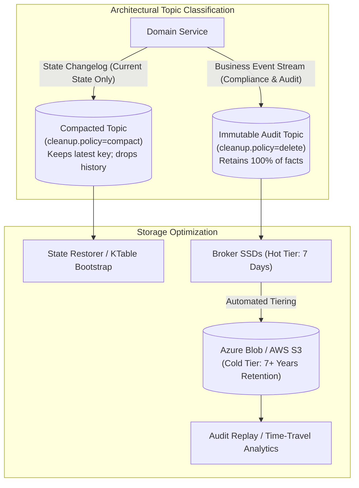
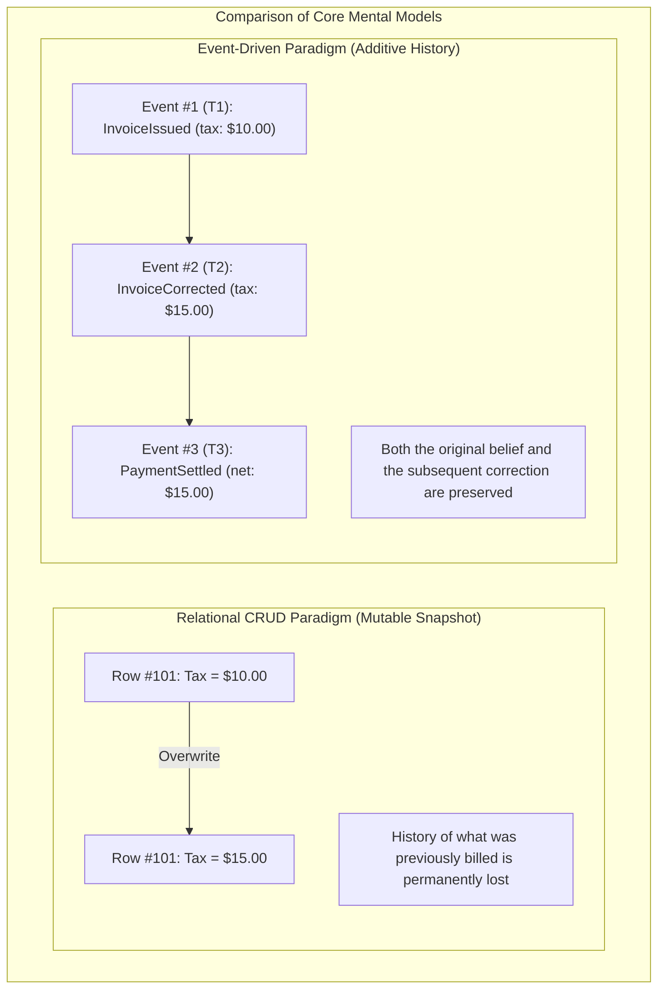

# Event Immutability and Corrections — Key Takeaways

> **Parent**: [Messaging & Event Streaming](index.md)  
> **Source**: [Should Events Be Immutable Forever, or Can They Be Corrected Later?](../../articles/messaging/should-events-be-immutable-forever-or-can-they-be-corrected-later.md)  
> **Taxonomy Reference**: §3.3 Event-Driven & Messaging  

## Contents

| ID | Problem | Key Concept |
|:---|:---|:---|
| [`broker-177`](#broker-177-in-place-historical-event-mutation-vs-compensating-event-corrections) | Mutating historical events in-place silently desynchronizes downstream consumers and breaks regulatory auditability | Historical Immutability, Compensating Events (`InvoiceCorrected`), Accounting Reversing Entry pattern |
| [`broker-178`](#broker-178-divergent-consumer-requirements-latest-state-projection-vs-immutable-audit-trail) | Different downstream consumers require conflicting representations of reality upon receiving corrections | Consumer-Driven Interpretation, State Projection vs Audit Trail Duality, Explicit Correction Notices |
| [`broker-179`](#broker-179-unified-monotonic-event-versioning-vs-special-case-correction-branching) | Aggregates requiring fragile, special-case branching logic to apply correction events | Unified Monotonic Event Versioning, Standard Idempotent Guard Clause, Next Sequential Fact $V_{N+1}$ |
| [`broker-180`](#broker-180-cryptographic-shredding-crypto-erasure-vs-broker-log-rewriting-for-gdpr-compliance) | GDPR / CCPA "Right to be Forgotten" mandates conflict with immutable append-only broker logs | Cryptographic Shredding (Crypto-Erasure), Per-User KeyStore, Key Deletion Payload Destruction |
| [`broker-181`](#broker-181-kafka-log-compaction-mechanics-vs-compliance-retention--tiered-storage) | Misunderstanding Kafka log compaction as an in-place mutation tool, risking accidental loss of audit history | Log Compaction Boundaries, Long Retention, Tiered Storage, Audit Stream Isolation |
| [`broker-182`](#broker-182-database-row-mutation-mindset-vs-additive-historical-fact-paradigm) | Treating the event stream as mutable relational database rows rather than an immutable temporal chronicle | Additive-Only History Paradigm, Temporal Fact Invariant ("Wrong at the time is itself an immutable fact") |

---

## broker-177: In-Place Historical Event Mutation vs Compensating Event Corrections

| | |
|:---|:---|
| **Problem** | When a business error is discovered in a past event (e.g., a tax miscalculation in an `InvoiceIssued` event emitted three weeks ago), developers or DBAs attempt to update the stored record in-place (`UPDATE event_store SET tax = 15.0 WHERE id = 123`). Downstream consumers (ledger services, customer billing systems, regulatory reports) that already consumed the original event have no mechanism to detect the silent mutation. In-flight and historical downstream states diverge permanently, and the system loses the ability to explain what decisions were made on past dates during regulatory audits. |
| **Root cause** | Conflating "correcting an error" with "erasing history" by applying mutable relational update semantics to an immutable distributed event stream. |

**Strategy**: Enforce strict **Historical Immutability and Compensating Events**:

1. **Keep the Original Event Intact**: The original event (`InvoiceIssued` with incorrect tax) remains immutable on the log. "Wrong at the time" is itself an undeniable historical fact that drove real-world actions (e.g., PDF invoices sent to customers, ledger postings).
2. **Publish an Explicit Compensating Event**: Emit a new event (`InvoiceCorrected`) carrying its own distinct event ID, the corrected values, the target aggregate ID, and the current timestamp.
3. **Mirror the Double-Entry Accounting Reversing Pattern**: In accounting, errors are never erased with white-out; accountants record an explicit reversing entry adjacent to the bad entry. The timeline faithfully preserves both what was originally believed and what corrected it.



**Tradeoff**: Downstream consumers must handle multiple event types per lifecycle and calculate deltas or overwrite projections, but the complete audit trail remains honest, verifiable, and legally compliant.

> **Dictionary**: [Compensating Event](../../reference-dictionary/cqrs-event-driven.md#compensating-event), [Event Sourcing](../../reference-dictionary/cqrs-event-driven.md#event-sourcing), [Ledger](../../reference-dictionary/cqrs-event-driven.md#ledger)  
> **Azure**: [Azure Event Hubs](../../architecture-azure/integration/event-hubs/), [Azure Cosmos DB (Change Feed)](../../architecture-azure/data/cosmos-db/)  
> **Related**: [`broker-125`](event-driven-architecture-questions-takeaways.md#broker-125-immutability-vs-compensating-event-corrections), [`broker-159`](event-driven-consumer-replay-takeaways.md#broker-159-conflating-state-derivation-with-irreversible-side-effects)  

---

## broker-178: Divergent Consumer Requirements: Latest State Projection vs Immutable Audit Trail

| | |
|:---|:---|
| **Problem** | When a compensating correction event (`InvoiceCorrected`) arrives, downstream services have fundamentally conflicting requirements for what "truth" means. A financial ledger only cares about the latest net balance, an audit reporting service requires full chronological visibility of every mistake and revision, and a customer-facing notification service must generate an explicit "Correction Notice" rather than silently updating a number the customer already saw. Attempting to force a single uniform consumption model breaks either operational speed, audit compliance, or user trust. |
| **Root cause** | Assuming "current truth" is a universal property of the event stream rather than a projection-specific query answered differently by different consumers. |

**Strategy**: Implement **Consumer-Driven Interpretation of History**:

1. **Current State Aggregates (e.g., General Ledger / Balance Projector)**:
   - Apply `InvoiceCorrected` immediately as the next version transition.
   - Adjusts internal balance without retaining historical step artifacts on the hot query path.
2. **Audit & Compliance Services**:
   - Persist both `InvoiceIssued` and `InvoiceCorrected` as distinct chronological records.
   - Enable time-travel queries ("What did we believe on August 10th?" vs "What do we know on August 31st?").
3. **Customer Interaction & Notification Services**:
   - Detect that a correction occurred on a document already communicated to the customer.
   - Generate an explicit human-readable "Corrected Invoice / Adjustment Note" rather than a silent overwrite.



**Tradeoff**: Requires designing domain-specific projection logic per consumer group, but guarantees each service satisfies its exact business and regulatory obligations from a single shared event stream.

> **Dictionary**: [Read Model](../../reference-dictionary/cqrs-event-driven.md#read-model), [Projection](../../reference-dictionary/cqrs-event-driven.md#projection), [Event Carried State Transfer](../../reference-dictionary/cqrs-event-driven.md#event-carried-state-transfer)  
> **Azure**: [Azure Functions](../../architecture-azure/compute/azure_functions/), [Azure SQL Database (Temporal Tables)](../../architecture-azure/data/databases/azure_sql_database/), [Azure Event Hubs](../../architecture-azure/integration/event-hubs/)  
> **Related**: [`broker-134`](event-driven-business-consistency-takeaways.md#broker-134-false-broker-ordering-assumptions-vs-versioned-aggregate-invariants), [`broker-177`](#broker-177-in-place-historical-event-mutation-vs-compensating-event-corrections)  

---

## broker-179: Unified Monotonic Event Versioning vs Special-Case Correction Branching

| | |
|:---|:---|
| **Problem** | Teams treat event corrections as exceptional workflows, adding custom branching logic, bypass flags (`is_correction=true`), or out-of-band administrative endpoints inside aggregate state machines. This complicates state transition logic, bypasses standard optimistic concurrency checks, and introduces edge-case bugs when corrections arrive out of sequence. |
| **Root cause** | Treating a correction as an abnormal defect to be patched rather than simply the next sequential fact in an aggregate's lifecycle. |

**Strategy**: Enforce **Unified Monotonic Event Versioning**:

1. **Corrections Are Ordinary Next-Version Facts**: A correction event (`InvoiceCorrected`) carries the next sequential aggregate version ($V_{N+1}$), identical to any other state transition.
2. **Standard Idempotency & Monotonic Version Guard**: The aggregate handles corrections through the exact same guard clause used for standard domain events:

```python
def apply(aggregate, event):
    # Stale, duplicate, or out-of-order replay — ignore safely
    if event.version <= aggregate.current_version:
        return aggregate

    # Pure deterministic state transition (correction is just another transition)
    aggregate.state = transition(aggregate.state, event)
    aggregate.current_version = event.version
    return aggregate
```

3. **Zero Special-Case Aggregate Logic**: Because the correction carries a strictly incremented version number, standard out-of-order protection, event deduplication, and replay mechanics work out-of-the-box without custom code paths.



**Tradeoff**: The command handler issuing the correction must query the latest aggregate version to assign $V_{N+1}$, requiring optimistic concurrency control during the publish phase.

> **Dictionary**: [Versioned Aggregates](../../reference-dictionary/cqrs-event-driven.md#versioned-aggregates), [Deterministic Processing](../../reference-dictionary/cqrs-event-driven.md#deterministic-processing), [Idempotency](../../reference-dictionary/cqrs-event-driven.md#idempotency)  
> **Azure**: [Azure Cosmos DB](../../architecture-azure/data/cosmos-db/), [Azure Service Bus](../../architecture-azure/integration/service-bus/)  
> **Related**: [`broker-119`](event-driven-architecture-questions-takeaways.md#broker-119-business-consistency-with-eventually-consistent-out-of-order-events), [`broker-135`](event-driven-business-consistency-takeaways.md#broker-135-single-writer-ownership-vs-multi-service-concurrent-aggregate-mutations)  

---

## broker-180: Cryptographic Shredding (Crypto-Erasure) vs Broker Log Rewriting for GDPR Compliance

| | |
|:---|:---|
| **Problem** | Regulatory frameworks (GDPR Article 17 "Right to be Forgotten", CCPA) legally mandate that personal data (PII) must be permanently erased upon user request. In an append-only distributed commit log (Kafka, Event Hubs), committed log segments cannot be edited or deleted in-place without rebuilding the entire topic log from offset 0, which breaks consumer offsets, corrupts partition continuity, and incurs catastrophic operational downtime. |
| **Root cause** | Fundamental architectural clash between immutable append-only distributed storage and legal data deletion mandates when personal data is stored in plaintext. |

**Strategy**: Implement **Cryptographic Shredding (Crypto-Erasure)**:

1. **Per-User Encryption Key Derivation**: At write time, personal data fields within event payloads are encrypted using a dedicated symmetric key unique to that `user_id` (managed in Key Vault or an internal KeyStore).
2. **Store Non-PII Envelopes**: The event metadata, aggregate IDs, transaction references, and operational shells remain unencrypted in the immutable stream.
3. **Execute Erasure via Key Deletion**: When an erasure request is received, delete the user's specific cryptographic key from KeyStore.
4. **Permanent Cryptographic Destruction**: The event log remains 100% immutable and sequentially intact; all historical events referencing that `user_id` become permanently and irreversibly unreadable ciphertext (provably unrecoverable), fulfilling GDPR compliance without log mutations.

```python
def record_event(event, user_id):
    key = key_store.get_or_create_key(user_id)
    event.personal_fields = encrypt(event.personal_fields, key)
    broker.append(event)

def erase_user(user_id):
    # Log remains completely untouched — payload is rendered permanently unrecoverable
    key_store.delete_key(user_id)
```



**Tradeoff**: Adds per-event encryption/decryption CPU latency and introduces an operational dependency on high-availability key management systems (e.g., Azure Key Vault, AWS KMS).

> **Dictionary**: [Cryptographic Erasure](../../reference-dictionary/cqrs-event-driven.md#cryptographic-erasure), [Crypto-Shredding](../../reference-dictionary/cqrs-event-driven.md#crypto-shredding), [HSM](../../reference-dictionary/hsm-cryptography.md#hsm)  
> **Azure**: [Azure Key Vault](../../architecture-azure/security/key-vault/), [Azure Dedicated HSM](../../architecture-azure/security/dedicated-hsm/), [Azure Event Hubs Dedicated](../../architecture-azure/integration/event-hubs/)  
> **Related**: [`broker-43`](kafka-data-state.md#broker-43-cryptographic-erasure-for-gdpr-compliance), [`broker-125`](event-driven-architecture-questions-takeaways.md#broker-125-immutability-vs-compensating-event-corrections)  

---

## broker-181: Kafka Log Compaction Mechanics vs Compliance Retention & Tiered Storage

| | |
|:---|:---|
| **Problem** | Architects mistakenly assume Kafka's topic-level log compaction (`cleanup.policy=compact`) can be used to "fix" or "replace" bad historical events by publishing a new record with the same key. When historical state rebuilds or regulatory audits occur, the business discovers that intermediate states and intervening audit facts have been permanently removed by the compaction cleaner thread, or conversely, that uncompacted segments still expose old records until segment roll conditions trigger. |
| **Root cause** | Confusing Kafka log compaction (a storage optimization that retains only the latest record per key) with an immutable audit log or in-place edit mechanism. |

**Strategy**: Establish explicit **Retention and Compaction Boundaries**:

1. **Compaction Drops History, It Does Not Edit It**: Log compaction does not rewrite records; it garbage-collects older tombstoned or superseded segment offsets for a key during background cleaning. It destroys temporal audit trails.
2. **Dedicated Immutable Audit Streams**: For topics requiring financial or regulatory compliance, disable compaction (`cleanup.policy=delete`) and configure long-term retention.
3. **Tiered Storage for Cost-Effective Infinite Retention**: Utilize **Tiered Storage** (e.g., Kafka Tiered Storage offloading to Azure Blob Storage / AWS S3) to retain uncompacted historical streams indefinitely at cloud object storage economics.
4. **Separation of State Topics vs Event Topics**:
   - **Changelog / Read-Model Topics** (e.g., user profiles, product catalogs): Use `cleanup.policy=compact` where only current state matters.
   - **Domain Event / Audit Topics** (e.g., payments, orders, invoices): Use `cleanup.policy=delete` + Tiered Storage where every historical fact must remain queryable.



**Tradeoff**: Retaining uncompacted topics increases total storage footprint, mitigated by offloading historical segments to tiered cloud object storage.

> **Dictionary**: [Compacted Topic](../../reference-dictionary/messaging.md#compacted-topic), [Log Retention](../../reference-dictionary/messaging.md#log-retention), [Event Backbone](../../reference-dictionary/cqrs-event-driven.md#event-backbone)  
> **Azure**: [Azure Event Hubs (Capture to Blob Storage)](../../architecture-azure/integration/event-hubs/), [Azure Blob Storage](../../architecture-azure/data/storage/azure_blob_storage/)  
> **Related**: [`broker-27`](kafka-design-patterns.md#broker-27-compacted-topic-as-a-state-snapshot), [`broker-42`](kafka-data-state.md#broker-42-cold-data-archival-to-s3), [`broker-152`](uber-kafka-scale-takeaways.md#broker-152-tiered-storage-economics-for-high-retention-kafka-clusters)  

---

## broker-182: Database Row Mutation Mindset vs Additive Historical Fact Paradigm

| | |
|:---|:---|
| **Problem** | Software engineers accustomed to relational CRUD databases approach event-driven architectures with a "mutable state table" mindset. When confronted with bugs or erroneous data, their first impulse is to ask how to modify, delete, or rewrite the bad event. This fundamental impedance mismatch leads to complex, fragile workarounds (dropping topics, rewriting logs, modifying database change feeds) that defeat the core benefits of event sourcing and event-driven architecture. |
| **Root cause** | Failing to shift from a state-based mindset (where reality is a mutable snapshot) to an event-based mindset (where reality is an append-only sequence of immutable historical observations). |

**Strategy**: Adopt the **Additive-Only History Paradigm**:

1. **Events Are Observations, Not Instructions**: An event represents an observation of reality at time $T$. Even if the observation was mistaken, the fact that the system made that observation and acted upon it at time $T$ is an immutable historical reality.
2. **Never Edit History — Add to It**: All corrections, reversals, cancellations, and modifications must be expressed as **additive events** appended to the head of the stream.
3. **Immutability Enables Safe Scaling**: Because events never change retroactively:
   - Caching layers never suffer from cache invalidation races on historical segments.
   - Downstream consumers can stream and replay events deterministically without coordination locks.
   - Cross-service event streams serve as a cryptographically verifiable, auditable source of truth across the enterprise.



**Tradeoff**: Requires architectural discipline and team training to break CRUD intuition, but eliminates silent data corruption, race conditions during replays, and audit failures.

> **Dictionary**: [Event Sourcing](../../reference-dictionary/cqrs-event-driven.md#event-sourcing), [Temporal Fact](../../reference-dictionary/cqrs-event-driven.md#temporal-fact), [Event-Driven Architecture](../../reference-dictionary/cqrs-event-driven.md#event-driven-architecture)  
> **Azure**: [Azure Event Hubs](../../architecture-azure/integration/event-hubs/), [Azure Cosmos DB](../../architecture-azure/data/cosmos-db/)  
> **Related**: [`broker-119`](event-driven-architecture-questions-takeaways.md#broker-119-business-consistency-with-eventually-consistent-out-of-order-events), [`broker-125`](event-driven-architecture-questions-takeaways.md#broker-125-immutability-vs-compensating-event-corrections), [`broker-177`](#broker-177-in-place-historical-event-mutation-vs-compensating-event-corrections)  

---

## Takeaway Summary

- [`broker-119` – `broker-128`](event-driven-architecture-questions-takeaways.md) — 10 EDA Architecture Questions Key Takeaways
- [`broker-129` – `broker-133`](when-to-avoid-event-driven-architecture-takeaways.md) — When to Avoid EDA Key Takeaways
- [`broker-134` – `broker-140`](event-driven-business-consistency-takeaways.md) — Business Consistency Key Takeaways
- [`broker-141` – `broker-146`](event-loss-duplicates-reprocessing-takeaways.md) — Event Loss, Duplicates & Reprocessing Key Takeaways
- [`broker-147` – `broker-152`](uber-kafka-scale-takeaways.md) — Uber Kafka Scale Key Takeaways
- [`broker-153` – `broker-158`](outbox-pattern-capabilities-limits-takeaways.md) — Outbox Pattern Capabilities & Limits Key Takeaways
- [`broker-159` – `broker-164`](event-driven-consumer-replay-takeaways.md) — Consumer Replay at Scale Key Takeaways
- [`broker-165` – `broker-170`](event-driven-cross-service-debugging-takeaways.md) — Cross-Service Debugging Key Takeaways
- [`broker-171` – `broker-176`](event-driven-vs-message-driven-takeaways.md) — Event-Driven vs Message-Driven Key Takeaways
- [`broker-177` – `broker-182`](event-immutability-and-corrections-takeaways.md) — Event Immutability & Corrections Key Takeaways
