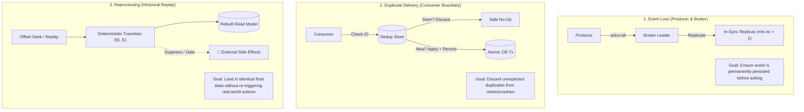
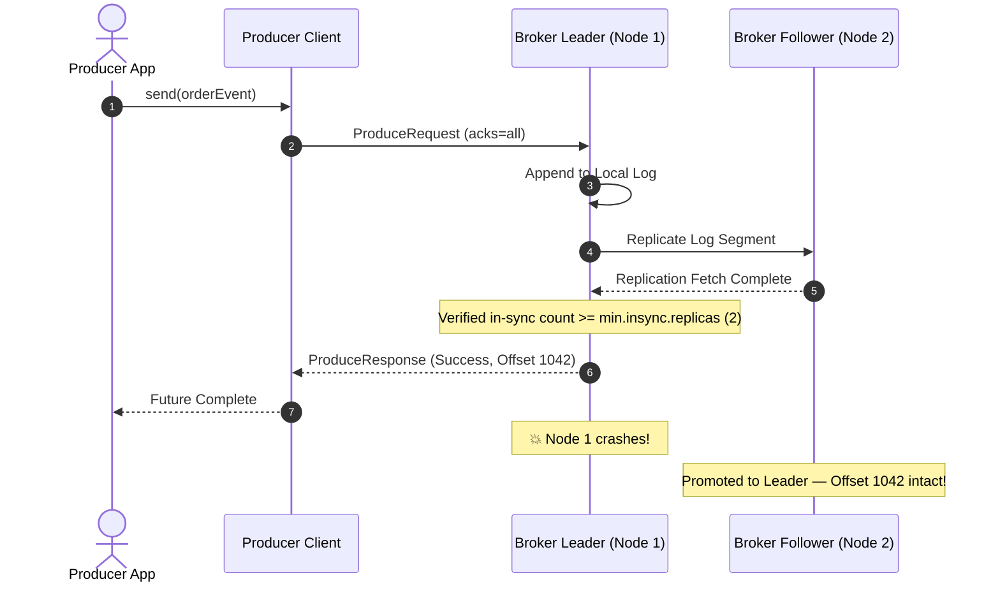
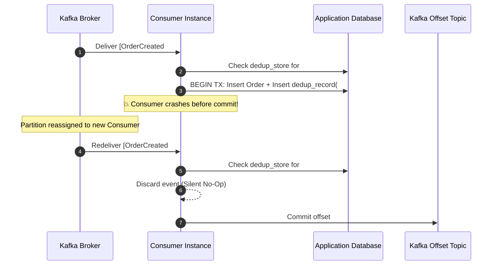
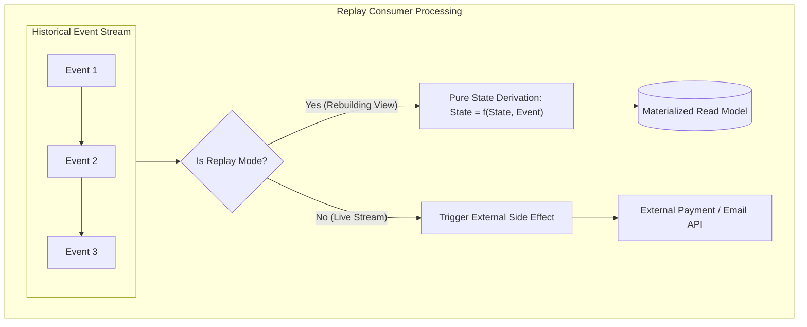
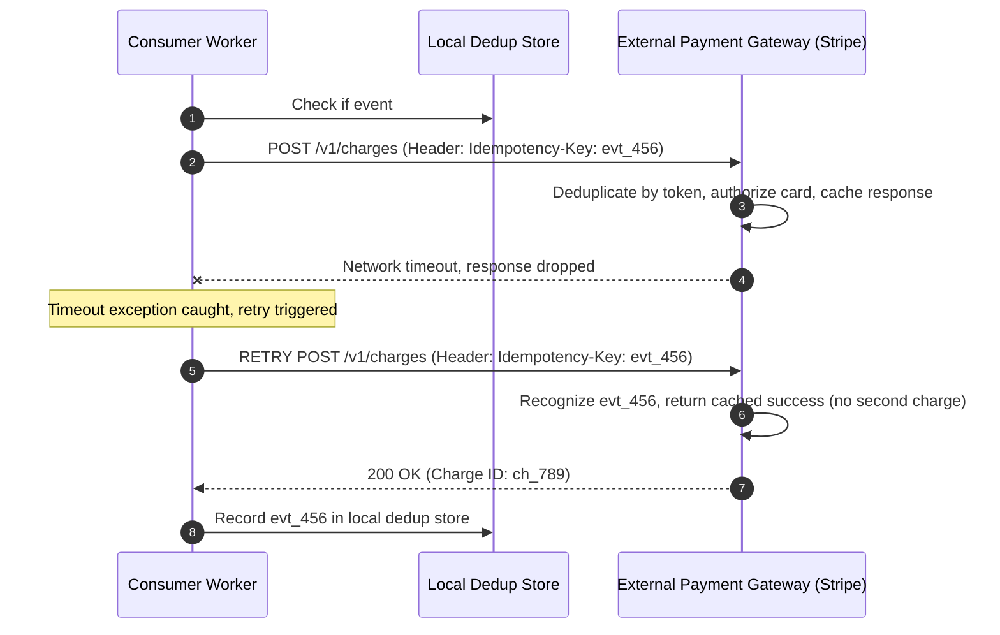

# Event Loss, Duplicate Events & Reprocessing — Key Takeaways

> **Parent**: [Messaging & Event Streaming](index.md)  
> **Source**: [How to Handle Event Loss, Duplicate Events, and Reprocessing in Event-Driven Architecture](../../articles/messaging/how-to-handle-event-loss-duplicate-events-and-reprocessing-in-event-driven-architecture.md)  
> **Taxonomy Reference**: §3.3 Event-Driven & Messaging  

## Contents

| ID | Problem | Key Concept |
|:---|:---|:---|
| [`broker-141`](#broker-141-tripartite-failure-surface-separation-in-at-least-once-delivery) | Conflating delivery issues into a single "retry and hope" strategy across fundamentally different failure modes | Tripartite failure surface separation: event loss, duplicate delivery, historical reprocessing |
| [`broker-142`](#broker-142-producer--broker-durability-invariants-vs-un-replicated-leader-data-loss) | Producer acknowledges write as successful but broker leader crash loses un-replicated records | Producer & broker durability: `acks=all`, `min.insync.replicas > 1`, idempotent producer |
| [`broker-143`](#broker-143-atomic-deduplication-boundary-for-consumer-crashes-prior-to-commit) | Consumer processes message but crashes before committing offset, causing re-execution upon restart | Atomic deduplication: binding business effect and dedup mark in same database transaction |
| [`broker-144`](#broker-144-deterministic-consumer-replay--side-effect-gating-during-reprocessing) | Replaying event streams executes non-deterministic transitions or re-triggers real-world side effects | Deterministic consumers, pure state derivation, explicit replay side-effect gating |
| [`broker-145`](#broker-145-bounded-deduplication-store-ttl--synthetic-event-key-generation) | Events lacking natural IDs and dedup stores growing indefinitely without memory/storage boundaries | Synthetic content-derived event keys, deduplication store TTL sized to redelivery horizon |
| [`broker-146`](#broker-146-defense-in-depth-downstream-idempotency-keys-for-non-idempotent-side-effects) | Network timeouts during third-party API calls (payments, emails) re-trigger duplicate charges | Belt-and-suspenders downstream idempotency keys, window of uncertainty mitigation |

---

## broker-141: Tripartite Failure Surface Separation in At-Least-Once Delivery

| | |
|:---|:---|
| **Problem** | Engineering teams treat "at-least-once delivery" as a single homogenous guarantee, attempting to solve all delivery reliability issues with a single retry-and-dedupe mechanism. In production, this collapses three fundamentally different failure modes — an event never arriving, an event arriving more than once, and an event being replayed intentionally — each requiring completely different mitigations at different layers of the distributed stack. |
| **Root cause** | Conflating producer/broker transit loss, consumer crash redeliveries, and deliberate administrative stream replays into a generic "delivery problem" abstraction. |

**Strategy**: Architecturally decouple the delivery pipeline into three independent mitigation surfaces:
1. **Event Loss**: A producer and broker durability concern. Mitigated before the consumer ever sees the message via producer acknowledgments, replica durability, and idempotent retries.
2. **Duplicate Delivery**: An unavoidable consequence of at-least-once transport. Mitigated at the consumer via idempotency stores that check and record event identifiers atomically with business updates, discarding unexpected duplicates.
3. **Reprocessing**: A deliberate operational action (replaying history to fix bugs or rebuild read models). Mitigated by ensuring consumer transition logic is a pure mathematical function of the event sequence and isolating external side effects from the replay path.



| Failure Surface | Layer Responsible | Win Condition | Primary Mitigation |
|:---|:---|:---|:---|
| **Event Loss** | Producer + Broker | Event is durably persisted | `acks=all`, `min.insync.replicas > 1`, `enable.idempotence=true` |
| **Duplicates** | Consumer boundary | Stale/duplicate message is harmless | Idempotent consumer, atomic check-and-record dedup store |
| **Reprocessing** | Consumer architecture | Replay lands in identical state | Deterministic transition functions, side-effect gating |

**Tradeoff**: Prevents simplistic "silver-bullet" architectural thinking, requiring separate operational runbooks, configuration profiles, and code paths for producer durability, consumer deduplication, and replay workflows.

> **Dictionary**: [At-Least-Once Delivery](../../reference-dictionary/messaging.md), [Idempotent Consumer](../../reference-dictionary/messaging.md#idempotent-consumer), [Deterministic Consumer](../../reference-dictionary/messaging.md#deterministic-consumer)  
> **Azure**: [Azure Event Hubs](../../architecture-azure/integration/event-hubs/), [Azure Service Bus](../../architecture-azure/integration/service-bus/)  
> **Related**: [`broker-120`](event-driven-architecture-questions-takeaways.md#broker-120-tripartite-separation-of-event-loss-duplicates-and-reprocessing), [`broker-134`](event-driven-business-consistency-takeaways.md#broker-134-false-broker-ordering-guarantees-vs-redelivery-and-rebalance-reality)  

---

## broker-142: Producer & Broker Durability Invariants vs Un-Replicated Leader Data Loss

| | |
|:---|:---|
| **Problem** | Producers publish events and receive successful acknowledgments, yet data is permanently lost when the broker leader node fails. Consumers cannot process or recover records that were never durably replicated to surviving broker nodes. |
| **Root cause** | Configuring producer acknowledgments to `acks=1` (leader only) or leaving broker `min.insync.replicas=1`. When the leader acknowledges the write and crashes before follower replicas pull the message, an election promotes an out-of-sync or un-replicated follower, silently discarding the message. |

**Strategy**: Enforce end-to-end durability invariants across both producer and broker configurations:
- **`acks=all` (or `-1`)**: The producer does not consider a send operation successful until all in-sync replicas (ISR) have appended the record to their local write-ahead logs.
- **`min.insync.replicas >= 2`**: Coupled with a topic replication factor of at least 3, the broker rejects writes (`NotEnoughReplicasException`) if fewer than two replicas are in sync, preventing single-replica failure windows.
- **`enable.idempotence=true`**: Ensures that producer retries triggered by transient network timeouts do not create broker-level duplicate records within the partition.



**Tradeoff**: Marginally increases write latency due to replica network roundtrips, and temporarily rejects producer writes if broker hardware failures cause the number of healthy replicas to fall below `min.insync.replicas`.

> **Dictionary**: [ISR (In-Sync Replica)](../../reference-dictionary/messaging.md#isr-in-sync-replica), [Producer Acknowledgement](../../reference-dictionary/messaging.md#producer-acknowledgement), [Replication Factor](../../reference-dictionary/messaging.md#replication-factor), [Idempotent Producer](../../reference-dictionary/messaging.md#idempotent-producer)  
> **Azure**: [Azure Event Hubs Availability Zones](../../architecture-azure/integration/event-hubs/)  
> **Related**: [`broker-59`](kafka-producer-ack-idempotency.md#broker-59), [`broker-63`](kafka-producer-ack-idempotency.md#broker-63)  

---

## broker-143: Atomic Deduplication Boundary for Consumer Crashes Prior to Commit

| | |
|:---|:---|
| **Problem** | A consumer successfully processes a message and applies its state mutation, but crashes (due to OOM, hardware failure, or rebalance timeout) right before committing its offset to the broker. Upon restart or partition reassignment, the broker redelivers the uncommitted event, causing duplicate execution of the business effect (e.g., balance decremented twice). |
| **Root cause** | Offset commits in Kafka and business state mutations in application databases are physically decoupled across distinct systems. Producer idempotence only deduplicates producer-to-broker retries, providing zero protection against consumer-side redelivery. |

**Strategy**: Implement **Atomic Deduplication** at the consumer boundary. Bind the verification/recording of the processed event identifier and the application of the business mutation within the exact same database transaction:

```c
FUNCTION handle(event):
    // Check dedup store (fast cache or DB index)
    IF dedupStore.hasProcessed(event.id):
        RETURN  // duplicate — safe no-op discard

    BEGIN TRANSACTION:
        applyBusinessEffect(event)
        dedupStore.markProcessed(event.id)  // Same atomic commit
    COMMIT TRANSACTION

    // Offset commit happens after business effects are safely committed
    commitOffset(event.offset)
```



**Tradeoff**: Requires that the deduplication store and the business entity reside within the same transactional storage boundary (or support two-phase commit / transactional outbox), adding an insert overhead to each processed event.

> **Dictionary**: [Idempotent Consumer](../../reference-dictionary/messaging.md#idempotent-consumer), [Atomic Deduplication](../../reference-dictionary/messaging.md#atomic-deduplication), [Consumer Offset](../../reference-dictionary/messaging.md#consumer-offset)  
> **Azure**: [Azure Cosmos DB Transactions](../../architecture-azure/data/databases/azure_cosmosdb/), [Azure SQL Database](../../architecture-azure/data/databases/azure_sql/)  
> **Related**: [`broker-60`](kafka-producer-ack-idempotency.md#broker-60), [`broker-61`](kafka-producer-ack-idempotency.md#broker-61), [`broker-62`](kafka-producer-ack-idempotency.md#broker-62)  

---

## broker-144: Deterministic Consumer Replay & Side-Effect Gating During Reprocessing

| | |
|:---|:---|
| **Problem** | When operators reset consumer offsets to reprocess event streams (e.g., to patch a downstream calculation bug or rebuild a materialized view), consumers re-execute non-deterministic logic or dispatch real-world side effects, resulting in corrupted projection data, duplicate customer emails, or duplicate credit card charges. |
| **Root cause** | Coupling external non-idempotent side effects directly into the state derivation loop, or relying on non-deterministic inputs (e.g., `System.currentTimeMillis()`, live HTTP queries, random UUIDs) inside domain transitions. |

**Strategy**: Enforce strict **Consumer Determinism** and implement **Side-Effect Gating**:
1. **Mathematical Determinism**: Transition functions must be pure projections of the event history: $\text{State}_t = f(\text{State}_{t-1}, \text{Event}_t)$. Derive all timestamps directly from the event payload, never from local server wall-clock time.
2. **Separation of Read Projections and Side Effects**: Isolate read-model projections from side-effect producers into distinct consumer groups. The projection consumer only updates database views.
3. **Replay Gating Flags**: If a single consumer handles side effects, pass an explicit context flag (`is_replay = true`) when rewinding offsets to suppress email, notification, and payment dispatch, or route mutations through an already-deduped idempotency pipeline.



**Tradeoff**: Prevents simple monolythic consumers from mixing state updates and notification calls; requires separating consumer group responsibilities and maintaining explicit replay-aware flags.

> **Dictionary**: [Deterministic Consumer](../../reference-dictionary/messaging.md#deterministic-consumer), [Event Replay](../../reference-dictionary/cqrs-event-driven.md#event-replay), [Side-Effect Gating](../../reference-dictionary/cqrs-event-driven.md#side-effect-gating)  
> **Azure**: [Azure Functions Event Hubs Trigger](../../architecture-azure/compute/functions/)  
> **Related**: [`broker-135`](event-driven-business-consistency-takeaways.md#broker-135-versioned-aggregates-with-guard-clause-silent-discard), [`broker-137`](event-driven-business-consistency-takeaways.md#broker-137-logical-clocks-and-monotonic-counters-vs-physical-clock-drift)  

---

## broker-145: Bounded Deduplication Store TTL & Synthetic Event Key Generation

| | |
|:---|:---|
| **Problem** | Deduplication stores grow infinitely over months of operation, consuming unsustainable amounts of memory or disk storage. Furthermore, many incoming events from legacy or third-party systems lack a clean, natural unique identifier, making standard deduplication impossible. |
| **Root cause** | Retaining processed event identifiers permanently instead of sizing retention to the maximum plausible redelivery window, and failing to establish a deterministic identity contract for legacy events. |

**Strategy**:
1. **Synthetic Event Key Generation**: When natural keys are missing, construct a deterministic composite identifier by hashing immutable payload fields at the consumer boundary:
   $$\text{EventKey} = \text{SHA256}(\text{entity\_id} + \text{event\_type} + \text{sequence\_or\_version} + \text{occurred\_at})$$
   Alternatively, establish producer contracts where producers assign a UUID at message creation time.
2. **Bounded Deduplication TTL**: Scope deduplication records with a sliding Time-To-Live (TTL) in a distributed cache or database. The TTL must exceed the maximum plausible redelivery window:
   $$\text{TTL} > \text{MaxRetryWindow} + \text{MaxRebalanceTimeout} + \text{ConsumerLagMargin}$$
   Typically, a TTL of 24 to 72 hours guarantees 100% duplicate protection against crashes and retries while automatically pruning expired keys to keep storage bounded.

```
+-------------------------------------------------------------------------------+
|                       Deduplication Retention Window                          |
+-------------------------------------------------------------------------------+
|<--- Normal Processing --->|<--- Retries & Rebalances --->|<--- Safety Margin --->|
|          1 - 5 sec        |          1 - 60 min          |      24 - 72 hours    |
+-------------------------------------------------------------------------------+
                                                                 ▲
                                                                 |
                                                    TTL Auto-Eviction Boundary
```

**Tradeoff**: Events redelivered after the TTL window has expired (e.g., weeks later during an emergency manual replay) will not be caught by the deduplication table; such long-tail scenarios rely on aggregate version guards rather than indefinite dedup storage.

> **Dictionary**: [Synthetic Event Key](../../reference-dictionary/cqrs-event-driven.md#synthetic-event-key), [Bounded Deduplication TTL](../../reference-dictionary/messaging.md#bounded-deduplication-ttl), [Idempotency State Explosion](../../reference-dictionary/cqrs-event-driven.md#idempotency-state-explosion)  
> **Azure**: [Azure Cache for Redis TTL](../../architecture-azure/data/redis/), [Azure Cosmos DB Time to Live](../../architecture-azure/data/databases/azure_cosmosdb/)  
> **Related**: [`broker-64`](kafka-producer-ack-idempotency.md#broker-64), [`cache-01`](../caching/redis-internals.md)  

---

## broker-146: Defense-in-Depth Downstream Idempotency Keys for Non-Idempotent Side Effects

| | |
|:---|:---|
| **Problem** | Operations triggering non-idempotent third-party APIs (e.g., credit card charges, SMS delivery, banking rails) suffer from network timeouts. If a consumer calls an external payment gateway, the gateway charges the card, but a network blip drops the response, the consumer experiences an exception and retries — causing a duplicate customer charge. |
| **Root cause** | The distributed "window of uncertainty": network calls across trust boundaries cannot participate in local database transactions. Local deduplication only prevents re-execution if the first call was recorded as complete. |

**Strategy**: Deploy **Defense-in-Depth Idempotency Keys**:
- **First Line of Defense (Local Deduplication)**: The local deduplication store prevents the consumer from invoking the downstream API if the event was already successfully processed.
- **Second Line of Defense (Downstream Idempotency Token)**: All HTTP calls to downstream external providers carry an explicit, deterministic idempotency key derived from the event identifier (`Idempotency-Key: <event.id>` or `event.id + "-charge"`). If network drops cause the consumer to retry the HTTP call, the downstream payment gateway recognizes the duplicate token and returns the cached result without charging the card again.



**Tradeoff**: Relies on third-party external services supporting idempotent request headers; requires client-side retention and mapping of downstream request tokens.

> **Dictionary**: [Idempotency Key](../../reference-dictionary/cqrs-event-driven.md#idempotency-key), [Window of Uncertainty](../../reference-dictionary/cqrs-event-driven.md#window-of-uncertainty), [Token-Based Idempotency](../../reference-dictionary/cqrs-event-driven.md#token-based-idempotency)  
> **Azure**: [Azure API Management Policy Inheritance](../../architecture-azure/networking/22-azure-api-management-policy-inheritance.md)  
> **Related**: [`broker-114`](notifications-at-scale-takeaways.md#broker-114-worker-crashes-and-redelivery-cause-duplicate-notifications), [`cqrs-01`](../cqrs-fintech/cqrs-fintech.md)  

---

## Summary of Takeaways

```json
[
  {
    "id": "broker-141",
    "title": "Tripartite Failure Surface Separation in At-Least-Once Delivery",
    "problem": "Conflating event loss, duplicate delivery, and reprocessing under generic delivery mitigations",
    "strategy": "Decouple into three distinct mitigation zones: producer/broker durability, consumer deduplication, and deterministic replay",
    "tradeoff": "Requires separate architectural mechanisms and operational runbooks rather than a single middleware layer"
  },
  {
    "id": "broker-142",
    "title": "Producer & Broker Durability Invariants vs Un-Replicated Leader Data Loss",
    "problem": "Silent event loss when producer ack succeeds but un-replicated leader fails",
    "strategy": "Configure acks=all, min.insync.replicas >= 2, and enable.idempotence=true",
    "tradeoff": "Higher write latency and write rejections during cluster partition degradation"
  },
  {
    "id": "broker-143",
    "title": "Atomic Deduplication Boundary for Consumer Crashes Prior to Commit",
    "problem": "Duplicate execution when consumer crashes after business effects but before offset commit",
    "strategy": "Bind event ID deduplication record and business state update in the exact same database transaction",
    "tradeoff": "Requires transactional database boundaries and dedicated dedup table insert overhead"
  },
  {
    "id": "broker-144",
    "title": "Deterministic Consumer Replay & Side-Effect Gating During Reprocessing",
    "problem": "Historical stream replays triggering duplicate external side effects or corrupting state",
    "strategy": "Ensure pure deterministic transition functions and gate/suppress side effects during replay",
    "tradeoff": "Requires separating read-model projection consumers from external action dispatchers"
  },
  {
    "id": "broker-145",
    "title": "Bounded Deduplication Store TTL & Synthetic Event Key Generation",
    "problem": "Unbounded dedup store memory growth and events lacking natural primary keys",
    "strategy": "Generate content-hashed synthetic keys and configure dedup store TTLs sized to redelivery windows",
    "tradeoff": "Long-tail redeliveries beyond the TTL horizon require aggregate version guards"
  },
  {
    "id": "broker-146",
    "title": "Defense-in-Depth Downstream Idempotency Keys for Non-Idempotent Side Effects",
    "problem": "Network drops during third-party API calls triggering duplicate credit card charges on retry",
    "strategy": "Pass deterministic downstream idempotency keys (Idempotency-Key header) to external providers",
    "tradeoff": "Depends on third-party vendor support and client token mapping"
  }
]
```
