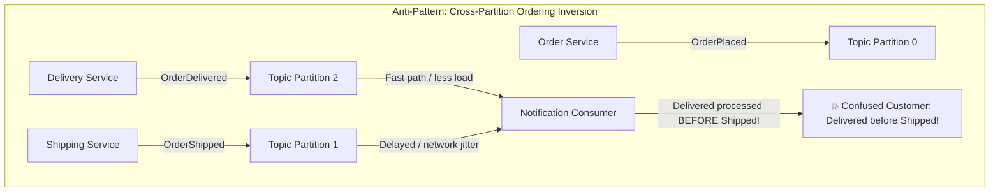
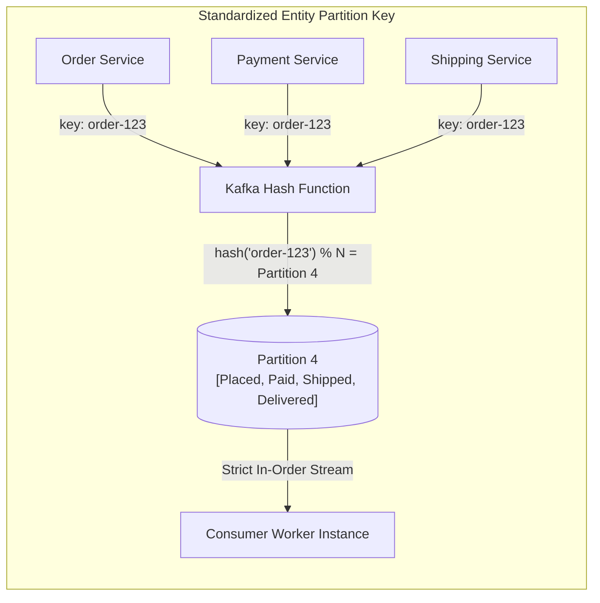
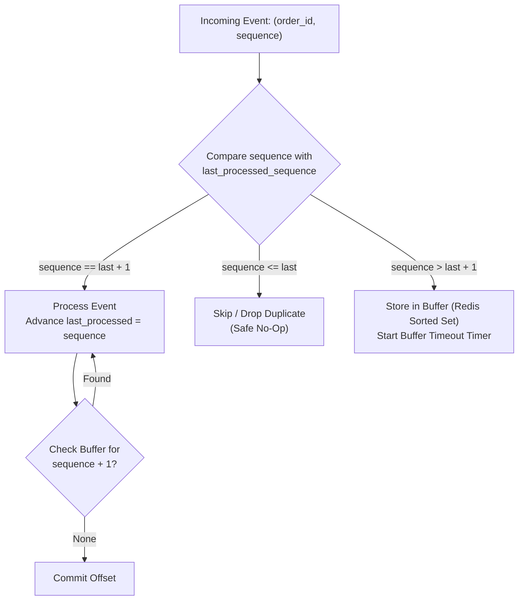
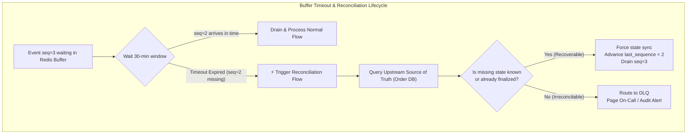
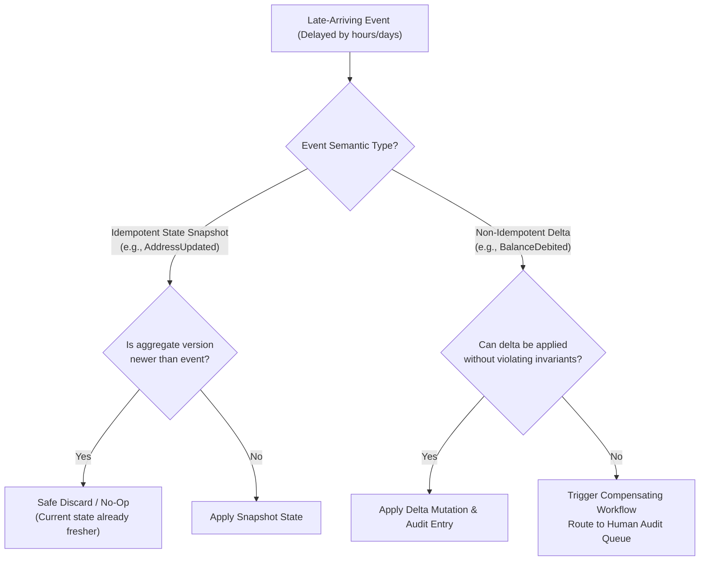
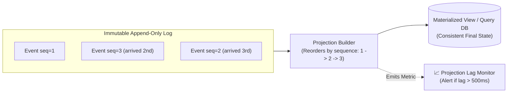

# Event Ordering & Kafka Partitioning — Key Takeaways

> **Parent**: [Messaging & Event Streaming](index.md)  
> **Source**: [Order Events Arrive Out of Sequence: System Design Deep Dive on Event Ordering and Kafka Partitioning](../../articles/messaging/order-events-arrive-out-of-sequence-system-design-deep-dive-on-event-ordering-and-kafka-partitioning.md)  
> **Taxonomy Reference**: §3.3 Event-Driven & Messaging  

## Contents

| ID | Problem | Key Concept |
|:---|:---|:---|
| [`broker-189`](#broker-189-broker-partition-ordering-vs-end-to-end-delivery-reality) | Conflating broker-level partition FIFO guarantees with end-to-end distributed system causality | Transport-level vs end-to-end ordering, multi-partition spread, delivery inversion |
| [`broker-190`](#broker-190-partition-key-selection-discipline-for-multi-producer-workflows) | Multiple services publishing lifecycle events for the same entity without shared partition keys | Entity ID partition key discipline, key hashing consistency, consumer single-thread locality |
| [`broker-191`](#broker-191-application-layer-sequence-numbering--sliding-window-buffering) | Events produced out of order at the source bypass broker ordering defenses | Producer-assigned sequence numbers, last-processed sequence tracking, process/skip/buffer state machine |
| [`broker-192`](#broker-192-bounded-buffer-lifecycles--source-of-truth-reconciliation) | Permanently missing predecessor events causing unbounded consumer buffer memory leaks | Sliding window buffer TTL, reconciliation flow, source-of-truth state retrieval, DLQ escalation |
| [`broker-193`](#broker-193-asymmetric-handling-of-late-idempotent-vs-non-idempotent-events) | Applying uniform processing logic to late events causing silent data loss or corrupted balances | Idempotent snapshot discard vs non-idempotent delta correction, compensating transactions |
| [`broker-194`](#broker-194-event-sourcing-asynchronous-replay-vs-materialized-view-projection-lag) | Complex in-place state patching for out-of-order events vs projection staleness | Append-only event store, sequence-sorted projection replay, projection lag observability |

---

## broker-189: Broker Partition Ordering vs End-to-End Delivery Reality

| | |
|:---|:---|
| **Problem** | Engineering teams frequently assume that using a message broker like Apache Kafka inherently guarantees global event ordering across the entire system. In production, events for a single entity (e.g., `OrderPlaced`, `PaymentReceived`, `OrderShipped`, `OrderDelivered`) are emitted by different microservices, traverse distinct network paths, or land in different Kafka partitions. Consumers process them concurrently or out of sequence, resulting in confusing user-facing anomalies (e.g., sending an "Order Delivered" notification before the "Order Shipped" notification). |
| **Root cause** | Conflating transport-layer partition FIFO ordering with end-to-end distributed system causality. In Kafka, ordering is strictly guaranteed within an individual partition, never across partitions or across different topics. |

**Strategy**: Decouple business correctness from transport delivery assumptions. System architects must design around the reality that distributed events will arrive out of order:
1. Enforce strict single-partition locality for all events belonging to the same entity instance.
2. At the application layer, design state machines and notification services to act on confirmed entity state rather than reacting blindly to raw incoming event arrival order.



**Tradeoff**: Prevents simplistic reactive event handlers; requires consumers to verify aggregate status or maintain local ordering logic.

> **Dictionary**: [Partition](../../reference-dictionary/kafka.md#partition), [Message Ordering](../../reference-dictionary/kafka.md#message-ordering), [Event Ordering](../../reference-dictionary/cqrs-event-driven.md#event-ordering), [Out-of-Order Event](../../reference-dictionary/cqrs-event-driven.md#out-of-order-event)  
> **Azure**: [Azure Event Hubs Partitions](../../architecture-azure/integration/event-hubs/), [Azure Service Bus Message Sessions](../../architecture-azure/integration/service-bus/)  
> **Related**: [`broker-134`](event-driven-business-consistency-takeaways.md#broker-134-false-broker-ordering-guarantees-vs-redelivery-and-rebalance-reality), [`broker-119`](event-driven-architecture-questions-takeaways.md#broker-119-business-consistency-with-eventually-consistent-out-of-order-events), [`tx-01`](../concurrency-transactions/concurrency-transactions.md#tx-01-double-booking)  

---

## broker-190: Partition Key Selection Discipline for Multi-Producer Workflows

| | |
|:---|:---|
| **Problem** | When multiple upstream services emit events for the same business entity, omitting partition keys causes Kafka to fall back to round-robin partition distribution. Alternatively, different producing services select conflicting keys (e.g., Order Service keys by `order_id`, Payment Service keys by `payment_id`, Logistics keys by `tracking_number`). Consequently, events for the same order scatter across different partitions, destroying partition FIFO guarantees and causing concurrent consumers to race. |
| **Root cause** | Lack of an enterprise partition key standard and failure to propagate the root entity identifier (`order_id`) across all service boundaries. |

**Strategy**: Enforce strict **Entity ID Partition Key Discipline**:
1. All services participating in a business workflow must use the common root domain entity ID (`order_id`) as the Kafka message key.
2. Kafka's default murmur2 hash deterministically assigns the key to the exact same partition:
   $$\text{partition} = \text{hash}(\text{key}) \pmod{\text{num\_partitions}}$$
3. A single partition is assigned to exactly one consumer instance within a consumer group at any given time, ensuring strict sequential processing of all lifecycle events for that order.



**Tradeoff**: Keying by entity concentrates all load for a single entity onto one partition. While ideal for standard entity lifecycles, extreme hot entities (e.g., a viral merchant account) can create hot partitions that bottleneck consumer throughput.

> **Dictionary**: [Partition Key](../../reference-dictionary/messaging.md#partition-key), [Hot Partition](../../reference-dictionary/kafka.md#hot-partition), [Consumer Group](../../reference-dictionary/kafka.md#consumer-group)  
> **Azure**: [Event Hubs Partition Key](../../architecture-azure/integration/event-hubs/), [Service Bus Message Sessions](../../architecture-azure/integration/service-bus/)  
> **Related**: [`broker-77`](kafka-real-world-scenarios.md#broker-77-partition-key-design-distribution-vs-ordering), [`broker-83`](kafka-real-world-scenarios.md#broker-83-consumer-lag-hot-partitions-and-rebalancing), [`broker-134`](event-driven-business-consistency-takeaways.md#broker-134-false-broker-ordering-guarantees-vs-redelivery-and-rebalance-reality)  

---

## broker-191: Application-Layer Sequence Numbering & Sliding Window Buffering

| | |
|:---|:---|
| **Problem** | Partition keys guarantee delivery ordering inside Kafka, but they cannot prevent production ordering failures. If a bug or async thread race in the Shipping service causes it to emit `OrderDelivered` before `OrderShipped`, Kafka will faithfully deliver those events in the exact inverted order they were published. Transport-layer mechanisms cannot detect semantic production flaws. |
| **Root cause** | Conflating message broker arrival order with business aggregate logical sequence order. |

**Strategy**: Implement **Producer Sequence Numbering** with an application-layer **State Machine Buffer**:
1. Every event carries a monotonically increasing integer `sequence` assigned by the producing entity domain.
2. The consumer tracks `last_processed_sequence` per entity in a shared, low-latency datastore (e.g., Redis).
3. The consumer evaluates incoming events against a three-way branch:
   - **Case 1: Expected Sequence (`event.sequence == last_sequence + 1`)**: Process the event immediately, update `last_sequence = event.sequence`, and check the buffer for consecutive queued events.
   - **Case 2: Stale / Duplicate (`event.sequence <= last_sequence`)**: Safe no-op; skip and emit a duplicate metric.
   - **Case 3: Gap Detected / Future Sequence (`event.sequence > last_sequence + 1`)**: Out-of-order arrival. Store the event in a temporary holding buffer (e.g., Redis sorted set keyed by `order_id` with score `sequence`) waiting for predecessor events.



```python
def handle_event(event, entity_tracker, buffer_store):
    last_seq = entity_tracker.get_last_sequence(event.order_id)
    
    if event.sequence == last_seq + 1:
        apply_state_change(event)
        entity_tracker.set_last_sequence(event.order_id, event.sequence)
        
        # Drain any consecutive buffered events
        next_seq = event.sequence + 1
        while buffered_event := buffer_store.pop(event.order_id, next_seq):
            apply_state_change(buffered_event)
            entity_tracker.set_last_sequence(event.order_id, next_seq)
            next_seq += 1
            
    elif event.sequence <= last_seq:
        metrics.increment("event.duplicate_or_stale")
        return  # Silent safe discard
        
    else:  # event.sequence > last_seq + 1 (Gap detected)
        buffer_store.add(event.order_id, event.sequence, event)
        metrics.increment("event.out_of_order_buffered")
```

**Tradeoff**: Consumers transition from stateless workers to stateful workers requiring external persistence (Redis/DB) for sequence tracking and buffering.

> **Dictionary**: [Sequence Number](../../reference-dictionary/databases.md#sequence-number), [Out-of-Order Event](../../reference-dictionary/cqrs-event-driven.md#out-of-order-event), [Sliding Window](../../reference-dictionary/caching.md#sliding-window)  
> **Azure**: [Azure Cache for Redis](../../architecture-azure/data/redis/), [Azure Cosmos DB](../../architecture-azure/data/databases/azure_cosmosdb/)  
> **Related**: [`broker-135`](event-driven-business-consistency-takeaways.md#broker-135-versioned-aggregates-with-guard-clause-silent-discard), [`broker-137`](event-driven-business-consistency-takeaways.md#broker-137-logical-clocks-and-monotonic-counters-vs-physical-clock-drift), [`broker-142`](event-loss-duplicates-reprocessing-takeaways.md#broker-142-atomic-deduplication-and-state-transition-boundary)  

---

## broker-192: Bounded Buffer Lifecycles & Source-of-Truth Reconciliation

| | |
|:---|:---|
| **Problem** | If an out-of-order event is buffered while waiting for a missing predecessor event (e.g., sequence 3 is waiting for sequence 2), but sequence 2 was dropped due to an unrecoverable producer crash or poison pill failure, sequence 3 will remain trapped in the buffer indefinitely. Unbounded buffer accumulation consumes server memory and leaves the entity in a permanently stalled state. |
| **Root cause** | Lack of an expiration lifecycle and fallback reconciliation mechanism for buffered asynchronous messages. |

**Strategy**: Enforce **Bounded Buffer TTLs** coupled with an automated **Reconciliation Flow**:
1. Assign a strict maximum buffering window (e.g., 30 minutes) to buffered events.
2. If the missing predecessor does not arrive within the timeout, trigger a reconciliation flow rather than crashing the consumer.
3. The reconciliation worker queries the authoritative upstream source of truth (e.g., the primary Order relational database):
   - If the database indicates the missing transition was bypassed or completed out-of-band, the reconciler updates local sequence tracking and releases the buffered events.
   - If the database confirms an unrecoverable state divergence, the reconciler dead-letters the stuck events to a Dead Letter Queue (DLQ) and alerts on-call operators.



**Tradeoff**: Introduces direct query coupling to the upstream database during exceptional timeout paths; requires background scheduler resources.

> **Dictionary**: [Buffer Timeout](../../reference-dictionary/resilience.md#buffer-timeout), [Reconciliation Flow](../../reference-dictionary/fintech.md#reconciliation-flow), [Dead Letter Queue](../../reference-dictionary/messaging.md#dead-letter-queue)  
> **Azure**: [Azure Functions Timer Trigger](../../architecture-azure/compute/functions/), [Azure Service Bus Dead-Letter Queue](../../architecture-azure/integration/service-bus/)  
> **Related**: [`broker-139`](event-driven-business-consistency-takeaways.md#broker-139-operational-discard-observability-vs-dead-letter-queue-pollution), [`broker-145`](event-loss-duplicates-reprocessing-takeaways.md#broker-145-bounded-deduplication-store-ttl-and-compaction-limits), [`broker-108`](kafka-pipeline-bottlenecks.md#broker-108-poison-messages--dead-letter-queue-bottlenecks)  

---

## broker-193: Asymmetric Handling of Late Idempotent vs Non-Idempotent Events

| | |
|:---|:---|
| **Problem** | Events arriving hours or days late (following extended network partitions or consumer backlog draining) corrupt business state if processed naively. A late `CustomerAddressUpdated` event might overwrite a newer address set minutes ago, while a late `BalanceDeducted` event might cause double debits or negative balances. |
| **Root cause** | Applying a monolithic processing strategy to events with fundamentally different semantics (state replacements vs cumulative delta mutations). |

**Strategy**: Categorize event schemas into two operational categories with distinct handling policies:
1. **Idempotent / State-Snapshot Events** (e.g., `AddressUpdated`, `ItemStatusChanged`):
   - Handle via **Latest-State Precedence**: If the aggregate already reflects a higher version or newer sequence number, the late event is safely discarded as a silent no-op.
2. **Non-Idempotent / Cumulative Delta Events** (e.g., `WalletCharged`, `InventoryReserved`):
   - Handle via **Compensating Action or Ledger Reconciliation**: Because deltas cannot be discarded without financial or inventory discrepancies, late arrivals must be evaluated against the current state. If the event cannot be applied cleanly, execute a compensating transaction or route to a reconciliation ledger.



**Tradeoff**: Demands clear contract definitions in event metadata distinguishing full-state snapshots from delta mutations.

> **Dictionary**: [Late-Arriving Event](../../reference-dictionary/cqrs-event-driven.md#late-arriving-event), [Idempotency](../../reference-dictionary/cqrs-event-driven.md#idempotency), [Compensating Event](../../reference-dictionary/cqrs-event-driven.md#compensating-event)  
> **Azure**: [Azure Cosmos DB Optimistic Concurrency Control](../../architecture-azure/data/databases/azure_cosmosdb/)  
> **Related**: [`broker-135`](event-driven-business-consistency-takeaways.md#broker-135-versioned-aggregates-with-guard-clause-silent-discard), [`broker-142`](event-loss-duplicates-reprocessing-takeaways.md#broker-142-atomic-deduplication-and-state-transition-boundary), [`broker-178`](event-immutability-and-corrections-takeaways.md#broker-178-compensating-events-vs-in-place-mutation)  

---

## broker-194: Event Sourcing Asynchronous Replay vs Materialized View Projection Lag

| | |
|:---|:---|
| **Problem** | In conventional systems, accommodating out-of-order events requires complex, mutable in-place patching of database rows. In contrast, Event Sourcing naturally accommodates out-of-order writes by storing all events immutably, but introduces read-side staleness where queries against downstream materialized views lag behind real-time write streams. |
| **Root cause** | Temporal decoupling between append-only event persistence and asynchronous projection materialization. |

**Strategy**: Adopt **Event Sourcing with Ordered Projection Replay**:
1. **Append-Only Ingestion**: Append incoming events to the immutable event log immediately upon arrival, regardless of arrival order. No events are dropped or prematurely rejected.
2. **Deterministic Sequence-Sorted Replay**: When building the read model (projection), the projection builder replays and sorts events by their logical `sequence` number or domain timestamp rather than physical ingestion offset.
3. **Observability on Projection Lag**: Instrument and monitor **Projection Lag** (elapsed time between an event's publication and its reflection in the queryable read model). Set operational alerts when projection lag exceeds SLA thresholds.



| Key Operational Metric | Healthy Target | Failure Signal |
|:---|:---|:---|
| **Out-of-order arrival rate** | $< 0.1\%$ | Spike indicates upstream producer race or network routing imbalance |
| **Buffer queue depth per entity** | $0 - 2$ events | Growing buffers indicate missing predecessor events |
| **Buffer timeout expiration rate** | $\approx 0\%$ | Rising rate indicates permanently lost events requiring reconciliation |
| **Projection lag** | $< 100 \text{ ms}$ | Increasing lag indicates projection worker CPU starvation or DB write contention |
| **Reconciliation auto-recovery rate** | $> 99\%$ | Drops indicate widespread data corruption or schema mismatch |

**Tradeoff**: Read models are strictly eventually consistent; synchronous read-your-own-writes guarantees require query tokens or routing reads through the event log.

> **Dictionary**: [Event Sourcing](../../reference-dictionary/cqrs-event-driven.md#event-sourcing), [Projection Lag](../../reference-dictionary/cqrs-event-driven.md#projection-lag), [Read Model](../../reference-dictionary/cqrs-event-driven.md#read-model), [Eventual Consistency](../../reference-dictionary/cqrs-event-driven.md#eventual-consistency)  
> **Azure**: [Azure Cosmos DB Change Feed](../../architecture-azure/data/databases/azure_cosmosdb/), [Azure Event Hubs Capture](../../architecture-azure/integration/event-hubs/)  
> **Related**: [`broker-13`](kafka-design-patterns.md#broker-13-event-sourcing-pattern), [`broker-41`](kafka-data-state.md#broker-41-aggregate-snapshots-for-event-sourcing), [`broker-159`](event-driven-consumer-replay-takeaways.md#broker-159-state-effect-separation-pure-state-derivation-vs-side-effecting-actions), [`broker-160`](event-driven-consumer-replay-takeaways.md#broker-160-dedicated-replay-consumer-groups-isolated-from-live-traffic)  
