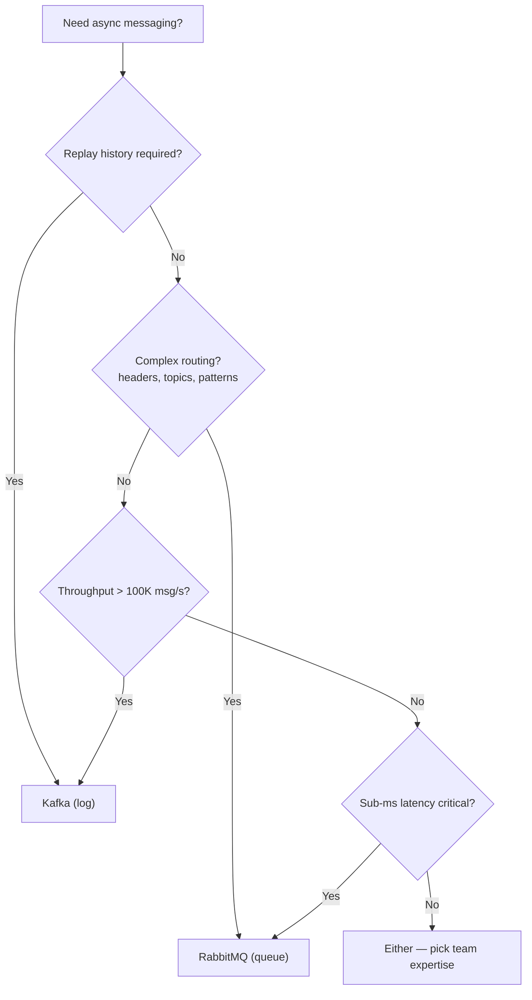
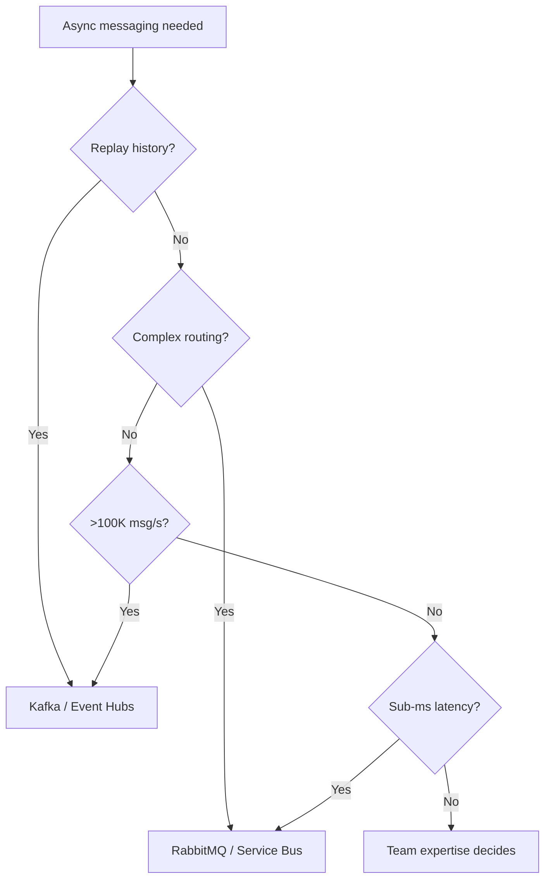
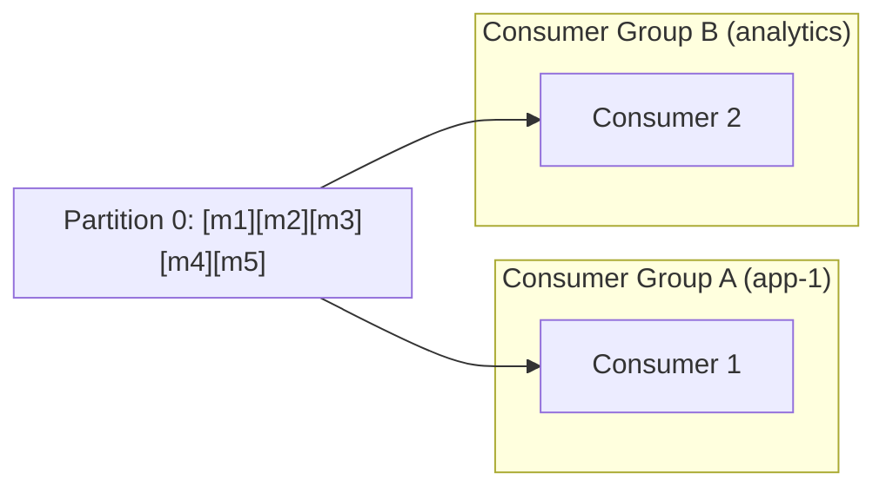
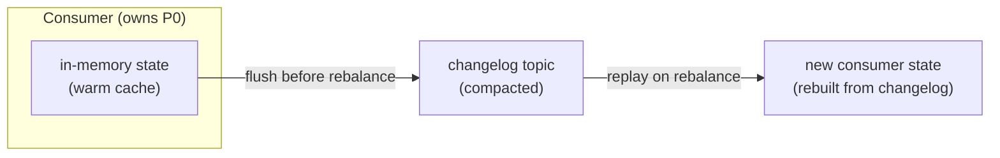
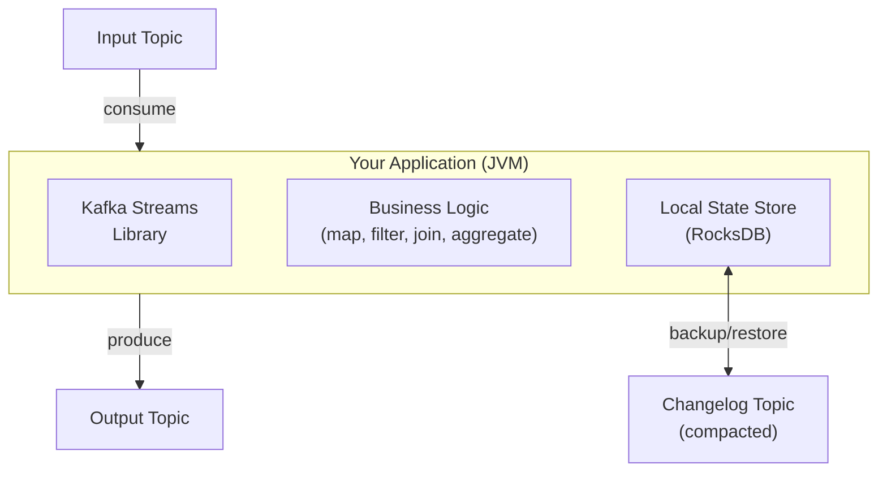
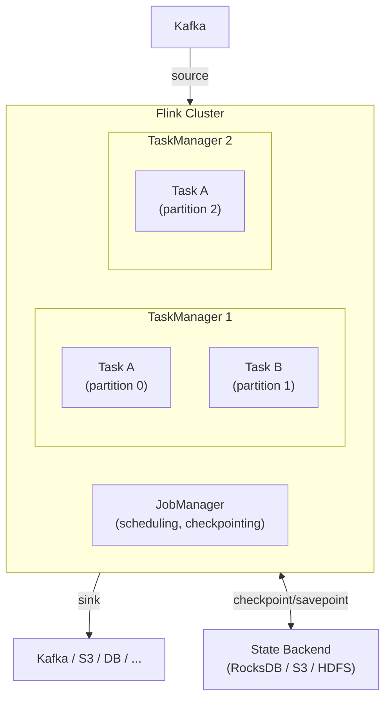
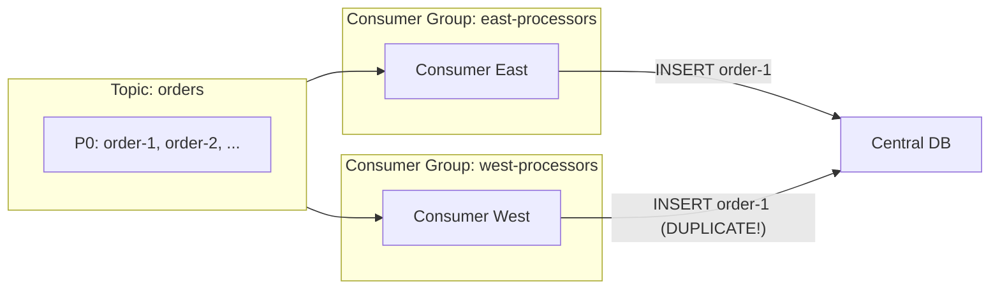
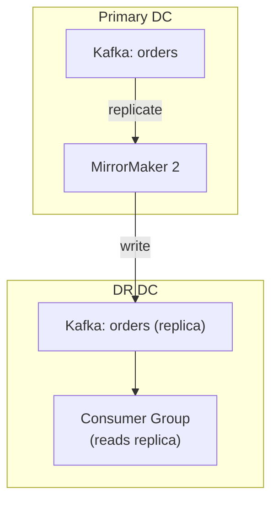

# 5. Message Brokers & Asynchronous Processing

> **Parent**: [System Design Interview Reference](../index.md)  
> **Source**: [20 Design Interview Questions](../../../articles/medium/20-design-interview-questions.md) — Questions #17–20  
> **Also see**: [Kafka Concepts Every Architect Must Master](../../../articles/medium/kafka-concepts-that-every-architect-should-master.md) — Producer acks, offset modes, rebalances, EOS

---

## Contents

- [broker-01: Broker Selection](#broker-01-broker-selection) — Kafka vs RabbitMQ decision tree
  - [Quick Decision Flowchart](#quick-decision-flowchart)
- [broker-02: Offset Commit Failure](#broker-02-offset-commit-failure) — At-least-once semantics & idempotency
  - [Manual Commit: Sync vs Async](#manual-commit-sync-vs-async)
- [broker-03: Poison Messages](#broker-03-poison-messages) — Dead letter queues & retry strategies
- [broker-04: Message Ordering](#broker-04-message-ordering) — Partition-by-entity, global vs per-key ordering
- [broker-05: Stream Processing](#broker-05-stream-processing) — Kafka internals, rebalancing, Kafka Streams, Flink
  - [Kafka: Consumer Groups & Partition Ordering](#kafka-consumer-groups--partition-ordering)
    - [Rebalance Side Effects](#rebalance-side-effects)
    - [Idle Consumers — Scaling Beyond Partition Count](#idle-consumers--scaling-beyond-partition-count)
  - [Kafka Streams: A Library, Not a Platform](#kafka-streams-a-library-not-a-platform)
  - [Apache Flink: True Stream Processing Engine](#apache-flink-true-stream-processing-engine)
- [broker-06: Producer Durability Tuning](#broker-06-producer-durability-tuning) — acks modes, idempotent producers, latency vs durability
- [broker-07: Multi-Consumer-Group Duplicate Prevention](#broker-07-multi-consumer-group-duplicate-prevention) — Cross-group coordination, multi-region patterns, MirrorMaker 2
- [broker-08: Common Kafka Anti-Patterns](#broker-08-common-kafka-anti-patterns) — Queue-vs-log, partition keys, monolithic topics, schema management, consumer groups

---

## broker-01: Broker Selection

> **Source**: [20 Design Interview Questions](../../../articles/medium/20-design-interview-questions.md) — Q#17


| | |
|:---|:---|
| **Problem** | System uses Kafka for a 100 msg/s task queue with complex routing — high operational cost, wrong abstraction |
| **Root cause** | Treating Kafka (log) and RabbitMQ (queue) as interchangeable |

**Strategy**:



**Philosophical difference**:

| | RabbitMQ | Kafka |
|:---|:---|:---|
| **Worldview** | Deliver to right consumer, then delete | Record forever; consumers read what they need |
| **Broker role** | Smart: routes, tracks delivery, retries | Dumb: stores ordered log, consumers self-manage |
| **Analogy** | Post office | Library archive |
| **Retention** | Until consumed + acked | Configurable time (days/weeks) |
| **Replay** | ❌ Once consumed, gone | ✅ Reset offset, re-read history |
| **Consumer scaling** | Competing consumers (work distribution) | Consumer groups (partition assignment) |

**Use both**: E-commerce — Kafka for clickstream/events (replay for analytics), RabbitMQ for operational commands (send email, generate invoice).

> **Azure mapping**:
> - **Kafka → Event Hubs** (Kafka protocol compatible) or HDInsight Kafka
> - **RabbitMQ → Service Bus** (queues, topics, sessions) or Event Grid (simple pub-sub)
>
> **Full comparisons**: [Event Hubs vs Kafka](../../architecture-azure/integration/messaging-comparisons/eventhubs_vs_kafka_comparison.md) · [Service Bus vs Kafka](../../architecture-azure/integration/messaging-comparisons/servicebus_vs_kafka_comparison.md) · [Azure Event Services Full Doc](../../architecture-azure/integration/messaging-comparisons/azure_event_services_full_doc.md)
>
> **General**: [Messaging Patterns Overview](../../../architecture-general/03-integration-communication-architecture/messaging-patterns/messaging-patterns-overview.md)

### Quick Decision Flowchart



---

## broker-02: Offset Commit Failure

> **Source**: [20 Design Interview Questions](../../../articles/medium/20-design-interview-questions.md) — Q#18
> **Also see**: [Kafka Concepts Every Architect Must Master](../../../articles/medium/kafka-concepts-that-every-architect-should-master.md)


| | |
|:---|:---|
| **Problem** | Messages processed twice after consumer crash |
| **Root cause** | Consumer processed messages but crashed before committing the offset — on restart, re-reads from last committed position |

**Strategy**:

```
At-least-once is the default. Design for it.

Partition: [msg-0] [msg-1] [msg-2] [msg-3] [msg-4] ...
                                    ↑ committed=2
Consumer reads 3,4,5 → processes 3 ✅, 4 ✅, 5 ❌ (crash)
→ Offset still at 2. Restarts → reads 3,4,5 again.
→ 3 and 4 processed TWICE.
```

| Commit strategy | Risk |
|:---|:---|
| Auto-commit (5s interval) | Messages between commits replayed |
| Commit after each message | Very slow (round-trip per message) |
| **Commit after batch** | Best balance; at most N duplicates |
| Commit before processing | Data loss risk |

**Idempotent consumer patterns**:

| Pattern | Mechanism | Example |
|:---|:---|:---|
| **Upsert** | `INSERT ... ON CONFLICT DO UPDATE` | PostgreSQL — second write overwrites, no duplicate |
| **Deduplication table** | `SELECT` for message_id → `INSERT` both in same transaction | Universal; works with any DB |
| **Message UUID** | Producer embeds idempotency key; consumer skips if seen | Zero-dependency |
| **Kafka transactions** | Read + write in atomic transaction | Within Kafka ecosystem only |

### Manual Commit: Sync vs Async

The choice between sync and async commits directly impacts throughput and safety — choosing wrong can silently lose data or throttle performance.

```java
// SYNC commit — blocks until broker acknowledges
// ✅ Safer: ideal for at-least-once / exactly-once
// ❌ Slower: round-trip per commit adds latency
consumer.commitSync();

// ASYNC commit — non-blocking, fire-and-forget
// ✅ Faster: higher throughput, no blocking
// ❌ Risk: if commit fails silently, offsets are lost → duplicates on restart
consumer.commitAsync(new OffsetCommitCallback() {
    @Override
    public void onComplete(Map<TopicPartition, OffsetAndMetadata> offsets, Exception e) {
        if (e != null) {
            log.error("Offset commit failed for {}: retrying...", offsets.keySet(), e);
            // Retry with backoff or fall back to sync commit
        }
    }
});
```

| Strategy | When to use | Risk |
|:---|:---|:---|
| **Sync after each batch** | Critical data (payments, fraud detection) | Throughput capped by commit latency |
| **Async with callback** | High-throughput analytics, logging | Failed commits → silent offset loss |
| **Hybrid: async during processing, sync on shutdown** | Balance safety and throughput | Complex error handling |
| **Disable auto-commit entirely** | Always — `enable.auto.commit=false` | Must manage commits manually |

> **Architect's rule**: Always disable auto-commit. Use manual sync commits after **idempotent** processing (e.g., confirmed DB insert). Async is a performance optimization — only add it when sync becomes the bottleneck, and always handle commit failures.

> **Azure**: Event Hubs uses offset/sequence number — same at-least-once semantics. Service Bus peek-lock provides at-least-once with built-in dead-lettering. | **General**: [Idempotency Store Pattern](../../../architecture-general/03-integration-communication-architecture/messaging-patterns/idempotency-store-pattern.md)

---

## broker-03: Poison Messages

> **Source**: [20 Design Interview Questions](../../../articles/medium/20-design-interview-questions.md) — Q#19


| | |
|:---|:---|
| **Problem** | One malformed message crashes every worker that picks it up — blocks the queue infinitely |
| **Root cause** | No distinction between transient errors (retry) and permanent errors (dead-letter) |

**Strategy**:

```
Message processing decision tree:
  ├─ Transient error (network blip, DB timeout, 503)
  │    └─ NACK + requeue with backoff (≤ max_retries)
  └─ Permanent error (malformed JSON, missing field, null ref)
       └─ NACK + requeue=false → DEAD LETTER QUEUE
```

| Component | Responsibility |
|:---|:---|
| **Max retry count** | Limit redelivery attempts (3-5 typical) |
| **Dead Letter Queue (DLQ)** | Capture poison messages after retries exhausted |
| **Monitoring & alerting** | Alert if DLQ depth > 0 for > 5 minutes |

**Implementation by broker**:

| Broker | Built-in DLQ? | Mechanism |
|:---|:---:|:---|
| **Azure Service Bus** | ✅ Best built-in | `MaxDeliveryCount` → auto dead-letter + `DeadLetterReason` |
| **RabbitMQ** | ✅ First-class | `x-dead-letter-exchange` queue arg + `basic_nack(requeue=false)` |
| **AWS SQS** | ✅ Redrive policy | `maxReceiveCount` → auto-move to DLQ |
| **Kafka** | ⚠️ Manual | Retry topic → DLT (Dead Letter Topic); consumer commits offset after moving |

**DLQ operational runbook**:

| Action | When |
|:---|:---|
| Fix producer | Malformed message — fix upstream schema |
| Fix consumer | Bug in processing — deploy fix, replay from DLQ |
| Skip + acknowledge | Message genuinely invalid (deleted entity) |
| Manual intervention | Complex business-logic failure |
| Alert | DLQ depth > 0 for > 5 min → page on-call |

> **Azure**: Service Bus auto dead-lettering after `MaxDeliveryCount` | **General**: [Dead Letter Queue Pattern](../../../architecture-general/03-integration-communication-architecture/messaging-patterns/messaging-patterns-overview.md#2-dead-letter-queue-dlq)

---

## broker-04: Message Ordering

> **Source**: [20 Design Interview Questions](../../../articles/medium/20-design-interview-questions.md) — Q#20


| | |
|:---|:---|
| **Problem** | Messages processed in wrong order across parallel consumers |
| **Root cause** | Multiple consumers compete for messages — network variance, GC pauses, and CPU scheduling randomize order |

**Strategy — partition by entity**:

```
Global ordering (impossible at scale):
  Consumer 1: [A──100ms──]    Consumer 2: [B-20ms-] ← finishes first!
  → Order: B, A, C... WRONG

Entity-level ordering (scalable):
  user-42: [msg-1] [msg-2] [msg-3] → Partition 0 → Consumer A (ordered)
  user-99: [msg-1] [msg-2]        → Partition 1 → Consumer B (ordered)
  user-17: [msg-1] [msg-2] [msg-3] → Partition 2 → Consumer C (ordered)
```

| Platform | Partitioning mechanism |
|:---|:---|
| **Kafka** | `ProducerRecord` key → `hash(key) % partitions` |
| **RabbitMQ** | Consistent hash exchange plugin or manual sharding |
| **AWS SQS FIFO** | `MessageGroupId` — messages in same group are FIFO |
| **Azure Service Bus** | `SessionId` — session-aware consumer processes in FIFO |

**When you TRULY need global order** (rare):
1. Single partition / single FIFO queue — accept throughput ceiling (~300 TPS for SQS FIFO)
2. Sequence numbers — producer assigns monotonically increasing number; consumer buffers and reorders
3. Event sourcing + CQRS — write side ordered (single partition), read side eventually consistent

**When order DOESN'T matter** (most cases):
- Two users update their profiles (independent entities)
- User adds then removes cart item (last-write-wins = same result)
- IoT temperature reports (aggregate by time window)

### Kafka: Consumer Groups & Partition Ordering

> Moved to **[P21: Stream Processing](#broker-05-stream-processing)** — covers consumer groups, partition ordering, rebalance side effects, Kafka Streams, and Apache Flink.

> For quick reference: within a consumer group, each partition has exactly **one consumer** — that 1:1 mapping is Kafka's ordering guarantee. To fan-out the same partition to multiple consumers, use **separate consumer groups**.

---

## broker-05: Stream Processing

> **Source**: [Kafka Concepts Every Architect Must Master](../../../articles/medium/kafka-concepts-that-every-architect-should-master.md)


> Covers Kafka consumer internals, rebalancing, Kafka Streams, and Apache Flink — extracted from P20 for clarity.

### Kafka: Consumer Groups & Partition Ordering

**Can multiple consumers listen to the same partition?**

| Scenario | Same partition? | Ordering? |
|:---|:---|:---|
| **Same consumer group** | ❌ **No** — Kafka assigns each partition to exactly ONE consumer in the group | ✅ Guaranteed — single consumer reads sequentially |
| **Different consumer groups** | ✅ **Yes** — each group maintains its own offset independently | ✅ Per-group — each group reads in order from its own offset |



**Why this matters**: The "one consumer per partition within a group" rule is Kafka's **ordering guarantee mechanism**. If two consumers in the same group could read partition 0, they'd race and reorder messages. Kafka enforces this at the protocol level through the Group Coordinator — when a consumer joins/leaves, partitions are **rebalanced** to maintain the 1:1 mapping.

**Scaling & ordering trade-off**:

```
Partitions = parallelism ceiling for your consumer group

Topic: orders (3 partitions)
  P0: [order-1] [order-4] [order-7]  → Consumer A (same group)
  P1: [order-2] [order-5] [order-8]  → Consumer B (same group)
  P2: [order-3] [order-6] [order-9]  → Consumer C (same group)

  ✅ Per-partition ordering preserved (by user_id key)
  ✅ Up to 3 consumers can work in parallel
  ❌ Adding Consumer D → it stays idle (no unassigned partition)
  ❌ No global ordering across P0, P1, P2
```

**Key rules**:
- **Max parallelism = partition count**: A consumer group can have at most `N` active consumers for `N` partitions; extras sit idle
- **Partition key = ordering domain**: Messages with the same key go to the same partition → processed in order by one consumer
- **Rebalance disrupts ordering briefly**: During rebalance, no consumer reads — but order within a partition is never violated once the new assignment settles
- **Across groups = fan-out, not competition**: Group A and Group B both read partition 0 independently — like two bookmarks in the same book

#### Idle Consumers — Scaling Beyond Partition Count

A common architectural mistake: adding more consumer instances than partitions, expecting higher throughput.

```
Topic: orders (8 partitions)

Consumer Group: order-processor (12 instances)
  Consumer 1-8  → each gets 1 partition → ACTIVE  ✅
  Consumer 9-12 → no partitions available → IDLE   ❌

Result: 12 instances deployed, paying for 12, but only 8 do work.
```

| Situation | What happens | Fix |
|:---|:---|:---|
| Consumers > Partitions | Idle consumers — wasted compute | Increase partition count or reduce consumers |
| Consumers = Partitions | Optimal — 1:1 mapping | — |
| Consumers < Partitions | Some consumers handle multiple partitions — still works, just higher per-consumer load | Acceptable; add consumers up to partition count |

> **Key insight**: Partitions are the **unit of parallelism** in Kafka. Consumer count beyond partition count adds zero throughput and wastes resources. If you need more parallelism, increase partitions first — but note that partitions cannot be decreased without recreating the topic.

#### Rebalance Side Effects

When a consumer joins or leaves a group, Kafka triggers a **rebalance** — all partitions are reassigned across the remaining consumers. During this window, the entire group is disrupted.

```
Timeline of a rebalance:

 Time ──────────────────────────────────────────────────────►
 
 Consumer A:  [msg-41][msg-42] ████ PAUSED ████  [msg-43][msg-44]...
 Consumer B:  [msg-81][msg-82] ████ PAUSED ████  [msg-41][msg-42]...
                                ▲
                           Rebalance
                           (stop-the-world)
                               
 P0 was on A ──► now on B      → msg-41 & 42 processed TWICE if A didn't commit
```

| Side effect | What happens | Impact |
|:---|:---|:---|
| **Stop-the-world pause** | All consumers in the group halt processing during reassignment | Latency spike; upstream backpressure |
| **Duplicate processing** | New consumer picks up from last committed offset, re-reads messages already processed (but not committed) by old consumer | At-least-once semantics amplified |
| **Offset commit race** | Old consumer commits offset mid-rebalance → new consumer starts from wrong position → messages skipped or replayed | Silent data inconsistency |
| **In-memory state loss** | Aggregation windows, counters, caches held in consumer memory vanish when partitions move | Corrupted aggregates; must rebuild from changelog |
| **Rebalance storms** | One slow consumer triggers rebalance → new assignment stresses another consumer → cascading rebalances | Group oscillates; throughput drops to near-zero |

**What triggers a rebalance**

| Trigger | Default | What happens |
|:---|:---|:---|
| Consumer joins/leaves group | — | Immediate rebalance |
| `session.timeout.ms` | 45s | Consumer heartbeat lost → kicked out → rebalance |
| `max.poll.interval.ms` | 5min | Consumer hasn't called `poll()` in time → considered stuck → rebalance |
| Topic metadata change | — | Partitions added to topic → rebalance |

**Mitigation strategies**

| Strategy | Mechanism | Kafka version |
|:---|:---|:---|
| **Cooperative rebalancing** | `partition.assignment.strategy: CooperativeStickyAssignor` — only reassigns partitions that actually need to move; other consumers keep processing | 2.4+ |
| **Static group membership** | `group.instance.id` — consumer keeps its partition assignment across restarts (within `session.timeout.ms`); rejoin without rebalance | 2.3+ |
| **Tune timeouts** | Increase `max.poll.interval.ms` for heavy processing; increase `session.timeout.ms` for flaky networks (but slower failure detection) | All |
| **State in changelog, not memory** | Persist consumer state to a compacted topic (Kafka Streams pattern); rebuild on rebalance instead of losing it | All |
| **Graceful shutdown** | Call `consumer.close()` before shutting down → triggers a controlled leave → faster, cleaner rebalance | All |

##### 1. Cooperative Rebalancing (StickyAssignor)

<details>
<summary><strong>Expand</strong></summary>

The default **eager rebalance** revokes ALL partitions from ALL consumers, reassigns them, then resumes — even if only one consumer joined. **Cooperative rebalancing** (a.k.a. incremental cooperative) only revokes the partitions that actually need to move.

```
Eager (default, pre-2.4):                Cooperative (2.4+):

 P0→A    P1→B    P2→C                    P0→A    P1→B    P2→C
  │       │       │     Consumer D joins   │       │       │     Consumer D joins
  ▼       ▼       ▼                        │       │       ▼
 █████ ALL PAUSED █████                    │       │    █PAUSED█   P0, P1 keep processing
  │       │       │                        │       │       │
 P0→A    P1→D    P2→B                    P0→A    P1→B    P2→D    only P2 moved
                                         
 Impact: ALL partitions stop              Impact: only the moved partition stops
```

**Configuration**:
```properties
# consumer.properties
partition.assignment.strategy=org.apache.kafka.clients.consumer.CooperativeStickyAssignor
```

**Trade-off**: Slightly more complex rebalance protocol; requires broker and client both on 2.4+. The "sticky" part tries to keep partitions on the same consumer — so if Consumer A had P0 before the rebalance, it keeps P0 if possible.

</details>

##### 2. Static Group Membership

<details>
<summary><strong>Expand</strong></summary>

Without static membership, a consumer restart (even a rolling restart) triggers **two rebalances**: one when it leaves, another when it rejoins. With `group.instance.id`, the Group Coordinator holds the consumer's slot for `session.timeout.ms`, so a restart within the timeout window is treated as a **rejoin** — no rebalance at all.

```
Without static membership:              With static membership:
                                       
 Consumer A restarts:                   Consumer A restarts:
 1. Leave group → REBALANCE #1          1. Leave group → slot held (no rebalance)
 2. Rejoin group → REBALANCE #2         2. Rejoin with same group.instance.id →
                                          "Welcome back, here are your partitions"
                                         
 Total: 2 stop-the-world pauses           Total: 0 pauses
```

**Configuration**:
```properties
# consumer.properties
group.instance.id=order-processor-1    # Unique per consumer instance
session.timeout.ms=30000               # Must restart within this window
```

**Trade-off**: If the consumer is truly dead (not coming back), the group waits the full `session.timeout.ms` before reassigning its partitions — delaying recovery. Use shorter timeouts if fast failure detection matters more than avoiding rebalances.

</details>

##### 3. Tune Timeouts

<details>
<summary><strong>Expand</strong></summary>

The two most impactful knobs:

| Property | Default | Increase when | Risk of increasing |
|:---|:---|:---|:---|
| `max.poll.interval.ms` | 300,000 (5min) | Processing a batch takes >5min (e.g., calling a slow external API) | Consumer appears stuck longer before being kicked out |
| `session.timeout.ms` | 45,000 (45s) | Network is flaky or GC pauses >45s | Slower failure detection; consumer down for 60s+ before group reacts |
| `heartbeat.interval.ms` | 3,000 (3s) | Reduce broker load; should be ≤ `session.timeout.ms / 3` | Slower heartbeat → slower session timeout detection |

```properties
# For heavy processing workloads
max.poll.interval.ms=600000             # 10 minutes
# For unstable network environments
session.timeout.ms=60000                # 60 seconds
heartbeat.interval.ms=10000             # 10 seconds
```

</details>

##### 4. State in Changelog, Not Memory

<details>
<summary><strong>Expand</strong></summary>

Consumers that maintain in-memory state (aggregation windows, join tables, session data) lose it on every rebalance. The Kafka Streams pattern solves this:



1. **Write**: Every state mutation is written to a compacted changelog topic
2. **On rebalance**: New consumer reads the changelog from the beginning (or last committed offset), rebuilding the exact state
3. **RocksDB** (Kafka Streams default): Local disk-backed state store with changelog topic — survives both restarts and rebalances

**Without Kafka Streams**, the same pattern can be implemented manually:
- Write state changes to a compacted topic with the partition key
- On `ConsumerRebalanceListener.onPartitionsAssigned()`, replay the changelog before starting to process new messages
- On `onPartitionsRevoked()`, flush any pending state

</details>

##### 5. Graceful Shutdown

<details>
<summary><strong>Expand</strong></summary>

A `kill -9` (or container OOM kill) triggers an **unclean leave** — the Group Coordinator only notices when `session.timeout.ms` expires. A graceful shutdown sends an explicit `LeaveGroup` request, triggering an immediate, controlled rebalance.

```java
// Register shutdown hook
Runtime.getRuntime().addShutdownHook(new Thread(() -> {
    System.out.println("Shutting down consumer...");
    consumer.wakeup();           // Interrupt any blocking poll()
    consumer.close();            // Commit offsets + LeaveGroup request
    System.out.println("Consumer closed cleanly.");
}));
```

```python
import signal

def shutdown(signum, frame):
    print("Shutting down consumer...")
    consumer.close()              # Commit + LeaveGroup
    sys.exit(0)

signal.signal(signal.SIGTERM, shutdown)
signal.signal(signal.SIGINT, shutdown)
```

**Kubernetes note**: Set `terminationGracePeriodSeconds` high enough for `consumer.close()` to complete (typically 30-60s). The preStop hook can trigger a controlled shutdown before SIGTERM.

</details>

> **Takeaway** — Rebalances are Kafka's mechanism for fault tolerance, but they come at a cost: stop-the-world pauses, duplicates, and state loss. Use **cooperative rebalancing + static membership** to minimize disruption, and always design consumers to survive a rebalance (idempotent processing, external state).

### Kafka Streams: A Library, Not a Platform

**What it is**: Kafka Streams is a **Java/Scala client library** (not a separate cluster or service) for building real-time stream processing applications. You add it as a dependency (`org.apache.kafka:kafka-streams`), write standard application code, and run it anywhere — no dedicated processing cluster required.



**Problems it solves**:

| Without Kafka Streams | With Kafka Streams |
|:---|:---|
| Manual consumer/producer coordination | Single `KStream` / `KTable` abstraction |
| State lost on rebalance → manual recovery | State auto-restored from changelog on rebalance |
| At-least-once by default → manual idempotency | Exactly-once semantics via Kafka transactions |
| Manual windowing, aggregation logic | Built-in tumbling/hopping/session windows |
| No local state → every query hits remote DB | Local RocksDB store + changelog = fast, resilient |
| Manual repartitioning for joins | Automatic repartitioning via `through()` / `repartition()` |

**Core abstractions**:

```java
// Stream: infinite, immutable sequence of records
KStream<String, Order> orders = builder.stream("orders-topic");

// Table: changelog — latest value per key (upsert semantics)
KTable<String, User> users = builder.table("users-topic");

// Stateless: filter, map, flatMap, branch
orders.filter((key, order) -> order.getAmount() > 100)
      .mapValues(Order::applyDiscount);

// Stateful: join, aggregate, reduce, window
orders.join(users, Order::setUserDetails)       // stream-table join
      .groupByKey()
      .windowedBy(TimeWindows.of(Duration.ofMinutes(5)))
      .aggregate(OrderAggregate::new, ...);     // windowed aggregation
```

**Key design principles**:

| Principle | What it means |
|:---|:---|
| **Embedded library** | No cluster to manage — runs inside your app, scales with it |
| **Partition-level parallelism** | Each partition → one stream task → one thread; scale by adding partitions |
| **State is local + durable** | RocksDB on disk, changelog in Kafka; survives crash and rebalance |
| **Event-time processing** | Timestamps from records (not wall-clock); handles out-of-order data |
| **Exactly-once** | `processing.guarantee=exactly_once_v2` via idempotent producers + transactions |

**When to use Kafka Streams vs plain Consumer/Producer**:

| Scenario | Recommendation |
|:---|:---|
| Simple read → transform → write | Plain Consumer/Producer is fine |
| Aggregation, windowing, joins across topics | **Kafka Streams** |
| State that must survive rebalances | **Kafka Streams** |
| Exactly-once semantics required | **Kafka Streams** |
| Non-JVM language (Python, Go, Rust) | Plain Consumer/Producer or a managed service |
| Already running on Spark/Flink | Stick with existing platform |

### Apache Flink: True Stream Processing Engine

**What it is**: Apache Flink is a **distributed stream processing engine** (not a library) that runs on its own cluster. Unlike Kafka Streams which is embedded in your app, Flink is a **platform** with its own resource management, job scheduling, and state backend infrastructure.



**Problems it solves (vs Kafka Streams)**:

| Problem | Kafka Streams | Apache Flink |
|:---|:---|:---|
| **Language support** | Java/Scala only | Java, Scala, Python (PyFlink), SQL |
| **Non-Kafka sources** | Kafka only (input + output) | Kafka, files, databases, message queues, custom |
| **Large state (TB-scale)** | RocksDB on local disk; limited by instance size | External state backend (RocksDB on disk or remote S3/HDFS) |
| **Complex event processing** | Basic pattern matching | Full CEP library (pattern detection, temporal sequences) |
| **Batch + stream unification** | Separate paradigm per mode | Unified — same code for batch and streaming |
| **Backpressure handling** | Consumer lag; manual intervention | Automatic backpressure via credit-based flow control |
| **Multi-tenancy** | One app per consumer group | Multiple jobs share one Flink cluster |
| **SQL analytics** | KSQL (limited) | Full ANSI SQL with windowing, joins, UDFs |

**Key differentiators**:

| | Kafka Streams | Apache Flink |
|:---|:---|:---|
| **Architecture** | Embedded library in your app | Distributed cluster (JobManager + TaskManagers) |
| **Deployment** | `java -jar myapp.jar` | Submit JAR to cluster; manage via CLI/REST/Dashboard |
| **State storage** | RocksDB local + Kafka changelog | RocksDB/HDFS/S3 + distributed checkpointing |
| **Scaling model** | Add app instances; bounded by partition count | Add TaskManagers; rescale jobs with savepoints |
| **Delivery guarantee** | Exactly-once (via Kafka transactions) | Exactly-once (via distributed snapshots / Chandy-Lamport) |
| **Event time** | Basic watermark support | Sophisticated watermarking, allowed lateness, side outputs |
| **Fault tolerance** | State rebuilt from changelog on rebalance | Asynchronous barrier snapshotting; incremental checkpointing |
| **SQL** | KSQL / ksqlDB (separate service) | Built-in SQL API (batch + streaming unified) |
| **Operational complexity** | Low — just your app to manage | High — cluster to provision, monitor, tune |

**When to choose which**:

```
Use Kafka Streams when:                 Use Apache Flink when:

✅ Only Kafka as source/sink            ✅ Multiple data sources (Kafka + DB + S3)
✅ Java/Scala team                      ✅ Python or SQL-heavy team
✅ Simple stateless transforms          ✅ Complex event patterns (CEP)
✅ Aggregations with small state        ✅ TB-scale state (session windows, ML models)
✅ Low operational overhead priority    ✅ Multi-job sharing one cluster
✅ App already runs on JVM              ✅ Need SQL analytics on streams
✅ Tight Kafka integration needed       ✅ Batch + Streaming in one platform
```

**Common misconception**: Kafka Streams is NOT simply "lightweight Flink." They solve different problems. Kafka Streams is a **library** for Kafka-centric applications; Flink is a **platform** for heterogeneous data processing pipelines.

> **Azure mapping**: **Azure Stream Analytics** (managed SQL-based) covers simpler Flink use cases. **HDInsight / AKS-hosted Flink** for full Flink capabilities. Kafka Streams maps to running your Java app on AKS/Container Apps with a Kafka-compatible broker (Event Hubs).

> **Azure**: Service Bus Sessions for ordered delivery within a session | **General**: §3.3 Event-Driven & Messaging

---

## broker-06: Producer Durability Tuning

> **Source**: [Kafka Concepts Every Architect Must Master](../../../articles/medium/kafka-concepts-that-every-architect-should-master.md)


| | |
|:---|:---|
| **Problem** | Payment events lost after broker crash — downstream services never saw the `PaymentInitiated` event |
| **Root cause** | Producer used `acks=1` (default) — leader acknowledged before replication completed; leader died, replica had no copy |

**The `acks` spectrum**:

| `acks` | Behavior | Latency | Durability | When to use |
|:---|:---|:---|:---|:---|
| `acks=0` | Fire-and-forget — producer doesn't wait | Lowest | ❌ None — message can be lost before reaching broker | Metrics, logs where occasional loss is acceptable |
| `acks=1` | Leader acknowledges (default) | Low | ⚠️ Lost if leader dies before replication | High-volume analytics, non-critical telemetry |
| `acks=all` / `-1` | All in-sync replicas acknowledge | Highest | ✅ Survives `min.insync.replicas - 1` failures | Payments, orders, financial transactions |

**Critical data configuration**:

```java
// For payments, orders, fraud detection — always use:
props.put(ProducerConfig.ACKS_CONFIG, "all");
props.put(ProducerConfig.ENABLE_IDEMPOTENCE_CONFIG, "true");
props.put(ProducerConfig.MAX_IN_FLIGHT_REQUESTS_PER_CONNECTION, 5);

// Broker-side: ensure at least 2 in-sync replicas
// min.insync.replicas=2  (set at topic or broker level)
```

**Why `acks=all` alone isn't enough**: If `min.insync.replicas=1` (default), `acks=all` degrades to `acks=1` — the leader alone is the ISR. Always pair `acks=all` with `min.insync.replicas ≥ 2`.

**Idempotent producer**: When `enable.idempotence=true`, Kafka assigns each producer a PID and each message a sequence number. The broker deduplicates messages with the same PID+sequence, preventing duplicates from producer retries.

```
Without idempotence:                    With idempotence:
  Producer sends msg-42                  Producer sends msg-42 (pid=7, seq=42)
  → Network blip, no ack received        → Network blip, no ack received
  → Producer retries msg-42              → Producer retries msg-42 (pid=7, seq=42)
  → Broker has TWO copies of msg-42      → Broker sees duplicate seq → discards
  
  Result: DUPLICATE ❌                    Result: Exactly once ✅
```

| Scenario | acks | Idempotence | Rationale |
|:---|:---|:---|:---|
| Payment processing | `all` | ✅ Required | Cannot lose or duplicate payments |
| Fraud detection | `all` | ✅ Required | Every event is a signal; loss/distortion = missed fraud |
| Clickstream analytics | `1` | Optional | ~0.01% loss acceptable; prioritize throughput |
| IoT sensor data | `1` or `0` | Optional | Aggregation windows smooth out occasional loss |
| Audit logging | `all` | ✅ Required | Regulatory compliance; every record matters |

> **Architect's rule**: `acks=all` + `enable.idempotence=true` + `min.insync.replicas ≥ 2` is the **minimum** for any data you cannot afford to lose or duplicate. The latency cost (~10-20ms extra round-trip) is negligible compared to debugging a silent data-loss bug in production.

> **Azure**: Event Hubs supports idempotent publishing via `ProducerClient` with sequence numbers. Service Bus sessions provide duplicate detection with `DuplicateDetectionHistoryTimeWindow`.

---

## broker-07: Multi-Consumer-Group Duplicate Prevention

> **Source**: [Kafka Concepts Every Architect Must Master](../../../articles/medium/kafka-concepts-that-every-architect-should-master.md)


| | |
|:---|:---|
| **Problem** | Two consumer groups (East & West regions) read the same topic and both write to a central DB → duplicate inserts, race conditions, integrity errors |
| **Root cause** | Consumer groups operate independently — Kafka has no built-in cross-group coordination |

**Why this happens**:



**Strategies by architecture pattern**:

| Pattern | How it works | When to use |
|:---|:---|:---|
| **Single consumer group ID** | Both regions share `group.id=order-processor` — Kafka assigns each partition to only one region's consumer | Both regions are the same logical application; active-passive or coordinated |
| **Partition by region** | Producer sets partition key = `region-id`; each region only reads its own partition subset | Regions process distinct data sets (e.g., `region=EU` vs `region=US`) |
| **MirrorMaker 2** | Replicate topic per region (`orders.us`, `orders.eu`); each region consumes its own replica | Full regional independence; no cross-region consumer coordination |
| **Application-level dedup** | Both groups process all messages; DB layer uses upsert or idempotency key to prevent duplicates | Simple but puts dedup burden on DB; works for low-throughput scenarios |
| **Leader election** | Only one consumer group is "active"; standby group takes over on failure (e.g., via etcd/Consul lease) | Active-passive DR; avoids duplicates at the cost of standby resources |

**MirrorMaker 2 deep dive**:



MM2 auto-renames topics by prefixing with source cluster alias (`us-west.orders`), preserves offsets, and handles consumer group offset translation — so DR failover is seamless.

| Approach | Duplicates? | Complexity | Latency |
|:---|:---|:---|:---|
| Single group ID | ❌ No duplicates | Low — just config | Minimal |
| Partition by region | ❌ No duplicates | Medium — producer key logic | Minimal |
| MirrorMaker 2 | ❌ No duplicates across regions | High — MM2 cluster to manage | Replication lag (ms-sec) |
| App-level dedup | ⚠️ Possible under race conditions | Medium — dedup logic | DB round-trip |
| Leader election | ❌ No duplicates (active only) | High — election infra | Failover lag (sec-min) |

> **Architect's rule**: If two consumer groups write to the same downstream system, you have a design problem. Either (a) use one group, (b) partition the data so groups don't overlap, or (c) use MirrorMaker 2 for full regional independence. Application-level dedup is a last resort.

> **Azure**: Event Hubs Capture + Geo-DR for cross-region replication. Service Bus Geo-DR pairs namespaces. MirrorMaker 2 runs on AKS/HDInsight for Kafka replication.

---

## broker-08: Common Kafka Anti-Patterns

> **Source**: [Kafka Mistakes Breaking Your System](../../../articles/medium/kafka-anti-patterns/01-kafka-mistakes-breaking-your-system.md)

### broker-08a: Kafka as a Queue (Auto-Commit + No Error Handling)

| | |
|:---|:---|
| **Problem** | Messages silently dropped when processing fails — auto-commit removes offset before work completes |
| **Root cause** | `enable-auto-commit: true` + no explicit error handling |
| **Symptoms** | Customer orders lost; no replay possible; only evidence is an error stack trace |

**Strategy**:

| Approach | Mechanism | Kafka Config |
|:---|:---|:---|
| **Manual commit** | `ack.acknowledge()` only after successful processing | `enable-auto-commit: false`, `ack-mode: manual` |
| **DLQ for non-retryable** | Send permanently failed messages to dead-letter topic | Separate producer + DLQ topic |
| **Retry for transient** | Do NOT ack; let consumer retry or use `RetryTemplate` with backoff | Throw exception (no ack) |

> **Key insight**: Kafka is a **distributed log**, not a queue. Messages persist until retention — use that property for fault tolerance. Manual commit + DLQ + idempotent processing = foundation for exactly-once semantics.

### broker-08b: No Partition Key Strategy

| | |
|:---|:---|
| **Problem** | Hot partitions, broken ordering, can't autoscale — all because messages scatter randomly |
| **Root cause** | `kafkaTemplate.send(topic, value)` — no key, relying on default sticky partitioner |
| **Symptoms** | `UserLoggedIn` arrives before `UserCreated`; one partition burns at 100% CPU while others are idle |

**Strategy**:

| Key Type | Example | Use Case |
|:---|:---|:---|
| **Business entity key** | `userId`, `orderId`, `sessionId` | Per-entity ordering (most common) |
| **Custom partitioner** | TenantPartitioner (hash on tenant ID) | Multi-tenancy isolation |
| **Random UUID** | `UUID.randomUUID().toString()` | No ordering needed, just want even spread |

> **Key insight**: Kafka guarantees ordering **within a partition**. Without a key, related messages land on different partitions and can arrive out of order. With a key, same-ID messages always go to the same partition — ordered, predictable, scalable.

### broker-08c: Monolithic Topic (Single Topic for All Domains)

| | |
|:---|:---|
| **Problem** | One domain's traffic spike throttles all consumers; retention and schema become one-size-fits-none |
| **Root cause** | All event types → `main-events` topic; consumers filter by `type` field |
| **Symptoms** | Marketing signup blast slows payment processing; adding a field to `UserSignup` forces all consumers to update |

**Strategy**:

| Pattern | Convention | Example |
|:---|:---|:---|
| **Topic per aggregate** | `{domain}.events` | `order.events`, `user.events`, `payment.events` |
| **Independent consumer groups** | `groupId = {service-name}` | `order-service`, `user-service` |
| **Per-topic config** | Partition count, replication, retention per domain | `order.events`: 7 days; `user.events`: 1 day |

> **Key insight**: The "log per aggregate" pattern isolates blast radius, enables independent schema evolution, and gives each domain its own retention, replication, and scaling parameters.

### broker-08d: No Schema Management (Raw JSON)

| | |
|:---|:---|
| **Problem** | Schema changes break consumers at deserialization; silent data loss when unknown fields are ignored |
| **Root cause** | Producer/consumer share Java DTOs via library; no central schema authority |
| **Symptoms** | `SerializationException` blocks entire partition; or `FAIL_ON_UNKNOWN_PROPERTIES=false` silently drops critical fields |

**Strategy**:

| Approach | Mechanism | Compatibility |
|:---|:---|:---|
| **Schema Registry + Avro** | Central registry validates compatibility before deploy | BACKWARD: old consumers read new messages |
| **Protobuf** | Binary schema with explicit field numbers | FORWARD: new consumers read old messages |
| **JSON Schema** | JSON with Registry validation | FULL: both directions |

> **Key insight**: A schema registry is the **source of truth**. Without it, every deployment is a gamble on whether consumers can still deserialize. With it, contract violations are caught at build/deploy time, not at 3 AM.

### broker-08e: Wrong Consumer Group Usage

| | |
|:---|:---|
| **Problem** | Services that should both receive a message compete for it instead; restarts lose offset position |
| **Root cause** | Multiple logical subscribers share one `group.id`, or no group is specified |
| **Symptoms** | Email service gets the "password reset" but SMS service doesn't; every deploy creates a new anonymous group |

**Strategy**:

| Scenario | Group Design | Behavior |
|:---|:---|:---|
| **Two different services need same message** | **Different groups**: `email-notif-service`, `sms-notif-service` | **Broadcast**: both get every message |
| **One service, 5 instances for scale** | **Same group**: `email-notif-service` | **Load-balance**: partitions split across 5 instances |
| **No group specified** | ❌ Auto-generated `anonymous.xxxx` per restart | ❌ Can't resume from last offset |

> **Key insight**: One group per logical subscriber = broadcast. Same group for same service = load balancing. A stable `group.id` ensures offset continuity across restarts.

### Summary Table

| # | Anti-Pattern | Root Cause | Fix |
|---|-------------|------------|-----|
| 1 | **Queue, not log** | Auto-commit + no error handling | Manual commit + DLQ + retry |
| 2 | **No partition key** | Sending without a key | Consistent entity key (`userId`, `orderId`) |
| 3 | **Monolithic topic** | All domains → one topic | Topic per bounded context |
| 4 | **No schema registry** | Raw JSON + shared DTOs | Schema Registry + Avro/Protobuf |
| 5 | **Wrong consumer groups** | Shared/auto-generated IDs | One stable group per logical subscriber |

> **Azure**: Event Hubs supports manual offset checkpoint via `CheckpointStore`; Schema Registry for Avro; Service Bus topics for domain isolation; Consumer Groups for subscriber isolation.

