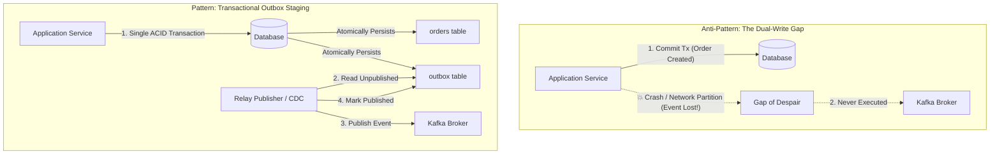
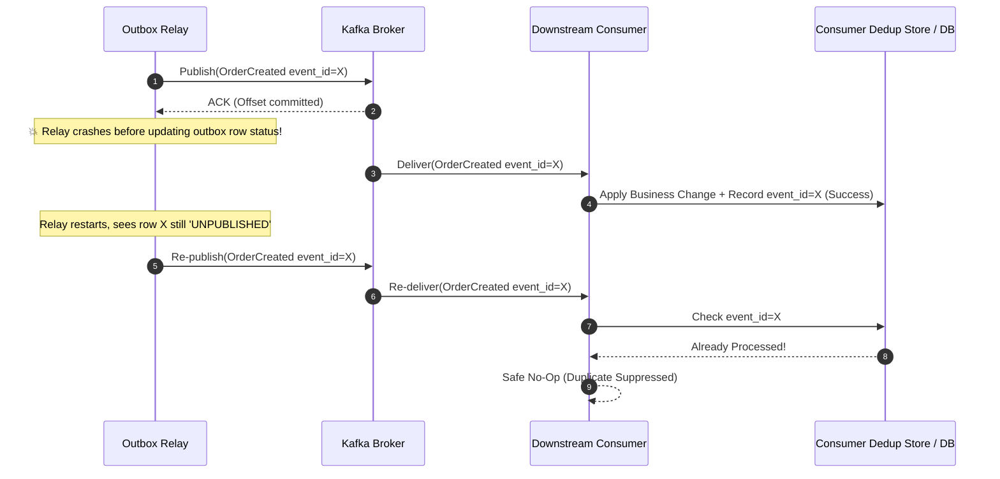
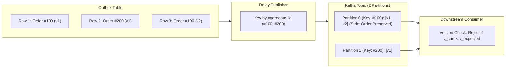
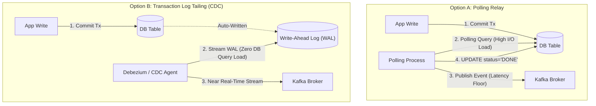
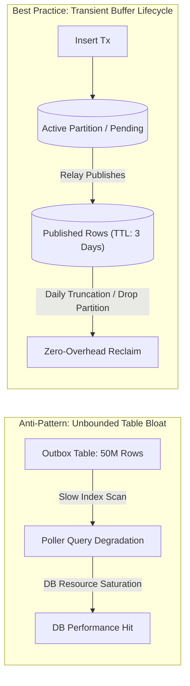
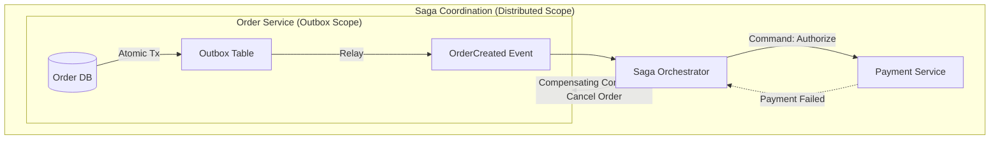

# Outbox Pattern Capabilities & Limits — Key Takeaways

> **Parent**: [Messaging & Event Streaming](index.md)  
> **Source**: [What the Outbox Pattern Actually Solves — and What It Doesn’t](../../articles/messaging/what-the-outbox-pattern-actually-solves-and-what-it-doesnt.md)  
> **Taxonomy Reference**: §3.3 Event-Driven & Messaging  

## Contents

| ID | Problem | Key Concept |
|:---|:---|:---|
| [`broker-153`](#broker-153-dual-write-atomicity-gap-vs-transactional-staging) | Committing database state and publishing an event as two separate steps causes silent event loss on crash | Dual-write atomicity gap, transactional staging, local ACID boundary |
| [`broker-154`](#broker-154-at-least-once-relay-boundary-vs-false-exactly-once-expectations) | Assuming outbox guarantees exactly-once delivery causes duplicate side effects on relay restarts | At-least-once relay boundary, consumer idempotency requirement, dedup store |
| [`broker-155`](#broker-155-outbox-ordering-limitations-vs-broker-partitioning-and-business-sequence) | Poller `ORDER BY created_at` does not preserve downstream ordering across multiple partitions or consumer rebalances | Partition keying by aggregate ID, delivery order vs business correctness, aggregate version checks |
| [`broker-156`](#broker-156-polling-relay-database-overhead-vs-change-data-capture-infrastructure-complexity) | Database polling overhead and latency floors vs CDC operational complexity and WAL dependencies | Polling relay vs log-based CDC (transaction log tailing / Debezium) tradeoffs |
| [`broker-157`](#broker-157-unbounded-outbox-table-bloat-and-degrading-relay-query-performance) | Retained published events cause outbox table bloat, slow indexing, and degraded poller performance | Outbox pruning lifecycle, scheduled batch deletes, partition truncation |
| [`broker-158`](#broker-158-local-outbox-atomicity-vs-cross-service-multi-entity-consistency) | Expecting the outbox pattern to guarantee consistency across multi-service workflows | Local single-service atomicity vs distributed multi-service consensus (Sagas) |

---

## broker-153: Dual-Write Atomicity Gap vs Transactional Staging

| | |
|:---|:---|
| **Problem** | Committing business state mutations to a database and subsequently issuing a network publish call to a message broker (Kafka, Service Bus) creates an uncoordinated dual write. If the application server crashes, restarts, or encounters a network partition immediately after committing the transaction but before publishing completes, the database records the entity as created, but no downstream services or event consumers are ever notified. |
| **Root cause** | Attempting to update two heterogeneous distributed systems (an ACID database and an asynchronous message broker) sequentially without a shared distributed transaction coordinator or atomic boundary. |

**Strategy**: Stage outbound events in a dedicated outbox table residing within the *same* database and transaction boundary as the aggregate root or business entity. Atomicity is achieved purely at the database write layer: both the business record and the outbox row commit together or roll back together. An asynchronous background process (relay publisher) independently reads the staged outbox rows and dispatches them to the broker.

**Tradeoff**: Introduces write amplification to the transactional database (every event requires a row insert) and ties event staging to relational commit throughput, but completely eliminates silent data loss and distributed state divergence.

> **Dictionary**: [Outbox Pattern](../../reference-dictionary/cqrs-event-driven.md#outbox-pattern), [Dual-Write Problem](../../reference-dictionary/cqrs-event-driven.md#dual-write-problem), [Post-Commit Dispatch](../../reference-dictionary/cqrs-event-driven.md#post-commit-dispatch)  
> **Azure**: [Azure SQL Database](../../architecture-azure/data/databases/azure_sql/), [Azure Cosmos DB Change Feed](../../architecture-azure/data/databases/azure_cosmosdb/)  
> **Related**: [`broker-30`](kafka-design-patterns.md#broker-30-transactional-outbox), [`broker-123`](event-driven-architecture-questions-takeaways.md#broker-123-transactional-outbox-capabilities-and-inherent-scope-boundaries)

---

## broker-154: At-Least-Once Relay Boundary vs False Exactly-Once Expectations

| | |
|:---|:---|
| **Problem** | Engineering teams mistakenly assume that adopting the Transactional Outbox pattern guarantees end-to-end "exactly-once" delivery, under-designing downstream consumers and suffering duplicate side effects (e.g., duplicate credit card charges, multiple dispatch notifications) when outbox relays restart or failover. |
| **Root cause** | The outbox pattern decouples the database write from network publishing, but the relay publishing step remains subject to network unreliability. If the relay successfully publishes a batch to the message broker but crashes, times out, or loses database connectivity *before* marking the outbox rows as published, the restarted relay re-fetches the unmarked rows and republishes them. |

**Strategy**: Explicitly treat the outbox pattern as an **at-least-once** event publishing mechanism, not an exactly-once delivery system. Require all downstream consumers to implement strict idempotency guards:
1. Include an immutable, unique `event_id` or `idempotency_key` within the outbox payload.
2. At the consumer boundary, atomically verify and record the `event_id` against a deduplication store or unique constraint within the consumer's local database transaction.
3. Treat duplicate messages as normal, expected occurrences and safely no-op them.

**Tradeoff**: Prevents duplicate downstream state corruption, but places the responsibility of deduplication and idempotency verification on every downstream consumer rather than relying solely on the producer or publisher.

> **Dictionary**: [At-Least-Once Delivery](../../reference-dictionary/messaging.md), [Idempotent Consumer](../../reference-dictionary/messaging.md#idempotent-consumer), [Idempotency](../../reference-dictionary/cqrs-event-driven.md#idempotency)  
> **Azure**: [Azure Service Bus Duplicate Detection](../../architecture-azure/integration/service-bus/), [Azure Event Hubs](../../architecture-azure/integration/event-hubs/)  
> **Related**: [`broker-60`](kafka-producer-ack-idempotency.md#broker-60-idempotent-consumer-with-event-ids), [`broker-143`](event-loss-duplicates-reprocessing-takeaways.md#broker-143-atomic-deduplication-boundary-for-consumer-crashes-prior-to-commit)

---

## broker-155: Outbox Ordering Limitations vs Broker Partitioning and Business Sequence

| | |
|:---|:---|
| **Problem** | Teams rely on an outbox polling query containing `ORDER BY created_at` to guarantee ordered event consumption downstream, only to observe race conditions, out-of-order execution, and corrupted aggregate states in production. |
| **Root cause** | Database row ordering during relay polling only determines the sequence in which messages are placed onto the broker. Once messages enter a distributed broker cluster, physical delivery order is broken if events land on different topic partitions, or if downstream consumer groups rebalance, experience thread pool delays, or process retried records out of band. |

**Strategy**: Establish a multi-layer ordering and concurrency architecture:
1. **Broker Partition Keying**: Ensure the outbox relay explicitly sets the broker message key to the domain entity's identifier (`aggregate_id`). In Kafka, this guarantees that all events for a given aggregate land on the same partition and are consumed sequentially by a single active consumer instance.
2. **Business Sequence Protection**: Decouple business correctness from network arrival order by attaching monotonically increasing sequence numbers or aggregate version stamps to the event payload. Consumers enforce optimistic concurrency control, buffering or rejecting out-of-order versions rather than trusting timestamp arrival order.

**Tradeoff**: Guarantees strict sequential processing per entity while preserving horizontal scalability across entities, but limits the maximum concurrency of any single aggregate to a single partition consumer thread.

> **Dictionary**: [Versioned Aggregates](../../reference-dictionary/cqrs-event-driven.md#versioned-aggregates), [Partition Key Pattern](../../reference-dictionary/messaging.md), [Event Sourcing](../../reference-dictionary/cqrs-event-driven.md#event-sourcing)  
> **Azure**: [Azure Event Hubs Partition Keys](../../architecture-azure/integration/event-hubs/), [Azure Service Bus Sessions](../../architecture-azure/integration/service-bus/)  
> **Related**: [`broker-04`](message-brokers-async.md#broker-04-message-ordering), [`broker-119`](event-driven-architecture-questions-takeaways.md#broker-119-business-consistency-with-eventually-consistent-out-of-order-events)

---

## broker-156: Polling Relay Database Overhead vs Change Data Capture Infrastructure Complexity

| | |
|:---|:---|
| **Problem** | Choosing the wrong outbox publishing mechanism leads to severe architectural friction: continuous SQL polling saturates database connection pools and introduces significant latency floors, while naive log-based CDC implementations introduce brittle external infrastructure, complex schema registry couplings, and operational downtime. |
| **Root cause** | The fundamental engineering tension between application-level query simplicity (polling) and engine-level transaction log mining (Change Data Capture via WAL/binlog). |

**Strategy**: Select the relay publishing mechanism based on organizational maturity, latency SLAs, and transaction volume:
- **Polling Relay**: Suitable for low-to-medium write throughput (< 500 tx/sec) or greenfield services. The relay queries the outbox table (`SELECT ... WHERE status = 'PENDING' ORDER BY created_at LIMIT N`), publishes to the broker, and updates or deletes the rows. Keep polling lightweight via composite indexing (`status, created_at`) and exponential backoff during idle periods.
- **Log-Based CDC (Transaction Log Tailing)**: Recommended for high-volume, latency-critical systems (> 1,000 tx/sec). Tools like Debezium tail the database write-ahead log (WAL in PostgreSQL, binary log in MySQL, change feed in Cosmos DB) directly. Events are extracted and published to Kafka with sub-second latency without executing SQL queries or competing with application transactions for connection pools.

| Dimension | Polling Relay | Log-Based CDC (Debezium / WAL) |
|:---|:---|:---|
| **Latency** | Bounded by polling interval (typically 500ms – 5s) | Sub-second (near real-time streaming) |
| **Database Load** | Continuous read/write SQL queries; lock contention | Zero query overhead; reads sequential WAL files |
| **Infrastructure** | Minimal (runs as background worker or scheduled job) | High (requires Kafka Connect cluster, connector plugins) |
| **Operational Overhead** | Low (standard database tables and application logic) | High (WAL retention sizing, connector offsets, schema sync) |
| **Failure Recovery** | Simple retry query on next loop | Requires replaying WAL offsets or snapshotting |

**Tradeoff**: Polling minimizes operational footprint at the expense of database I/O and latency; CDC maximizes throughput and eliminates polling overhead at the cost of running dedicated data streaming infrastructure.

> **Dictionary**: [Polling Relay](../../reference-dictionary/cqrs-event-driven.md#polling-relay), [Transaction Log Tailing](../../reference-dictionary/cqrs-event-driven.md#transaction-log-tailing), [Change Data Capture](../../reference-dictionary/data-concurrency.md#change-data-capture)  
> **Azure**: [Azure Cosmos DB Change Feed](../../architecture-azure/data/databases/azure_cosmosdb/), [Azure SQL Change Tracking](../../architecture-azure/data/databases/azure_sql/)  
> **Related**: [`db-34`](../databases/34-db-key-takeaways.md), [`broker-30`](kafka-design-patterns.md#broker-30-transactional-outbox)

---

## broker-157: Unbounded Outbox Table Bloat and Degrading Relay Query Performance

| | |
|:---|:---|
| **Problem** | In production outbox implementations using polling relays, published events accumulate indefinitely in the outbox table. Over weeks and months, the table grows to tens of millions of rows, bloating database storage, degrading index cache hit rates, slowing down vacuuming/autovacuum processes, and causing the poller query latency to increase exponentially. |
| **Root cause** | Neglecting the operational lifecycle of outbox records after publication, treating the outbox table as an audit log rather than a transient transfer buffer. |

**Strategy**: Enforce strict lifecycle boundaries and aggressive pruning for outbox records:
1. **Immediate Deletion**: If an immutable audit trail is maintained in the event stream or primary tables, configure the relay to physically `DELETE` rows as part of the publication transaction rather than marking them `status = 'PUBLISHED'`.
2. **Batched Archival & Pruning**: For systems requiring temporary outbox retention for debugging or replay verification, run an asynchronous pruning job during off-peak hours deleting rows where `status = 'PUBLISHED' AND published_at < NOW() - INTERVAL '7 DAYS'`.
3. **Partition Truncation**: Under massive transaction throughput, partition the outbox table by day or week (`PARTITION BY RANGE (created_at)`). Once all records in a partition are published and past their retention horizon, drop or truncate the entire partition instantaneously with zero table lock contention or vacuum fragmentation.

**Tradeoff**: Requires developing and monitoring automated maintenance jobs or database partitioning schemes, but guarantees predictable, constant-time (`O(1)`) polling query performance and bounds database disk usage.

> **Dictionary**: [Outbox Pruning](../../reference-dictionary/cqrs-event-driven.md#outbox-pruning), [Table Partitioning](../../reference-dictionary/databases.md), [Write Amplification](../../reference-dictionary/databases.md)  
> **Azure**: [Azure SQL Partitioned Tables](../../architecture-azure/data/databases/azure_sql/), [Azure Cosmos DB TTL](../../architecture-azure/data/databases/azure_cosmosdb/)  
> **Related**: [`broker-145`](event-loss-duplicates-reprocessing-takeaways.md#broker-145-bounded-deduplication-store-ttl--synthetic-event-key-generation)

---

## broker-158: Local Outbox Atomicity vs Cross-Service Multi-Entity Consistency

| | |
|:---|:---|
| **Problem** | Architects overextend the Outbox Pattern by assuming it provides distributed ACID guarantees across multiple microservices. When a business workflow spanning multiple services encounters a downstream failure (e.g., inventory reserved but payment fails), teams find the outbox has no mechanism to undo upstream commits, resulting in orphaned state and financial inconsistency. |
| **Root cause** | Conflating **local single-service atomicity** (the database write and event staging within one service) with **distributed multi-service consensus** across disparate domain boundaries. |

**Strategy**: Formally distinguish the scope of the Outbox Pattern from distributed workflow patterns:
- **Outbox Pattern Scope**: Guarantees that within a *single service*, state change and event staging succeed or fail as an atomic unit. It eliminates the dual-write gap at the publisher.
- **Saga Pattern Scope**: Manages distributed state consistency across *multiple services*. When a multi-step business process fails downstream, the orchestrator or choreography chain emits compensating events (e.g., `CancelReservation`) to roll back previously committed upstream state.
- Combine both: Use the Outbox Pattern within each participating microservice to reliably emit local domain events, while using a Saga (orchestrated or choreographed) to manage multi-service workflow progression and compensation.

| Architectural Pattern | Operational Scope | Guarantees Provided | What It Does NOT Provide |
|:---|:---|:---|:---|
| **Transactional Outbox** | Single service + single database | Local atomicity between DB mutation and event staging | Distributed cross-service rollback or compensation |
| **Saga Pattern** | Multi-service distributed workflow | Eventual consistency via forward execution or compensating events | Immediate isolation (ACID), single-database atomicity |

**Tradeoff**: Clarifies architectural boundaries and avoids dangerous expectations of distributed ACID, requiring explicit modeling of business compensating transactions and asynchronous recovery workflows.

> **Dictionary**: [Compensating Event](../../reference-dictionary/cqrs-event-driven.md#compensating-event), [Orchestrator-based Saga](../../reference-dictionary/cqrs-event-driven.md#orchestrator-based-saga), [Eventual Consistency](../../reference-dictionary/cqrs-event-driven.md#eventual-consistency)  
> **Azure**: [Azure Logic Apps](../../architecture-azure/integration/logic-apps/), [Azure Durable Functions](../../architecture-azure/compute/functions/azure-durable-functions.md)  
> **Related**: [`broker-34`](kafka-design-patterns.md#broker-34-saga-choreography), [`broker-121`](event-driven-architecture-questions-takeaways.md#broker-121-inapplicability-boundaries-of-event-driven-architecture)
