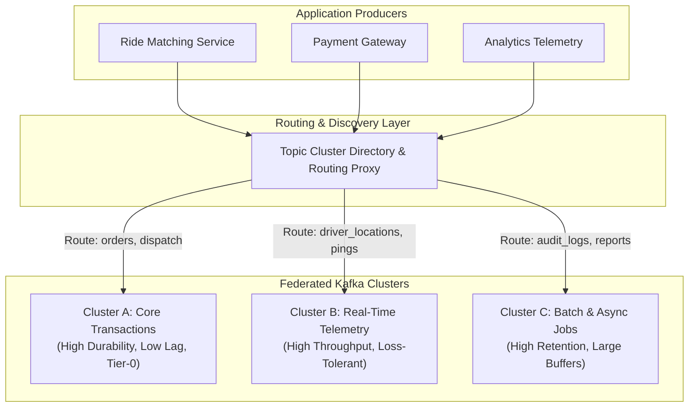
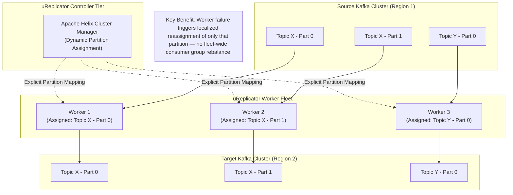
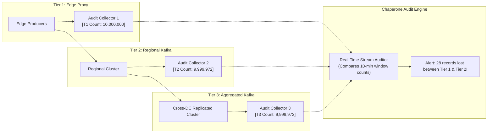
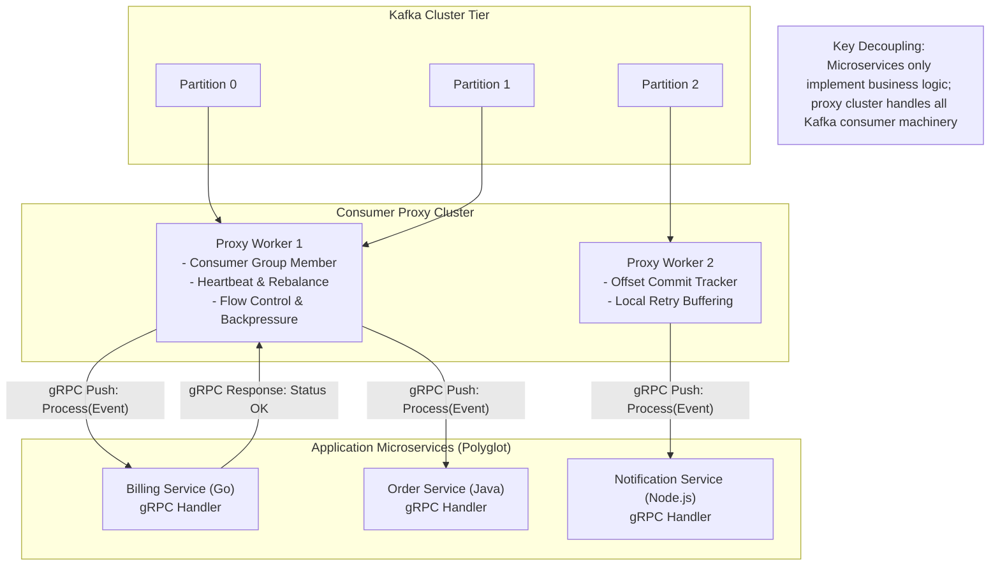
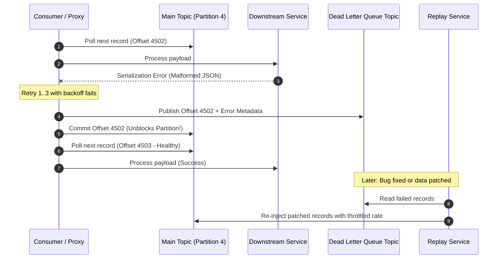
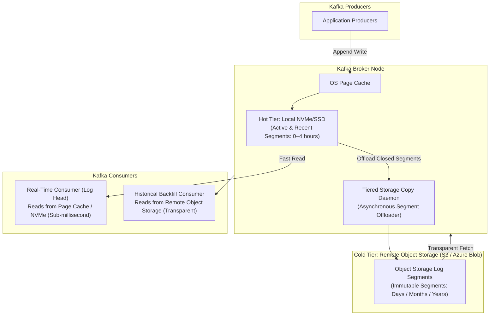

# Uber Kafka at Trillions Scale — Key Takeaways

> **Parent**: [Messaging & Event Streaming](index.md)  
> **Source**: [How Uber Handles Trillions of Kafka Messages Without Bringing Everything Down](../../articles/messaging/how-uber-handles-trillions-of-kafka-messages-without-bringing-everything-down.md)  
> **Author**: The Atomic Architect  
> **Taxonomy Reference**: §3.3 Event-Driven & Messaging  

## Contents

| ID | Problem | Key Concept |
|:---|:---|:---|
| [`broker-147`](#broker-147-federated-kafka-clusters-vs-monolithic-cluster-blast-radius) | Vertically scaling a single shared Kafka cluster creates a company-wide single failure domain | Federated clusters, horizontal cluster-level sharding, workload/criticality isolation, routing layer abstraction |
| [`broker-148`](#broker-148-decoupled-replication-coordination-via-ureplicator--apache-helix) | Native MirrorMaker consumer group rebalances stall cross-cluster and cross-region replication fleets | Decoupled replication topology, Apache Helix centralized assignment, localized handoff without stop-the-world pauses |
| [`broker-149`](#broker-149-end-to-end-pipeline-auditing--message-loss-observability-via-chaperone) | Statistically inevitable message loss across distributed networks and buffers goes unnoticed until customer-impacting silent state divergence | Tier-by-tier checkpoint auditing, aggregate timestamp window accounting, deterministic loss localization |
| [`broker-150`](#broker-150-consumer-proxy-abstraction-layer-for-microservice-fleets) | Forcing thousands of polyglot microservice teams to manage low-level Kafka consumer mechanics (rebalance, heartbeats, offsets) causes widespread outages | Consumer proxy pattern, centralized backpressure and rebalance coordination, gRPC/RPC consumer interface |
| [`broker-151`](#broker-151-poison-pill-isolation-via-dlq--first-class-intentional-replay) | A single malformed or unprocessable record blocks partition consumption head-of-line under strict ordering | Non-blocking dead-letter queues, operationalized replay runbooks, decoupling immediate progress from incident triage |
| [`broker-152`](#broker-152-kafka-tiered-storage-hot-nvme-vs-cold-object-store-economics) | Retaining petabytes of historical event logs on broker-local NVMe disks creates cost and disk-rebalance ceilings | Tiered storage architecture, local NVMe hot segment tier, remote object storage cold log offloading |

---

## broker-147: Federated Kafka Clusters vs. Monolithic Cluster Blast Radius

| | |
|:---|:---|
| **Problem** | As messaging throughput increases into millions of events per second across hundreds of teams, the default instinct is to scale the existing Kafka cluster "vertically" (adding more brokers, partitions, and disks). However, a single giant cluster remains a unified blast radius: a bad broker hardware crash, a misconfigured client topic flood, a runaway consumer rebalance, or a Zookeeper/KRaft metadata lock-up degrades or takes down the entire company's messaging backbone simultaneously, transforming an isolated service failure into an enterprise outage. |
| **Root cause** | Treating a message broker cluster as an infinitely expandable monolith, failing to isolate failure domains across distinct business criticality tiers and geographical boundaries. |

**Strategy**: Go wide instead of endlessly tall by deploying **Federated Kafka Clusters**:
1. **Workload & Criticality Segmentation**: Split the messaging fleet into dedicated clusters partitioned by business domain, SLA, and traffic profile (e.g., Tier-0 core ride matching and payments vs. Tier-2 background analytics and logging).
2. **Routing Abstraction Layer**: Producers publish to a logical topic name via a client-side routing library or front-end proxy that maps logical topics to specific physical clusters. Applications remain oblivious to physical broker cluster topologies.
3. **Capacity & Operational Isolation**: Cluster maintenance, OS patching, rolling upgrades, and configuration adjustments are confined to a single federation island, preventing catastrophic cross-tenant cascading degradation.



**Tradeoff**: Increases fleet management overhead (monitoring multiple clusters, balancing capacity across clusters); requires cross-cluster replication infrastructure when data must cross federation boundaries.

> **Dictionary**: [Federated Kafka Clusters](../../reference-dictionary/messaging.md#federated-kafka-clusters), [Distributed Commit Log](../../reference-dictionary/messaging.md#distributed-commit-log), [Bulkhead](../../reference-dictionary/resilience.md#bulkhead)  
> **Azure**: [Azure Event Hubs Dedicated Tier](../../architecture-azure/integration/event-hubs/azure-event-hubs-tiers.md)  
> **Related**: [`broker-111`](notifications-at-scale-takeaways.md#broker-111-synchronous-in-request-loops-cause-api-collapse), [`broker-128`](event-driven-architecture-questions-takeaways.md#broker-128-anti-degradation-governance-against-eda-distributed-monoliths), [`resilience-01`](../resilience/resilience-patterns.md#resilience-01-otp-service-fails-during-peak-traffic)  

---

## broker-148: Decoupled Replication Coordination via uReplicator & Apache Helix

| | |
|:---|:---|
| **Problem** | When replicating hundreds of thousands of topic-partitions across federated clusters and multi-region active-active datacenters using standard Kafka MirrorMaker 1.0, consumer group coordination becomes a devastating bottleneck. Whenever a topic is added, a partition is rebalanced, or a replication worker process dies, Kafka triggers a consumer group rebalance that halts data consumption across the entire replication fleet ("stop-the-world" pause), causing catastrophic replication lag and cross-region event starvation. |
| **Root cause** | MirrorMaker 1.0 relied on standard Kafka high-level consumer groups where partition assignment and data consumption are tightly coupled within the worker processes, subjecting the replication fleet to frequent full-group rebalances. |

**Strategy**: Decouple **coordination** from **data transport** using an external cluster manager (Uber's **uReplicator** built on Apache Helix):
1. **Centralized Controller Layer (Apache Helix)**: A dedicated controller maintains the mapping of topic-partitions to replication workers. It manages failover, partition redistribution, and leader-standby state dynamically without triggering consumer rebalances.
2. **Stateless Worker Pool**: uReplicator worker nodes run simple consumer loops assigned specific partitions directly by the controller. If a worker fails, Helix reassigns only the affected partitions to healthy workers.
3. **Localized Handoff vs. Fleet Pause**: Reassignment occurs in milliseconds without pausing unrelated partitions or triggering cluster-wide rebalances. uReplicator also automates dynamic topic discovery and traffic-based partition scaling.



**Tradeoff**: Introduces additional coordination infrastructure (Apache Helix / Zookeeper / KRaft dependencies) and operational complexity compared to stock MirrorMaker 2 (KIP-382).

> **Dictionary**: [uReplicator](../../reference-dictionary/messaging.md#ureplicator), [Rebalance](../../reference-dictionary/messaging.md#rebalance), [Consumer Group](../../reference-dictionary/messaging.md#consumer-group)  
> **Azure**: [Azure Event Hubs Geo-Replication & Disaster Recovery](../../architecture-azure/integration/event-hubs/azure-event-hubs-tiers.md)  
> **Related**: [`broker-103`](kafka-pipeline-bottlenecks.md#broker-103-adding-consumers-can-make-the-system-slower), [`broker-120`](event-driven-architecture-questions-takeaways.md#broker-120-tripartite-separation-of-event-loss-duplicates-and-reprocessing)  

---

## broker-149: End-to-End Pipeline Auditing & Message Loss Observability via Chaperone

| | |
|:---|:---|
| **Problem** | In high-throughput distributed architectures streaming trillions of messages daily across edge proxies, regional message buses, replication links, and database sinks, occasional message loss is statistically inevitable (due to socket dropouts, buffer overflows, broker crash edge cases, or silent client serialization bugs). Teams discover message loss days or weeks later when financial ledgers or analytics read models diverge, with zero diagnostic visibility into where or when the records disappeared. |
| **Root cause** | Relying on qualitative assumptions ("Kafka guarantees at-least-once") without independent, end-to-end accounting checkpoints across the ingestion, transit, and consumption tiers. |

**Strategy**: Build an independent, tier-by-tier auditing system (**Chaperone Pattern**):
1. **Tiered Checkpoint Accounting**: Embed audit counters at key architectural boundaries:
   - **Tier 1 (Ingestion)**: Edge API gateway / producer client proxy
   - **Tier 2 (Regional Storage)**: Regional Kafka broker ingress
   - **Tier 3 (Aggregated Storage)**: Cross-datacenter aggregation Kafka cluster
   - **Tier 4 (Egress & Sink)**: Consumer proxy and database persistence sinks
2. **Time-Bucketed Aggregate Counts**: Producers and intermediaries aggregate message counts into fixed time windows (e.g., 10-minute buckets based on event creation timestamps) tagged by topic and tier.
3. **Automated Loss Detection & Discrepancy Localization**: The audit collector continuously compares message counts across adjacent tiers for each time bucket. If Tier 1 emitted 10,000,000 messages for a time window but Tier 2 received only 9,999,972, an alert fires instantly targeting the Tier 1 → Tier 2 transit pipe, isolating the fault domain within minutes.



**Tradeoff**: Adds telemetry bandwidth and requires dedicated stream processing infrastructure to collect, window, and reconcile audit metrics in near real time.

> **Dictionary**: [Pipeline Audit Service (Chaperone Pattern)](../../reference-dictionary/messaging.md#pipeline-audit-service-chaperone-pattern), [At-Least-Once Semantics](../../reference-dictionary/messaging.md#at-least-once-semantics), [Observability](../../reference-dictionary/observability.md#observability)  
> **Azure**: [Azure Monitor Architecture](../../architecture-azure/observability/azure-monitor/azure-monitor-details.md)  
> **Related**: [`broker-139`](event-driven-business-consistency-takeaways.md#broker-139-operational-discard-observability-vs-dead-letter-queue-pollution), [`broker-142`](event-loss-duplicates-reprocessing-takeaways.md#broker-142-producer--broker-durability-invariants-vs-un-replicated-leader-data-loss), [`arch-10`](../software-architecture/architecture-principles.md#arch-10-observability)  

---

## broker-150: Consumer Proxy Abstraction Layer for Microservice Fleets

| | |
|:---|:---|
| **Problem** | Exposing raw Kafka client SDKs to thousands of polyglot microservice developers creates massive organizational liability. Application developers inadvertently misconfigure heartbeat intervals, trigger rebalance storms during long processing pauses, mismanage commit semantics, ignore backpressure, or leak consumer group connections. As Kafka client libraries require updates or cluster endpoints migrate, coordinating upgrades across thousands of repositories becomes an intractable multi-year effort. |
| **Root cause** | Leaking infrastructure-level message broker mechanics (partition assignment, thread management, heartbeats, offset commits) into business domain application code. |

**Strategy**: Insert a centralized, dedicated **Consumer Proxy Layer**:
1. **Simplified Developer Contract**: Applications do not import Kafka consumer libraries or manage partition lifecycles. Instead, the proxy delivers messages to the application over standard high-performance protocols (e.g., gRPC push or pull HTTP/2). The application contract simplifies to: *"Receive message batch -> Process business logic -> Acknowledge status (ACK/NACK/RETRY)"*.
2. **Centralized Protocol & Lifecycle Management**: The proxy cluster owns partition assignment, Kafka consumer group heartbeats, group rebalancing, and offset commits. If an application instance crashes, the proxy manages backpressure and retry buffers centrally without causing a Kafka rebalance storm.
3. **Transparent Protocol & Cluster Evolution**: Cluster endpoint migrations, SASL/mTLS rotation, and broker upgrades occur entirely within the proxy tier with zero changes required in application codebases.



**Tradeoff**: Adds an extra network hop (typically <2ms over local gRPC); introduces an additional proxy tier that must be sized, scaled, and operated.

> **Dictionary**: [Consumer Proxy Pattern](../../reference-dictionary/messaging.md#consumer-proxy-pattern), [Competing Consumers](../../reference-dictionary/messaging.md#competing-consumers), [Proxy Pattern](../../reference-dictionary/design-patterns.md#proxy-pattern)  
> **Azure**: [Azure Service Bus Messaging Architecture](../../architecture-azure/integration/service-bus/azure-service-bus-tiers.md)  
> **Related**: [`broker-102`](kafka-pipeline-bottlenecks.md#broker-102-the-first-bottleneck-is-never-kafka), [`broker-103`](kafka-pipeline-bottlenecks.md#broker-103-adding-consumers-can-make-the-system-slower), [`broker-105`](kafka-pipeline-bottlenecks.md#broker-105-one-slow-event-blocks-an-entire-partition)  

---

## broker-151: Poison Pill Isolation via DLQ & First-Class Intentional Replay

| | |
|:---|:---|
| **Problem** | When a consumer encounters a "poison pill" message (e.g., malformed JSON, schema violation, unexpected null field, or downstream non-retryable dependency error), naive retry loops halt partition consumption indefinitely due to Kafka's strict partition ordering. Downstream lag climbs uncontrollably. Conversely, if teams handle this by simply dropping bad messages, data is lost permanently. When recovery is needed, teams resort to ad-hoc emergency rituals (manually resetting offsets via CLI in production), frequently causing massive duplicate processing waves or secondary incidents. |
| **Root cause** | Lacking automated non-blocking isolation for unprocessable records and treating stream reprocessing as an emergency manual intervention rather than a first-class architectural capability. |

**Strategy**: Combine **Non-Blocking Dead-Letter Queues (DLQ)** with **Automated Operational Replay**:
1. **Bounded Retry with Non-Blocking Dead-Letter Routing**: After a configurable number of retries (e.g., 3 attempts with exponential jittered backoff), the consumer automatically extracts the offending record, wraps it with error context headers (error type, stack trace, timestamp, originating partition/offset), and routes it to a dedicated Dead Letter Queue topic. The consumer then commits the offset and continues processing subsequent healthy records.
2. **First-Class Operational Replay Service**: Treat replay as a standard software feature rather than a crisis intervention. A dedicated replay service reads records from the DLQ (or historical topic ranges) and allows operators to:
   - Inspect payloads and error metadata via UI/API
   - Fix downstream bugs or update schema definitions
   - Trigger filtered, throttled replay of specific error categories back into the main pipeline with strict rate limits



**Tradeoff**: Out-of-order processing for the failed record relative to subsequent records in the partition; requires consumers to be idempotent when messages are replayed.

> **Dictionary**: [Dead Letter Queue (DLQ)](../../reference-dictionary/messaging.md#dead-letter-queue-dlq), [Poison Message](../../reference-dictionary/messaging.md#poison-message), [Replay (Kafka Reprocessing)](../../reference-dictionary/messaging.md#replay-kafka-reprocessing)  
> **Azure**: [Azure Service Bus Dead-Letter Sub-Queues](../../architecture-azure/integration/service-bus/azure-service-bus-tiers.md)  
> **Related**: [`broker-107`](kafka-pipeline-bottlenecks.md#broker-107-poison-messages-need-dead-letter-queues), [`broker-144`](event-loss-duplicates-reprocessing-takeaways.md#broker-144-deterministic-consumer-replay--side-effect-gating-during-reprocessing), [`broker-146`](event-loss-duplicates-reprocessing-takeaways.md#broker-146-defense-in-depth-downstream-idempotency-keys-for-non-idempotent-side-effects)  

---

## broker-152: Kafka Tiered Storage: Hot NVMe vs. Cold Object Store Economics

| | |
|:---|:---|
| **Problem** | Modern event-driven architectures require long retention windows (weeks to months) for historical backfills, analytics model training, regulatory compliance, and disaster recovery. However, Kafka historically required all topic log segments to reside on broker-local NVMe/SSD storage. As retention requirements scale to petabytes, local storage costs explode, brokers require days or weeks to rebalance partitions during cluster re-sizing, and broker memory is exhausted managing local segment index cache lines. |
| **Root cause** | Coupling real-time messaging performance requirements with historical data storage capacity on expensive local physical disks. |

**Strategy**: Implement **Kafka Tiered Storage**:
1. **Two-Tier Storage Architecture**:
   - **Hot Storage Tier (Local Broker NVMe/SSD)**: Active and recently closed log segments (e.g., last 2–8 hours) remain on fast local disks. Real-time consumers reading at or near the log head achieve ultra-low tail latencies and high throughput directly from OS page cache.
   - **Cold Storage Tier (Remote Cloud Object Storage)**: As log segments roll past their hot retention threshold, background broker threads asynchronously offload the immutable segment files and index files to scalable, low-cost remote object storage (e.g., AWS S3, Azure Blob Storage).
2. **Transparent Read Abstraction**: Kafka brokers serve fetch requests seamlessly across both tiers. Real-time consumers read from local disk, while historical backfill consumers read through the broker from remote object storage without modifying client code or offsets.
3. **Decoupled Compute and Storage**: Brokers become virtually stateless compute engines for historical data. Adding new brokers or rebalancing partitions only requires transferring lightweight hot segments, reducing partition reassignment times from hours/days to minutes.



**Tradeoff**: Cold-tier fetches incur higher initial latency and network transfer egress costs; requires object storage availability and compatible Kafka versions supporting Tiered Storage (e.g., Kafka 3.6+ KIP-405 or enterprise distributions).

> **Dictionary**: [Kafka Tiered Storage](../../reference-dictionary/messaging.md#kafka-tiered-storage), [Distributed Commit Log](../../reference-dictionary/messaging.md#distributed-commit-log), [Compact Object Headers](../../reference-dictionary/java-jvm.md#compact-object-headers)  
> **Azure**: [Azure Blob Storage Cold Tier & Lifecycle Management](../../architecture-azure/data/storage/04-azure-storage-access-tiers-rehydration.md)  
> **Related**: [`broker-44`](kafka-data-state.md#broker-44-s3-archiving-for-infinite-event-retention), [`broker-59`](kafka-distributed-log-architecture.md#broker-59-distributed-commit-log-vs-centralized-queue), [`broker-87`](kafka-distributed-log-architecture.md#broker-87-log-segments--the-physical-storage-unit), [`db-27`](../databases/34-db-key-takeaways.md#db-27-quorum-based-hybrid-replication--rwn)  

---

## Summary of Takeaways

```json
[
  {
    "id": "broker-147",
    "title": "Federated Kafka Clusters vs. Monolithic Cluster Blast Radius",
    "problem": "Vertically scaling a single shared Kafka cluster creates an enterprise-wide single failure domain and blast radius",
    "strategy": "Partition cluster fleet by workload criticality, SLA, and region behind a client-side routing abstraction",
    "tradeoff": "Increases cluster fleet management overhead and requires cross-cluster replication tooling"
  },
  {
    "id": "broker-148",
    "title": "Decoupled Replication Coordination via uReplicator & Apache Helix",
    "problem": "Native MirrorMaker consumer group rebalances cause stop-the-world pauses across replication fleets",
    "strategy": "Decouple partition assignment from worker consumption using Apache Helix for localized failure handoffs",
    "tradeoff": "Introduces external coordination cluster dependencies and custom operational tooling"
  },
  {
    "id": "broker-149",
    "title": "End-to-End Pipeline Auditing & Message Loss Observability via Chaperone",
    "problem": "Silent transit message loss across complex distributed pipelines is detected only after data divergence occurs",
    "strategy": "Deploy independent checkpoint accounting to compare time-bucketed message counts across tier boundaries",
    "tradeoff": "Requires dedicated streaming audit infrastructure and metadata aggregation bandwidth"
  },
  {
    "id": "broker-150",
    "title": "Consumer Proxy Abstraction Layer for Microservice Fleets",
    "problem": "Forcing polyglot microservice developers to manage complex Kafka consumer lifecycles leads to widespread outages",
    "strategy": "Abstract broker consumer mechanics behind a centralized gRPC push/pull proxy tier with unified flow control",
    "tradeoff": "Adds a network hop (<2ms) and requires scaling and operating a separate proxy tier"
  },
  {
    "id": "broker-151",
    "title": "Poison Pill Isolation via DLQ & First-Class Intentional Replay",
    "problem": "Unprocessable malformed messages block partition consumption or are lost via silent drops",
    "strategy": "Route failed records after bounded retries to non-blocking DLQs and operationalize automated replay tooling",
    "tradeoff": "Breaks strict sequential processing order for failed records relative to subsequent partition messages"
  },
  {
    "id": "broker-152",
    "title": "Kafka Tiered Storage: Hot NVMe vs. Cold Object Store Economics",
    "problem": "Retaining petabytes of historical event logs on broker-local NVMe disks creates economic and rebalancing limits",
    "strategy": "Decouple hot active log segments on local NVMe from cold historical segments offloaded to cloud object storage",
    "tradeoff": "Higher latency when reading cold segments and reliance on remote cloud object store availability"
  }
]
```
